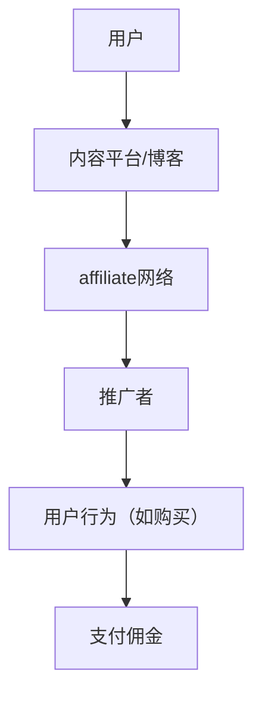

                 

 

> 关键词：affiliate营销，知识付费，推广策略，营销技巧，流量变现

> 摘要：本文将深入探讨如何利用affiliate营销策略来推广知识付费产品，从理论基础到实际操作，全面解析这一高效且流行的营销模式。

## 1. 背景介绍

知识付费产品近年来在全球范围内迅速崛起，成为教育、科技等多个行业的重要收入来源。随着互联网的普及和用户付费习惯的养成，知识付费市场展现出巨大的潜力。与此同时，affiliate营销作为一种低成本、高回报的推广方式，也越来越受到企业和个人的青睐。

### 什么是affiliate营销？

affiliate营销，又称联盟营销，是一种基于绩效的推广模式。在这个过程中，推广者（affiliate）通过自己的渠道（如网站、博客、社交媒体等）吸引潜在用户，当用户通过这些渠道完成特定行为（如购买、注册等）时，推广者将获得佣金回报。

### 知识付费产品的优势

- **内容优质**：知识付费产品通常是由专业人士或专家精心制作，具有较高的内容质量。
- **受众精准**：知识付费产品的目标客户群体明确，易于通过数据分析进行精准定位。
- **高转化率**：由于用户愿意为高质量的知识内容付费，所以转化率相对较高。

### affiliate营销的优势

- **低成本**：相比于传统广告，affiliate营销的投入成本较低。
- **效果可衡量**：推广效果可以通过数据实时跟踪和评估。
- **风险可控**：推广者只有在实际带来收益时才支付佣金，风险较低。

## 2. 核心概念与联系

下面我们将通过一个Mermaid流程图来展示affiliate营销的核心概念及其之间的联系。



### 2.1 用户行为分析

用户在 affiliate 营销中的行为分为几个阶段：

- **访问内容**：用户通过推广者的渠道访问知识付费产品。
- **兴趣产生**：用户对内容产生兴趣，考虑购买。
- **完成购买**：用户通过推广链接完成购买行为。

### 2.2 推广者策略

推广者需要：

- **内容创作**：创作与知识付费产品相关的高质量内容，吸引用户点击。
- **渠道选择**：选择合适的渠道进行推广，如社交媒体、电子邮件营销等。
- **数据追踪**：通过跟踪用户行为，优化推广策略。

### 2.3 支付佣金机制

佣金支付通常基于以下几种模式：

- **销售佣金**：根据实际销售额支付一定比例的佣金。
- **点击佣金**：用户点击推广链接后，支付一定的佣金。
- **注册佣金**：用户完成注册后，支付一定佣金。

## 3. 核心算法原理 & 具体操作步骤

### 3.1 算法原理概述

affiliate营销的核心算法是用户行为分析与数据追踪。通过以下步骤，可以优化推广效果：

1. **用户画像构建**：收集用户行为数据，构建用户画像。
2. **渠道分析**：分析不同渠道的转化率，选择最佳渠道。
3. **优化策略**：根据用户行为数据，调整推广策略。

### 3.2 算法步骤详解

#### 3.2.1 用户画像构建

- **数据收集**：通过网站访问日志、用户互动数据等收集用户行为数据。
- **特征提取**：提取用户性别、年龄、兴趣等特征，构建用户画像。

#### 3.2.2 渠道分析

- **数据整理**：整理各渠道的访问量、转化率等数据。
- **分析评估**：评估不同渠道的推广效果，选择最佳渠道。

#### 3.2.3 优化策略

- **A/B测试**：通过A/B测试，优化推广内容和渠道。
- **动态调整**：根据用户行为数据，动态调整推广策略。

### 3.3 算法优缺点

#### 优点

- **低成本**：相比传统广告，成本低，投入产出比高。
- **效果可衡量**：推广效果可以通过数据实时跟踪和评估。
- **风险可控**：推广者只有在实际带来收益时才支付佣金。

#### 缺点

- **依赖推广者**：推广者的质量和效率对整体推广效果有较大影响。
- **竞争激烈**：多个推广者争夺同一产品，可能导致佣金竞争激烈。

### 3.4 算法应用领域

affiliate营销在以下领域有广泛应用：

- **电子商务**：通过推广商品，实现流量变现。
- **在线教育**：推广课程、培训等知识付费产品。
- **互联网服务**：推广云服务、在线工具等。

## 4. 数学模型和公式 & 详细讲解 & 举例说明

### 4.1 数学模型构建

在affiliate营销中，关键指标包括点击率（CTR）、转化率（CVR）和平均订单价值（AOV）。以下是一个简单的数学模型：

$$
\text{销售额} = \text{CTR} \times \text{CVR} \times \text{AOV}
$$

### 4.2 公式推导过程

1. **点击率（CTR）**：用户点击推广链接的概率。
2. **转化率（CVR）**：点击用户完成购买的转化概率。
3. **平均订单价值（AOV）**：一次订单的平均金额。

### 4.3 案例分析与讲解

假设一个知识付费产品的CTR为2%，CVR为10%，AOV为500元，则：

$$
\text{销售额} = 2\% \times 10\% \times 500 = 10 \text{元}
$$

这意味着每次点击可以为推广者带来10元的收入。为了提高销售额，可以通过提高CTR、CVR或AOV来实现。

## 5. 项目实践：代码实例和详细解释说明

### 5.1 开发环境搭建

- **工具**：Python、Pandas、Matplotlib
- **依赖库**：pip install pandas matplotlib

### 5.2 源代码详细实现

以下是一个简单的Python代码实例，用于分析affiliate营销数据：

```python
import pandas as pd
import matplotlib.pyplot as plt

# 加载数据
data = pd.read_csv('affiliate_data.csv')

# 数据预处理
data['Date'] = pd.to_datetime(data['Date'])
data.set_index('Date', inplace=True)

# 计算指标
data['CTR'] = data['Clicks'] / data['Visits']
data['CVR'] = data['Sales'] / data['Clicks']
data['AOV'] = data['Sales'] / data['Orders']

# 绘制图表
data[['CTR', 'CVR', 'AOV']].plot()
plt.title('Affiliate Marketing Performance')
plt.xlabel('Date')
plt.ylabel('Rate')
plt.show()
```

### 5.3 代码解读与分析

- **数据加载与预处理**：加载数据，将日期转换为索引。
- **指标计算**：计算CTR、CVR和AOV。
- **图表绘制**：绘制性能图表，便于分析。

### 5.4 运行结果展示

运行结果将显示CTR、CVR和AOV随时间变化的趋势，有助于分析推广策略的优化方向。

## 6. 实际应用场景

### 6.1 在线教育

通过affiliate营销，教育机构可以与博客作者、YouTube主播合作，推广在线课程、培训等知识付费产品。例如，一位科技博主可以推荐一门编程课程，用户通过其链接购买，博主获得一定比例的佣金。

### 6.2 电子书销售

出版社可以利用affiliate营销，与知名书评人、博客合作，推广新书。当用户通过推广链接购买，推广者获得佣金。

### 6.3 软件工具推广

软件开发公司可以通过affiliate营销，与行业专家合作，推广自己的在线工具。例如，一个数据分析工具的推广者可以为用户提供试用链接，用户注册后，推广者获得佣金。

## 7. 未来应用展望

随着人工智能和大数据技术的发展，affiliate营销将更加智能化、个性化。未来，推广者可以利用机器学习算法，预测用户行为，优化推广策略。同时，知识付费产品也将不断创新，提供更多优质内容，满足用户需求。

## 8. 工具和资源推荐

### 8.1 学习资源推荐

- **书籍**：《Affiliate Marketing for Dummies》
- **在线课程**：Udemy、Coursera上的affiliate营销相关课程

### 8.2 开发工具推荐

- **数据分析工具**：Google Analytics、Mixpanel
- **营销自动化工具**：Mailchimp、HubSpot

### 8.3 相关论文推荐

- **“Affiliate Marketing: A Study on Its Characteristics and Effectiveness”**
- **“The Impact of Affiliate Marketing on Online Sales”**

## 9. 总结：未来发展趋势与挑战

### 9.1 研究成果总结

affiliate营销在提高销售额、降低推广成本方面表现出色。通过数据分析和算法优化，推广效果不断提升。

### 9.2 未来发展趋势

- **智能化**：利用人工智能技术，实现个性化推广。
- **跨界合作**：知识付费产品与其他行业结合，拓宽市场。

### 9.3 面临的挑战

- **监管**：随着市场规模扩大，监管政策可能趋于严格。
- **竞争**：市场竞争激烈，佣金竞争可能导致推广者流失。

### 9.4 研究展望

未来，affiliate营销将不断融合新技术，提供更精准、高效的推广服务。同时，知识付费产品也将不断创新，满足用户多元化需求。

## 9. 附录：常见问题与解答

### Q：affiliate营销的佣金支付模式有哪些？

A：常见的佣金支付模式包括销售佣金、点击佣金和注册佣金。销售佣金根据实际销售额支付，点击佣金根据用户点击行为支付，注册佣金根据用户完成注册行为支付。

### Q：如何选择合适的affiliate营销平台？

A：选择合适的affiliate营销平台应考虑以下因素：

- **佣金比例**：选择佣金比例较高的平台。
- **产品多样性**：平台提供的产品种类是否丰富。
- **支持服务**：平台提供的支持服务是否完善。
- **佣金支付**：平台的佣金支付方式是否灵活。

### Q：如何优化affiliate营销效果？

A：优化affiliate营销效果可以从以下几个方面入手：

- **内容创作**：创作与目标用户相关的高质量内容。
- **渠道选择**：选择转化率较高的推广渠道。
- **数据分析**：通过数据分析，优化推广策略。
- **A/B测试**：通过A/B测试，找出最优的推广方案。

---

作者：禅与计算机程序设计艺术 / Zen and the Art of Computer Programming
----------------------------------------------------------------

以上就是关于如何利用affiliate营销推广知识付费产品的详细文章。希望通过这篇文章，读者能够对affiliate营销有更深入的了解，并在实际操作中取得更好的效果。在未来，随着技术的不断进步，affiliate营销将继续发挥其强大的潜力，为企业和个人带来更多的机遇。

