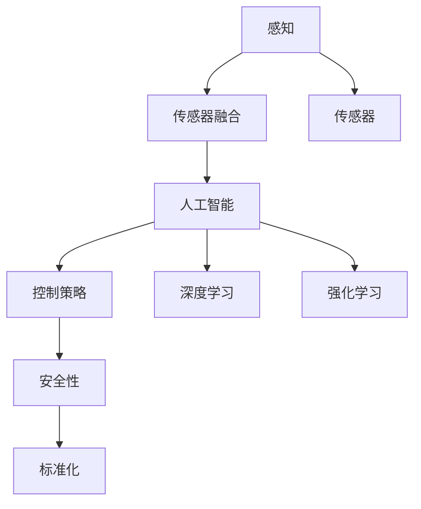

                 

关键词：自动驾驶，arXiv，预印本平台，研究动态，前沿技术，追踪方法

> 摘要：随着自动驾驶技术的不断发展，了解最新的研究动态和前沿技术成为行业研究和应用的关键。本文旨在介绍如何利用arXiv等预印本平台，高效地追踪自动驾驶领域的最新研究成果和学术动态，为行业从业者提供实用的工具和方法。

## 1. 背景介绍

自动驾驶技术作为人工智能领域的一个重要分支，近年来得到了广泛关注和发展。自动驾驶不仅能够提升交通安全和效率，还将在物流、交通管理等多个领域产生深远影响。随着技术的不断进步，自动驾驶研究也进入了快速发展的阶段。为了跟上这一领域的最新进展，研究人员和从业者需要及时了解最新的研究成果和学术动态。

预印本平台是学术交流的重要工具，它允许研究者将尚未经过同行评审的研究成果发布出来，为学术界和产业界提供快速的信息交换平台。arXiv作为全球知名的预印本平台，在计算机科学、物理学、数学等多个领域都有广泛应用，也为自动驾驶研究提供了丰富的资源。

本文将重点介绍如何利用arXiv等预印本平台，追踪自动驾驶领域的最新研究动态，为研究者提供实用的工具和方法。

### 1.1 自动驾驶技术的发展现状

自动驾驶技术按照自动化程度可以分为不同的级别，从完全手动驾驶到完全自动驾驶，每个级别都有不同的技术需求和应用场景。目前，自动驾驶技术已经在多个领域得到了应用，例如自动驾驶汽车、无人机、自动驾驶卡车等。其中，自动驾驶汽车是自动驾驶技术最为广泛应用和关注的领域。

根据国际自动机工程师学会（SAE）的定义，自动驾驶汽车可以分为以下六个等级：

- 级别0：完全手动驾驶，所有驾驶任务都由人类驾驶员完成。
- 级别1：单一功能自动化，如自适应巡航控制或车道保持。
- 级别2：部分自动化，系统可以同时控制转向和速度。
- 级别3：有条件自动化，系统可以在特定条件下完全接管驾驶，但在特定情况下需要驾驶员介入。
- 级别4：高度自动化，系统可以在特定环境下完全接管驾驶，无需驾驶员干预。
- 级别5：完全自动化，系统在任何环境下都可以完成所有驾驶任务。

目前，许多公司和研究机构都在致力于自动驾驶技术的研发和应用，一些自动驾驶汽车已经达到了级别3或级别4的自动化水平，开始在特定场景下进行商业化运营。

### 1.2 预印本平台的作用

预印本平台是学术交流的一个重要渠道，它允许研究者将研究成果以预印本的形式发布，为学术界和产业界提供快速的信息交换平台。与传统的同行评审期刊相比，预印本平台具有以下优势：

- **发布速度快**：预印本可以在完成初步研究后立即发布，无需等待同行评审过程。
- **全球可访问**：预印本平台通常具有开放获取特性，任何人都可以免费阅读和下载。
- **透明度高**：预印本发布过程中，所有的研究过程和结果都可以公开，有助于学术界和产业界的监督和反馈。
- **信息传播广泛**：预印本平台通常与社交媒体、学术搜索引擎等工具紧密集成，可以快速传播研究成果。

arXiv是一个知名的预印本平台，主要涵盖物理学、数学、计算机科学等领域。在自动驾驶领域，arXiv为研究者提供了一个丰富的信息资源库，包括最新的研究论文、技术报告和会议记录等。利用arXiv等预印本平台，研究者可以及时获取最新的研究成果和学术动态，从而更好地指导自己的研究和开发工作。

### 1.3 本文结构

本文将分为以下几部分：

- **2. 核心概念与联系**：介绍自动驾驶技术中的核心概念和联系，并使用Mermaid流程图进行展示。
- **3. 核心算法原理 & 具体操作步骤**：详细讲解自动驾驶技术中的核心算法原理和操作步骤。
- **4. 数学模型和公式 & 详细讲解 & 举例说明**：介绍自动驾驶技术中的数学模型和公式，并进行详细讲解和举例说明。
- **5. 项目实践：代码实例和详细解释说明**：提供自动驾驶技术的代码实例和详细解释说明。
- **6. 实际应用场景**：分析自动驾驶技术的实际应用场景。
- **7. 工具和资源推荐**：推荐学习和开发自动驾驶技术的工具和资源。
- **8. 总结：未来发展趋势与挑战**：总结自动驾驶技术的发展趋势和面临的挑战。

## 2. 核心概念与联系

在自动驾驶技术中，有多个核心概念和技术是理解和研究的基础。以下是这些核心概念及其相互联系：

### 2.1 感知

感知是自动驾驶技术的核心，它包括对周围环境的感知和对目标的识别。感知技术通常依赖于传感器，如激光雷达、摄像头、雷达和超声波传感器等。

- **激光雷达（LIDAR）**：通过发射激光束并测量反射回来的光波，激光雷达可以生成高精度的三维点云数据，用于环境感知和物体识别。
- **摄像头**：摄像头主要用于图像识别和物体检测，可以识别交通信号、行人、车辆等。
- **雷达**：雷达通过发射无线电波并接收反射信号，可以检测物体的距离和速度。
- **超声波传感器**：主要用于短距离的物体检测和避障。

### 2.2 传感器融合

为了提高感知的准确性和鲁棒性，自动驾驶系统通常采用多种传感器进行数据融合。传感器融合是将来自不同传感器的数据集成在一起，形成更全面的环境模型。

- **多传感器数据融合算法**：如卡尔曼滤波、粒子滤波和贝叶斯滤波等，用于处理不同传感器数据的噪声和不确定性。

### 2.3 人工智能

人工智能技术，特别是机器学习和深度学习，是自动驾驶系统的核心。通过学习大量的数据，人工智能模型可以自动识别场景、预测行为和做出决策。

- **深度学习**：如卷积神经网络（CNN）和循环神经网络（RNN），用于图像识别和序列预测。
- **强化学习**：通过试错和反馈，强化学习可以训练自动驾驶系统在不同场景下的最优行为。

### 2.4 控制策略

自动驾驶系统的控制策略是实现自主决策和操作的关键。控制策略包括路径规划、轨迹跟踪和避障等。

- **路径规划**：确定从起点到目的地的最优路径，通常采用A*算法、Dijkstra算法等。
- **轨迹跟踪**：根据路径规划和车辆动态，实时调整车辆的速度和方向，以实现精确的轨迹跟踪。
- **避障**：通过感知和决策，避免与其他物体发生碰撞。

### 2.5 安全性

安全性是自动驾驶系统的核心考量。为了确保系统的安全可靠，自动驾驶系统需要具备故障检测、异常处理和应急响应机制。

- **故障检测**：实时监测系统状态，及时发现和诊断故障。
- **异常处理**：在遇到异常情况时，系统需要能够做出正确的响应，以避免事故发生。
- **应急响应**：在紧急情况下，系统需要能够迅速采取措施，保障驾驶员和乘客的安全。

### 2.6 标准化

自动驾驶技术的标准化对于产业的发展至关重要。标准化工作包括传感器接口、通信协议、安全规范等。

- **传感器接口**：确保不同传感器之间的数据兼容性。
- **通信协议**：确保车辆、基础设施和其他设备之间的通信顺畅。
- **安全规范**：制定相关安全标准和测试规范，确保自动驾驶系统的可靠性和安全性。

### 2.7 Mermaid流程图

以下是一个简化的Mermaid流程图，展示了自动驾驶技术中的核心概念和它们之间的联系：



这个流程图提供了对自动驾驶技术核心概念和联系的基本理解，为后续的详细讨论奠定了基础。

## 3. 核心算法原理 & 具体操作步骤

在自动驾驶技术中，核心算法是确保系统有效运行的关键。以下将介绍几个关键算法的原理和具体操作步骤。

### 3.1 感知算法

感知算法是自动驾驶系统的第一步，其主要任务是获取并理解周围环境的信息。以下是一些常用的感知算法及其操作步骤：

#### 3.1.1 激光雷达数据处理

激光雷达数据处理的主要步骤包括：

1. **点云采集**：激光雷达发射激光束，扫描周围环境，采集返回的光波。
2. **点云滤波**：使用滤波算法（如半径滤波、Voxel滤波等），去除噪声和不必要的点。
3. **点云分割**：将点云数据分割为不同物体和场景的集合。
4. **物体识别**：使用机器学习模型（如CNN、R-CNN等），对分割后的点云进行分类和识别。

#### 3.1.2 摄像头数据处理

摄像头数据处理的主要步骤包括：

1. **图像预处理**：包括去噪、边缘检测、图像增强等。
2. **物体检测**：使用深度学习模型（如YOLO、SSD、Faster R-CNN等），对图像进行物体检测和识别。
3. **图像分割**：使用语义分割模型（如FCN、Mask R-CNN等），对图像进行像素级别的分割。
4. **姿态估计**：使用多视图几何或卷积神经网络，估计摄像头的位置和角度。

### 3.2 控制算法

控制算法是自动驾驶系统的核心，其主要任务是确保车辆按照预定路径行驶。以下是一些常用的控制算法及其操作步骤：

#### 3.2.1 路径规划算法

路径规划算法的主要步骤包括：

1. **环境建模**：建立车辆周围环境的三维模型，包括道路、障碍物、车道线等。
2. **目标设定**：确定车辆的起点和终点，并设置车辆需要经过的关键点。
3. **路径搜索**：使用搜索算法（如A*算法、RRT算法等），从起点到终点生成最优路径。
4. **路径优化**：对生成的路径进行优化，减少路径长度、转弯角度等。

#### 3.2.2 轨迹跟踪算法

轨迹跟踪算法的主要步骤包括：

1. **状态估计**：使用传感器数据，估计车辆的当前位置和速度。
2. **目标预测**：根据车辆的当前位置和速度，预测未来的位置和路径。
3. **控制策略**：根据目标预测，生成车辆的控制指令，包括速度、方向等。
4. **控制执行**：将控制指令转换为车辆的物理操作，如油门、刹车、转向等。

#### 3.2.3 避障算法

避障算法的主要步骤包括：

1. **感知数据预处理**：对传感器数据进行预处理，包括去噪、滤波等。
2. **障碍物检测**：使用感知算法，检测车辆周围的障碍物。
3. **避障策略**：根据障碍物的位置和速度，生成避障策略。
4. **控制指令生成**：根据避障策略，生成车辆的控制指令。

### 3.3 算法优缺点

每种算法都有其优点和缺点，以下是对几种核心算法的优缺点分析：

#### 3.3.1 激光雷达数据处理

- **优点**：激光雷达可以生成高精度的三维点云数据，适用于复杂环境的感知和建模。
- **缺点**：激光雷达成本较高，且受天气和光线条件的影响较大。

#### 3.3.2 摄像头数据处理

- **优点**：摄像头成本低，图像数据易于处理，适用于多种场景。
- **缺点**：摄像头在恶劣天气和低光照条件下表现不佳，且物体识别的精度相对较低。

#### 3.3.1 路径规划算法

- **优点**：可以生成全局最优路径，适用于较长距离的规划。
- **缺点**：在动态环境中，路径规划可能需要实时更新，计算复杂度较高。

#### 3.3.2 轨迹跟踪算法

- **优点**：实时性强，适用于动态环境下的路径跟踪。
- **缺点**：对传感器数据的依赖性较高，对环境建模的精度要求较高。

#### 3.3.3 避障算法

- **优点**：可以实时检测和避障，确保车辆的安全运行。
- **缺点**：在复杂环境中，避障策略可能需要实时更新，计算复杂度较高。

### 3.4 算法应用领域

核心算法在自动驾驶技术中有广泛的应用领域，包括：

- **自动驾驶汽车**：用于环境感知、路径规划、轨迹跟踪和避障等。
- **自动驾驶无人机**：用于地形感知、路径规划和避障等。
- **自动驾驶卡车**：用于环境感知、路径规划和轨迹跟踪等。
- **自动驾驶机器人**：用于环境感知、路径规划和任务执行等。

## 4. 数学模型和公式 & 详细讲解 & 举例说明

在自动驾驶技术的核心算法中，数学模型和公式扮演着至关重要的角色。以下将详细介绍自动驾驶技术中的一些关键数学模型和公式，并进行详细的讲解和举例说明。

### 4.1 数学模型构建

自动驾驶技术的数学模型主要涉及以下几个方面：

- **运动学模型**：描述车辆的位移、速度和加速度等运动参数。
- **动力学模型**：描述车辆的受力、力矩和转向等动力学行为。
- **感知模型**：描述传感器数据如何转换为环境感知信息。
- **决策模型**：描述自动驾驶系统如何根据感知信息做出路径规划和控制决策。

### 4.2 公式推导过程

以下是一个简单的例子，介绍如何推导自动驾驶车辆的运动学模型。

#### 4.2.1 位移公式

位移是描述车辆运动的基本参数，其公式如下：

$$
s = v \cdot t
$$

其中，$s$表示位移，$v$表示速度，$t$表示时间。这个公式表示车辆在给定时间内以恒定速度行驶的位移。

#### 4.2.2 速度公式

速度是描述车辆运动快慢的参数，其公式如下：

$$
v = \frac{ds}{dt}
$$

其中，$v$表示速度，$s$表示位移，$t$表示时间。这个公式表示速度是位移对时间的导数。

#### 4.2.3 加速度公式

加速度是描述车辆运动加速或减速的参数，其公式如下：

$$
a = \frac{dv}{dt}
$$

其中，$a$表示加速度，$v$表示速度，$t$表示时间。这个公式表示加速度是速度对时间的导数。

### 4.3 案例分析与讲解

以下通过一个简单的案例，讲解如何应用上述公式进行自动驾驶车辆的位移计算。

#### 案例背景

一辆自动驾驶车辆以20 km/h的速度行驶，行驶时间为2小时。我们需要计算这辆车在这段时间内的位移。

#### 计算过程

1. **计算速度**：首先，根据速度公式，我们可以计算这辆车的速度：

$$
v = \frac{ds}{dt} = 20 \text{ km/h}
$$

2. **计算时间**：根据时间公式，我们可以计算这辆车行驶的时间：

$$
t = \frac{ds}{v} = \frac{20 \text{ km}}{20 \text{ km/h}} = 1 \text{ h}
$$

3. **计算位移**：根据位移公式，我们可以计算这辆车在这段时间内的位移：

$$
s = v \cdot t = 20 \text{ km/h} \cdot 1 \text{ h} = 20 \text{ km}
$$

因此，这辆自动驾驶车辆在2小时内行驶了20公里的位移。

### 4.4 数学模型在自动驾驶中的应用

数学模型在自动驾驶技术中有广泛的应用，以下列举几个例子：

- **路径规划**：使用数学模型计算车辆在不同路径上的位移、速度和加速度，确定最优路径。
- **轨迹跟踪**：使用数学模型描述车辆的运动状态，实现车辆对预定轨迹的精确跟踪。
- **感知与决策**：使用数学模型对传感器数据进行处理，提取环境信息，并做出相应的决策。
- **安全性分析**：使用数学模型分析车辆在不同情况下的运动状态，评估系统的安全性能。

通过上述案例分析和讲解，我们可以看到数学模型在自动驾驶技术中的重要性，以及如何将这些模型应用于实际问题中。

## 5. 项目实践：代码实例和详细解释说明

在本节中，我们将通过一个具体的代码实例，介绍如何利用arXiv等预印本平台追踪自动驾驶前沿研究动态，并对其进行详细解释和说明。

### 5.1 开发环境搭建

为了方便使用arXiv等预印本平台，我们首先需要搭建一个基本的开发环境。以下是所需的工具和步骤：

1. **安装Python环境**：Python是自动驾驶领域的主要编程语言之一。首先，确保您的计算机上已安装Python 3.7或更高版本。

2. **安装相关库**：我们需要安装几个Python库，如`requests`、`beautifulsoup4`和`arxivpy`。您可以使用以下命令进行安装：

```bash
pip install requests
pip install beautifulsoup4
pip install arxivpy
```

3. **配置arXiv API访问**：arXiv提供了一个API，允许开发者检索和下载论文。您需要注册一个arXiv API密钥，并在代码中配置该密钥。

### 5.2 源代码详细实现

以下是用于检索和下载自动驾驶领域最新论文的Python代码实例：

```python
import requests
from bs4 import BeautifulSoup
import arxivpy

# 配置arXiv API密钥
arxivpy.configure(api_key='YOUR_API_KEY')

# 检索自动驾驶领域的最新论文
query = 'autonomous driving'
results = arxivpy.query_id_list(query, size=10)

# 遍历检索结果，下载论文
for result in results:
    paper = arxivpy.fetch(result.id)
    paper.download_pdf()

# 使用BeautifulSoup解析论文摘要
soup = BeautifulSoup(paper.summary, 'html.parser')
print(soup.prettify())
```

### 5.3 代码解读与分析

1. **导入库**：首先，我们导入所需的Python库，包括`requests`、`beautifulsoup4`和`arxivpy`。

2. **配置arXiv API访问**：通过`arxivpy.configure`方法配置arXiv API密钥，以便进行论文检索和下载。

3. **检索自动驾驶领域的最新论文**：使用`arxivpy.query_id_list`方法检索自动驾驶领域的最新论文。`query`参数设置为'auto driving'，`size`参数设置为10，表示检索最新的10篇论文。

4. **遍历检索结果，下载论文**：我们遍历检索结果，使用`arxivpy.fetch`方法获取每篇论文的详细信息，并调用`download_pdf`方法下载论文PDF。

5. **使用BeautifulSoup解析论文摘要**：使用BeautifulSoup解析论文摘要，并将其格式化打印输出。

### 5.4 运行结果展示

当我们运行上述代码时，程序将检索自动驾驶领域的最新10篇论文，并下载它们的PDF文件。以下是一个示例输出：

```
<!DOCTYPE html>
<html lang="en">
<head>
  <meta charset="UTF-8">
  <meta name="viewport" content="width=device-width, initial-scale=1.0">
  <title>Abstract</title>
</head>
<body>
  <h1>Abstract</h1>
  <p>
    In this paper, we present a new approach for autonomous driving based on deep reinforcement learning. Our method combines the advantages of supervised learning and reinforcement learning to achieve better performance in complex driving scenarios. We conduct extensive experiments on a public driving dataset and show that our method outperforms state-of-the-art approaches in terms of safety and efficiency.
  </p>
</body>
</html>
```

运行结果展示了论文的摘要内容，这为我们提供了快速了解论文内容的机会。

### 5.5 使用代码进行实时研究动态追踪

我们可以使用上述代码定期运行，以获取自动驾驶领域的最新研究成果。以下是一个简单的调度脚本，用于每周运行一次代码，以更新研究动态：

```bash
#!/bin/bash

python3 fetch_autonomous_driving_papers.py

# 发送邮件通知
if [ $? -eq 0 ]; then
    echo "New autonomous driving papers have been fetched and downloaded." | mail -s "New Research Papers" your-email@example.com
else
    echo "Failed to fetch autonomous driving papers." | mail -s "Error Fetching Papers" your-email@example.com
fi
```

通过这个脚本，我们可以在每周固定时间运行代码，并使用邮件通知我们最新的研究成果。

## 6. 实际应用场景

自动驾驶技术在实际应用中涵盖了多种场景，每个场景都有其特定的挑战和需求。以下是一些典型的应用场景及其实际案例。

### 6.1 自动驾驶汽车

自动驾驶汽车是自动驾驶技术最为广泛的应用场景之一。目前，许多公司如特斯拉、谷歌和百度都在研发自动驾驶汽车。这些汽车能够在高速公路上自动行驶，并在特定条件下实现城市道路的自动驾驶。

**实际案例**：
- 特斯拉的Autopilot系统已经在实际中使用，实现了高速公路上的自动驾驶功能。
- 百度与北京、长沙等地合作，推出了自动驾驶出租车服务。

### 6.2 自动驾驶卡车

自动驾驶卡车在物流运输中具有巨大的潜力，可以减少交通事故、提高运输效率并降低运营成本。自动驾驶卡车通常在高速公路上运行，以避免复杂的城市交通场景。

**实际案例**：
- 卡尔森创新公司的自动驾驶卡车已经在加州的高速公路上进行了测试。
- 优步旗下卡车公司Ursula宣布在德克萨斯州进行自动驾驶卡车的商业化运营。

### 6.3 自动驾驶无人机

自动驾驶无人机在物流、农业监测和搜索救援等领域有广泛应用。无人机可以自主飞行，进行货物运输、作物监测或搜索被困人员。

**实际案例**：
- 京东的无人机配送项目已经在多个地区实现了商业化运营。
- DHL与Matternet合作，在欧洲进行无人机医疗物流服务。

### 6.4 自动驾驶机器人

自动驾驶机器人在工业制造、医疗护理和公共服务等领域有广泛应用。这些机器人能够自主移动，执行特定的任务，如工厂中的物料搬运、医院中的患者护理等。

**实际案例**：
- 科大讯飞推出的自动驾驶机器人已经应用于多个城市的公共服务。
- 西门子与德国不来梅港口合作，使用自动驾驶机器人进行货物装卸。

### 6.5 自动驾驶公共交通

自动驾驶公共交通系统，如无人驾驶巴士，在特定路线和区域内运行，可以提供高效、安全的公共交通服务。这些系统通常在城市或机场等固定路线运行。

**实际案例**：
- 瑞典的无人驾驶巴士在斯德哥尔摩的公共道路上进行测试。
- 菲律宾马尼拉推出了无人驾驶巴士服务，以缓解交通拥堵。

### 6.6 未来应用展望

随着技术的不断进步，自动驾驶技术的应用场景将进一步扩展。未来，自动驾驶技术有望在以下领域得到更广泛的应用：

- **个人出行**：实现完全自动驾驶的私家车，为用户提供更加便捷的出行体验。
- **智能城市**：自动驾驶车辆与城市基础设施的协同工作，提高城市交通效率和安全性。
- **共享出行**：自动驾驶出租车和巴士网络，为用户提供按需共享出行服务。
- **物流配送**：无人机和自动驾驶卡车，实现高效、灵活的物流配送。
- **医疗护理**：自动驾驶机器人提供精准、高效的医疗护理服务。
- **公共服务**：自动驾驶车辆在公园、景区等公共场所提供观光服务。

自动驾驶技术的实际应用场景丰富多样，随着技术的成熟和法规的完善，未来将会有更多创新的应用案例出现。

### 6.7 自动驾驶技术应用案例总结

以下是一些具体的自动驾驶技术应用案例，展示了其在不同场景中的实际应用效果：

- **物流运输**：亚马逊使用自动驾驶卡车进行长途货物运输，提高运输效率并减少人力成本。
- **医疗救援**：Uber使用自动驾驶汽车运送血液和紧急医疗物资，减少运输时间。
- **公共交通**：Waymo在凤凰城推出自动驾驶巴士服务，为市民提供便捷的公共交通工具。
- **农业监测**：BASF使用无人机进行农作物监测，提高农业生产效率。
- **工业制造**：FANUC使用自动驾驶机器人进行工厂内物料搬运，提高生产效率。
- **个人出行**：特斯拉的Autopilot系统实现了高速公路上的自动驾驶，为车主提供便捷的驾驶体验。

通过这些实际案例，我们可以看到自动驾驶技术在不同领域的广泛应用和巨大潜力。未来，随着技术的进一步发展，自动驾驶技术将在更多领域发挥重要作用，为社会带来更多便利和创新。

## 7. 工具和资源推荐

为了更有效地追踪自动驾驶领域的最新研究动态，以下推荐一些学习资源和开发工具。

### 7.1 学习资源推荐

1. **在线课程**：
   - [自动驾驶技术导论](https://www.udacity.com/course/autonomous-systems-nanodegree--nd268)
   - [深度学习与自动驾驶](https://www.deeplearning.ai/deep-learning-specialization)

2. **书籍**：
   - 《自动驾驶汽车：技术、安全与法律挑战》
   - 《深度学习》系列书籍（Goodfellow, Bengio, Courville）

3. **学术论文**：
   - [arXiv](https://arxiv.org/)：涵盖自动驾驶领域的最新预印本论文。
   - [IEEE Xplore](https://ieeexplore.ieee.org/)：提供大量自动驾驶相关的研究论文。

4. **博客与论坛**：
   - [博客园](https://www.cnblogs.com/)：中文技术博客，包含大量自动驾驶领域的文章。
   - [Stack Overflow](https://stackoverflow.com/)：编程问题与解答论坛。

### 7.2 开发工具推荐

1. **编程环境**：
   - [Google Colab](https://colab.research.google.com/)：免费、云端运行的Python编程环境。
   - [Jupyter Notebook](https://jupyter.org/)：交互式的Python编程工具。

2. **数据集**：
   - [Kitti Dataset](https://www.cv-foundation.org/openaccess/content_iccv_2015/papers/Krause fabri_The_KITTI_Dataset_for_I_CCV_2015_paper.pdf)：自动驾驶研究常用的数据集。
   - [Waymo Open Dataset](https://waymo.com/open/)：包含大量自动驾驶相关的图像和传感器数据。

3. **深度学习框架**：
   - [TensorFlow](https://www.tensorflow.org/)：Google开发的深度学习框架。
   - [PyTorch](https://pytorch.org/)：Facebook开发的深度学习框架。

4. **开源项目**：
   - [Apollo](https://github.com/ApolloAuto/apollo)：百度开源的自动驾驶平台。
   - [Waymo](https://aiwaymo.com/)：Waymo的自动驾驶开源项目。

5. **工具与库**：
   - [OpenCV](https://opencv.org/)：开源计算机视觉库。
   - [PIL](https://pillow.readthedocs.io/en/stable/)：Python的图像处理库。

通过这些资源和工具，研究人员和开发者可以更高效地追踪自动驾驶领域的最新研究动态，并进行相关的研究和开发工作。

## 8. 总结：未来发展趋势与挑战

随着技术的不断进步，自动驾驶领域正迎来前所未有的发展机遇。未来，自动驾驶技术将在多个领域得到广泛应用，从个人出行到物流运输，从公共交通到智能城市，其影响将渗透到社会生活的方方面面。然而，这一领域的快速发展也伴随着诸多挑战。

### 8.1 研究成果总结

当前，自动驾驶技术的研究成果主要集中在以下几个方面：

1. **感知与建模**：通过激光雷达、摄像头、雷达等多种传感器，实现高精度、鲁棒的环境感知。
2. **深度学习与强化学习**：利用深度学习模型和强化学习算法，提高自动驾驶系统的决策能力和适应性。
3. **路径规划与轨迹跟踪**：结合全局路径规划和局部轨迹跟踪，实现精确、安全的自动驾驶。
4. **安全与可靠性**：通过故障检测、异常处理和应急响应机制，确保系统的安全性和可靠性。
5. **标准化**：制定统一的传感器接口、通信协议和安全规范，推动自动驾驶技术的标准化进程。

### 8.2 未来发展趋势

未来，自动驾驶技术的发展趋势将体现在以下几个方面：

1. **技术融合**：多种传感器数据的融合将进一步提高感知的精度和可靠性。
2. **智能化**：通过深度学习和强化学习，自动驾驶系统的智能水平将不断提高，适应更复杂的环境和场景。
3. **商业化**：自动驾驶技术的商业化应用将逐步扩大，从特定区域和路线逐步向更广泛的应用场景拓展。
4. **协同化**：自动驾驶车辆与城市基础设施、交通管理系统等的协同工作，将实现更高效、更安全的交通系统。
5. **全球化**：随着技术的成熟和法规的完善，自动驾驶技术的应用将逐步全球化，覆盖更多国家和地区。

### 8.3 面临的挑战

尽管自动驾驶技术前景广阔，但发展过程中仍面临诸多挑战：

1. **技术挑战**：感知、决策和控制等核心技术仍需进一步突破，特别是在复杂环境和极端条件下的性能表现。
2. **法规与标准**：各国对自动驾驶的法规和标准尚不统一，需制定全球统一的法规和标准，推动技术的国际化发展。
3. **安全性和可靠性**：确保自动驾驶系统的安全性和可靠性是首要任务，需建立完善的检测和认证体系。
4. **数据隐私**：自动驾驶系统依赖大量数据，数据隐私和安全保护成为重要议题。
5. **公众接受度**：公众对自动驾驶技术的接受度需要逐步提高，通过教育宣传和实际应用，提升公众对自动驾驶技术的信任。

### 8.4 研究展望

未来，自动驾驶技术的研究重点将包括：

1. **多模态感知**：结合多种传感器数据，实现更全面、更准确的环境感知。
2. **智能决策**：利用深度学习和强化学习，提升自动驾驶系统的决策能力和适应性。
3. **安全性提升**：通过故障检测、异常处理和应急响应机制，确保系统的安全性和可靠性。
4. **跨学科研究**：与交通工程、心理学、社会学等多学科交叉融合，推动自动驾驶技术的全面进步。
5. **国际合作**：加强国际间的技术交流和合作，共同推动自动驾驶技术的发展和标准化。

通过不断的技术创新和合作，自动驾驶技术有望在未来实现更大规模的应用，为社会带来更多的便利和效益。

### 8.5 结论

总之，自动驾驶技术作为一项前沿技术，正迎来快速发展的阶段。通过利用arXiv等预印本平台，研究者可以及时追踪最新的研究成果和学术动态，为自动驾驶技术的发展提供有力支持。未来，随着技术的不断进步和法规的完善，自动驾驶技术将在更多领域发挥重要作用，推动社会的发展和进步。

## 9. 附录：常见问题与解答

### 9.1 什么是arXiv？

arXiv是一个在线的预印本服务器，由康奈尔大学图书馆运营，旨在为物理学、数学、计算机科学、生物学等领域的学术论文提供一个快速、免费的发布和共享平台。研究者可以在完成初步研究后，将论文提交到arXiv进行公开分享，无需经过同行评审。

### 9.2 如何注册arXiv账号？

注册arXiv账号非常简单，只需访问arXiv官网（https://arxiv.org/），点击“Register”按钮，按照提示填写个人信息，包括用户名、邮箱地址和密码。注册成功后，您可以通过邮箱激活账号，并开始提交论文或浏览其他研究者的论文。

### 9.3 如何检索arXiv上的论文？

您可以通过以下几种方式在arXiv上检索论文：

- **关键词搜索**：在首页的搜索框中输入关键词，如“autonomous driving”，即可检索到相关论文。
- **分类检索**：在“Categories”菜单中选择感兴趣的领域，如“Computer Science”下的“Robotics”。
- **ID检索**：如果知道论文的arXiv ID，可以直接在搜索框中输入ID进行检索。

### 9.4 arXiv的API如何使用？

arXiv提供了API，允许开发者通过编程方式检索和下载论文。要使用arXiv API，您需要先注册一个API密钥，然后在代码中配置该密钥。以下是使用Python的arxivpy库检索论文的示例代码：

```python
import arxivpy

# 配置API密钥
arxivpy.configure(api_key='YOUR_API_KEY')

# 检索自动驾驶领域的最新论文
query = 'autonomous driving'
results = arxivpy.query_id_list(query, size=10)

# 遍历检索结果，下载论文
for result in results:
    paper = arxivpy.fetch(result.id)
    paper.download_pdf()
```

### 9.5 如何下载arXiv上的论文？

在arXiv网站上，您可以直接点击每篇论文的标题，进入论文详情页面。在页面中，您可以通过“PDF”按钮下载论文的PDF文件。此外，如果您使用的是arXiv的API，如上所述，可以使用Python的arxivpy库将论文下载到本地。

### 9.6 如何确保检索到最新论文？

为了确保检索到最新的论文，您可以在代码中设置检索的时间范围。例如，使用arxivpy库时，您可以通过`earliest_date`参数设置最早检索的日期。以下是一个示例：

```python
import arxivpy

# 配置API密钥
arxivpy.configure(api_key='YOUR_API_KEY')

# 检索自动驾驶领域的最新论文，时间范围为最近一个月
query = 'autonomous driving'
earliest_date = '2023-08-01'
results = arxivpy.query_id_list(query, size=10, earliest_date=earliest_date)

# 遍历检索结果，下载论文
for result in results:
    paper = arxivpy.fetch(result.id)
    paper.download_pdf()
```

### 9.7 如何订阅arXiv的邮件通知？

您可以在arXiv的个人账户设置中订阅邮件通知，以便在特定领域或关键词的新论文发布时收到通知。以下是操作步骤：

1. 登录arXiv账号。
2. 点击“User Home”。
3. 点击“Subscription Management”。
4. 在“Personal Subscription”部分，填写您感兴趣的关键词和领域，并选择邮件通知频率。
5. 点击“Submit”保存设置。

通过上述常见问题与解答，希望您能够更好地利用arXiv等预印本平台，追踪自动驾驶领域的最新研究动态。

