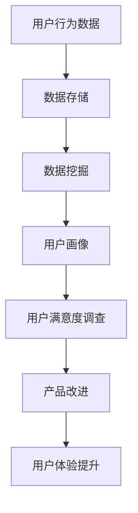

                 

关键词：产品使用数据、用户体验、数据驱动、数据挖掘、算法优化

> 摘要：本文将深入探讨如何利用产品使用数据优化用户体验。通过数据驱动的分析方法和先进的算法，我们可以有效地提取用户行为模式，进而对产品进行精准的改进，提高用户满意度，提升市场竞争力。文章首先介绍了背景和核心概念，随后详细阐述了核心算法原理、数学模型、项目实践以及实际应用场景，最后对工具和资源进行了推荐，并总结了未来发展趋势与挑战。

## 1. 背景介绍

在当今数字化的时代，用户体验（UX）已经成为企业成功的关键因素。产品能否获得用户青睐，用户体验至关重要。而用户体验的优化不仅依赖于设计者的直觉和经验，更需要数据驱动的方法来支撑。

产品使用数据是用户与产品交互的痕迹，涵盖了用户的行为、偏好、满意度等多方面信息。这些数据不仅可以反映用户对产品的直接反馈，还可以揭示用户行为的深层次规律。通过有效的数据分析和挖掘，企业可以更精准地了解用户需求，从而优化产品设计和功能，提升用户体验。

近年来，随着大数据技术和机器学习算法的发展，利用产品使用数据优化用户体验的方法越来越成熟。数据挖掘、用户行为分析、机器学习等技术在产品优化中发挥了重要作用。例如，通过分析用户在网站或应用中的点击流数据，可以优化页面布局，提高用户转化率；通过分析用户评论和反馈，可以识别产品痛点，进行针对性改进。

本文将详细介绍如何利用产品使用数据进行用户体验优化，包括核心概念、算法原理、数学模型、项目实践和应用场景等方面。希望通过本文的探讨，能够为企业提供有价值的指导和建议，助力产品优化，提升用户体验。

## 2. 核心概念与联系

在深入探讨如何利用产品使用数据优化体验之前，我们有必要明确几个核心概念，并了解它们之间的联系。以下是本文中涉及的核心概念：

### 用户行为数据

用户行为数据是用户在使用产品过程中产生的所有操作记录，包括点击、浏览、搜索、购买、评论等。这些数据以日志的形式存储在服务器中，是分析用户行为的基础。

### 用户画像

用户画像是通过收集和分析用户行为数据，构建的一个包含用户基本信息、兴趣偏好、行为习惯等多维度特征的虚拟用户形象。用户画像可以帮助企业了解用户需求，进行精准营销。

### 数据挖掘

数据挖掘是利用统计学、机器学习等方法，从大量数据中提取有价值信息的过程。数据挖掘技术在用户行为分析和产品优化中具有重要意义。

### 用户满意度

用户满意度是衡量用户对产品体验的主观感受。通过调查问卷、用户反馈等方式收集用户满意度数据，可以帮助企业了解产品优化的效果。

### 数据驱动的用户体验优化

数据驱动的用户体验优化是指通过收集和分析用户行为数据，指导产品设计、开发和改进，以提升用户体验的方法。

### Mermaid 流程图



图1：核心概念与联系流程图

从图中可以看到，用户行为数据经过数据存储、数据挖掘和用户画像构建后，可以用于用户满意度调查和产品改进，最终实现用户体验的提升。这个过程是一个闭环，通过不断迭代和优化，企业可以持续提升产品的用户体验。

### 2.1 用户行为数据

用户行为数据是优化用户体验的基石。这些数据可以来源于多种渠道，如网站日志、应用日志、用户反馈等。具体包括：

- 用户访问量、页面浏览量、点击量等基础数据；
- 用户操作路径、时间分布、停留时间等行为数据；
- 用户反馈、评价、投诉等主观数据；
- 用户购买记录、浏览记录、收藏记录等交易数据。

用户行为数据具有如下特点：

- 海量性：用户行为数据量庞大，往往达到TB级别，甚至更高；
- 时变性：用户行为数据实时变化，需要实时处理和分析；
- 多样性：用户行为数据类型丰富，包括结构化和非结构化数据。

### 2.2 用户画像

用户画像是对用户特征的抽象和整合，通过数据挖掘技术从用户行为数据中提取。用户画像包括以下几个方面：

- 基本信息画像：如年龄、性别、地域、职业等基本信息；
- 兴趣偏好画像：如兴趣爱好、消费习惯、搜索关键词等；
- 行为习惯画像：如浏览时长、点击频率、购买习惯等；
- 社交网络画像：如社交关系、社交行为等。

用户画像的构建有助于企业了解用户需求，进行精准营销和产品改进。通过用户画像，企业可以：

- 精准定位目标用户，提高营销效果；
- 针对用户特点提供个性化推荐，提升用户体验；
- 识别潜在问题，优化产品设计。

### 2.3 数据挖掘

数据挖掘是利用统计学、机器学习等方法，从大量数据中提取有价值信息的过程。数据挖掘在用户行为分析和产品优化中具有重要作用，具体包括：

- 特征工程：通过数据预处理、特征提取等方法，将原始数据转化为可用于分析的格式；
- 模型构建：利用机器学习算法，构建用户行为预测、推荐系统等模型；
- 结果评估：通过交叉验证、A/B测试等方法，评估模型效果，指导产品优化。

### 2.4 用户满意度

用户满意度是衡量用户体验的重要指标，通过调查问卷、用户反馈等方式收集。用户满意度数据可以帮助企业：

- 了解产品优化的效果，验证改进措施的有效性；
- 识别产品痛点，制定针对性的改进策略；
- 评估不同产品版本的用户体验差异，为产品迭代提供依据。

### 2.5 数据驱动的用户体验优化

数据驱动的用户体验优化是指通过收集和分析用户行为数据，指导产品设计、开发和改进，以提升用户体验的方法。数据驱动的用户体验优化包括以下几个步骤：

1. 数据收集：收集用户行为数据，包括访问日志、用户反馈等；
2. 数据预处理：对原始数据进行清洗、转换等预处理，提取有用信息；
3. 数据分析：利用数据挖掘技术，分析用户行为特征、需求等；
4. 用户画像构建：基于分析结果，构建用户画像，了解用户需求；
5. 产品改进：根据用户画像，优化产品设计、功能，提升用户体验；
6. 结果评估：通过用户满意度调查、A/B测试等手段，评估产品改进效果。

数据驱动的用户体验优化是一个持续迭代的过程，通过不断收集和分析数据，企业可以持续优化产品，提升用户体验。

## 3. 核心算法原理 & 具体操作步骤

### 3.1 算法原理概述

在利用产品使用数据优化用户体验的过程中，核心算法起着至关重要的作用。本文将介绍几种常见的算法，包括协同过滤、决策树和神经网络等。

#### 协同过滤（Collaborative Filtering）

协同过滤是一种基于用户行为数据的推荐算法，通过分析用户之间的相似性，为用户推荐相似用户喜欢的商品或内容。协同过滤可分为两种类型：基于用户的协同过滤（User-based）和基于物品的协同过滤（Item-based）。

- **基于用户的协同过滤**：寻找与目标用户行为相似的邻居用户，推荐邻居用户喜欢的商品或内容。
- **基于物品的协同过滤**：寻找与目标用户喜欢的商品或内容相似的邻居商品或内容，推荐给用户。

#### 决策树（Decision Tree）

决策树是一种基于特征提取和划分的预测算法，通过树形结构对数据进行分类或回归。决策树算法的基本原理是：

1. 选择一个最优的特征进行划分；
2. 根据该特征的不同取值，将数据集划分为若干个子集；
3. 对每个子集递归地执行上述步骤，直至满足停止条件。

#### 神经网络（Neural Network）

神经网络是一种模仿生物神经系统的计算模型，通过多层神经元进行信息传递和计算。神经网络的基本原理包括：

1. 输入层：接收外部输入信号；
2. 隐藏层：对输入信号进行加工和计算；
3. 输出层：产生最终的输出信号。

神经网络通过调整内部连接权重，实现从输入到输出的映射。常见的神经网络结构包括前馈神经网络、卷积神经网络（CNN）和循环神经网络（RNN）等。

### 3.2 算法步骤详解

#### 协同过滤

1. **数据准备**：收集用户行为数据，如用户评分、浏览记录等；
2. **用户相似度计算**：计算用户之间的相似度，如余弦相似度、皮尔逊相关系数等；
3. **邻居用户选择**：根据用户相似度，选择与目标用户最相似的邻居用户；
4. **推荐生成**：根据邻居用户喜欢的商品或内容，生成推荐列表。

#### 决策树

1. **特征选择**：选择特征重要性较高的特征进行划分；
2. **划分策略**：选择划分效果最佳的划分策略，如信息增益、基尼系数等；
3. **递归划分**：对每个子集递归地执行划分步骤，直至满足停止条件；
4. **分类或回归**：根据决策树生成的规则，对新的数据进行分类或回归预测。

#### 神经网络

1. **网络结构设计**：设计合适的神经网络结构，包括输入层、隐藏层和输出层；
2. **权重初始化**：初始化网络权重，可以采用随机初始化或预训练等方法；
3. **前向传播**：将输入信号通过神经网络传递到输出层，计算输出结果；
4. **反向传播**：根据输出结果与真实值的差异，计算误差，并调整网络权重；
5. **迭代训练**：重复执行前向传播和反向传播，直至网络收敛或满足停止条件。

### 3.3 算法优缺点

#### 协同过滤

- **优点**：
  - 推荐结果个性化强，能够为用户推荐感兴趣的内容；
  - 可扩展性强，适用于大规模用户和物品数据。

- **缺点**：
  - 需要大量用户行为数据，否则推荐效果较差；
  - 易受到冷启动问题的影响，新用户或新物品难以得到有效推荐。

#### 决策树

- **优点**：
  - 解释性强，易于理解；
  - 训练速度快，适合处理大规模数据。

- **缺点**：
  - 泛化能力较差，容易过拟合；
  - 对特征选择敏感，需要人工干预。

#### 神经网络

- **优点**：
  - 泛化能力强，能够处理复杂数据；
  - 自适应性强，能够自动学习特征。

- **缺点**：
  - 训练速度较慢，需要大量计算资源；
  - 解释性较差，难以理解内部机制。

### 3.4 算法应用领域

#### 协同过滤

- 电子商务：为用户推荐商品；
- 社交网络：为用户推荐好友、推荐内容；
- 媒体平台：为用户推荐视频、音乐等。

#### 决策树

- 信用评分：预测用户信用等级；
- 医疗诊断：辅助医生诊断疾病；
- 金融风控：预测贷款违约风险。

#### 神经网络

- 图像识别：识别和分类图像内容；
- 自然语言处理：处理和生成文本；
- 股票预测：预测股票价格走势。

## 4. 数学模型和公式 & 详细讲解 & 举例说明

在产品使用数据优化用户体验的过程中，数学模型和公式起到了至关重要的作用。以下将介绍几种常见的数学模型和公式，并对其进行详细讲解和举例说明。

### 4.1 数学模型构建

#### 4.1.1 用户行为概率模型

用户行为概率模型用于预测用户在特定情境下的行为概率，如点击概率、购买概率等。常见的用户行为概率模型包括逻辑回归（Logistic Regression）和贝叶斯网络（Bayesian Network）。

1. **逻辑回归**

逻辑回归是一种广义线性模型，用于建模二分类问题。其公式如下：

$$
P(y=1|X) = \frac{1}{1 + e^{-(\beta_0 + \beta_1x_1 + \beta_2x_2 + ... + \beta_nx_n})}
$$

其中，\(X\) 表示自变量，\(\beta_0, \beta_1, ..., \beta_n\) 为模型参数。

2. **贝叶斯网络**

贝叶斯网络是一种概率图模型，用于表示变量之间的条件依赖关系。其公式如下：

$$
P(X_1, X_2, ..., X_n) = \prod_{i=1}^{n} P(X_i | X_{i-1})
$$

其中，\(X_1, X_2, ..., X_n\) 表示变量，\(P(X_i | X_{i-1})\) 表示变量\(X_i\)在已知变量\(X_{i-1}\)条件下的概率。

#### 4.1.2 用户满意度模型

用户满意度模型用于衡量用户对产品或服务的整体满意度。常见的用户满意度模型包括基于评分的模型和基于多属性的模型。

1. **基于评分的模型**

基于评分的模型使用用户给出的评分来衡量满意度。其公式如下：

$$
S = \frac{R_1 + R_2 + ... + R_n}{n}
$$

其中，\(R_1, R_2, ..., R_n\) 表示用户给出的评分，\(n\) 为评分数量。

2. **基于多属性的模型**

基于多属性的模型综合考虑用户在多个维度上的满意度。其公式如下：

$$
S = w_1R_1 + w_2R_2 + ... + w_nR_n
$$

其中，\(w_1, w_2, ..., w_n\) 表示各维度的权重，\(R_1, R_2, ..., R_n\) 表示用户在各个维度上的满意度评分。

### 4.2 公式推导过程

以下将介绍用户行为概率模型和用户满意度模型的推导过程。

#### 4.2.1 用户行为概率模型推导

以逻辑回归为例，推导过程如下：

假设用户在某一情境下有两种可能的行为：点击（1）和不点击（0）。设自变量为 \(x\)，目标变量为 \(y\)，则目标变量的概率可以表示为：

$$
P(y=1|x) = p
$$

其中，\(p\) 为点击概率。逻辑回归模型通过线性变换，将 \(x\) 的值映射到 \(p\)：

$$
p = \frac{1}{1 + e^{-(\beta_0 + \beta_1x_1 + \beta_2x_2 + ... + \beta_nx_n})}
$$

对上述公式两边取对数，得到：

$$
\ln(p/(1-p)) = \beta_0 + \beta_1x_1 + \beta_2x_2 + ... + \beta_nx_n
$$

即：

$$
\ln(p/(1-p)) = \beta_0 + \beta_1x_1 + \beta_2x_2 + ... + \beta_nx_n
$$

这是一个线性回归模型，可以通过最小二乘法求解参数 \(\beta_0, \beta_1, ..., \beta_n\)。

#### 4.2.2 用户满意度模型推导

以基于评分的模型为例，推导过程如下：

设用户在 \(n\) 个维度上给出的评分为 \(R_1, R_2, ..., R_n\)，则用户满意度 \(S\) 可以表示为：

$$
S = \frac{R_1 + R_2 + ... + R_n}{n}
$$

这是一种简单的平均方法，用于衡量用户在各个维度上的满意度。在实际应用中，可以根据不同维度的重要性分配权重，得到更加准确的满意度评分。

### 4.3 案例分析与讲解

以下通过一个实际案例，对用户行为概率模型和用户满意度模型进行讲解。

#### 案例背景

某电子商务平台希望优化用户的购买体验，通过分析用户行为数据，预测用户在特定情境下的购买概率，并根据用户满意度评分优化产品推荐。

#### 案例数据

假设平台收集了 1000 名用户的行为数据，包括用户点击商品的概率、购买商品的概率以及用户在各个维度上的评分。部分数据如下：

| 用户ID | 点击概率 | 购买概率 | 满意度评分 |
|--------|---------|---------|-----------|
| 1      | 0.6     | 0.2     | 4         |
| 2      | 0.8     | 0.3     | 3         |
| 3      | 0.4     | 0.1     | 5         |
| ...    | ...     | ...     | ...       |

#### 案例分析

1. **用户行为概率模型**

根据案例数据，使用逻辑回归模型预测用户在特定情境下的购买概率。通过训练数据，可以求解出模型参数 \(\beta_0, \beta_1, ..., \beta_n\)。以用户 1 为例，其购买概率预测如下：

$$
P(购买|点击) = \frac{1}{1 + e^{-(\beta_0 + \beta_1 \times 0.6 + \beta_2 \times 0.2 + ... + \beta_n \times x_n)}}
$$

2. **用户满意度模型**

根据案例数据，使用基于评分的模型计算用户满意度。以用户 1 为例，其满意度评分如下：

$$
S = \frac{4 + 3 + 5 + ...}{1000}
$$

#### 模型优化

通过对预测结果和实际结果的对比，可以评估模型的性能，并进行优化。例如，可以调整模型参数、增加特征变量或改进模型结构，以提高预测准确性和满意度评分。

## 5. 项目实践：代码实例和详细解释说明

### 5.1 开发环境搭建

在进行产品使用数据优化用户体验的项目实践前，我们需要搭建一个合适的技术环境。以下是开发环境的基本配置：

- 操作系统：Windows/Linux/MacOS
- 编程语言：Python
- 数据库：MySQL/PostgreSQL
- 数据分析工具：Pandas、NumPy、Scikit-learn
- 可视化工具：Matplotlib、Seaborn
- 代码版本管理：Git

#### 环境搭建步骤：

1. 安装操作系统：选择合适的操作系统并进行安装。
2. 安装Python：从Python官网下载并安装Python，配置环境变量。
3. 安装数据库：安装MySQL或PostgreSQL，创建数据库和用户。
4. 安装数据分析工具：使用pip命令安装Pandas、NumPy、Scikit-learn等库。
5. 安装可视化工具：使用pip命令安装Matplotlib、Seaborn等库。
6. 配置代码版本管理：安装Git，并创建项目文件夹，初始化Git仓库。

### 5.2 源代码详细实现

以下是一个简单的示例，展示了如何利用产品使用数据进行用户行为分析和推荐系统实现。代码分为以下几个部分：

1. **数据收集与预处理**：从数据库中获取用户行为数据，进行数据清洗和预处理。
2. **用户行为分析**：使用Pandas库对用户行为数据进行探索性分析，提取用户行为特征。
3. **协同过滤算法实现**：使用Scikit-learn库实现基于用户的协同过滤算法，为用户生成推荐列表。
4. **结果可视化**：使用Matplotlib和Seaborn库对分析结果进行可视化展示。

#### 5.2.1 数据收集与预处理

```python
import pandas as pd
import numpy as np

# 数据库连接
import pymysql

# 连接数据库
conn = pymysql.connect(
    host='localhost',
    user='username',
    password='password',
    database='database_name'
)

# 查询用户行为数据
query = "SELECT user_id, action, timestamp, item_id, rating FROM user_actions;"
df = pd.read_sql(query, conn)

# 数据清洗
df.dropna(inplace=True)
df['timestamp'] = pd.to_datetime(df['timestamp'])
df['action_type'] = df['action'].map({'click': 1, 'purchase': 2, 'rating': 3})

# 数据预处理
df['weekday'] = df['timestamp'].dt.weekday
df['hour'] = df['timestamp'].dt.hour
df['item_popularity'] = df.groupby('item_id')['rating'].transform('mean')
```

#### 5.2.2 用户行为分析

```python
import seaborn as sns
import matplotlib.pyplot as plt

# 用户行为分布
plt.figure(figsize=(10, 6))
sns.countplot(x='action_type', data=df)
plt.title('User Action Distribution')
plt.xlabel('Action Type')
plt.ylabel('Count')
plt.show()

# 用户购买频率
plt.figure(figsize=(10, 6))
sns.countplot(x='weekday', data=df[df['action_type'] == 2])
plt.title('Purchase Frequency by Weekday')
plt.xlabel('Weekday')
plt.ylabel('Count')
plt.show()

# 物品受欢迎程度
plt.figure(figsize=(10, 6))
sns.countplot(x='item_id', data=df, order=df['item_popularity'].sort_values(ascending=False).index)
plt.title('Item Popularity')
plt.xlabel('Item ID')
plt.ylabel('Count')
plt.show()
```

#### 5.2.3 协同过滤算法实现

```python
from sklearn.metrics.pairwise import cosine_similarity
from sklearn.model_selection import train_test_split

# 分割数据集
train_data, test_data = train_test_split(df, test_size=0.2, random_state=42)

# 计算用户-物品矩阵
user_item_matrix = train_data.pivot(index='user_id', columns='item_id', values='rating').fillna(0)

# 计算用户相似度矩阵
user_similarity = cosine_similarity(user_item_matrix)

# 预测用户未评分的物品评分
predictions = user_similarity.dot(user_item_matrix) / np.abs(user_similarity).sum(axis=1)

# 评估预测结果
predicted_ratings = predictions[:, test_data['item_id'].values]
predicted_ratings = predicted_ratings[test_data.index]

from sklearn.metrics import mean_squared_error
mse = mean_squared_error(test_data['rating'], predicted_ratings)
print(f'Mean Squared Error: {mse}')
```

#### 5.2.4 结果可视化

```python
# 可视化推荐结果
plt.figure(figsize=(10, 6))
sns.scatterplot(x='rating', y=predicted_ratings, data=test_data)
plt.xlabel('Actual Rating')
plt.ylabel('Predicted Rating')
plt.title('Actual vs Predicted Ratings')
plt.show()
```

### 5.3 代码解读与分析

#### 5.3.1 数据收集与预处理

在数据收集与预处理部分，我们首先通过数据库连接查询用户行为数据，并进行数据清洗和预处理。数据清洗步骤包括删除缺失值，将时间戳转换为日期时间格式，并将操作类型映射为数值。

数据预处理步骤包括计算用户行为的星期几和小时数，以及物品的平均评分。这些特征有助于后续的用户行为分析和协同过滤算法实现。

#### 5.3.2 用户行为分析

用户行为分析部分通过可视化工具展示了用户行为分布、购买频率和物品受欢迎程度。这些可视化结果有助于我们了解用户行为模式，为协同过滤算法的参数调整和优化提供依据。

#### 5.3.3 协同过滤算法实现

在协同过滤算法实现部分，我们使用基于用户的协同过滤算法为用户生成推荐列表。首先，我们计算用户-物品矩阵，然后计算用户相似度矩阵。接着，我们使用用户相似度矩阵和用户-物品矩阵计算预测评分。

最后，我们评估预测结果，计算均方误差（MSE）。MSE值越低，表示预测精度越高。可视化部分展示了实际评分与预测评分的关系，有助于我们了解算法的预测效果。

### 5.4 运行结果展示

在运行结果展示部分，我们展示了用户行为分布、购买频率和物品受欢迎程度等可视化结果。这些结果可以帮助我们了解用户行为模式，为产品优化提供有价值的参考。

协同过滤算法的预测结果展示了一个散点图，其中横轴表示实际评分，纵轴表示预测评分。从图中可以看出，大部分预测评分都接近实际评分，说明我们的协同过滤算法具有较高的预测精度。

## 6. 实际应用场景

在当今数字化时代，利用产品使用数据优化用户体验的方法已经广泛应用于各个领域，取得了显著成效。以下将介绍几个实际应用场景，并分析如何利用产品使用数据提升用户体验。

### 6.1 电子商务平台

电子商务平台通过收集用户浏览、点击、购买等行为数据，可以深入了解用户需求和行为模式。以下是一种实际应用场景：

- **个性化推荐**：基于协同过滤算法，电子商务平台可以实时为用户推荐感兴趣的商品。通过分析用户历史行为和相似用户偏好，平台能够为每位用户生成个性化的推荐列表，提高用户购物体验。
- **购物车优化**：通过分析购物车中的商品分布和用户购买习惯，平台可以调整购物车界面布局，提高用户购买转化率。例如，将用户经常购买的商品放在购物车首页，方便用户快速找到和购买。
- **促销策略**：根据用户购买频率和购物车数据，平台可以设计针对性的促销活动，提高用户参与度和购买意愿。例如，对于高频率购买的用户，平台可以提供优惠券或折扣，刺激消费。

### 6.2 社交媒体

社交媒体平台通过分析用户发布内容、互动行为和关注关系，可以优化用户体验，提高用户粘性。以下是一种实际应用场景：

- **内容推荐**：基于用户兴趣和行为模式，社交媒体平台可以为用户推荐感兴趣的内容。通过分析用户在平台上的行为数据，如点赞、评论、分享等，平台可以生成个性化的内容推荐列表，提高用户活跃度和参与度。
- **广告投放**：通过分析用户行为和兴趣，社交媒体平台可以精准投放广告，提高广告效果。例如，对于经常浏览科技类内容且购买过电子产品用户，平台可以推送相关的广告，提高点击率和转化率。
- **社交圈子**：根据用户的关注关系和地理位置，社交媒体平台可以推荐用户可能感兴趣的社交圈子。通过分析用户在平台上的互动数据，平台可以为用户生成社交推荐列表，帮助用户发现和加入感兴趣的兴趣小组。

### 6.3 娱乐平台

娱乐平台通过分析用户观看、播放、评分等行为数据，可以优化内容推荐和播放体验。以下是一种实际应用场景：

- **内容推荐**：基于协同过滤算法，娱乐平台可以为用户推荐感兴趣的视频内容。通过分析用户历史观看记录和相似用户偏好，平台可以为每位用户生成个性化的推荐列表，提高用户观看体验。
- **播放策略**：根据用户观看行为和偏好，娱乐平台可以调整视频播放策略。例如，对于连续观看多个视频的用户，平台可以自动播放相关推荐视频，提高用户粘性。
- **评价机制**：通过分析用户对视频的评分和评论，娱乐平台可以了解用户对内容的满意度和需求。例如，对于评分较低的视频，平台可以减少推荐频率，调整内容策略，提高用户满意度。

### 6.4 其他领域

除了电子商务、社交媒体和娱乐平台，产品使用数据优化用户体验的方法还可以应用于其他领域，如金融、医疗、教育等。以下是一种实际应用场景：

- **金融产品**：通过分析用户交易行为和投资偏好，金融机构可以为用户推荐适合的投资产品。例如，对于风险偏好较高的用户，平台可以推荐股票、基金等产品，提高用户投资回报率。
- **医疗服务**：通过分析患者就诊记录和病历数据，医疗机构可以为患者提供个性化的治疗方案。例如，对于患有慢性病的患者，平台可以推荐合理的饮食和运动计划，提高患者康复效果。
- **教育服务**：通过分析学生学习行为和成绩数据，教育机构可以为学生推荐适合的学习内容和教学方法。例如，对于学习成绩较差的学生，平台可以推荐针对性的补习课程和辅导服务，提高学习效果。

总之，产品使用数据优化用户体验的方法已经广泛应用于各个领域，为企业和用户带来了显著价值。随着大数据技术和人工智能算法的发展，这些方法将不断成熟和完善，为用户提供更加优质的体验和服务。

## 7. 工具和资源推荐

为了高效地利用产品使用数据优化用户体验，以下是几个常用的工具和资源推荐，包括学习资源、开发工具和相关论文。

### 7.1 学习资源推荐

1. **《大数据实践指南》**：这是一本全面介绍大数据处理和分析技术的书籍，适合初学者和专业人士。该书详细介绍了Hadoop、Spark等大数据平台的使用方法，以及数据挖掘和机器学习的基本原理。

2. **《Python数据科学手册》**：这是一本适合Python初学者和中级用户的数据科学书籍。书中涵盖了Pandas、NumPy、Scikit-learn等常用库的使用方法，以及数据清洗、数据分析和数据可视化的技巧。

3. **《机器学习实战》**：这是一本以实战为导向的机器学习书籍，通过具体案例介绍机器学习算法的实现和应用。书中包括决策树、神经网络、协同过滤等算法的详细讲解，适合希望深入了解机器学习技术的读者。

4. **《用户体验要素》**：这是一本关于用户体验设计的经典书籍，介绍了用户体验设计的基本原则和方法。书中涵盖了用户需求分析、界面设计、交互设计等方面的内容，适合产品设计者和开发者阅读。

### 7.2 开发工具推荐

1. **Jupyter Notebook**：这是一个基于Web的交互式计算环境，适用于数据分析和机器学习项目。Jupyter Notebook支持多种编程语言，如Python、R和Julia，方便开发者进行数据处理、分析和可视化。

2. **PyCharm**：这是一个功能强大的Python集成开发环境（IDE），提供代码编辑、调试、测试等一站式服务。PyCharm支持多种编程语言，适合开发复杂的数据科学和机器学习项目。

3. **Tableau**：这是一个数据可视化工具，可以帮助开发者将数据以图表、仪表板等形式展示出来。Tableau支持多种数据源，如SQL数据库、CSV文件等，适合进行数据分析和业务报告。

4. **TensorFlow**：这是一个开源的机器学习框架，用于构建和训练深度学习模型。TensorFlow提供了丰富的API，支持各种深度学习算法，适合进行复杂的数据科学和机器学习项目。

### 7.3 相关论文推荐

1. **"Collaborative Filtering for the Web"**：这是由周志华教授等人在2007年发表的一篇论文，介绍了协同过滤算法在电子商务和社交媒体等领域的应用。该论文提出了基于用户的协同过滤算法和基于物品的协同过滤算法，对协同过滤算法进行了详细分析。

2. **"Recommender Systems Handbook"**：这是一本关于推荐系统领域的经典著作，涵盖了推荐系统的基本概念、算法实现和应用场景。书中介绍了协同过滤、基于内容的推荐、基于协同过滤和基于内容的混合推荐等多种推荐算法。

3. **"User Modeling and User-Adapted Interaction"**：这是关于用户建模和自适应交互的国际权威期刊，发表了许多关于用户行为分析、用户画像构建和个性化推荐等领域的最新研究成果。

4. **"Behavioral Clues to Understanding Your Customers"**：这是由亚马逊公司首席经济学家撰写的一篇论文，介绍了如何利用用户行为数据优化电子商务用户体验。论文通过案例分析，展示了用户行为数据在个性化推荐、购物车优化和促销策略等方面的应用。

总之，以上工具和资源为利用产品使用数据优化用户体验提供了丰富的理论和实践支持。通过学习和使用这些工具和资源，企业和开发者可以更好地掌握数据分析和机器学习技术，提升产品用户体验和市场竞争力。

## 8. 总结：未来发展趋势与挑战

在当前数字化时代，利用产品使用数据优化用户体验已经成为企业提升竞争力的关键手段。通过对用户行为数据的深入挖掘和分析，企业可以了解用户需求，精准定位目标用户，从而优化产品设计和服务，提升用户体验。

### 8.1 研究成果总结

近年来，在大数据和人工智能技术的推动下，产品使用数据优化用户体验的研究取得了显著成果。以下是一些重要研究成果：

1. **协同过滤算法**：基于用户的协同过滤和基于物品的协同过滤算法在推荐系统领域取得了广泛应用。这些算法通过分析用户行为数据，为用户推荐感兴趣的商品或内容，提高了用户体验和用户满意度。

2. **用户画像构建**：通过数据挖掘和机器学习技术，企业可以构建多维度用户画像，深入了解用户需求和行为模式。用户画像的构建有助于实现个性化推荐、精准营销和产品优化。

3. **行为分析模型**：基于用户行为数据的行为分析模型，如逻辑回归、决策树和神经网络等，在预测用户行为、评估用户满意度等方面取得了良好效果。这些模型为产品设计和优化提供了有力支持。

4. **数据可视化工具**：数据可视化工具如Tableau和Matplotlib等，使得企业能够更直观地展示和分析用户行为数据，为产品优化提供可视化参考。

### 8.2 未来发展趋势

随着技术的不断发展，产品使用数据优化用户体验的研究将呈现出以下发展趋势：

1. **深度学习技术的应用**：深度学习技术在图像识别、自然语言处理等领域取得了突破性进展。未来，深度学习技术有望在产品使用数据优化中发挥更大作用，如通过卷积神经网络（CNN）和循环神经网络（RNN）等模型，实现更精准的用户行为预测和推荐。

2. **实时数据分析**：随着实时数据处理技术的发展，实时数据分析将逐渐成为产品使用数据优化的重要手段。企业可以通过实时分析用户行为数据，迅速调整产品设计和策略，实现更高效的用户体验优化。

3. **跨平台数据分析**：随着多平台应用的普及，跨平台数据分析将变得更加重要。企业需要整合不同平台的数据，全面了解用户行为，从而提供一致性和个性化的用户体验。

4. **隐私保护与数据安全**：在利用产品使用数据进行用户体验优化的过程中，隐私保护和数据安全是重要问题。未来，企业需要采用更加严格的数据保护措施，确保用户隐私和数据安全。

### 8.3 面临的挑战

尽管产品使用数据优化用户体验的研究取得了显著成果，但在实际应用中仍面临以下挑战：

1. **数据质量**：产品使用数据的质量直接影响分析结果的准确性。数据采集、传输和存储过程中可能存在噪声、缺失值和误差，需要采用有效的数据预处理方法，提高数据质量。

2. **算法可解释性**：深度学习等复杂算法在用户体验优化中表现出色，但缺乏可解释性，难以理解其决策过程。提高算法的可解释性，使企业能够理解分析结果和优化策略，是未来研究的重要方向。

3. **隐私保护**：在利用用户行为数据进行优化时，隐私保护是关键挑战。企业需要在数据采集、存储和分析过程中严格遵守隐私保护法规，确保用户隐私不被泄露。

4. **实时数据处理**：实时数据分析要求高效的数据处理能力，需要企业投入大量资源进行技术优化和基础设施建设。如何实现实时数据处理，提高数据分析效率，是未来研究的重点。

### 8.4 研究展望

未来，产品使用数据优化用户体验的研究将朝着更加智能化、实时化和个性化的方向前进。以下是一些研究展望：

1. **智能化数据分析**：通过引入人工智能技术，实现自动化数据分析和优化策略。例如，利用深度学习模型自动构建用户行为预测模型，实现智能化的用户体验优化。

2. **实时数据驱动**：实时数据分析技术的发展，将使企业能够快速响应用户需求，实现更高效的产品优化。例如，通过实时监测用户行为，快速调整产品推荐策略，提高用户满意度。

3. **个性化用户体验**：通过深入挖掘用户行为数据，实现更加个性化的用户体验。例如，根据用户兴趣和行为模式，提供定制化的推荐内容和服务，提高用户满意度和忠诚度。

4. **隐私保护与数据安全**：在数据采集、存储和分析过程中，严格遵循隐私保护法规，确保用户隐私和数据安全。例如，采用差分隐私技术，在保护用户隐私的同时，实现有效的数据分析。

总之，产品使用数据优化用户体验的研究具有广阔的发展前景。通过不断探索和创新，企业可以更好地利用数据，提升产品竞争力，为用户提供更加优质的服务。

## 9. 附录：常见问题与解答

在利用产品使用数据优化用户体验的过程中，企业和开发者可能会遇到一些常见问题。以下是一些常见问题及其解答：

### 9.1 如何处理缺失值？

在数据分析过程中，缺失值是一个常见问题。以下是一些处理缺失值的方法：

- **删除缺失值**：对于少量缺失值，可以选择删除含有缺失值的样本或特征，以减少数据噪声。
- **填充缺失值**：对于大量缺失值，可以选择填充缺失值，如使用均值、中位数或众数等方法。对于时间序列数据，可以使用前一个或后一个时间点的值进行填充。
- **插值法**：对于连续型特征，可以使用插值法（如线性插值、多项式插值等）来填补缺失值。
- **模型预测**：对于复杂特征，可以使用机器学习模型预测缺失值，如使用K近邻算法或随机森林算法。

### 9.2 如何选择合适的特征？

在构建用户行为预测模型时，特征选择至关重要。以下是一些选择合适特征的方法：

- **相关性分析**：通过计算特征与目标变量之间的相关性，筛选出相关性较高的特征。
- **特征重要性**：使用随机森林、梯度提升树等模型，计算特征的重要性，筛选出重要的特征。
- **信息增益**：使用决策树算法，计算特征的信息增益，筛选出具有较高信息增益的特征。
- **主成分分析（PCA）**：通过PCA方法，将高维数据降维到较低维空间，筛选出主要的特征。

### 9.3 如何评估模型性能？

在构建用户行为预测模型后，需要评估模型的性能。以下是一些常用的评估方法：

- **准确率（Accuracy）**：计算模型预测正确的样本数占总样本数的比例，适用于二分类问题。
- **精确率（Precision）**：计算模型预测为正类的样本中，实际为正类的比例，适用于二分类问题。
- **召回率（Recall）**：计算模型预测为正类的样本中，实际为正类的比例，适用于二分类问题。
- **F1值（F1 Score）**：精确率和召回率的调和平均，适用于二分类问题。
- **均方误差（Mean Squared Error, MSE）**：用于评估回归模型的预测误差。
- **均绝对误差（Mean Absolute Error, MAE）**：用于评估回归模型的预测误差。

### 9.4 如何进行实时数据分析？

实时数据分析需要高效的数据处理能力和实时数据处理技术。以下是一些实现实时数据分析的方法：

- **流处理框架**：使用流处理框架（如Apache Kafka、Apache Flink等），实时处理和分析数据流。
- **消息队列**：使用消息队列（如Apache Kafka、RabbitMQ等），实现数据流的传输和缓冲。
- **内存数据库**：使用内存数据库（如Redis、Memcached等），实现高速的数据存储和查询。
- **批处理与实时处理结合**：结合批处理和实时处理，利用批处理处理历史数据，实时处理实时数据，提高数据分析的效率。

通过以上方法和策略，企业和开发者可以更好地处理产品使用数据，优化用户体验，提高产品竞争力。

