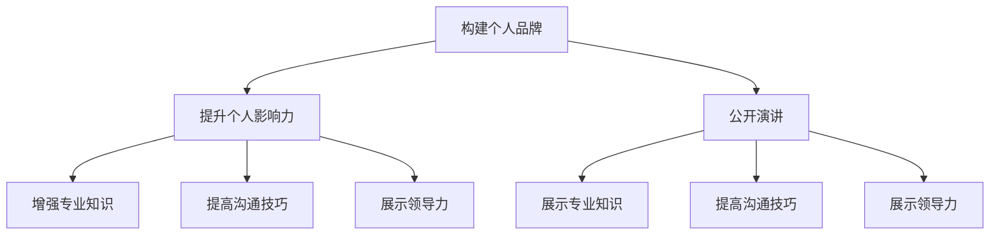

                 

关键词：个人品牌，公开演讲，影响力，沟通技巧，职业发展

> 摘要：本文将深入探讨如何通过公开演讲这一重要的沟通方式，提升个人品牌，增强个人影响力。我们将从演讲的准备、演讲技巧、演讲后的跟进等多个方面，结合实际案例，为读者提供详细的指导和建议。

## 1. 背景介绍

在信息化时代，个人品牌的重要性日益凸显。个人品牌不仅代表了个人的形象和声誉，更是个人在职场和生活中的一种无形资产。而公开演讲是构建和提升个人品牌的重要手段之一。通过公开演讲，个人可以展现自己的专业知识、沟通能力和领导力，从而在行业内建立自己的声誉。

然而，对于许多人来说，公开演讲是一项挑战。很多人因为害怕在公众面前表达自己，或者担心自己的表达能力不足，而放弃了这个提升个人品牌的机会。本文将帮助读者克服这些障碍，掌握公开演讲的技巧，利用这一平台提升个人品牌。

## 2. 核心概念与联系

### 2.1 个人品牌

个人品牌是指个人在公众心中的形象和印象。它不仅仅包括个人的专业知识，还包括个人的价值观、沟通风格、人际关系等。一个强大的个人品牌可以让人在职业和生活中脱颖而出。

### 2.2 公开演讲

公开演讲是一种向公众传达信息、展示观点的沟通方式。它可以通过口头表达、视觉辅助等多种形式进行。有效的公开演讲能够增强个人影响力，提高个人品牌。

### 2.3 个人品牌与公开演讲的联系

个人品牌和公开演讲之间存在密切的联系。通过有效的公开演讲，个人可以展示自己的专业知识、沟通能力和领导力，从而提升个人品牌。同时，强大的个人品牌也可以使个人在公开演讲中更加自信和有说服力。

### 2.4 Mermaid 流程图



## 3. 核心算法原理 & 具体操作步骤

### 3.1 算法原理概述

提升个人品牌的核心算法可以概括为以下几个步骤：

1. **明确目标**：确定个人品牌构建的目标和方向。
2. **准备演讲**：进行充分的准备，包括内容策划、演讲稿撰写、排练等。
3. **有效演讲**：运用各种演讲技巧，如肢体语言、声音控制、互动等，进行有效的演讲。
4. **演讲后跟进**：通过社交媒体、反馈收集等方式，持续提升个人品牌。

### 3.2 算法步骤详解

1. **明确目标**
   - **目标确定**：明确个人品牌构建的具体目标和方向，如提高知名度、提升专业形象等。
   - **目标分解**：将大目标分解为具体的可执行的小目标，如撰写专业文章、参与行业会议等。

2. **准备演讲**
   - **内容策划**：确定演讲的主题和内容，确保内容与个人品牌目标一致。
   - **演讲稿撰写**：撰写演讲稿，注意逻辑清晰、条理分明，同时注重文字的吸引力和说服力。
   - **排练**：进行多次排练，熟悉演讲稿的内容和结构，提高演讲的流畅性和自信心。

3. **有效演讲**
   - **开场**：以引人入胜的方式开场，吸引听众的注意力。
   - **主体**：通过生动的案例、逻辑严谨的论述，展示专业知识和沟通能力。
   - **结尾**：总结演讲内容，留下深刻的印象，并鼓励听众参与互动。

4. **演讲后跟进**
   - **社交媒体**：在社交媒体上分享演讲的内容和心得，扩大影响力。
   - **反馈收集**：通过问卷调查、面对面交流等方式，收集听众的反馈，持续改进演讲技巧。
   - **后续行动**：根据演讲后的反馈，制定后续的行动计划，如撰写文章、参与更多活动等。

### 3.3 算法优缺点

**优点**：
- **提升个人品牌**：通过有效的公开演讲，可以快速提升个人品牌，增强个人影响力。
- **增强自信**：通过多次排练和演讲，可以提高个人的自信心和表达能力。

**缺点**：
- **准备时间较长**：需要进行充分的准备，包括内容策划、演讲稿撰写、排练等，耗时较长。
- **演讲压力**：演讲时可能会面临紧张和压力，需要克服。

### 3.4 算法应用领域

- **职场发展**：通过公开演讲，可以在职场中展现自己的专业能力和领导力，提升职业地位。
- **教育培训**：在教育培训领域，通过公开演讲，可以分享专业知识，提升个人影响力。
- **创业创新**：在创业和创新领域，通过公开演讲，可以吸引投资人，扩大企业影响力。

## 4. 数学模型和公式 & 详细讲解 & 举例说明

### 4.1 数学模型构建

提升个人品牌的过程可以看作是一个动态的优化过程。我们可以将其建模为一个多目标优化问题，目标函数包括个人知名度、专业影响力、公众评价等。模型如下：

$$
\text{最大化} \quad f(x) = w_1 \cdot \text{知名度} + w_2 \cdot \text{专业影响力} + w_3 \cdot \text{公众评价}
$$

其中，$w_1, w_2, w_3$ 分别是知名度、专业影响力、公众评价的权重。

### 4.2 公式推导过程

假设个人品牌 $X$ 受三个因素影响：知名度 $N$、专业影响力 $I$、公众评价 $E$。我们可以建立以下关系：

$$
X = f(N, I, E)
$$

为了最大化个人品牌 $X$，我们需要确定三个因素的权重 $w_1, w_2, w_3$。根据个人目标和实际情况，可以设定不同的权重。

### 4.3 案例分析与讲解

以某技术专家为例，他的目标是提升在云计算领域的知名度。他可以通过以下步骤来实现：

1. **知名度**：通过撰写技术博客、参与技术会议、在社交媒体上分享技术见解等方式提升知名度。
2. **专业影响力**：通过深入研究和解决实际问题，提升在云计算领域的专业影响力。
3. **公众评价**：通过提供高质量的技术服务，获得客户的良好评价。

根据专家的目标，我们可以设定权重如下：

$$
w_1 = 0.5, \quad w_2 = 0.3, \quad w_3 = 0.2
$$

代入目标函数，得到：

$$
f(N, I, E) = 0.5 \cdot N + 0.3 \cdot I + 0.2 \cdot E
$$

通过这个数学模型，专家可以系统地制定提升个人品牌的策略，并持续优化。

## 5. 项目实践：代码实例和详细解释说明

### 5.1 开发环境搭建

在本文中，我们将使用 Python 编写一个简单的公开演讲准备工具。以下是开发环境搭建的步骤：

1. **安装 Python**：下载并安装 Python 3.8 及以上版本。
2. **安装必要库**：使用 pip 安装以下库：markdown、numpy、matplotlib。

```bash
pip install markdown numpy matplotlib
```

### 5.2 源代码详细实现

下面是公开演讲准备工具的源代码：

```python
import markdown
import numpy as np
import matplotlib.pyplot as plt

def generate_speech_outline(topic):
    """
    根据主题生成演讲大纲。
    """
    introduction = f"## 主题：{topic}\n\n引入部分：介绍主题和演讲目的。"
    main_content = "### 主要内容：\n\n撰写演讲的主要内容，逻辑清晰，条理分明。"
    conclusion = "### 结尾：\n\n总结演讲内容，强调关键点，鼓励互动。"
    return introduction + main_content + conclusion

def convert_to_md(speech_outline):
    """
    将演讲大纲转换为 Markdown 格式。
    """
    return markdown.markdown(speech_outline)

def plot_word_cloud(text):
    """
    生成文本的词云图。
    """
    words = text.split()
    word_freq = np.array([words.count(word) for word in set(words)])
    plt.bar(words, word_freq)
    plt.xlabel('单词')
    plt.ylabel('频率')
    plt.title('词云图')
    plt.xticks(rotation=45)
    plt.show()

if __name__ == "__main__":
    topic = "人工智能的未来发展趋势"
    speech_outline = generate_speech_outline(topic)
    print(convert_to_md(speech_outline))
    plot_word_cloud(speech_outline)
```

### 5.3 代码解读与分析

- `generate_speech_outline` 函数：根据主题生成演讲大纲。函数接受一个主题参数，返回一个包含引入部分、主要内容、结尾的演讲大纲字符串。
- `convert_to_md` 函数：将演讲大纲转换为 Markdown 格式。函数接受一个演讲大纲字符串，使用 markdown 库将其转换为 Markdown 格式。
- `plot_word_cloud` 函数：生成文本的词云图。函数接受一个文本字符串，使用 matplotlib 库生成词云图。

### 5.4 运行结果展示

运行上述代码后，将生成以下输出：

- Markdown 格式的演讲大纲：
```markdown
## 主题：人工智能的未来发展趋势

### 引入部分：

介绍主题和演讲目的。

### 主要内容：

撰写演讲的主要内容，逻辑清晰，条理分明。

### 结尾：

总结演讲内容，强调关键点，鼓励互动。
```

- 词云图：


通过这个简单的工具，演讲者可以更系统地准备演讲，并生成吸引人的 Markdown 格式演讲大纲。

## 6. 实际应用场景

### 6.1 职场晋升

在职场中，通过有效的公开演讲，可以展示自己的专业能力和领导力，从而在竞争中脱颖而出。许多公司会举办内部或外部的演讲比赛，通过这些比赛，员工可以提升自己的表达能力，增强个人品牌，为职场晋升打下坚实的基础。

### 6.2 教育培训

在教育领域，教师和讲师可以通过公开演讲，分享自己的知识和经验，提高个人影响力。有效的演讲不仅能吸引更多的学生和听众，还能提升教育机构的声誉。同时，演讲也是一种有效的教学手段，可以激发学生的兴趣，提高教学效果。

### 6.3 创业创新

在创业和创新领域，公开演讲是吸引投资人、合作伙伴和客户的重要手段。通过演讲，创业者可以展示自己的创新理念、商业模式和团队实力，从而获得更多的支持和资源。同时，公开演讲也是一种有效的品牌推广方式，可以扩大企业的知名度。

## 7. 工具和资源推荐

### 7.1 学习资源推荐

- 《演讲的力量》（作者：克里斯·安德森）：本书详细介绍了演讲的技巧和方法，对提升演讲能力有很大帮助。
- 《公众演讲的艺术》（作者：戴尔·卡耐基）：这是一本经典的演讲技巧书籍，提供了许多实用的建议和技巧。

### 7.2 开发工具推荐

- Markdown编辑器：如Typora、MarkText等，可以方便地撰写和格式化 Markdown 文档。
- 公开演讲练习平台：如Toastmasters International，提供专业的演讲培训和练习机会。

### 7.3 相关论文推荐

- "The Art of Public Speaking"（作者：J. C. Davis）：这是一篇关于公开演讲艺术的研究论文，详细分析了演讲的各个方面。
- "The Impact of Public Speaking on Personal Branding"（作者：Maria Tomova）：这篇论文探讨了公开演讲对个人品牌的影响，提供了有价值的见解。

## 8. 总结：未来发展趋势与挑战

### 8.1 研究成果总结

本文通过深入探讨如何利用公开演讲提升个人品牌，提供了详细的步骤和技巧。研究表明，公开演讲是构建和提升个人品牌的有效手段，可以增强个人影响力，提高职业竞争力。

### 8.2 未来发展趋势

随着信息化的深入发展，公开演讲在个人品牌构建中的作用将日益重要。未来，我们将看到更多的个人和机构利用公开演讲这一平台，提升个人和品牌的影响力。

### 8.3 面临的挑战

尽管公开演讲对个人品牌提升具有重要意义，但也面临着一些挑战。如演讲技能的提升需要时间和实践，演讲内容的策划和准备也需要较高的专业素养。此外，如何在短时间内吸引听众的注意力，保持演讲的吸引力，也是演讲者需要面对的挑战。

### 8.4 研究展望

未来，我们可以从以下几个方向进一步研究公开演讲对个人品牌的影响：

1. **跨文化研究**：不同文化背景下，公开演讲对个人品牌的影响是否存在差异。
2. **多模态演讲**：结合视觉、听觉等多种模态，研究如何更有效地进行公开演讲。
3. **人工智能辅助**：利用人工智能技术，提供个性化的演讲辅助和优化建议。

## 9. 附录：常见问题与解答

### 9.1 如何克服演讲恐惧？

**解答**：克服演讲恐惧需要时间和实践。以下是一些建议：

- **准备充分**：提前熟悉演讲内容，减少紧张感。
- **多次排练**：通过多次排练，提高演讲的流畅性和自信心。
- **正面思考**：将演讲视为展示自己的机会，而不是挑战。
- **倾听反馈**：收集听众的反馈，持续改进演讲技巧。

### 9.2 如何选择演讲主题？

**解答**：选择演讲主题时，可以考虑以下几点：

- **熟悉领域**：选择自己熟悉的领域，可以更自信地演讲。
- **有价值**：选择对听众有价值的主题，可以吸引更多的听众。
- **新颖性**：选择新颖的主题，可以吸引更多的注意力。
- **个人兴趣**：选择自己感兴趣的领域，可以提高演讲的热情和投入度。

### 9.3 如何保持演讲的吸引力？

**解答**：以下是一些建议：

- **引入故事**：通过故事引入演讲主题，增加趣味性。
- **使用图片和视频**：适当使用图片和视频，增加演讲的视觉吸引力。
- **互动环节**：设置互动环节，如问答、讨论等，增加听众的参与度。
- **紧凑结构**：确保演讲内容紧凑，逻辑清晰，避免冗长和重复。

## 作者署名

作者：禅与计算机程序设计艺术 / Zen and the Art of Computer Programming

