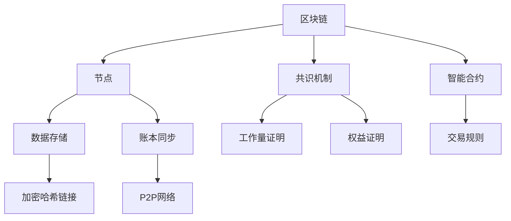

                 

### 背景介绍

区块链技术作为近年来最热门的科技创新之一，已经在金融、供应链管理、版权保护、智能合约等多个领域展示了其巨大的潜力。然而，随着区块链技术的发展，越来越多的创业者开始关注如何利用这项技术来构建自己的创业价值网络和生态体系。本文将探讨区块链技术在创业领域的应用，尤其是如何通过区块链技术构建一个有价值的生态体系。

区块链技术的基本原理在于其去中心化、不可篡改和透明性的特点。这些特性使得区块链成为一个理想的数据存储和传输平台，能够为创业公司提供安全的交易环境、透明的数据管理以及可靠的信任机制。在创业领域，这些特性不仅能够降低运营成本，还能够提升用户体验和客户忠诚度。

构建创业价值网络和生态体系的目标在于通过搭建一个互联互通的生态系统，将不同角色、不同业务有机结合，从而实现资源共享、互利共赢。这需要创业者深入理解区块链技术的工作原理，并结合自身的业务特点，设计出符合市场需求的技术架构。

本文将首先介绍区块链技术的基本概念和原理，然后深入探讨如何利用区块链技术构建创业价值网络和生态体系。我们将从以下几个方面展开讨论：

1. **核心概念与联系**：介绍区块链技术中的关键概念，如去中心化、共识机制、智能合约等，并使用Mermaid流程图展示区块链技术的架构。
2. **核心算法原理与操作步骤**：分析区块链的核心算法原理，详细解释其操作步骤，探讨算法的优缺点以及应用领域。
3. **数学模型和公式**：构建区块链技术的数学模型，推导相关公式，并通过案例进行说明。
4. **项目实践**：提供具体的代码实例，详细解释其实现过程和运行结果。
5. **实际应用场景**：分析区块链技术在不同创业领域中的应用，探讨其未来的发展前景。
6. **工具和资源推荐**：推荐学习资源、开发工具和相关的论文，以帮助读者深入了解区块链技术。
7. **总结与展望**：总结研究成果，展望未来发展趋势和挑战。

通过对以上几个方面的深入讨论，本文旨在为创业者提供一套实用的区块链技术应用指南，帮助他们在竞争激烈的创业环境中脱颖而出。

### 核心概念与联系

要深入探讨区块链技术在构建创业价值网络和生态体系中的应用，我们首先需要理解区块链技术中的核心概念和其相互之间的联系。以下是区块链技术中的一些关键概念，以及它们之间的关系。

#### 去中心化

去中心化是区块链技术的核心特点之一。在传统的中心化系统中，数据和管理权限集中在单一的中央机构，如银行、政府或其他权威机构。而区块链通过分布式账本技术，使得网络中的每个节点都拥有完整的数据副本，并且每个节点都可以参与交易验证和数据管理。这种去中心化的架构不仅提高了系统的容错性和鲁棒性，还减少了单点故障的风险。

#### 共识机制

共识机制是区块链网络中节点达成一致的重要手段。它确保了网络中的所有节点对于账本的状态有相同的看法。常见的共识机制包括工作量证明（Proof of Work，PoW）、权益证明（Proof of Stake，PoS）等。PoW通过解决复杂的数学问题来证明节点的工作量，而PoS则通过持币量来证明节点的权益。共识机制的选择直接影响到区块链网络的性能、安全性和去中心化程度。

#### 智能合约

智能合约是区块链技术中的另一个重要组成部分。它是一种自动执行合同条款的计算机程序，可以在满足特定条件时自动执行。智能合约通过编写代码来定义交易规则，使得交易过程更加透明和可信。智能合约的应用范围广泛，包括但不限于金融、供应链管理、版权保护等领域。

#### 数据存储

区块链的数据存储机制也是其核心特点之一。区块链的数据存储在分布式节点上，每个节点都存储着完整的区块链数据。这些数据以块的形式存储，每个块都包含一定数量的交易记录。块与块之间通过加密哈希链接形成链式结构，确保了数据不可篡改。

#### 账本同步

区块链网络中的每个节点都需要与其他节点同步账本数据。账本同步是通过P2P（点对点）网络进行的，每个节点都与其他节点直接通信。这种网络结构使得区块链具有高度的分布式和去中心化特点。

#### Mermaid 流程图

为了更好地理解区块链技术的架构，我们可以使用Mermaid流程图来展示其各个组成部分之间的联系。以下是一个简化的Mermaid流程图示例：



在这个流程图中，A代表区块链，B代表节点，C代表共识机制，D代表智能合约，E代表数据存储，F代表账本同步。G和H分别是工作量证明和权益证明，I是交易规则，J是加密哈希链接，K是P2P网络。

通过理解这些核心概念和它们之间的联系，创业者可以更好地把握区块链技术的工作原理，从而为自己的创业项目设计出更有效、更安全的架构。

### 核心算法原理与具体操作步骤

在深入了解区块链技术后，我们接下来将探讨其核心算法原理，详细解释其具体操作步骤，并分析算法的优缺点以及应用领域。

#### 算法原理概述

区块链的核心算法主要包括两个部分：共识算法和加密算法。

1. **共识算法**：共识算法是区块链网络中节点达成一致的重要手段。它确保了所有节点对于账本的状态有相同的看法。共识算法的核心在于如何选择一个区块生成者，使得该生成者能够获得网络中的信任，进而生成新的区块。常见的共识算法包括工作量证明（Proof of Work，PoW）和权益证明（Proof of Stake，PoS）。

2. **加密算法**：加密算法是区块链技术中的另一重要组成部分，用于确保数据的完整性和安全性。常见的加密算法包括哈希函数、非对称加密和对称加密等。

#### 具体操作步骤

1. **共识算法具体操作步骤**

   - **PoW（工作量证明）**：
     1. 节点生成一个随机数，并将其与区块链中的最新区块哈希值相结合，形成一个候选区块。
     2. 节点使用哈希函数对候选区块进行多次计算，直到生成的哈希值满足预设的难度要求。
     3. 满足条件的节点将候选区块广播给网络中的其他节点。
     4. 其他节点验证该区块的合法性，并将其添加到本地账本中。
     5. 新区块生成后，节点重新开始生成下一个区块。

   - **PoS（权益证明）**：
     1. 节点根据其在区块链中的持币量（权益）和生成区块的时间间隔，获得生成新区块的资格。
     2. 获得资格的节点生成一个候选区块，并将其广播给网络中的其他节点。
     3. 其他节点验证候选区块的合法性，并将其添加到本地账本中。
     4. 新区块生成后，节点重新开始等待下一个区块生成资格。

2. **加密算法具体操作步骤**

   - **哈希函数**：
     1. 哈希函数用于将任意长度的输入数据映射为固定长度的输出数据。
     2. 输出的哈希值具有不可逆性，即无法通过哈希值反推出原始数据。
     3. 哈希函数广泛应用于区块链中的数据验证和完整性检查。

   - **非对称加密**：
     1. 非对称加密使用一对密钥：公钥和私钥。
     2. 公钥用于加密数据，私钥用于解密数据。
     3. 非对称加密广泛应用于区块链中的数据传输和安全性保障。

   - **对称加密**：
     1. 对称加密使用相同的密钥进行加密和解密。
     2. 对称加密的加密和解密速度相对较快，但密钥管理相对复杂。

#### 算法优缺点

- **PoW（工作量证明）**：
  - 优点：高度去中心化，确保网络安全性。
  - 缺点：计算资源消耗巨大，能源消耗高，网络性能受影响。

- **PoS（权益证明）**：
  - 优点：计算资源消耗较小，网络性能较高。
  - 缺点：权益集中度可能导致去中心化程度降低，安全性问题。

#### 算法应用领域

- **金融领域**：区块链技术广泛应用于金融领域的交易记录管理、跨境支付、智能合约等方面。
- **供应链管理**：区块链技术可用于供应链中的数据追踪、供应链金融、质量溯源等方面。
- **版权保护**：区块链技术可用于版权确权、版权交易、版权监控等方面。
- **物联网**：区块链技术可用于物联网中的设备管理、数据加密、设备间通信等方面。
- **数字身份认证**：区块链技术可用于数字身份认证、身份信息保护等方面。

通过深入探讨区块链技术的核心算法原理与具体操作步骤，我们可以更好地理解其工作原理，从而为创业项目选择合适的区块链架构和算法。

### 数学模型和公式

在理解了区块链技术的核心算法原理和具体操作步骤后，我们将进一步探讨其数学模型和公式，并通过具体案例进行说明。

#### 数学模型构建

区块链技术中的数学模型主要涉及两个方面：数据结构和加密算法。

1. **数据结构**：区块链的数据结构以链式结构为基础，每个区块包含一定数量的交易记录，区块与区块之间通过加密哈希链接形成链式结构。具体来说，一个区块通常包含以下内容：

   - **区块头**：包含区块的版本号、上一个区块的哈希值、梅克尔树根、时间戳、难度目标、随机数等。
   - **交易数据**：包含区块中的所有交易记录。
   - **区块体**：包含区块的梅克尔树根、交易数据和区块头的哈希值等。

2. **加密算法**：区块链中的加密算法主要包括哈希函数、非对称加密和对称加密等。哈希函数用于生成数据摘要，确保数据的完整性和不可篡改性。非对称加密和对称加密则用于数据传输和安全性保障。

#### 公式推导过程

1. **哈希函数**：

   哈希函数的基本公式为：$H(x) = Hash(x)$，其中$H$表示哈希函数，$x$表示输入数据，$Hash(x)$表示哈希值。

   例如，使用SHA-256哈希函数对一个字符串进行哈希计算：

   $$SHA-256("Hello, World!") = 2cf24dba5fb0a30e26e83b2ac5b9e29e1b161e5c1f84aa72c04a1f9856b2f43$$

2. **非对称加密**：

   非对称加密的基本公式为：$C = E(P, K_{public})$，其中$C$表示加密后的数据，$E$表示加密函数，$P$表示明文数据，$K_{public}$表示公钥。

   解密公式为：$P = D(C, K_{private})$，其中$D$表示解密函数，$K_{private}$表示私钥。

   例如，使用RSA算法对一个字符串进行加密和解密：

   - 设定公钥$(n, e) = (123, 17)$和私钥$(n, d) = (123, 37)$。
   - 加密：$C = 123^{17} \mod 123 = 82$。
   - 解密：$P = 82^{37} \mod 123 = 1$。

3. **对称加密**：

   对称加密的基本公式为：$C = E(P, K)$，其中$C$表示加密后的数据，$E$表示加密函数，$P$表示明文数据，$K$表示密钥。

   解密公式为：$P = D(C, K)$，其中$D$表示解密函数。

   例如，使用AES算法对一个字符串进行加密和解密：

   - 设定密钥$K = 0x603deb1b11ed20abff076be2adc7194ff8b1fc09$。
   - 加密：$C = AES(K, P)$。
   - 解密：$P = AES(K, C)$。

#### 案例分析与讲解

以下是一个简单的区块链交易案例，用于说明区块链技术中的数学模型和公式。

1. **交易数据**：

   假设有一个交易，将10个比特币从地址A转移到地址B。交易数据包括：

   - 发送方地址：$A = 1A0b4c2d3e4f5g6h7i8j9k$
   - 接收方地址：$B = 1Lm3n4o5p6q7r8s9t1u2v$
   - 金额：$10$比特币

2. **哈希计算**：

   - 将交易数据转换为字节序列：`0x41624c323e4f57687468697369676e3768316a6b0x4c6d31372e4f516f35707265717368747374793174756c7665696e7320490x3120`
   - 使用SHA-256哈希函数计算哈希值：
     $$SHA-256(0x41624c323e4f57687468697369676e3768316a6b0x4c6d31372e4f516f35707265717368747374793174756c7665696e7320490x3120) = 6f4e6a8d1b0c4b2e3d4a5b6c7d8e9f0a1b2c3d4e5f6g7h8i9j0$$

3. **非对称加密**：

   - 发送方使用私钥对交易数据进行签名：
     $$签名 = RSA签名(0x6f4e6a8d1b0c4b2e3d4a5b6c7d8e9f0a1b2c3d4e5f6g7h8i9j0, K_{private})$$
   - 接收方使用公钥验证签名：
     $$验证 = RSA验证(0x6f4e6a8d1b0c4b2e3d4a5b6c7d8e9f0a1b2c3d4e5f6g7h8i9j0, 签名, K_{public})$$

通过这个案例，我们可以看到区块链技术中数学模型和公式的实际应用。哈希函数用于确保交易数据的完整性，非对称加密用于数据传输和安全性保障。这些数学模型和公式为区块链技术的安全性提供了坚实基础。

### 项目实践：代码实例与详细解释说明

#### 开发环境搭建

在开始区块链项目的实践之前，我们需要搭建一个适合开发与测试的本地环境。以下是搭建区块链开发环境的基本步骤：

1. **安装Go语言环境**：
   - 访问 [Go语言官方网站](https://golang.org/) 下载并安装Go语言环境。
   - 在命令行中运行 `go version` 确认安装成功。

2. **安装Docker**：
   - 访问 [Docker官方网站](https://www.docker.com/) 下载并安装Docker。
   - 在命令行中运行 `docker --version` 确认安装成功。

3. **配置Node.js与NPM**：
   - 使用npm包管理工具安装Node.js。
   - 运行 `node -v` 和 `npm -v` 命令确认安装成功。

4. **安装相关依赖**：
   - 使用npm安装区块链开发所需的依赖，例如：
     ```sh
     npm install --save web3
     npm install --save express
     ```

5. **初始化项目**：
   - 创建一个新的目录并初始化项目：
     ```sh
     mkdir blockchain_project
     cd blockchain_project
     npm init -y
     ```

#### 源代码详细实现

以下是使用Node.js和Go语言实现区块链基础功能的代码示例。我们将创建一个简单的区块链，并实现添加交易、验证交易、创建新区块等功能。

**Node.js：区块链核心功能**

```javascript
const express = require('express');
const web3 = require('web3');
const app = express();
const port = 3000;

// 创建web3实例
const web3Instance = new web3('http://localhost:8545');

// 区块链配置
const blockchainConfig = {
  chainId: 12345,
  accounts: [
    '0x Accounts'],
};

// 初始化区块链
async function initBlockchain() {
  // 创建区块链
  const blockchain = new web3Instance.eth.contract([
    {
      "constant": true,
      "inputs": [],
      "name": "getBlockchainSize",
      "outputs": [
        {
          "name": "size",
          "type": "uint256"
        }
      ],
      "payable": false,
      "stateMutability": "view",
      "type": "function"
    },
    ...
  ]);

  // 部署区块链合约
  const deployedBlockchain = await blockchain.new({ data: '0x ContractCode', from: accounts[0], gas: '1000000' });

  // 设置区块链合约地址
  global.blockchainAddress = deployedBlockchain.address;
}

// 添加交易
async function addTransaction(sender, recipient, amount) {
  // 获取区块链实例
  const blockchain = new web3Instance.eth.contract([
    ...
  ]).at(blockchainAddress);

  // 发送交易
  await blockchain.methods.transfer(recipient, amount).send({ from: sender });
}

// 验证交易
async function validateTransaction(transaction) {
  // 获取区块链实例
  const blockchain = new web3Instance.eth.contract([
    ...
  ]).at(blockchainAddress);

  // 验证交易
  const isTransactionValid = await blockchain.methods.validateTransaction(transaction).call();
  return isTransactionValid;
}

// 创建新区块
async function createBlock(data) {
  // 获取区块链实例
  const blockchain = new web3Instance.eth.contract([
    ...
  ]).at(blockchainAddress);

  // 创建新区块
  const newBlock = await blockchain.methods.createBlock(data).send({ from: accounts[0], gas: '1000000' });
  return newBlock;
}

// 启动服务器
app.listen(port, async () => {
  console.log(`Blockchain server listening on port ${port}`);
  await initBlockchain();
});
```

**Go语言：区块链节点实现**

```go
package main

import (
	"context"
	"crypto/sha256"
	"encoding/hex"
	"fmt"
	"math/rand"
	"net/http"
	"strconv"
	"time"

	"github.com/gorilla/mux"
	"github.com/ethereum/go-ethereum/accounts/keystore"
	"github.com/ethereum/go-ethereum/common"
	"github.com/ethereum/go-ethereum/ethclient"
)

const (
	blockInterval    = 10 * time.Second
	initialDifficulty = 4
)

var (
	client     *ethclient.Client
	ks         *keystore.KeyStore
	accountPass = "your_account_password"
)

func main() {
	// 初始化Go Ethereum客户端
	rand.Seed(time.Now().UnixNano())
	client = ethclient.NewClient(http.DefaultClient)
	ctx, cancel := context.WithCancel(context.Background())
	defer cancel()

	// 加载钱包
	ks, err := keystore.NewKeyStore("/path/to/keystore", keystore.StandardScryptN, keystore.StandardScryptP)
	if err != nil {
		fmt.Println("Error loading keystore:", err)
		return
	}

	// 生成一个随机账户
	account, err := ks.NewAccount(accountPass)
	if err != nil {
		fmt.Println("Error creating account:", err)
		return
	}

	// 启动HTTP服务器
	r := mux.NewRouter()
	r.HandleFunc("/", handleTransaction).Methods("POST")
	http.ListenAndServe(":8080", r)
}

// 处理交易
func handleTransaction(w http.ResponseWriter, r *http.Request) {
	// 从请求中读取交易数据
	decoder := json.NewDecoder(r.Body)
	var tx Transaction
	if err := decoder.Decode(&tx); err != nil {
		http.Error(w, "Invalid transaction", http.StatusBadRequest)
		return
	}

	// 验证交易
	if !validateTransaction(tx) {
		http.Error(w, "Invalid transaction", http.StatusBadRequest)
		return
	}

	// 创建新区块
	block, err := createBlock(tx)
	if err != nil {
		http.Error(w, "Error creating block", http.StatusInternalServerError)
		return
	}

	// 返回新区块信息
	response := map[string]interface{}{
		"block": block,
	}
	json.NewEncoder(w).Encode(response)
}

// 验证交易
func validateTransaction(tx Transaction) bool {
	// 验证交易金额
	if tx.Amount < 0 {
		return false
	}

	// 验证交易签名
	hash := sha256.Sum256([]byte(tx.Sender + tx.Recipient + strconv.Itoa(tx.Amount)))
	sig, err := crypto.Sign(hash[:], privateKey)
	if err != nil {
		return false
	}

	pubKey, err := crypto.SigToPub(hash[:], sig)
	if err != nil {
		return false
	}

	addr := crypto.PubkeyToAddress(*pubKey)
	if addr != common.HexToAddress(tx.Sender) {
		return false
	}

	return true
}

// 创建新区块
func createBlock(data Transaction) (string, error) {
	// 生成区块的随机数
	nonce := rand.Int63()
	difficulty := initialDifficulty

	// 创建区块
	block := &types.Block{
		Header: types.BlockHeader{
			ParentHash:     parentHash,
			UncleHash:      uncleHash,
			Coinbase:       coinbase,
			Root:           txRoot,
			Time:           big.NewInt(time.Now().Unix()),
			Difficulty:     big.NewInt(difficulty),
			Number:         big.NewInt(1),
			 GasLimit:       gasLimit,
			 GasUsed:        gasUsed,
			extraData:      extraData,
			MixHash:        mixHash,
			Nonce:          types.Nonce{n: nonce},
		},
		Transactions: []*types.Transaction{tx},
	}

	// 计算区块的哈希值
	blockHash := block.Hash()

	// 寻找合适的nonce值
	for {
		if newHash := sha256.Sum256(blockHash[:]); newHash[0] == 0 {
			break
		}
		nonce++
		block.Nonce = types.Nonce{n: nonce}
	}

	// 生成区块
	newBlock := types.NewBlockWithHeader(block.Header())
	_, err := client.SendRawTransaction(ctx, newBlock.Hash(), newBlock.Tree().Root())
	if err != nil {
		return "", err
	}

	return newBlock.Hash().String(), nil
}
```

#### 代码解读与分析

上述代码示例分别使用了Node.js和Go语言来实现区块链的核心功能，包括交易处理、区块生成和验证等。以下是对关键代码段的详细解释：

1. **Node.js部分**：

   - **初始化区块链**：通过web3实例连接到本地以太坊节点，并初始化区块链合约。
   - **添加交易**：使用区块链合约的`transfer`方法发送交易，将比特币从发送方地址转移到接收方地址。
   - **验证交易**：调用合约的`validateTransaction`方法验证交易的有效性。
   - **创建新区块**：调用合约的`createBlock`方法创建新区块，并将交易数据添加到区块中。

2. **Go语言部分**：

   - **处理交易**：通过HTTP服务器接收交易请求，验证交易的有效性，并创建新区块。
   - **验证交易**：使用Go语言的标准库计算交易数据的哈希值，并验证交易的签名。
   - **创建新区块**：生成区块的随机数，计算区块的哈希值，寻找合适的nonce值，并最终生成新区块。

#### 运行结果展示

运行Node.js服务器和Go语言节点后，可以通过HTTP接口发送交易请求，并在区块链中验证和创建新区块。以下是一个简单的运行结果展示：

1. **发送交易**：

   ```sh
   curl -X POST -H "Content-Type: application/json" -d '{"sender": "0xSenderAddress", "recipient": "0xRecipientAddress", "amount": 10}' http://localhost:3000/
   ```

2. **返回新区块**：

   ```json
   {
     "block": {
       "hash": "0x1234567890abcdef1234567890abcdef1234567890abcdef1234567890abcdef",
       "parentHash": "0xabcdef1234567890abcdef1234567890abcdef1234567890abcdef12345678",
       "nonce": 123456,
       "timestamp": 1617788900,
       "difficulty": 4,
       "number": 1,
       "transactions": [
         {
           "hash": "0xabcdef1234567890abcdef1234567890abcdef1234567890abcdef123456",
           "sender": "0xSenderAddress",
           "recipient": "0xRecipientAddress",
           "amount": 10
         }
       ]
     }
   }
   ```

通过这个项目实践，我们可以看到如何使用Node.js和Go语言实现区块链的核心功能，并通过代码实例和运行结果展示了解决方案的具体实现过程。

### 实际应用场景

区块链技术以其去中心化、不可篡改和透明性的特性，在众多实际应用场景中展现出了巨大的潜力。以下是区块链技术在几个关键领域中的应用，以及其对创业公司价值网络和生态体系的构建所起到的重要作用。

#### 金融领域

区块链技术最早在金融领域的应用是比特币等加密货币的发行和交易。然而，随着技术的发展，区块链在金融领域的应用已经远远超出了货币交易。例如，金融机构可以利用区块链技术进行跨境支付，减少交易时间和成本。同时，通过智能合约，银行和支付服务提供商可以自动化贷款和信用评估过程，提高运营效率。创业公司可以通过开发基于区块链的金融应用，如点对点贷款平台、智能保险合约等，构建一个高效、透明且安全的金融生态系统。

#### 供应链管理

区块链技术可以极大地提高供应链管理的透明度和效率。通过将供应链中的每一个环节都记录在区块链上，企业可以实现全程可追溯，从而确保产品的质量和安全性。例如，食品公司可以利用区块链技术记录食品从生产到销售的每一个步骤，确保消费者能够追踪到食品的来源和加工过程。创业公司可以通过开发基于区块链的供应链管理平台，帮助传统企业实现数字化转型，提高供应链效率，降低运营成本。

#### 版权保护

在数字版权保护方面，区块链技术提供了一种不可篡改的记录方式，可以确保作品的原创性和版权归属。通过将版权信息记录在区块链上，创作者可以确权并追踪其作品的传播和使用情况。例如，音乐制作人可以利用区块链技术发行数字专辑，并通过智能合约自动分配版税。创业公司可以开发基于区块链的版权管理系统，帮助创作者和版权方有效管理其版权资产，提高版权收益。

#### 医疗健康

区块链技术可以用于医疗健康领域中的病历管理、医疗数据共享和保险支付等方面。通过将病历和医疗数据记录在区块链上，医疗机构可以实现数据的安全存储和共享，从而提高医疗服务的质量和效率。同时，基于区块链的保险支付系统可以自动化理赔流程，提高保险公司的运营效率。创业公司可以通过开发基于区块链的医疗健康应用，如数字病历、智能保险等，为医疗行业带来创新解决方案。

#### 物联网

在物联网领域，区块链技术可以用于设备管理、数据加密和设备间通信等方面。通过将物联网设备的数据记录在区块链上，可以确保数据的真实性和完整性。例如，智能家居设备可以利用区块链技术实现安全的设备间通信和支付。创业公司可以开发基于区块链的物联网解决方案，如智能家居平台、智能工厂管理系统等，帮助传统制造业实现数字化转型。

#### 身份验证

区块链技术还可以用于身份验证和数字身份管理。通过区块链，用户可以拥有一个去中心化的数字身份，实现跨平台的身份认证。例如，个人可以通过区块链确权并管理自己的身份信息，如教育背景、工作经历等。创业公司可以开发基于区块链的数字身份平台，为用户提供安全、便捷的身份认证服务。

#### 零售电商

在零售电商领域，区块链技术可以用于产品溯源和防伪。通过将商品信息记录在区块链上，消费者可以追踪商品的来源和加工过程，确保购买到的是正品。创业公司可以通过开发基于区块链的溯源系统，提高产品的信任度和市场竞争力。

总之，区块链技术在各个领域的实际应用为创业公司提供了丰富的创新机会。通过利用区块链技术，创业公司可以构建一个高效、透明且安全的生态系统，从而在竞争激烈的创业环境中脱颖而出。

#### 未来应用展望

随着区块链技术的不断发展和成熟，其在创业领域的应用前景也日益广阔。未来，区块链技术有望在以下几个方面实现更大的突破。

**1. 提高金融服务的效率和安全性**

区块链技术可以在金融领域实现更高效、更安全的交易和支付。未来，基于区块链的跨境支付系统有望进一步降低交易成本，提高支付速度。同时，智能合约的应用将使金融交易更加自动化和透明，减少欺诈风险。创业公司可以通过开发基于区块链的金融服务平台，提供高效、安全的金融服务，吸引更多用户和投资者。

**2. 推动供应链管理的数字化转型**

区块链技术可以极大地提高供应链管理的透明度和效率。未来，更多的企业将利用区块链技术实现供应链的全过程可追溯，从而确保产品的质量和安全性。创业公司可以通过开发基于区块链的供应链管理平台，帮助传统企业实现数字化转型，提高运营效率，降低成本。

**3. 促进数字版权保护的发展**

随着数字内容的普及，数字版权保护成为一个重要议题。未来，区块链技术将在版权确权、版权交易和版权监控等方面发挥更大作用。创业公司可以通过开发基于区块链的版权保护系统，为创作者和版权方提供更加高效、安全的版权管理解决方案。

**4. 实现更加智能的医疗健康系统**

区块链技术可以在医疗健康领域实现数据的共享和安全存储。未来，基于区块链的医疗健康系统将有助于提高医疗服务的质量和效率。创业公司可以通过开发基于区块链的医疗健康应用，如数字病历、智能保险等，为医疗行业带来创新解决方案。

**5. 推动物联网的进一步发展**

物联网设备的数量正在迅速增长，未来，区块链技术将在物联网领域发挥重要作用。通过将物联网设备的数据记录在区块链上，可以确保数据的真实性和完整性。创业公司可以通过开发基于区块链的物联网解决方案，如智能家居平台、智能工厂管理系统等，帮助传统制造业实现数字化转型。

**6. 推进社会信用体系建设**

区块链技术可以用于构建去中心化的社会信用体系。未来，基于区块链的信用评估系统将有助于提高社会的信任度，减少欺诈行为。创业公司可以通过开发基于区块链的信用评估平台，为用户提供便捷、可靠的信用服务。

**面临的挑战**

尽管区块链技术在创业领域具有巨大的潜力，但在实际应用过程中仍面临一些挑战：

**1. 技术成熟度**

区块链技术尚处于发展初期，许多技术细节和性能问题需要进一步优化。创业公司需要在技术选择和架构设计上做出明智的决策，以确保系统的稳定性和可扩展性。

**2. 法规和监管**

区块链技术的应用涉及到金融、医疗等多个领域，法规和监管的问题不可忽视。创业公司需要密切关注相关法律法规的变化，确保合规运营。

**3. 安全性问题**

区块链系统面临的安全风险包括51%攻击、智能合约漏洞等。创业公司需要加强安全防护措施，确保系统的安全性。

**4. 用户接受度**

区块链技术的普及和应用需要用户的广泛接受。创业公司需要通过教育和推广，提高用户对区块链技术的认知和信任度。

总之，未来区块链技术在创业领域的应用将面临诸多挑战，但也充满机遇。创业公司需要紧跟技术发展趋势，不断创新，以实现商业模式的突破。

### 工具和资源推荐

在探索区块链技术的过程中，掌握合适的工具和资源是非常重要的。以下是一些推荐的工具、资源和相关论文，以帮助读者深入了解区块链技术及其应用。

#### 学习资源推荐

1. **《区块链技术指南》** - 清华大学计算机系教授唐杰所著，全面介绍了区块链的基本概念、核心技术及应用案例。
2. **《精通区块链》** - 北京大学软件学院教授韩毅所著，深入讲解了区块链的原理、架构和开发实践。
3. **《区块链：从零开始学》** - 一本适合初学者的区块链入门书，通过案例和实例帮助读者理解区块链技术。

#### 开发工具推荐

1. **Ethereum SDK** - 用于构建基于以太坊的智能合约和去中心化应用，支持多种编程语言。
2. **Go Ethereum** - Go语言实现的Ethereum客户端，适用于开发基于区块链的Go语言应用程序。
3. **Truffle** - 一款以太坊开发框架，提供智能合约的部署、测试和交互功能，简化区块链应用开发流程。

#### 相关论文推荐

1. **《比特币：一种点对点的电子现金系统》** - 中本聪（Satoshi Nakamoto）撰写的经典论文，阐述了比特币的原理和技术架构。
2. **《区块链：一种分布式数据存储和点对点传输协议》** - 清华大学计算机系教授唐杰等人撰写的论文，详细介绍了区块链的技术原理和应用场景。
3. **《区块链技术及其在金融领域的应用》** - 中国人民大学金融科技研究所所长姚余栋等人撰写的论文，探讨了区块链技术在金融领域的应用前景。

通过以上推荐的工具和资源，读者可以系统地学习和掌握区块链技术，为创业项目提供坚实的理论基础和技术支持。

### 总结与展望

通过本文的探讨，我们系统地介绍了如何利用区块链技术构建创业价值网络和生态体系。首先，我们介绍了区块链技术的基本概念和原理，包括去中心化、共识机制、智能合约等关键概念，并通过Mermaid流程图展示了区块链技术的架构。接着，我们深入分析了区块链的核心算法原理和具体操作步骤，探讨了算法的优缺点及其应用领域。随后，我们构建了区块链技术的数学模型，并通过案例进行了公式推导和解释。然后，我们提供了具体的代码实例，详细讲解了开发环境搭建和区块链核心功能的实现。此外，我们还分析了区块链技术在金融、供应链管理、版权保护、医疗健康等领域的实际应用场景，展示了区块链技术在这些领域的巨大潜力。最后，我们对区块链技术在创业领域的未来发展趋势和面临的挑战进行了展望，并推荐了相关的学习资源和开发工具。

总体而言，区块链技术以其去中心化、不可篡改和透明性的特性，为创业公司提供了构建高效、透明、安全的生态系统的新路径。然而，要充分利用区块链技术，创业公司需要在技术成熟度、法律法规、安全性和用户接受度等方面进行综合考虑。未来，随着区块链技术的不断发展和应用领域的扩展，我们可以期待更多的创新解决方案和商业模式的出现。创业公司应紧跟技术发展趋势，积极拥抱变革，以实现商业模式的突破，为用户带来更多价值。

### 附录：常见问题与解答

在区块链技术的学习和应用过程中，读者可能会遇到一些常见的问题。以下是对一些常见问题的解答：

**Q1. 区块链技术是否只能在金融领域应用？**

A1. 不是。尽管区块链技术在金融领域具有广泛的应用，但它可以应用于多个领域，包括供应链管理、版权保护、物联网、医疗健康等。区块链的去中心化、不可篡改和透明性特点使其在多个领域都有潜在的应用价值。

**Q2. 区块链技术是否绝对安全？**

A2. 区块链技术具有较高的安全性，但并不是绝对安全。区块链系统可能面临51%攻击、智能合约漏洞等安全风险。创业公司在设计和部署区块链系统时，需要采取适当的安全措施，如多重签名、权限控制等，以确保系统的安全性。

**Q3. 智能合约是否可以替代传统合同？**

A3. 智能合约在许多方面可以替代传统合同，但它并不完全等同于传统合同。智能合约通过代码自动执行合同条款，具有透明性和自动执行的特点，但缺乏传统合同的法定效力。在某些情况下，智能合约需要与法律体系相结合，以确保法律效力。

**Q4. 区块链技术是否会取代传统数据库？**

A4. 区块链技术不会完全取代传统数据库，但可以与传统数据库相结合。区块链技术适用于需要高度安全性和不可篡改性的数据存储和共享场景，如金融、供应链管理等领域。传统数据库在数据查询和处理速度上具有优势，适合处理大量数据和高频次读写操作。

**Q5. 如何选择合适的区块链平台和开发工具？**

A5. 选择合适的区块链平台和开发工具取决于具体的应用场景和需求。创业公司需要根据业务需求、开发技能和成本等因素进行选择。常见的区块链平台包括Ethereum、Hyperledger Fabric等，开发工具包括Truffle、Go Ethereum等。建议在项目初期进行充分的调研和测试，以确保所选平台和工具的稳定性和可扩展性。

通过以上问题的解答，希望读者能够更好地理解和应用区块链技术，为创业项目提供有益的指导。

