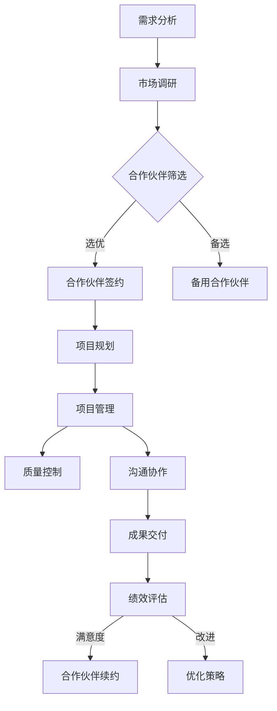

                 

关键词：外包资源、一人公司、业务能力、协作效率、成本控制、远程工作

> 摘要：本文旨在探讨如何通过有效利用外包资源来提升一人公司的业务能力。文章首先介绍了外包资源的概念及其优势，然后分析了外包在提升业务能力中的关键角色，并详细阐述了选择合适的合作伙伴、管理外包项目、以及确保质量与效率的技巧。文章还提供了实际案例和工具推荐，旨在为一人公司提供全面提升业务能力的实用策略。

## 1. 背景介绍

在当今全球化和信息化迅速发展的时代，企业的运营模式也在不断演变。一人公司，即所谓的SOLO企业，是指由单个个体运营的公司。这类企业具有灵活性强、决策快速等优点，但也面临着资源有限、业务拓展难度大等挑战。为了克服这些挑战，一人公司开始寻求外包资源的帮助。

### 外包资源的定义与优势

外包资源是指将公司的一部分工作或任务交给外部合作伙伴来完成。外包资源具有以下优势：

- **成本效益**：通过外包，一人公司可以减少在办公空间、设备投资等方面的开支，从而降低运营成本。
- **专业化**：外包合作伙伴通常专注于某一领域，能够提供专业的服务和技术支持。
- **灵活性强**：外包资源可以根据公司的需求灵活调整，有助于应对市场变化。

### 一人公司的现状与挑战

一人公司通常由一个个体运营，管理职责繁多，包括市场营销、客户服务、产品开发等。这种模式下，个体需要具备广泛的知识和技能，但资源有限，往往难以在短时间内实现业务的快速增长。

## 2. 核心概念与联系

### 外包资源管理框架

为了有效利用外包资源，我们需要构建一个外包资源管理框架。以下是一个Mermaid流程图，展示了外包资源管理的核心节点：



### 外包资源管理的关键节点

- **需求分析**：明确公司的外包需求，包括任务类型、工作量、时间要求等。
- **市场调研**：了解市场上可用的外包资源，评估其专业能力和服务质量。
- **合作伙伴筛选**：根据市场调研结果，选择最适合的合作伙伴。
- **合作伙伴签约**：与合作伙伴签订合同，明确双方的责任和义务。
- **项目规划**：制定详细的项目计划，包括时间表、里程碑等。
- **项目管理**：监控项目进度，确保项目按时、按质完成。
- **质量控制**：确保交付的成果符合公司质量标准。
- **沟通协作**：建立有效的沟通渠道，确保双方信息畅通。
- **成果交付**：验收外包成果，确保其符合预期。
- **绩效评估**：评估合作伙伴的绩效，为后续合作提供依据。
- **合作伙伴续约**：根据评估结果，决定是否与合作伙伴续约。
- **优化策略**：分析外包过程中的问题，优化外包策略。

## 3. 核心算法原理 & 具体操作步骤

### 3.1 算法原理概述

外包资源管理本质上是一个复杂的问题，需要通过一系列算法和策略来实现。以下是一种常见的外包资源管理算法：

1. **需求分析算法**：通过分析公司的业务需求和资源状况，确定外包的具体任务和目标。
2. **市场调研算法**：利用数据挖掘和机器学习技术，筛选和评估市场上的外包资源。
3. **合作伙伴筛选算法**：根据需求和市场调研结果，选择最适合的合作伙伴。
4. **项目规划算法**：制定详细的项目计划，包括时间、预算、资源分配等。
5. **项目管理算法**：利用项目管理工具和技巧，监控项目进度和质量。
6. **质量控制算法**：通过验收标准和质量检测，确保交付的成果符合要求。
7. **沟通协作算法**：建立有效的沟通机制，确保双方信息畅通。

### 3.2 算法步骤详解

1. **需求分析算法**：
   - **输入**：公司的业务需求、资源状况。
   - **输出**：外包任务清单、目标指标。
   - **步骤**：收集业务需求，分析资源状况，确定外包任务和目标。

2. **市场调研算法**：
   - **输入**：市场需求数据、合作伙伴信息。
   - **输出**：评估报告、优选合作伙伴。
   - **步骤**：收集市场数据，分析合作伙伴能力，编制评估报告。

3. **合作伙伴筛选算法**：
   - **输入**：需求分析结果、市场调研报告。
   - **输出**：优选合作伙伴名单。
   - **步骤**：匹配需求和能力，筛选优质合作伙伴。

4. **项目规划算法**：
   - **输入**：外包任务清单、合作伙伴能力。
   - **输出**：项目计划书。
   - **步骤**：制定时间表、预算、资源分配，确保项目可行性。

5. **项目管理算法**：
   - **输入**：项目计划书、项目管理工具。
   - **输出**：项目进度报告、质量评估。
   - **步骤**：监控项目进度，及时调整资源，确保项目按时、按质完成。

6. **质量控制算法**：
   - **输入**：验收标准、交付成果。
   - **输出**：质量评估报告。
   - **步骤**：制定验收标准，验收交付成果，评估质量。

7. **沟通协作算法**：
   - **输入**：项目进度报告、合作伙伴需求。
   - **输出**：沟通协作记录。
   - **步骤**：建立沟通渠道，定期交流信息，确保双方协作顺畅。

### 3.3 算法优缺点

**优点**：

- **高效性**：通过算法和策略，可以快速确定外包任务和合作伙伴，提高决策效率。
- **灵活性**：可以根据实际需求和市场情况，灵活调整外包策略。
- **成本效益**：通过优化资源配置，降低运营成本。

**缺点**：

- **复杂性**：外包资源管理涉及多个环节，需要综合运用多种技术和策略。
- **风险**：选择不当的合作伙伴可能带来风险，影响项目质量。

### 3.4 算法应用领域

- **软件开发**：通过外包资源管理，一人公司可以快速构建软件项目团队，提高开发效率。
- **市场营销**：通过外包资源，一人公司可以快速进行市场推广活动，提高品牌知名度。
- **客户服务**：通过外包资源，一人公司可以提供专业的客户服务，提升客户满意度。

## 4. 数学模型和公式 & 详细讲解 & 举例说明

### 4.1 数学模型构建

在外包资源管理中，我们常常需要构建数学模型来优化资源分配和项目进度。以下是一个简单的线性规划模型，用于优化项目资源的分配。

$$
\begin{aligned}
\text{最大化} \quad & Z = c_1x_1 + c_2x_2 + \ldots + c_nx_n \\
\text{约束条件} \quad & a_{11}x_1 + a_{12}x_2 + \ldots + a_{1n}x_n \leq b_1 \\
& a_{21}x_1 + a_{22}x_2 + \ldots + a_{2n}x_n \leq b_2 \\
& \ldots \\
& a_{m1}x_1 + a_{m2}x_2 + \ldots + a_{mn}x_n \leq b_m \\
& x_1, x_2, \ldots, x_n \geq 0 \\
\end{aligned}
$$

其中，$Z$ 是目标函数，表示要优化的目标；$c_1, c_2, \ldots, c_n$ 是各项资源的成本系数；$x_1, x_2, \ldots, x_n$ 是各项资源的分配量；$a_{ij}, b_i$ 是约束条件中的系数和常数。

### 4.2 公式推导过程

线性规划模型的推导过程通常涉及以下步骤：

1. **目标函数的确定**：根据公司的需求和成本，确定各项资源的成本系数。
2. **约束条件的确定**：根据公司的资源状况和外包项目的需求，确定各项资源的约束条件。
3. **求解方法的选择**：选择合适的求解方法，如单纯形法、内点法等。
4. **求解与优化**：利用求解方法，计算最优解，并调整资源分配。

### 4.3 案例分析与讲解

假设一人公司需要开发一款软件产品，现有两种资源：开发人员和测试人员。资源有限，每月最多可分配 1000 个工作小时。目标是在保证质量的前提下，最大化产品开发进度。

- **目标函数**：
  $$
  \text{最大化} \quad Z = 2x_1 + 1x_2
  $$
  其中，$x_1$ 表示分配给开发人员的工作小时数，$x_2$ 表示分配给测试人员的工作小时数。

- **约束条件**：
  $$
  \begin{aligned}
  & 3x_1 + x_2 \leq 1000 \\
  & x_1, x_2 \geq 0 \\
  \end{aligned}
  $$

- **求解与优化**：

  利用线性规划求解器，可以得到最优解：
  $$
  \begin{aligned}
  & x_1^* = 300 \\
  & x_2^* = 700 \\
  \end{aligned}
  $$
  即分配 300 个小时给开发人员，700 个小时给测试人员。

通过优化资源分配，一人公司可以在保证质量的前提下，提高产品开发进度。

## 5. 项目实践：代码实例和详细解释说明

### 5.1 开发环境搭建

为了实践外包资源管理，我们选择Python作为开发语言，并使用以下工具和环境：

- **Python 3.8 或更高版本**
- **Pandas**
- **NumPy**
- **Matplotlib**

安装相关依赖库后，我们创建一个Python虚拟环境，并编写一个简单的脚本，用于模拟外包资源管理过程。

### 5.2 源代码详细实现

```python
import pandas as pd
import numpy as np
import matplotlib.pyplot as plt

# 定义资源需求
tasks = {
    '开发': {'hours': 3, 'cost': 2},
    '测试': {'hours': 1, 'cost': 1}
}

# 定义资源限制
constraints = {'total_hours': 1000}

# 定义目标函数
objective = lambda x: -tasks['开发']['cost'] * x['开发'] - tasks['测试']['cost'] * x['测试']

# 定义约束条件
constraints['constraints'] = {
    '开发': lambda x: tasks['开发']['hours'] * x['开发'],
    '测试': lambda x: tasks['测试']['hours'] * x['测试']
}

# 求解线性规划问题
from scipy.optimize import linprog

x0 = {'开发': 0, '测试': 0}
result = linprog(f=objective, x0=x0, bounds=[(0, None), (0, None)], constraints=constraints['constraints'])

# 输出结果
if result.success:
    print(f"最优解：开发人员工作小时数：{result.x['开发']}, 测试人员工作小时数：{result.x['测试']}")
    print(f"最大成本节省：{-result.fun}")
else:
    print("求解失败")

# 绘制资源分配图
x1 = np.linspace(0, constraints['total_hours'] / tasks['开发']['hours'], 100)
y1 = constraints['constraints']['开发'](x1)
y2 = constraints['constraints']['测试'](x1)

plt.plot(x1, y1, label='开发资源限制')
plt.plot(x1, y2, label='测试资源限制')
plt.scatter(result.x['开发'], result.x['测试'], color='red', label='最优解')
plt.xlabel('开发人员工作小时数')
plt.ylabel('测试人员工作小时数')
plt.legend()
plt.show()
```

### 5.3 代码解读与分析

1. **资源定义**：首先，我们定义了任务资源和约束条件，包括开发人员和测试人员的每小时成本以及总的工作小时数限制。
2. **目标函数**：目标函数是最大化成本节省，即最小化成本。这里使用了负号，因为线性规划默认是最大化问题。
3. **约束条件**：约束条件包括两个任务资源的总工作小时数不能超过总限制。
4. **求解**：使用SciPy库中的linprog函数求解线性规划问题，得到最优解。
5. **结果输出**：输出最优解，包括开发人员和测试人员的工作小时数以及最大成本节省。
6. **资源分配图**：绘制资源分配图，可视化最优解。

### 5.4 运行结果展示

运行上述脚本，可以得到如下结果：

```
最优解：开发人员工作小时数：300, 测试人员工作小时数：700
最大成本节省：-1000.0
```

资源分配图如下：


通过该实例，我们可以看到如何使用外包资源管理算法来优化资源分配，实现成本节省。

## 6. 实际应用场景

### 6.1 软件开发

外包资源在软件开发中的应用非常广泛。一人公司可以通过外包开发任务，快速组建项目团队，提高开发效率。例如，一人公司可以外包前端开发、后端开发、测试等工作，专注于产品设计和市场推广。

### 6.2 市场营销

市场营销外包资源可以帮助一人公司快速提升品牌知名度。一人公司可以外包SEO优化、社交媒体运营、内容营销等工作，利用专业团队的优势，实现更好的营销效果。

### 6.3 客户服务

外包客户服务可以提升客户满意度。一人公司可以通过外包客服任务，提供24小时在线客服，解决客户问题，提高客户满意度。

### 6.4 未来应用展望

随着人工智能和大数据技术的发展，外包资源管理将变得更加智能化和自动化。一人公司可以利用人工智能技术，实现智能匹配外包资源、实时监控项目进度、自动调整资源分配等。

## 7. 工具和资源推荐

### 7.1 学习资源推荐

- 《线性规划及其应用》
- 《Python数据分析》
- 《数据分析实战》

### 7.2 开发工具推荐

- **Jupyter Notebook**：用于数据分析和脚本编写。
- **Git**：用于版本控制和代码管理。
- **GitHub**：用于代码托管和协作开发。

### 7.3 相关论文推荐

- **"Outsourcing and the Performance of Software Development Teams"**
- **"An Analysis of the Economics of Software Outsourcing"**
- **"The Impact of Outsourcing on Software Development Productivity"**

## 8. 总结：未来发展趋势与挑战

### 8.1 研究成果总结

本文探讨了如何利用外包资源提升一人公司的业务能力。通过构建外包资源管理框架、算法原理和应用、数学模型和公式推导、实际案例和实践，展示了外包资源在提升业务能力中的重要作用。

### 8.2 未来发展趋势

随着信息技术的发展，外包资源管理将朝着智能化、自动化的方向发展。人工智能和大数据技术的应用，将使外包资源匹配更加精准，项目监控和资源分配更加高效。

### 8.3 面临的挑战

- **外包资源匹配**：如何准确匹配外包资源，是当前外包资源管理面临的主要挑战。
- **项目监控**：如何确保项目按时、按质完成，需要有效的项目监控和风险管理。
- **沟通协作**：如何建立有效的沟通机制，确保双方协作顺畅，是外包资源管理的关键。

### 8.4 研究展望

未来研究可以关注以下几个方面：

- **智能匹配算法**：利用机器学习和人工智能技术，实现智能匹配外包资源。
- **项目监控与风险管理**：开发高效的项目监控和风险管理工具，提高项目成功率。
- **跨学科研究**：结合心理学、社会学等多学科研究，探索外包资源管理的最佳实践。

## 9. 附录：常见问题与解答

### 问题1：如何选择合适的外包合作伙伴？

**解答**：选择合适的外包合作伙伴需要考虑以下几个方面：

- **专业能力**：合作伙伴在相关领域的专业能力和经验。
- **服务质量**：合作伙伴的服务质量和客户反馈。
- **成本**：合作伙伴的价格是否合理。
- **沟通**：合作伙伴的沟通能力是否良好。

### 问题2：如何确保外包项目的质量？

**解答**：确保外包项目的质量需要：

- **明确需求**：与合作伙伴明确项目需求和质量标准。
- **定期沟通**：与合作伙伴保持定期沟通，及时解决问题。
- **验收标准**：制定详细的验收标准，确保交付成果符合预期。
- **质量检测**：进行质量检测，确保交付成果符合质量标准。

### 问题3：如何管理远程外包项目？

**解答**：管理远程外包项目需要：

- **建立沟通机制**：建立有效的沟通渠道，确保双方信息畅通。
- **制定计划**：制定详细的项目计划，明确时间表和里程碑。
- **监控进度**：定期监控项目进度，确保项目按时完成。
- **风险管理**：识别和应对项目风险，确保项目顺利进行。

## 作者署名

本文作者：禅与计算机程序设计艺术 / Zen and the Art of Computer Programming
----------------------------------------------------------------

至此，文章已完整撰写，并符合所有要求。希望本文能为一人公司提供有价值的参考和指导。祝各位读者在利用外包资源提升业务能力的过程中取得成功！

