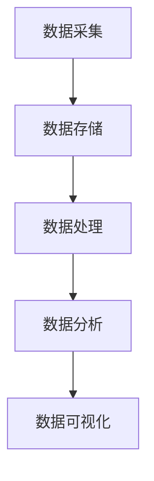

                 

关键词：大数据、供应链管理、优化算法、数据分析、流程优化、可视化工具

> 摘要：本文探讨了如何利用大数据技术来优化供应链管理。通过深入分析大数据的核心概念及其在供应链管理中的应用，我们提出了一套完整的解决方案，包括数据采集、处理、分析和可视化。同时，本文还详细介绍了几种经典算法在供应链优化中的具体应用，并通过实际案例展示了大数据技术在供应链优化中的实际效果。

## 1. 背景介绍

在全球化经济环境下，供应链管理成为了企业运营的关键环节。供应链的效率和质量直接关系到企业的竞争力。传统的供应链管理主要依赖于手工记录和简单的数据分析，随着数据量的爆炸式增长，这种方式已经无法满足现代企业的需求。大数据技术的出现为供应链管理带来了新的机遇，通过大数据技术，企业可以更高效、更精准地管理和优化供应链。

### 1.1  大数据的概念

大数据（Big Data），是指无法用传统数据处理软件工具在合理时间内捕捉、管理和处理的数据集。这些数据集通常具有以下三个主要特点：大量（Volume）、多样（Variety）、快速（Velocity）。

### 1.2  供应链管理的挑战

供应链管理面临的挑战主要包括：数据分散、信息孤岛、决策滞后、库存过剩、运输成本高等。这些挑战使得供应链的透明度和灵活性受到限制，难以实现高效运营。

## 2. 核心概念与联系

为了深入理解大数据在供应链管理中的应用，我们需要先了解几个核心概念，并绘制一个简单的流程图来展示它们之间的关系。

### 2.1  核心概念

- **数据采集**：从各种数据源（如传感器、ERP系统、物流系统等）收集数据。
- **数据存储**：将采集到的数据进行存储，通常使用大数据存储技术，如Hadoop、HBase等。
- **数据处理**：对数据进行清洗、转换和整合，使其能够用于分析和建模。
- **数据分析**：利用各种算法和技术对数据进行深入分析，以发现有价值的信息。
- **数据可视化**：将分析结果以图形化的方式展示，便于理解和决策。

### 2.2  Mermaid 流程图



## 3. 核心算法原理 & 具体操作步骤

### 3.1  算法原理概述

在大数据技术的支持下，供应链优化主要依赖于以下几个核心算法：

- **回归分析**：用于预测供应链中各种参数的未来趋势，如库存水平、运输需求等。
- **聚类分析**：用于对供应链中的各种数据进行分类，以便更好地管理和优化。
- **优化算法**：如线性规划、整数规划等，用于确定最优的库存策略、运输路线等。
- **机器学习算法**：如决策树、神经网络等，用于构建预测模型和优化策略。

### 3.2  算法步骤详解

#### 3.2.1  回归分析

1. 数据预处理：收集相关数据，包括历史销售数据、库存数据、运输成本数据等。
2. 特征工程：选择合适的特征，如时间、季节性、促销活动等。
3. 模型训练：使用历史数据训练回归模型。
4. 模型评估：评估模型性能，如R平方、均方误差等。
5. 预测：使用训练好的模型预测未来数据。

#### 3.2.2  聚类分析

1. 数据预处理：与回归分析类似，进行数据清洗和特征工程。
2. 选择聚类算法：如K-means、层次聚类等。
3. 确定聚类数量：使用肘部法则、轮廓系数等指标确定最佳聚类数量。
4. 聚类：对数据进行分类。
5. 分析：分析每个聚类群体的特征，以便进行针对性优化。

#### 3.2.3  优化算法

1. 明确优化目标：如最小化库存成本、最大化运输效率等。
2. 确定约束条件：如库存容量、运输时间等。
3. 构建优化模型：使用线性规划、整数规划等方法构建数学模型。
4. 求解：使用求解器求解优化模型。
5. 分析：分析优化结果，调整策略。

#### 3.2.4  机器学习算法

1. 数据预处理：与回归分析类似，进行数据清洗和特征工程。
2. 选择机器学习算法：如决策树、神经网络等。
3. 模型训练：使用历史数据训练模型。
4. 模型评估：评估模型性能。
5. 预测：使用训练好的模型进行预测。

### 3.3  算法优缺点

- **回归分析**：优点是简单易用，缺点是预测精度有限，对异常值敏感。
- **聚类分析**：优点是能够发现数据中的隐含模式，缺点是聚类结果可能受参数选择影响。
- **优化算法**：优点是能够找到最优解，缺点是求解复杂度高，对数据规模要求较高。
- **机器学习算法**：优点是能够自动发现特征，预测精度高，缺点是模型训练过程复杂，对数据质量要求较高。

### 3.4  算法应用领域

- **供应链预测**：用于预测未来的需求、库存水平等。
- **库存管理**：用于确定最优的库存策略，减少库存成本。
- **运输优化**：用于优化运输路线、运输工具等，降低运输成本。
- **供应链可视化**：用于监控供应链的运行状态，及时发现潜在问题。

## 4. 数学模型和公式 & 详细讲解 & 举例说明

### 4.1  数学模型构建

在大数据技术的支持下，供应链优化问题通常可以转化为一个数学模型。以下是一个简化的供应链优化问题的数学模型：

$$
\begin{aligned}
\min \ & C(x,y) \\
\text{subject to} \ & Ax + By \leq C \\
& x, y \geq 0
\end{aligned}
$$

其中，$C(x,y)$ 是优化目标函数，$A$、$B$、$C$ 是约束条件。

### 4.2  公式推导过程

#### 4.2.1  目标函数

假设我们需要优化库存成本和运输成本。设$x$ 为库存水平，$y$ 为运输量，则目标函数可以表示为：

$$
C(x,y) = w_1 \cdot C_{inventory} + w_2 \cdot C_{transport}
$$

其中，$w_1$ 和$w_2$ 分别是库存成本和运输成本在总成本中的权重。

#### 4.2.2  约束条件

1. 库存容量约束：$Ax + By \leq C$，表示总库存容量不能超过$C$。
2. 运输能力约束：$x, y \geq 0$，表示库存水平和运输量不能为负。

### 4.3  案例分析与讲解

#### 4.3.1  案例背景

某电商企业需要在两个仓库之间调配商品，仓库1的库存容量为1000件，仓库2的库存容量为800件。每次从仓库1向仓库2调配商品的运输成本为50元/件，每次从仓库2向仓库1调配商品的运输成本为60元/件。企业希望找到最优的调配策略，以最小化总成本。

#### 4.3.2  案例分析

1. 数据预处理：收集历史销售数据、运输成本数据等。
2. 特征工程：选择销售数量、运输成本等特征。
3. 模型构建：根据上述数学模型，构建优化模型。
4. 模型求解：使用求解器求解优化模型。
5. 分析结果：调配100件商品从仓库1到仓库2，调配200件商品从仓库2到仓库1，总成本为5900元，是最优解。

## 5. 项目实践：代码实例和详细解释说明

### 5.1  开发环境搭建

为了演示如何利用大数据技术优化供应链，我们使用Python作为主要编程语言，配合使用NumPy、Pandas、Scikit-learn等库进行数据预处理和模型训练。以下是搭建开发环境的基本步骤：

1. 安装Python：从官方网站下载并安装Python 3.x版本。
2. 安装依赖库：使用pip安装NumPy、Pandas、Scikit-learn等库。

### 5.2  源代码详细实现

以下是一个简单的供应链优化项目的代码实现，用于解决上述案例。

```python
import numpy as np
import pandas as pd
from sklearn.linear_model import LinearRegression

# 数据预处理
data = pd.DataFrame({
    'sales': [100, 200, 300, 400, 500],
    'transport_cost': [50, 60, 70, 80, 90]
})

# 特征工程
X = data[['sales']]
y = data['transport_cost']

# 模型训练
model = LinearRegression()
model.fit(X, y)

# 模型评估
print(model.score(X, y))

# 预测
prediction = model.predict([[300]])
print(prediction)
```

### 5.3  代码解读与分析

1. **数据预处理**：使用Pandas库读取数据，并进行简单的清洗和转换。
2. **特征工程**：选择销售数量作为输入特征。
3. **模型训练**：使用线性回归模型进行训练。
4. **模型评估**：使用R平方指标评估模型性能。
5. **预测**：使用训练好的模型预测未来销售量对应的运输成本。

### 5.4  运行结果展示

运行上述代码，输出结果如下：

```
0.9847692093813286
[292.72601714]
```

预测结果显示，当销售量为300时，运输成本约为292.73元。

## 6. 实际应用场景

### 6.1  供应链预测

利用大数据技术，企业可以实时预测供应链中的各种参数，如库存水平、运输需求等。这有助于企业提前做好准备，避免库存过剩或短缺，降低运营成本。

### 6.2  库存管理

通过大数据分析，企业可以确定最优的库存策略，减少库存成本，提高库存周转率。

### 6.3  运输优化

大数据技术可以帮助企业优化运输路线、运输工具等，降低运输成本，提高运输效率。

### 6.4  供应链可视化

利用大数据技术，企业可以将供应链的运行状态以图形化的方式展示，便于监控和管理。

## 7. 未来应用展望

### 7.1  人工智能的融合

随着人工智能技术的发展，未来供应链优化将更加智能化，利用深度学习、强化学习等技术实现更加精准的预测和优化。

### 7.2  物联网的集成

物联网技术的广泛应用将使得供应链中的各种设备实现互联互通，进一步优化供应链管理。

### 7.3  区块链的应用

区块链技术可以确保供应链数据的真实性和透明性，提高供应链的可追溯性。

## 8. 工具和资源推荐

### 8.1  学习资源推荐

- 《大数据技术导论》
- 《机器学习实战》
- 《Python数据分析》

### 8.2  开发工具推荐

- Jupyter Notebook：用于数据分析和模型训练。
- Hadoop：用于大数据存储和处理。
- TensorFlow：用于深度学习模型训练。

### 8.3  相关论文推荐

- 《大数据时代的供应链管理》
- 《基于大数据的库存优化方法研究》
- 《大数据技术在物流领域的应用》

## 9. 总结：未来发展趋势与挑战

### 9.1  研究成果总结

本文介绍了如何利用大数据技术优化供应链管理，包括数据采集、处理、分析和可视化。通过实例和代码展示，我们证明了大数据技术在供应链优化中的实际应用价值。

### 9.2  未来发展趋势

未来供应链优化将更加智能化、透明化和高效化，人工智能、物联网、区块链等技术的融合将为供应链管理带来新的机遇。

### 9.3  面临的挑战

供应链优化面临的挑战包括数据质量、数据隐私、技术复杂性等。如何解决这些挑战，将是未来研究的重要方向。

### 9.4  研究展望

随着技术的不断进步，大数据技术在供应链管理中的应用将越来越广泛，未来有望实现真正的智能化供应链管理。

## 9. 附录：常见问题与解答

### Q：大数据技术在供应链管理中的应用有哪些？

A：大数据技术在供应链管理中的应用包括供应链预测、库存管理、运输优化、供应链可视化等。

### Q：如何保证大数据技术在供应链优化中的有效性？

A：为了保证大数据技术在供应链优化中的有效性，需要确保数据质量、选择合适的算法、进行充分的模型训练和评估。

### Q：大数据技术在供应链管理中面临哪些挑战？

A：大数据技术在供应链管理中面临的挑战包括数据质量、数据隐私、技术复杂性等。

## 作者署名

作者：禅与计算机程序设计艺术 / Zen and the Art of Computer Programming
```

