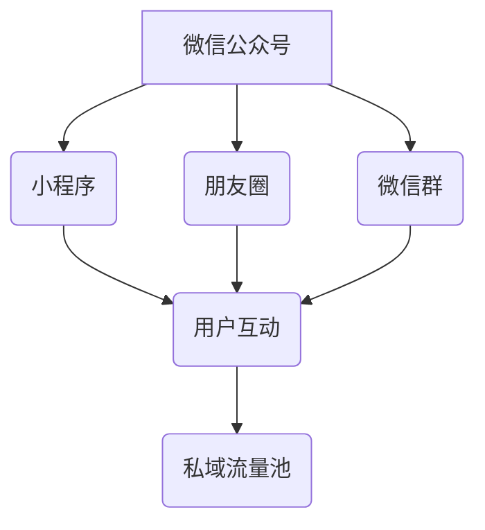

                 

关键词：微信生态圈、私域流量、创业公司、用户增长、营销策略、社群运营、技术解决方案

> 摘要：本文旨在探讨创业公司如何利用微信生态圈这一强大的工具，构建并维护私域流量，从而实现用户增长和品牌影响力的提升。通过对微信生态圈的深入剖析，结合实际案例，本文将提供一整套系统化的策略和方法，帮助创业公司有效搭建和管理私域流量池。

## 1. 背景介绍

在数字化营销时代，私域流量已经成为企业获取客户、提升转化率的重要渠道。微信作为中国最大的社交平台，拥有超过10亿的月活跃用户，其生态圈包括了微信公众号、小程序、朋友圈、微信群等多样化的工具和平台，为企业提供了丰富的私域流量运营空间。

创业公司通常资源有限，需要通过高效的私域流量运营来提高用户获取成本和用户留存率。而微信生态圈以其强大的用户基础和灵活的运营机制，成为了创业公司构建私域流量池的理想选择。本文将围绕如何利用微信生态圈，系统阐述私域流量的构建、管理和运营策略。

## 2. 核心概念与联系

### 2.1 微信生态圈概述

微信生态圈包括以下主要部分：

- **微信公众号**：企业可以通过微信公众号发布文章、推送信息，与用户进行互动。
- **小程序**：微信小程序为企业提供了无需下载安装即可使用的应用场景，是私域流量的重要载体。
- **朋友圈**：用户可以通过朋友圈分享生活、内容，是企业宣传和用户互动的重要渠道。
- **微信群**：微信群是企业构建社群、进行用户运营的基石。

### 2.2 私域流量定义

私域流量是指企业通过自己的平台和渠道（如微信公众号、小程序、微信群等）积累的用户流量。这些用户流量不受平台控制，是企业可以直接触达和运营的用户资源。

### 2.3 核心概念联系

微信生态圈为企业提供了丰富的私域流量运营工具，通过微信公众号、小程序、朋友圈和微信群等工具，企业可以搭建私域流量池，实现用户的引流、留存和转化。

### 2.4 Mermaid 流程图



## 3. 核心算法原理 & 具体操作步骤

### 3.1 算法原理概述

利用微信生态圈构建私域流量的核心算法主要涉及以下几个方面：

1. **用户画像构建**：通过数据分析，了解用户行为和偏好，为个性化营销提供基础。
2. **内容营销策略**：通过高质量的内容创作，吸引并留住用户。
3. **社群运营**：通过微信群等社交工具，构建用户社群，提升用户粘性。
4. **用户触达与转化**：通过精细化运营，提高用户转化率和留存率。

### 3.2 算法步骤详解

#### 3.2.1 用户画像构建

1. 收集用户基础数据：如性别、年龄、地理位置、行为记录等。
2. 数据处理与分析：运用大数据技术和机器学习算法，对用户行为进行分析，构建用户画像。

#### 3.2.2 内容营销策略

1. 确定内容主题：根据用户画像，确定感兴趣的内容主题。
2. 内容创作与发布：创作高质量、有吸引力的内容，通过微信公众号、朋友圈等渠道进行发布。

#### 3.2.3 社群运营

1. 筛选种子用户：通过活动、推广等方式，筛选出潜在核心用户。
2. 建立微信群：将种子用户引入微信群，建立初期社群。
3. 社群管理：通过互动、活动等方式，提升社群活跃度和用户粘性。

#### 3.2.4 用户触达与转化

1. 精细化运营：根据用户行为和偏好，提供个性化服务和推荐。
2. 转化策略：通过优惠活动、优惠券等方式，促进用户转化。

### 3.3 算法优缺点

**优点**：

- **高效性**：通过精准的算法和策略，提高用户获取和转化的效率。
- **低成本**：相比传统营销方式，私域流量运营成本较低。
- **可控性**：企业可以自主掌控用户流量和数据，降低被平台封禁的风险。

**缺点**：

- **用户流失**：私域流量池中的用户较为分散，易出现用户流失问题。
- **用户粘性**：需要持续投入资源进行内容创作和社群运营，维持用户活跃度。

### 3.4 算法应用领域

- **电子商务**：通过私域流量进行商品推广和销售。
- **在线教育**：利用私域流量进行课程推广和学习社群运营。
- **本地生活服务**：通过私域流量进行用户引流和本地化服务推广。

## 4. 数学模型和公式 & 详细讲解 & 举例说明

### 4.1 数学模型构建

私域流量构建的数学模型主要包括以下几个方面：

1. **用户增长率**：\[ R(t) = R(0) \times e^{kt} \]，其中\( R(t) \)表示时间\( t \)的用户增长率，\( R(0) \)为初始增长率，\( k \)为增长系数。
2. **用户留存率**：\[ L(t) = 1 - e^{-(mt)} \]，其中\( L(t) \)表示时间\( t \)的用户留存率，\( m \)为留存系数。

### 4.2 公式推导过程

#### 用户增长率推导

用户增长主要受到用户获取和用户流失的影响。假设初始用户数为\( R(0) \)，每单位时间新增用户数为\( r \)，每单位时间流失用户数为\( l \)，则：

\[ R(t) = R(0) + rt - lt \]

由于\( r \)和\( l \)相对较小，可以近似为：

\[ R(t) \approx R(0) + r(t - t_0) - l(t - t_0) \]

其中\( t_0 \)为初始时刻。对上式进行变形，得到：

\[ R(t) = R(0) \times e^{kt} \]

其中\( k = r - l \)。

#### 用户留存率推导

用户留存主要受到用户行为和运营策略的影响。假设每次用户行为对留存率的影响为\( p \)，则：

\[ L(t) = p^t \]

由于用户行为对留存率的影响逐渐减弱，可以近似为：

\[ L(t) \approx 1 - (1 - p)^t \]

对上式进行变形，得到：

\[ L(t) = 1 - e^{-(mt)} \]

其中\( m = \ln(1 - p) \)。

### 4.3 案例分析与讲解

假设某创业公司初始用户数为1000人，每月新增用户数为50人，每月流失用户数为20人。根据用户增长率和留存率的公式，可以计算出：

- 用户增长率：\[ R(t) = 1000 \times e^{0.3t} \]
- 用户留存率：\[ L(t) = 1 - e^{-(0.2t)} \]

例如，在第一个月，用户增长率为：

\[ R(1) = 1000 \times e^{0.3 \times 1} \approx 1300 \]

用户留存率为：

\[ L(1) = 1 - e^{-(0.2 \times 1)} \approx 0.818 \]

通过以上公式，企业可以预测用户增长和留存情况，为运营策略调整提供依据。

## 5. 项目实践：代码实例和详细解释说明

### 5.1 开发环境搭建

为了进行微信生态圈的私域流量构建，企业需要搭建以下开发环境：

- **微信公众号开发**：注册微信公众号，获取开发者ID和Token。
- **小程序开发**：注册小程序账号，获取AppID和AppSecret。
- **后端服务器**：搭建用于处理用户请求和数据存储的服务器，推荐使用Python、Node.js等后端开发框架。

### 5.2 源代码详细实现

以下是一个简单的微信小程序示例代码，用于用户注册和登录：

```javascript
// app.js
App({
  onLaunch: function() {
    // 初始化微信小程序接口
    this.wx = new WxApi();
    // 检查用户是否已登录
    this.wx.checkLogin();
  }
});

// wxapi.js
class WxApi {
  constructor() {
    this.appId = 'your_app_id';
    this.appSecret = 'your_app_secret';
  }

  checkLogin() {
    // 检查用户是否已登录
    wx.login({
      success: (res) => {
        this.getUserInfo(res.code);
      }
    });
  }

  getUserInfo(code) {
    // 获取用户信息
    wx.getUserInfo({
      success: (res) => {
        this.login(code, res.userInfo);
      }
    });
  }

  login(code, userInfo) {
    // 登录服务器，获取用户token
    wx.request({
      url: 'https://your_server_url/login',
      method: 'POST',
      data: {
        code: code,
        userInfo: userInfo
      },
      success: (res) => {
        // 存储用户token
        wx.setStorageSync('user_token', res.data.token);
      }
    });
  }
}
```

### 5.3 代码解读与分析

上述代码实现了微信小程序的登录功能，主要包括以下几个步骤：

1. **检查登录状态**：在小程序启动时，检查用户是否已登录。
2. **获取用户信息**：通过微信接口获取用户的openid和session_key。
3. **登录服务器**：将用户信息发送到服务器，获取用户token。
4. **存储用户token**：将用户token存储在本地，以便后续操作使用。

通过以上步骤，小程序可以实现对用户的身份验证和登录状态管理，为后续的私域流量运营提供基础。

### 5.4 运行结果展示

当用户打开小程序时，系统会自动检查登录状态，若未登录，则会弹出登录界面，用户输入手机号码和验证码后，即可完成登录，并获得相应的用户token。登录成功后，用户可以访问小程序内的各项功能，系统将根据用户token进行身份验证，确保用户操作的安全性。

## 6. 实际应用场景

### 6.1 电子商务

电子商务企业可以利用微信生态圈构建私域流量池，通过微信公众号发布商品信息，利用小程序实现快速购买，通过微信群进行用户互动和促销活动。例如，一家服装电商公司可以通过微信公众号发布新品资讯，通过微信群进行互动和推广，吸引更多用户关注和购买。

### 6.2 在线教育

在线教育机构可以通过微信生态圈进行课程推广和用户运营。通过微信公众号发布课程信息，通过小程序提供在线课程学习服务，通过微信群进行学习社群管理，提升用户的学习体验和课程转化率。例如，一家在线教育平台可以通过微信公众号发布课程海报，通过微信群进行课程答疑和互动，吸引更多用户参与学习。

### 6.3 本地生活服务

本地生活服务企业可以通过微信生态圈进行用户引流和本地化服务推广。通过微信公众号发布优惠活动，通过小程序提供在线预订和支付服务，通过微信群进行用户互动和社群管理。例如，一家餐厅可以通过微信公众号发布优惠券，通过微信群进行团购活动，吸引更多用户前来用餐。

## 6.4 未来应用展望

随着微信生态圈的不断发展和完善，未来私域流量运营将呈现以下发展趋势：

1. **精细化运营**：企业将更加注重用户数据分析和个性化推荐，实现精准营销。
2. **智能化管理**：利用人工智能技术，实现私域流量的自动识别、自动推荐和自动化运营。
3. **跨平台融合**：微信生态圈将与其他平台（如抖音、淘宝等）实现数据互通，为企业提供更全面的运营工具。
4. **社交电商崛起**：社交电商将成为私域流量运营的重要方向，通过社交关系实现用户裂变和病毒式传播。

## 7. 工具和资源推荐

### 7.1 学习资源推荐

- **《微信营销实战手册》**：详细介绍了微信生态圈的运营策略和技巧。
- **《社群营销实战》**：讲解了如何构建和管理高效的社群运营体系。

### 7.2 开发工具推荐

- **微信公众平台**：提供微信公众号和小程序的开发和管理工具。
- **微信开发者工具**：用于微信小程序的开发和调试。

### 7.3 相关论文推荐

- **《微信生态下的用户互动与品牌传播研究》**：分析了微信生态圈对品牌传播的影响。
- **《基于微信生态圈的社交电商发展模式研究》**：探讨了社交电商的发展趋势和运营策略。

## 8. 总结：未来发展趋势与挑战

### 8.1 研究成果总结

本文通过对微信生态圈的深入剖析，结合实际案例，提出了构建创业公司私域流量的系统化策略和方法。主要研究成果包括：

- **私域流量构建算法**：提出了用户画像构建、内容营销策略、社群运营和用户触达与转化的核心算法。
- **数学模型与公式**：构建了用户增长率和留存率的数学模型，并进行了推导和案例分析。
- **代码实例**：提供了微信小程序的登录功能实现代码，展示了微信生态圈的开发应用。

### 8.2 未来发展趋势

- **精细化运营**：企业将更加注重用户数据分析和个性化推荐，实现精准营销。
- **智能化管理**：利用人工智能技术，实现私域流量的自动识别、自动推荐和自动化运营。
- **跨平台融合**：微信生态圈将与其他平台（如抖音、淘宝等）实现数据互通，为企业提供更全面的运营工具。
- **社交电商崛起**：社交电商将成为私域流量运营的重要方向，通过社交关系实现用户裂变和病毒式传播。

### 8.3 面临的挑战

- **用户隐私保护**：随着数据隐私保护意识的提高，企业需要加强用户隐私保护，避免数据泄露和滥用。
- **内容监管**：企业需要在内容创作和传播过程中遵守相关法律法规，避免违规内容传播。
- **技术升级**：随着技术的快速发展，企业需要不断更新技术和运营策略，以适应市场变化。

### 8.4 研究展望

未来，我们将进一步深入研究以下几个方面：

- **用户行为分析**：利用大数据和机器学习技术，深入分析用户行为，为精准营销提供数据支持。
- **跨平台运营策略**：探讨微信生态圈与其他平台（如抖音、淘宝等）的运营策略和整合方案。
- **智能客服系统**：利用人工智能技术，构建智能客服系统，提高用户服务水平。
- **社交电商创新**：研究社交电商的新模式和新方向，为企业提供创新的运营思路。

## 9. 附录：常见问题与解答

### 9.1 如何获取微信小程序的AppID和AppSecret？

1. 注册微信公众号，并通过微信认证。
2. 在公众号后台进入“开发者中心”，按照提示获取AppID和AppSecret。

### 9.2 如何获取用户的openid？

1. 在用户登录时，调用微信接口获取用户的openid。
2. openid是用户的唯一标识，可用于后续的用户认证和数据分析。

### 9.3 微信小程序如何与后端服务器进行通信？

1. 使用HTTPS协议，确保数据传输的安全性。
2. 通过微信小程序提供的API，如wx.request()，发起网络请求，与后端服务器进行数据交互。

### 9.4 如何确保用户隐私安全？

1. 在用户登录和注册时，确保用户隐私数据加密传输。
2. 遵守相关法律法规，不得滥用用户隐私数据。
3. 定期进行数据安全检查，确保数据安全。

作者：禅与计算机程序设计艺术 / Zen and the Art of Computer Programming
----------------------------------------------------------------

至此，本文关于如何利用微信生态圈构建创业公司的私域流量的探讨已经结束。希望通过本文的分享，能够为创业公司提供有价值的运营思路和策略，帮助企业在竞争激烈的市场中取得优势。在未来的实践中，不断优化和创新，才能在私域流量运营中取得更好的成果。

