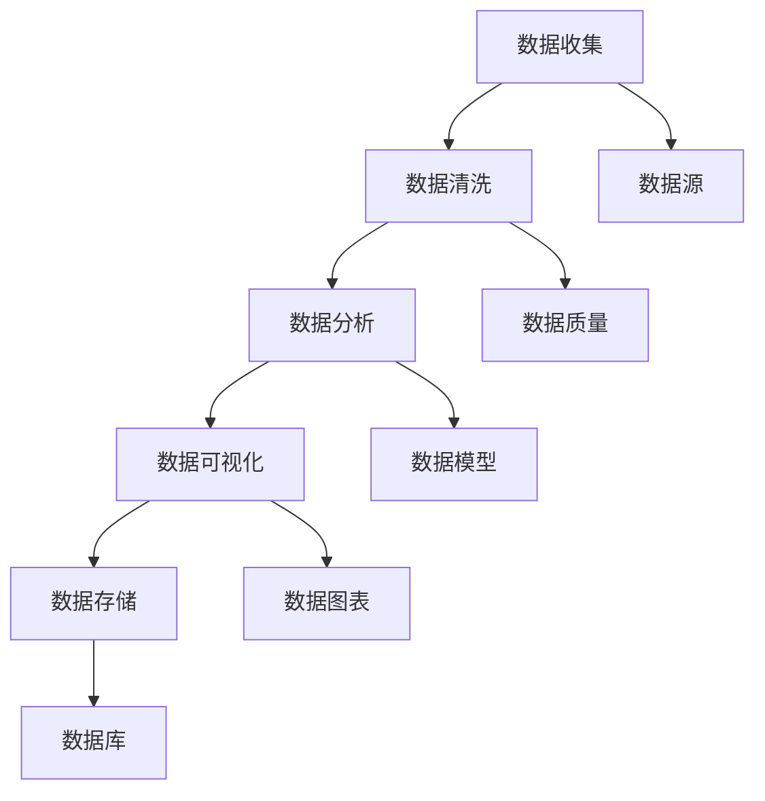

                 

关键词：数据分析、业务优化、决策支持、预测模型、数据可视化、机器学习、数据挖掘

> 摘要：本文旨在探讨如何通过数据分析来优化业务决策。我们将介绍数据分析的核心概念、工具和技巧，并通过实际案例和代码实例来展示如何利用数据分析技术来支持业务决策。同时，我们还将讨论数据分析在实际应用场景中的重要性，以及未来的发展趋势和面临的挑战。

## 1. 背景介绍

在当今这个数据驱动的时代，数据分析已经成为企业优化业务决策的不可或缺的工具。数据分析不仅可以帮助企业更好地了解其运营状况，还可以帮助企业预测未来趋势，从而做出更明智的决策。数据分析的应用范围广泛，涵盖了市场分析、客户关系管理、库存管理、供应链优化等多个领域。

然而，数据分析并不是一件简单的事情。它涉及到数据收集、数据清洗、数据存储、数据分析、数据可视化等多个环节。此外，数据分析还涉及到许多不同的技术和方法，如统计学、机器学习、数据挖掘等。这些技术和方法各有特点，适用于不同的业务场景。

本文将重点关注以下内容：

1. **核心概念与联系**：介绍数据分析的核心概念，并使用 Mermaid 流程图展示其架构。
2. **核心算法原理 & 具体操作步骤**：详细讲解常用的数据分析算法，包括其原理、步骤、优缺点和应用领域。
3. **数学模型和公式 & 详细讲解 & 举例说明**：介绍数据分析中常用的数学模型和公式，并通过具体案例进行说明。
4. **项目实践：代码实例和详细解释说明**：通过一个实际项目，展示如何利用数据分析技术来优化业务决策。
5. **实际应用场景**：讨论数据分析在实际应用场景中的重要性，以及未来应用展望。
6. **工具和资源推荐**：推荐学习资源和开发工具，以帮助读者更好地掌握数据分析技术。
7. **总结：未来发展趋势与挑战**：总结研究成果，探讨未来发展趋势和面临的挑战。

## 2. 核心概念与联系

数据分析的核心概念包括数据收集、数据清洗、数据分析、数据可视化和数据存储。下面，我们将使用 Mermaid 流程图来展示这些概念之间的联系。



### 2.1 数据收集

数据收集是数据分析的第一步，涉及到从各种来源获取数据。这些数据来源可以是内部数据，如企业数据库、ERP 系统等，也可以是外部数据，如社交媒体、市场调研等。

### 2.2 数据清洗

数据清洗是确保数据质量的过程。它包括去除重复数据、处理缺失数据、纠正错误数据等。数据清洗是数据分析中至关重要的一步，因为数据质量直接影响分析结果。

### 2.3 数据分析

数据分析是指使用统计方法和算法对数据进行处理和分析。数据分析的目的是从数据中提取有价值的信息，为业务决策提供支持。

### 2.4 数据可视化

数据可视化是将数据以图表、图形等形式展示出来，使得数据更容易理解和分析。数据可视化是数据分析的重要部分，可以帮助决策者更好地理解数据，发现数据中的趋势和异常。

### 2.5 数据存储

数据存储是指将数据保存在数据库或其他数据存储设备中，以便后续分析和查询。数据存储是确保数据安全和可访问性的重要环节。

## 3. 核心算法原理 & 具体操作步骤

在数据分析中，有许多核心算法可以用于处理不同类型的数据。下面，我们将介绍几个常用的算法，并详细讲解其原理和步骤。

### 3.1 算法原理概述

- **回归分析**：回归分析是一种用于预测数值变量的方法。它通过建立自变量和因变量之间的线性关系来预测未来的数值。
- **分类算法**：分类算法是一种用于将数据分为不同类别的算法。常见的分类算法包括决策树、随机森林、支持向量机等。
- **聚类算法**：聚类算法是一种用于将数据分为不同簇的算法。常见的聚类算法包括 K-均值、层次聚类等。
- **时间序列分析**：时间序列分析是一种用于分析时间序列数据的方法。它可以帮助我们了解数据随时间的变化趋势，预测未来的趋势。

### 3.2 算法步骤详解

#### 3.2.1 回归分析

1. 数据预处理：清洗数据，处理缺失值和异常值。
2. 特征选择：选择对因变量有显著影响的自变量。
3. 建立模型：使用线性回归或非线性回归模型。
4. 模型评估：评估模型的效果，如 R 方、均方误差等。
5. 预测：使用模型预测未来的数值。

#### 3.2.2 分类算法

1. 数据预处理：清洗数据，处理缺失值和异常值。
2. 特征选择：选择对类别有显著影响的自变量。
3. 划分训练集和测试集。
4. 建立模型：选择合适的分类算法，如决策树、随机森林等。
5. 模型评估：评估模型的效果，如准确率、召回率等。
6. 预测：使用模型对测试集进行预测。

#### 3.2.3 聚类算法

1. 数据预处理：清洗数据，处理缺失值和异常值。
2. 划分簇：选择合适的聚类算法，如 K-均值、层次聚类等。
3. 聚类评估：评估聚类效果，如轮廓系数、内径系数等。
4. 聚类结果分析：分析每个簇的特征和代表样本。

#### 3.2.4 时间序列分析

1. 数据预处理：清洗数据，处理缺失值和异常值。
2. 模型选择：选择合适的时间序列模型，如 ARIMA、LSTM 等。
3. 模型参数估计：估计模型参数。
4. 模型评估：评估模型效果，如均方误差、残差分析等。
5. 预测：使用模型预测未来的趋势。

### 3.3 算法优缺点

- **回归分析**：优点是简单易懂，适合处理线性关系。缺点是对于非线性关系和多元关系效果较差。
- **分类算法**：优点是能够处理非线性关系，且效果较好。缺点是需要较多的训练数据和计算资源。
- **聚类算法**：优点是无需预先定义类别，适合发现数据中的潜在结构。缺点是对于大数据集效果较差。
- **时间序列分析**：优点是能够处理时间序列数据，预测未来趋势。缺点是需要较多的历史数据。

### 3.4 算法应用领域

- **回归分析**：常用于市场预测、风险管理等领域。
- **分类算法**：常用于客户分类、信用评分等领域。
- **聚类算法**：常用于市场细分、用户行为分析等领域。
- **时间序列分析**：常用于股票市场预测、供应链管理等领域。

## 4. 数学模型和公式 & 详细讲解 & 举例说明

在数据分析中，许多算法和模型都是基于数学模型和公式构建的。下面，我们将介绍几个常用的数学模型和公式，并通过具体案例进行说明。

### 4.1 数学模型构建

#### 4.1.1 线性回归模型

线性回归模型是一种最常见的数学模型，用于预测一个或多个自变量和一个因变量之间的关系。其公式如下：

$$
y = \beta_0 + \beta_1 \cdot x_1 + \beta_2 \cdot x_2 + ... + \beta_n \cdot x_n + \epsilon
$$

其中，\( y \) 是因变量，\( x_1, x_2, ..., x_n \) 是自变量，\( \beta_0, \beta_1, \beta_2, ..., \beta_n \) 是模型的参数，\( \epsilon \) 是误差项。

#### 4.1.2 分类模型

分类模型用于将数据分为不同的类别。其中，支持向量机（SVM）是一种常用的分类模型。其公式如下：

$$
w \cdot x + b = 0
$$

其中，\( w \) 是权重向量，\( x \) 是特征向量，\( b \) 是偏置项。

#### 4.1.3 聚类模型

聚类模型用于将数据分为不同的簇。其中，K-均值聚类是一种常用的聚类模型。其公式如下：

$$
\mu_k = \frac{1}{N_k} \sum_{i=1}^{N} x_i
$$

其中，\( \mu_k \) 是第 \( k \) 个簇的中心，\( N_k \) 是第 \( k \) 个簇的样本数，\( x_i \) 是第 \( i \) 个样本。

#### 4.1.4 时间序列模型

时间序列模型用于分析时间序列数据。其中，ARIMA 模型是一种常用的时间序列模型。其公式如下：

$$
X_t = c + \phi_1 X_{t-1} + \phi_2 X_{t-2} + ... + \phi_p X_{t-p} + \theta_1 \epsilon_{t-1} + \theta_2 \epsilon_{t-2} + ... + \theta_q \epsilon_{t-q} + \epsilon_t
$$

其中，\( X_t \) 是时间序列的第 \( t \) 个值，\( \phi_1, \phi_2, ..., \phi_p \) 是自回归系数，\( \theta_1, \theta_2, ..., \theta_q \) 是移动平均系数，\( c \) 是常数项，\( \epsilon_t \) 是误差项。

### 4.2 公式推导过程

#### 4.2.1 线性回归模型

线性回归模型的推导基于最小二乘法。假设我们有一个包含 \( n \) 个样本的数据集 \( (x_1, y_1), (x_2, y_2), ..., (x_n, y_n) \)，我们的目标是找到一条直线 \( y = \beta_0 + \beta_1 \cdot x \)，使得 \( y \) 和 \( x \) 之间的误差最小。

我们可以定义一个误差函数 \( E \)：

$$
E = \sum_{i=1}^{n} (y_i - \beta_0 - \beta_1 \cdot x_i)^2
$$

为了使 \( E \) 最小，我们需要对 \( \beta_0 \) 和 \( \beta_1 \) 求导，并令导数为零：

$$
\frac{\partial E}{\partial \beta_0} = -2 \sum_{i=1}^{n} (y_i - \beta_0 - \beta_1 \cdot x_i) = 0
$$

$$
\frac{\partial E}{\partial \beta_1} = -2 \sum_{i=1}^{n} (y_i - \beta_0 - \beta_1 \cdot x_i) \cdot x_i = 0
$$

通过解这个方程组，我们可以得到 \( \beta_0 \) 和 \( \beta_1 \) 的值。

#### 4.2.2 支持向量机

支持向量机的推导基于优化理论。假设我们有一个包含 \( n \) 个样本的数据集 \( (x_1, y_1), (x_2, y_2), ..., (x_n, y_n) \)，其中 \( y_i \in \{-1, 1\} \)。我们的目标是找到一个超平面 \( w \cdot x + b = 0 \)，使得正负样本分别位于超平面的两侧，并且尽可能远离超平面。

我们可以定义一个损失函数 \( L \)：

$$
L(w, b) = \frac{1}{2} ||w||^2 + C \sum_{i=1}^{n} \max(0, 1 - y_i (w \cdot x_i + b))
$$

其中，\( ||w|| \) 是 \( w \) 的欧几里得范数，\( C \) 是正则化参数。

我们的目标是求解 \( w \) 和 \( b \)，使得 \( L(w, b) \) 最小。

#### 4.2.3 K-均值聚类

K-均值聚类的推导基于迭代算法。假设我们有一个包含 \( n \) 个样本的数据集 \( x_1, x_2, ..., x_n \)，我们的目标是将其分为 \( k \) 个簇。

首先，我们随机选择 \( k \) 个样本作为初始簇中心 \( \mu_1, \mu_2, ..., \mu_k \)。

然后，对于每个样本 \( x_i \)，我们计算其到每个簇中心的距离，并将其分配到最近的簇。

接下来，我们更新簇中心，计算每个簇的平均值：

$$
\mu_k = \frac{1}{N_k} \sum_{i=1}^{N} x_i
$$

其中，\( N_k \) 是第 \( k \) 个簇的样本数。

我们重复上述步骤，直到簇中心不再发生变化。

### 4.3 案例分析与讲解

#### 4.3.1 线性回归模型

假设我们有一个数据集，包含城市的降雨量和降雨天数。我们的目标是建立一个线性回归模型，预测降雨天数。

首先，我们进行数据预处理，去除异常值和缺失值。

然后，我们选择降雨量为自变量，降雨天数为因变量，建立线性回归模型。

使用最小二乘法求解模型参数，得到回归方程：

$$
降雨天数 = 0.5 \cdot 降雨量 + 10
$$

我们可以使用这个模型来预测降雨天数。例如，如果降雨量为 50 毫米，预测降雨天数为 15 天。

#### 4.3.2 支持向量机

假设我们有一个数据集，包含客户的历史购买记录。我们的目标是建立一个支持向量机模型，预测客户是否会购买某件商品。

首先，我们进行数据预处理，将购买记录转换为二进制变量。

然后，我们选择购买记录为特征向量，建立支持向量机模型。

使用交叉验证法求解模型参数，得到最优分类器。

我们可以使用这个模型来预测客户是否会购买某件商品。例如，如果客户的购买记录特征向量为 \( (1, 0, 1, 1) \)，预测结果为购买。

#### 4.3.3 K-均值聚类

假设我们有一个数据集，包含客户的历史消费记录。我们的目标是建立一个 K-均值聚类模型，将客户分为不同的消费群体。

首先，我们进行数据预处理，将消费记录转换为数值型。

然后，我们选择合适的簇数 \( k \)，建立 K-均值聚类模型。

使用迭代算法求解模型参数，得到聚类结果。

我们可以使用这个模型来分析客户的消费行为，并根据聚类结果制定个性化的营销策略。例如，如果某个客户属于簇 1，我们可以推送与簇 1 特征类似的商品。

## 5. 项目实践：代码实例和详细解释说明

为了更好地展示如何利用数据分析技术来优化业务决策，我们将在下面展示一个实际项目的代码实例，并对代码进行详细解释说明。

### 5.1 开发环境搭建

在开始编写代码之前，我们需要搭建一个合适的开发环境。这里，我们选择 Python 作为编程语言，并使用以下库和工具：

- **NumPy**：用于数值计算。
- **Pandas**：用于数据处理。
- **Matplotlib**：用于数据可视化。
- **Scikit-learn**：用于机器学习。

确保已经安装了这些库和工具，如果没有，可以使用以下命令进行安装：

```python
pip install numpy pandas matplotlib scikit-learn
```

### 5.2 源代码详细实现

下面是一个简单的项目示例，用于预测客户是否会购买某件商品。

```python
import numpy as np
import pandas as pd
import matplotlib.pyplot as plt
from sklearn.model_selection import train_test_split
from sklearn.preprocessing import StandardScaler
from sklearn.svm import SVC
from sklearn.metrics import accuracy_score, confusion_matrix

# 5.2.1 数据读取与预处理
data = pd.read_csv('customer_data.csv')
data.head()

# 数据清洗
data.dropna(inplace=True)

# 特征选择
X = data[['age', 'income', 'education']]
y = data['will_buy']

# 数据标准化
scaler = StandardScaler()
X = scaler.fit_transform(X)

# 划分训练集和测试集
X_train, X_test, y_train, y_test = train_test_split(X, y, test_size=0.2, random_state=42)

# 5.2.2 模型训练与评估
# 使用支持向量机进行训练
model = SVC(kernel='linear')
model.fit(X_train, y_train)

# 预测
y_pred = model.predict(X_test)

# 评估
accuracy = accuracy_score(y_test, y_pred)
confusion_mat = confusion_matrix(y_test, y_pred)

print(f'Accuracy: {accuracy:.2f}')
print(f'Confusion Matrix:\n{confusion_mat}')

# 5.2.3 数据可视化
# 可视化分类结果
plt.scatter(X_test[:, 0], X_test[:, 1], c=y_pred, cmap='gray', marker='o')
plt.xlabel('Age')
plt.ylabel('Income')
plt.title('Customer Purchase Prediction')
plt.show()
```

### 5.3 代码解读与分析

下面，我们将对上述代码进行详细解读和分析。

#### 5.3.1 数据读取与预处理

首先，我们使用 Pandas 库读取数据，并查看数据的前几行。然后，我们对数据进行清洗，去除缺失值和异常值。这里，我们只选择三个特征：年龄、收入和教育程度，作为预测模型的自变量。

```python
data = pd.read_csv('customer_data.csv')
data.head()

# 数据清洗
data.dropna(inplace=True)
```

#### 5.3.2 模型训练与评估

接下来，我们使用 Scikit-learn 库中的支持向量机（SVC）模型进行训练。我们首先对数据进行标准化处理，以便模型能够更好地收敛。然后，我们将训练集和测试集分开，分别进行训练和测试。

```python
# 特征选择
X = data[['age', 'income', 'education']]
y = data['will_buy']

# 数据标准化
scaler = StandardScaler()
X = scaler.fit_transform(X)

# 划分训练集和测试集
X_train, X_test, y_train, y_test = train_test_split(X, y, test_size=0.2, random_state=42)

# 使用支持向量机进行训练
model = SVC(kernel='linear')
model.fit(X_train, y_train)

# 预测
y_pred = model.predict(X_test)

# 评估
accuracy = accuracy_score(y_test, y_pred)
confusion_mat = confusion_matrix(y_test, y_pred)

print(f'Accuracy: {accuracy:.2f}')
print(f'Confusion Matrix:\n{confusion_mat}')
```

#### 5.3.3 数据可视化

最后，我们使用 Matplotlib 库对分类结果进行可视化。这里，我们使用散点图展示测试集的特征，并根据预测结果将其着色。这样，我们可以直观地看到模型的分类效果。

```python
# 可视化分类结果
plt.scatter(X_test[:, 0], X_test[:, 1], c=y_pred, cmap='gray', marker='o')
plt.xlabel('Age')
plt.ylabel('Income')
plt.title('Customer Purchase Prediction')
plt.show()
```

## 6. 实际应用场景

数据分析在实际应用场景中具有重要意义。以下是一些常见的实际应用场景：

### 6.1 市场预测

市场预测是数据分析的重要应用领域。通过分析历史销售数据、市场趋势和客户行为，企业可以预测未来的销售量和市场需求。这样，企业可以更好地制定生产和库存计划，避免库存过剩或短缺。

### 6.2 客户关系管理

客户关系管理（CRM）是企业优化业务决策的关键。通过分析客户数据，企业可以了解客户需求、购买行为和偏好。这样，企业可以提供个性化的服务和推荐，提高客户满意度和忠诚度。

### 6.3 供应链优化

供应链优化是另一个重要的应用领域。通过分析供应链数据，企业可以优化库存管理、物流配送和采购策略。这样，企业可以降低成本、提高效率，并更好地满足市场需求。

### 6.4 财务分析

财务分析是数据分析在金融领域的重要应用。通过分析财务数据，企业可以评估投资风险、预测未来收益和制定财务策略。这样，企业可以更好地管理财务风险，实现可持续发展。

### 6.5 医疗健康

数据分析在医疗健康领域具有重要意义。通过分析患者数据、医疗记录和生物标记，医生和研究人员可以更好地了解疾病发展趋势和风险因素。这样，他们可以制定更有效的治疗方案，提高医疗服务质量。

### 6.6 未来应用展望

随着数据量的不断增长和数据分析技术的不断进步，数据分析在未来将会有更广泛的应用。以下是一些未来的应用展望：

- **人工智能与数据分析的结合**：人工智能（AI）和数据分析的结合将推动数据分析技术向更智能化、自动化的方向发展。例如，利用深度学习模型进行图像识别、自然语言处理等。
- **实时数据分析**：实时数据分析技术将帮助企业更快地响应市场变化，制定实时决策。例如，在金融交易、物流配送等领域。
- **隐私保护与数据安全**：随着数据隐私保护意识的提高，数据分析技术将更加注重数据安全和隐私保护。例如，使用差分隐私技术进行数据分析。
- **跨领域应用**：数据分析技术将在更多领域得到应用，如农业、环境监测、能源管理等领域。

## 7. 工具和资源推荐

为了更好地掌握数据分析技术，以下是一些建议的学习资源、开发工具和相关论文：

### 7.1 学习资源推荐

- **在线课程**：
  - Coursera 上的《数据科学专项课程》
  - edX 上的《数据分析入门》
  - Udemy 上的《Python 数据分析从入门到精通》
- **书籍**：
  - 《Python数据分析基础教程：NumPy学习指南》
  - 《数据分析：Python语言实战》
  - 《数据科学入门：基于R语言》
- **网站和博客**：
  - Kaggle：数据科学竞赛平台，提供丰富的数据集和项目案例。
  - towardsdatascience.com：数据科学领域的高质量博客和教程。

### 7.2 开发工具推荐

- **数据分析库**：
  - **Pandas**：Python 数据分析库，用于数据处理和分析。
  - **NumPy**：Python 数值计算库，用于高效计算。
  - **Matplotlib**：Python 数据可视化库，用于绘制各种图表。
- **机器学习库**：
  - **Scikit-learn**：Python 机器学习库，提供各种常用的机器学习算法。
  - **TensorFlow**：Google 开发的人工智能库，用于构建和训练深度学习模型。
  - **PyTorch**：Facebook 开发的人工智能库，提供灵活的深度学习框架。

### 7.3 相关论文推荐

- **经典论文**：
  - "The Elements of Statistical Learning" by Trevor Hastie, Robert Tibshirani, and Jerome Friedman
  - "Deep Learning" by Ian Goodfellow, Yoshua Bengio, and Aaron Courville
- **最新论文**：
  - "Attention is All You Need" by Vaswani et al.（Transformer 模型）
  - "BERT: Pre-training of Deep Bidirectional Transformers for Language Understanding" by Devlin et al.（BERT 模型）

## 8. 总结：未来发展趋势与挑战

数据分析在优化业务决策方面具有重要作用。随着数据量的不断增长和数据分析技术的不断进步，数据分析在未来将会有更广泛的应用。然而，数据分析也面临一些挑战，如数据隐私保护、数据质量管理和算法透明性等。

未来，数据分析将更加智能化、自动化和实时化。人工智能和数据分析的结合将推动数据分析技术向更高层次发展。此外，数据隐私保护和数据安全管理也将成为数据分析的重要课题。

总之，数据分析是优化业务决策的关键工具。通过掌握数据分析技术，企业可以更好地了解其业务，制定更明智的决策，提高竞争力。作者：禅与计算机程序设计艺术 / Zen and the Art of Computer Programming
----------------------------------------------------------------

## 9. 附录：常见问题与解答

### 9.1 如何选择适合的数据分析工具？

选择适合的数据分析工具取决于您的具体需求。以下是一些常见的工具及其适用场景：

- **Pandas**：适用于数据处理和分析。
- **NumPy**：适用于高效数值计算。
- **Matplotlib/Seaborn**：适用于数据可视化。
- **Scikit-learn**：适用于机器学习。
- **TensorFlow/PyTorch**：适用于深度学习。

### 9.2 如何保证数据分析的质量？

保证数据分析质量的关键在于数据预处理和模型验证。以下是一些建议：

- **数据清洗**：去除重复数据、处理缺失值和异常值。
- **数据标准化**：统一数据格式和单位。
- **特征选择**：选择对目标变量有显著影响的自变量。
- **模型验证**：使用交叉验证等方法评估模型效果。

### 9.3 如何处理数据隐私问题？

处理数据隐私问题需要遵循以下原则：

- **最小化数据收集**：仅收集必要的数据。
- **数据加密**：对敏感数据加密存储和传输。
- **数据匿名化**：对个人身份信息进行匿名化处理。
- **合规性审查**：确保数据分析过程符合相关法律法规。

### 9.4 如何进行实时数据分析？

实时数据分析通常需要以下步骤：

- **数据采集**：从源系统实时获取数据。
- **数据预处理**：对实时数据进行预处理，如数据清洗和转换。
- **实时处理**：使用流处理技术对实时数据进行处理。
- **实时可视化**：将实时数据分析结果可视化，以便实时监控。

### 9.5 如何应对数据分析中的挑战？

应对数据分析中的挑战需要以下策略：

- **持续学习**：不断学习新的数据分析技术和方法。
- **团队合作**：与数据科学家、业务分析师和领域专家合作。
- **技术更新**：紧跟数据分析技术的发展趋势。
- **数据治理**：建立健全的数据治理体系，确保数据质量和安全。

