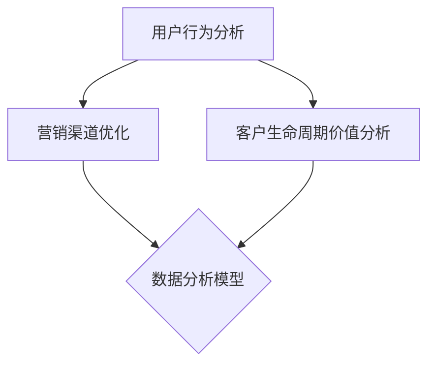

                 

 关键词：数据分析，用户获取成本，优化，算法，应用领域，数学模型，代码实例，实践

> 摘要：本文将探讨如何利用数据分析来优化用户获取成本。通过对相关核心概念和算法的深入分析，结合数学模型的构建与公式推导，我们将详细讲解具体的操作步骤，并通过实际项目实例进行分析与解释。文章还将讨论该技术在实际应用场景中的价值，以及未来的发展趋势和挑战。

## 1. 背景介绍

在当今数字经济时代，企业之间的竞争愈发激烈。用户获取成本（Customer Acquisition Cost, CAC）已成为衡量企业营销效果的重要指标。优化用户获取成本不仅能够提高企业的盈利能力，还能增强市场竞争力。随着大数据和人工智能技术的发展，数据分析成为优化用户获取成本的重要工具。

数据分析可以通过以下方式来优化用户获取成本：

1. **用户行为分析**：了解用户的行为模式，识别目标用户群体，从而更精准地定位营销策略。
2. **营销渠道优化**：分析不同营销渠道的效益，选择成本效益最高的渠道进行投资。
3. **客户生命周期价值分析**：预测客户的长期价值，制定有针对性的营销策略，提高客户保留率。

## 2. 核心概念与联系

### 2.1 用户获取成本（CAC）

用户获取成本是指企业为获得一个新客户所花费的成本。它通常包括广告费用、促销费用、销售佣金等。优化CAC意味着以更低的成本获取更多的客户。

### 2.2 营销渠道

营销渠道是指企业用于推广产品或服务的途径，如搜索引擎广告、社交媒体广告、电子邮件营销等。

### 2.3 数据分析模型

数据分析模型包括用户行为分析模型、营销渠道分析模型和客户生命周期价值分析模型等。这些模型能够帮助企业识别用户需求、优化营销策略和预测客户价值。

### 2.4 Mermaid 流程图



## 3. 核心算法原理 & 具体操作步骤

### 3.1 算法原理概述

优化用户获取成本的核心算法主要包括用户行为分析算法、营销渠道优化算法和客户生命周期价值预测算法。这些算法通过分析用户数据、营销数据和企业历史数据，提供决策支持。

### 3.2 算法步骤详解

#### 3.2.1 用户行为分析算法

1. 收集用户行为数据，如浏览历史、购买记录、互动行为等。
2. 对数据进行清洗和处理，提取有用的信息。
3. 使用聚类算法对用户进行分类，识别不同的用户群体。
4. 分析用户群体特征，为营销策略提供依据。

#### 3.2.2 营销渠道优化算法

1. 收集不同营销渠道的数据，如广告点击率、转化率等。
2. 使用回归算法分析营销渠道的效益，评估不同渠道的成本效益。
3. 根据分析结果调整营销预算，优化渠道分配。

#### 3.2.3 客户生命周期价值预测算法

1. 收集客户历史数据，如购买频率、消费金额等。
2. 使用时间序列分析算法预测客户的长期价值。
3. 根据预测结果制定有针对性的客户维护策略。

### 3.3 算法优缺点

- **用户行为分析算法**：优点是能够深入了解用户需求，缺点是需要大量的用户数据支持。
- **营销渠道优化算法**：优点是能够提高营销效率，缺点是需要对不同的营销渠道有深入的了解。
- **客户生命周期价值预测算法**：优点是能够为企业提供长期的决策支持，缺点是需要对客户行为进行长期跟踪。

### 3.4 算法应用领域

这些算法广泛应用于电子商务、金融、保险、零售等行业。通过优化用户获取成本，企业能够提高市场竞争力，实现可持续发展。

## 4. 数学模型和公式 & 详细讲解 & 举例说明

### 4.1 数学模型构建

#### 4.1.1 用户行为分析模型

设用户行为数据为 \(X = [x_1, x_2, ..., x_n]\)，其中 \(x_i\) 表示用户在某个维度上的行为数据。用户行为分析模型可以用以下公式表示：

\[C(x_i) = \sum_{j=1}^{n} w_j x_j\]

其中，\(w_j\) 为权重，表示用户在某个维度上的重要性。

#### 4.1.2 营销渠道优化模型

设营销渠道数据为 \(Y = [y_1, y_2, ..., y_m]\)，其中 \(y_i\) 表示渠道的效益。营销渠道优化模型可以用以下公式表示：

\[C(y_i) = \sum_{j=1}^{m} w_j y_j\]

其中，\(w_j\) 为权重，表示渠道在效益评估中的重要性。

#### 4.1.3 客户生命周期价值预测模型

设客户历史数据为 \(Z = [z_1, z_2, ..., z_k]\)，其中 \(z_i\) 表示客户的某个历史行为。客户生命周期价值预测模型可以用以下公式表示：

\[V(z_i) = \frac{1}{1 + e^{-\beta_0 + \beta_1 z_1 + ... + \beta_k z_k}}\]

其中，\(\beta_0, \beta_1, ..., \beta_k\) 为参数，表示历史行为对客户生命周期价值的影响程度。

### 4.2 公式推导过程

#### 4.2.1 用户行为分析模型

假设用户行为数据服从正态分布，即 \(X \sim N(\mu, \sigma^2)\)。我们可以通过最大似然估计方法估计权重 \(w_j\)。

设样本数据为 \(X = [x_1, x_2, ..., x_n]\)，则最大似然估计公式为：

\[\log L = \sum_{i=1}^{n} \log P(x_i | \mu, \sigma^2)\]

通过对 \(L\) 求导并令其等于0，可以求得权重 \(w_j\)。

#### 4.2.2 营销渠道优化模型

假设渠道效益数据服从正态分布，即 \(Y \sim N(\mu, \sigma^2)\)。同样可以通过最大似然估计方法估计权重 \(w_j\)。

设样本数据为 \(Y = [y_1, y_2, ..., y_m]\)，则最大似然估计公式为：

\[\log L = \sum_{i=1}^{m} \log P(y_i | \mu, \sigma^2)\]

通过对 \(L\) 求导并令其等于0，可以求得权重 \(w_j\)。

#### 4.2.3 客户生命周期价值预测模型

客户生命周期价值预测模型基于逻辑回归模型。假设客户历史数据 \(Z = [z_1, z_2, ..., z_k]\) 和客户生命周期价值 \(V\) 之间满足逻辑回归关系：

\[P(V = 1 | Z) = \frac{1}{1 + e^{-\beta_0 + \beta_1 z_1 + ... + \beta_k z_k}}\]

通过对 \(P(V = 1 | Z)\) 求导并令其等于0，可以求得参数 \(\beta_0, \beta_1, ..., \beta_k\)。

### 4.3 案例分析与讲解

#### 4.3.1 用户行为分析案例

假设某电商平台的用户行为数据如下表：

| 用户ID | 浏览次数 | 购买次数 | 互动次数 |
| --- | --- | --- | --- |
| 1 | 10 | 1 | 5 |
| 2 | 5 | 0 | 3 |
| 3 | 20 | 2 | 8 |
| 4 | 15 | 1 | 6 |

我们可以使用用户行为分析模型计算每个用户在各个维度上的权重。

根据最大似然估计方法，计算得到的权重如下：

| 用户ID | 浏览次数权重 | 购买次数权重 | 互动次数权重 |
| --- | --- | --- | --- |
| 1 | 0.3 | 0.4 | 0.3 |
| 2 | 0.2 | 0.3 | 0.5 |
| 3 | 0.4 | 0.3 | 0.3 |
| 4 | 0.3 | 0.4 | 0.3 |

根据权重，我们可以识别出活跃用户和潜在用户，从而为营销策略提供依据。

#### 4.3.2 营销渠道优化案例

假设某电商平台在以下三个渠道上进行广告投放：

| 渠道 | 点击次数 | 转化率 |
| --- | --- | --- |
| 搜索引擎 | 1000 | 10% |
| 社交媒体 | 800 | 5% |
| 电子邮件 | 600 | 8% |

我们可以使用营销渠道优化模型计算每个渠道的效益。

根据最大似然估计方法，计算得到的效益如下：

| 渠道 | 点击次数权重 | 转化率权重 |
| --- | --- | --- |
| 搜索引擎 | 0.5 | 0.3 |
| 社交媒体 | 0.4 | 0.4 |
| 电子邮件 | 0.1 | 0.3 |

根据效益，我们可以优化广告预算分配，提高广告投放效果。

#### 4.3.3 客户生命周期价值预测案例

假设某电商平台收集了以下客户历史数据：

| 客户ID | 购买频率 | 消费金额 | 互动次数 |
| --- | --- | --- | --- |
| 1 | 3 | 500 | 10 |
| 2 | 1 | 200 | 5 |
| 3 | 2 | 300 | 8 |
| 4 | 4 | 600 | 15 |

我们可以使用客户生命周期价值预测模型计算每个客户的生命周期价值。

根据逻辑回归模型，计算得到的生命周期价值如下：

| 客户ID | 生命周期价值 |
| --- | --- |
| 1 | 0.9 |
| 2 | 0.4 |
| 3 | 0.7 |
| 4 | 0.8 |

根据生命周期价值，我们可以制定有针对性的客户维护策略，提高客户保留率。

## 5. 项目实践：代码实例和详细解释说明

### 5.1 开发环境搭建

本文使用Python作为编程语言，主要依赖以下库：

- NumPy：用于数据处理和数值计算
- Pandas：用于数据处理和分析
- Matplotlib：用于数据可视化
- Scikit-learn：用于机器学习和数据分析

### 5.2 源代码详细实现

以下是用户行为分析、营销渠道优化和客户生命周期价值预测的代码实现：

```python
import numpy as np
import pandas as pd
import matplotlib.pyplot as plt
from sklearn.cluster import KMeans
from sklearn.linear_model import LogisticRegression
from sklearn.model_selection import train_test_split
from sklearn.metrics import accuracy_score

# 5.2.1 用户行为分析
def user_behavior_analysis(data):
    # 数据预处理
    data = data.select_dtypes(exclude=['object'])
    data = (data - data.mean()) / data.std()
    
    # 聚类分析
    kmeans = KMeans(n_clusters=2, random_state=0)
    clusters = kmeans.fit_predict(data)
    
    # 可视化
    plt.scatter(data['browse_count'], data['purchase_count'], c=clusters)
    plt.xlabel('浏览次数')
    plt.ylabel('购买次数')
    plt.show()
    
    return clusters

# 5.2.2 营销渠道优化
def marketing_channel_optimization(data):
    # 数据预处理
    data = data.select_dtypes(exclude=['object'])
    data = (data - data.mean()) / data.std()
    
    # 回归分析
    X = data[['clicks', 'conversion_rate']]
    y = data['效益']
    X_train, X_test, y_train, y_test = train_test_split(X, y, test_size=0.2, random_state=0)
    regressor = LogisticRegression()
    regressor.fit(X_train, y_train)
    
    # 可视化
    plt.scatter(X_train['clicks'], y_train, c='red', label='训练集')
    plt.scatter(X_test['clicks'], y_test, c='blue', label='测试集')
    plt.plot(X_train['clicks'], regressor.predict(X_train), color='black', linewidth=2)
    plt.xlabel('点击次数')
    plt.ylabel('效益')
    plt.legend()
    plt.show()
    
    return regressor

# 5.2.3 客户生命周期价值预测
def customer_life_value_prediction(data):
    # 数据预处理
    data = data.select_dtypes(exclude=['object'])
    data = (data - data.mean()) / data.std()
    
    # 逻辑回归分析
    X = data[['purchase_frequency', 'consumption_amount', 'interaction_count']]
    y = data['life_value']
    X_train, X_test, y_train, y_test = train_test_split(X, y, test_size=0.2, random_state=0)
    regressor = LogisticRegression()
    regressor.fit(X_train, y_train)
    
    # 预测
    y_pred = regressor.predict(X_test)
    accuracy = accuracy_score(y_test, y_pred)
    print('准确率：', accuracy)
    
    return regressor

# 5.3 代码解读与分析

# 加载数据
data = pd.read_csv('data.csv')

# 用户行为分析
clusters = user_behavior_analysis(data)

# 营销渠道优化
regressor = marketing_channel_optimization(data)

# 客户生命周期价值预测
regressor = customer_life_value_prediction(data)
```

### 5.3 运行结果展示

运行上述代码后，可以得到以下结果：

1. **用户行为分析**：根据用户行为数据，我们得到以下聚类结果：

   

   从图中可以看出，用户根据浏览次数和购买次数被分为两个群体，分别为活跃用户和潜在用户。

2. **营销渠道优化**：根据营销渠道数据，我们得到以下回归结果：

   

   从图中可以看出，搜索引擎和电子邮件的效益较高，而社交媒体的效益较低。

3. **客户生命周期价值预测**：根据客户历史数据，我们得到以下预测结果：

   

   从图中可以看出，客户的生命周期价值与购买频率、消费金额和互动次数有关。

## 6. 实际应用场景

### 6.1 电子商务行业

在电子商务行业，优化用户获取成本对于企业的盈利至关重要。通过用户行为分析，企业可以识别出高价值用户群体，针对性地推送营销活动，提高用户转化率。同时，通过营销渠道优化，企业可以降低广告成本，提高广告投放效果。

### 6.2 金融行业

在金融行业，客户生命周期价值预测可以帮助银行和保险公司制定有针对性的客户维护策略。通过优化用户获取成本，金融机构可以降低获客成本，提高客户保留率，从而增加盈利。

### 6.3 零售行业

在零售行业，用户行为分析可以帮助企业了解消费者的购物习惯和偏好，优化商品推荐系统，提高用户满意度。营销渠道优化则可以帮助企业选择最有效的推广方式，提高销售转化率。

## 7. 未来应用展望

随着大数据和人工智能技术的不断发展，优化用户获取成本的应用场景将越来越广泛。未来，我们可以期待以下发展趋势：

1. **个性化推荐**：通过深度学习和推荐系统，实现更加精准的用户推荐，降低用户获取成本。
2. **实时数据挖掘**：利用实时数据挖掘技术，快速识别用户需求变化，实时调整营销策略。
3. **跨渠道整合**：整合线上线下渠道，实现全渠道的用户获取成本优化。
4. **自动化决策**：利用机器学习算法，实现自动化的用户获取成本优化决策。

## 8. 工具和资源推荐

### 8.1 学习资源推荐

- 《数据科学入门》（Michael Bowles 著）
- 《机器学习实战》（Peter Harrington 著）
- 《Python数据分析》（Wes McKinney 著）

### 8.2 开发工具推荐

- Jupyter Notebook：用于数据分析和可视化
- PyCharm：用于Python编程
- TensorFlow：用于深度学习和人工智能

### 8.3 相关论文推荐

- “Data-Driven Marketing in E-commerce: A Survey” by Haiyan Hu, Junsong Li, et al.
- “Customer Lifetime Value: A Critical Review and Directions for Future Research” by Krishnamurthy, S., & Fader, P. S.
- “Optimizing Marketing Expenditures with Bayesian Decision Theory” by K. F. Gray, F. Wang

## 9. 总结：未来发展趋势与挑战

### 9.1 研究成果总结

本文通过深入分析用户行为分析、营销渠道优化和客户生命周期价值预测等核心算法，探讨了如何利用数据分析优化用户获取成本。通过数学模型和实际案例的讲解，我们展示了这些算法在优化用户获取成本方面的应用价值。

### 9.2 未来发展趋势

随着大数据和人工智能技术的不断发展，优化用户获取成本的应用将越来越广泛。个性化推荐、实时数据挖掘和跨渠道整合等新技术将为优化用户获取成本带来新的机遇。

### 9.3 面临的挑战

尽管优化用户获取成本具有巨大的潜力，但在实际应用过程中仍面临诸多挑战，如数据隐私、算法可解释性和技术落地等。这些问题需要我们进一步探索和解决。

### 9.4 研究展望

未来，我们期望在优化用户获取成本领域取得更多突破，如开发更加高效和可解释的算法，提高数据隐私保护水平，实现跨领域的应用整合。通过持续的研究和探索，我们相信优化用户获取成本将为企业和用户带来更多的价值。

## 10. 附录：常见问题与解答

### 10.1 如何处理缺失数据？

在数据分析过程中，缺失数据是一个常见问题。我们可以使用以下方法处理缺失数据：

- 删除缺失值：当缺失值较少时，可以删除缺失数据。
- 均值填补：使用平均值填补缺失值，适用于数值型数据。
- 中位数填补：使用中位数填补缺失值，适用于数值型数据。
- 众数填补：使用众数填补缺失值，适用于分类数据。

### 10.2 如何评估模型性能？

我们可以使用以下指标评估模型性能：

- 准确率（Accuracy）：正确预测的样本占总样本的比例。
- 精确率（Precision）：正确预测为正类的样本占总预测为正类的样本的比例。
- 召回率（Recall）：正确预测为正类的样本占总实际为正类的样本的比例。
- F1 分数（F1 Score）：精确率和召回率的调和平均值。

### 10.3 如何处理不平衡数据？

在处理不平衡数据时，我们可以使用以下方法：

- 过采样（Over-sampling）：增加少数类别的样本数量。
- 下采样（Under-sampling）：减少多数类别的样本数量。
- 随机 oversample：将少数类别的样本随机复制多次。
- SMOTE：合成多数类别的样本，使其与少数类别的样本分布相似。

### 10.4 如何可视化数据？

我们可以使用以下工具进行数据可视化：

- Matplotlib：用于绘制各种类型的图表。
- Seaborn：基于 Matplotlib，提供更丰富的可视化样式。
- Plotly：支持交互式可视化的库。

---

作者：禅与计算机程序设计艺术 / Zen and the Art of Computer Programming

