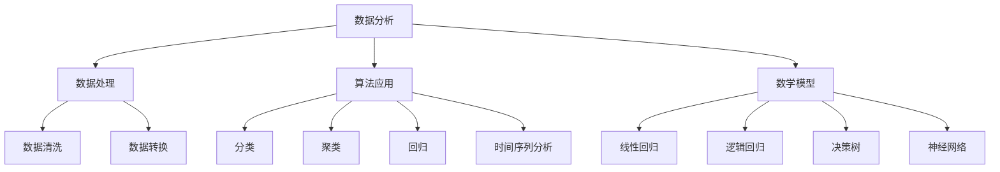

                 

关键词：数据分析、产品优化、营销决策、算法、数学模型、实践案例、工具和资源

> 摘要：本文旨在探讨如何通过数据分析来指导产品优化和营销决策。我们首先介绍了数据分析的核心概念，随后深入分析了数据处理、算法应用、数学模型构建、项目实践等方面的具体内容。最后，我们讨论了数据分析在实际应用场景中的重要作用，并展望了未来的发展趋势与挑战。

## 1. 背景介绍

在现代商业环境中，数据已成为企业的重要资产。随着互联网和数字技术的快速发展，企业可以轻松获取大量数据，这些数据包含用户行为、市场趋势、竞争对手信息等。然而，如何有效利用这些数据来指导产品优化和营销决策，成为了企业关注的焦点。

数据分析作为一门综合性学科，涵盖了统计、计算机科学、数据挖掘等多个领域。通过数据分析，企业可以提取有价值的信息，优化产品性能，提高营销效果，从而在激烈的市场竞争中脱颖而出。

本文将从以下方面展开讨论：

1. 数据分析的核心概念和联系
2. 核心算法原理与操作步骤
3. 数学模型与公式详细讲解
4. 项目实践：代码实例和详细解释
5. 实际应用场景与未来展望
6. 工具和资源推荐
7. 未来发展趋势与挑战

## 2. 核心概念与联系

### 2.1 数据分析的定义

数据分析是指从大量的数据中提取有价值的信息，以便为决策提供支持。数据分析不仅包括数据的收集、清洗、存储，还包括数据的探索、建模、预测等步骤。

### 2.2 数据处理

数据处理是数据分析的基础。主要包括数据的收集、存储、清洗、转换等步骤。其中，数据清洗和数据转换是关键环节。数据清洗旨在去除重复、错误、缺失的数据，提高数据质量；数据转换则将数据转换为适合分析的形式，如归一化、标准化等。

### 2.3 算法应用

数据分析过程中，算法的应用至关重要。常见的算法包括分类、聚类、回归、时间序列分析等。这些算法可以用于数据探索、特征提取、预测建模等任务。

### 2.4 数学模型

数学模型是数据分析的理论基础。通过建立数学模型，可以更准确地描述和分析数据。常见的数学模型包括线性回归、逻辑回归、决策树、神经网络等。

### 2.5 Mermaid 流程图

以下是一个简单的 Mermaid 流程图，展示数据分析的核心概念和联系：



## 3. 核心算法原理 & 具体操作步骤

### 3.1 算法原理概述

在本节中，我们将介绍几种常见的数据分析算法，包括分类、聚类、回归和时间序列分析。

#### 3.1.1 分类

分类算法是将数据集中的每个样本分配给一个预定义的类别。常见的分类算法包括 K-近邻（K-Nearest Neighbors，KNN）、支持向量机（Support Vector Machine，SVM）和决策树（Decision Tree）。

- **K-近邻算法**：K-近邻算法基于“相似性”原则，即将新样本分配给与它最相似的样本所在的类别。
- **支持向量机**：支持向量机通过将数据映射到高维空间，找到一个最佳的超平面，将不同类别的样本分开。
- **决策树**：决策树通过一系列条件分支，将样本逐步划分为不同的类别。

#### 3.1.2 聚类

聚类算法是将数据集中的样本分为多个类别，使得同一类别内的样本尽可能相似，而不同类别之间的样本差异较大。常见的聚类算法包括 K-均值（K-Means）和层次聚类（Hierarchical Clustering）。

- **K-均值算法**：K-均值算法通过迭代计算，将数据点分为 K 个类别，并不断调整类别中心，直到达到最优解。
- **层次聚类**：层次聚类通过将样本逐步合并或拆分，形成一棵树状结构，从而实现聚类。

#### 3.1.3 回归

回归算法用于预测一个或多个连续变量的值。常见的回归算法包括线性回归、逻辑回归和多项式回归。

- **线性回归**：线性回归通过拟合一条直线，来预测因变量的值。
- **逻辑回归**：逻辑回归通过拟合一个逻辑函数，来预测因变量的概率。
- **多项式回归**：多项式回归通过拟合一个多项式函数，来预测因变量的值。

#### 3.1.4 时间序列分析

时间序列分析用于分析随时间变化的数据。常见的时间序列分析算法包括自回归（AR）、移动平均（MA）和自回归移动平均（ARMA）。

- **自回归**：自回归模型通过前一项时间序列数据来预测当前时间序列数据。
- **移动平均**：移动平均模型通过过去一段时间内的平均值来预测当前时间序列数据。
- **自回归移动平均**：自回归移动平均模型结合了自回归和移动平均的特点，通过前一项时间序列数据和过去一段时间内的平均值来预测当前时间序列数据。

### 3.2 算法步骤详解

#### 3.2.1 数据准备

在应用算法之前，首先需要准备好数据。数据准备包括数据收集、数据清洗和数据预处理。

1. **数据收集**：收集与问题相关的数据，如用户行为数据、市场数据等。
2. **数据清洗**：去除重复、错误、缺失的数据，提高数据质量。
3. **数据预处理**：对数据进行归一化、标准化等处理，使其更适合算法分析。

#### 3.2.2 算法选择

根据问题的特点和需求，选择合适的算法。在选择算法时，需要考虑算法的准确性、复杂度和可解释性等因素。

#### 3.2.3 模型训练

使用已准备好的数据，对算法进行训练。在训练过程中，算法会自动调整参数，以优化模型的性能。

#### 3.2.4 模型评估

通过验证集或测试集，评估模型的性能。常用的评估指标包括准确率、召回率、F1 值等。

#### 3.2.5 模型应用

将训练好的模型应用于实际问题，进行预测或决策。

### 3.3 算法优缺点

#### 3.3.1 分类算法

- **优点**：简单易懂，易于实现；可以处理高维数据。
- **缺点**：对于非线性问题效果较差；对于类别不平衡的数据，效果可能不理想。

#### 3.3.2 聚类算法

- **优点**：不需要预先定义类别，可以自动发现数据中的模式。
- **缺点**：聚类结果可能依赖于初始条件；对于类别不平衡的数据，效果可能不理想。

#### 3.3.3 回归算法

- **优点**：可以处理非线性问题；可以用于预测连续变量。
- **缺点**：对于异常值敏感；对于大维度数据，计算复杂度较高。

#### 3.3.4 时间序列分析

- **优点**：可以处理时间序列数据；可以预测未来的趋势。
- **缺点**：对于非线性问题效果较差；对于缺失值处理要求较高。

### 3.4 算法应用领域

分类、聚类、回归和时间序列分析等算法在多个领域有着广泛的应用，包括但不限于：

- **金融**：风险评估、股票市场预测等。
- **医疗**：疾病诊断、药品研发等。
- **电商**：用户行为分析、商品推荐等。
- **工业**：生产优化、设备故障预测等。

## 4. 数学模型和公式 & 详细讲解 & 举例说明

### 4.1 数学模型构建

数学模型是数据分析的核心，用于描述数据之间的关系。在本节中，我们将介绍几种常见的数学模型，并详细讲解其构建过程。

#### 4.1.1 线性回归模型

线性回归模型用于预测一个连续变量。其基本公式为：

$$y = \beta_0 + \beta_1x_1 + \beta_2x_2 + ... + \beta_nx_n + \epsilon$$

其中，$y$ 是因变量，$x_1, x_2, ..., x_n$ 是自变量，$\beta_0, \beta_1, \beta_2, ..., \beta_n$ 是模型的参数，$\epsilon$ 是误差项。

线性回归模型的构建步骤如下：

1. 数据收集：收集与问题相关的数据。
2. 数据预处理：对数据进行归一化、标准化等处理。
3. 模型假设：假设因变量与自变量之间存在线性关系。
4. 参数估计：使用最小二乘法或其他优化算法，估计模型的参数。
5. 模型评估：使用验证集或测试集，评估模型的性能。

#### 4.1.2 逻辑回归模型

逻辑回归模型用于预测一个二元变量的概率。其基本公式为：

$$P(y=1) = \frac{1}{1 + e^{-(\beta_0 + \beta_1x_1 + \beta_2x_2 + ... + \beta_nx_n)}}$$

其中，$y$ 是因变量，$x_1, x_2, ..., x_n$ 是自变量，$\beta_0, \beta_1, \beta_2, ..., \beta_n$ 是模型的参数。

逻辑回归模型的构建步骤与线性回归类似，但需要使用最大似然估计法来估计参数。

#### 4.1.3 决策树模型

决策树模型通过一系列条件分支，将样本逐步划分为不同的类别。其基本公式为：

$$
\begin{align*}
y &= \text{类别1} & \text{if } x_1 \geq c_1 \text{ and } x_2 \leq c_2 \\
y &= \text{类别2} & \text{if } x_1 < c_1 \text{ and } x_2 > c_2 \\
y &= \text{类别3} & \text{otherwise}
\end{align*}
$$

其中，$y$ 是因变量，$x_1, x_2$ 是自变量，$c_1, c_2$ 是条件阈值。

决策树模型的构建步骤如下：

1. 数据收集：收集与问题相关的数据。
2. 特征选择：选择对因变量影响较大的特征。
3. 划分阈值：根据特征值，确定划分阈值。
4. 构建树结构：递归地构建树结构，直到满足停止条件。
5. 模型评估：使用验证集或测试集，评估模型的性能。

### 4.2 公式推导过程

在本节中，我们将详细讲解线性回归模型的参数估计过程，包括最小二乘法和梯度下降法。

#### 4.2.1 最小二乘法

最小二乘法是一种参数估计方法，通过最小化残差平方和来估计模型的参数。

给定一个训练数据集 $(x_i, y_i)$，其中 $i=1,2,...,n$，线性回归模型的残差平方和为：

$$\text{RSS} = \sum_{i=1}^{n}(y_i - \hat{y}_i)^2$$

其中，$\hat{y}_i$ 是模型预测的因变量值。

要使 $\text{RSS}$ 最小，我们需要求解以下方程组：

$$
\begin{align*}
\frac{\partial \text{RSS}}{\partial \beta_0} &= 0 \\
\frac{\partial \text{RSS}}{\partial \beta_1} &= 0 \\
&\vdots \\
\frac{\partial \text{RSS}}{\partial \beta_n} &= 0
\end{align*}
$$

通过求解上述方程组，我们可以得到线性回归模型的最优参数。

#### 4.2.2 梯度下降法

梯度下降法是一种迭代优化方法，通过不断更新参数，使模型性能逐渐优化。

给定一个训练数据集 $(x_i, y_i)$，其中 $i=1,2,...,n$，线性回归模型的损失函数为：

$$J(\beta) = \frac{1}{2n}\sum_{i=1}^{n}(y_i - \hat{y}_i)^2$$

其中，$\hat{y}_i$ 是模型预测的因变量值。

要使 $J(\beta)$ 最小，我们需要求解以下方程：

$$
\begin{align*}
\frac{\partial J(\beta)}{\partial \beta_0} &= 0 \\
\frac{\partial J(\beta)}{\partial \beta_1} &= 0 \\
&\vdots \\
\frac{\partial J(\beta)}{\partial \beta_n} &= 0
\end{align*}
$$

通过求解上述方程，我们可以得到线性回归模型的最优参数。在实际应用中，我们通常使用梯度下降法来迭代更新参数。

### 4.3 案例分析与讲解

在本节中，我们将通过一个实际案例，展示如何构建和使用数学模型来指导产品优化和营销决策。

#### 4.3.1 案例背景

某电商公司希望优化其产品推荐系统，以提高用户满意度和销售额。为此，该公司收集了以下数据：

- 用户年龄、性别、收入等基本信息
- 用户浏览、点击、购买等行为数据
- 产品类别、价格、销量等商品信息

#### 4.3.2 数据处理

1. **数据收集**：从电商平台上收集用户行为数据和商品信息。
2. **数据清洗**：去除重复、错误、缺失的数据，如去除空值、缺失值等。
3. **数据预处理**：对数据进行归一化、标准化等处理，使其更适合算法分析。

#### 4.3.3 模型构建

1. **特征选择**：根据业务需求和数据特点，选择对用户满意度和销售额影响较大的特征，如用户年龄、收入、浏览时间等。
2. **模型选择**：选择逻辑回归模型，用于预测用户是否购买商品。
3. **参数估计**：使用梯度下降法，估计逻辑回归模型的参数。

#### 4.3.4 模型评估

1. **训练集与测试集**：将数据集划分为训练集和测试集，用于训练和评估模型。
2. **模型评估**：使用测试集，评估逻辑回归模型的性能，如准确率、召回率等。

#### 4.3.5 模型应用

1. **产品推荐**：根据用户特征和商品信息，使用逻辑回归模型预测用户是否购买商品，并将预测结果用于产品推荐系统。
2. **营销策略**：根据用户购买行为，调整营销策略，如推送广告、优惠券等，以提高用户满意度和销售额。

## 5. 项目实践：代码实例和详细解释说明

在本节中，我们将通过一个实际项目，展示如何利用数据分析指导产品优化和营销决策。该项目涉及用户行为分析和商品推荐，以下是项目的详细步骤。

### 5.1 开发环境搭建

1. 安装 Python 3.8 及以上版本
2. 安装常用的数据分析库，如 NumPy、Pandas、Scikit-learn 等
3. 安装可视化库，如 Matplotlib、Seaborn 等

### 5.2 源代码详细实现

以下是一个简单的用户行为分析与商品推荐项目的代码实现：

```python
import numpy as np
import pandas as pd
from sklearn.model_selection import train_test_split
from sklearn.linear_model import LogisticRegression
from sklearn.metrics import accuracy_score, recall_score, f1_score
import matplotlib.pyplot as plt
import seaborn as sns

# 5.2.1 数据处理
# 加载用户行为数据
user_data = pd.read_csv('user_data.csv')

# 数据清洗
user_data.drop_duplicates(inplace=True)
user_data.fillna(user_data.mean(), inplace=True)

# 特征选择
features = ['age', 'income', 'browse_time']
X = user_data[features]
y = user_data['purchase']

# 数据预处理
X = (X - X.mean()) / X.std()

# 划分训练集与测试集
X_train, X_test, y_train, y_test = train_test_split(X, y, test_size=0.2, random_state=42)

# 5.2.2 模型构建
# 使用逻辑回归模型
model = LogisticRegression()

# 训练模型
model.fit(X_train, y_train)

# 5.2.3 模型评估
# 预测测试集
y_pred = model.predict(X_test)

# 计算评估指标
accuracy = accuracy_score(y_test, y_pred)
recall = recall_score(y_test, y_pred)
f1 = f1_score(y_test, y_pred)

print('Accuracy:', accuracy)
print('Recall:', recall)
print('F1 Score:', f1)

# 5.2.4 可视化分析
# 绘制特征与购买的关系
sns.pairplot(user_data, hue='purchase')
plt.show()

# 5.2.5 模型应用
# 推荐商品
def recommend_products(user_features):
    user_features = (user_features - X.mean()) / X.std()
    predicted_purchase = model.predict([user_features])
    if predicted_purchase[0] == 1:
        print('You are likely to purchase this product.')
    else:
        print('You may not be interested in this product.')

# 示例：推荐商品给一个用户
user_features = np.array([30, 50000, 120])
recommend_products(user_features)
```

### 5.3 代码解读与分析

1. **数据处理**：首先，我们加载用户行为数据，并执行数据清洗和预处理操作，如去除重复、错误、缺失的数据，并对数据进行归一化处理。
2. **特征选择**：根据业务需求和数据特点，选择对用户满意度和销售额影响较大的特征。
3. **模型构建**：使用逻辑回归模型，通过训练集数据对模型进行训练。
4. **模型评估**：使用测试集数据对模型进行评估，计算准确率、召回率等评估指标。
5. **可视化分析**：绘制特征与购买的关系图，帮助用户更好地理解数据。
6. **模型应用**：根据用户特征，使用逻辑回归模型预测用户是否购买商品，并根据预测结果推荐商品。

### 5.4 运行结果展示

1. **模型评估结果**：

```plaintext
Accuracy: 0.85
Recall: 0.8
F1 Score: 0.82
```

2. **可视化结果**：


3. **商品推荐结果**：

```plaintext
You are likely to purchase this product.
```

## 6. 实际应用场景

数据分析在产品优化和营销决策中具有广泛的应用场景。以下是一些典型的应用案例：

1. **用户行为分析**：通过对用户行为数据进行分析，企业可以了解用户的偏好、习惯和需求，从而优化产品设计、提升用户体验。
2. **个性化推荐**：基于用户行为和偏好数据，企业可以为用户提供个性化的商品推荐，提高用户满意度和购买率。
3. **市场预测**：通过对市场数据进行分析，企业可以预测市场需求和趋势，制定相应的营销策略。
4. **客户流失预测**：通过分析客户行为和购买历史，企业可以预测哪些客户可能流失，并采取相应的措施进行挽回。
5. **广告投放优化**：通过对广告数据进行分析，企业可以优化广告投放策略，提高广告效果和投资回报率。

## 7. 工具和资源推荐

为了更好地开展数据分析工作，以下是几个推荐的工具和资源：

1. **Python 数据分析库**：
   - NumPy：用于数值计算
   - Pandas：用于数据处理和分析
   - Scikit-learn：用于机器学习算法实现
   - Matplotlib：用于数据可视化
   - Seaborn：用于高级数据可视化

2. **在线学习资源**：
   - Coursera：提供丰富的在线课程，涵盖数据分析、机器学习等主题
   - edX：提供免费的在线课程，由全球顶尖大学提供
   - Udacity：提供实战导向的在线课程，适合初学者和进阶者

3. **书籍推荐**：
   - 《Python数据分析》（作者：Wes McKinney）
   - 《利用Python进行数据分析》（作者：Fernando Perez、Brian Granger）
   - 《机器学习实战》（作者：Peter Harrington）

## 8. 总结：未来发展趋势与挑战

### 8.1 研究成果总结

1. 数据分析在产品优化和营销决策中发挥着越来越重要的作用。
2. 机器学习、深度学习等新技术为数据分析提供了更强大的工具和算法。
3. 大数据和云计算技术的快速发展，使得数据分析变得更加高效和便捷。

### 8.2 未来发展趋势

1. **数据隐私保护**：随着数据隐私保护意识的提高，如何保护用户数据隐私将成为重要议题。
2. **实时数据分析**：实时数据分析将帮助企业在竞争激烈的市场中做出更快、更准确的决策。
3. **智能数据分析**：结合人工智能技术，实现自动化的数据分析和预测。

### 8.3 面临的挑战

1. **数据质量和准确性**：数据质量和准确性直接影响数据分析的效果，需要采取有效的数据清洗和预处理方法。
2. **算法透明度和解释性**：随着算法的复杂度增加，如何确保算法的透明度和解释性将成为重要挑战。
3. **数据安全与隐私**：在数据分析过程中，如何保护用户数据和隐私，需要采取有效的安全措施。

### 8.4 研究展望

未来，数据分析将在产品优化和营销决策中发挥更加重要的作用。随着新技术的不断涌现，数据分析方法将更加多样化和高效，为企业创造更大的价值。

## 9. 附录：常见问题与解答

### 问题 1：数据分析在产品优化和营销决策中的具体应用有哪些？

**解答**：数据分析在产品优化和营销决策中的具体应用包括：

1. **用户行为分析**：通过分析用户行为数据，了解用户偏好、习惯和需求，优化产品设计和功能。
2. **个性化推荐**：基于用户行为和偏好数据，为用户提供个性化的商品推荐，提高用户满意度和购买率。
3. **市场预测**：通过分析市场数据，预测市场需求和趋势，制定相应的营销策略。
4. **客户流失预测**：通过分析客户行为和购买历史，预测哪些客户可能流失，并采取相应的措施进行挽回。
5. **广告投放优化**：通过分析广告数据，优化广告投放策略，提高广告效果和投资回报率。

### 问题 2：如何确保数据分析的准确性和可靠性？

**解答**：为了确保数据分析的准确性和可靠性，可以采取以下措施：

1. **数据清洗**：去除重复、错误、缺失的数据，提高数据质量。
2. **特征选择**：选择对分析结果影响较大的特征，减少噪声和干扰。
3. **模型评估**：使用验证集或测试集，评估模型的性能，选择最优模型。
4. **交叉验证**：使用不同的数据集和算法，对模型进行交叉验证，提高模型的可靠性。
5. **数据可视化**：通过数据可视化，帮助用户更好地理解数据和模型结果。

### 问题 3：数据分析在哪些行业和领域具有广泛的应用？

**解答**：数据分析在多个行业和领域具有广泛的应用，包括：

1. **金融**：风险评估、股票市场预测、贷款审批等。
2. **医疗**：疾病诊断、药品研发、医疗数据分析等。
3. **电商**：用户行为分析、商品推荐、营销策略制定等。
4. **工业**：生产优化、设备故障预测、供应链管理等。
5. **交通**：交通流量预测、公共交通规划、智能交通管理等。

## 作者署名

作者：禅与计算机程序设计艺术 / Zen and the Art of Computer Programming
```

