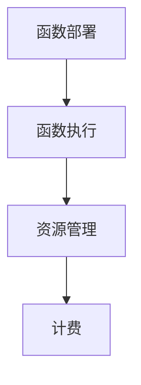

                 

## 1. 背景介绍

在数字化转型的浪潮中，企业对于IT基础设施的需求日益增长。然而，传统的基础设施部署和管理方式不仅成本高昂，而且难以灵活应对业务需求的快速变化。无服务器架构（Serverless Architecture）作为云计算领域的一种创新模式，正逐渐成为企业IT战略的重要组成部分。无服务器架构的核心思想是将服务器管理的工作交给云服务提供商，使开发者能够专注于编写应用程序代码，从而降低运营成本、提高开发效率。

无服务器架构的优势在于：

- **成本节约**：无需购买和维护物理服务器，只需为实际使用的计算资源付费。
- **弹性伸缩**：自动根据负载需求进行资源的弹性伸缩，无需手动干预。
- **开发效率**：无需关注服务器配置，可以更快速地开发和部署应用。
- **高可用性**：云服务提供商提供强大的基础设施保障，确保应用的高可用性。

然而，无服务器架构并非完美无缺。它也存在一些潜在的挑战，如冷启动延迟、成本难以预测等。因此，在采用无服务器架构时，需要综合考虑其优缺点，合理规划和应用。

本文将深入探讨无服务器架构的原理、实现方法、应用场景，以及如何在实际项目中降低运营成本。通过本文的阅读，读者将能够：

- 理解无服务器架构的基本概念和工作原理。
- 学会如何设计和实现无服务器应用。
- 掌握无服务器架构的成本优化策略。
- 了解无服务器架构在不同领域的应用案例。

## 2. 核心概念与联系

### 2.1 无服务器架构的定义与特点

无服务器架构（Serverless Architecture）是一种基于云计算的模型，它允许开发者无需管理服务器即可部署和运行应用程序。在无服务器架构中，云服务提供商（如AWS、Azure、Google Cloud等）负责管理底层基础设施，包括服务器、网络和存储等。开发者只需关注应用程序的业务逻辑，无需关心底层硬件资源的分配和管理。

无服务器架构具有以下特点：

- **无服务器**：开发者无需购买和维护物理服务器，所有计算资源由云服务提供商提供。
- **按需付费**：开发者仅为其使用的计算资源付费，无需固定投入。
- **弹性伸缩**：自动根据负载需求进行资源的弹性伸缩，无需手动干预。
- **高可用性**：云服务提供商提供强大的基础设施保障，确保应用的高可用性。

### 2.2 无服务器架构的组成部分

无服务器架构主要包括以下组成部分：

- **函数即服务（FaaS）**：函数即服务（FaaS）是一种无服务器架构模式，允许开发者将应用程序功能划分为多个独立的函数，并按需执行。FaaS平台通常提供丰富的编程语言支持，如Node.js、Python、Java等。
- **后端即服务（BaaS）**：后端即服务（BaaS）提供一系列后端功能，如数据库、用户认证、消息队列等，开发者无需关心底层实现细节，即可快速构建应用程序。
- **前端即服务（FaaS）**：前端即服务（FaaS）提供前端功能的即服务解决方案，如静态网站托管、前端框架支持等，使开发者能够专注于业务逻辑开发。

### 2.3 无服务器架构的工作原理

无服务器架构的工作原理可以概括为以下几个步骤：

1. **函数部署**：开发者将应用程序代码上传到无服务器平台，如AWS Lambda、Azure Functions等。
2. **函数执行**：当触发事件（如HTTP请求、定时任务等）发生时，无服务器平台会自动执行相应的函数。
3. **资源管理**：无服务器平台负责管理底层计算资源，根据函数执行的需求进行弹性伸缩。
4. **计费**：开发者仅为其实际使用的计算资源付费，无需固定投入。

### 2.4 无服务器架构的优势与挑战

无服务器架构的优势如下：

- **成本节约**：无需购买和维护物理服务器，降低基础设施成本。
- **弹性伸缩**：自动根据负载需求进行资源的弹性伸缩，提高资源利用率。
- **开发效率**：无需关注服务器配置，可以更快速地开发和部署应用。
- **高可用性**：云服务提供商提供强大的基础设施保障，确保应用的高可用性。

然而，无服务器架构也面临一些挑战：

- **冷启动延迟**：函数从创建到执行之间存在一定的延迟，可能影响应用性能。
- **成本难以预测**：函数的执行时间、并发数等会影响实际成本，难以提前预测。
- **依赖云服务提供商**：无服务器架构依赖于云服务提供商，切换成本较高。

### 2.5 无服务器架构的 Mermaid 流程图

下面是使用Mermaid绘制的无服务器架构的流程图：



### 2.6 无服务器架构的核心概念与联系总结

无服务器架构通过将服务器管理的工作交给云服务提供商，使开发者能够专注于编写应用程序代码，从而降低运营成本、提高开发效率。无服务器架构的核心概念包括函数即服务（FaaS）、后端即服务（BaaS）和前端即服务（FaaS）。通过了解无服务器架构的工作原理和优势，读者可以更好地掌握其实现方法和应用场景。在接下来的章节中，我们将深入探讨无服务器架构的核心算法原理和具体操作步骤。

## 3. 核心算法原理 & 具体操作步骤

### 3.1 算法原理概述

无服务器架构的核心算法原理主要涉及以下几个方面：

- **事件驱动**：无服务器架构通常基于事件驱动模型，当特定事件发生时，触发相应的函数执行。事件可以是HTTP请求、定时任务、数据库变更等。
- **函数调度**：无服务器平台根据事件类型和函数配置，选择合适的函数进行调度和执行。调度过程通常涉及函数的选择、资源的分配和执行状态的监控等。
- **弹性伸缩**：无服务器平台根据实际负载需求，动态调整计算资源的数量和配置，确保应用性能和成本的最优化。
- **计费机制**：无服务器架构的计费机制基于实际使用的计算资源和存储资源，包括函数的执行时间、并发数、数据传输量等。

### 3.2 算法步骤详解

以下是实现无服务器架构的详细步骤：

#### 步骤1：函数定义

开发者首先需要定义应用程序的函数，包括函数名称、输入参数、返回类型等。函数的定义通常使用编程语言（如Node.js、Python、Java等）编写，并上传到无服务器平台。

#### 步骤2：函数部署

将定义好的函数上传到无服务器平台，如AWS Lambda、Azure Functions等。部署过程中，平台会进行代码验证、依赖安装和函数配置等操作。

#### 步骤3：事件触发

当特定事件发生时，无服务器平台会根据事件类型和函数配置，选择合适的函数进行触发。事件可以是HTTP请求、定时任务、数据库变更等。

#### 步骤4：函数执行

触发后的函数将在无服务器平台上执行，执行过程中，平台会为函数分配计算资源，并监控函数的执行状态。函数执行完成后，将返回结果给调用者。

#### 步骤5：资源管理

无服务器平台根据函数执行的需求，动态调整计算资源的数量和配置。当函数处于空闲状态时，平台会释放部分资源，以降低成本。

#### 步骤6：计费

无服务器平台根据实际使用的计算资源和存储资源，对开发者进行计费。计费指标包括函数的执行时间、并发数、数据传输量等。

### 3.3 算法优缺点

#### 优点

- **成本节约**：无服务器架构通过按需付费的方式，降低了基础设施成本。
- **弹性伸缩**：无服务器平台自动根据负载需求进行资源的弹性伸缩，提高了资源利用率。
- **开发效率**：无需关注服务器配置，可以更快速地开发和部署应用。
- **高可用性**：云服务提供商提供强大的基础设施保障，确保应用的高可用性。

#### 缺点

- **冷启动延迟**：函数从创建到执行之间存在一定的延迟，可能影响应用性能。
- **成本难以预测**：函数的执行时间、并发数等会影响实际成本，难以提前预测。
- **依赖云服务提供商**：无服务器架构依赖于云服务提供商，切换成本较高。

### 3.4 算法应用领域

无服务器架构在以下领域具有广泛的应用：

- **Web应用**：无服务器架构可以用于构建高性能的Web应用，如API网关、静态网站托管等。
- **移动应用**：无服务器架构可以帮助移动应用开发者快速构建后端服务，如用户认证、数据存储等。
- **物联网应用**：无服务器架构可以用于处理大规模的物联网数据，如设备监控、数据分析等。
- **大数据应用**：无服务器架构可以用于处理大规模的数据处理任务，如数据清洗、数据挖掘等。

### 3.5 无服务器架构的核心算法原理与具体操作步骤总结

无服务器架构的核心算法原理包括事件驱动、函数调度、弹性伸缩和计费机制。通过了解无服务器架构的具体操作步骤，开发者可以更好地设计和实现无服务器应用。在接下来的章节中，我们将继续探讨无服务器架构的数学模型和公式，以及如何通过数学模型和公式进行案例分析与讲解。

## 4. 数学模型和公式 & 详细讲解 & 举例说明

### 4.1 数学模型构建

无服务器架构的数学模型主要涉及以下几个方面：

- **成本模型**：无服务器架构的成本主要取决于函数的执行时间、并发数、数据传输量等指标。成本模型可以表示为：

  $$C = f(t, n, d)$$

  其中，$C$ 表示总成本，$t$ 表示函数执行时间（单位：秒），$n$ 表示并发数（单位：个），$d$ 表示数据传输量（单位：字节）。

- **性能模型**：无服务器架构的性能主要取决于函数的响应时间、吞吐量等指标。性能模型可以表示为：

  $$P = g(t_r, Q)$$

  其中，$P$ 表示性能（单位：QPS，即每秒查询率），$t_r$ 表示函数响应时间（单位：秒），$Q$ 表示并发数。

### 4.2 公式推导过程

#### 成本模型推导

成本模型推导可以分为以下几个步骤：

1. **函数执行成本**：函数执行成本主要由计算资源使用和存储资源使用构成。计算资源使用成本可以表示为：

   $$C_{compute} = c_{compute} \times t$$

   其中，$c_{compute}$ 表示每秒计算成本（单位：元/秒），$t$ 表示函数执行时间（单位：秒）。

   存储资源使用成本可以表示为：

   $$C_{storage} = c_{storage} \times d$$

   其中，$c_{storage}$ 表示每字节存储成本（单位：元/字节），$d$ 表示数据传输量（单位：字节）。

2. **总成本**：总成本为计算资源使用成本和存储资源使用成本之和：

   $$C = C_{compute} + C_{storage}$$

   将上述公式代入，得到：

   $$C = c_{compute} \times t + c_{storage} \times d$$

#### 性能模型推导

性能模型推导可以分为以下几个步骤：

1. **函数响应时间**：函数响应时间主要由函数执行时间和网络延迟构成。假设网络延迟为 $t_{network}$，则函数响应时间可以表示为：

   $$t_r = t + t_{network}$$

2. **吞吐量**：吞吐量表示单位时间内可以处理的请求数量。假设并发数为 $n$，则吞吐量可以表示为：

   $$Q = n \times \frac{1}{t_r}$$

   将 $t_r$ 的表达式代入，得到：

   $$Q = n \times \frac{1}{t + t_{network}}$$

3. **性能**：性能表示每秒查询率（QPS），可以表示为：

   $$P = \frac{Q}{t_r} = \frac{n \times \frac{1}{t + t_{network}}}{t + t_{network}} = \frac{n}{t_r^2}$$

### 4.3 案例分析与讲解

假设一个Web应用使用无服务器架构实现，以下是一个简单的案例：

- **函数执行时间**：平均响应时间为2秒。
- **并发数**：同时有100个用户访问。
- **数据传输量**：每次请求传输1MB数据。
- **网络延迟**：平均网络延迟为0.5秒。

根据上述假设，可以计算出以下指标：

1. **总成本**：

   $$C = c_{compute} \times t + c_{storage} \times d$$

   假设每秒计算成本为0.1元，每字节存储成本为0.001元，代入上述公式，得到：

   $$C = 0.1 \times 2 + 0.001 \times 1 \times 1000000 = 2.1 + 1000 = 1002.1 \text{元/天}$$

2. **性能**：

   $$P = \frac{n}{t_r^2}$$

   代入上述参数，得到：

   $$P = \frac{100}{2.5^2} = 40 \text{QPS}$$

通过以上分析，可以看出，该Web应用每天的成本为1002.1元，每秒可以处理40个请求。这为开发者提供了一个清晰的成本和性能评估，有助于优化应用设计和资源配置。

### 4.4 数学模型和公式总结

无服务器架构的数学模型主要包括成本模型和性能模型。通过成本模型，开发者可以预测和优化应用的成本；通过性能模型，开发者可以评估和优化应用的性能。在接下来的章节中，我们将通过具体的代码实例和详细解释，进一步探讨无服务器架构的实现方法和应用实践。

## 5. 项目实践：代码实例和详细解释说明

### 5.1 开发环境搭建

在本节中，我们将使用AWS Lambda作为示例，搭建一个无服务器架构的开发环境。以下是搭建步骤：

1. **创建AWS账户**：首先，您需要拥有一个AWS账户。如果没有，请访问 [https://aws.amazon.com/](https://aws.amazon.com/) 并按照指示创建一个。

2. **安装AWS CLI**：AWS CLI（命令行工具）用于与AWS服务进行交互。在 [https://aws.amazon.com/cli/](https://aws.amazon.com/cli/) 下载并安装AWS CLI。确保安装最新版本。

3. **配置AWS CLI**：配置AWS CLI，以便在命令行中使用。运行以下命令：

   ```shell
   aws configure
   ```

   按照提示输入您的AWS访问密钥和秘密访问密钥。

4. **安装Node.js**：AWS Lambda广泛支持Node.js。请访问 [https://nodejs.org/](https://nodejs.org/) 下载并安装Node.js。

5. **创建Lambda函数**：在AWS管理控制台中，导航到Lambda服务，然后点击“创建函数”。选择“使用蓝图”，然后选择“空白函数”。填写函数名称和其他细节，然后点击“创建函数”。

### 5.2 源代码详细实现

在本节中，我们将创建一个简单的Node.js Lambda函数，该函数接收一个HTTP请求并返回一个JSON响应。

1. **创建函数目录**：在您的本地机器上创建一个名为“lambda-functions”的目录。

2. **创建函数文件**：在“lambda-functions”目录中创建一个名为“hello-world.js”的文件，并将其内容设置为以下代码：

   ```javascript
   exports.handler = async (event, context) => {
       let body = JSON.stringify({ message: 'Hello, World!' });
       return {
           statusCode: 200,
           headers: {
               'Content-Type': 'application/json'
           },
           body: body
       };
   };
   ```

3. **打包函数代码**：在“lambda-functions”目录中创建一个名为“package.zip”的压缩文件，包含“hello-world.js”文件。您可以使用以下命令：

   ```shell
   zip -r package.zip .
   ```

### 5.3 代码解读与分析

下面是对创建的Lambda函数代码的解读和分析：

- **入口函数**：`exports.handler` 是Lambda函数的入口函数。当函数被触发时，这个函数会被执行。

- **异步函数**：`async` 关键字用于定义一个异步函数。这意味着 `handler` 函数可以异步执行任务，并返回一个Promise。

- **事件和上下文对象**：`event` 参数是触发函数的事件数据。它通常包含请求的详细信息，如请求头、查询参数和请求体。`context` 参数提供关于函数执行环境的信息。

- **返回响应**：函数使用 `JSON.stringify` 将一个包含消息的JSON对象转换为字符串。然后，它创建一个包含HTTP状态代码、响应头和响应体的对象，用于返回给调用者。

### 5.4 运行结果展示

1. **上传函数代码**：将生成的“package.zip”文件上传到AWS Lambda函数中。

2. **测试函数**：在AWS管理控制台中，为您的Lambda函数创建一个触发器，例如API网关。然后，在浏览器中访问分配的URL，例如 `https://your-api-gateway-url/`。

3. **查看结果**：如果一切正常，您将看到以下JSON响应：

   ```json
   {
       "message": "Hello, World!"
   }
   ```

通过以上步骤，您已经成功创建并运行了一个简单的无服务器Lambda函数。在实际项目中，您可以扩展这个基础函数，实现更复杂的功能，如数据处理、后台任务处理等。在接下来的章节中，我们将探讨无服务器架构在实际应用场景中的具体案例和未来展望。

## 6. 实际应用场景

### 6.1 Web应用

无服务器架构在Web应用开发中具有广泛的应用，例如API网关、静态网站托管、实时数据分析等。以下是一些实际应用案例：

- **API网关**：使用无服务器架构构建API网关，可以方便地处理大量并发请求，提高系统性能和可扩展性。例如，Netflix使用AWS Lambda作为API网关，实现大规模的微服务架构。
- **静态网站托管**：通过无服务器架构托管静态网站，可以简化网站部署和管理过程，降低基础设施成本。例如，使用AWS S3和CloudFront，可以轻松构建高可用、高性能的静态网站。
- **实时数据分析**：无服务器架构可以用于实时数据处理和分析，例如使用Apache Flink和AWS Lambda处理实时流数据，实现实时监控和预测分析。

### 6.2 移动应用

在移动应用开发中，无服务器架构可以帮助开发者快速构建后端服务，提高开发效率。以下是一些实际应用案例：

- **用户认证**：使用无服务器架构实现用户认证服务，可以简化开发流程，提高安全性。例如，使用Amazon Cognito和AWS Lambda，可以快速构建用户注册、登录和身份验证功能。
- **数据存储**：无服务器架构可以用于数据存储和管理，例如使用Amazon DynamoDB和AWS Lambda，可以快速实现数据存储、查询和更新功能。
- **实时推送通知**：无服务器架构可以用于实现实时推送通知，例如使用Amazon SNS和AWS Lambda，可以发送实时通知消息，提高用户体验。

### 6.3 物联网应用

在物联网应用中，无服务器架构可以帮助处理大规模的物联网数据，实现设备监控、数据分析等。以下是一些实际应用案例：

- **设备监控**：使用无服务器架构实现设备监控，可以实时收集设备数据，并进行分析和报警。例如，使用AWS IoT和AWS Lambda，可以监控设备的运行状态，实现故障预测和预警。
- **数据分析**：无服务器架构可以用于大数据分析，例如使用Apache Flink和AWS Lambda，可以处理大规模的物联网数据，实现实时数据分析和可视化。
- **智能决策**：无服务器架构可以用于智能决策支持，例如使用机器学习模型和AWS Lambda，可以实时分析数据，为设备提供智能决策支持。

### 6.4 未来应用展望

随着无服务器架构的不断发展和成熟，未来将在更多领域得到广泛应用。以下是一些未来应用展望：

- **边缘计算**：无服务器架构可以与边缘计算相结合，实现低延迟、高带宽的应用。例如，在智能交通、智能医疗等场景中，通过无服务器架构实现边缘计算，可以提供实时数据分析和智能决策支持。
- **人工智能**：无服务器架构可以用于人工智能应用，例如使用AWS SageMaker和AWS Lambda，可以快速构建和部署机器学习模型，实现自动化数据处理和智能分析。
- **区块链**：无服务器架构可以与区块链技术相结合，实现去中心化应用。例如，使用AWS Blockchain Templates和AWS Lambda，可以快速构建和部署基于区块链的应用，提高数据安全性。

无服务器架构作为一种创新的云计算模型，具有广泛的应用前景。通过合理设计和优化，无服务器架构可以在各种场景中降低运营成本、提高开发效率，为企业和开发者带来巨大价值。

## 7. 工具和资源推荐

### 7.1 学习资源推荐

1. **AWS官方文档**：[https://docs.aws.amazon.com/](https://docs.aws.amazon.com/)
   - AWS提供了丰富的官方文档，涵盖无服务器架构的各个方面，包括AWS Lambda、API Gateway、S3、DynamoDB等。

2. **微软Azure官方文档**：[https://docs.microsoft.com/en-us/azure/](https://docs.microsoft.com/en-us/azure/)
   - Azure官方文档提供了详尽的技术指南和示例代码，适用于构建和部署无服务器应用。

3. **谷歌云官方文档**：[https://cloud.google.com/](https://cloud.google.com/)
   - 谷歌云官方文档提供了无服务器架构的全面介绍，包括Google Cloud Functions、Cloud Pub/Sub等。

4. **《Serverless Architectures》** by Adrian Cockcroft
   - 这本书详细介绍了无服务器架构的设计原则、优点和挑战，是了解无服务器架构的必读之作。

5. **《Serverless Framework》官方文档**：[https://serverless.com/framework/](https://serverless.com/framework/)
   - Serverless Framework是一个开源工具，用于简化无服务器应用的部署和管理，提供了丰富的教程和示例。

### 7.2 开发工具推荐

1. **AWS CLI**：[https://aws.amazon.com/cli/](https://aws.amazon.com/cli/)
   - AWS CLI是一个命令行工具，用于与AWS服务进行交互，是部署和管理无服务器架构的重要工具。

2. **Visual Studio Code**：[https://code.visualstudio.com/](https://code.visualstudio.com/)
   - Visual Studio Code是一个跨平台、开源的集成开发环境（IDE），支持多种编程语言和云服务，是编写无服务器应用代码的理想选择。

3. **Serverless Framework**：[https://serverless.com/framework/](https://serverless.com/framework/)
   - Serverless Framework是一个开源工具，用于简化无服务器应用的部署和管理，支持AWS、Azure、Google Cloud等多种云服务。

4. **AWS Lambda Console**：[https://console.aws.amazon.com/lambda/](https://console.aws.amazon.com/lambda/)
   - AWS Lambda控制台提供了直观的界面，用于创建、配置和监控Lambda函数，是管理无服务器架构的重要工具。

5. **AWS Cloud9**：[https://aws.amazon.com/cloud9/](https://aws.amazon.com/cloud9/)
   - AWS Cloud9是一个集成开发环境（IDE），提供了一个Web编辑器，可用于编写、运行和调试无服务器应用代码，无需本地安装开发环境。

### 7.3 相关论文推荐

1. **"Serverless Architectures: Break Free from the Servers!"** by Richardsermac
   - 这篇论文详细探讨了无服务器架构的概念、优势和应用场景，是了解无服务器架构的重要论文。

2. **"The Rise of Serverless: A Developer’s Perspective"** by Jeff Hollan
   - 这篇论文从开发者的角度出发，分析了无服务器架构对软件开发的影响和挑战。

3. **"Serverless Computing: Everything You Need to Know"** by Cloud Computing Reviews
   - 这篇综述性论文概述了无服务器架构的关键概念、核心技术以及行业应用，为读者提供了全面的了解。

4. **"Serverless Computing: A New Era for Cloud Applications"** by Jennifer Christie
   - 这篇论文探讨了无服务器架构在云计算领域的应用，包括其优点、挑战和未来趋势。

通过以上推荐的学习资源、开发工具和相关论文，读者可以更深入地了解无服务器架构，掌握其核心概念和实现方法，为实际项目提供有力支持。

## 8. 总结：未来发展趋势与挑战

### 8.1 研究成果总结

无服务器架构在过去的几年中取得了显著的发展，成为云计算领域的重要趋势。通过将服务器管理的工作交给云服务提供商，无服务器架构显著降低了运营成本，提高了开发效率，并实现了自动化的弹性伸缩。许多企业和开发者已经成功采用无服务器架构，构建了高可用、高性能的应用系统。研究成果表明，无服务器架构在提高开发效率和降低成本方面具有显著优势。

### 8.2 未来发展趋势

未来，无服务器架构将继续发展，并在以下方面取得突破：

1. **功能扩展**：无服务器架构将提供更多的内置服务，如数据库、缓存、消息队列等，进一步简化应用开发。
2. **边缘计算**：无服务器架构与边缘计算相结合，将实现低延迟、高带宽的应用，满足实时数据处理和智能决策的需求。
3. **跨平台兼容**：无服务器架构将实现跨平台兼容，支持更多的云服务提供商和编程语言，为开发者提供更多选择。
4. **安全与合规**：随着无服务器架构的普及，安全性和合规性将成为重要议题，相关技术将不断完善。

### 8.3 面临的挑战

尽管无服务器架构具有显著优势，但在实际应用中也面临一些挑战：

1. **成本管理**：无服务器架构的成本难以预测，开发者需要仔细规划和管理，以避免不必要的支出。
2. **冷启动延迟**：无服务器架构中的冷启动延迟可能影响应用性能，特别是在高并发场景下。
3. **依赖云服务提供商**：无服务器架构依赖于云服务提供商，切换成本较高，可能限制企业的自主权。
4. **技术成熟度**：无服务器架构在某些领域（如大规模数据处理、实时应用等）的技术成熟度仍有待提高。

### 8.4 研究展望

未来，无服务器架构的研究将主要集中在以下几个方面：

1. **成本优化**：通过优化计费模型和资源调度策略，降低无服务器架构的实际成本。
2. **性能提升**：通过改进冷启动优化和资源调度策略，提高无服务器架构的性能和响应速度。
3. **安全与合规**：研究安全性和合规性的新方法，确保无服务器架构在安全、可靠的前提下运行。
4. **多云支持**：探索无服务器架构在多云环境中的应用，提高企业的灵活性和自主权。

通过不断的研究和优化，无服务器架构将在未来发挥更大作用，为企业和开发者带来更多价值。

## 9. 附录：常见问题与解答

### 9.1 无服务器架构与传统架构的区别

无服务器架构与传统架构在多个方面存在显著区别：

1. **服务器管理**：无服务器架构无需开发者关注服务器管理，而传统架构需要手动配置和维护服务器。
2. **计费模式**：无服务器架构按需付费，而传统架构通常需要固定投入。
3. **弹性伸缩**：无服务器架构可以自动根据负载需求进行弹性伸缩，而传统架构需要手动调整。
4. **开发效率**：无服务器架构使开发者可以更快速地开发和部署应用，而传统架构涉及更多基础设施配置。

### 9.2 无服务器架构适合哪些应用场景

无服务器架构适合以下应用场景：

1. **Web应用**：如API网关、静态网站托管、实时数据分析等。
2. **移动应用**：如用户认证、数据存储、实时推送通知等。
3. **物联网应用**：如设备监控、数据分析、智能决策等。
4. **大数据应用**：如数据清洗、数据挖掘、实时处理等。

### 9.3 无服务器架构的成本如何计算

无服务器架构的成本主要取决于以下因素：

1. **函数执行时间**：函数执行的时间越长，成本越高。
2. **并发数**：同时执行的函数数量越多，成本越高。
3. **数据传输量**：数据传输的量越大，成本越高。

具体计算方法请参考第4章节的数学模型和公式。

### 9.4 无服务器架构的安全性问题

无服务器架构在安全性方面面临一些挑战，但可以通过以下措施提高安全性：

1. **身份验证与授权**：使用IAM（身份与访问管理）策略进行严格的身份验证和授权。
2. **网络隔离**：使用VPC（虚拟私有云）和子网隔离，确保数据的安全传输。
3. **安全编码**：遵循安全编码规范，避免常见的安全漏洞。
4. **定期审计**：定期审计无服务器架构的配置和代码，确保安全性。

通过以上措施，可以显著提高无服务器架构的安全性。

