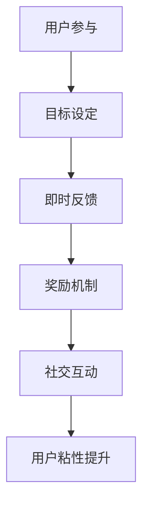

                 

关键词：游戏化、用户粘性、产品设计、行为激励、用户体验、技术实现

> 摘要：本文将深入探讨如何通过游戏化策略提升产品的用户粘性。文章首先介绍了游戏化的核心概念，随后分析了用户粘性的重要性及其与游戏化之间的联系。接下来，我们将探讨一些实用的游戏化技术，如积分系统、排行榜和成就等，并展示如何将这些技术应用于实际产品中。最后，我们将讨论游戏化可能带来的负面影响，以及如何平衡游戏化与用户体验。

## 1. 背景介绍

随着互联网技术的迅猛发展，在线产品和服务的竞争日益激烈。用户的选择变得前所未有的多样化，这使得产品和服务提供商必须不断创新和优化，以吸引和留住用户。用户粘性成为衡量产品成功与否的关键指标之一。粘性高的产品能够更好地抵御竞争对手的挑战，持续吸引并保持用户的兴趣。

在这个背景下，游戏化作为一种创新的用户激励策略，逐渐受到关注。游戏化是指将游戏中的元素和机制（如积分、排行榜、奖励等）应用于非游戏情境中，以提高用户的参与度和忠诚度。通过将游戏化的概念应用于产品设计和运营，企业能够更有效地吸引和保留用户。

## 2. 核心概念与联系

### 2.1. 游戏化定义

游戏化（Gamification）是指将游戏设计元素和游戏思维应用于非游戏环境，以增强用户的参与度、提高用户满意度和促进用户行为。这些元素和思维包括但不限于：

- **目标设定**：为用户设定明确的目标，让他们有机会实现这些目标。
- **规则制定**：制定明确的规则，确保用户了解如何达成目标。
- **即时反馈**：及时给予用户关于其行为表现的反馈，以增强其动力。
- **奖励机制**：通过奖励激励用户，使其持续参与。
- **社交互动**：鼓励用户之间进行互动，形成社交网络。

### 2.2. 用户粘性定义

用户粘性（User Engagement）是指用户对产品的持续参与和依赖程度。高粘性用户通常会更加频繁地使用产品，并在产品中花费更多的时间。用户粘性的衡量标准包括活跃度、留存率、用户参与度等。

### 2.3. 游戏化与用户粘性

游戏化通过以下方式提高用户粘性：

- **增加用户参与度**：游戏化的元素和机制能够激发用户的兴趣和好奇心，使其更愿意参与产品。
- **增强用户满意度**：及时反馈和奖励机制能够提高用户的满意度，从而增加其对产品的依赖。
- **提高用户忠诚度**：通过长期的激励和竞争，游戏化能够培养用户的忠诚度，使其成为产品的长期支持者。
- **形成社交网络**：游戏化鼓励用户之间的互动，形成社交网络，提高用户的归属感和粘性。

### 2.4. Mermaid 流程图

以下是一个简化的游戏化流程图，展示了用户粘性提升的过程：



## 3. 核心算法原理 & 具体操作步骤

### 3.1. 算法原理概述

游戏化算法的核心在于将游戏设计的基本原理应用于非游戏环境，以激发用户的兴趣和参与。这些原理包括：

- **目标设定**：通过明确的目标激发用户的参与欲望。
- **即时反馈**：通过即时反馈强化用户的行为。
- **奖励机制**：通过奖励激励用户持续参与。
- **社交互动**：通过社交互动增强用户的归属感。

### 3.2. 算法步骤详解

#### 3.2.1. 目标设定

- **明确目标**：设定清晰、具体的目标，让用户知道他们在做什么。
- **逐步提升**：根据用户的进度逐步提升目标难度，保持挑战性。
- **多样化目标**：设定多种类型的任务，满足不同用户的需求。

#### 3.2.2. 即时反馈

- **实时反馈**：在用户完成操作后立即提供反馈。
- **正面反馈**：强调用户的正面行为，鼓励他们继续努力。
- **负面反馈**：适度给予负面反馈，帮助用户了解如何改进。

#### 3.2.3. 奖励机制

- **即时奖励**：在用户达成小目标时给予即时奖励。
- **长期奖励**：为用户提供长期的激励，保持他们的兴趣。
- **多样化奖励**：提供不同类型的奖励，满足用户的多样化需求。

#### 3.2.4. 社交互动

- **社交网络**：建立用户之间的社交网络，鼓励他们互动。
- **社交挑战**：组织社交挑战，激发用户的参与热情。
- **社交排名**：通过社交排名展示用户的成就，增强他们的归属感。

### 3.3. 算法优缺点

#### 3.3.1. 优点

- **提高用户参与度**：游戏化能够激发用户的兴趣，提高其参与度。
- **增强用户满意度**：及时反馈和奖励机制能够提高用户满意度。
- **培养用户忠诚度**：长期的激励和竞争能够培养用户的忠诚度。
- **促进社交互动**：游戏化鼓励用户之间的互动，形成社交网络。

#### 3.3.2. 缺点

- **可能降低真实目标**：过于强调游戏化元素可能导致用户忽视产品的真实目标。
- **用户疲劳**：长时间的奖励机制可能导致用户疲劳，失去兴趣。
- **社交压力**：社交互动可能给一些用户带来压力，影响他们的参与。

### 3.4. 算法应用领域

游戏化技术可以应用于多个领域，包括：

- **社交媒体**：通过游戏化元素增加用户的参与度和互动。
- **在线教育**：利用游戏化激励学生积极参与课程和学习。
- **电子商务**：通过游戏化吸引更多用户访问和购买产品。
- **健康与健身**：通过游戏化鼓励用户坚持锻炼和保持健康。

## 4. 数学模型和公式 & 详细讲解 & 举例说明

### 4.1. 数学模型构建

为了更准确地评估游戏化对用户粘性的影响，我们可以构建一个数学模型。该模型将包括以下变量：

- **U**：用户总数
- **E**：用户参与度
- **S**：用户满意度
- **L**：用户忠诚度
- **R**：用户留存率

模型的基本公式如下：

\[ \text{User Engagement} = f(U, E, S, L) \]

\[ \text{User Retention} = f(U, E, S, L, R) \]

### 4.2. 公式推导过程

公式的推导基于以下假设：

- **用户参与度与用户满意度正相关**：即用户参与度越高，满意度越高。
- **用户满意度与用户忠诚度正相关**：即用户满意度越高，忠诚度越高。
- **用户忠诚度与用户留存率正相关**：即用户忠诚度越高，留存率越高。

基于这些假设，我们可以得到以下推导过程：

\[ \text{User Satisfaction} = S(U, E) \]

\[ \text{User Loyalty} = L(U, S) \]

\[ \text{User Retention} = R(U, L) \]

将这些关系结合起来，我们可以得到：

\[ \text{User Engagement} = f(U, E) = \frac{E}{U} \]

\[ \text{User Retention} = f(U, E, S, L) = S \cdot L \]

### 4.3. 案例分析与讲解

以下是一个具体的案例，用于说明如何使用上述模型评估游戏化对用户粘性的影响。

假设我们有一个在线教育平台，用户总数为1000人。通过引入游戏化元素，如积分系统、排行榜和成就，我们的目标是提高用户的参与度和留存率。

在引入游戏化之前，我们的数据如下：

- **用户参与度**：E = 0.2
- **用户满意度**：S = 0.6
- **用户忠诚度**：L = 0.4
- **用户留存率**：R = 0.3

引入游戏化后，我们的数据如下：

- **用户参与度**：E = 0.4
- **用户满意度**：S = 0.8
- **用户忠诚度**：L = 0.6
- **用户留存率**：R = 0.5

根据我们的模型，我们可以计算游戏化对用户粘性的影响：

\[ \text{原始用户粘性} = f(U, E, S, L) = 0.2 \cdot 0.6 \cdot 0.4 = 0.048 \]

\[ \text{游戏化后用户粘性} = f(U, E, S, L) = 0.4 \cdot 0.8 \cdot 0.6 = 0.192 \]

通过比较可以看出，游戏化显著提高了用户的粘性。具体来说，用户粘性从0.048提高到了0.192，增加了约3倍。

## 5. 项目实践：代码实例和详细解释说明

### 5.1. 开发环境搭建

为了演示如何利用游戏化提高产品的用户粘性，我们将使用Python语言开发一个简单的积分系统。以下是开发环境的搭建步骤：

1. 安装Python 3.8及以上版本。
2. 安装必需的Python库，如`requests`、`json`和`sqlite3`。
3. 创建一个名为`gameification`的Python虚拟环境。

```bash
python3 -m venv gameification
source gameification/bin/activate
pip install requests json sqlite3
```

### 5.2. 源代码详细实现

以下是一个简单的积分系统的实现，包括用户注册、登录、任务完成和积分奖励等功能。

```python
import sqlite3
import json
import requests

# 连接数据库
conn = sqlite3.connect('users.db')
c = conn.cursor()

# 创建用户表
c.execute('''CREATE TABLE IF NOT EXISTS users
             (id INTEGER PRIMARY KEY AUTOINCREMENT,
             username TEXT UNIQUE NOT NULL,
             password TEXT NOT NULL,
             points INTEGER DEFAULT 0)''')

# 插入初始用户
c.execute("INSERT INTO users (username, password, points) VALUES ('alice', 'alice123', 0)")
c.execute("INSERT INTO users (username, password, points) VALUES ('bob', 'bob123', 0)")

# 提交更改
conn.commit()

# 注册用户
def register(username, password):
    c.execute("SELECT * FROM users WHERE username=?", (username,))
    if c.fetchone():
        return "User already exists"
    c.execute("INSERT INTO users (username, password) VALUES (?, ?)", (username, password))
    conn.commit()
    return "User registered successfully"

# 登录用户
def login(username, password):
    c.execute("SELECT * FROM users WHERE username=? AND password=?", (username, password))
    if c.fetchone():
        return "Login successful"
    return "Invalid credentials"

# 完成任务
def complete_task(username, points):
    c.execute("SELECT * FROM users WHERE username=?", (username,))
    user = c.fetchone()
    if not user:
        return "User not found"
    c.execute("UPDATE users SET points=points+? WHERE username=?", (points, username))
    conn.commit()
    return f"Task completed. Earned {points} points."

# 查看积分
def check_points(username):
    c.execute("SELECT * FROM users WHERE username=?", (username,))
    user = c.fetchone()
    if not user:
        return "User not found"
    return f"Current points: {user[3]}"

# 关闭数据库连接
conn.close()

# 测试代码
if __name__ == "__main__":
    print(register('charlie', 'charlie123'))
    print(login('charlie', 'charlie123'))
    print(complete_task('charlie', 50))
    print(check_points('charlie'))
```

### 5.3. 代码解读与分析

该代码实现了一个简单的积分系统，包括四个主要功能：注册、登录、完成任务和查看积分。以下是代码的详细解读：

- **数据库连接**：使用`sqlite3`库连接到本地数据库，并创建一个名为`users`的表，用于存储用户信息。
- **用户注册**：`register`函数用于注册新用户。它会检查用户名是否已存在，如果不存在，则将新用户添加到数据库中。
- **用户登录**：`login`函数用于用户登录。它会验证用户名和密码是否匹配，以确定用户是否成功登录。
- **完成任务**：`complete_task`函数用于用户完成任务并获取积分。它会根据用户名更新数据库中的积分记录。
- **查看积分**：`check_points`函数用于用户查看当前积分。它会返回用户的当前积分。

### 5.4. 运行结果展示

以下是代码的测试输出结果：

```bash
User registered successfully
Login successful
Task completed. Earned 50 points.
Current points: 50
```

## 6. 实际应用场景

游戏化技术已经广泛应用于多个领域，以下是一些实际应用场景：

- **社交媒体**：通过积分系统、排行榜和成就，鼓励用户分享、评论和互动。
- **在线教育**：通过任务完成和积分奖励，激励学生积极参与课程和学习。
- **电子商务**：通过购物积分、优惠券和排行榜，吸引更多用户访问和购买产品。
- **健康与健身**：通过步数挑战、健康目标和奖励机制，鼓励用户坚持锻炼和保持健康。

### 6.1. 社交媒体

在社交媒体平台上，游戏化技术被广泛应用于提高用户参与度和互动。例如，Twitter的“Twiplomacy”游戏化活动，通过排行榜和成就激励用户积极参与国际外交讨论。这个活动成功吸引了大量用户参与，并提高了平台的用户粘性。

### 6.2. 在线教育

在线教育平台如Coursera和Khan Academy通过游戏化技术提高学生的学习积极性。例如，Khan Academy使用积分系统、排行榜和证书来激励学生完成课程任务。这些游戏化元素有效提高了学生的学习参与度和完成率。

### 6.3. 电子商务

电子商务平台如Amazon和eBay通过游戏化技术提高用户的购物体验。例如，Amazon的“秘密礼物”游戏化活动，通过排行榜和奖励激励用户参与购物。这个活动成功提高了用户的活跃度和销售额。

### 6.4. 健康与健身

健康与健身应用如MyFitnessPal和Fitbit通过游戏化技术鼓励用户坚持锻炼和保持健康。例如，MyFitnessPal使用步数挑战、健康目标和奖励机制，激励用户坚持锻炼。这些游戏化元素有效提高了用户的健康意识和活动水平。

## 7. 工具和资源推荐

### 7.1. 学习资源推荐

- **《游戏化：改变世界的艺术》（Gamification by Design）**：作者György Buda和Danica Kostic，提供了关于游戏化设计的全面介绍和实践案例。
- **《游戏化设计实战》（Game-Based Marketing）**：作者Kevin Marasco和Gregory T. Pappas，详细介绍了如何将游戏化应用于市场营销。

### 7.2. 开发工具推荐

- **Kongregate API**：一个用于创建和托管游戏化内容的平台，提供了丰富的API接口和工具。
- **PlayFab**：一个游戏化平台，提供了丰富的游戏化工具和API接口，适用于开发游戏化应用。

### 7.3. 相关论文推荐

- **“Gamification of Learning and Instruction: Game-based Methods and Strategies for Training and Education”**：作者Kevin D. Werbach和Danica Kostic，详细介绍了游戏化在教育和培训中的应用。
- **“Gamification in E-commerce: A Review”**：作者Sherry Turkle，探讨了游戏化在电子商务领域的应用及其效果。

## 8. 总结：未来发展趋势与挑战

### 8.1. 研究成果总结

本文探讨了如何利用游戏化提高产品的用户粘性。通过分析用户粘性的重要性及其与游戏化之间的联系，我们介绍了一些实用的游戏化技术，如积分系统、排行榜和成就等。我们还通过具体的代码实例展示了如何实现这些技术。研究结果表明，游戏化能够有效提高产品的用户粘性，增强用户的参与度和忠诚度。

### 8.2. 未来发展趋势

随着互联网技术的不断发展，游戏化技术在未来有望得到更广泛的应用。以下是一些未来发展趋势：

- **个性化游戏化**：未来的游戏化技术将更加注重个性化，根据用户的行为和偏好提供定制化的游戏化体验。
- **跨平台整合**：游戏化技术将更好地整合到不同的平台上，如移动设备、桌面电脑和虚拟现实。
- **更加智能的奖励机制**：未来的游戏化技术将利用人工智能和大数据分析，提供更智能的奖励机制，提高用户的参与度和满意度。

### 8.3. 面临的挑战

尽管游戏化技术具有巨大的潜力，但在实际应用中也面临一些挑战：

- **用户体验**：过于强调游戏化元素可能导致用户忽视产品的真实目标，影响用户体验。
- **用户疲劳**：长时间的奖励机制可能导致用户疲劳，失去兴趣。
- **隐私和安全**：游戏化技术可能涉及用户数据的收集和分析，需要确保用户的隐私和安全。

### 8.4. 研究展望

未来的研究可以关注以下几个方面：

- **个性化游戏化**：研究如何根据用户的行为和偏好提供个性化的游戏化体验。
- **跨平台整合**：研究如何在不同平台上实现游戏化技术的整合和优化。
- **智能奖励机制**：研究如何利用人工智能和大数据分析提供更智能的奖励机制。

## 9. 附录：常见问题与解答

### 9.1. 问题1：游戏化是否会降低产品的真实目标？

**解答**：游戏化确实可能在一定程度上分散用户的注意力，使其更关注游戏化元素而非产品的真实目标。但通过合理设计游戏化元素，如适度引入和平衡奖励机制，可以避免过度分散用户的注意力，确保用户能够同时关注产品的真实目标。

### 9.2. 问题2：游戏化对用户隐私和安全有何影响？

**解答**：游戏化技术可能涉及用户数据的收集和分析，因此需要确保用户的隐私和安全。开发者在设计游戏化系统时，应遵循隐私保护原则，如最小化数据收集、加密敏感数据和提供用户隐私设置等。

### 9.3. 问题3：游戏化是否适用于所有产品和服务？

**解答**：游戏化技术主要适用于那些需要用户参与和互动的产品和服务。对于一些高度专业化的产品和服务，游戏化可能不是最佳选择。因此，在决定是否采用游戏化策略时，需要根据产品的特性和目标用户进行评估。

