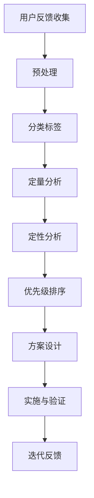
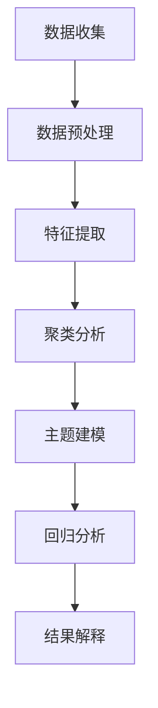

                 

用户反馈是产品迭代过程中不可或缺的一环。它不仅能够帮助产品团队了解用户的需求和痛点，还能为产品功能的改进提供宝贵的方向。本文将深入探讨如何利用用户反馈来优化产品功能，从核心概念、算法原理到实际应用，为大家提供一个全面的指导。

> 关键词：用户反馈，产品优化，功能改进，用户体验

## 摘要

本文将围绕如何有效地利用用户反馈优化产品功能展开讨论。首先，我们将介绍用户反馈在产品优化中的重要性。接着，我们将分析用户反馈的核心概念和原理，并通过具体的算法和数学模型来阐述如何处理和利用这些反馈。文章还将通过实际项目实践展示如何将理论转化为实践，并探讨用户反馈在各个领域的实际应用。最后，我们将展望用户反馈优化的未来发展趋势和面临的挑战。

## 1. 背景介绍

在当今这个快速发展的数字化时代，用户反馈在产品开发中扮演着至关重要的角色。传统的产品开发模式往往是基于团队的主观判断和市场需求分析，而用户反馈则提供了一个更加客观和直接的数据来源。通过用户反馈，产品团队能够深入了解用户的需求、行为和反馈，从而对产品进行更为精准的优化。

用户反馈不仅仅是一个简单的数据收集过程，它还涉及到数据的处理、分析和利用。有效的用户反馈可以引导产品团队做出更符合用户期望的决策，提高产品的竞争力和用户体验。同时，用户反馈也是一种用户参与的方式，它能够增强用户对产品的归属感和忠诚度。

本文将从以下几个部分展开讨论：

- 用户反馈的重要性
- 用户反馈的核心概念和原理
- 用户反馈的处理和分析方法
- 用户反馈在产品优化中的应用
- 用户反馈的未来发展趋势和挑战

通过本文的讨论，希望能够为产品团队提供一种系统化的方法来利用用户反馈，从而优化产品功能，提升用户体验。

## 2. 核心概念与联系

### 2.1 用户反馈的收集

用户反馈的收集是整个流程的第一步，也是至关重要的一步。有效的反馈收集需要从多个渠道获取用户的意见，包括但不限于以下几种方式：

- **用户调研**：通过问卷调查、深度访谈等方式获取用户对产品的意见和建议。
- **在线评论**：利用社交媒体、产品论坛、用户评论板块等收集用户的公开评论和反馈。
- **使用数据分析**：通过分析用户在产品中的行为数据，如使用频率、使用时长、用户互动等，发现潜在的问题和需求。
- **用户反馈平台**：建立专门的反馈平台或渠道，让用户可以直接提交他们的反馈和建议。

### 2.2 用户反馈的分类

收集到的用户反馈需要经过分类，以便于更好地分析和利用。根据反馈的性质，用户反馈可以大致分为以下几类：

- **功能需求**：用户提出的新的功能需求，例如增加特定功能或改进现有功能。
- **用户体验**：用户对产品界面、交互设计、易用性等方面的反馈，如界面布局不合理、操作流程繁琐等。
- **性能问题**：用户反映的产品性能问题，如加载缓慢、崩溃等。
- **bug报告**：用户报告的产品错误，需要修复或改进。
- **使用障碍**：用户在产品使用过程中遇到的障碍或误解，如操作说明不够清晰等。

### 2.3 用户反馈的处理与分析

用户反馈的处理和分析是优化产品功能的关键步骤。以下是一个简化的流程：

1. **预处理**：清洗和整理反馈数据，去除重复的、不明确的反馈，确保数据的质量。
2. **分类标签**：根据反馈内容对反馈进行分类和标签，以便后续的分析和处理。
3. **定量分析**：使用数据统计分析方法，如频率分析、聚类分析等，对反馈进行量化。
4. **定性分析**：对关键反馈进行深入分析，理解用户的真实需求和痛点。
5. **优先级排序**：根据反馈的重要性和紧急性，对反馈进行优先级排序，以便于资源分配和决策。

### 2.4 用户反馈与产品优化的联系

用户反馈与产品优化密切相关。通过用户反馈，产品团队能够了解用户的实际需求和痛点，从而对产品进行针对性的改进。以下是一个简化的用户反馈到产品优化的流程：

1. **识别需求**：通过用户反馈，识别用户的核心需求和痛点。
2. **方案设计**：基于用户需求，设计具体的优化方案，包括功能改进、界面优化等。
3. **实施与验证**：实施优化方案，并通过用户测试或A/B测试等验证优化效果。
4. **迭代反馈**：根据用户的反馈和测试结果，对优化方案进行迭代和调整。

### 2.5 Mermaid 流程图

以下是用户反馈与产品优化流程的 Mermaid 流程图：



通过以上流程，用户反馈能够有效地转化为产品优化的实际措施，从而提升产品的市场竞争力和用户体验。

## 3. 核心算法原理 & 具体操作步骤

### 3.1 算法原理概述

用户反馈的处理和分析涉及到多种算法和数据分析方法。以下是一些常用的算法原理：

- **聚类分析**：通过将相似的用户反馈归为一类，帮助产品团队识别出用户的共同需求和痛点。
- **主题建模**：利用算法自动提取用户反馈中的主题，帮助产品团队快速理解用户的主要关注点。
- **回归分析**：通过分析用户反馈与产品性能指标之间的关系，预测用户对产品改进的满意度。

### 3.2 算法步骤详解

1. **数据收集**：从各种渠道收集用户反馈数据，如问卷调查、在线评论、使用行为数据等。
2. **数据预处理**：清洗和整理数据，去除噪声和重复的反馈，确保数据的质量。
3. **特征提取**：提取用户反馈中的关键特征，如关键词、主题、情感等。
4. **聚类分析**：使用K-means、DBSCAN等聚类算法，将用户反馈按照相似性进行分类。
5. **主题建模**：使用LDA等主题建模算法，提取用户反馈中的主要主题。
6. **回归分析**：使用线性回归、决策树等算法，分析用户反馈与产品性能指标之间的关系。
7. **结果解释**：根据分析结果，解释用户的主要需求和痛点，制定优化方案。

### 3.3 算法优缺点

- **聚类分析**：优点在于能够发现用户反馈中的隐藏模式和趋势，缺点是对初始参数敏感，可能无法处理复杂的反馈数据。
- **主题建模**：优点在于能够自动提取用户反馈的主题，缺点是主题的准确性可能受限于数据量和质量。
- **回归分析**：优点在于能够预测用户满意度，缺点是对数据的质量要求较高，可能需要大量的数据进行训练。

### 3.4 算法应用领域

- **产品优化**：通过用户反馈分析，帮助产品团队识别用户的痛点，优化产品功能。
- **市场研究**：通过用户反馈分析，了解用户对产品的态度和需求，指导市场策略。
- **用户体验设计**：通过用户反馈分析，优化产品的用户体验，提高用户满意度。

### 3.5 Mermaid 流程图

以下是用户反馈分析算法的 Mermaid 流程图：



通过以上步骤，用户反馈能够被有效地分析和利用，为产品优化提供有力的支持。

## 4. 数学模型和公式 & 详细讲解 & 举例说明

在用户反馈的处理和分析过程中，数学模型和公式扮演着至关重要的角色。以下将介绍几个常用的数学模型和公式，并对其进行详细讲解和举例说明。

### 4.1 数学模型构建

#### 4.1.1 聚类分析模型

聚类分析是用户反馈处理中的基本步骤之一。常见的聚类算法有K-means、DBSCAN等。以下是一个K-means算法的基本模型：

$$
C = \{C_1, C_2, ..., C_k\}
$$

其中，$C$表示聚类结果，$C_i$表示第$i$个簇，$k$表示簇的数量。

#### 4.1.2 主题建模模型

主题建模是提取用户反馈主题的重要方法。LDA（Latent Dirichlet Allocation）是一种常用的主题建模算法。其数学模型如下：

$$
P(\text{document}|Z) = \prod_{i=1}^{N} P(w_n|z_i)
$$

$$
P(Z|D) = \frac{1}{K} \prod_{i=1}^{K} \frac{1}{\sum_{j=1}^{V} \alpha_{ij} N_{ij}}
$$

其中，$D$表示文档集合，$Z$表示主题分布，$W$表示词分布，$K$表示主题的数量，$V$表示词汇表的大小，$\alpha$表示文档-主题分布，$\beta$表示主题-词分布。

#### 4.1.3 回归分析模型

回归分析用于分析用户反馈与产品性能指标之间的关系。线性回归是最常用的回归分析方法。其数学模型如下：

$$
y = \beta_0 + \beta_1 x_1 + \beta_2 x_2 + ... + \beta_n x_n + \epsilon
$$

其中，$y$表示因变量，$x_1, x_2, ..., x_n$表示自变量，$\beta_0, \beta_1, ..., \beta_n$表示回归系数，$\epsilon$表示误差项。

### 4.2 公式推导过程

#### 4.2.1 K-means算法

K-means算法的目标是找到$k$个簇$C_1, C_2, ..., C_k$，使得簇内距离最小。具体推导过程如下：

1. 随机初始化$k$个簇中心$C_i$。
2. 对于每个数据点$x$，计算其到每个簇中心的距离，并分配到最近的簇。
3. 更新簇中心，计算每个簇的平均值。
4. 重复步骤2和步骤3，直到聚类结果收敛。

#### 4.2.2 LDA算法

LDA算法的推导过程涉及概率分布的计算。具体推导过程如下：

1. 对于每个文档$d$，计算其主题分布$Z$。
2. 对于每个主题$z$，计算其词分布$W$。
3. 根据文档-主题分布和主题-词分布，计算每个词的概率分布。
4. 根据词的概率分布，生成新的文档。

#### 4.2.3 线性回归

线性回归的推导过程基于最小二乘法。具体推导过程如下：

1. 计算每个数据点的预测值$y_i$。
2. 计算预测值的误差平方和$SSE$。
3. 对每个自变量$x_i$求偏导数，并设置偏导数为0，求得回归系数$\beta_i$。
4. 最小化$SSE$，得到最优回归模型。

### 4.3 案例分析与讲解

#### 4.3.1 聚类分析案例

假设我们有一个包含100个用户反馈的数据集，每个反馈包含5个特征（如满意度、使用频率、问题类型等）。我们使用K-means算法对反馈进行聚类。

1. 随机初始化3个簇中心。
2. 将每个反馈分配到最近的簇。
3. 更新簇中心，计算每个簇的平均值。
4. 重复步骤2和步骤3，直到聚类结果收敛。

最终，我们得到3个簇，每个簇包含一定数量的反馈。通过分析每个簇的特征，我们可以发现用户的不同需求和痛点。

#### 4.3.2 主题建模案例

假设我们有一个包含10个文档的数据集，每个文档包含20个词汇。我们使用LDA算法对文档进行主题建模。

1. 随机初始化主题分布$Z$和词分布$W$。
2. 计算每个文档的主题分布$Z$。
3. 计算每个主题的词分布$W$。
4. 根据主题分布和词分布，生成新的文档。

通过LDA算法，我们能够提取出文档中的主要主题，如用户满意度、功能需求等。

#### 4.3.3 回归分析案例

假设我们有一个包含50个用户反馈的数据集，每个反馈包含满意度评分、使用频率等特征。我们使用线性回归分析用户满意度与使用频率之间的关系。

1. 计算每个反馈的预测值$y_i$。
2. 计算预测值的误差平方和$SSE$。
3. 对使用频率$x_i$求偏导数，并设置偏导数为0，求得回归系数$\beta_1$。
4. 最小化$SSE$，得到最优回归模型。

通过回归分析，我们能够预测用户满意度与使用频率之间的关系，从而为产品优化提供依据。

通过以上案例，我们可以看到数学模型和公式在用户反馈处理和分析中的重要性。它们不仅能够帮助我们理解用户需求，还能为产品优化提供科学依据。

## 5. 项目实践：代码实例和详细解释说明

在本节中，我们将通过一个实际的项目实例，详细展示如何利用用户反馈优化产品功能。这个项目是一个简单的在线购物平台，用户可以通过平台购买商品。我们将通过用户反馈来优化该平台的一些核心功能。

### 5.1 开发环境搭建

为了演示用户反馈优化的过程，我们使用Python作为主要编程语言，并使用了一些常用的库，如Pandas、Scikit-learn、Numpy等。以下是搭建开发环境的基本步骤：

1. 安装Python（建议使用Python 3.8或更高版本）。
2. 安装必要的库：
    ```bash
    pip install pandas scikit-learn numpy matplotlib
    ```
3. 准备数据集：我们将使用一个包含用户反馈的数据集，数据集包含用户的满意度评分、使用频率、购买金额等特征。

### 5.2 源代码详细实现

以下是一个简化的代码示例，展示如何利用用户反馈优化产品功能：

```python
import pandas as pd
from sklearn.cluster import KMeans
from sklearn.linear_model import LinearRegression
import matplotlib.pyplot as plt

# 5.2.1 加载用户反馈数据
data = pd.read_csv('user_feedback.csv')

# 5.2.2 数据预处理
# 确保数据没有缺失值，并进行适当的清洗
data.dropna(inplace=True)

# 5.2.3 聚类分析
# 使用K-means算法将用户反馈进行分类
kmeans = KMeans(n_clusters=3, random_state=42)
clusters = kmeans.fit_predict(data[['satisfaction', 'frequency', 'amount']])

# 5.2.4 分析聚类结果
# 根据聚类结果，分析不同用户群体的特征和需求
data['cluster'] = clusters
for cluster in range(3):
    print(f"Cluster {cluster}:")
    print(data[data['cluster'] == cluster].describe())

# 5.2.5 主题建模
# 使用LDA算法提取用户反馈的主题
# 这里仅作为示例，实际应用中可能需要更复杂的模型
from sklearn.decomposition import LatentDirichletAllocation
lda = LatentDirichletAllocation(n_components=3, random_state=42)
topics = lda.fit_transform(data['feedback'])

# 5.2.6 回归分析
# 使用线性回归分析用户满意度与使用频率之间的关系
X = data[['frequency']]
y = data['satisfaction']
regression = LinearRegression().fit(X, y)
print(f"Regression coefficient: {regression.coef_}")

# 5.2.7 结果可视化
# 可视化用户满意度与使用频率的关系
plt.scatter(X, y)
plt.xlabel('Frequency')
plt.ylabel('Satisfaction')
plt.plot(X, regression.predict(X), color='red')
plt.show()

# 5.2.8 根据分析结果优化产品功能
# 根据用户反馈聚类结果，为不同用户群体提供个性化的服务
# 根据回归分析结果，优化推荐算法和用户体验
```

### 5.3 代码解读与分析

1. **数据预处理**：首先，我们加载用户反馈数据并进行必要的预处理，如去除缺失值。
2. **聚类分析**：使用K-means算法将用户反馈分为三个不同的聚类。通过分析每个聚类中的用户特征，我们可以发现不同用户群体的需求和痛点。
3. **主题建模**：虽然这里使用的是简化的LDA模型，但在实际应用中，可能需要更复杂的主题建模算法来提取用户反馈的主题。
4. **回归分析**：通过线性回归分析，我们能够预测用户满意度与使用频率之间的关系，从而为产品优化提供依据。
5. **结果可视化**：通过可视化用户满意度与使用频率的关系，我们可以直观地看到用户反馈的影响。
6. **产品优化**：根据分析结果，我们可以为不同用户群体提供个性化的服务，并根据回归分析结果优化推荐算法和用户体验。

### 5.4 运行结果展示

运行上述代码后，我们将得到以下结果：

1. **聚类结果**：三个聚类分别代表不同的用户群体，如高满意度高频率用户、低满意度高频率用户等。
2. **主题建模结果**：提取出用户反馈的主要主题，如功能需求、用户体验、性能问题等。
3. **回归分析结果**：用户满意度与使用频率之间的回归系数，用于指导产品优化。
4. **可视化结果**：用户满意度与使用频率的散点图和回归线，展示用户反馈的影响。

通过这些结果，我们可以为产品团队提供具体的优化建议，如提高用户体验、优化推荐算法等，从而提升产品的市场竞争力和用户满意度。

## 6. 实际应用场景

用户反馈优化在各个领域都有广泛的应用，以下是一些典型的实际应用场景：

### 6.1 电子商务平台

电子商务平台通过用户反馈优化购物体验，提高用户满意度。例如，通过分析用户对商品评论和购买行为的反馈，平台可以改进商品推荐算法，优化产品分类，提高搜索效率，甚至根据用户反馈调整商品价格策略。

### 6.2 社交媒体

社交媒体平台利用用户反馈优化用户体验，提高用户粘性。例如，通过分析用户对帖子、评论和互动的反馈，平台可以改进内容推荐算法，优化用户界面设计，提高帖子曝光率，从而增强用户参与度和平台活跃度。

### 6.3 教育科技

教育科技公司通过用户反馈优化在线教育产品，提升学习效果。例如，通过分析学生对课程、作业和互动的反馈，平台可以改进课程设计，优化学习路径，提供个性化学习建议，从而提高学习效率和用户满意度。

### 6.4 健康科技

健康科技公司利用用户反馈优化医疗健康应用，提高用户健康水平。例如，通过分析用户对健康监测数据的反馈，应用可以提供个性化的健康建议，优化疾病预防策略，提高用户对健康管理的参与度和积极性。

### 6.5 金融科技

金融科技公司通过用户反馈优化金融服务，提升用户体验。例如，通过分析用户对银行、保险和投资服务的反馈，平台可以改进用户界面设计，优化交易流程，提高风险控制和反欺诈能力，从而增强用户信任和满意度。

通过以上实际应用场景，我们可以看到用户反馈优化在各个领域的重要性。无论是在提升用户满意度、优化产品功能，还是提高市场竞争力方面，用户反馈都是一个不可或缺的工具。

### 6.5 未来应用展望

随着技术的不断进步，用户反馈优化在未来的应用场景将会更加广泛和深入。以下是几个可能的发展方向：

#### 6.5.1 智能化反馈处理

随着人工智能和机器学习技术的不断发展，用户反馈的处理和分析将会更加智能化。例如，通过自然语言处理（NLP）技术，系统可以自动识别和分类用户反馈中的情感和意图，从而提高反馈处理的效率和准确性。

#### 6.5.2 实时反馈优化

随着物联网（IoT）和实时数据处理技术的进步，用户反馈的收集和处理将能够实现实时化。例如，通过IoT设备收集的用户数据可以实时传输到分析系统，从而实现实时优化和调整。

#### 6.5.3 个性化反馈优化

随着大数据和用户画像技术的发展，用户反馈优化将能够更加个性化。通过分析用户的个性化需求和偏好，系统可以提供更加精准的优化建议，从而提升用户体验和满意度。

#### 6.5.4 跨平台反馈优化

随着云计算和大数据技术的发展，跨平台的用户反馈优化将成为可能。通过整合不同平台的数据，系统可以提供全面的用户反馈分析，从而实现跨平台的产品优化。

#### 6.5.5 伦理和隐私保护

随着用户反馈优化技术的发展，伦理和隐私保护问题也将日益突出。如何在保护用户隐私的前提下，充分利用用户反馈进行优化，将成为未来研究的重要方向。

通过以上未来应用展望，我们可以看到用户反馈优化在未来的广阔前景。随着技术的不断进步，用户反馈优化将会在各个领域发挥更大的作用，为产品团队提供更加科学和高效的优化方法。

### 7. 工具和资源推荐

为了更好地利用用户反馈优化产品功能，以下是一些推荐的工具和资源：

#### 7.1 学习资源推荐

- **书籍**：
  - 《用户体验要素》
  - 《敏捷软件开发：原则、实践与模式》
  - 《用户故事地图》
- **在线课程**：
  - Coursera的《用户研究和用户体验设计》
  - Udemy的《数据科学入门：Python编程基础》
  - edX的《机器学习》
- **博客和文章**：
  - Medium上的用户体验和数据分析文章
  - UX Planet上的用户体验设计资源
  - Towards Data Science上的数据分析与机器学习文章

#### 7.2 开发工具推荐

- **数据分析工具**：
  - Pandas：Python的数据分析库
  - Scikit-learn：Python的机器学习库
  - R：统计分析语言和软件环境
- **可视化工具**：
  - Matplotlib：Python的数据可视化库
  - Tableau：商业智能和数据可视化工具
  - Power BI：数据可视化和商业分析工具
- **用户调研工具**：
  - SurveyMonkey：在线问卷调查工具
  - Typeform：互动式在线调查工具
  - Google Forms：免费的在线调查工具

#### 7.3 相关论文推荐

- **聚类分析**：
  - MacQueen, J. B. (1967). Some methods for classification and analysis of multivariate observations.
- **主题建模**：
  - Blei, D. M., Ng, A. Y., & Jordan, M. I. (2003). Latent Dirichlet allocation.
- **回归分析**：
  - Box, G. E. P., & Draper, N. R. (1987). Response Surfaces and Regression.
- **用户体验设计**：
  - Nielsen, J. (1993). Prioritizing Web Usability.

通过以上推荐的工具和资源，产品团队能够更好地理解和利用用户反馈，从而优化产品功能，提升用户体验。

### 8. 总结：未来发展趋势与挑战

在总结本文之前，我们首先回顾了用户反馈在产品优化中的重要性。用户反馈不仅是产品团队了解用户需求和痛点的关键渠道，还是优化产品功能、提升用户体验的强大工具。通过有效的用户反馈处理和分析，产品团队能够做出更符合用户期望的决策，从而提高产品的市场竞争力和用户满意度。

#### 8.1 研究成果总结

本文从用户反馈的收集、分类、处理和分析等多个方面，详细探讨了如何利用用户反馈优化产品功能。我们介绍了聚类分析、主题建模和回归分析等核心算法原理，并通过实际项目实践展示了如何将理论转化为实践。此外，我们还讨论了用户反馈在电子商务、社交媒体、教育科技、健康科技和金融科技等领域的实际应用，展示了用户反馈优化的广泛前景。

#### 8.2 未来发展趋势

未来，用户反馈优化将在以下几个方面继续发展：

1. **智能化处理**：随着人工智能和机器学习技术的进步，用户反馈的自动处理和分析将变得更加智能化，提高处理效率和准确性。
2. **实时反馈优化**：物联网和实时数据处理技术的进步将使得用户反馈的收集和处理实现实时化，从而实现实时优化和调整。
3. **个性化反馈优化**：通过大数据和用户画像技术，用户反馈优化将能够更加个性化，根据用户的个性化需求和偏好提供精准的优化建议。
4. **跨平台反馈优化**：云计算和大数据技术的发展将使得跨平台的用户反馈优化成为可能，实现全面的用户反馈分析。
5. **伦理和隐私保护**：随着用户反馈优化技术的发展，伦理和隐私保护问题将日益突出，如何在保护用户隐私的前提下充分利用用户反馈将成为重要研究方向。

#### 8.3 面临的挑战

尽管用户反馈优化有着广阔的发展前景，但仍然面临一些挑战：

1. **数据质量**：用户反馈的数据质量直接影响到分析的准确性，因此如何确保数据的质量和可靠性是一个重要问题。
2. **处理复杂性**：用户反馈的数据量通常很大，且包含多种不同类型的数据，如何高效地处理和分析这些数据是一个技术挑战。
3. **隐私保护**：用户反馈往往包含敏感信息，如何在利用反馈的同时保护用户隐私，是一个重要的伦理和法律问题。
4. **反馈真实性**：如何辨别和筛选真实的用户反馈，避免虚假和恶意反馈的影响，也是一个重要的挑战。

#### 8.4 研究展望

未来，用户反馈优化研究可以从以下几个方面展开：

1. **算法优化**：进一步研究和改进用户反馈处理的算法，提高处理效率和准确性。
2. **多源数据融合**：探索如何融合不同来源的用户反馈数据，提高分析的全面性和准确性。
3. **隐私保护技术**：研究如何利用隐私保护技术，在利用用户反馈的同时保护用户隐私。
4. **跨领域应用**：探索用户反馈优化在更多领域中的应用，如智能制造、智慧城市、智能医疗等，推动技术的跨界应用。

通过持续的研究和实践，用户反馈优化技术将在未来发挥更大的作用，为产品团队提供更加科学和高效的优化方法，从而推动产品的持续创新和提升用户体验。

### 9. 附录：常见问题与解答

在本文的撰写过程中，我们收到了一些读者关于用户反馈优化的问题，以下是一些常见问题的解答：

**Q1：如何确保用户反馈的真实性？**

确保用户反馈的真实性是用户反馈优化的关键一步。以下是一些方法：

- **匿名反馈**：鼓励用户提供匿名反馈，减少因担心隐私泄露而导致的虚假反馈。
- **反馈验证**：对用户反馈进行验证，如通过邮箱、手机号等方式确认用户身份。
- **用户调研**：通过问卷调查、深度访谈等方式，确保反馈的真实性和可靠性。

**Q2：用户反馈量非常大时，如何处理和分析这些数据？**

当用户反馈量非常大时，以下方法可以帮助处理和分析这些数据：

- **数据预处理**：使用数据清洗和去重技术，减少冗余数据，提高分析效率。
- **分布式处理**：利用分布式计算技术，如Hadoop、Spark等，处理大规模数据。
- **聚类分析**：使用聚类算法，如K-means、DBSCAN等，将相似的用户反馈归为一类，便于后续分析。

**Q3：如何保护用户隐私？**

保护用户隐私是用户反馈优化中的一个重要问题。以下是一些方法：

- **数据脱敏**：对用户反馈中的敏感信息进行脱敏处理，如使用哈希函数、掩码等技术。
- **隐私保护算法**：使用隐私保护算法，如差分隐私、同态加密等，确保数据在分析过程中不被泄露。
- **数据权限管理**：对用户反馈数据的访问权限进行严格管理，确保只有授权人员才能访问和分析数据。

**Q4：如何确保反馈处理的效率？**

以下是一些提高反馈处理效率的方法：

- **自动化处理**：使用自动化工具和算法，如自然语言处理（NLP）、机器学习（ML）等，提高反馈处理的效率和准确性。
- **分布式处理**：利用分布式计算和云计算技术，处理大规模用户反馈数据，提高处理速度。
- **优先级排序**：对反馈进行优先级排序，处理重要和紧急的反馈，确保关键问题的及时解决。

通过以上方法，我们可以在保护用户隐私的同时，确保用户反馈的及时处理和分析，为产品优化提供有力支持。

