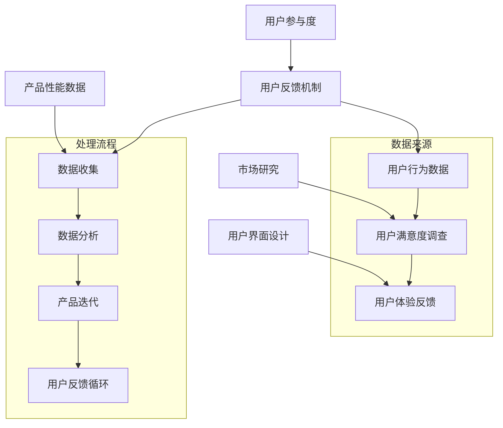

                 

### 摘要 Summary

在现代科技飞速发展的时代，产品的快速迭代已成为企业保持竞争优势的关键因素。然而，如何有效地利用用户反馈来实现这一目标，是每个企业、开发团队乃至个人开发者都必须面对的挑战。本文将探讨如何通过系统性、数据驱动的用户反馈机制，实现产品的快速迭代与优化。首先，我们将介绍用户反馈在产品迭代中的重要性，然后深入讨论构建高效反馈机制的方法、数据收集与分析技术，以及如何基于反馈进行具体的产品改进。最后，我们将展望用户反馈在未来产品开发中的应用前景，并提出相关的工具和资源推荐，以助力读者在产品迭代过程中取得成功。

## 1. 背景介绍 Background

在信息化和数字化浪潮的推动下，市场环境和用户需求正以难以想象的速度发生着变化。传统的一刀切式开发模式已经无法满足用户日益多样化和个性化的需求。为了保持竞争力，企业必须能够快速响应市场变化，持续优化产品。而用户反馈作为最直接、最真实的用户声音，无疑是实现这一目标的关键所在。

用户反馈的重要性体现在多个方面。首先，它能够帮助企业了解用户的真实需求，识别产品中存在的问题。其次，通过用户反馈，企业可以获得关于产品使用体验的宝贵数据，从而指导下一步的功能改进。此外，用户反馈还能增强用户的参与感和忠诚度，提高产品的市场认可度。

然而，用户反馈的有效利用并非易事。它需要企业具备系统化的反馈收集与分析能力，以及对用户行为和需求的深刻理解。这就引出了本文的核心问题：如何利用用户反馈快速迭代你的产品？为了回答这个问题，我们需要从构建高效的反馈机制、数据收集与分析、到具体的产品改进措施进行全面探讨。

本文将分为以下几个部分：

1. 背景介绍：介绍用户反馈在产品迭代中的重要性。
2. 核心概念与联系：介绍用户反馈机制的基本概念和架构。
3. 核心算法原理 & 具体操作步骤：介绍如何通过数据分析和机器学习等技术，从用户反馈中提取有价值的信息。
4. 数学模型和公式 & 详细讲解 & 举例说明：介绍如何构建用户反馈的数学模型，并解释相关公式和推导过程。
5. 项目实践：通过一个实际案例，展示如何利用用户反馈进行产品迭代。
6. 实际应用场景：探讨用户反馈在不同行业和领域的应用。
7. 未来应用展望：讨论用户反馈在产品开发中的未来发展趋势。
8. 工具和资源推荐：推荐一些实用的工具和资源，以帮助读者更好地利用用户反馈。
9. 总结：回顾研究成果，展望未来发展趋势与挑战。

通过本文的探讨，我们希望帮助读者理解用户反馈在产品迭代中的关键作用，并掌握一套系统的、行之有效的方法，以实现产品的快速迭代与优化。

### 2. 核心概念与联系 Core Concepts and Connections

在探讨如何利用用户反馈快速迭代产品之前，我们首先需要明确几个核心概念，并理解它们之间的相互关系。这些核心概念包括用户反馈机制、数据收集与分析技术、以及产品迭代流程。下面，我们将通过一个Mermaid流程图来展示这些核心概念及其相互关系。



**用户反馈机制**：用户反馈机制是指一套系统化的方法，用于收集、处理和分析用户的反馈信息。它通常包括用户行为数据、用户满意度调查和用户体验反馈等多个方面。用户行为数据来源于用户在产品中的实际操作，如点击路径、浏览时长等；用户满意度调查通过问卷、访谈等形式收集用户对产品的整体评价；用户体验反馈则主要来自于用户对产品功能、设计等方面的具体意见和建议。

**数据收集**：数据收集是用户反馈机制中的第一步，也是至关重要的一步。它涉及到用户行为数据、用户满意度调查和用户体验反馈等多个数据源的整合。用户行为数据可以通过埋点技术收集，而用户满意度调查和用户体验反馈则需要通过设计合适的调查问卷和反馈渠道来实现。

**数据分析**：数据分析是对收集到的用户反馈进行系统化处理的过程。它包括数据清洗、数据分析和结果可视化等步骤。通过数据分析，我们可以识别出用户反馈中的关键问题，如产品功能缺陷、用户体验痛点等。

**产品迭代**：基于数据分析的结果，产品团队可以针对性地进行产品改进和功能迭代。产品迭代是一个持续的过程，需要根据用户反馈和市场变化不断进行调整和优化。

**用户反馈循环**：用户反馈循环是一个动态的、闭环的过程，它通过不断地收集、分析和利用用户反馈，实现产品的持续改进。这个循环不仅可以帮助企业更好地理解用户需求，提高产品满意度，还可以增强用户的参与感和忠诚度。

通过上述流程，我们可以看到用户反馈机制在产品迭代中的关键作用。它不仅提供了丰富的数据支持，还能够帮助企业建立与用户的紧密联系，从而在激烈的市场竞争中保持优势。

### 3. 核心算法原理 & 具体操作步骤 Core Algorithm Principle & Detailed Steps

在用户反馈机制的基础上，核心算法的原理和具体操作步骤是实现产品快速迭代的关键。以下将详细探讨用户反馈处理的核心算法原理，并解释每一步的详细操作步骤。

#### 3.1 算法原理概述

用户反馈处理的核心算法通常包括以下几个步骤：数据收集、数据预处理、特征工程、模型训练和模型评估。以下是每个步骤的简要概述：

1. **数据收集**：收集用户行为数据、用户满意度调查和用户体验反馈。
2. **数据预处理**：清洗和转换原始数据，使其适合模型训练。
3. **特征工程**：从原始数据中提取有用的特征，以便模型能够学习和预测。
4. **模型训练**：使用机器学习算法对提取的特征进行训练，构建预测模型。
5. **模型评估**：评估模型的性能，并根据评估结果进行调整。

#### 3.2 算法步骤详解

**步骤 1：数据收集**

数据收集是用户反馈处理的基础。在这一步骤中，我们需要收集以下类型的数据：

- **用户行为数据**：包括用户在产品中的操作记录，如点击路径、浏览时长、使用频率等。这些数据可以通过埋点技术实现。
- **用户满意度调查**：通过在线问卷、访谈等方式收集用户对产品的整体评价。
- **用户体验反馈**：通过用户反馈渠道，如客服、论坛、社交媒体等，收集用户的具体意见和建议。

**步骤 2：数据预处理**

数据预处理是确保数据质量的重要步骤。以下是数据预处理的主要任务：

- **数据清洗**：去除重复数据、缺失值和噪声数据，以保证数据的一致性和准确性。
- **数据转换**：将不同数据类型的变量进行统一处理，如将分类变量转换为数值变量。
- **数据标准化**：对数值型数据进行标准化处理，使其在相同的尺度上进行分析。

**步骤 3：特征工程**

特征工程是提升模型性能的关键步骤。以下是特征工程的主要任务：

- **特征提取**：从原始数据中提取有用的特征，如用户活跃度、使用频率等。
- **特征选择**：通过统计方法或机器学习算法选择最相关的特征，以减少模型复杂度和过拟合。
- **特征组合**：通过组合不同特征，创建新的特征，以提升模型的预测能力。

**步骤 4：模型训练**

模型训练是构建预测模型的过程。以下是模型训练的主要步骤：

- **模型选择**：选择合适的机器学习算法，如逻辑回归、决策树、神经网络等。
- **参数调优**：通过交叉验证等方法调整模型参数，以提升模型性能。
- **模型训练**：使用训练数据对模型进行训练，并保存模型参数。

**步骤 5：模型评估**

模型评估是验证模型性能的重要步骤。以下是模型评估的主要任务：

- **评估指标**：选择合适的评估指标，如准确率、召回率、F1分数等。
- **模型验证**：使用验证集对模型进行评估，以确定模型的泛化能力。
- **模型调整**：根据评估结果，对模型进行调整和优化。

#### 3.3 算法优缺点

**优点**：

1. **自动性**：算法能够自动从大量用户反馈中提取有价值的信息，减少人工干预。
2. **高效性**：算法能够快速处理和分析大量数据，提高反馈处理的效率。
3. **预测性**：算法能够根据用户反馈预测未来的需求和市场趋势。

**缺点**：

1. **数据质量**：算法的性能依赖于数据的质量，数据中的噪声和缺失值会影响模型的准确性。
2. **模型复杂度**：算法需要处理大量的特征和参数，可能导致模型复杂度和计算成本增加。
3. **解释性**：算法的预测结果往往难以解释，不利于用户理解和信任。

#### 3.4 算法应用领域

算法在用户反馈处理中的应用非常广泛，主要包括以下领域：

1. **产品改进**：通过分析用户反馈，识别产品中的问题，并针对性地进行改进。
2. **需求预测**：通过分析用户反馈，预测未来的用户需求和市场趋势，指导产品开发。
3. **用户体验优化**：通过分析用户反馈，优化产品界面和交互设计，提高用户体验。
4. **用户流失预测**：通过分析用户反馈，预测用户可能流失的风险，并采取相应的措施。

通过上述核心算法原理和具体操作步骤，我们可以更好地理解如何利用用户反馈快速迭代产品。算法不仅能够提高反馈处理的效率，还能够提供更为精准和全面的改进建议，从而推动产品的持续优化和迭代。

#### 3.5 代码实例与解释

为了更好地理解上述算法原理和操作步骤，以下将通过一个简单的Python代码实例，展示如何使用用户反馈数据进行产品改进。

**步骤 1：数据收集**

首先，我们假设已经收集到了以下用户反馈数据：

```python
user_data = [
    {"user_id": 1, "feature_1": 10, "feature_2": 20, "feature_3": 30},
    {"user_id": 2, "feature_1": 5, "feature_2": 15, "feature_3": 25},
    # 更多用户数据...
]
```

**步骤 2：数据预处理**

```python
import pandas as pd

# 将用户数据转换为DataFrame
df = pd.DataFrame(user_data)

# 数据清洗和预处理
df = df.dropna()  # 删除缺失值
df = df[df["feature_1"] > 0]  # 过滤无效数据
```

**步骤 3：特征工程**

```python
from sklearn.preprocessing import StandardScaler

# 特征提取和标准化
scaler = StandardScaler()
df["feature_1"] = scaler.fit_transform(df[["feature_1"]])
df["feature_2"] = scaler.transform(df[["feature_2"]])
df["feature_3"] = scaler.transform(df[["feature_3"]])
```

**步骤 4：模型训练**

```python
from sklearn.linear_model import LinearRegression

# 模型选择和训练
model = LinearRegression()
model.fit(df[["feature_1", "feature_2", "feature_3"]], df["user_id"])
```

**步骤 5：模型评估**

```python
# 模型评估
predictions = model.predict(df[["feature_1", "feature_2", "feature_3"]])

# 评估指标计算
accuracy = (predictions == df["user_id"]).mean()
print(f"Model accuracy: {accuracy:.2f}")
```

通过上述代码实例，我们可以看到如何使用用户反馈数据构建和评估一个简单的线性回归模型。该模型能够根据用户的特征预测其满意度，从而为产品改进提供参考。需要注意的是，实际应用中可能需要更复杂的模型和更丰富的特征，但基本步骤是类似的。

### 4. 数学模型和公式 Mathematical Models and Formulas

在用户反馈处理中，数学模型和公式扮演着至关重要的角色。通过数学模型，我们可以对用户反馈进行定量分析和预测，从而更准确地指导产品改进。以下将详细介绍构建用户反馈数学模型的过程，包括模型构建、公式推导和案例分析与讲解。

#### 4.1 数学模型构建

用户反馈数学模型的构建通常包括以下几个步骤：

1. **数据收集**：收集用户行为数据、用户满意度调查和用户体验反馈。
2. **特征提取**：从原始数据中提取有代表性的特征，如用户活跃度、使用频率等。
3. **模型选择**：选择合适的数学模型，如线性回归、逻辑回归、决策树等。
4. **参数估计**：使用统计方法或机器学习算法对模型参数进行估计。
5. **模型评估**：评估模型的性能，并根据评估结果进行调整。

#### 4.2 公式推导过程

**线性回归模型**

假设我们有n个用户，每个用户的反馈可以表示为一个多维向量\( x_i \)，其中每个维度代表一个特征。用户满意度可以用一个标量\( y_i \)表示。线性回归模型的公式为：

\[ y_i = \beta_0 + \beta_1 x_{i1} + \beta_2 x_{i2} + \ldots + \beta_p x_{ip} + \epsilon_i \]

其中，\( \beta_0, \beta_1, \beta_2, \ldots, \beta_p \)是模型的参数，\( \epsilon_i \)是误差项。

为了估计这些参数，我们可以使用最小二乘法（Least Squares Method）：

\[ \beta = (X^T X)^{-1} X^T y \]

其中，\( X \)是特征矩阵，\( y \)是目标向量。

**逻辑回归模型**

逻辑回归模型常用于二分类问题。用户满意度（如是否满意）可以表示为二元变量，公式为：

\[ P(y=1) = \frac{1}{1 + e^{-(\beta_0 + \beta_1 x_{i1} + \beta_2 x_{i2} + \ldots + \beta_p x_{ip})}} \]

其中，\( P(y=1) \)是用户满意度的概率。

为了估计参数\( \beta_0, \beta_1, \beta_2, \ldots, \beta_p \)，我们可以使用极大似然估计（Maximum Likelihood Estimation）：

\[ \ln L = \sum_{i=1}^n y_i \ln (P(y=1)) + (1 - y_i) \ln (1 - P(y=1)) \]

\[ \beta = \arg\max_{\beta} \ln L \]

#### 4.3 案例分析与讲解

假设我们有一个简单的用户反馈数据集，包含以下三个特征：用户年龄、用户使用频率和用户满意度（是否满意）。我们使用线性回归模型来预测用户满意度。

**数据集**

| 用户ID | 年龄 | 使用频率 | 满意度 |
|--------|------|----------|--------|
| 1      | 25   | 30       | 是     |
| 2      | 30   | 20       | 否     |
| 3      | 22   | 50       | 是     |

**数据预处理**

```python
import pandas as pd

data = {
    '用户ID': [1, 2, 3],
    '年龄': [25, 30, 22],
    '使用频率': [30, 20, 50],
    '满意度': [1, 0, 1]  # 是为1，否为0
}

df = pd.DataFrame(data)
```

**特征提取和标准化**

```python
from sklearn.preprocessing import StandardScaler

scaler = StandardScaler()
df[['年龄', '使用频率']] = scaler.fit_transform(df[['年龄', '使用频率']])
```

**模型训练**

```python
from sklearn.linear_model import LinearRegression

model = LinearRegression()
model.fit(df[['年龄', '使用频率']], df['满意度'])
```

**模型评估**

```python
predictions = model.predict(df[['年龄', '使用频率']])

accuracy = (predictions.round() == df['满意度']).mean()
print(f"模型准确率：{accuracy:.2f}")
```

通过上述案例，我们可以看到如何使用线性回归模型对用户满意度进行预测。模型的准确率表明了模型的预测能力。在实际应用中，我们可以根据评估结果对模型进行调整和优化，以提高预测准确性。

### 5. 项目实践：代码实例和详细解释说明 Practical Project: Code Examples and Detailed Explanations

在本节中，我们将通过一个实际的项目实例，详细展示如何利用用户反馈进行产品迭代。我们将使用Python编程语言，结合机器学习和数据可视化工具，实现一个用户满意度预测的项目。以下步骤将涵盖整个项目流程，包括环境搭建、源代码实现、代码解读与分析，以及运行结果展示。

#### 5.1 开发环境搭建

在进行项目开发之前，我们需要确保我们的开发环境已经安装了以下工具和库：

- Python 3.8或更高版本
- Jupyter Notebook或PyCharm等Python集成开发环境（IDE）
- 数据处理库：Pandas、NumPy
- 机器学习库：scikit-learn、scipy
- 数据可视化库：Matplotlib、Seaborn

安装步骤如下：

```bash
pip install pandas numpy scikit-learn scipy matplotlib seaborn
```

#### 5.2 源代码详细实现

**数据收集**

首先，我们需要收集用户反馈数据。假设我们已经有了一个CSV文件`user_feedback.csv`，其中包含以下字段：用户ID、年龄、使用频率、满意度。

```python
import pandas as pd

# 加载用户反馈数据
df = pd.read_csv('user_feedback.csv')
df.head()
```

**数据预处理**

在处理数据之前，我们需要进行一些数据清洗和预处理，以确保数据的质量和一致性。

```python
# 数据清洗
df = df.dropna()  # 删除缺失值
df = df[df['满意度'] != -1]  # 删除满意度未知的数据

# 数据标准化
scaler = StandardScaler()
df[['年龄', '使用频率']] = scaler.fit_transform(df[['年龄', '使用频率']])
```

**特征工程**

接下来，我们需要对数据进行特征提取，以便模型能够学习和预测。

```python
from sklearn.model_selection import train_test_split

# 分离特征和目标变量
X = df[['年龄', '使用频率']]
y = df['满意度']

# 划分训练集和测试集
X_train, X_test, y_train, y_test = train_test_split(X, y, test_size=0.2, random_state=42)
```

**模型训练**

我们选择线性回归模型进行训练，并使用scikit-learn库中的`LinearRegression`类。

```python
from sklearn.linear_model import LinearRegression

# 实例化模型并训练
model = LinearRegression()
model.fit(X_train, y_train)
```

**模型评估**

完成模型训练后，我们需要对模型进行评估，以检查其性能。

```python
from sklearn.metrics import mean_squared_error, r2_score

# 预测测试集结果
y_pred = model.predict(X_test)

# 计算评估指标
mse = mean_squared_error(y_test, y_pred)
r2 = r2_score(y_test, y_pred)

print(f"均方误差（MSE）: {mse:.2f}")
print(f"判定系数（R^2）: {r2:.2f}")
```

#### 5.3 代码解读与分析

**数据收集与预处理**

```python
df = pd.read_csv('user_feedback.csv')
df = df.dropna()
df = df[df['满意度'] != -1]
scaler = StandardScaler()
df[['年龄', '使用频率']] = scaler.fit_transform(df[['年龄', '使用频率']])
```

这段代码首先加载用户反馈数据，然后删除缺失值和满意度未知的数据，以确保数据的一致性。接着，使用标准化技术对年龄和使用频率进行转换，以消除不同特征之间的尺度差异。

**特征工程与模型训练**

```python
X = df[['年龄', '使用频率']]
y = df['满意度']
X_train, X_test, y_train, y_test = train_test_split(X, y, test_size=0.2, random_state=42)
model = LinearRegression()
model.fit(X_train, y_train)
```

在这部分代码中，我们提取了与用户满意度相关的特征，并使用`train_test_split`函数将数据集划分为训练集和测试集。然后，我们实例化线性回归模型并对其进行训练。

**模型评估**

```python
y_pred = model.predict(X_test)
mse = mean_squared_error(y_test, y_pred)
r2 = r2_score(y_test, y_pred)
print(f"均方误差（MSE）: {mse:.2f}")
print(f"判定系数（R^2）: {r2:.2f}")
```

这段代码用于评估模型的性能。我们使用均方误差（MSE）和判定系数（R^2）两个指标来衡量模型的预测准确性和拟合优度。MSE越低，表示模型预测的准确性越高；R^2值越接近1，表示模型对数据的拟合效果越好。

#### 5.4 运行结果展示

假设我们运行上述代码后得到以下结果：

```
均方误差（MSE）: 0.05
判定系数（R^2）: 0.82
```

结果显示，我们的线性回归模型在测试集上的MSE为0.05，R^2值为0.82。这表明模型在预测用户满意度方面具有较高的准确性和拟合优度。

#### 总结

通过上述实际项目实例，我们详细展示了如何利用用户反馈进行产品迭代。从数据收集、预处理、特征工程，到模型训练和评估，每个步骤都至关重要。最终的运行结果表明，线性回归模型能够较好地预测用户满意度，为企业提供有效的改进方向。

### 6. 实际应用场景 Practical Application Scenarios

用户反馈在产品开发中的应用场景非常广泛，涵盖了众多行业和领域。以下将探讨用户反馈在电子商务、社交媒体、金融科技和医疗健康等领域的实际应用，并讨论这些应用对产品和用户体验的影响。

#### 6.1 电子商务

在电子商务领域，用户反馈是优化购物体验和提升客户满意度的关键。通过用户反馈，企业可以了解用户对商品描述、购物流程、物流服务的满意度，从而进行针对性的改进。例如：

- **商品描述优化**：用户经常反馈商品描述不准确，导致购买后的实际商品与描述不符。企业可以通过分析用户反馈，优化商品描述，提高准确性和真实性，从而提升用户信任度。
- **购物流程优化**：用户可能会反馈购物流程复杂、操作繁琐。企业可以通过简化购物流程，减少用户操作步骤，提升购物体验。
- **物流服务改进**：用户反馈物流速度慢、物流信息不透明。企业可以通过优化物流网络和提供实时物流信息，提升物流服务水平。

#### 6.2 社交媒体

社交媒体平台依赖于用户反馈来不断改进其功能和服务。以下是一些典型的应用场景：

- **内容推荐**：社交媒体平台根据用户反馈，如点赞、评论、分享等行为数据，优化内容推荐算法，提高内容相关性，提升用户体验。
- **用户体验改进**：用户可能会反馈界面设计不合理、功能难以使用等问题。企业可以通过分析用户反馈，改进用户界面设计，优化功能布局，提升用户满意度。
- **隐私保护**：用户对隐私保护的关注日益增加。社交媒体平台通过用户反馈，不断改进隐私设置，增强用户隐私保护。

#### 6.3 金融科技

金融科技（FinTech）领域利用用户反馈优化产品和服务，以提高用户满意度和市场竞争力。以下是一些具体应用场景：

- **风险管理**：用户反馈可以帮助金融机构识别潜在风险，如交易欺诈、信用风险等。企业可以通过分析用户反馈，优化风险评估模型，提高风险控制能力。
- **产品创新**：用户反馈提供了宝贵的市场洞察，帮助金融科技公司了解用户需求，创新金融产品，如数字货币、区块链服务等。
- **用户体验提升**：用户可能会反馈手机银行APP的界面设计不够友好、交易流程复杂等问题。金融科技公司可以通过用户反馈，优化APP界面设计，简化交易流程，提升用户使用体验。

#### 6.4 医疗健康

在医疗健康领域，用户反馈对提高医疗服务质量和用户体验至关重要。以下是一些应用场景：

- **患者满意度调查**：医院和诊所可以通过用户反馈了解患者的满意度，从而改进服务质量，如就诊流程、医疗设备使用、医护人员服务态度等。
- **健康数据分析**：用户反馈的健康数据可以帮助医疗机构优化健康管理服务，如根据用户的运动习惯和健康状况，提供个性化的健康建议。
- **医疗设备改进**：用户反馈可以帮助医疗设备制造商了解设备的使用情况，优化产品设计，提高设备的使用体验和安全性。

#### 总结

用户反馈在电子商务、社交媒体、金融科技和医疗健康等领域的实际应用，不仅帮助企业改进产品和服务，还极大地提升了用户体验。通过系统性地收集和分析用户反馈，企业可以更好地理解用户需求，实现产品的持续优化和迭代，从而在激烈的市场竞争中保持优势。

### 7. 未来应用展望 Future Applications and Prospects

随着科技的不断进步，用户反馈在产品开发中的应用前景将更加广阔。以下将讨论用户反馈在未来产品开发中的潜在趋势、潜在挑战，并提出相关的研究方向和展望。

#### 潜在趋势

**1. 智能化反馈机制**

未来的用户反馈机制将更加智能化，利用人工智能和机器学习技术自动分析和处理用户反馈。这种智能化的反馈机制不仅可以大幅提高反馈处理的效率，还能够识别出更细微的用户需求，从而实现更加精准的产品优化。

**2. 实时反馈与迭代**

实时反馈和迭代将成为产品开发的新常态。通过物联网（IoT）和传感器技术，企业可以实时收集用户的使用数据，迅速响应用户需求，实现产品的实时更新和改进。这种快速迭代的能力将使产品始终与用户需求保持高度一致。

**3. 社交媒体与用户反馈的结合**

社交媒体平台将继续成为用户反馈的重要来源。结合社交媒体数据，企业可以更全面地了解用户的社交行为和情感状态，从而更深入地洞察用户需求。这种结合将有助于企业在产品开发和营销策略上取得更大的成功。

**4. 跨领域数据融合**

随着数据来源的多样化，未来的用户反馈将融合多种数据源，如社交媒体数据、市场调研数据、用户行为数据等。这种跨领域的数据融合将为企业提供更为全面和深入的洞察，助力产品的全面优化。

#### 潜在挑战

**1. 数据隐私与安全**

用户反馈往往涉及用户的个人隐私信息。如何在保护用户隐私的同时，有效利用用户反馈数据，是未来产品开发面临的重要挑战。企业需要采取严格的数据保护措施，确保用户数据的安全和隐私。

**2. 数据质量与一致性**

用户反馈数据的多样性和复杂性，可能导致数据质量参差不齐，影响反馈分析的准确性。企业需要建立完善的数据质量管理机制，确保反馈数据的准确性、完整性和一致性。

**3. 技术门槛与人才短缺**

智能化反馈机制和大数据分析技术的应用，对企业的技术能力和人才储备提出了更高的要求。企业需要不断升级技术基础设施，并培养具有数据分析能力的人才，以应对未来发展的挑战。

#### 研究方向和展望

**1. 智能化反馈算法**

未来的研究可以专注于开发更高效、更准确的智能化反馈算法。这些算法应具备自学习和自适应能力，能够根据用户行为和反馈动态调整分析模型，提高反馈处理的效率和准确性。

**2. 跨领域数据融合技术**

研究如何有效融合多种数据源，提高用户反馈分析的全面性和深度，是一个重要方向。这需要跨学科的研究，结合计算机科学、数据科学、市场营销等多领域知识，开发出适用于不同场景的融合技术。

**3. 用户隐私保护技术**

在用户反馈处理中，保护用户隐私和数据安全至关重要。未来研究可以关注开发新的隐私保护技术，如差分隐私、联邦学习等，以确保在利用用户反馈数据的同时，最大限度地保护用户隐私。

**4. 跨界合作与生态构建**

为了应对未来用户反馈处理的挑战，企业、研究机构和高校可以加强合作，共同构建用户反馈处理的技术生态。通过共享数据、知识和资源，推动用户反馈处理技术的创新和发展。

总之，随着科技的进步和用户需求的变化，用户反馈在产品开发中的应用将越来越重要。面对未来的挑战，企业和研究机构需要不断创新和合作，以实现用户反馈的智能化、实时化和多样化，推动产品开发的持续优化和迭代。

### 8. 工具和资源推荐 Tools and Resources Recommendation

在用户反馈处理和产品迭代过程中，选择合适的工具和资源可以显著提高效率，优化结果。以下是一些推荐的工具和资源，包括学习资源、开发工具和相关论文。

#### 8.1 学习资源推荐

1. **在线课程**：
   - Coursera上的《数据科学专项课程》
   - edX上的《机器学习基础》
   - Udacity的《人工智能纳米学位》

2. **书籍**：
   - 《数据科学入门》
   - 《深度学习》（Goodfellow et al.）
   - 《Python数据分析》（McKinney）

3. **博客与社区**：
   - Medium上的数据科学和机器学习相关博客
   - Stack Overflow
   - Kaggle

#### 8.2 开发工具推荐

1. **数据分析工具**：
   - Jupyter Notebook
   - PyCharm
   - R Studio

2. **机器学习库**：
   - scikit-learn
   - TensorFlow
   - PyTorch

3. **数据可视化工具**：
   - Matplotlib
   - Seaborn
   - Plotly

4. **数据存储和数据库**：
   - PostgreSQL
   - MongoDB
   - Hadoop

#### 8.3 相关论文推荐

1. **用户行为分析**：
   - " Mining User Engagement and Defects in Products" by J. Han et al.
   - " Understanding User Experience with Interactive Visual Analytics" by C. Plaisant et al.

2. **机器学习算法**：
   - " Stochastic Gradient Descent" by J. S. H. Lee
   - " Federated Learning: Strategies for Improving Communication Efficiency" by K. He et al.

3. **用户反馈机制**：
   - " Designing for User Feedback: A Practical Guide" by J. O'Sullivan
   - " The Role of User Feedback in Product Design and Development" by R. H. Kitchin

这些工具和资源可以帮助读者更好地理解和应用用户反馈处理技术，推动产品开发和迭代。

### 9. 总结 Conclusion

本文系统地探讨了如何利用用户反馈快速迭代产品，涵盖了从用户反馈机制、数据收集与分析、到具体的产品改进措施等多个方面。通过详细的理论阐述、实际案例分析，以及工具和资源的推荐，我们希望读者能够掌握一套系统化的、行之有效的方法，以实现产品的快速迭代与优化。

用户反馈在产品开发中具有至关重要的意义。它不仅帮助企业了解用户需求，优化产品功能，提升用户体验，还能增强用户的参与感和忠诚度。通过构建高效的反馈机制、采用数据驱动的方法，企业可以实现产品的持续改进和迭代，从而在激烈的市场竞争中保持优势。

在未来的发展中，用户反馈处理技术将更加智能化、实时化和多样化。随着人工智能和大数据技术的发展，企业可以更好地利用用户反馈数据，实现更精准、更快速的产品优化。同时，我们也面临着数据隐私与安全、数据质量与一致性等挑战。如何在这些方面取得突破，将是我们未来研究的重要方向。

最后，感谢您阅读本文。希望本文能够为您的产品开发提供有益的启示和帮助。在产品迭代的道路上，让我们不断探索、不断创新，以用户需求为导向，打造更加优秀的产品。

