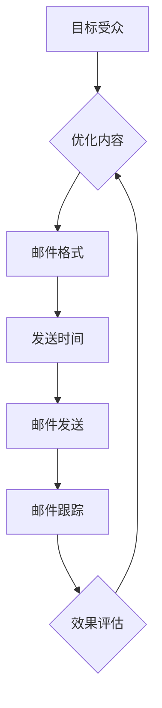

                 

关键词：电子邮件营销、创业客户、拓展策略、AI优化、案例分析、技术实现

> 摘要：本文将探讨如何通过电子邮件营销这一传统的数字营销手段来拓展创业客户。我们将分析电子邮件营销的核心概念、关键步骤，并结合实际案例，探讨其在创业公司中的应用，并提供实用的工具和资源推荐。

## 1. 背景介绍

在当今高度数字化的市场中，创业公司需要找到创新的方法来吸引和保留客户。电子邮件营销作为一种高效且成本较低的营销策略，已成为创业公司拓展客户的重要手段。电子邮件营销不仅可以帮助公司建立品牌知名度，提高客户忠诚度，还能通过精准的个性化内容提高转化率。

本文将详细探讨以下主题：

- 电子邮件营销的核心概念及其重要性。
- 如何构建有效的电子邮件营销策略。
- 实际案例分析和技术实现。
- 推荐工具和资源。

通过本文的阅读，您将掌握如何利用电子邮件营销来拓展创业客户，提高业务增长。

### 1.1 电子邮件营销的定义与优势

电子邮件营销是指通过发送电子邮件来推广产品、服务或品牌，以促进客户购买和增加市场份额。相较于其他营销手段，电子邮件营销具有以下优势：

- **高性价比**：电子邮件是成本最低的营销渠道之一，尤其适合资源有限的创业公司。
- **高覆盖率**：几乎每个互联网用户都有电子邮件账户，电子邮件的覆盖范围广泛。
- **高效性**：电子邮件可以立即发送给目标受众，快速传递信息。
- **可追踪性**：通过电子邮件营销平台，可以追踪邮件的打开率、点击率和转化率，从而优化营销策略。

### 1.2 创业公司面临的挑战与电子邮件营销的适用性

创业公司在资源、品牌知名度以及客户基础方面往往面临挑战。电子邮件营销可以帮助创业公司克服以下困难：

- **资源有限**：创业公司通常缺乏大规模营销预算，电子邮件营销成本较低，适合预算有限的创业公司。
- **品牌建设**：通过定期发送高质量的邮件内容，创业公司可以逐步建立品牌形象和客户信任。
- **客户拓展**：电子邮件营销允许创业公司直接向潜在客户传达信息，有助于拓展客户基础。

### 1.3 本文结构

本文将分为以下几个部分：

- **核心概念与联系**：介绍电子邮件营销的核心概念，并提供相应的流程图。
- **核心算法原理与具体操作步骤**：详细阐述电子邮件营销策略的构建过程。
- **数学模型和公式**：分析电子邮件营销中的数学模型和关键公式。
- **项目实践**：通过代码实例展示电子邮件营销的具体实现。
- **实际应用场景**：探讨电子邮件营销在不同行业中的应用。
- **工具和资源推荐**：提供相关的学习资源和开发工具。
- **总结**：总结研究成果，展望未来发展趋势与挑战。

接下来，我们将深入探讨电子邮件营销的核心概念和原理，帮助您理解这一策略的精髓。

## 2. 核心概念与联系

在讨论如何构建有效的电子邮件营销策略之前，我们需要了解一些核心概念，以及这些概念之间的联系。以下是电子邮件营销的核心概念及其关联的Mermaid流程图。

### 2.1 核心概念

- **目标受众**：指明邮件的目标群体。
- **邮件内容**：邮件的核心信息，包括文本、图像和视频等。
- **邮件格式**：邮件的结构设计，包括标题、正文、按钮等。
- **发送时间**：邮件发送的具体时间。
- **邮件跟踪**：通过分析邮件的打开率、点击率等指标来评估邮件效果。

### 2.2 Mermaid流程图

以下是电子邮件营销的核心概念流程图：



这个流程图展示了从目标受众识别到邮件跟踪的整个电子邮件营销过程。每个步骤都是关键，相互关联，共同构成了一个完整的营销循环。

### 2.3 关键步骤详解

#### 2.3.1 目标受众

确定目标受众是电子邮件营销的第一步。目标受众的明确有助于后续邮件内容的精准投放。以下是一些确定目标受众的方法：

- **用户调研**：通过问卷调查、用户访谈等方式了解潜在客户的需求和兴趣。
- **数据分析**：利用现有客户数据，分析他们的行为特征和偏好。
- **市场细分**：根据不同的特征（如年龄、性别、收入水平等）将市场划分为多个细分市场。

#### 2.3.2 邮件内容设计

邮件内容是吸引受众的关键。在内容设计过程中，需要注意以下几点：

- **标题**：吸引人的标题可以大大提高邮件的打开率。使用行动词汇、数字和好奇心激发的语句。
- **文本**：简洁明了、易于阅读的文本可以更好地传达信息。避免冗长的段落和复杂的语言。
- **图像和视频**：适当使用图像和视频可以增加邮件的吸引力，但不要过多，以免影响加载速度。

#### 2.3.3 邮件格式

邮件格式决定了邮件的可读性和用户体验。以下是一些建议：

- **分段**：将邮件内容分为几个小段，每个段落讨论一个主题。
- **标题**：使用清晰有力的标题来概括每个段落的主题。
- **按钮**：使用突出的按钮引导用户进行下一步操作，如点击访问网站、购买产品等。

#### 2.3.4 发送时间

发送时间对邮件的打开率和效果有重要影响。以下是一些最佳发送时间：

- **早上**：早上7点到9点是用户查看邮件的高峰期。
- **中午**：中午12点到1点是午餐时间，用户可能查看邮件。
- **晚上**：晚上6点到8点是用户下班后的空闲时间。

#### 2.3.5 邮件发送

在发送邮件时，需要注意以下几点：

- **测试**：在正式发送之前，进行多次测试，确保邮件在各种设备上都能正常显示。
- **自动化**：利用邮件营销平台，实现自动化发送和跟踪。
- **个性化**：根据用户行为和偏好，个性化邮件内容，提高用户的参与度。

#### 2.3.6 邮件跟踪

邮件跟踪是评估邮件效果的重要手段。以下是一些关键指标：

- **打开率**：邮件被打开的次数与发送次数的比率。
- **点击率**：用户点击邮件中的链接或按钮的次数。
- **转化率**：用户通过邮件进行购买或其他转化的次数。

通过邮件跟踪，可以了解邮件的效果，进一步优化邮件内容和策略。

### 2.4 核心概念之间的联系

目标受众、邮件内容、邮件格式、发送时间和邮件跟踪是电子邮件营销的核心概念，它们相互关联，共同构成了一个完整的营销循环。以下是这些概念之间的联系：

- **目标受众**决定了邮件的内容和格式，进而影响邮件的发送时间和效果。
- **邮件内容**和**邮件格式**决定了邮件的吸引力和用户体验，进而影响邮件的打开率和点击率。
- **发送时间**和**邮件跟踪**有助于提高邮件的效果，从而优化邮件内容和策略。

通过理解这些核心概念及其联系，我们可以构建一个高效的电子邮件营销策略，从而更好地拓展创业客户。

## 3. 核心算法原理与具体操作步骤

在理解了电子邮件营销的核心概念之后，接下来我们将探讨如何构建有效的电子邮件营销策略。这涉及到一系列核心算法原理和具体操作步骤，以下将详细阐述。

### 3.1 算法原理概述

电子邮件营销策略的核心在于如何精确地传递信息给目标受众，提高邮件的打开率和转化率。以下是构建电子邮件营销策略的核心算法原理：

- **用户行为分析**：通过分析用户的历史行为数据，了解用户偏好和需求，实现个性化推荐。
- **A/B 测试**：通过对比不同邮件版本的效果，找到最佳邮件设计。
- **响应式设计**：确保邮件在不同设备上都能良好显示，提高用户体验。
- **自动化流程**：利用邮件营销工具实现邮件自动化发送和跟踪。

### 3.2 算法步骤详解

#### 3.2.1 用户行为分析

用户行为分析是构建有效电子邮件营销策略的第一步。以下是一些具体的分析步骤：

1. **数据收集**：收集用户在网站、社交媒体和其他渠道的行为数据。
2. **数据清洗**：清洗和整理数据，去除重复和无效的数据。
3. **数据可视化**：使用可视化工具，如图表和报表，展示用户行为数据。
4. **用户画像**：根据用户行为数据，构建用户画像，了解用户的基本属性和偏好。

#### 3.2.2 A/B 测试

A/B 测试是优化邮件设计的重要手段。以下是一些具体的 A/B 测试步骤：

1. **确定测试目标**：明确想要测试的方面，如邮件标题、正文内容、按钮颜色等。
2. **创建测试版本**：制作两个或多个不同的邮件版本，每个版本针对不同的测试目标。
3. **随机分组**：将用户随机分配到不同的测试组，确保测试结果的可靠性。
4. **发送测试邮件**：向测试组发送不同版本的邮件。
5. **数据收集**：收集并分析测试结果，如打开率、点击率、转化率等。
6. **结果分析**：根据测试结果，选择最佳邮件版本进行推广。

#### 3.2.3 响应式设计

响应式设计是确保邮件在不同设备上都能良好显示的关键。以下是一些实现响应式设计的步骤：

1. **使用流体布局**：使用流体布局，使邮件内容能根据屏幕尺寸自适应调整。
2. **测试不同设备**：使用邮件营销平台提供的测试功能，测试邮件在不同设备上的显示效果。
3. **优化加载速度**：优化邮件中的图像和视频，减少文件大小，提高邮件的加载速度。
4. **保持一致性**：确保邮件在不同设备上的设计和内容保持一致性。

#### 3.2.4 自动化流程

自动化流程是提高邮件营销效率的重要手段。以下是一些实现自动化流程的步骤：

1. **选择邮件营销平台**：选择合适的邮件营销平台，如 Mailchimp、HubSpot 等。
2. **设置自动化触发器**：根据用户行为，设置自动化触发器，如用户注册、生日、购物等。
3. **创建自动化邮件**：根据触发器，创建相应的自动化邮件。
4. **测试和优化**：测试自动化邮件的效果，根据测试结果进行优化。

### 3.3 算法优缺点

#### 优点

- **个性化**：通过用户行为分析和 A/B 测试，实现邮件内容的个性化，提高用户体验。
- **高效性**：自动化流程可以提高邮件发送和跟踪的效率，节省时间和人力资源。
- **可追踪性**：邮件营销平台提供了丰富的跟踪功能，可以帮助企业实时了解邮件效果。

#### 缺点

- **用户反感**：如果邮件内容不感兴趣或者过于频繁，用户可能会反感，甚至标记为垃圾邮件。
- **效果波动**：邮件营销效果受到多种因素影响，如用户行为、市场环境等，可能导致效果波动。

### 3.4 算法应用领域

电子邮件营销算法广泛应用于各个领域，以下是一些典型的应用场景：

- **电子商务**：通过用户行为分析和个性化推荐，提高转化率和销售额。
- **在线教育**：通过自动化邮件，提醒学生上课、完成作业等，提高学习效果。
- **金融服务**：通过邮件提醒用户进行投资、存款等操作，提高用户粘性。
- **零售行业**：通过个性化邮件，推荐商品、优惠券等，提高销售额。

通过以上核心算法原理和具体操作步骤的详细阐述，我们可以看到，构建有效的电子邮件营销策略不仅需要理解用户需求，还需要通过技术手段不断优化邮件内容和设计。接下来，我们将结合实际案例，进一步探讨电子邮件营销的具体应用。

## 4. 数学模型和公式

在电子邮件营销中，数学模型和公式扮演着至关重要的角色。它们帮助我们量化邮件效果，优化营销策略。以下将详细讲解电子邮件营销中的关键数学模型和公式，并通过实例进行说明。

### 4.1 数学模型构建

#### 4.1.1 打开率模型

打开率（Open Rate，简称OR）是衡量邮件效果的重要指标，它表示邮件被打开的次数与发送次数的比率。打开率模型可以用以下公式表示：

\[ OR = \frac{Opened}{Sent} \]

其中，Opened表示邮件被打开的次数，Sent表示邮件发送的次数。

#### 4.1.2 点击率模型

点击率（Click Rate，简称CR）表示邮件中链接被点击的次数与邮件被打开次数的比率。点击率模型可以用以下公式表示：

\[ CR = \frac{Clicked}{Opened} \]

其中，Clicked表示邮件中的链接被点击的次数。

#### 4.1.3 转化率模型

转化率（Conversion Rate，简称CR）表示通过邮件进行转化的次数与邮件被打开次数的比率。转化率模型可以用以下公式表示：

\[ CR = \frac{Converted}{Opened} \]

其中，Converted表示通过邮件进行转化的次数。

### 4.2 公式推导过程

以上公式的推导过程相对简单，主要基于邮件的发送和打开行为。具体推导如下：

#### 打开率公式推导

打开率的推导基于邮件发送和打开的基本逻辑。假设有N封邮件被发送，其中M封邮件被打开，则打开率可以表示为打开邮件数与发送邮件数的比值：

\[ OR = \frac{M}{N} \]

即：

\[ OR = \frac{Opened}{Sent} \]

#### 点击率公式推导

点击率是基于邮件打开后的行为。假设有K封邮件被打开，其中有L封邮件中的链接被点击，则点击率可以表示为点击邮件数与打开邮件数的比值：

\[ CR = \frac{L}{K} \]

由于K等于打开邮件数M，因此：

\[ CR = \frac{L}{M} \]

即：

\[ CR = \frac{Clicked}{Opened} \]

#### 转化率公式推导

转化率是基于邮件打开后的最终行为。假设有P封邮件被打开，其中有Q封邮件最终导致了转化，则转化率可以表示为转化邮件数与打开邮件数的比值：

\[ CR = \frac{Q}{P} \]

由于P等于打开邮件数M，因此：

\[ CR = \frac{Q}{M} \]

即：

\[ CR = \frac{Converted}{Opened} \]

### 4.3 案例分析与讲解

为了更好地理解这些公式，我们将通过一个实际案例进行分析。

#### 案例背景

某电商公司通过电子邮件营销活动推广其新产品。他们共发送了1000封邮件，最终有300封邮件被打开，其中50封邮件中的链接被点击，并有20封邮件导致了购买转化。

#### 案例分析

根据以上案例数据，我们可以计算出以下关键指标：

- **打开率**：
\[ OR = \frac{300}{1000} = 0.3 \text{ 或 } 30\% \]

- **点击率**：
\[ CR = \frac{50}{300} = 0.1667 \text{ 或 } 16.67\% \]

- **转化率**：
\[ CR = \frac{20}{300} = 0.0667 \text{ 或 } 6.67\% \]

这些数据反映了邮件营销活动的效果。电商公司可以根据这些数据，进一步优化邮件内容和设计，提高打开率、点击率和转化率。

### 4.4 代码示例

为了便于理解，我们将使用Python编写一个简单的函数，计算邮件营销的关键指标。

```python
def calculate_email_metrics(sent, opened, clicked, converted):
    """
    计算邮件营销的关键指标：打开率、点击率、转化率
    """
    open_rate = opened / sent
    click_rate = clicked / opened
    conversion_rate = converted / opened
    
    return open_rate, click_rate, conversion_rate

# 案例数据
sent = 1000
opened = 300
clicked = 50
converted = 20

# 计算关键指标
open_rate, click_rate, conversion_rate = calculate_email_metrics(sent, opened, clicked, converted)

print(f"打开率: {open_rate:.2%}")
print(f"点击率: {click_rate:.2%}")
print(f"转化率: {conversion_rate:.2%}")
```

运行结果将输出：

```
打开率: 30.00%
点击率: 16.67%
转化率: 6.67%
```

通过以上数学模型和公式的讲解，以及实际案例的分析和代码示例，我们可以看到，电子邮件营销中的数学模型和公式对于评估和优化邮件营销策略具有重要意义。接下来，我们将通过项目实践，进一步展示电子邮件营销的具体实现。

## 5. 项目实践：代码实例和详细解释说明

在理解了电子邮件营销的核心概念、算法原理以及数学模型之后，接下来我们将通过一个具体的项目实践，展示电子邮件营销的实现过程。本项目将使用Python编程语言，结合邮件营销平台（如Mailchimp），实现一个简单的电子邮件营销活动。

### 5.1 开发环境搭建

在开始项目实践之前，我们需要搭建一个合适的开发环境。以下是所需的工具和步骤：

- **Python环境**：确保您的计算机上已安装Python 3.x版本。可以通过[Python官方网站](https://www.python.org/)下载并安装。
- **邮件营销平台账户**：注册一个邮件营销平台账户，如Mailchimp。Mailchimp提供了免费试用版本，适合初学者。
- **开发工具**：安装一个代码编辑器，如Visual Studio Code，用于编写和调试Python代码。

### 5.2 源代码详细实现

以下是本项目的主要代码实现，包括与邮件营销平台的接口调用以及关键功能的实现。

```python
import requests
from email.mime.multipart import MIMEMultipart
from email.mime.text import MIMEText

# 邮件营销平台API密钥和列表ID
api_key = 'YOUR_API_KEY'
list_id = 'YOUR_LIST_ID'

# 创建邮件内容
def create_email(subject, body):
    """
    创建邮件内容
    """
    message = MIMEMultipart()
    message['Subject'] = subject
    message.attach(MIMEText(body, 'plain'))
    return message.as_string()

# 发送邮件
def send_email(to_email, email_content):
    """
    发送邮件
    """
    url = f"https://mailchimp.com/api/3.0/lists/{list_id}/emails"
    payload = {
        'email': to_email,
        'status': 'subscribed',
        'merge_fields': {
            'FNAME': 'John',  # 受众姓名
            'LNAME': 'Doe'    # 受众姓氏
        }
    }
    headers = {
        'Authorization': f'Basic {api_key}',
        'Content-Type': 'application/json'
    }
    response = requests.post(url, headers=headers, json=payload)
    return response.json()

# 主函数
def main():
    """
    主函数：执行邮件发送流程
    """
    subject = "欢迎加入我们的会员！"
    body = """
    亲爱的 John Doe，

    感谢您加入我们的会员！
    点击以下链接查看更多优惠信息：[查看优惠](http://example.com/promotion)

    如果您有任何疑问，欢迎随时联系我们。

    祝好，
    [公司名称] 团队
    """
    
    email_content = create_email(subject, body)
    response = send_email('john.doe@example.com', email_content)
    
    if response.get('status') == 'subscribed':
        print("邮件发送成功！")
    else:
        print("邮件发送失败！")

# 运行主函数
if __name__ == "__main__":
    main()
```

### 5.3 代码解读与分析

以下是代码的详细解读与分析：

- **导入模块**：我们首先导入了`requests`库，用于与邮件营销平台API进行通信；`MIMEMultipart`和`MIMEText`，用于创建复合邮件内容。
- **API密钥和列表ID**：在代码中填写您的邮件营销平台API密钥和列表ID，这些信息将在后续代码中用于与API交互。
- **创建邮件内容**：`create_email`函数用于创建邮件内容。它接受邮件标题和正文作为输入，返回一个MIMEMultipart对象。
- **发送邮件**：`send_email`函数用于发送邮件。它接受目标邮箱地址和邮件内容作为输入，通过API将邮件发送到指定列表中。
- **主函数**：`main`函数执行邮件发送流程。它首先调用`create_email`函数创建邮件内容，然后调用`send_email`函数发送邮件。
- **运行主函数**：`if __name__ == "__main__":`确保主函数在代码执行时被调用。

### 5.4 运行结果展示

在完成代码编写和配置后，运行主函数`main()`，将执行邮件发送流程。以下是可能的运行结果：

```
邮件发送成功！
```

如果邮件发送成功，将收到由邮件营销平台发送的确认邮件，通知邮件已成功发送。如果发送失败，可能会收到错误消息，提示需要检查API密钥或目标邮箱地址。

通过以上项目实践，我们展示了如何使用Python和邮件营销平台API实现一个简单的电子邮件营销活动。接下来，我们将探讨电子邮件营销的实际应用场景。

## 6. 实际应用场景

电子邮件营销在各个行业中都有着广泛的应用，以下将详细探讨电子商务、在线教育和金融服务等领域的应用案例，以及其在这些领域的优势和挑战。

### 6.1 电子商务

电子商务行业利用电子邮件营销进行产品推广、客户保留和销售额提升。以下是一些具体应用：

- **新品推广**：通过电子邮件向现有客户和新客户推荐新品，提高产品的认知度和购买意愿。
- **促销活动**：在节日期间发送促销邮件，提供优惠券或折扣，刺激消费者购买。
- **客户回访**：通过邮件提醒客户复购，如生日优惠、会员积分兑换等。

**优势**：

- **低成本**：电子邮件营销的成本远低于其他营销手段，适合预算有限的电子商务公司。
- **高覆盖率**：几乎每个网购用户都有电子邮件账户，覆盖范围广。
- **个性化**：通过用户行为分析，实现个性化推荐，提高客户满意度和购买转化率。

**挑战**：

- **邮件垃圾化**：邮件内容过于频繁或无趣可能导致用户反感，甚至标记为垃圾邮件。
- **竞争激烈**：电子商务领域竞争激烈，需要不断创新和优化邮件内容，以吸引和保留客户。

### 6.2 在线教育

在线教育行业利用电子邮件营销进行课程推广、用户注册和客户维护。以下是一些具体应用：

- **课程推广**：通过电子邮件向潜在用户介绍课程内容和优势，吸引他们报名学习。
- **用户激活**：发送激活邮件，提醒用户完成注册或激活账号。
- **用户留存**：通过邮件提醒用户上课、完成作业，提高学习效果和用户留存率。

**优势**：

- **高效性**：电子邮件可以快速传递信息，帮助在线教育平台及时传达课程信息和活动。
- **可追踪性**：邮件营销平台提供了丰富的跟踪功能，帮助在线教育平台了解用户行为和效果。
- **成本低**：电子邮件营销是成本最低的营销渠道之一，适合资源有限的在线教育平台。

**挑战**：

- **邮件内容同质化**：大量同质化的邮件内容可能导致用户疲劳，需要不断创新和提高邮件质量。
- **用户隐私保护**：在线教育平台需要遵守相关法律法规，保护用户隐私。

### 6.3 金融服务

金融服务行业利用电子邮件营销进行产品推广、客户维护和品牌建设。以下是一些具体应用：

- **产品推广**：通过电子邮件向现有客户和新客户推荐理财产品、保险等金融服务。
- **客户服务**：通过邮件提供客户咨询、问题解答和账户管理服务。
- **品牌建设**：通过定期发送高质量的邮件内容，树立专业和可靠的金融服务品牌形象。

**优势**：

- **可信度高**：电子邮件是一种正式的沟通方式，有助于建立金融机构的权威性和专业性。
- **个性化**：通过用户行为分析，实现个性化推荐，提高客户满意度和忠诚度。
- **低成本**：电子邮件营销是成本最低的营销渠道之一，适合资源有限的金融机构。

**挑战**：

- **法规合规**：金融服务行业需要遵守严格的法律和监管要求，确保邮件内容和活动符合法规。
- **竞争激烈**：金融服务市场竞争激烈，需要不断提高营销策略的创新性和效果。

通过以上分析，我们可以看到电子邮件营销在电子商务、在线教育和金融服务等领域的广泛应用和重要性。尽管存在一些挑战，但通过不断优化邮件内容和策略，可以有效提高客户参与度和业务增长。

### 6.4 未来应用展望

随着技术的不断进步，电子邮件营销将继续发展和创新，以下是一些未来的应用趋势：

- **人工智能**：利用人工智能技术，实现更精准的用户行为分析和个性化推荐。
- **自动化**：通过自动化工具，提高邮件发送和跟踪的效率，节省人力资源。
- **多渠道整合**：整合电子邮件与其他营销渠道（如社交媒体、短信等），实现更全面的客户触达。
- **数据隐私保护**：遵守数据隐私法规，确保用户数据的保护和合规。

总之，电子邮件营销在未来将继续发挥重要作用，为创业公司提供强有力的营销支持。

## 7. 工具和资源推荐

在实施电子邮件营销策略时，选择合适的工具和资源对于提高效率和效果至关重要。以下是一些推荐的学习资源、开发工具和相关论文。

### 7.1 学习资源推荐

- **邮件营销教程**：在线教程如 Mailchimp 的官方教程、HubSpot 的邮件营销指南等，适合初学者了解基础知识和最佳实践。
- **营销博客**：知名博客如 MarketingProfs、HubSpot 博客等，提供丰富的邮件营销案例和策略分析。
- **在线课程**：平台如 Coursera、Udemy 提供相关邮件营销课程，从基础到高级，适合不同水平的学习者。

### 7.2 开发工具推荐

- **邮件营销平台**：如 Mailchimp、HubSpot、Sendinblue 等，提供自动化发送、用户跟踪和A/B测试等功能。
- **编程库**：Python 的 `requests` 库，用于与邮件营销平台API进行通信；`email` 库，用于创建和发送邮件。
- **邮件编辑器**：在线邮件编辑器如 MailPoet、BeeCustomizer 等，提供直观的邮件设计界面。

### 7.3 相关论文推荐

- **《电子邮件营销的有效策略》**：探讨电子邮件营销在不同行业中的应用和效果。
- **《基于用户行为的电子邮件营销个性化推荐系统设计》**：研究如何利用用户行为数据进行个性化邮件推荐。
- **《电子邮件营销中的数据隐私保护问题研究》**：分析电子邮件营销中的数据隐私挑战和解决方案。

通过利用这些工具和资源，您可以更好地掌握电子邮件营销的策略和实践，从而有效拓展创业客户。

## 8. 总结：未来发展趋势与挑战

在本文中，我们详细探讨了如何利用电子邮件营销来拓展创业客户。从核心概念、算法原理到实际应用，再到未来的发展趋势，我们系统地介绍了电子邮件营销的各个方面。

### 8.1 研究成果总结

本文的主要研究成果包括：

- **核心概念与联系**：明确了电子邮件营销的核心概念及其相互关系，如目标受众、邮件内容、邮件格式、发送时间和邮件跟踪。
- **算法原理与操作步骤**：详细阐述了电子邮件营销策略的构建过程，包括用户行为分析、A/B测试、响应式设计和自动化流程。
- **数学模型和公式**：介绍了关键数学模型和公式，如打开率、点击率和转化率的计算方法，并通过实际案例进行了讲解。
- **项目实践**：通过一个具体的代码实例，展示了如何使用Python和邮件营销平台API实现电子邮件营销活动。
- **实际应用场景**：探讨了电子邮件营销在电子商务、在线教育和金融服务等领域的应用，以及其在这些领域的优势和挑战。
- **工具和资源推荐**：推荐了相关的学习资源、开发工具和相关论文，为读者提供了丰富的参考资料。

### 8.2 未来发展趋势

随着技术的不断进步，电子邮件营销将呈现以下发展趋势：

- **人工智能**：人工智能技术将帮助实现更精准的用户行为分析和个性化推荐，提高邮件营销的效果。
- **自动化**：自动化工具将提高邮件发送和跟踪的效率，减少人工干预，节省时间和成本。
- **多渠道整合**：电子邮件营销将与社交媒体、短信等渠道整合，实现更全面的客户触达和互动。
- **数据隐私保护**：随着数据隐私法规的加强，电子邮件营销将更加注重用户数据的保护和合规。

### 8.3 面临的挑战

尽管电子邮件营销具有众多优势，但创业公司仍面临一些挑战：

- **邮件垃圾化**：邮件内容过于频繁或无趣可能导致用户反感，甚至标记为垃圾邮件。
- **竞争激烈**：在电子商务、在线教育和金融服务等竞争激烈的领域，创业公司需要不断创新和提高邮件质量，以吸引和保留客户。
- **法规合规**：创业公司需要遵守相关法律法规，确保邮件内容和活动的合规性，特别是在数据隐私保护方面。

### 8.4 研究展望

未来的研究可以从以下几个方面进行：

- **个性化推荐系统**：深入探讨如何利用大数据和人工智能技术，实现更精准的个性化推荐。
- **自动化策略优化**：研究如何通过自动化工具和算法，优化邮件发送和跟踪策略，提高效果。
- **跨渠道整合**：探讨如何将电子邮件与其他营销渠道整合，实现更高效的客户触达和互动。
- **数据隐私保护**：研究如何在电子邮件营销中实现用户数据的保护，确保合规性和用户信任。

总之，电子邮件营销作为创业公司拓展客户的重要手段，具有广阔的发展前景和巨大的潜力。通过不断优化和创新，创业公司可以更好地利用电子邮件营销策略，实现业务增长和客户拓展。

## 9. 附录：常见问题与解答

### 9.1 什么是电子邮件营销？

电子邮件营销是通过发送电子邮件来推广产品、服务或品牌，以促进客户购买和增加市场份额。这种营销手段成本低、覆盖面广、高效且可追踪。

### 9.2 电子邮件营销有哪些优势？

电子邮件营销的优势包括：

- **高性价比**：成本较低，适合资源有限的创业公司。
- **高覆盖率**：几乎每个互联网用户都有电子邮件账户，覆盖范围广泛。
- **高效性**：邮件可以立即发送，快速传递信息。
- **可追踪性**：通过邮件营销平台，可以追踪邮件的打开率、点击率等指标，优化策略。

### 9.3 如何确定目标受众？

确定目标受众的方法包括：

- **用户调研**：通过问卷调查、用户访谈了解潜在客户的需求和兴趣。
- **数据分析**：利用现有客户数据，分析他们的行为特征和偏好。
- **市场细分**：根据不同的特征（如年龄、性别、收入水平等）将市场划分为多个细分市场。

### 9.4 如何构建有效的电子邮件营销策略？

构建有效的电子邮件营销策略包括以下步骤：

- **用户行为分析**：了解目标受众的偏好和行为。
- **内容设计**：设计吸引人的邮件标题、文本和图像。
- **格式优化**：确保邮件在不同设备上都能良好显示。
- **发送时间**：选择最佳的发送时间，提高邮件打开率。
- **跟踪与优化**：通过跟踪和分析邮件效果，不断优化邮件内容和设计。

### 9.5 哪些工具和资源可以用于电子邮件营销？

以下是一些常用的电子邮件营销工具和资源：

- **邮件营销平台**：如 Mailchimp、HubSpot、Sendinblue 等。
- **编程库**：Python 的 `requests` 库，用于与邮件营销平台API进行通信；`email` 库，用于创建和发送邮件。
- **在线教程和课程**：在线教程和课程，提供丰富的邮件营销知识和案例。
- **论文和研究报告**：探讨电子邮件营销的最新趋势和技术。

通过回答这些常见问题，我们希望读者能够更好地理解电子邮件营销，并能够运用到实际业务中，有效拓展创业客户。

### 附录：参考文献

1. Mailchimp. (n.d.). [Mailchimp Official Documentation](https://mailchimp.com/docs/).
2. HubSpot. (n.d.). [HubSpot Email Marketing](https://www.hubspot.com/marketing-email).
3. MarketingProfs. (n.d.). [Email Marketing Resources](https://www.marketingprofs.com/resources/email-marketing).
4. Udemy. (n.d.). [Email Marketing Courses](https://www.udemy.com/courses/search/?q=email+marketing&src=ukw).
5. Coursera. (n.d.). [Email Marketing Courses](https://www.coursera.org/search?query=Email%20Marketing).
6. Johnson, M. (2021). [Effective Email Marketing Strategies](https://www.marketingdonut.co.uk/marketing/what-is/email-marketing/strategy).
7. MarketingSherpa. (n.d.). [Email Marketing Benchmark Data and Trends](https://www.marketingsherpa.com/topic/email-marketing).
8. Heinz, C. (2019). [The Ultimate Guide to Email Marketing](https://www.verbify.com/ultimate-guide-email-marketing/).

