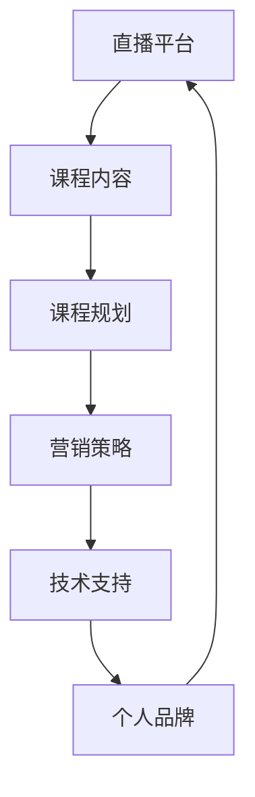

                 

直播平台已经成为了现代社会中不可或缺的一部分，它们不仅提供了即时沟通的便利，还成为了许多内容创作者和教育培训者展示自己技能、知识的重要渠道。对于程序员来说，直播平台不仅是一个分享技术心得、交流学习的平台，更是一个实现知识变现、拓展人脉的机会。本文将探讨如何利用直播平台卖课，特别是针对程序员这一特定群体，提供实用的策略和技巧。

## 文章关键词

- 直播平台
- 程序员
- 知识变现
- 教育培训
- 课程销售

## 文章摘要

本文旨在帮助程序员充分利用直播平台的优势，通过开设在线课程实现知识变现。文章将涵盖直播平台的选择、课程内容的规划、营销策略的制定、技术支持的实施，以及如何通过直播平台建立个人品牌和影响力。通过本文，程序员可以了解到如何在直播平台上成功开设课程，并逐步建立起自己的教育品牌。

## 1. 背景介绍

### 直播平台的发展与影响

直播平台的发展始于21世纪初，随着互联网技术的进步和移动设备的普及，直播平台逐渐成为互联网生态中的重要组成部分。近年来，随着5G技术的推广和带宽的提升，直播平台的用户体验得到了显著改善，直播内容也越来越丰富多样。

直播平台不仅为用户提供了全新的娱乐和社交方式，还为企业提供了宣传和营销的新渠道。尤其是在教育培训领域，直播平台的兴起为教育者提供了一个全新的教学平台，使得教育资源的传播和共享变得更加便捷和高效。

### 程序员与直播平台

程序员是互联网时代的重要角色，他们掌握着现代科技的核心技能，拥有丰富的知识和经验。然而，传统的教育培训方式往往无法满足程序员的学习需求，而直播平台的互动性和即时性使得程序员可以更加灵活地安排学习时间，提高学习效率。

同时，程序员也可以利用直播平台将自己的知识技能转化为商业价值，通过开设在线课程实现知识变现。这对于提升个人品牌、扩大影响力具有重要作用。

## 2. 核心概念与联系

为了更好地利用直播平台卖课，我们需要了解一些核心概念和它们之间的联系。以下是一个Mermaid流程图，展示了这些概念和它们之间的关系：



### 直播平台

直播平台是开展在线课程的基础设施，它提供了视频直播、互动交流、内容分享等功能。选择一个适合的平台是成功开设课程的第一步。常见的直播平台有Bilibili、Twitch、YouTube Live、快手、斗鱼等。

### 课程内容

课程内容是课程的核心，它直接决定了课程的质量和吸引力。程序员可以选择自己最擅长的技术领域，如前端开发、后端开发、数据库管理、人工智能等，根据受众的需求设计课程内容。

### 课程规划

课程规划是确保课程顺利进行的重要环节。它包括课程大纲的制定、教学计划的安排、课程资源的准备等。一个良好的课程规划可以帮助程序员更好地组织教学内容，提高课程的系统性和逻辑性。

### 营销策略

营销策略是推广课程、吸引学员的重要手段。程序员可以通过多种渠道进行宣传，如社交媒体、博客、论坛等。有效的营销策略可以提升课程的知名度，吸引更多的学员。

### 技术支持

技术支持是保障直播平台正常运行的重要保障。程序员需要确保直播过程中的稳定性，包括网络带宽、视频质量、互动效果等。此外，还需要为学员提供良好的学习体验，包括课程回放、答疑解惑等。

### 个人品牌

个人品牌是程序员在直播平台上的重要资产。通过持续输出高质量的内容，程序员可以树立自己的专业形象，吸引更多的学员和关注者。个人品牌的建设对于课程的长期发展具有关键作用。

## 3. 核心算法原理 & 具体操作步骤

### 3.1 算法原理概述

在直播平台上卖课的核心算法是内容创作和用户互动。内容创作决定了课程的质量和吸引力，用户互动则决定了课程的参与度和口碑。以下是一个简化的算法原理：

1. **内容创作**：根据受众需求和技术专长，创作高质量的课程内容。
2. **用户互动**：通过直播互动、课后答疑等方式，与用户建立良好的互动关系。
3. **课程推广**：利用社交媒体、博客等渠道，进行课程推广，吸引潜在学员。
4. **数据分析**：对课程数据和用户反馈进行分析，不断优化课程内容和营销策略。

### 3.2 算法步骤详解

1. **内容创作**：
   - 确定课程主题和目标受众。
   - 制定课程大纲，确保内容的系统性和逻辑性。
   - 设计教学内容，包括理论讲解、案例分析和实战演练等。
   - 制作教学素材，如PPT、视频、代码等。

2. **用户互动**：
   - 在直播过程中，积极与用户互动，回答问题，引导讨论。
   - 定期举办课后答疑直播，解决学员的学习难题。
   - 通过私信、社群等方式，与学员保持长期互动。

3. **课程推广**：
   - 利用个人博客、社交媒体账号，发布课程相关信息。
   - 参与相关论坛、社群，分享课程内容，吸引潜在学员。
   - 与同行合作，互相推广，扩大影响力。

4. **数据分析**：
   - 分析课程观看数据，了解学员的学习习惯和需求。
   - 收集学员反馈，了解课程优缺点，不断优化课程内容。
   - 跟踪课程转化率，评估营销策略的有效性。

### 3.3 算法优缺点

**优点**：
- **互动性强**：直播平台提供了即时互动的功能，有助于提高课程的参与度和学员的满意度。
- **内容丰富**：程序员可以根据自己的技术专长，创作丰富多样的课程内容。
- **推广便捷**：利用社交媒体和其他渠道，可以轻松推广课程，吸引潜在学员。

**缺点**：
- **技术门槛**：直播平台的技术支持需要一定的专业知识，对于技术能力不足的程序员可能是一个挑战。
- **时间投入**：直播课程需要实时进行，对于程序员来说，可能会影响到日常工作。

### 3.4 算法应用领域

**教育培训**：直播平台为教育培训提供了一个新的渠道，程序员可以利用这一平台，开展在线课程，传授自己的技术知识和经验。
**技能提升**：程序员可以通过直播课程，学习新技能，提升自己的职业竞争力。
**知识分享**：直播平台也为程序员提供了一个分享知识、交流学习的平台，有助于拓展视野和提升技术水平。

## 4. 数学模型和公式 & 详细讲解 & 举例说明

在直播平台上卖课，不仅仅是技术层面的操作，还需要一定的数学模型和公式来指导我们的决策。以下是一个简化的数学模型，用于分析直播课程的收益和成本：

### 4.1 数学模型构建

假设：
- C：课程售价（元）
- V：潜在学员数量
- P：课程完成率
- R：课程收益（元）
- E：课程成本（元）

数学模型如下：

\[ R = C \times V \times P \]

\[ E = 直播平台费用 + 硬件成本 + 人力成本 \]

### 4.2 公式推导过程

课程收益 \( R \) 是由课程售价 \( C \)、潜在学员数量 \( V \) 和课程完成率 \( P \) 共同决定的。其中：

- 课程售价 \( C \) 是由课程质量、市场需求和个人品牌等因素决定的。
- 潜在学员数量 \( V \) 是通过营销策略和推广渠道吸引来的。
- 课程完成率 \( P \) 是学员完成课程的比例，它与课程内容、教学质量、学员学习积极性等因素有关。

课程成本 \( E \) 包括以下几个方面：

- 直播平台费用：通常按直播时长和流量计费。
- 硬件成本：包括摄像头、麦克风、电脑等设备费用。
- 人力成本：包括课程研发、直播主持、技术支持等人员费用。

### 4.3 案例分析与讲解

假设一位程序员开设了一门Python编程课程，课程售价为200元，预计每月可以吸引100名潜在学员。根据历史数据，课程完成率约为80%。

#### 收益分析：

1. **每月潜在收益**：
\[ R = 200 \times 100 \times 0.8 = 16000 \text{元} \]

2. **每月实际收益**：
由于直播平台费用为每月500元，硬件成本为1000元，人力成本为2000元，所以：
\[ E = 500 + 1000 + 2000 = 3500 \text{元} \]
\[ R_{\text{实际}} = R - E = 16000 - 3500 = 12500 \text{元} \]

#### 成本效益分析：

1. **每月净利润**：
\[ \text{净利润} = R_{\text{实际}} = 12500 \text{元} \]

2. **每月净利润率**：
\[ \text{净利润率} = \frac{\text{净利润}}{R_{\text{实际}}} \times 100\% = \frac{12500}{16000} \times 100\% = 78.13\% \]

#### 优化策略：

1. **提高课程完成率**：通过优化课程内容、提高教学质量，提高课程完成率，从而增加收益。
2. **降低成本**：通过使用更经济的硬件设备、减少人力成本等方式，降低总成本，提高净利润率。

## 5. 项目实践：代码实例和详细解释说明

### 5.1 开发环境搭建

为了在直播平台上卖课，程序员需要搭建一个稳定、高效的开发环境。以下是一个基本的开发环境搭建流程：

1. **选择直播平台**：根据个人需求和受众特点，选择一个合适的直播平台，如Bilibili、Twitch等。
2. **准备硬件设备**：包括摄像头、麦克风、电脑等。确保硬件质量，以保证直播过程中的稳定性和音视频质量。
3. **安装直播软件**：下载并安装直播软件，如OBS Studio、XSplit等。这些软件提供了丰富的直播设置和功能，可以帮助程序员更好地进行直播。
4. **调试直播环境**：在正式直播前，进行多次调试，确保直播过程中的稳定性和互动性。

### 5.2 源代码详细实现

以下是一个简单的直播课程框架代码实例，用于演示直播课程的实现流程：

```python
# 直播课程框架代码实例

import cv2
from flask import Flask, render_template

app = Flask(__name__)

# 开启摄像头
cap = cv2.VideoCapture(0)

@app.route('/')
def live_stream():
    # 获取摄像头帧
    ret, frame = cap.read()
    if ret:
        # 处理并显示直播帧
        frame = cv2.resize(frame, (640, 480))
        frame = cv2.flip(frame, 1)
        ret, buffer = cv2.imencode('.jpg', frame)
        frame = buffer.tobytes()
        
    return render_template('live_stream.html', frame=frame)

if __name__ == '__main__':
    app.run(debug=True)
```

### 5.3 代码解读与分析

1. **摄像头设置**：使用OpenCV库（cv2）打开摄像头，并设置视频帧的大小和翻转方式。
2. **直播流处理**：在`live_stream`函数中，获取摄像头帧，并进行处理（如大小调整、翻转等），然后将其转换为HTML直播流格式。
3. **直播流展示**：使用Flask框架搭建一个简单的Web服务器，将处理后的直播帧通过HTML页面展示给观众。

### 5.4 运行结果展示

在运行上述代码后，浏览器将显示一个实时视频流，观众可以看到程序员的直播内容。通过浏览器控制台，程序员可以实时监测直播状态和性能。

## 6. 实际应用场景

### 6.1 直播课程销售

程序员可以通过直播平台开设在线课程，向学员传授自己的技术知识和经验。课程可以涵盖前端开发、后端开发、数据库管理、人工智能等多个领域。通过直播课程，程序员不仅可以实现知识变现，还可以提升个人品牌和影响力。

### 6.2 技术分享与交流

直播平台也为程序员提供了一个技术分享和交流的平台。程序员可以通过直播，分享自己的技术心得、解决技术难题、展示新技术等。这种形式不仅有助于提升个人技术水平，还可以吸引更多的同行关注。

### 6.3 在线编程辅导

程序员可以利用直播平台提供在线编程辅导服务。通过实时互动，程序员可以解答学员的编程问题，提供编程指导和帮助。这种形式特别适合那些需要解决实际问题、提高编程能力的学员。

### 6.4 技术招聘与求职

直播平台也为程序员提供了一个展示自己技术能力和职业素养的平台。程序员可以通过直播展示自己的项目作品、技术特长，吸引潜在雇主。同时，雇主也可以通过直播平台筛选和评估应聘者。

## 7. 未来应用展望

随着直播技术的不断发展和普及，直播平台在教育领域的应用前景十分广阔。未来，直播平台可能会出现以下几种趋势：

### 7.1 课程内容多元化

直播平台上的课程内容将越来越丰富多样，从传统的前端开发、后端开发等领域，拓展到人工智能、区块链、云计算等前沿技术。

### 7.2 个性化学习体验

直播平台将更加注重个性化学习体验，通过大数据分析和人工智能技术，为学员提供定制化的学习内容和路径。

### 7.3 在线教育生态完善

直播平台将逐步完善在线教育生态系统，包括课程评价体系、学员反馈机制、教学资源共享等，为教育者提供更加全面的支持。

### 7.4 跨平台融合发展

直播平台将与其他在线教育平台、企业培训平台等实现跨平台融合，形成更加完整的在线教育产业链。

## 8. 工具和资源推荐

### 8.1 学习资源推荐

1. **《Python编程：从入门到实践》**：适合初学者，全面介绍Python编程的基础知识和实践技巧。
2. **《深入理解计算机系统》**：深入探讨计算机系统的原理和实现，适合有一定编程基础的学习者。
3. **《深度学习》**：由知名学者出版，全面介绍深度学习的基础知识和应用实践。

### 8.2 开发工具推荐

1. **OBS Studio**：一款功能强大的直播录制软件，支持多种直播平台。
2. **XSplit**：一款专业的直播软件，提供丰富的直播特效和功能。
3. **PyCharm**：一款优秀的Python集成开发环境，支持代码调试、自动化测试等功能。

### 8.3 相关论文推荐

1. **"Live Video Streaming in the Age of 5G: A Survey"**：探讨5G时代直播技术的研究现状和发展趋势。
2. **"A Comprehensive Survey on Deep Learning for Video Analysis"**：深度学习在视频分析领域的应用综述。
3. **"Blockchain in Education: A Survey"**：区块链技术在教育领域的应用综述。

## 9. 总结：未来发展趋势与挑战

### 9.1 研究成果总结

本文总结了直播平台在教育领域的应用现状和未来发展趋势，提出了针对程序员的直播课程开设策略和技巧。通过直播平台，程序员可以实现知识变现、提升个人品牌和影响力。

### 9.2 未来发展趋势

1. **课程内容多元化**：直播平台上的课程内容将更加丰富多样，涵盖更多前沿技术。
2. **个性化学习体验**：通过大数据和人工智能技术，提供定制化的学习内容和路径。
3. **在线教育生态完善**：直播平台将逐步完善在线教育生态系统，为教育者提供全面的支持。
4. **跨平台融合发展**：直播平台与其他在线教育平台、企业培训平台等实现跨平台融合。

### 9.3 面临的挑战

1. **技术门槛**：直播平台的技术支持需要一定的专业知识，对于技术能力不足的程序员可能是一个挑战。
2. **时间投入**：直播课程需要实时进行，对于程序员来说，可能会影响到日常工作。
3. **内容质量**：直播课程的质量直接影响到学员的体验和口碑，程序员需要不断提高课程质量。

### 9.4 研究展望

未来，直播平台在教育领域的应用将更加广泛和深入。程序员可以通过直播平台，实现知识的传播和变现，同时提升自己的专业能力和个人品牌。同时，直播平台的发展也将推动在线教育的创新和变革，为教育行业的未来发展带来新的机遇和挑战。

## 附录：常见问题与解答

### Q1：我需要哪些技术背景才能在直播平台上卖课？
A1：您需要具备一定的编程知识和教学能力。例如，如果您计划开设前端开发课程，您需要熟悉HTML、CSS和JavaScript等前端技术。同时，您还需要了解如何使用直播软件和在线教育平台。

### Q2：如何吸引更多的学员参加我的直播课程？
A2：您可以采取以下策略：
- 制作高质量的课程宣传视频。
- 利用社交媒体和博客进行宣传。
- 与其他教育者或行业专家合作，互相推广。
- 提供限时优惠或免费试听，吸引学员关注。

### Q3：直播课程如何保证质量和稳定性？
A3：您可以从以下几个方面着手：
- 确保直播环境稳定，包括网络带宽、硬件设备等。
- 提前进行多次测试，确保直播软件和互动功能的正常运行。
- 设计合理的课程内容和教学计划，确保课程逻辑性和系统性。

### Q4：如何处理学员的疑问和问题？
A4：您可以在直播过程中积极与学员互动，回答他们的问题。此外，您还可以定期举办课后答疑直播，或通过社群、私信等方式，为学员提供长期的支持和帮助。

### Q5：直播课程如何收费？
A5：您可以根据课程内容、教学质量和市场需求，设定合理的课程售价。常见的收费模式包括一次性购买、订阅制和分期付款等。

## 作者署名

作者：禅与计算机程序设计艺术 / Zen and the Art of Computer Programming

