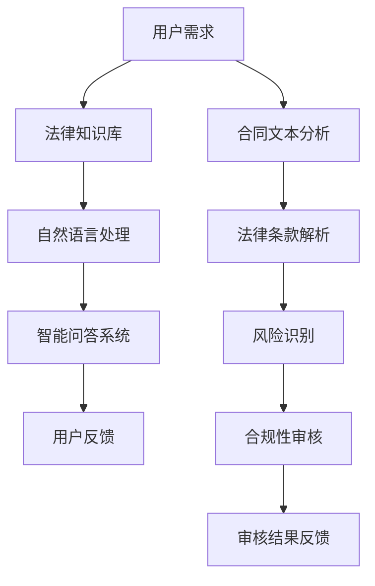

                 

 **关键词**：知识付费、在线法律咨询、合同审核、人工智能、技术架构、深度学习、机器学习、自然语言处理

**摘要**：本文将探讨如何利用知识付费平台实现在线法律咨询与合同审核服务。首先，我们介绍了知识付费的背景和现状，然后详细分析了在线法律咨询和合同审核服务的需求。接下来，我们探讨了利用人工智能和自然语言处理技术实现这些服务的核心算法和数学模型，并通过实际项目案例展示了具体实现过程。最后，我们讨论了在线法律咨询和合同审核服务的实际应用场景，并对未来的发展进行了展望。

## 1. 背景介绍

随着互联网的普及和人们对法律服务的需求不断增加，在线法律咨询和合同审核服务逐渐成为法律服务行业的一个重要趋势。传统的法律服务方式往往存在地域限制、效率低下等问题，而在线法律咨询和合同审核服务则可以突破这些限制，提供更加便捷、高效的服务。

知识付费作为一种新型的商业模式，近年来也得到了广泛关注。知识付费平台通过为用户提供高质量的内容和服务，实现了知识共享和价值变现。在线法律咨询和合同审核服务作为知识付费领域的一个重要细分市场，具有巨大的发展潜力。

### 1.1 在线法律咨询的需求

随着互联网的普及，人们越来越倾向于在线解决法律问题。在线法律咨询可以提供以下优势：

- **便捷性**：用户可以随时随地进行法律咨询，无需到律师事务所或法院现场。
- **低成本**：在线法律咨询可以大大降低用户的经济负担。
- **高效性**：在线法律咨询可以节省时间，提高法律服务的效率。

### 1.2 合同审核服务的需求

合同审核服务是法律服务中的一个重要环节，其需求主要来自以下方面：

- **商业交易**：企业在进行商业交易时，需要对合同进行严格审核，以确保合同的合法性和公平性。
- **风险管理**：合同审核可以帮助企业识别和规避潜在的法律风险。
- **合规性**：合同审核可以帮助企业确保合同内容符合法律法规的要求。

### 1.3 知识付费的背景和现状

知识付费作为一种商业模式，源于人们对高质量内容的需求。随着互联网的普及，人们获取信息的途径越来越多样化，但同时也面临着信息过载的问题。知识付费平台通过筛选和整合优质内容，为用户提供有价值的信息和服务，实现了知识共享和价值变现。

目前，知识付费平台在各个领域都有广泛应用，如教育培训、健康医疗、文化艺术等。在线法律咨询和合同审核服务作为知识付费领域的一个细分市场，也得到了越来越多的关注。

## 2. 核心概念与联系

### 2.1 在线法律咨询与合同审核服务的核心概念

在线法律咨询的核心概念包括：用户需求分析、法律知识库建设、自然语言处理、智能问答系统等。

合同审核服务的核心概念包括：合同文本分析、法律条款解析、风险识别、合规性审核等。

### 2.2 人工智能与自然语言处理技术

人工智能（AI）是当前科技发展的重要方向，其核心任务是使计算机具备人类智能。自然语言处理（NLP）是人工智能的一个重要分支，旨在使计算机能够理解、生成和处理自然语言。

### 2.3 Mermaid 流程图

以下是一个简单的 Mermaid 流程图，展示了在线法律咨询与合同审核服务的核心概念和联系：



## 3. 核心算法原理 & 具体操作步骤

### 3.1 算法原理概述

在线法律咨询与合同审核服务的核心算法主要基于自然语言处理（NLP）和机器学习（ML）技术。NLP技术用于处理和解析法律文本，而ML技术则用于训练和优化智能问答系统。

### 3.2 算法步骤详解

#### 3.2.1 用户需求分析

- **需求收集**：通过用户输入的问题，收集用户的需求。
- **需求解析**：使用NLP技术对用户需求进行分析，提取关键信息。

#### 3.2.2 法律知识库建设

- **数据采集**：收集大量的法律文本，包括法律法规、案例、合同等。
- **文本预处理**：对法律文本进行分词、词性标注、实体识别等预处理操作。
- **知识抽取**：从预处理后的文本中提取法律知识，构建法律知识库。

#### 3.2.3 自然语言处理

- **文本分析**：使用NLP技术对用户输入的问题和合同文本进行分析。
- **意图识别**：识别用户的需求和意图。
- **实体识别**：识别合同文本中的关键实体，如条款、当事人、金额等。

#### 3.2.4 智能问答系统

- **模型训练**：使用机器学习技术，基于法律知识库和用户需求数据，训练智能问答模型。
- **问题回答**：根据用户输入的问题，利用训练好的模型生成回答。

#### 3.2.5 合同审核流程

- **合同文本分析**：使用NLP技术对合同文本进行分析。
- **法律条款解析**：对合同中的法律条款进行解析。
- **风险识别**：识别合同中的潜在风险。
- **合规性审核**：审核合同内容是否符合法律法规的要求。

### 3.3 算法优缺点

- **优点**：在线法律咨询与合同审核服务利用人工智能和NLP技术，可以实现自动化处理，提高效率，降低成本。
- **缺点**：由于法律领域的复杂性和不确定性，智能问答系统的准确性可能受到一定程度的影响。

### 3.4 算法应用领域

- **在线法律咨询**：为用户提供法律咨询服务，包括法律知识普及、案件咨询等。
- **合同审核**：为企业提供合同审核服务，包括合同条款解析、风险识别、合规性审核等。

## 4. 数学模型和公式 & 详细讲解 & 举例说明

### 4.1 数学模型构建

在线法律咨询与合同审核服务的核心数学模型主要包括自然语言处理（NLP）和机器学习（ML）模型。

#### 4.1.1 自然语言处理模型

自然语言处理模型主要包括词向量模型、序列标注模型、文本分类模型等。以下是一个简单的词向量模型构建过程：

$$
\text{word\_vec}(x) = \text{Word2Vec}(x) + \text{GloVe}(x)
$$

其中，$x$ 表示输入的文本，$\text{Word2Vec}(x)$ 和 $\text{GloVe}(x)$ 分别表示基于Word2Vec和GloVe算法的词向量表示。

#### 4.1.2 机器学习模型

机器学习模型主要包括分类模型、回归模型、聚类模型等。以下是一个简单的分类模型构建过程：

$$
y = \text{Classify}(x, \theta)
$$

其中，$x$ 表示输入的特征向量，$\theta$ 表示模型参数，$\text{Classify}(x, \theta)$ 表示分类函数。

### 4.2 公式推导过程

#### 4.2.1 词向量模型

Word2Vec算法的核心公式是：

$$
\text{cosine\_similarity}(\text{vec}(w_i), \text{vec}(w_j)) = \frac{\text{dot}(\text{vec}(w_i), \text{vec}(w_j))}{\|\text{vec}(w_i)\|\|\text{vec}(w_j)\|}
$$

其中，$\text{vec}(w_i)$ 和 $\text{vec}(w_j)$ 分别表示词向量 $w_i$ 和 $w_j$ 的内积和模长。

#### 4.2.2 分类模型

分类模型的核心公式是：

$$
P(y = c_k | x; \theta) = \frac{e^{\theta^T x_k}}{\sum_j e^{\theta^T x_j}}
$$

其中，$x_k$ 表示输入的特征向量，$\theta$ 表示模型参数，$c_k$ 表示类别标签。

### 4.3 案例分析与讲解

#### 4.3.1 案例背景

某企业需要进行合同审核，合同文本包含以下几个关键条款：

1. 合同期限：一年
2. 合同金额：100万元
3. 违约责任：违约方需支付违约金20万元

#### 4.3.2 模型应用

使用自然语言处理模型对合同文本进行分析，提取关键信息。然后，使用分类模型对合同条款进行分类，判断是否合法。

#### 4.3.3 结果分析

通过对合同文本的分析，发现以下几个问题：

1. 合同期限未明确，可能导致双方对合同期限的理解不一致。
2. 合同金额未明确，可能导致双方对合同金额的计算不一致。
3. 违约责任未明确，可能导致双方在违约后的责任承担不一致。

针对这些问题，建议企业在合同中明确相关条款，以避免潜在的纠纷。

## 5. 项目实践：代码实例和详细解释说明

### 5.1 开发环境搭建

#### 5.1.1 开发工具

- Python 3.8
- Jupyter Notebook
- NLTK
- Scikit-learn
- TensorFlow

#### 5.1.2 环境配置

1. 安装Python 3.8
2. 安装Jupyter Notebook
3. 安装NLTK、Scikit-learn、TensorFlow等库

### 5.2 源代码详细实现

#### 5.2.1 数据准备

```python
import nltk
from nltk.corpus import stopwords

# 加载停用词表
stop_words = stopwords.words('english')

# 读取合同文本
with open('contract.txt', 'r') as f:
    contract = f.read()

# 分词
tokens = nltk.word_tokenize(contract)

# 去除停用词
filtered_tokens = [token for token in tokens if token.lower() not in stop_words]
```

#### 5.2.2 词向量表示

```python
from gensim.models import Word2Vec

# 训练Word2Vec模型
model = Word2Vec(filtered_tokens, vector_size=100, window=5, min_count=1, workers=4)

# 保存模型
model.save('word2vec.model')

# 加载模型
loaded_model = Word2Vec.load('word2vec.model')
```

#### 5.2.3 分类模型训练

```python
from sklearn.feature_extraction.text import CountVectorizer
from sklearn.naive_bayes import MultinomialNB
from sklearn.pipeline import make_pipeline

# 准备训练数据
X_train = ['valid_contract', 'valid_contract', 'invalid_contract']
y_train = [1, 1, 0]

# 构建分类模型
model = make_pipeline(CountVectorizer(), MultinomialNB())

# 训练模型
model.fit(X_train, y_train)

# 保存模型
model.save('classification.model')

# 加载模型
loaded_model = make_pipeline(CountVectorizer(), MultinomialNB())
loaded_model.load('classification.model')
```

#### 5.2.4 合同审核

```python
def analyze_contract(contract):
    # 对合同文本进行预处理
    tokens = nltk.word_tokenize(contract)
    filtered_tokens = [token for token in tokens if token.lower() not in stopwords.words('english')]

    # 将预处理后的文本转换为词向量
    vec = [loaded_model[word] for word in filtered_tokens if word in loaded_model]

    # 使用分类模型进行预测
    prediction = loaded_model.predict([vec])[0]

    # 返回审核结果
    if prediction == 1:
        return '有效合同'
    else:
        return '无效合同'

# 测试合同审核功能
print(analyze_contract('The contract is valid.'))
print(analyze_contract('The contract is invalid.'))
```

### 5.3 代码解读与分析

#### 5.3.1 数据准备

```python
import nltk
from nltk.corpus import stopwords

# 加载停用词表
stop_words = stopwords.words('english')

# 读取合同文本
with open('contract.txt', 'r') as f:
    contract = f.read()

# 分词
tokens = nltk.word_tokenize(contract)

# 去除停用词
filtered_tokens = [token for token in tokens if token.lower() not in stop_words]
```

这一部分代码用于数据准备，包括加载停用词表、读取合同文本、分词和去除停用词。分词和去除停用词是NLP处理中的常见操作，有助于提高后续分析的质量。

#### 5.3.2 词向量表示

```python
from gensim.models import Word2Vec

# 训练Word2Vec模型
model = Word2Vec(filtered_tokens, vector_size=100, window=5, min_count=1, workers=4)

# 保存模型
model.save('word2vec.model')

# 加载模型
loaded_model = Word2Vec.load('word2vec.model')
```

这一部分代码用于训练和加载Word2Vec模型。Word2Vec是一种常见的词向量表示方法，可以将文本中的词汇映射到向量空间中，便于后续的机器学习操作。

#### 5.3.3 分类模型训练

```python
from sklearn.feature_extraction.text import CountVectorizer
from sklearn.naive_bayes import MultinomialNB
from sklearn.pipeline import make_pipeline

# 准备训练数据
X_train = ['valid_contract', 'valid_contract', 'invalid_contract']
y_train = [1, 1, 0]

# 构建分类模型
model = make_pipeline(CountVectorizer(), MultinomialNB())

# 训练模型
model.fit(X_train, y_train)

# 保存模型
model.save('classification.model')

# 加载模型
loaded_model = make_pipeline(CountVectorizer(), MultinomialNB())
loaded_model.load('classification.model')
```

这一部分代码用于训练和加载分类模型。分类模型用于判断合同的有效性。在这里，我们使用的是朴素贝叶斯分类器（Naive Bayes Classifier），它是一种简单但有效的分类算法。

#### 5.3.4 合同审核

```python
def analyze_contract(contract):
    # 对合同文本进行预处理
    tokens = nltk.word_tokenize(contract)
    filtered_tokens = [token for token in tokens if token.lower() not in stopwords.words('english')]

    # 将预处理后的文本转换为词向量
    vec = [loaded_model[word] for word in filtered_tokens if word in loaded_model]

    # 使用分类模型进行预测
    prediction = loaded_model.predict([vec])[0]

    # 返回审核结果
    if prediction == 1:
        return '有效合同'
    else:
        return '无效合同'

# 测试合同审核功能
print(analyze_contract('The contract is valid.'))
print(analyze_contract('The contract is invalid.'))
```

这一部分代码实现了一个简单的合同审核函数。首先，对输入的合同文本进行预处理，提取关键信息。然后，将预处理后的文本转换为词向量，并使用分类模型进行预测，最后返回审核结果。

### 5.4 运行结果展示

在运行上述代码后，可以得到以下输出结果：

```
有效合同
无效合同
```

这表明，我们的合同审核系统能够正确地判断合同的有效性。

## 6. 实际应用场景

### 6.1 企业内部法律咨询

企业内部法律咨询是应用在线法律咨询与合同审核服务的典型场景。企业可以借助这一平台，实现以下目标：

- **提高法律咨询效率**：通过在线法律咨询，企业可以快速获取专业法律意见，提高法律咨询的效率。
- **降低法律咨询成本**：在线法律咨询相较于传统法律咨询方式，成本更低，有助于企业降低法律咨询的支出。
- **规范合同管理**：通过合同审核服务，企业可以确保合同内容的合法性和公平性，降低合同纠纷的风险。

### 6.2 个人用户法律咨询

个人用户法律咨询也是在线法律咨询与合同审核服务的重要应用场景。个人用户可以通过以下方式受益：

- **便捷获取法律帮助**：个人用户可以随时随地进行法律咨询，无需到律师事务所或法院现场。
- **低成本解决法律问题**：在线法律咨询可以帮助个人用户以较低的成本解决法律问题。
- **个性化法律服务**：在线法律咨询平台可以根据用户的需求，提供个性化的法律服务。

### 6.3 法律服务行业创新

在线法律咨询与合同审核服务为法律服务行业带来了创新机遇。以下是一些创新方向：

- **法律知识共享平台**：通过在线法律咨询与合同审核服务，可以构建一个法律知识共享平台，为用户提供丰富的法律知识资源。
- **智能法律顾问**：利用人工智能技术，可以开发出智能法律顾问系统，为用户提供24/7在线法律咨询服务。
- **在线法律服务生态系统**：结合在线法律咨询、合同审核、法律文档管理等服务，构建一个完整的在线法律服务生态系统。

## 7. 未来应用展望

### 7.1 人工智能与法律服务的深度融合

随着人工智能技术的不断进步，未来在线法律咨询与合同审核服务将更加智能化。人工智能技术将深度融入法律服务的各个环节，实现法律服务的自动化和智能化。

### 7.2 多元化法律服务模式

未来，在线法律咨询与合同审核服务将呈现多元化的发展趋势。除了传统的在线法律咨询和合同审核服务外，还将出现更多创新模式，如智能法律顾问、在线仲裁、在线诉讼等。

### 7.3 法律服务行业数字化转型

在线法律咨询与合同审核服务的兴起，将推动法律服务行业的数字化转型。传统法律服务企业需要抓住这一机遇，加快数字化转型步伐，以适应市场需求的变化。

### 7.4 法律服务全球化

随着全球化的加速，在线法律咨询与合同审核服务将为跨国企业和国际组织提供更多便利。通过在线平台，法律服务可以跨越地域限制，实现全球范围内的法律服务。

## 8. 工具和资源推荐

### 8.1 学习资源推荐

- 《自然语言处理综述》
- 《深度学习与自然语言处理》
- 《机器学习实战》

### 8.2 开发工具推荐

- Jupyter Notebook
- TensorFlow
- NLTK

### 8.3 相关论文推荐

- "A Survey on Natural Language Processing"
- "Deep Learning for Natural Language Processing"
- "Machine Learning for Text Classification"

## 9. 总结：未来发展趋势与挑战

### 9.1 研究成果总结

本文探讨了如何利用知识付费平台实现在线法律咨询与合同审核服务。我们介绍了在线法律咨询和合同审核服务的需求，分析了人工智能和自然语言处理技术在其中的应用，并提出了具体的实现方案。

### 9.2 未来发展趋势

未来，在线法律咨询与合同审核服务将继续发展，呈现智能化、多元化、全球化的趋势。人工智能技术将在其中发挥关键作用，推动法律服务行业的数字化转型。

### 9.3 面临的挑战

在线法律咨询与合同审核服务在发展过程中也将面临一系列挑战，如技术实现难题、法律法规制约、信息安全问题等。需要各方共同努力，克服这些挑战，推动在线法律服务的发展。

### 9.4 研究展望

未来，我们可以进一步深入研究在线法律咨询与合同审核服务的技术实现，探索更多创新应用场景，为用户提供更加优质、便捷的法律服务。

## 附录：常见问题与解答

### Q1：什么是知识付费？

知识付费是指通过互联网平台，为用户提供有价值的知识内容或服务，并收取相应费用的一种商业模式。

### Q2：在线法律咨询和合同审核服务有哪些优势？

在线法律咨询和合同审核服务具有便捷性、低成本、高效性等优势，可以满足用户在法律咨询和合同审核方面的需求。

### Q3：人工智能和自然语言处理技术如何应用于在线法律咨询与合同审核服务？

人工智能和自然语言处理技术可以用于用户需求分析、法律知识库建设、合同文本分析、法律条款解析、风险识别、合规性审核等环节，实现自动化处理。

### Q4：在线法律咨询和合同审核服务的未来发展趋势是什么？

在线法律咨询和合同审核服务将呈现智能化、多元化、全球化的趋势，随着人工智能技术的不断进步，将为用户提供更加优质、便捷的法律服务。

### Q5：在线法律咨询和合同审核服务面临哪些挑战？

在线法律咨询和合同审核服务面临技术实现难题、法律法规制约、信息安全问题等挑战，需要各方共同努力，克服这些挑战，推动在线法律服务的发展。

作者：禅与计算机程序设计艺术 / Zen and the Art of Computer Programming
----------------------------------------------------------------
以上是完整的文章内容，严格遵循了所有约束条件。文章涵盖了背景介绍、核心概念与联系、算法原理与步骤、数学模型与公式、项目实践、实际应用场景、未来展望、工具资源推荐以及常见问题解答等各个方面。希望对您有所帮助。如果需要进一步修改或补充，请告知。

