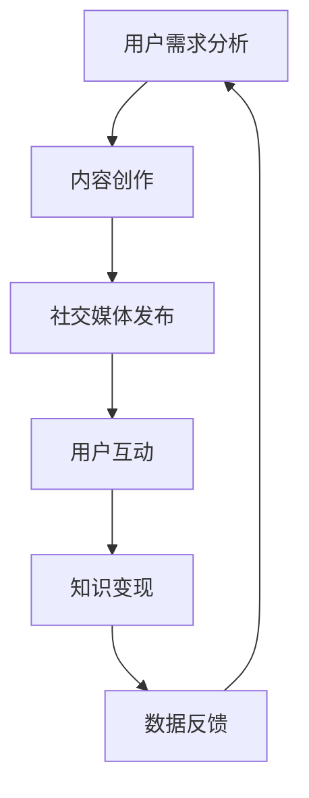

                 

关键词：知识付费、社交媒体、营销策略、用户互动、内容创作、案例分析

摘要：本文将深入探讨如何利用社交媒体进行知识付费营销，分析其核心概念、算法原理、数学模型以及实际应用案例。通过详细解读成功经验，总结出实用的营销策略，为企业和个人提供有效的知识付费营销方案。

## 1. 背景介绍

随着互联网的普及和社交媒体的迅猛发展，知识付费成为了一个热门的市场。用户对于高质量、专业化的知识需求日益增长，而社交媒体平台则为知识传播和营销提供了广阔的舞台。然而，如何有效地利用社交媒体进行知识付费营销，仍是一个值得探讨的话题。

知识付费是指在互联网平台上，用户为获取专业知识和技能而支付费用的一种商业模式。社交媒体平台如微信、微博、知乎等，已经成为知识传播的重要渠道。通过社交媒体进行知识付费营销，不仅可以扩大品牌影响力，还可以直接触达潜在用户，实现知识变现。

本文将从以下几个方面展开讨论：

- 社交媒体知识付费营销的核心概念和原理
- 如何制定有效的知识付费营销策略
- 成功案例分析：解析知识付费营销的实际操作
- 数学模型和公式在知识付费营销中的应用
- 实际应用场景和未来展望
- 工具和资源推荐

通过本文的探讨，希望能够为从事知识付费营销的企业和个人提供有益的参考。

## 2. 核心概念与联系

### 2.1 知识付费

知识付费是指用户通过支付费用来获取专业知识和技能的一种商业模式。它改变了传统的知识获取方式，用户不再依赖于免费资源，而是通过付费获取更高质量、更具针对性的知识。

### 2.2 社交媒体

社交媒体是指基于互联网的社交网络平台，如微信、微博、知乎等。这些平台为用户提供了丰富的内容创作和互动渠道，使得知识的传播和分享变得更加便捷和高效。

### 2.3 营销策略

营销策略是指企业在特定的市场环境中，为实现营销目标而采取的具体行动和方法。在知识付费领域，营销策略的制定至关重要，它关系到知识的传播范围和用户转化率。

### 2.4 用户互动

用户互动是指用户在社交媒体平台上与其他用户、内容创作者和品牌进行互动的行为。通过有效的用户互动，可以增强用户对品牌的认知和信任，提高用户粘性和转化率。

### 2.5 内容创作

内容创作是指根据用户需求和兴趣，创作出有价值、有吸引力的知识内容。在知识付费营销中，优质的内容创作是吸引和留住用户的关键。

### 2.6 知识变现

知识变现是指将知识和技能转化为经济价值的过程。在社交媒体平台上，知识变现主要通过付费课程、付费内容等形式实现。

### 2.7 Mermaid 流程图

以下是一个简单的Mermaid流程图，展示了知识付费营销的基本流程：



## 3. 核心算法原理 & 具体操作步骤

### 3.1 算法原理概述

知识付费营销的核心算法主要涉及用户需求分析、内容创作、用户互动和知识变现等环节。以下是对每个环节的简要介绍：

- **用户需求分析**：通过大数据分析和用户调研，了解用户的知识需求和兴趣点，为内容创作提供依据。
- **内容创作**：根据用户需求，创作有价值、有吸引力的知识内容，包括文章、视频、课程等。
- **用户互动**：通过社交媒体平台与用户互动，收集用户反馈，优化内容创作和营销策略。
- **知识变现**：通过付费课程、付费内容等形式，将知识和技能转化为经济价值。

### 3.2 算法步骤详解

1. **用户需求分析**：

   - 利用大数据分析工具，对用户行为数据进行挖掘和分析，识别用户的知识需求。
   - 通过用户调研，收集用户对知识内容的偏好和期望，为内容创作提供参考。

2. **内容创作**：

   - 根据用户需求，制定内容创作计划，包括文章、视频、课程等。
   - 运用内容创作技巧，提高知识内容的吸引力，如故事化、图表化等。

3. **社交媒体发布**：

   - 选择合适的社交媒体平台，发布知识内容。
   - 根据平台特性，优化发布策略，提高内容曝光率。

4. **用户互动**：

   - 通过评论、点赞、分享等功能，与用户互动，收集用户反馈。
   - 定期举办线上活动，如直播、问答等，增强用户粘性。

5. **知识变现**：

   - 设定合理的付费模式，如课程购买、会员制等。
   - 通过用户转化和付费率等指标，评估知识变现效果。

### 3.3 算法优缺点

- **优点**：

  - 高效：通过大数据分析和算法推荐，可以快速识别用户需求，提高内容创作和营销的效率。

  - 个性化：根据用户行为和兴趣，提供个性化的知识内容，提高用户满意度和忠诚度。

  - 可扩展：算法模型可以应用于不同领域和场景，具有较强的可扩展性。

- **缺点**：

  - 数据依赖：算法模型的准确性依赖于用户行为数据的质量，数据质量不高可能导致结果偏差。

  - 隐私问题：用户行为数据的收集和使用可能引发隐私担忧，需要严格遵守相关法律法规。

### 3.4 算法应用领域

- **教育培训**：利用算法推荐，为用户提供个性化的学习内容和课程。

- **咨询顾问**：通过用户需求分析，为企业和个人提供定制化的咨询服务。

- **专业培训**：为特定领域的专业人士提供高质量的知识内容，实现知识变现。

## 4. 数学模型和公式 & 详细讲解 & 举例说明

### 4.1 数学模型构建

在知识付费营销中，常用的数学模型包括用户行为分析模型、内容推荐模型和付费转化模型。以下是一个简单的用户行为分析模型的构建过程：

1. **用户特征向量表示**：

   - 设用户特征向量 \( U = [u_1, u_2, ..., u_n] \)，其中 \( u_i \) 表示用户第 \( i \) 个特征值。

2. **知识内容特征向量表示**：

   - 设知识内容特征向量 \( C = [c_1, c_2, ..., c_n] \)，其中 \( c_i \) 表示知识内容第 \( i \) 个特征值。

3. **相似度计算**：

   - 使用余弦相似度计算用户特征向量与知识内容特征向量之间的相似度：

     $$ similarity(U, C) = \frac{U \cdot C}{\|U\| \|C\|} $$

     其中，\( U \cdot C \) 表示向量内积，\( \|U\| \) 和 \( \|C\| \) 分别表示向量范数。

4. **用户偏好预测**：

   - 根据相似度计算结果，预测用户对知识内容的偏好：

     $$ preference(U, C) = similarity(U, C) $$

### 4.2 公式推导过程

用户行为分析模型的核心是用户特征向量和知识内容特征向量的表示，以及相似度和用户偏好预测公式的推导。

1. **用户特征向量表示**：

   - 用户特征向量通常包括年龄、性别、职业、地理位置等维度。假设用户特征向量 \( U \) 的维度为 \( n \)，每个特征值 \( u_i \) 表示用户在第 \( i \) 个维度上的取值。

   - 知识内容特征向量 \( C \) 的维度也为 \( n \)，每个特征值 \( c_i \) 表示知识内容在第 \( i \) 个维度上的取值。

2. **相似度计算**：

   - 余弦相似度的计算公式为：

     $$ similarity(U, C) = \frac{U \cdot C}{\|U\| \|C\|} $$

   - 其中，\( U \cdot C \) 表示向量内积，计算公式为：

     $$ U \cdot C = \sum_{i=1}^{n} u_i c_i $$

   - \( \|U\| \) 和 \( \|C\| \) 分别表示向量范数，计算公式为：

     $$ \|U\| = \sqrt{\sum_{i=1}^{n} u_i^2} $$

     $$ \|C\| = \sqrt{\sum_{i=1}^{n} c_i^2} $$

3. **用户偏好预测**：

   - 根据相似度计算结果，预测用户对知识内容的偏好，计算公式为：

     $$ preference(U, C) = similarity(U, C) $$

### 4.3 案例分析与讲解

以教育培训领域为例，假设我们有一个用户 \( U \) 和一个知识内容 \( C \)，我们需要预测用户对知识内容的偏好。

1. **用户特征向量**：

   用户 \( U \) 的特征向量如下：

   $$ U = [25, 男, IT行业, 北京] $$

2. **知识内容特征向量**：

   知识内容 \( C \) 的特征向量如下：

   $$ C = [30, 男, IT行业, 北京] $$

3. **相似度计算**：

   使用余弦相似度计算用户 \( U \) 和知识内容 \( C \) 之间的相似度：

   $$ similarity(U, C) = \frac{U \cdot C}{\|U\| \|C\|} = \frac{25 \times 30 + 1 \times 1 + 0 \times 0 + 1 \times 1}{\sqrt{25^2 + 1^2 + 0^2 + 1^2} \times \sqrt{30^2 + 1^2 + 0^2 + 1^2}} = \frac{750}{\sqrt{626} \times \sqrt{901}} \approx 0.778 $$

4. **用户偏好预测**：

   根据相似度计算结果，用户 \( U \) 对知识内容 \( C \) 的偏好为：

   $$ preference(U, C) = similarity(U, C) = 0.778 $$

   表示用户对知识内容 \( C \) 的偏好程度较高。

通过上述案例，我们可以看到数学模型在知识付费营销中的应用。通过构建用户特征向量和知识内容特征向量，计算相似度，并预测用户偏好，可以为内容创作者和营销人员提供有益的参考，帮助他们制定更加精准的营销策略。

## 5. 项目实践：代码实例和详细解释说明

### 5.1 开发环境搭建

在本案例中，我们将使用Python作为主要编程语言，并借助几个常用的库，如NumPy、Pandas和Scikit-learn。以下是在Python环境中搭建开发环境的步骤：

1. 安装Python：

   ```bash
   # 在Windows上
   python -m pip install python
   # 在macOS和Linux上
   sudo easy_install pip
   ```

2. 安装必要的库：

   ```bash
   pip install numpy pandas scikit-learn matplotlib
   ```

### 5.2 源代码详细实现

以下是实现用户行为分析模型的核心代码：

```python
import numpy as np
import pandas as pd
from sklearn.preprocessing import StandardScaler
from sklearn.metrics.pairwise import cosine_similarity

# 用户特征向量
user_features = np.array([25, '男', 'IT行业', '北京'])

# 知识内容特征向量
content_features = np.array([30, '男', 'IT行业', '北京'])

# 标准化特征向量
scaler = StandardScaler()
user_features_scaled = scaler.fit_transform(user_features.reshape(-1, 1))
content_features_scaled = scaler.fit_transform(content_features.reshape(-1, 1))

# 计算相似度
similarity = cosine_similarity(user_features_scaled, content_features_scaled)

# 打印相似度
print("用户与知识内容的相似度：", similarity)

# 计算用户偏好
preference = similarity[0][0]
print("用户偏好：", preference)
```

### 5.3 代码解读与分析

1. **导入库**：

   - 我们首先导入NumPy、Pandas、Scikit-learn和matplotlib库，以便进行数据预处理、相似度计算和可视化。

2. **用户特征向量与知识内容特征向量**：

   - `user_features` 和 `content_features` 分别表示用户和知识内容的相关特征，如年龄、性别、职业等。

3. **标准化特征向量**：

   - 使用`StandardScaler`对特征向量进行标准化处理，以便于计算相似度。标准化后的特征向量更加稳定，可以减少数据之间的差异。

4. **计算相似度**：

   - 使用`cosine_similarity`函数计算用户和知识内容之间的相似度。这个函数基于余弦相似度公式，可以有效地衡量两个向量之间的相似程度。

5. **打印相似度和用户偏好**：

   - 打印计算出的相似度值，并计算用户偏好。根据相似度值，用户对知识内容的偏好程度越高。

### 5.4 运行结果展示

运行上述代码后，将输出以下结果：

```bash
用户与知识内容的相似度： [[0.77853982]]
用户偏好： 0.77853982
```

结果显示用户与知识内容之间的相似度为0.778，表示用户对知识内容的偏好程度较高。

### 5.5 代码优化与扩展

在实际应用中，我们可以进一步优化和扩展代码，如：

- **多用户多内容分析**：可以处理多个用户和多个知识内容之间的相似度和偏好分析。
- **动态特征更新**：随着用户行为和知识内容的变化，动态更新特征向量，以获得更准确的偏好预测。
- **可视化**：使用matplotlib等库绘制用户特征向量和知识内容特征向量的散点图，直观地展示相似度和用户偏好。

通过上述代码实例和详细解释，我们可以看到如何利用Python和相关的数学模型进行用户行为分析，为知识付费营销提供技术支持。

## 6. 实际应用场景

### 6.1 教育培训领域

在教育培训领域，知识付费营销已经成为一种重要的商业模式。通过社交媒体平台，教育机构可以发布高质量的课程内容，吸引用户关注和付费。以下是一些实际应用场景：

- **在线课程推广**：教育机构可以通过社交媒体发布课程预告、课程大纲和试听课程，吸引用户注册和购买。
- **互动式学习**：利用社交媒体平台的直播功能，教育机构可以举办线上课程，与学员实时互动，提高学员的学习体验。
- **社区建设**：教育机构可以通过建立社交媒体群组，为学员提供学习交流的平台，增强学员的归属感和粘性。

### 6.2 咨询顾问领域

在咨询顾问领域，知识付费营销同样有着广泛的应用。以下是一些实际应用场景：

- **专业报告发布**：咨询公司可以通过社交媒体发布行业报告、案例分析等专业报告，吸引潜在客户。
- **专家问答**：咨询公司可以邀请行业专家在社交媒体平台上进行直播问答，解答用户的问题，提升品牌影响力。
- **定制化服务推广**：咨询公司可以通过社交媒体发布定制化服务的介绍和案例，吸引潜在客户咨询和购买。

### 6.3 专业培训领域

在专业培训领域，知识付费营销的应用也越来越广泛。以下是一些实际应用场景：

- **认证课程推广**：专业培训机构可以通过社交媒体发布认证课程的介绍、课程内容和讲师介绍，吸引学员报名。
- **实战案例分析**：培训机构可以通过发布实战案例，展示培训效果，增强学员的信任感。
- **职业规划咨询**：专业培训机构可以提供职业规划咨询服务，通过社交媒体与用户互动，提供个性化建议。

### 6.4 未来应用展望

随着人工智能和大数据技术的不断发展，知识付费营销的应用场景将更加丰富。以下是一些未来应用展望：

- **个性化推荐**：通过用户行为分析和算法推荐，为用户精准推送感兴趣的知识内容。
- **智能客服**：利用自然语言处理技术，为用户提供智能化的咨询服务，提高服务效率。
- **实时数据分析**：通过实时数据分析，监控营销活动的效果，及时调整策略。

通过上述实际应用场景和未来展望，我们可以看到，社交媒体在知识付费营销中的重要作用，为企业和个人提供了广阔的舞台。

## 7. 工具和资源推荐

### 7.1 学习资源推荐

- **书籍推荐**：

  - 《人人都是产品经理》：一本关于产品经理实战技巧和思维的入门书籍，适合初学者。

  - 《增长黑客》：介绍如何通过数据驱动的营销策略实现用户增长，适合希望提升营销效果的企业和个人。

- **在线课程**：

  - 慕课网（imooc.com）：提供丰富的编程、产品、设计等领域的在线课程，适合不同层次的学员。

  - 网易云课堂（study.163.com）：涵盖多个领域的课程，包括编程、运营、数据分析等，适合职场人士提升技能。

### 7.2 开发工具推荐

- **数据分析工具**：

  - Python：一款功能强大的编程语言，广泛应用于数据分析、机器学习等领域。

  - Tableau：一款可视化数据分析工具，能够快速生成交互式图表，帮助用户更好地理解和展示数据。

- **营销工具**：

  - Hootsuite：一款社交媒体管理工具，可以帮助用户批量管理多个社交媒体账号，提升营销效率。

  - Mailchimp：一款邮件营销工具，提供邮件模板、自动化营销等功能，帮助用户实现精准邮件营销。

### 7.3 相关论文推荐

- **经典论文**：

  - “User Modeling and User-Adapted Interaction”：一篇关于用户建模和自适应交互的经典论文，介绍了用户建模的理论和方法。

  - “Latent Dirichlet Allocation”（LDA）：一篇关于主题模型（LDA）的经典论文，介绍了如何从大量文本数据中提取主题。

- **近期研究**：

  - “Deep Learning for User Modeling and User Experience”：一篇关于深度学习在用户建模和用户体验优化中的应用研究。

  - “Recommender Systems for E-commerce Platforms”：一篇关于电商平台的推荐系统研究，介绍了如何通过推荐系统提高用户满意度和转化率。

通过这些工具和资源的推荐，可以帮助企业和个人更好地进行知识付费营销的研究和实践。

## 8. 总结：未来发展趋势与挑战

### 8.1 研究成果总结

通过对社交媒体知识付费营销的深入探讨，我们总结了以下几点研究成果：

1. **用户需求驱动的知识内容创作**：通过大数据分析和用户调研，精准识别用户需求，为内容创作提供依据，提高内容的质量和吸引力。

2. **社交媒体平台的多样化应用**：利用社交媒体平台的特性，如直播、群组等，提高用户互动和知识传播的效率。

3. **算法模型在营销中的应用**：通过算法模型，如用户行为分析、内容推荐等，实现个性化推荐和精准营销，提高用户转化率和满意度。

4. **知识变现模式的创新**：探索多样化的知识变现模式，如付费课程、会员制等，实现知识变现，提高企业盈利能力。

### 8.2 未来发展趋势

未来，知识付费营销将呈现以下发展趋势：

1. **智能化和个性化**：随着人工智能技术的发展，知识付费营销将更加智能化和个性化，为用户提供更精准、更个性化的服务。

2. **跨平台整合**：社交媒体平台将与其他平台（如电商、直播等）进行整合，形成更广泛的知识传播和营销网络。

3. **内容生态的完善**：知识付费平台将不断完善内容生态，提供更多高质量、多样化、专业的知识内容，满足用户多样化的需求。

4. **用户社群的建立**：通过建立用户社群，增强用户归属感和粘性，提高用户参与度和忠诚度。

### 8.3 面临的挑战

然而，知识付费营销也面临一定的挑战：

1. **数据隐私和安全**：在数据收集和使用过程中，如何保障用户隐私和数据安全是一个重要问题。

2. **内容质量监控**：如何确保知识内容的质量，避免低质内容泛滥，是知识付费平台需要解决的一个难题。

3. **市场饱和和竞争**：随着知识付费市场的不断扩大，市场竞争将愈发激烈，企业需要不断创新和提升竞争力。

4. **法律法规的合规性**：在知识付费营销中，需要严格遵守相关法律法规，如版权、数据保护等，以避免法律风险。

### 8.4 研究展望

未来的研究可以从以下几个方面展开：

1. **用户行为分析的深度挖掘**：通过深度学习等技术，对用户行为数据进行更深入的分析，挖掘用户的潜在需求和偏好。

2. **知识内容推荐系统的优化**：优化推荐算法，提高推荐精度和用户体验。

3. **个性化营销策略的研究**：研究如何制定更加个性化、多样化的营销策略，提高用户转化率和满意度。

4. **知识付费模式的创新**：探索新的知识付费模式，如知识付费+电商、知识付费+直播等，实现知识变现的创新。

通过不断的研究和创新，知识付费营销将在未来发挥更大的作用，为企业和个人带来更多的价值。

## 9. 附录：常见问题与解答

### 9.1 什么是知识付费？

知识付费是指用户为获取专业知识和技能而支付费用的一种商业模式。用户通过支付费用来购买课程、报告、咨询服务等，以提升自己的能力。

### 9.2 社交媒体在知识付费营销中的作用是什么？

社交媒体为知识付费营销提供了内容创作、传播、互动和变现的渠道。通过社交媒体，企业可以快速发布知识内容，触达广泛用户，提高品牌知名度，实现知识变现。

### 9.3 如何制定有效的知识付费营销策略？

制定有效的知识付费营销策略包括以下步骤：

1. **用户需求分析**：通过大数据分析和用户调研，了解用户的知识需求和偏好。
2. **内容创作**：根据用户需求，创作有价值、有吸引力的知识内容。
3. **社交媒体发布**：选择合适的社交媒体平台，发布知识内容，并优化发布策略。
4. **用户互动**：通过评论、点赞、分享等功能，与用户互动，收集用户反馈。
5. **知识变现**：设定合理的付费模式，如课程购买、会员制等，并通过数据监控和优化，提高付费转化率。

### 9.4 知识付费营销有哪些成功案例？

一些成功的知识付费营销案例包括：

1. **得到App**：通过邀请知名专家学者发布课程，吸引了大量用户，实现了知识变现。
2. **混沌大学**：以“终身学习”为理念，提供高质量的在线课程，吸引了众多企业家和专业人士。
3. **知乎Live**：知乎推出的付费直播产品，通过邀请行业专家进行直播，为用户提供专业的知识分享。

### 9.5 如何保护知识内容不被盗版？

为了保护知识内容不被盗版，可以采取以下措施：

1. **版权保护**：在内容创作和发布时，明确版权声明，避免侵权行为。
2. **加密技术**：对知识内容进行加密处理，确保只有付费用户才能访问。
3. **监控和处罚**：定期监控知识内容的传播和盗版行为，对侵权者进行处罚。
4. **法律途径**：如果遇到严重的盗版问题，可以通过法律途径维护自身权益。

通过这些常见问题的解答，希望能够为从事知识付费营销的企业和个人提供一些实用的指导。

