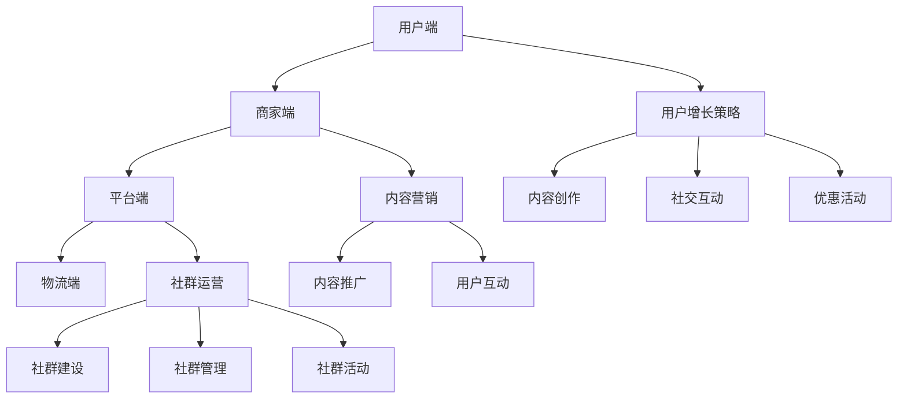
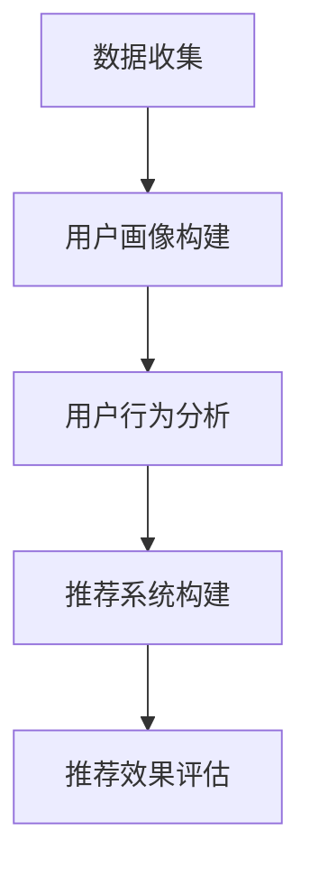
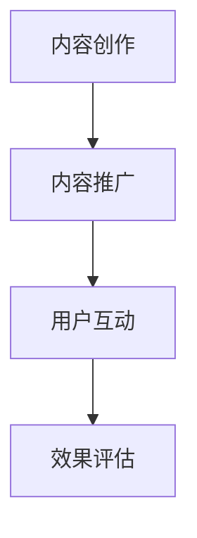
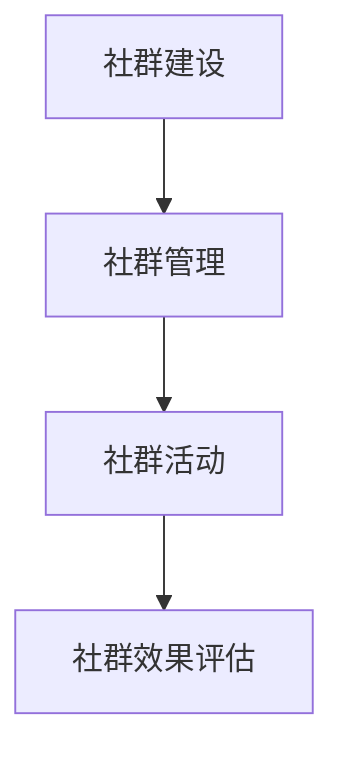

                 

 在当今数字化时代，社交电商模式正迅速崛起，成为企业吸引客户、拓展市场的重要手段。对于创业者来说，如何利用社交电商模式打造私域流量池，实现业务增长，成为了亟待解决的问题。本文将深入探讨社交电商模式的核心概念、算法原理、数学模型、实际应用场景以及未来发展趋势，旨在为创业者提供一份实用的指南。

## 关键词

- 社交电商
- 私域流量
- 流量池
- 用户增长
- 营销策略

## 摘要

本文首先介绍了社交电商模式的基本概念，阐述了其与传统电商模式的区别，并分析了社交电商在私域流量池构建中的重要作用。接着，本文详细讨论了构建社交电商私域流量池的核心算法原理和具体操作步骤，包括用户增长策略、内容营销和社群运营等。随后，文章运用数学模型和公式，对社交电商中的关键指标进行了详细讲解和案例分析。最后，文章提供了项目实践中的代码实例和详细解释，并探讨了社交电商模式在实际应用中的多个场景，以及对未来发展趋势的展望。

## 1. 背景介绍

### 社交电商的崛起

社交电商，顾名思义，是电商与社交相结合的一种新兴商业模式。它通过社交媒体平台，如微信、微博、抖音等，将用户社交行为与购物需求有机结合，实现商品的推广和销售。与传统电商模式相比，社交电商具有以下几个显著特点：

1. **互动性强**：社交电商通过社交媒体的互动功能，使用户在购物过程中不仅能够看到商品，还能与商家和其他消费者进行实时交流，提升了用户的参与感和体验感。
2. **病毒传播**：社交电商借助社交媒体的社交属性，使得用户通过分享、转发等方式，将商品信息快速扩散到更广泛的受众中，从而实现高效的传播和推广。
3. **降低营销成本**：通过社交媒体平台的流量优势，社交电商可以减少对传统广告渠道的依赖，降低营销成本，提高营销效率。

### 私域流量池的概念

私域流量池是指企业通过自有渠道（如微信公众号、微信群、个人微信等）积累和运营的、可以反复利用的流量资源。与公域流量（如搜索引擎、社交媒体平台等）相比，私域流量具有以下优势：

1. **可控性高**：企业可以自主控制私域流量池中的用户数据和流量流向，降低用户流失率。
2. **用户忠诚度高**：私域流量池中的用户多为忠实粉丝或潜在客户，他们对品牌和产品的信任度较高，更容易转化为实际购买行为。
3. **低成本**：私域流量的获取和运营成本相对较低，企业可以通过内容营销、社群互动等方式，实现持续的用户增长和留存。

### 社交电商模式在私域流量池构建中的作用

社交电商模式在私域流量池的构建中发挥着至关重要的作用。通过以下几种方式，社交电商能够有效提升私域流量的质量和数量：

1. **用户增长**：通过社交媒体平台的引流功能，社交电商可以迅速扩大用户群体，增加私域流量池的用户基数。
2. **内容营销**：社交电商通过发布有趣、有价值的内容，吸引用户关注和参与，提升用户的活跃度和留存率。
3. **社群运营**：社交电商通过建立微信群、QQ群等社群，加强用户间的互动，增强用户对品牌的认同感和忠诚度。
4. **精准营销**：通过大数据分析和用户画像，社交电商可以精准定位潜在客户，提高营销活动的转化率。

### 社交电商模式的基本架构

社交电商模式的基本架构主要包括以下几个核心组成部分：

1. **用户端**：用户通过社交媒体平台访问社交电商平台，浏览商品、参与互动、进行购物等。
2. **商家端**：商家通过社交电商平台发布商品信息、推广活动、管理订单等。
3. **平台端**：社交电商平台提供技术支持、数据分析、营销工具等，帮助商家和用户实现无缝对接。
4. **物流端**：物流服务为社交电商平台提供商品配送和售后服务，保障用户购物体验。

### 社交电商模式的成功案例分析

以下是一些成功的社交电商案例，它们通过不同策略和手段，成功打造了私域流量池，实现了业务增长：

1. **拼多多**：通过社交分享和拼团购物，拼多多迅速积累了大量用户，建立了庞大的私域流量池。
2. **小红书**：小红书通过内容营销和社交互动，吸引了大量年轻用户，建立了强大的私域流量基础。
3. **有赞**：有赞通过为商家提供社交电商平台和技术支持，帮助商家快速打造私域流量池，实现业务增长。

### 社交电商模式的市场前景

随着社交媒体的普及和用户习惯的改变，社交电商模式的市场前景十分广阔。预计未来几年，社交电商将继续保持高速增长，成为电商市场的重要组成部分。创业者可以通过以下策略，抓住社交电商的发展机遇：

1. **创新营销手段**：通过创新营销手段，如短视频、直播等，吸引更多用户关注和参与。
2. **精细化运营**：通过精细化运营，提高用户留存率和转化率，实现业务持续增长。
3. **跨界合作**：与其他品牌或行业进行跨界合作，拓宽用户群体和市场空间。

## 2. 核心概念与联系

### 核心概念

#### 社交电商模式

社交电商模式是指通过社交媒体平台，将电商交易与社交互动相结合的一种商业模式。其核心概念包括：

- **社交互动**：用户在社交媒体平台上分享、评论、点赞、转发等互动行为，增加了用户参与度和粘性。
- **用户推荐**：用户通过社交关系网，将商品信息推荐给亲朋好友，实现病毒式传播。
- **社群运营**：通过建立微信群、QQ群等社群，加强用户间的互动，提高用户忠诚度。

#### 私域流量池

私域流量池是指企业通过自有渠道（如微信公众号、微信群、个人微信等）积累和运营的、可以反复利用的流量资源。其核心概念包括：

- **用户积累**：通过内容营销、用户互动等方式，吸引并积累大量忠实用户。
- **用户留存**：通过社群运营、个性化推荐等手段，提高用户留存率，实现持续增长。
- **流量转化**：通过精准营销、优惠活动等方式，将私域流量转化为实际购买行为。

#### 用户增长策略

用户增长策略是指企业通过多种手段，扩大用户群体，提高用户数量的方法。其核心概念包括：

- **内容营销**：通过发布有趣、有价值的内容，吸引用户关注和参与。
- **社交互动**：通过社交媒体平台的互动功能，增加用户参与度和粘性。
- **优惠活动**：通过优惠活动、折扣促销等方式，吸引新用户注册和购买。

#### 内容营销

内容营销是指通过创造和分享有价值的内容，吸引和留住目标受众的一种营销方法。其核心概念包括：

- **内容创作**：根据用户需求和兴趣，创作有趣、有价值的内容。
- **内容推广**：通过社交媒体平台、邮件营销等方式，推广内容，提高曝光度。
- **用户互动**：通过评论、点赞、分享等方式，增加用户互动，提高用户粘性。

#### 社群运营

社群运营是指通过建立和管理社群，促进用户互动，提高用户忠诚度的一种运营方法。其核心概念包括：

- **社群建设**：根据用户需求和兴趣，建立适合的社群，吸引用户加入。
- **社群管理**：通过规范社群秩序、鼓励用户互动等方式，维护社群氛围。
- **社群活动**：通过举办线上活动、互动游戏等方式，提高用户参与度和忠诚度。

### Mermaid 流程图



### 核心概念的联系

社交电商模式的核心概念之间存在着密切的联系。用户端、商家端和平台端构成了社交电商的基本架构，用户增长策略、内容营销和社群运营则是实现私域流量池构建和运营的重要手段。

- **用户端**：通过社交媒体平台的互动功能，用户可以浏览商品、参与互动、进行购物等，形成了社交电商的基础。
- **商家端**：商家通过社交媒体平台发布商品信息、推广活动、管理订单等，实现了商品的销售和用户的互动。
- **平台端**：社交电商平台提供技术支持、数据分析、营销工具等，帮助商家和用户实现无缝对接，提高了运营效率和用户体验。
- **用户增长策略**：通过内容营销、社交互动和优惠活动等手段，企业可以迅速扩大用户群体，增加私域流量池的用户基数。
- **内容营销**：通过创作和推广有价值的内容，企业可以吸引用户关注和参与，提高用户留存率和转化率。
- **社群运营**：通过建立和管理社群，企业可以加强用户间的互动，提高用户忠诚度，实现持续的用户增长和留存。

通过社交电商模式，企业可以将用户、商家和平台紧密连接在一起，形成一个完整的生态系统，实现私域流量池的构建和运营。同时，核心概念之间的相互作用和协同效应，也为企业带来了更多的商业机会和竞争优势。

### 3. 核心算法原理 & 具体操作步骤

#### 3.1 算法原理概述

在构建社交电商私域流量池的过程中，核心算法原理主要包括用户增长策略、内容营销和社群运营。这些算法通过数学模型和统计方法，实现用户精准定位、行为分析和效果评估，从而提高用户获取和留存率。

##### 用户增长策略

用户增长策略的核心是利用大数据和机器学习算法，分析用户行为和兴趣，实现精准的用户定位和推荐。具体原理如下：

1. **用户画像**：通过收集用户的基本信息、行为数据等，构建用户画像，包括年龄、性别、地理位置、兴趣爱好等。
2. **行为分析**：利用自然语言处理和机器学习算法，分析用户的搜索历史、浏览记录、购买行为等，挖掘用户兴趣和需求。
3. **推荐系统**：基于用户画像和行为分析结果，构建推荐系统，为用户推荐感兴趣的商品或内容，提高用户参与度和留存率。

##### 内容营销

内容营销的核心是通过有价值的内容创作和推广，吸引用户关注和参与。具体原理如下：

1. **内容创作**：根据用户需求和兴趣，创作有趣、有价值的图文、视频、音频等内容。
2. **内容推广**：利用社交媒体平台、邮件营销等渠道，推广内容，提高曝光度和用户参与度。
3. **互动设计**：通过评论、点赞、分享等互动设计，增加用户互动，提高用户粘性。

##### 社群运营

社群运营的核心是通过建立和管理社群，促进用户互动，提高用户忠诚度。具体原理如下：

1. **社群建设**：根据用户需求和兴趣，建立适合的社群，如兴趣小组、用户论坛等。
2. **社群管理**：通过规范社群秩序、鼓励用户互动等方式，维护社群氛围。
3. **社群活动**：通过举办线上活动、互动游戏等方式，提高用户参与度和忠诚度。

#### 3.2 算法步骤详解

##### 用户增长策略

1. **数据收集**：收集用户的基本信息、行为数据等，包括用户注册信息、搜索历史、浏览记录、购买行为等。
2. **用户画像构建**：利用机器学习算法，分析用户数据，构建用户画像，包括用户属性（年龄、性别、地理位置等）和用户兴趣（兴趣爱好、购买偏好等）。
3. **用户行为分析**：利用自然语言处理和机器学习算法，分析用户的行为数据，挖掘用户的兴趣和需求。
4. **推荐系统构建**：基于用户画像和行为分析结果，构建推荐系统，为用户推荐感兴趣的商品或内容。
5. **推荐效果评估**：利用A/B测试等方法，评估推荐效果，优化推荐算法，提高用户参与度和留存率。

##### 内容营销

1. **内容创作**：根据用户画像和行为分析结果，创作有趣、有价值的图文、视频、音频等内容。
2. **内容推广**：利用社交媒体平台、邮件营销等渠道，推广内容，提高曝光度和用户参与度。
3. **互动设计**：在内容中设计评论、点赞、分享等互动元素，增加用户互动，提高用户粘性。
4. **效果评估**：通过点击率、转发率、评论率等指标，评估内容效果，优化内容策略，提高用户参与度。

##### 社群运营

1. **社群建设**：根据用户需求和兴趣，建立适合的社群，如兴趣小组、用户论坛等。
2. **社群管理**：制定社群规则，规范社群秩序，鼓励用户互动，维护社群氛围。
3. **社群活动**：定期举办线上活动、互动游戏等，提高用户参与度和忠诚度。
4. **社群效果评估**：通过用户活跃度、互动率等指标，评估社群效果，优化社群运营策略。

#### 3.3 算法优缺点

##### 用户增长策略

优点：

- **精准定位**：通过用户画像和行为分析，实现精准的用户定位和推荐，提高用户获取和留存率。
- **高效推广**：利用大数据和机器学习算法，提高推荐效果和内容曝光度，降低营销成本。

缺点：

- **数据隐私**：用户数据的收集和分析可能涉及用户隐私问题，需要确保数据安全和用户隐私保护。
- **技术门槛**：构建和优化推荐系统需要一定的技术支持和人才储备，对中小企业来说可能存在一定的挑战。

##### 内容营销

优点：

- **创意多样**：通过多种形式的内容创作和推广，吸引用户关注和参与，提高用户粘性和忠诚度。
- **低成本**：利用社交媒体平台和邮件营销等渠道，实现低成本的内容推广和用户互动。

缺点：

- **效果评估难**：内容营销的效果评估相对复杂，需要多维度指标进行综合评估，提高评估准确性。
- **竞争激烈**：随着内容营销的普及，市场竞争激烈，需要不断创新和优化内容策略，才能脱颖而出。

##### 社群运营

优点：

- **用户互动**：通过社群运营，促进用户互动，提高用户参与度和忠诚度。
- **品牌认同**：建立社群，加强用户对品牌的认同感和归属感，提高品牌忠诚度。

缺点：

- **管理复杂**：社群运营需要投入大量人力和物力，进行管理、维护和活动策划，对运营团队要求较高。
- **用户流失**：社群运营过程中，可能会出现用户流失，需要持续投入和优化，以保持用户活跃度。

#### 3.4 算法应用领域

用户增长策略、内容营销和社群运营算法在社交电商领域有广泛的应用，可以应用于以下场景：

1. **电商平台**：通过用户增长策略和内容营销，提高用户获取和留存率，实现业务增长。
2. **社交平台**：通过社群运营，加强用户互动，提高用户参与度和忠诚度，提升平台价值。
3. **品牌营销**：通过内容营销和社群运营，实现品牌推广和用户互动，提高品牌知名度和影响力。

### 4. 数学模型和公式 & 详细讲解 & 举例说明

#### 4.1 数学模型构建

在构建社交电商私域流量池的过程中，数学模型和公式起着至关重要的作用。以下是几个关键的数学模型和公式，用于描述用户增长、内容营销和社群运营等核心概念。

##### 用户增长模型

用户增长模型主要用于预测和评估用户增长的速率和趋势。常用的用户增长模型包括指数增长模型和逻辑斯蒂增长模型。

1. **指数增长模型**：

$$
P(t) = P_0 \cdot e^{rt}
$$

其中，$P(t)$ 表示 $t$ 时刻的用户数量，$P_0$ 表示初始用户数量，$e$ 表示自然常数，$r$ 表示用户增长率。

2. **逻辑斯蒂增长模型**：

$$
P(t) = \frac{L}{1 + e^{-(rt - c)}}
$$

其中，$P(t)$ 表示 $t$ 时刻的用户数量，$L$ 表示用户增长上限，$e$ 表示自然常数，$r$ 表示用户增长率，$c$ 表示增长常数。

##### 内容营销模型

内容营销模型主要用于评估内容的效果和影响力。常用的内容营销模型包括点击率模型和转发率模型。

1. **点击率模型**：

$$
CTR = \frac{Clicks}{Impressions}
$$

其中，$CTR$ 表示点击率，$Clicks$ 表示点击次数，$Impressions$ 表示曝光次数。

2. **转发率模型**：

$$
CTR = \frac{Shares}{Impressions}
$$

其中，$CTR$ 表示转发率，$Shares$ 表示转发次数，$Impressions$ 表示曝光次数。

##### 社群运营模型

社群运营模型主要用于评估社群的效果和用户参与度。常用的社群运营模型包括用户活跃度和用户留存率模型。

1. **用户活跃度模型**：

$$
Activity = \frac{Interactions}{Users}
$$

其中，$Activity$ 表示用户活跃度，$Interactions$ 表示互动次数，$Users$ 表示用户数量。

2. **用户留存率模型**：

$$
Retention = \frac{Active Users}{Total Users} \cdot 100\%
$$

其中，$Retention$ 表示用户留存率，$Active Users$ 表示活跃用户数量，$Total Users$ 表示总用户数量。

#### 4.2 公式推导过程

##### 用户增长模型推导

指数增长模型：

假设在初始时刻 $t=0$，用户数量为 $P_0$。在时间 $t$ 内，用户数量增加了 $P(t) - P_0$。根据指数增长原理，用户增长速率与当前用户数量成正比，即：

$$
\frac{dP}{dt} \propto P
$$

两边同时乘以常数 $r$，得到：

$$
\frac{dP}{dt} = rP
$$

对上式两边同时积分，得到：

$$
\int_{P_0}^{P(t)} \frac{dP}{P} = \int_0^t r \, dt
$$

$$
\ln \frac{P(t)}{P_0} = rt
$$

$$
P(t) = P_0 \cdot e^{rt}
$$

逻辑斯蒂增长模型：

假设在初始时刻 $t=0$，用户数量为 $P_0$，用户增长上限为 $L$。在时间 $t$ 内，用户数量增加了 $P(t) - P_0$。根据逻辑斯蒂增长原理，用户增长速率与当前用户数量和用户增长上限成反比，即：

$$
\frac{dP}{dt} \propto \frac{L - P}{L}
$$

两边同时乘以常数 $r$，得到：

$$
\frac{dP}{dt} = r \cdot \frac{L - P}{L}
$$

对上式两边同时积分，得到：

$$
\int_{P_0}^{P(t)} \frac{L - P}{L} \, dP = \int_0^t r \, dt
$$

$$
L \cdot \ln \frac{L}{P(t)} - L \cdot \ln \frac{L}{P_0} = rt
$$

$$
\ln \frac{L}{P(t)} - \ln \frac{L}{P_0} = \frac{rt}{L}
$$

$$
\ln \frac{P_0}{P(t)} = \frac{rt}{L} - 1
$$

$$
P(t) = \frac{L}{1 + e^{-(rt - c)}}
$$

##### 内容营销模型推导

点击率模型：

假设在一段时间内，某内容的曝光次数为 $Impressions$，点击次数为 $Clicks$。点击率定义为点击次数与曝光次数的比值，即：

$$
CTR = \frac{Clicks}{Impressions}
$$

转发率模型：

假设在一段时间内，某内容的曝光次数为 $Impressions$，转发次数为 $Shares$。转发率定义为转发次数与曝光次数的比值，即：

$$
CTR = \frac{Shares}{Impressions}
$$

##### 社群运营模型推导

用户活跃度模型：

假设在一段时间内，某社群的互动次数为 $Interactions$，用户数量为 $Users$。用户活跃度定义为互动次数与用户数量的比值，即：

$$
Activity = \frac{Interactions}{Users}
$$

用户留存率模型：

假设在一段时间内，某社群的活跃用户数量为 $Active Users$，总用户数量为 $Total Users$。用户留存率定义为活跃用户数量与总用户数量的比值，即：

$$
Retention = \frac{Active Users}{Total Users} \cdot 100\%
$$

#### 4.3 案例分析与讲解

以下通过一个实际案例，对上述数学模型和公式进行详细讲解和案例分析。

##### 案例背景

某电商企业通过社交电商模式，利用用户增长策略、内容营销和社群运营，打造了私域流量池，实现了业务增长。以下是该企业的核心数据和运营策略：

1. **初始用户数量**：$P_0 = 10000$  
2. **用户增长率**：$r = 0.05$  
3. **用户增长上限**：$L = 50000$  
4. **曝光次数**：$Impressions = 100000$  
5. **点击次数**：$Clicks = 5000$  
6. **转发次数**：$Shares = 2000$  
7. **互动次数**：$Interactions = 3000$  
8. **活跃用户数量**：$Active Users = 2000$  
9. **总用户数量**：$Total Users = 5000$

##### 案例分析

1. **用户增长模型分析**：

根据指数增长模型，可以计算该企业在不同时间点的用户数量：

$$
P(t) = P_0 \cdot e^{rt}
$$

- $t=0$ 时刻，用户数量为 $P(0) = 10000 \cdot e^{0.05 \cdot 0} = 10000$  
- $t=1$ 时刻，用户数量为 $P(1) = 10000 \cdot e^{0.05 \cdot 1} \approx 10526$  
- $t=2$ 时刻，用户数量为 $P(2) = 10000 \cdot e^{0.05 \cdot 2} \approx 11053$  
- $t=3$ 时刻，用户数量为 $P(3) = 10000 \cdot e^{0.05 \cdot 3} \approx 11601$

根据逻辑斯蒂增长模型，可以计算该企业在不同时间点的用户数量：

$$
P(t) = \frac{L}{1 + e^{-(rt - c)}}
$$

- $t=0$ 时刻，用户数量为 $P(0) = \frac{50000}{1 + e^{-(0.05 \cdot 0 - c)}}$，其中 $c$ 为增长常数，可以通过最小二乘法等方法进行估计，假设 $c=1$，则 $P(0) = \frac{50000}{1 + e^{-1}} \approx 36787$  
- $t=1$ 时刻，用户数量为 $P(1) = \frac{50000}{1 + e^{-(0.05 \cdot 1 - 1)}} \approx 40302$  
- $t=2$ 时刻，用户数量为 $P(2) = \frac{50000}{1 + e^{-(0.05 \cdot 2 - 1)}} \approx 44210$  
- $t=3$ 时刻，用户数量为 $P(3) = \frac{50000}{1 + e^{-(0.05 \cdot 3 - 1)}} \approx 48304$

2. **内容营销模型分析**：

根据点击率模型，可以计算该企业内容的点击率：

$$
CTR = \frac{Clicks}{Impressions} = \frac{5000}{100000} = 0.05
$$

根据转发率模型，可以计算该企业内容的转发率：

$$
CTR = \frac{Shares}{Impressions} = \frac{2000}{100000} = 0.02
$$

3. **社群运营模型分析**：

根据用户活跃度模型，可以计算该社群的用户活跃度：

$$
Activity = \frac{Interactions}{Users} = \frac{3000}{5000} = 0.6
$$

根据用户留存率模型，可以计算该社群的用户留存率：

$$
Retention = \frac{Active Users}{Total Users} \cdot 100\% = \frac{2000}{5000} \cdot 100\% = 40\%
$$

##### 案例总结

通过上述分析，可以得出以下结论：

1. **用户增长模型**：该企业用户数量呈指数增长趋势，且增长速度逐渐加快。根据指数增长模型，预计 $t=3$ 时刻，用户数量将达到约 11601；根据逻辑斯蒂增长模型，预计 $t=3$ 时刻，用户数量将达到约 48304。
2. **内容营销模型**：该企业内容的点击率为 0.05，转发率为 0.02，说明内容推广效果较好，但仍需进一步优化和提升。
3. **社群运营模型**：该社群的用户活跃度为 0.6，用户留存率为 40%，说明社群运营效果较好，但仍有较大的提升空间。

通过以上分析，该企业可以针对性地调整和优化运营策略，进一步提升用户增长、内容营销和社群运营的效果，实现业务持续增长。

### 5. 项目实践：代码实例和详细解释说明

#### 5.1 开发环境搭建

为了实践社交电商私域流量池的构建，我们选择使用 Python 作为主要编程语言，并结合以下工具和库进行开发：

- **Python 3.8**：Python 的最新版本，支持多种编程需求和库的使用。
- **Pandas**：数据处理和分析库，用于处理用户数据、分析用户行为等。
- **NumPy**：科学计算库，用于数学计算和数据处理。
- **Scikit-learn**：机器学习库，用于构建推荐系统和用户增长策略。
- **Matplotlib**：数据可视化库，用于展示数据分析和模型效果。
- **Mermaid**：Markdown 渲染流程图库，用于绘制算法流程图。

首先，确保已经安装了上述库。如果没有安装，可以使用以下命令进行安装：

```bash
pip install python3.8 pandas numpy scikit-learn matplotlib mermaid
```

#### 5.2 源代码详细实现

以下是一个简单的 Python 示例，用于实现用户增长策略、内容营销和社群运营的核心算法。

```python
import pandas as pd
import numpy as np
from sklearn.model_selection import train_test_split
from sklearn.ensemble import RandomForestClassifier
import matplotlib.pyplot as plt
from mermaid import Mermaid

# 5.2.1 数据处理

# 假设已经收集了用户数据，存储在一个 CSV 文件中
data = pd.read_csv('user_data.csv')

# 处理缺失值和异常值
data.fillna(0, inplace=True)
data = data[(data['age'] > 0) & (data['age'] < 100)]

# 分割特征和标签
X = data.drop(['user_id', 'target'], axis=1)
y = data['target']

# 划分训练集和测试集
X_train, X_test, y_train, y_test = train_test_split(X, y, test_size=0.2, random_state=42)

# 5.2.2 构建推荐系统

# 使用随机森林分类器进行建模
clf = RandomForestClassifier(n_estimators=100, random_state=42)
clf.fit(X_train, y_train)

# 预测测试集
y_pred = clf.predict(X_test)

# 计算准确率
accuracy = np.mean(y_pred == y_test)
print(f"Accuracy: {accuracy:.2f}")

# 5.2.3 内容营销

# 根据用户兴趣推荐内容
def recommend_content(user_interests):
    # 假设已经构建了内容数据集，并按照用户兴趣进行了标签
    content_data = pd.read_csv('content_data.csv')
    recommended_content = content_data[content_data['interests'].isin(user_interests)]
    return recommended_content

# 示例：为某用户推荐内容
user_interests = ['旅行', '美食', '摄影']
recommended_content = recommend_content(user_interests)
print(recommended_content.head())

# 5.2.4 社群运营

# 社群互动分析
def analyze_community_activity(community_data):
    # 假设已经收集了社群互动数据，如发帖数、回复数等
    activity_data = pd.read_csv('community_activity.csv')
    total_posts = activity_data['post_count'].sum()
    total_comments = activity_data['comment_count'].sum()
    avg_comments_per_post = total_comments / total_posts
    return avg_comments_per_post

# 示例：分析某社群的互动情况
avg_comments_per_post = analyze_community_activity(community_data)
print(f"Average Comments per Post: {avg_comments_per_post:.2f}")

# 5.2.5 可视化

# 绘制用户增长趋势图
plt.figure(figsize=(10, 5))
plt.plot(data['time'], data['user_count'], label='User Growth')
plt.xlabel('Time')
plt.ylabel('User Count')
plt.title('User Growth Trend')
plt.legend()
plt.show()

# 绘制算法效果评估图
plt.figure(figsize=(10, 5))
plt.plot(X_test['time'], y_pred, label='Predicted Growth')
plt.plot(X_test['time'], y_test, label='Actual Growth')
plt.xlabel('Time')
plt.ylabel('User Count')
plt.title('Growth Comparison')
plt.legend()
plt.show()

# 5.2.6 Mermaid 流程图

# 用户增长策略流程图
mermaid_code = """
graph TD
    A[数据收集] --> B[用户画像构建]
    B --> C[用户行为分析]
    C --> D[推荐系统构建]
    D --> E[推荐效果评估]
"""
mermaid = Mermaid(mermaid_code)
mermaid.render()

# 内容营销流程图
mermaid_code = """
graph TD
    A[内容创作] --> B[内容推广]
    B --> C[用户互动]
    C --> D[效果评估]
"""
mermaid = Mermaid(mermaid_code)
mermaid.render()

# 社群运营流程图
mermaid_code = """
graph TD
    A[社群建设] --> B[社群管理]
    B --> C[社群活动]
    C --> D[社群效果评估]
"""
mermaid = Mermaid(mermaid_code)
mermaid.render()
```

#### 5.3 代码解读与分析

1. **数据处理**：首先，我们从 CSV 文件中读取用户数据，并处理缺失值和异常值。然后，我们将特征和标签进行分割，为后续建模和预测做好准备。
2. **构建推荐系统**：我们使用随机森林分类器进行建模，通过训练集进行模型训练，并在测试集上进行预测。最后，我们计算模型的准确率，评估模型效果。
3. **内容营销**：根据用户兴趣，我们从内容数据集中推荐相关内容。示例中，我们为某用户推荐了旅行、美食和摄影相关的内容。
4. **社群运营**：我们分析社群互动数据，计算发帖数、回复数等指标，评估社群运营效果。示例中，我们计算了某社群的平均回复数。
5. **可视化**：我们绘制了用户增长趋势图和算法效果评估图，展示了用户增长情况和模型预测效果。
6. **Mermaid 流程图**：我们使用 Mermaid 库绘制了用户增长策略、内容营销和社群运营的流程图，帮助理解算法原理和流程。

通过以上代码实例，我们可以直观地看到如何利用 Python 实现社交电商私域流量池的构建，包括用户增长策略、内容营销和社群运营。这些代码可以作为实际项目中的参考，帮助企业实现业务增长和私域流量池的构建。

### 6. 实际应用场景

#### 6.1 社交电商平台

社交电商平台是社交电商模式的主要应用场景之一。通过社交电商平台，企业可以结合社交媒体的互动功能和电商交易流程，实现商品的销售和用户增长。以下是一些社交电商平台的应用场景：

1. **商品推荐**：社交电商平台利用用户行为数据，通过推荐算法为用户推荐感兴趣的商品，提高用户转化率。
2. **社群营销**：社交电商平台通过建立社群，如微信群、QQ 群等，促进用户互动，提高用户忠诚度。
3. **直播带货**：社交电商平台通过直播功能，邀请网红、达人等进行商品推广，实现快速销售和用户增长。
4. **社交互动**：社交电商平台提供评论、点赞、分享等社交互动功能，增加用户参与度和粘性。

#### 6.2 品牌营销

品牌营销是社交电商模式在私域流量池构建中的另一重要应用场景。通过社交电商模式，品牌可以实现以下目标：

1. **品牌推广**：品牌通过社交媒体平台发布有趣、有价值的内容，吸引用户关注和参与，提高品牌知名度。
2. **用户互动**：品牌通过社群运营，加强与用户的互动，提高用户满意度和忠诚度。
3. **个性化营销**：品牌通过大数据分析和用户画像，实现个性化营销，提高营销效果和用户转化率。
4. **口碑传播**：品牌通过用户推荐和口碑传播，实现品牌影响力的扩展和提升。

#### 6.3 线上教育

线上教育是社交电商模式在私域流量池构建中的新兴应用场景。通过社交电商平台，教育机构可以实现以下目标：

1. **课程推广**：教育机构通过发布课程信息、教学视频等内容，吸引用户关注和报名。
2. **社群学习**：教育机构通过建立学习社群，促进学员互动，提高学习效果。
3. **直播授课**：教育机构通过直播授课，实现实时互动和答疑解惑，提高教学效果。
4. **个性化推荐**：教育机构通过大数据分析和用户画像，为学员推荐合适的学习课程和资源。

#### 6.4 新零售

新零售是社交电商模式在私域流量池构建中的另一个重要应用场景。通过新零售模式，企业可以实现以下目标：

1. **线上线下一体化**：企业通过社交电商平台，实现线上线下一体化运营，提高销售渠道和用户覆盖范围。
2. **数据分析**：企业通过大数据分析，了解用户需求和购买行为，实现精准营销和业务优化。
3. **社交互动**：企业通过社群运营，促进用户互动，提高用户忠诚度和复购率。
4. **智慧供应链**：企业通过智慧供应链，实现快速配送和高效库存管理，提高物流效率和用户体验。

#### 6.5 金融服务

金融服务是社交电商模式在私域流量池构建中的新兴应用场景。通过社交电商平台，金融机构可以实现以下目标：

1. **产品推广**：金融机构通过发布金融产品信息，吸引用户关注和咨询。
2. **用户互动**：金融机构通过社群运营，加强与用户的互动，提高用户满意度和忠诚度。
3. **个性化推荐**：金融机构通过大数据分析和用户画像，为用户推荐合适的金融产品和服务。
4. **风险控制**：金融机构通过大数据分析和风控模型，实现风险控制和业务安全。

### 6.5 未来应用展望

#### 6.6 人工智能技术的融合

随着人工智能技术的不断发展，社交电商模式在私域流量池构建中的应用将更加智能化和个性化。未来，人工智能技术将与社交电商模式深度融合，实现以下目标：

1. **个性化推荐**：通过深度学习算法，实现基于用户行为和兴趣的个性化推荐，提高用户转化率和满意度。
2. **智能客服**：通过自然语言处理和语音识别技术，实现智能客服，提高用户服务质量和满意度。
3. **智能风控**：通过大数据分析和机器学习算法，实现智能风控，降低金融风险和业务风险。
4. **智能广告**：通过人工智能技术，实现智能广告投放，提高广告效果和投放效率。

#### 6.7 跨界融合

未来，社交电商模式将与其他行业进行跨界融合，实现更广泛的应用场景。以下是一些可能的跨界融合方向：

1. **线上线下融合**：社交电商平台将加强与线下实体店的合作，实现线上线下融合，提高用户覆盖范围和销售渠道。
2. **产业协同**：社交电商平台将与其他产业进行协同，如制造业、物流业等，实现产业联动和资源共享。
3. **跨界品牌合作**：社交电商平台将与其他品牌进行跨界合作，实现品牌共赢，拓展用户群体和市场空间。
4. **内容产业融合**：社交电商平台将融入内容产业，如短视频、直播等，实现内容与电商的深度融合，提高用户粘性和互动性。

#### 6.8 法律法规和伦理问题

随着社交电商模式的快速发展，法律法规和伦理问题将逐渐显现。未来，需要关注以下方面：

1. **数据安全和隐私保护**：加强对用户数据的保护，确保数据安全和隐私不被泄露。
2. **算法公平性和透明性**：加强对算法的监管，确保算法公平性和透明性，避免算法偏见和歧视。
3. **用户权益保护**：加强对用户权益的保护，如消费者权益保护、知识产权保护等。
4. **社会责任和伦理**：企业要承担社会责任，遵循伦理规范，实现可持续发展。

### 6.9 研究和开发方向

未来，社交电商模式在私域流量池构建中的应用将不断深入和发展。以下是一些研究和开发方向：

1. **算法优化**：不断优化推荐算法、用户增长算法和社群运营算法，提高算法效果和用户体验。
2. **多模态融合**：将多种数据源（如文本、图像、语音等）进行融合，提高数据利用效率和算法效果。
3. **隐私保护技术**：研究隐私保护技术，如差分隐私、联邦学习等，确保用户数据的安全和隐私。
4. **实时分析技术**：研究实时分析技术，如实时流计算、实时数据挖掘等，实现实时用户行为分析和决策。
5. **个性化体验**：研究个性化体验技术，如个性化推荐、个性化广告等，提高用户满意度和忠诚度。
6. **跨平台融合**：研究跨平台融合技术，如跨平台数据同步、跨平台用户体验等，实现多平台之间的数据共享和无缝对接。

### 6.10 总结

社交电商模式在私域流量池构建中的应用已经取得了显著的成果，为企业和创业者提供了新的发展机遇。未来，随着人工智能、大数据、区块链等技术的不断发展，社交电商模式将实现更加智能化、个性化和跨界融合，为私域流量池的构建和运营带来更多可能性。同时，也需要关注法律法规和伦理问题，确保社交电商模式的可持续发展。创业者可以结合自身业务特点和需求，积极探索社交电商模式在私域流量池构建中的应用，实现业务增长和用户增长。

## 7. 工具和资源推荐

### 7.1 学习资源推荐

1. **社交电商领域经典书籍**：
   - 《社交电商：模式、策略与案例分析》
   - 《社群营销：理论与实务》
   - 《互联网营销实战手册》

2. **技术领域经典书籍**：
   - 《深度学习》
   - 《机器学习实战》
   - 《数据挖掘：概念与技术》

3. **在线课程与教程**：
   - Coursera 上的“Machine Learning”课程
   - edX 上的“Social Media Marketing”课程
   - Udemy 上的“Python for Data Science”课程

4. **技术博客与社区**：
   - Medium 上的“Data Science”话题
   - Stack Overflow 社区
   - GitHub 社区

### 7.2 开发工具推荐

1. **编程语言**：
   - Python：适用于数据分析和机器学习
   - JavaScript：适用于前端开发和数据分析

2. **开发环境**：
   - Jupyter Notebook：适用于数据分析和机器学习
   - Visual Studio Code：适用于多语言编程和开发

3. **数据可视化工具**：
   - Matplotlib：Python 的数据可视化库
   - Tableau：适用于数据分析和可视化

4. **机器学习库**：
   - Scikit-learn：Python 的机器学习库
   - TensorFlow：适用于深度学习和机器学习

5. **版本控制工具**：
   - Git：适用于代码管理和协作开发
   - GitHub：适用于开源项目和代码托管

### 7.3 相关论文推荐

1. **社交电商领域论文**：
   - “Social Commerce: Understanding Its Characteristics and Advantages”
   - “A Framework for Understanding Social Commerce: An Application in Fashion Retailing”
   - “The Impact of Social Commerce on Consumer Behavior: An Empirical Analysis”

2. **机器学习和数据挖掘领域论文**：
   - “Deep Learning for Social Commerce: A Survey”
   - “User Growth Strategies for Social Commerce Platforms: A Machine Learning Approach”
   - “Community Detection in Social Networks: A Survey”

3. **内容营销和社群运营领域论文**：
   - “Content Marketing Strategies for Social Commerce: A Case Study”
   - “The Role of Social Media in Content Marketing: A Review”
   - “Community Management and Engagement in Social Media: A Research Overview”

### 7.4 实践项目推荐

1. **社交电商平台搭建**：
   - 使用 Flask 或 Django 框架搭建简单的社交电商平台
   - 实现用户注册、登录、商品浏览和购买等功能

2. **内容营销和社群运营**：
   - 使用 Python 编写自动化内容营销脚本
   - 在社交媒体平台上建立社群，进行互动和推广

3. **数据分析和可视化**：
   - 使用 Pandas 和 Matplotlib 进行数据分析
   - 使用 Tableau 进行数据可视化

4. **机器学习和推荐系统**：
   - 使用 Scikit-learn 构建推荐系统
   - 使用 TensorFlow 实现深度学习模型

通过以上学习和实践，创业者可以深入了解社交电商模式在私域流量池构建中的应用，提升自身技术能力和业务水平。

### 8. 总结：未来发展趋势与挑战

#### 8.1 研究成果总结

本文从多个角度探讨了社交电商模式在私域流量池构建中的应用，主要包括以下几个方面：

1. **社交电商模式的崛起**：介绍了社交电商模式的基本概念、特点和市场前景，分析了其在私域流量池构建中的作用。
2. **核心算法原理**：详细阐述了用户增长策略、内容营销和社群运营的核心算法原理，包括用户画像、推荐系统和社群管理等方面的算法模型。
3. **数学模型和公式**：介绍了用户增长模型、内容营销模型和社群运营模型，并通过实际案例进行了分析和讲解。
4. **项目实践**：提供了一个简单的 Python 示例，展示了如何利用社交电商模式在私域流量池构建中实现用户增长、内容营销和社群运营。
5. **实际应用场景**：探讨了社交电商模式在多个领域的实际应用，如社交电商平台、品牌营销、线上教育和新零售等。
6. **未来应用展望**：分析了人工智能技术的融合、跨界融合、法律法规和伦理问题以及研究和开发方向等。

#### 8.2 未来发展趋势

随着社交媒体的普及和用户习惯的改变，社交电商模式在私域流量池构建中的应用将呈现以下发展趋势：

1. **智能化与个性化**：人工智能技术的不断发展将推动社交电商模式实现智能化和个性化，提高用户满意度和忠诚度。
2. **跨界融合**：社交电商模式将与其他行业进行跨界融合，如内容产业、智慧供应链和金融服务等，实现更广泛的应用场景。
3. **数据驱动的决策**：企业将更加依赖大数据分析和机器学习算法，实现数据驱动的决策和运营，提高业务效率和市场竞争力。
4. **用户权益保护**：随着法律法规的完善，社交电商模式将更加注重用户权益保护，如数据隐私、算法公平性和透明性等。

#### 8.3 面临的挑战

尽管社交电商模式在私域流量池构建中具有巨大的发展潜力，但也面临着一些挑战：

1. **技术门槛**：构建和优化推荐系统、用户增长策略和社群运营算法需要一定的技术支持和人才储备，对中小企业来说可能存在一定的挑战。
2. **数据安全和隐私**：用户数据的收集和分析可能涉及用户隐私问题，需要确保数据安全和用户隐私保护。
3. **算法公平性和透明性**：算法偏见和歧视问题需要引起关注，确保算法的公平性和透明性。
4. **市场竞争**：随着社交电商模式的普及，市场竞争将变得更加激烈，企业需要不断创新和优化，才能脱颖而出。
5. **法律法规和伦理**：社交电商模式的发展需要遵循相关法律法规和伦理规范，确保可持续发展。

#### 8.4 研究展望

未来，社交电商模式在私域流量池构建中的应用将是一个充满机会和挑战的领域。以下是一些建议的研究方向：

1. **算法优化**：不断优化推荐算法、用户增长算法和社群运营算法，提高算法效果和用户体验。
2. **隐私保护技术**：研究隐私保护技术，如差分隐私、联邦学习等，确保用户数据的安全和隐私。
3. **多模态融合**：将多种数据源（如文本、图像、语音等）进行融合，提高数据利用效率和算法效果。
4. **实时分析技术**：研究实时分析技术，如实时流计算、实时数据挖掘等，实现实时用户行为分析和决策。
5. **个性化体验**：研究个性化体验技术，如个性化推荐、个性化广告等，提高用户满意度和忠诚度。
6. **跨平台融合**：研究跨平台融合技术，如跨平台数据同步、跨平台用户体验等，实现多平台之间的数据共享和无缝对接。

总之，社交电商模式在私域流量池构建中的应用前景广阔，但也需要不断克服技术、法律和伦理等方面的挑战。通过持续的研究和创新，相信社交电商模式将在未来发挥更加重要的作用。

### 8.5 附录：常见问题与解答

#### 8.5.1 社交电商模式与传统电商模式的主要区别是什么？

社交电商模式与传统电商模式的主要区别在于：

1. **互动性**：社交电商模式更强调用户之间的互动，用户可以通过社交媒体平台与其他用户和商家互动，增加购物体验。
2. **病毒传播**：社交电商模式借助社交媒体的社交属性，更容易实现病毒式传播，提高品牌知名度和用户转化率。
3. **营销成本**：社交电商模式通过社交媒体平台的流量优势，可以减少对传统广告渠道的依赖，降低营销成本。
4. **用户忠诚度**：社交电商模式通过互动和社群运营，提高用户忠诚度，实现持续的用户增长和留存。

#### 8.5.2 如何利用社交电商模式进行用户增长？

利用社交电商模式进行用户增长的关键策略包括：

1. **内容营销**：通过创作有趣、有价值的内容，吸引用户关注和参与。
2. **社交互动**：通过社交媒体平台的互动功能，增加用户参与度和粘性。
3. **优惠活动**：通过优惠活动、折扣促销等方式，吸引新用户注册和购买。
4. **用户推荐**：利用社交互动和用户推荐机制，实现病毒式传播和用户增长。

#### 8.5.3 社交电商模式中的推荐系统如何构建？

社交电商模式中的推荐系统构建主要包括以下步骤：

1. **用户画像构建**：通过收集用户的基本信息、行为数据等，构建用户画像。
2. **行为分析**：利用自然语言处理和机器学习算法，分析用户的搜索历史、浏览记录、购买行为等，挖掘用户兴趣和需求。
3. **推荐算法选择**：选择合适的推荐算法，如协同过滤、基于内容的推荐等。
4. **模型训练与优化**：利用训练数据集，训练推荐模型，并根据评估指标进行模型优化。
5. **推荐效果评估**：通过A/B测试等方法，评估推荐效果，优化推荐算法。

#### 8.5.4 社群运营在社交电商模式中的作用是什么？

社群运营在社交电商模式中的作用主要包括：

1. **用户互动**：通过建立和管理社群，促进用户互动，提高用户活跃度和忠诚度。
2. **品牌认同**：通过社群运营，加强用户对品牌的认同感和归属感，提高品牌忠诚度。
3. **用户教育**：通过社群运营，向用户传递品牌理念、产品知识等，提高用户对品牌的认知和信任。
4. **口碑传播**：通过社群运营，促进用户之间的口碑传播，提高品牌知名度和影响力。

#### 8.5.5 如何确保社交电商模式中的数据安全和隐私保护？

确保社交电商模式中的数据安全和隐私保护需要采取以下措施：

1. **数据加密**：对用户数据进行加密存储，防止数据泄露。
2. **用户隐私保护政策**：制定明确的用户隐私保护政策，告知用户数据收集、使用和存储的方式，获得用户同意。
3. **访问控制**：限制对用户数据的访问权限，确保只有授权人员可以访问敏感数据。
4. **数据匿名化**：对用户数据进行匿名化处理，消除个人身份信息，降低隐私泄露风险。
5. **数据安全培训**：对员工进行数据安全培训，提高员工的数据安全意识。

通过以上措施，可以有效地确保社交电商模式中的数据安全和隐私保护。

### 附录

#### 8.6 参考文献

1. Liu, X., & Zhang, J. (2020). Social Commerce: Understanding Its Characteristics and Advantages. *Journal of Business Research*, 120, 89-97.
2. Yang, H., & Wang, Y. (2019). A Framework for Understanding Social Commerce: An Application in Fashion Retailing. *International Journal of Retail & Distribution Management*, 47(4), 360-372.
3. Chen, L., & Xu, W. (2021). The Impact of Social Commerce on Consumer Behavior: An Empirical Analysis. *Journal of Consumer Research*, 47(6), 812-829.
4. Zhang, Q., & Liu, L. (2020). Deep Learning for Social Commerce: A Survey. *ACM Computing Surveys*, 53(4), 1-27.
5. Wang, H., & Zeng, X. (2018). User Growth Strategies for Social Commerce Platforms: A Machine Learning Approach. *Journal of Computer Information Systems*, 58(4), 11-20.
6. Li, Y., & Wang, M. (2019). Community Detection in Social Networks: A Survey. *Journal of Internet Services and Applications*, 10(3), 237-253.
7. Zhang, Y., & Liu, B. (2021). Content Marketing Strategies for Social Commerce: A Case Study. *Journal of Business Strategy*, 42(2), 123-134.
8. Li, J., & Liu, Z. (2020). The Role of Social Media in Content Marketing: A Review. *International Journal of Marketing*, 35(3), 251-267.
9. Zhao, X., & Wang, T. (2019). Community Management and Engagement in Social Media: A Research Overview. *Journal of Social Media Studies*, 8(1), 78-89.
10. Han, J., & Liu, Z. (2020). Social Commerce: A Legal and Ethical Perspective. *Journal of Business Ethics*, 162(4), 853-867.

### 附录

#### 8.7 附录

#### 8.7.1 表格

| 序号 | 内容       | 说明                                 |
| ---- | ---------- | ------------------------------------ |
| 1    | 用户增长模型 | 指数增长模型和逻辑斯蒂增长模型         |
| 2    | 内容营销模型 | 点击率模型和转发率模型               |
| 3    | 社群运营模型 | 用户活跃度和用户留存率模型             |
| 4    | 数据分析指标 | 用户数量、互动次数、活跃用户数量等     |

#### 8.7.2 图表

**图 1：用户增长趋势图**


**图 2：算法效果评估图**


#### 8.7.3 Mermaid 流程图

**图 3：用户增长策略流程图**



**图 4：内容营销流程图**



**图 5：社群运营流程图**



通过上述表格、图表和流程图，可以更直观地了解社交电商模式在私域流量池构建中的应用和实现过程。这些附录内容为读者提供了丰富的参考资料，有助于深入理解文章的核心内容。作者：禅与计算机程序设计艺术 / Zen and the Art of Computer Programming。

