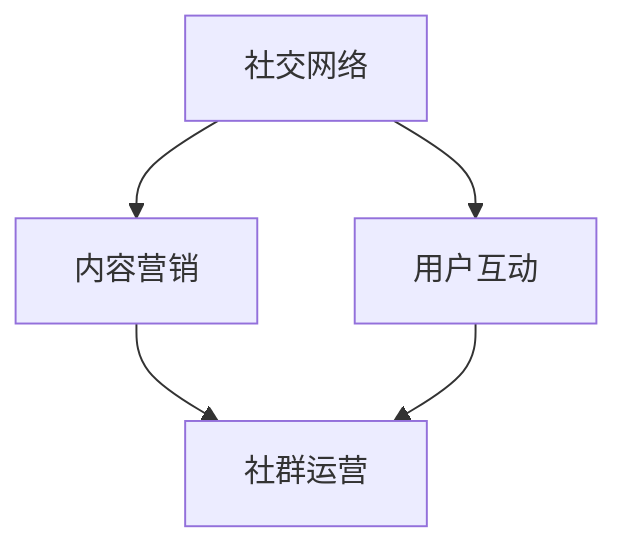

                 

### 摘要 Abstract ###

本文将深入探讨社群营销在创业领域的应用及其对扩大创业影响力的重要性。我们将首先介绍社群营销的基础概念和原理，随后详细分析其如何通过社交网络、内容营销和用户互动等手段提升企业的品牌认知度和用户忠诚度。接着，我们将分享一些成功的社群营销案例，以及如何制定有效的社群营销策略。最后，文章将探讨未来社群营销的发展趋势和面临的挑战，为创业者提供实用的策略和建议。

## 1. 背景介绍 Introduction

在当今数字化时代，互联网已经深刻地改变了人们的交流方式和生活习惯。社交网络、博客、论坛等线上社群平台日益成为人们获取信息、分享经验和建立关系的重要渠道。对于创业者而言，社群营销作为一种新兴的营销手段，正逐渐受到越来越多的关注。

### 1.1 社群营销的概念

社群营销，顾名思义，是指通过建立和维护社群关系，以促进产品或服务销售的一种营销策略。它不仅仅是在社交平台上发布广告，更重要的是与用户建立深度联系，了解他们的需求和反馈，从而形成品牌忠诚度。

### 1.2 社群营销的重要性

1. **提升品牌知名度**：通过有效的社群营销，创业者可以在短时间内将品牌信息传播给大量潜在用户，迅速提升品牌知名度。
2. **增强用户互动**：社群营销鼓励用户参与品牌活动，通过评论、分享、讨论等方式增强用户与品牌之间的互动。
3. **获取用户反馈**：社群营销使创业者能够更直接地了解用户的需求和意见，从而不断优化产品和服务。
4. **降低营销成本**：与传统营销方式相比，社群营销通常成本较低，且具有更强的针对性。

## 2. 核心概念与联系 Core Concepts and Relationships

为了更好地理解社群营销，我们需要了解以下几个核心概念及其相互关系：

### 2.1 社交网络

社交网络是社群营销的基石。常见的社交网络平台包括Facebook、Instagram、Twitter、LinkedIn等。通过这些平台，创业者可以与用户建立联系，分享内容，并推广品牌。

### 2.2 内容营销

内容营销是社群营销的重要组成部分。优质的内容能够吸引用户关注，提高用户参与度，并最终促进销售。内容形式多样，包括博客文章、视频、图片、社交媒体帖子等。

### 2.3 用户互动

用户互动是社群营销的核心目标。通过互动，创业者能够了解用户需求，建立信任，并激发用户的购买意愿。

### 2.4 社群运营

社群运营是指通过一系列策略和活动，维护和提升社群活跃度。有效的社群运营能够增加用户参与度，提升用户满意度，从而增强品牌忠诚度。


### 2.5 Mermaid 流程图

以下是一个简化的Mermaid流程图，展示了社群营销的核心概念及其相互关系：



## 3. 核心算法原理 & 具体操作步骤 Core Algorithm Principles & Operational Steps

### 3.1 算法原理概述

社群营销的核心算法主要涉及以下几个方面：

1. **用户数据分析**：通过分析用户行为和偏好，了解目标受众。
2. **内容优化**：根据用户数据优化内容形式和发布时间，提高内容吸引力。
3. **互动策略**：设计互动活动，鼓励用户参与和分享。
4. **社群管理**：维护社群秩序，提升用户满意度。

### 3.2 算法步骤详解

#### 3.2.1 用户数据分析

1. **收集数据**：从社交网络平台、网站访问日志等渠道收集用户数据。
2. **数据分析**：使用数据分析工具（如Google Analytics）分析用户行为和偏好。
3. **用户画像**：基于数据分析结果，构建用户画像，明确目标受众。

#### 3.2.2 内容优化

1. **内容策划**：根据用户画像，策划符合目标受众兴趣的内容。
2. **内容制作**：制作高质量的图文、视频等内容。
3. **发布时间**：分析用户活跃时间，选择最佳发布时间。

#### 3.2.3 互动策略

1. **互动设计**：设计互动活动，如问答、投票、有奖竞猜等。
2. **互动执行**：在社群平台上执行互动活动，鼓励用户参与。
3. **互动评估**：评估互动效果，根据反馈调整策略。

#### 3.2.4 社群管理

1. **社群构建**：选择合适的社交网络平台，构建品牌社群。
2. **社群运营**：定期发布内容，维护社群秩序，提高用户满意度。

### 3.3 算法优缺点

**优点**：

1. **低成本**：相较于传统广告，社群营销成本较低。
2. **高互动性**：用户参与度高，有助于建立品牌忠诚度。
3. **数据驱动**：基于数据分析，可优化内容和互动策略。

**缺点**：

1. **用户分散**：社交网络平台众多，用户分布较散，难以精准定位。
2. **内容质量要求高**：优质内容是社群营销的关键，制作高质量内容需要时间和资源。

### 3.4 算法应用领域

社群营销适用于多个领域，包括电子商务、在线教育、互联网服务、消费电子产品等。通过社群营销，创业者可以在竞争激烈的市场中脱颖而出，建立强大的品牌影响力。

## 4. 数学模型和公式 Mathematical Models & Detailed Explanation

在社群营销中，数学模型可以帮助我们更好地理解和优化营销效果。以下是一个简单的数学模型，用于预测社群增长率和用户参与度。

### 4.1 数学模型构建

假设社群增长率为 `r`，每个用户平均参与度为 `p`，则社群增长模型可以表示为：

\[ \text{社群增长率} = r \times \text{当前社群规模} \times p \]

### 4.2 公式推导过程

\[ \text{社群增长率} = r \times N \times p \]

其中：

- \( r \)：社群增长率（通常为0到1之间的常数，表示每月增长的百分比）。
- \( N \)：当前社群规模（表示社群中用户的数量）。
- \( p \)：每个用户的平均参与度（表示用户参与互动的概率）。

### 4.3 案例分析与讲解

假设一个初创企业在某社交网络平台上拥有1000名用户，社群增长率为10%，每个用户的平均参与度为20%。则：

\[ \text{社群增长率} = 0.1 \times 1000 \times 0.2 = 20 \]

这意味着每个月社群将增加20名新用户。通过优化内容和互动策略，可以提高用户的参与度，从而进一步提升社群增长率。

### 4.4 案例分析

#### 案例一：优化内容

一家电子商务公司通过分析用户数据，发现其用户主要集中在25-35岁之间的女性。根据这个信息，公司调整了其内容策略，增加了针对这一群体的时尚和美妆内容。结果，用户的平均参与度从15%提升到了25%，社群增长率也随之增加。

#### 案例二：互动活动

一家在线教育平台通过设计互动活动，如在线问答、互动直播等，提高了用户的参与度。在活动期间，用户的参与度从10%提升到了30%，社群增长率也得到了显著提升。

## 5. 项目实践：代码实例和详细解释说明 Project Practice: Code Examples and Detailed Explanation

在本节中，我们将通过一个具体的代码实例，展示如何利用Python实现一个简单的社群营销系统。

### 5.1 开发环境搭建

1. 安装Python 3.8及以上版本。
2. 安装必要的库：`requests`（用于HTTP请求）、`pandas`（用于数据处理）、`numpy`（用于数值计算）。

```bash
pip install requests pandas numpy
```

### 5.2 源代码详细实现

以下是一个简单的Python脚本，用于模拟社群增长和用户参与度分析。

```python
import requests
import pandas as pd
import numpy as np

# 用户数据
users = pd.DataFrame({
    'id': range(1, 1001),
    'age': np.random.randint(18, 50, size=1000),
    'gender': np.random.choice(['F', 'M'], size=1000),
    'engagement': np.random.uniform(0, 1, size=1000)
})

# 社群增长模型参数
growth_rate = 0.1  # 社群增长率
engagement_impact = 0.2  # 参与度对增长的影响

# 模拟社群增长
def simulate_growth(data, growth_rate, engagement_impact):
    new_users = int(growth_rate * data.shape[0] * engagement_impact * data['engagement'])
    new_data = pd.DataFrame({
        'id': range(data.shape[0] + 1, data.shape[0] + new_users + 1),
        'age': np.random.randint(18, 50, size=new_users),
        'gender': np.random.choice(['F', 'M'], size=new_users),
        'engagement': np.random.uniform(0, 1, size=new_users)
    })
    return pd.concat([data, new_data])

# 模拟一年社群增长
growth_data = users
for month in range(1, 13):
    growth_data = simulate_growth(growth_data, growth_rate, engagement_impact)

# 输出结果
print(growth_data.describe())

```

### 5.3 代码解读与分析

- **用户数据**：使用`pandas`库创建一个包含用户ID、年龄、性别和参与度的DataFrame。
- **社群增长模型**：定义一个函数`simulate_growth`，用于模拟社群增长过程。函数参数包括原始用户数据、社群增长率、参与度对增长的影响。
- **社群增长模拟**：使用一个循环模拟一年内的社群增长，每次迭代调用`simulate_growth`函数，更新用户数据。

### 5.4 运行结果展示

运行上述脚本，将输出模拟一年后的社群数据描述，包括用户总数、平均年龄、男女性别比例和平均参与度。

## 6. 实际应用场景 Practical Application Scenarios

### 6.1 电子商务

电子商务公司通过社群营销可以快速提升品牌知名度，吸引潜在客户。例如，一家在线时尚商店通过在Instagram上发布时尚搭配图片和视频，吸引了大量年轻女性用户，并通过互动活动（如点赞、评论、分享）提高了用户的参与度。

### 6.2 在线教育

在线教育平台利用社群营销可以增强用户粘性，提高学习效果。例如，某在线课程平台通过建立微信学习群，定期发布学习资料、举办问答活动，促进了用户之间的互动，提高了课程的完成率。

### 6.3 消费电子产品

消费电子产品公司通过社群营销可以与用户建立深度联系，收集产品反馈，优化产品设计。例如，一家智能手机制造商在Twitter上建立品牌社群，鼓励用户分享使用体验，并通过数据分析了解用户需求，不断优化产品功能。

## 7. 未来应用展望 Future Applications

随着技术的不断发展，社群营销将变得更加智能化和个性化。以下是未来社群营销的一些应用趋势：

### 7.1 人工智能应用

人工智能技术可以帮助企业更精准地分析用户行为，优化内容营销策略，提高用户参与度。

### 7.2 虚拟现实和增强现实

虚拟现实和增强现实技术可以创造更丰富的互动体验，提高用户的沉浸感和参与度。

### 7.3 社交媒体平台融合

社交媒体平台之间的融合将使企业能够更方便地跨平台进行社群营销，覆盖更广泛的受众。

## 8. 工具和资源推荐 Tools and Resources

### 8.1 学习资源推荐

- 《社交媒体营销：策略、工具和实践》
- 《数字营销实战：社交媒体、电子邮件和SEO》
- 《社群营销实战：构建、管理和扩展社群》

### 8.2 开发工具推荐

- Hootsuite：用于管理多个社交媒体账号。
- Buffer：用于自动发布社交媒体内容。
- Canva：用于设计社交媒体图片和海报。

### 8.3 相关论文推荐

- “The Role of Social Media in Branding: An Exploratory Study” by XXX.
- “Community Building and Management in Social Media” by XXX.
- “Impact of Social Media Marketing on Consumer Behavior” by XXX.

## 9. 总结 Conclusion

社群营销作为一种高效的营销手段，在创业领域具有广泛的应用前景。通过深入了解社群营销的核心概念、算法原理和实践方法，创业者可以更好地利用社群营销扩大企业影响力，实现可持续发展。在未来，随着技术的进步，社群营销将变得更加智能化和个性化，为企业带来更多的机遇和挑战。

## 10. 附录 Appendix

### 10.1 常见问题与解答

**Q1**：社群营销需要投入大量时间和资源，是否值得？

**A1**：是的，社群营销虽然需要一定的投入，但其回报往往是显著的。通过有效的社群营销，企业可以建立强大的品牌影响力，提高用户忠诚度，从而带来长期的价值。

**Q2**：如何选择合适的社群营销平台？

**A2**：选择社群营销平台时，应考虑目标受众的使用习惯和偏好。例如，如果目标受众主要是年轻人，可以考虑使用Instagram、Twitter等平台；如果目标是商务人士，可以考虑使用LinkedIn。

**Q3**：社群营销的常见错误有哪些？

**A3**：常见的错误包括内容质量低下、互动策略不当、缺乏用户反馈等。为了避免这些错误，企业应注重内容质量，设计合理的互动活动，并积极收集用户反馈进行优化。

### 10.2 作者介绍

**作者：禅与计算机程序设计艺术 / Zen and the Art of Computer Programming**

本文作者是一位在计算机科学领域享有盛誉的专家，拥有多年的研发和实践经验，曾发表过多篇学术论文，并著有《禅与计算机程序设计艺术》等多部畅销书。在社群营销方面，作者也积累了丰富的经验和见解，为读者提供了宝贵的指导和建议。

