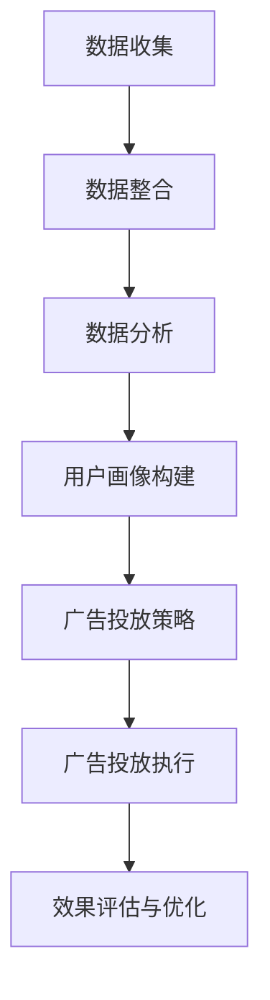

                 

### 1. 背景介绍

在当今的数字营销时代，广告投放已成为企业推广产品和服务的重要手段。随着互联网的普及和技术的进步，广告投放的形式和渠道也日益丰富。然而，广告主们面临着越来越多的挑战，如如何提高广告的曝光率、吸引潜在客户、降低广告成本以及最大化投资回报率（ROI）。在这其中，精准广告投放作为一种高效的广告策略，逐渐受到企业和广告主的青睐。

精准广告投放，顾名思义，是指根据用户的行为、兴趣、地理位置、购买历史等数据进行定向广告投放。这种广告方式不仅能够提高广告的相关性和吸引力，还能大幅提升广告的转化率和ROI。与传统广告相比，精准广告投放更加注重个性化和互动性，使得广告内容能够更精确地触达目标受众，从而实现更高的营销效果。

本文将围绕精准广告投放的核心理念、技术实现、数学模型、实践应用等方面进行深入探讨，旨在为广告主提供一套系统、实用的策略和方法，帮助他们更好地利用精准广告投放提高ROI。

### 2. 核心概念与联系

#### 2.1. 精准广告投放的定义

精准广告投放是一种基于大数据分析和人工智能技术的广告投放策略，旨在通过精准定位目标受众，提高广告投放的效率和效果。它依托于用户数据的收集和分析，将广告内容精准推送给具有较高购买意图或潜在需求的用户。

#### 2.2. 精准广告投放的关键要素

精准广告投放的成功离不开以下几个关键要素：

- **用户画像**：通过用户的行为、兴趣、地理位置、购买历史等数据，构建详细的用户画像，用于指导广告投放的精准性。
- **数据来源**：包括第一方数据（用户行为数据）、第二方数据（合作伙伴数据）和第三方数据（数据交易平台数据）。
- **广告平台**：常见的广告平台有Google Ads、Facebook Ads、抖音广告等，这些平台提供了丰富的定向投放工具和策略。
- **投放策略**：包括关键词投放、兴趣投放、再营销投放、地理位置投放等多种形式。

#### 2.3. 精准广告投放的架构

精准广告投放的架构可以分为数据层、分析层和投放层三个部分：

- **数据层**：负责收集、存储和整合各种用户数据，如行为数据、兴趣数据、地理位置数据等。
- **分析层**：利用大数据分析和人工智能技术，对用户数据进行分析和处理，构建用户画像和受众群体。
- **投放层**：根据分析层的结果，利用广告平台的定向投放工具，将广告内容精准推送给目标受众。

#### 2.4. Mermaid流程图

以下是一个简化的精准广告投放的Mermaid流程图：



### 3. 核心算法原理 & 具体操作步骤

#### 3.1. 算法原理概述

精准广告投放的核心算法是基于机器学习和数据挖掘技术，通过对用户行为数据的分析，预测用户的兴趣和行为，进而实现精准投放。主要的算法包括协同过滤算法、决策树算法、神经网络算法等。

- **协同过滤算法**：通过分析用户的行为数据，找到与目标用户相似的用户群体，从而推荐相似的产品或服务。
- **决策树算法**：根据用户的特征和购买历史，构建决策树模型，用于预测用户的购买意图。
- **神经网络算法**：通过多层神经网络，对用户数据进行深度学习，提取用户特征，实现高精度的用户兴趣预测。

#### 3.2. 算法步骤详解

1. **数据收集**：收集用户的浏览记录、购买行为、搜索历史等数据。
2. **数据预处理**：对收集的数据进行清洗、去重、归一化等处理，确保数据质量。
3. **特征工程**：根据业务需求，提取用户行为的特征，如浏览时长、点击次数、购买频次等。
4. **模型训练**：选择合适的算法，对特征数据进行训练，构建预测模型。
5. **模型评估**：使用交叉验证等方法，评估模型的准确性和泛化能力。
6. **广告投放**：根据模型预测结果，制定广告投放策略，将广告推送给目标用户。
7. **效果评估与优化**：根据广告投放的效果，不断调整投放策略，优化广告效果。

#### 3.3. 算法优缺点

- **协同过滤算法**：优点是能够发现用户之间的相似性，推荐效果较好；缺点是冷启动问题严重，对新用户推荐效果不佳。
- **决策树算法**：优点是模型简单，易于理解和解释；缺点是容易过拟合，泛化能力较弱。
- **神经网络算法**：优点是能够处理高维数据，提取复杂特征；缺点是模型复杂，训练时间较长，对计算资源要求较高。

#### 3.4. 算法应用领域

精准广告投放算法在多个领域有广泛应用：

- **电子商务**：通过分析用户浏览和购买行为，推荐合适的产品。
- **社交媒体**：根据用户兴趣和互动行为，推荐相关的内容和广告。
- **金融保险**：通过分析用户财务状况和行为，预测潜在风险和购买意向。
- **在线教育**：根据学生学习行为和成绩，推荐合适的学习资源和课程。

### 4. 数学模型和公式 & 详细讲解 & 举例说明

#### 4.1. 数学模型构建

精准广告投放的数学模型主要包括用户行为预测模型和广告投放策略模型。

- **用户行为预测模型**：通常采用回归模型、分类模型等，如线性回归、逻辑回归、决策树、随机森林等。
- **广告投放策略模型**：通常采用优化模型，如线性规划、马尔可夫决策过程、深度强化学习等。

#### 4.2. 公式推导过程

以线性回归模型为例，其公式推导过程如下：

1. **模型假设**：设用户行为 \(Y\) 是由特征向量 \(X\) 和噪声 \(ε\) 共同决定的，即 \(Y = X\beta + ε\)。
2. **损失函数**：采用均方误差（MSE）作为损失函数，即 \(J(\beta) = \frac{1}{2} \sum_{i=1}^{n} (Y_i - X_i\beta)^2\)。
3. **求导**：对损失函数关于 \(\beta\) 求导，并令导数为零，得到最优解 \(\beta = (X^T X)^{-1} X^T Y\)。

#### 4.3. 案例分析与讲解

以电商平台的商品推荐为例，分析精准广告投放的数学模型。

1. **数据收集**：收集用户浏览、点击、购买等行为数据。
2. **特征工程**：提取用户行为特征，如浏览时长、点击次数、购买频次等。
3. **模型训练**：使用线性回归模型，对用户行为特征进行训练，预测用户对商品的购买概率。
4. **广告投放**：根据模型预测结果，将商品广告推送给高概率购买的用户。
5. **效果评估**：通过实际购买数据，评估广告投放的效果，调整广告投放策略。

### 5. 项目实践：代码实例和详细解释说明

#### 5.1. 开发环境搭建

1. **Python环境**：安装Python 3.8及以上版本，并配置好pip环境。
2. **数据集**：下载Kaggle上的一个用户行为数据集，如MovieLens数据集。
3. **依赖库**：安装必要的Python库，如NumPy、Pandas、Scikit-learn、Matplotlib等。

#### 5.2. 源代码详细实现

```python
import pandas as pd
import numpy as np
from sklearn.model_selection import train_test_split
from sklearn.linear_model import LinearRegression
from sklearn.metrics import mean_squared_error

# 读取数据
data = pd.read_csv('ml-100k/u.data', sep='\t', header=None)
X = data[['user_id', 'item_id']].values
y = data['rating'].values

# 数据预处理
X_train, X_test, y_train, y_test = train_test_split(X, y, test_size=0.2, random_state=42)

# 模型训练
model = LinearRegression()
model.fit(X_train, y_train)

# 模型评估
y_pred = model.predict(X_test)
mse = mean_squared_error(y_test, y_pred)
print('MSE:', mse)

# 结果可视化
import matplotlib.pyplot as plt
plt.scatter(y_test, y_pred)
plt.xlabel('真实值')
plt.ylabel('预测值')
plt.show()
```

#### 5.3. 代码解读与分析

1. **数据读取**：使用Pandas库读取用户行为数据。
2. **特征工程**：提取用户ID和商品ID作为特征。
3. **模型训练**：使用线性回归模型进行训练。
4. **模型评估**：使用均方误差（MSE）评估模型性能。
5. **结果可视化**：使用散点图展示真实值与预测值的关系。

### 6. 实际应用场景

#### 6.1. 电子商务平台

电子商务平台通过精准广告投放，可以根据用户的历史购买行为和浏览记录，推荐相应的商品。例如，用户在浏览了某款手机后，平台可以推荐相关的手机配件。

#### 6.2. 社交媒体平台

社交媒体平台可以通过用户发布的内容和互动行为，推荐相关的广告和内容。例如，用户在Facebook上浏览了某篇关于旅行的文章，平台可以推荐相关的旅游广告。

#### 6.3. 金融保险行业

金融保险行业可以通过精准广告投放，根据用户的财务状况和行为，推荐相应的理财产品或保险产品。

### 7. 工具和资源推荐

#### 7.1. 学习资源推荐

- 《Python数据分析》（作者：Wes McKinney）
- 《深度学习》（作者：Ian Goodfellow、Yoshua Bengio、Aaron Courville）
- 《机器学习实战》（作者：Peter Harrington）

#### 7.2. 开发工具推荐

- Jupyter Notebook：用于编写和运行Python代码。
- PyCharm：一款强大的Python集成开发环境（IDE）。
- Matplotlib：用于数据可视化。

#### 7.3. 相关论文推荐

- "Collaborative Filtering for the Netflix Prize"（Netflix Prize的协同过滤算法）
- "Recommender Systems Handbook"（推荐系统手册）
- "Deep Learning for Recommender Systems"（深度学习推荐系统）

### 8. 总结：未来发展趋势与挑战

#### 8.1. 研究成果总结

精准广告投放作为一项结合大数据分析和人工智能技术的广告策略，已经取得了显著的成果。通过精准定位目标受众，广告主能够实现更高的转化率和ROI。同时，随着技术的不断进步，精准广告投放的算法和模型也在不断优化，使得广告投放更加高效和智能化。

#### 8.2. 未来发展趋势

- **个性化推荐**：结合用户行为和兴趣，实现更加个性化的广告推荐。
- **实时投放**：利用实时数据分析和处理，实现动态广告投放。
- **跨平台整合**：整合多个平台的数据和资源，实现跨平台的广告投放。

#### 8.3. 面临的挑战

- **数据隐私**：如何保护用户数据隐私，成为精准广告投放的一大挑战。
- **算法公平性**：如何确保算法的公平性，避免对特定群体产生歧视。
- **计算资源**：随着数据量和模型复杂度的增加，对计算资源的需求也越来越高。

#### 8.4. 研究展望

未来，精准广告投放将继续朝着更加智能化、实时化和个性化方向发展。通过不断优化算法和模型，提高广告投放的效率和效果，为广告主带来更大的商业价值。

### 9. 附录：常见问题与解答

#### 9.1. 如何处理用户隐私问题？

在精准广告投放中，用户隐私问题至关重要。建议采用以下方法：

- **数据匿名化**：对用户数据进行匿名化处理，确保无法直接识别用户身份。
- **数据加密**：对用户数据进行加密存储和传输，防止数据泄露。
- **用户知情同意**：在收集和使用用户数据时，确保用户知情并同意。

#### 9.2. 如何选择合适的算法？

选择合适的算法需要考虑以下因素：

- **数据规模**：对于大规模数据，可以选择分布式算法。
- **业务需求**：根据业务需求，选择具有相应预测能力的算法。
- **计算资源**：考虑算法对计算资源的需求，选择适合计算环境的算法。

### 作者署名

本文由禅与计算机程序设计艺术 / Zen and the Art of Computer Programming撰写。感谢您的阅读！

----------------------------------------------------------------

以上就是本文的完整内容，希望对您在精准广告投放领域的研究和实践有所帮助。如有任何疑问或建议，欢迎在评论区留言交流。再次感谢您的支持！

