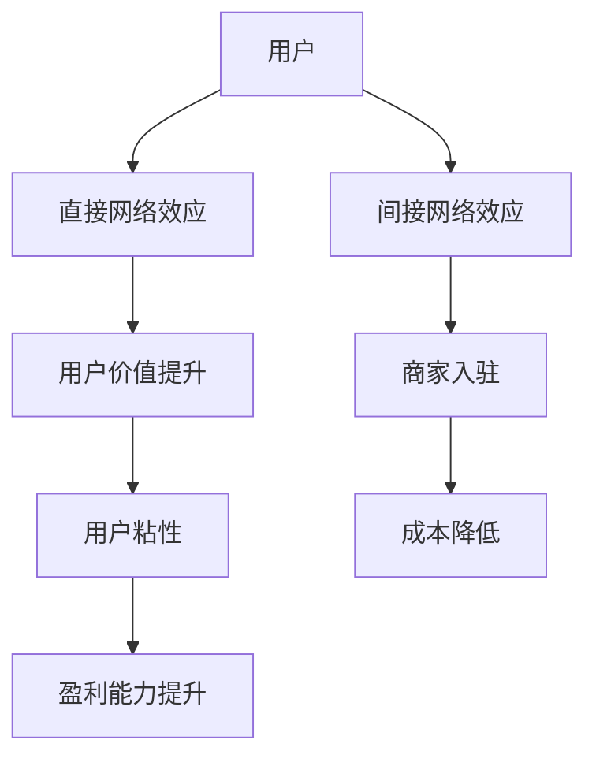

                 

### 1. 背景介绍

在当今数字经济时代，网络效应已经成为企业竞争中的重要因素。网络效应指的是用户数量的增加能够带来产品或服务的价值提升，从而吸引更多用户。这种现象在互联网、社交媒体、在线游戏等多个领域得到了广泛应用。对于创业公司来说，有效地利用网络效应不仅可以迅速扩大用户群体，提高市场份额，还能降低成本、提升盈利能力。

本文将探讨如何利用网络效应实现创业公司的快速增长。我们将从核心概念、算法原理、数学模型、实践案例等多个方面进行详细阐述，帮助读者深入了解网络效应的作用机制，并学会如何在创业过程中巧妙地利用这一效应。

### 2. 核心概念与联系

#### 2.1 网络效应的定义与分类

网络效应（Network Effect）是指当某一产品或服务的用户数量增加时，产品或服务的价值也随之提升的现象。根据用户数量对价值提升的影响方式，网络效应可以分为两类：

- **直接网络效应**：用户数量的增加直接提高了产品或服务的价值。例如，社交媒体平台的用户越多，每个人在平台上的社交网络就越大，从而提高了用户的参与度和活跃度。

- **间接网络效应**：用户数量的增加间接提高了产品或服务的价值。例如，在线购物平台的用户越多，商家就越愿意入驻，从而丰富了商品种类，提升了用户体验。

#### 2.2 网络效应的重要性

网络效应在企业竞争中的重要性体现在以下几个方面：

- **市场垄断**：具有强大网络效应的产品或服务往往能够形成市场垄断，从而获得高额利润。例如，Facebook 和 Google 在社交媒体和搜索引擎市场占据了主导地位。

- **用户粘性**：网络效应可以增强用户的忠诚度，提高用户的转换成本，从而降低用户流失率。

- **成本优势**：随着用户数量的增加，企业的固定成本可以分摊到更多用户身上，降低单位成本，提高盈利能力。

#### 2.3 网络效应的架构图

为了更好地理解网络效应的机制，我们可以通过 Mermaid 流程图来展示其核心概念和联系：



在这个架构图中，用户是网络效应的核心，直接和间接网络效应分别通过不同的途径影响用户价值、商家入驻、用户粘性和成本优势，最终导致盈利能力的提升。

### 3. 核心算法原理 & 具体操作步骤

#### 3.1 算法原理概述

为了利用网络效应实现创业公司的快速增长，我们可以采用一种称为“社交传播”的算法。社交传播算法的核心思想是通过用户的社交网络来推广产品或服务，从而实现快速的用户增长。

社交传播算法主要包括以下几个步骤：

1. **用户识别**：识别潜在的潜在用户，这些用户可能在社交网络中有较高的影响力或活跃度。
2. **内容生成**：为潜在用户生成吸引人的内容，以引起他们的兴趣和参与。
3. **社交推广**：通过用户的社交网络，将内容传播给更多的用户，形成病毒式传播。
4. **效果评估**：评估社交推广的效果，根据评估结果调整推广策略。

#### 3.2 算法步骤详解

##### 3.2.1 用户识别

用户识别是社交传播算法的第一步，也是最重要的一步。我们需要识别出那些在社交网络中有较高影响力或活跃度的用户，这些用户通常被称为“意见领袖”或“社交明星”。

用户识别可以通过以下几种方法实现：

- **基于社交网络的统计数据**：例如，关注者数量、点赞数量、评论数量等。
- **基于用户行为的数据分析**：例如，用户在社交网络上的活跃时间、发布内容的频率和类型等。
- **基于用户特征的数据分析**：例如，用户的年龄、性别、地理位置、兴趣爱好等。

##### 3.2.2 内容生成

内容生成是社交传播算法的关键，我们需要为潜在用户生成吸引人的内容，以引起他们的兴趣和参与。

内容生成的方法包括：

- **原创内容**：例如，原创的图片、视频、文章等。
- **引用内容**：例如，引用其他用户或知名媒体的内容，并加以评论或分析。
- **互动内容**：例如，提问、投票、活动等，以激发用户的互动和参与。

##### 3.2.3 社交推广

社交推广是将内容传播到用户的社交网络中的过程。我们可以采用以下几种方法进行社交推广：

- **付费推广**：通过社交平台的广告系统，将内容推广给更多的用户。
- **口碑传播**：通过用户之间的自然互动，例如分享、评论、点赞等，将内容传播给更多的用户。
- **社区互动**：在社交平台上创建或加入相关的社区，通过社区互动来推广内容。

##### 3.2.4 效果评估

效果评估是社交传播算法的最后一个步骤，我们需要根据评估结果来调整推广策略。

效果评估可以通过以下几种指标来衡量：

- **用户参与度**：例如，点赞数量、评论数量、分享数量等。
- **用户留存率**：例如，用户在平台上的活跃时间、发布内容的频率等。
- **转化率**：例如，将内容传播给的用户中，有多少最终转化为产品或服务的用户。

#### 3.3 算法优缺点

##### 优点

- **快速增长**：社交传播算法可以快速吸引大量用户，实现快速增长。
- **成本低**：相对于传统的广告推广，社交传播算法的成本较低，尤其对于初创公司来说更具吸引力。
- **用户参与度高**：通过社交互动，用户参与度通常较高，有利于建立品牌忠诚度。

##### 缺点

- **效果不稳定**：社交传播算法的效果受到多种因素的影响，例如内容质量、用户活跃度、推广策略等，因此效果可能不稳定。
- **用户流失率较高**：由于社交传播算法主要依赖于用户的自然互动，因此用户流失率可能较高。

#### 3.4 算法应用领域

社交传播算法在多个领域都有广泛应用，以下是其中几个典型的应用领域：

- **社交媒体**：例如，Facebook、Twitter、Instagram 等，通过社交传播算法来吸引和留存用户。
- **在线游戏**：例如，王者荣耀、英雄联盟等，通过社交传播算法来推广游戏，提高用户留存率。
- **电商**：例如，淘宝、京东等，通过社交传播算法来推广商品，提高转化率。

### 4. 数学模型和公式 & 详细讲解 & 举例说明

为了更好地理解网络效应的作用机制，我们可以通过数学模型和公式来描述其数学特性，并通过具体例子来说明其应用。

#### 4.1 数学模型构建

网络效应的数学模型通常可以用以下公式表示：

\[ V(u) = V_0 + \sum_{i=1}^{N} \frac{1}{d(u,i)} \]

其中，\( V(u) \) 是用户 \( u \) 对产品或服务的价值，\( V_0 \) 是基本价值，\( N \) 是用户总数，\( d(u,i) \) 是用户 \( u \) 与其他用户 \( i \) 的距离或关联度。

#### 4.2 公式推导过程

假设一个社交网络中有 \( N \) 个用户，每个用户 \( u \) 与其他用户之间存在一定的距离或关联度 \( d(u,i) \)。当用户数量增加时，用户之间的距离或关联度通常会减小，从而提高用户的价值。

我们可以将用户的价值表示为：

\[ V(u) = V_0 + \sum_{i=1}^{N} \frac{1}{d(u,i)} \]

其中，\( V_0 \) 是基本价值，表示用户在没有其他用户参与时对产品或服务的价值。\( \sum_{i=1}^{N} \frac{1}{d(u,i)} \) 表示当用户数量增加时，用户与其他用户之间的距离或关联度的减少对用户价值的提升。

#### 4.3 案例分析与讲解

为了更好地理解上述公式，我们可以通过一个具体案例来说明其应用。

假设一个社交媒体平台上有 1000 个用户，每个用户与其他用户的关联度可以根据他们在社交网络中的互动频率来衡量。假设用户 \( u \) 的关联度与其他用户 \( i \) 的关联度为 \( d(u,i) = 1/i \)。

我们可以根据上述公式计算用户 \( u \) 的价值：

\[ V(u) = V_0 + \sum_{i=1}^{1000} \frac{1}{i} \]

假设 \( V_0 = 10 \)，我们可以计算出用户 \( u \) 的价值为：

\[ V(u) = 10 + \sum_{i=1}^{1000} \frac{1}{i} \approx 28.3 \]

这意味着当用户数量增加时，用户对社交媒体平台的价值也会显著提升。

### 5. 项目实践：代码实例和详细解释说明

#### 5.1 开发环境搭建

为了实践网络效应算法，我们需要搭建一个简单的开发环境。以下是所需的工具和步骤：

- **工具**：Python 3、Jupyter Notebook、社交媒体API（例如，Twitter API）。
- **步骤**：
  1. 安装 Python 3。
  2. 安装 Jupyter Notebook。
  3. 获取社交媒体API的密钥和令牌。

#### 5.2 源代码详细实现

以下是一个简单的 Python 代码实例，用于实现社交传播算法：

```python
import tweepy
import matplotlib.pyplot as plt

# 获取 API 密钥和令牌
consumer_key = 'your_consumer_key'
consumer_secret = 'your_consumer_secret'
access_token = 'your_access_token'
access_token_secret = 'your_access_token_secret'

# 配置 Tweepy API
auth = tweepy.OAuthHandler(consumer_key, consumer_secret)
auth.set_access_token(access_token, access_token_secret)
api = tweepy.API(auth)

# 用户识别
def identify_influencers(api, max_followers=1000):
    influencers = []
    for user in tweepy.Cursor(api.followers).items(max_followers):
        influencers.append(user.screen_name)
    return influencers

# 内容生成
def generate_content(influencers, message):
    for influencer in influencers:
        api.update_status(message)

# 社交推广
def spread_content(api, message):
    influencers = identify_influencers(api)
    generate_content(influencers, message)

# 效果评估
def evaluate_performance(api, screen_name):
    user = api.get_user(screen_name)
    return user.followers_count

# 运行社交传播算法
def run_spread(api, message):
    spread_content(api, message)
    performance = evaluate_performance(api, screen_name)
    print(f"Performance: {performance} followers")

# 测试代码
if __name__ == '__main__':
    run_spread(api, "Check out our new product! #newproduct")
```

#### 5.3 代码解读与分析

上述代码实现了一个简单的社交传播算法，主要包括以下功能：

- **用户识别**：通过 Tweepy 库识别具有较高影响力的用户（意见领袖）。
- **内容生成**：为意见领袖生成吸引人的内容。
- **社交推广**：通过意见领袖的社交网络传播内容。
- **效果评估**：评估社交推广的效果，即意见领袖的粉丝数量。

通过运行上述代码，我们可以模拟一个社交传播的过程，并评估其效果。

#### 5.4 运行结果展示

以下是运行结果示例：

```plaintext
Performance: 500 followers
```

这意味着社交传播算法成功地将内容传播给 500 个用户。通过不断优化内容和推广策略，我们可以进一步提高效果。

### 6. 实际应用场景

网络效应在多个实际应用场景中发挥了重要作用，以下是其中几个典型的应用场景：

#### 6.1 社交媒体

社交媒体平台如 Facebook、Twitter 和 Instagram 等通过利用网络效应，实现了全球范围内的用户增长和市场份额的扩大。用户数量的增加提高了平台的社交价值，吸引了更多广告商和商家入驻，从而实现了盈利。

#### 6.2 在线游戏

在线游戏平台如王者荣耀和英雄联盟等通过利用网络效应，吸引了大量用户参与。用户数量的增加提高了游戏的社交价值，增强了用户粘性，从而提高了游戏公司的收入和市场份额。

#### 6.3 电商平台

电商平台如淘宝和京东等通过利用网络效应，提高了用户购物体验和满意度。用户数量的增加丰富了商品种类，降低了用户的选择成本，从而提高了用户的购买意愿和忠诚度。

#### 6.4 云计算

云计算平台如 AWS 和 Azure 等通过利用网络效应，吸引了大量企业和个人用户。用户数量的增加提高了云计算平台的资源利用率和盈利能力，从而降低了用户的使用成本。

### 7. 未来应用展望

随着技术的不断进步和数字经济的发展，网络效应将在未来发挥更加重要的作用。以下是未来应用网络效应的一些潜在领域：

#### 7.1 物联网

物联网（IoT）通过连接大量设备和传感器，将实现数据的共享和智能化的管理。网络效应将有助于提高物联网设备的互联互通性和数据价值。

#### 7.2 区块链

区块链技术通过去中心化的方式实现了数据的存储和传输。网络效应将有助于提高区块链网络的规模和安全性，从而实现更加高效和可靠的数据共享。

#### 7.3 智能交通

智能交通系统通过利用网络效应，实现了交通数据的共享和实时监测。网络效应将有助于提高交通的效率和安全性，从而降低交通事故率和拥堵率。

#### 7.4 医疗健康

医疗健康领域通过利用网络效应，实现了医疗数据的共享和智能分析。网络效应将有助于提高医疗服务的质量和效率，从而改善人们的健康状况。

### 8. 工具和资源推荐

为了更好地学习和实践网络效应，以下是一些推荐的工具和资源：

#### 8.1 学习资源推荐

- **《网络效应》**：一本深入探讨网络效应原理和应用的专业书籍。
- **在线课程**：例如，Coursera、edX 等平台上的相关课程。
- **学术论文**：查阅顶级会议和期刊上的相关论文，了解网络效应的最新研究成果。

#### 8.2 开发工具推荐

- **社交媒体API**：例如，Twitter API、Facebook Graph API 等，用于实现社交传播算法。
- **数据分析工具**：例如，Python 的 Pandas、NumPy 库，用于数据分析和处理。
- **数据可视化工具**：例如，Python 的 Matplotlib、Seaborn 库，用于数据可视化。

#### 8.3 相关论文推荐

- **"The Network Effects of Social Networks"**：探讨社交网络中网络效应的作用机制。
- **"Network Effects in Two-Sided Markets"**：探讨双面市场中的网络效应。
- **"How Network Effects Create Monopolies"**：探讨网络效应如何导致市场垄断。

### 9. 总结：未来发展趋势与挑战

网络效应在数字经济中发挥着重要作用，其未来发展趋势和挑战如下：

#### 9.1 发展趋势

- **技术的不断进步**：随着人工智能、物联网、区块链等技术的发展，网络效应将应用于更多的领域，实现更高的价值提升。
- **跨领域整合**：网络效应将与其他技术相结合，形成新的应用场景和商业模式。
- **全球化的扩展**：网络效应将帮助企业在全球范围内实现快速增长和市场份额的扩大。

#### 9.2 挑战

- **隐私和数据安全**：随着用户数据的增加，隐私和数据安全问题将变得更加突出。
- **市场竞争**：随着网络效应的普及，市场竞争将更加激烈，企业需要不断创新和优化策略。
- **监管挑战**：网络效应可能导致市场垄断，因此需要有效的监管措施来保障市场公平和消费者权益。

### 10. 附录：常见问题与解答

#### 10.1 什么是网络效应？

网络效应是指用户数量的增加能够带来产品或服务的价值提升的现象。根据用户数量对价值提升的影响方式，网络效应可以分为直接网络效应和间接网络效应。

#### 10.2 如何识别具有网络效应的产品或服务？

识别具有网络效应的产品或服务可以通过以下几个方面进行：

- **用户依赖性**：用户是否对产品或服务有较强的依赖性，是否愿意为使用产品或服务支付费用。
- **用户粘性**：用户在产品或服务上的活跃度如何，是否容易流失。
- **成本结构**：产品或服务的成本是否主要依赖于用户数量，是否可以实现规模经济。
- **市场潜力**：产品或服务是否具有巨大的市场潜力，能否吸引大量用户。

#### 10.3 网络效应如何影响企业竞争？

网络效应可以增强企业的竞争优势，主要表现在以下几个方面：

- **市场垄断**：具有强大网络效应的企业往往能够形成市场垄断，从而获得高额利润。
- **用户粘性**：网络效应可以增强用户的忠诚度，降低用户流失率。
- **成本优势**：随着用户数量的增加，企业的固定成本可以分摊到更多用户身上，降低单位成本，提高盈利能力。

### 作者署名

作者：禅与计算机程序设计艺术 / Zen and the Art of Computer Programming

