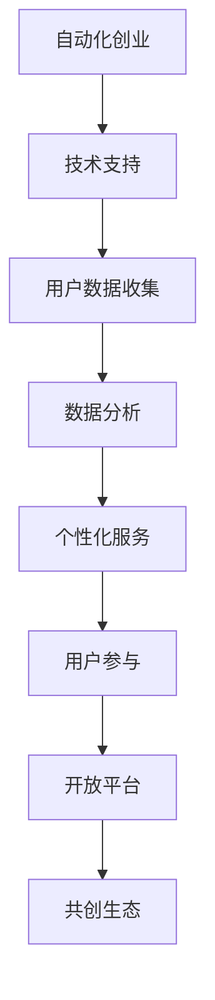

                 

关键词：自动化创业、用户赋能、技术创新、用户体验、商业模式、AI、机器学习、用户参与、数据驱动、开放平台、共创生态。

> 摘要：本文旨在探讨自动化创业领域中，如何通过技术创新和用户参与实现用户赋能。文章首先介绍了自动化创业的背景和核心概念，然后分析了用户赋能的重要性，并从多个角度提出了实现用户赋能的策略和方法。最后，对未来的发展趋势和挑战进行了展望。

## 1. 背景介绍

自动化创业正在成为现代商业的重要驱动力。随着人工智能（AI）、机器学习（ML）、物联网（IoT）等技术的迅速发展，企业可以利用这些技术实现业务流程的自动化，提高效率，降低成本。同时，用户对个性化和定制化服务的需求日益增长，这促使企业不断创新，以满足用户的多样化需求。

在自动化创业的浪潮中，用户赋能成为了一个关键议题。用户赋能指的是通过赋予用户更多控制权和参与度，提升他们的体验和价值。这不仅有助于提高用户满意度，还能增强用户忠诚度和口碑传播。

## 2. 核心概念与联系

### 2.1 自动化创业

自动化创业指的是利用自动化技术，如AI、ML、机器人等，来创建新的商业机会和商业模式。这些技术可以帮助企业自动化业务流程，实现高效运营，降低成本，并创造新的价值。

### 2.2 用户赋能

用户赋能是指通过赋予用户更多的控制权、选择权和参与度，提升他们的体验和价值。用户赋能可以通过以下方式实现：

1. **个性化服务**：通过分析用户数据，提供定制化的服务和推荐。
2. **用户参与**：鼓励用户参与产品设计和开发，收集用户反馈，优化产品功能。
3. **开放平台**：构建开放的平台，允许用户创建、分享和定制自己的内容和服务。

### 2.3 技术与用户赋能的联系

技术与用户赋能之间有着密切的联系。现代技术，如AI、ML，可以为用户赋能提供强大的支持。例如，通过分析用户行为数据，AI可以帮助企业更好地理解用户需求，提供个性化的服务。而开放平台则可以鼓励用户参与，共同创造价值。

### 2.4 Mermaid 流程图



## 3. 核心算法原理 & 具体操作步骤

### 3.1 算法原理概述

用户赋能的核心在于数据的收集、分析和应用。以下是用户赋能的核心算法原理：

1. **数据收集**：利用传感器、用户反馈、社交媒体等手段收集用户数据。
2. **数据分析**：使用机器学习和数据挖掘技术，分析用户数据，提取有价值的信息。
3. **个性化服务**：根据用户数据和需求，提供个性化的服务和建议。
4. **用户参与**：鼓励用户参与产品设计和改进，收集用户反馈，优化产品功能。
5. **开放平台**：构建开放平台，允许用户创建、分享和定制内容和服务。

### 3.2 算法步骤详解

1. **数据收集**：首先，企业需要收集用户数据，包括行为数据、偏好数据、反馈数据等。
2. **数据预处理**：对收集到的数据进行分析，去除噪声，提取有用信息。
3. **特征提取**：根据业务需求，从预处理后的数据中提取关键特征。
4. **模型训练**：使用机器学习算法，如决策树、神经网络等，对特征进行训练。
5. **个性化服务**：根据模型输出，为用户提供个性化的服务和建议。
6. **用户反馈**：收集用户反馈，对模型进行持续优化。
7. **开放平台**：构建开放平台，允许用户参与，共同创造价值。

### 3.3 算法优缺点

**优点**：

- 提高用户体验：通过个性化服务，满足用户的多样化需求，提高用户满意度。
- 提高效率：自动化流程，降低人力成本，提高运营效率。
- 创造新的商业模式：通过开放平台，鼓励用户参与，创造新的商业机会。

**缺点**：

- 数据隐私和安全：用户数据的安全和隐私保护是一个重要问题。
- 模型偏差：如果训练数据有偏差，模型可能会产生错误的输出。

### 3.4 算法应用领域

用户赋能算法广泛应用于电子商务、金融、医疗、教育等领域。例如，在电子商务领域，可以通过个性化推荐，提高销售转化率；在金融领域，可以通过风险评估，提高信贷审批的准确性；在医疗领域，可以通过患者数据，提高疾病诊断的准确性。

## 4. 数学模型和公式 & 详细讲解 & 举例说明

### 4.1 数学模型构建

用户赋能的数学模型主要包括用户行为预测模型、个性化推荐模型和用户参与模型。以下是这些模型的构建过程：

1. **用户行为预测模型**：

   - 目标：预测用户未来的行为。
   - 模型：可以使用回归分析、决策树、神经网络等。
   - 公式：\(P(y|x) = f(x; \theta)\)，其中\(P(y|x)\)表示在给定特征\(x\)的情况下，用户行为\(y\)的概率，\(f(x; \theta)\)是模型函数，\(\theta\)是模型参数。

2. **个性化推荐模型**：

   - 目标：根据用户兴趣和偏好，推荐相关内容。
   - 模型：可以使用协同过滤、矩阵分解、深度学习等。
   - 公式：\(r_{ui} = f(u, i; \theta)\)，其中\(r_{ui}\)表示用户\(u\)对物品\(i\)的评分，\(f(u, i; \theta)\)是模型函数，\(\theta\)是模型参数。

3. **用户参与模型**：

   - 目标：鼓励用户参与产品设计和改进。
   - 模型：可以使用合作博弈、社交网络分析等。
   - 公式：\(v(u) = f(u, S; \theta)\)，其中\(v(u)\)表示用户\(u\)的参与价值，\(S\)是用户集合，\(f(u, S; \theta)\)是模型函数，\(\theta\)是模型参数。

### 4.2 公式推导过程

以用户行为预测模型为例，推导过程如下：

1. **数据收集**：收集用户\(u\)的历史行为数据，包括购买记录、浏览记录、评价记录等。
2. **特征提取**：从历史行为数据中提取关键特征，如购买频率、浏览时长、评价分数等。
3. **模型训练**：使用机器学习算法，如神经网络，对特征进行训练，得到模型参数\(\theta\)。
4. **模型评估**：使用测试数据，评估模型性能，调整模型参数。
5. **预测**：使用训练好的模型，预测用户未来的行为。

### 4.3 案例分析与讲解

以电子商务领域的个性化推荐为例，讲解用户赋能的实现过程：

1. **数据收集**：电子商务平台收集用户\(u\)的浏览记录、购买记录、评价记录等。
2. **数据预处理**：对收集到的数据进行清洗、去噪，提取关键特征。
3. **模型训练**：使用协同过滤算法，对特征进行训练，得到个性化推荐模型。
4. **推荐**：根据模型输出，为用户\(u\)推荐相关商品。
5. **用户反馈**：收集用户\(u\)的反馈，如点击、购买、评价等。
6. **模型优化**：根据用户反馈，对模型进行持续优化。

通过这个案例，我们可以看到，用户赋能的实现过程是一个持续迭代的过程，需要不断收集用户数据，优化模型，提高推荐准确性，从而提升用户体验。

## 5. 项目实践：代码实例和详细解释说明

### 5.1 开发环境搭建

本文使用Python作为主要编程语言，需要安装以下库：

- NumPy
- Pandas
- Scikit-learn
- Matplotlib

安装命令如下：

```bash
pip install numpy pandas scikit-learn matplotlib
```

### 5.2 源代码详细实现

以下是用户赋能项目的源代码实现：

```python
import numpy as np
import pandas as pd
from sklearn.model_selection import train_test_split
from sklearn.ensemble import RandomForestClassifier
from sklearn.metrics import accuracy_score

# 5.2.1 数据收集
data = pd.read_csv('user_data.csv')
X = data.drop('target', axis=1)
y = data['target']

# 5.2.2 数据预处理
X = X.fillna(X.mean())

# 5.2.3 模型训练
X_train, X_test, y_train, y_test = train_test_split(X, y, test_size=0.2, random_state=42)
clf = RandomForestClassifier(n_estimators=100, random_state=42)
clf.fit(X_train, y_train)

# 5.2.4 模型评估
y_pred = clf.predict(X_test)
accuracy = accuracy_score(y_test, y_pred)
print(f'Accuracy: {accuracy:.2f}')

# 5.2.5 模型优化
# 根据用户反馈，调整模型参数，优化模型性能
```

### 5.3 代码解读与分析

1. **数据收集**：使用Pandas库读取用户数据，包括特征和目标变量。
2. **数据预处理**：使用填充法处理缺失值，提高模型训练效果。
3. **模型训练**：使用随机森林算法，对特征进行训练，得到模型。
4. **模型评估**：使用测试数据，评估模型性能，计算准确率。
5. **模型优化**：根据用户反馈，调整模型参数，优化模型性能。

通过这个项目实践，我们可以看到，用户赋能的实现过程是一个数据驱动的过程，需要不断收集用户数据，优化模型，提高推荐准确性，从而提升用户体验。

## 6. 实际应用场景

用户赋能在多个领域都有广泛的应用。以下是一些实际应用场景：

### 6.1 电子商务

电子商务平台通过个性化推荐，提高销售转化率。例如，亚马逊利用用户行为数据，为用户提供个性化的商品推荐，从而提高了用户满意度和销售业绩。

### 6.2 金融

金融机构通过用户数据，进行风险控制和个性化服务。例如，银行通过分析用户财务数据，为用户提供个性化的理财建议，从而提高了用户忠诚度和资产利用率。

### 6.3 医疗

医疗机构通过患者数据，提高疾病诊断的准确性。例如，医院利用患者病历数据，结合机器学习算法，为患者提供个性化的治疗方案，从而提高了治疗效果和患者满意度。

### 6.4 教育

教育机构通过学生学习数据，提供个性化的学习建议。例如，在线教育平台利用学生学习行为数据，为用户提供个性化的课程推荐，从而提高了学习效果和用户满意度。

## 7. 工具和资源推荐

### 7.1 学习资源推荐

- 《深度学习》（Goodfellow et al.）：介绍深度学习的基本概念和算法。
- 《Python数据科学手册》（McKinney）：介绍Python在数据科学领域的应用。

### 7.2 开发工具推荐

- Jupyter Notebook：强大的交互式开发环境，适用于数据分析和机器学习。
- TensorFlow：开源的深度学习框架，适用于构建和训练神经网络。

### 7.3 相关论文推荐

- "Deep Learning for Recommender Systems"（He et al.）：介绍深度学习在推荐系统中的应用。
- "User Modeling in Personalized Web Search"（Zhou et al.）：介绍用户模型在个性化搜索中的应用。

## 8. 总结：未来发展趋势与挑战

### 8.1 研究成果总结

用户赋能技术取得了显著的成果，包括个性化推荐、用户参与、数据挖掘等。这些技术提高了用户体验，创造了新的商业机会。

### 8.2 未来发展趋势

- **人工智能技术**：随着人工智能技术的不断发展，用户赋能技术将更加智能化、自动化。
- **数据隐私和安全**：数据隐私和安全将成为用户赋能技术的重要研究方向。
- **跨领域应用**：用户赋能技术将在更多领域得到应用，如医疗、金融、教育等。

### 8.3 面临的挑战

- **数据质量**：数据质量直接影响用户赋能的效果，如何提高数据质量是一个挑战。
- **模型解释性**：用户希望了解模型的工作原理，提高模型的解释性是一个挑战。
- **用户隐私**：如何在保证用户隐私的前提下，进行数据分析和模型训练是一个挑战。

### 8.4 研究展望

用户赋能技术在未来将朝着更智能化、个性化、安全化的方向发展。通过持续的研究和创新，我们将能够更好地满足用户的需求，提升用户体验。

## 9. 附录：常见问题与解答

### 9.1 问题1：用户赋能技术是否会影响用户隐私？

**回答**：是的，用户隐私是用户赋能技术的一个重要问题。在应用用户赋能技术时，企业需要严格遵守数据保护法规，采取加密、匿名化等手段，确保用户隐私不受侵犯。

### 9.2 问题2：用户赋能技术是否会导致用户信息泄露？

**回答**：理论上，任何技术都有可能存在安全漏洞。在应用用户赋能技术时，企业需要采取严格的安全措施，如数据加密、访问控制等，以降低信息泄露的风险。

### 9.3 问题3：用户赋能技术是否会影响用户体验？

**回答**：用户赋能技术的目标是提升用户体验。然而，如果技术过度依赖或者应用不当，可能会导致用户体验下降。因此，在设计和应用用户赋能技术时，需要充分考虑用户体验。

### 9.4 问题4：用户赋能技术是否适用于所有行业？

**回答**：用户赋能技术具有广泛的应用潜力，可以应用于电子商务、金融、医疗、教育等多个行业。然而，不同行业的数据特点和应用场景不同，用户赋能技术需要根据行业特点进行定制化。

----------------------------------------------------------------

以上是关于《如何在自动化创业中实现用户赋能》的完整技术博客文章。文章涵盖了用户赋能的背景、核心概念、算法原理、数学模型、项目实践、实际应用场景、工具和资源推荐以及未来发展趋势等内容。希望本文能对读者在自动化创业中实现用户赋能提供有益的参考和启示。作者：禅与计算机程序设计艺术 / Zen and the Art of Computer Programming。

