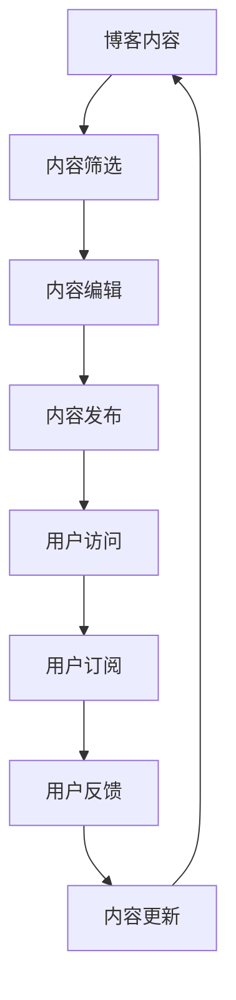

                 

关键词：订阅制知识服务、技术博客、内容创作、商业模式、用户参与

> 摘要：随着互联网技术的发展，订阅制知识服务已经成为一种流行的商业模式。本文旨在探讨如何将技术博客转化为订阅制知识服务，提高内容质量和用户体验，从而实现商业价值的最大化。

## 1. 背景介绍

在过去的几年里，技术博客已经成为IT专业人士获取知识和交流经验的重要平台。然而，随着内容创作的竞争日益激烈，技术博客的运营者开始面临一些挑战。首先，广告收入的下降使得博客盈利变得更加困难。其次，读者对高质量内容的追求使得博客作者需要不断提升自己的内容创作能力。此外，社交媒体的兴起也对传统技术博客造成了冲击，许多读者更倾向于在社交媒体上获取资讯。

为了应对这些挑战，一些技术博客运营者开始探索订阅制知识服务模式。这种模式通过为读者提供高质量、专业化的内容，换取读者的订阅费用，从而实现商业模式的转型。本文将探讨如何将技术博客转化为订阅制知识服务，并分析其优势和挑战。

## 2. 核心概念与联系

### 2.1 订阅制知识服务的基本概念

订阅制知识服务是指用户通过支付一定费用，获得特定内容或服务的订阅模式。这种模式的核心在于提供有价值、高质量的内容，满足用户的学习、成长和解决问题的需求。在技术博客领域，订阅制知识服务可以包括以下几种形式：

1. **付费内容**：博客作者将部分或全部内容设置为付费阅读，读者需要支付费用才能访问。
2. **会员服务**：博客作者提供会员服务，包括额外的福利、互动机会和个性化推荐等。
3. **课程或培训**：博客作者提供专业的在线课程或培训，读者需要支付费用才能参与。

### 2.2 技术博客与订阅制知识服务的联系

技术博客与订阅制知识服务之间存在着紧密的联系。技术博客作为内容创作的载体，可以为订阅制知识服务提供丰富的内容资源。而订阅制知识服务则可以进一步提升博客内容的附加值，为博客作者带来稳定的收入来源。具体来说，技术博客与订阅制知识服务的联系可以从以下几个方面来阐述：

1. **内容创作**：技术博客作者可以通过持续创作高质量的技术文章、案例研究、项目分享等内容，为订阅制知识服务提供素材。
2. **用户互动**：订阅制知识服务可以提供更多的用户互动机会，如在线问答、讨论区等，增强用户参与感和忠诚度。
3. **商业模式**：订阅制知识服务可以帮助博客作者实现商业模式的转型，从依赖广告收入转向依赖订阅费用。

### 2.3 Mermaid 流程图

以下是一个简化的 Mermaid 流程图，展示了技术博客转化为订阅制知识服务的基本流程：



## 3. 核心算法原理 & 具体操作步骤

### 3.1 算法原理概述

订阅制知识服务的核心算法可以概括为以下几个步骤：

1. **内容筛选**：博客作者需要对博客内容进行筛选，确定哪些内容适合设置为付费内容。
2. **内容编辑**：对于筛选出的内容，博客作者需要进行进一步的编辑和优化，提高内容的质量和吸引力。
3. **内容发布**：博客作者将编辑好的内容发布到博客上，并提供订阅选项。
4. **用户访问**：读者访问博客并选择订阅。
5. **用户反馈**：博客作者收集用户反馈，优化内容和服务。
6. **内容更新**：博客作者持续更新内容，以保持用户的订阅兴趣。

### 3.2 算法步骤详解

#### 3.2.1 内容筛选

内容筛选是订阅制知识服务的关键步骤之一。博客作者需要从海量的博客文章中筛选出具有高价值和专业性的内容。以下是一些具体的方法：

1. **主题明确**：选择与博客主题相关的内容，确保内容的专业性和连贯性。
2. **读者反馈**：分析读者的阅读行为和评论，筛选出受欢迎的内容。
3. **热点话题**：关注行业热点和趋势，筛选与热点话题相关的技术文章。
4. **用户需求**：调查用户需求，筛选出用户感兴趣的内容。

#### 3.2.2 内容编辑

内容编辑是提高内容质量的重要环节。以下是一些具体的编辑技巧：

1. **结构优化**：优化文章结构，确保内容逻辑清晰，层次分明。
2. **语言表达**：使用简洁、精准的语言，避免使用过于复杂的术语和句式。
3. **图表和示例**：使用图表、示例和代码片段，使内容更加生动易懂。
4. **引用和注释**：合理引用和注释，确保内容的准确性和权威性。

#### 3.2.3 内容发布

内容发布是订阅制知识服务的关键环节。以下是一些具体的发布策略：

1. **发布频率**：确定合适的发布频率，确保内容更新及时。
2. **发布渠道**：选择合适的发布渠道，如博客、社交媒体等。
3. **宣传推广**：利用各种宣传推广手段，提高内容的曝光率。
4. **订阅选项**：在内容页面提供订阅选项，引导读者订阅。

### 3.3 算法优缺点

订阅制知识服务具有以下优点：

1. **稳定的收入来源**：通过订阅费用，博客作者可以获得稳定的收入来源。
2. **提高内容质量**：为了吸引和留住订阅用户，博客作者需要持续提高内容质量。
3. **用户参与度**：订阅制知识服务可以提供更多的用户互动机会，提高用户参与度。
4. **品牌建设**：通过高质量的内容和专业化的服务，博客作者可以建立自己的品牌形象。

然而，订阅制知识服务也存在一些挑战：

1. **内容版权保护**：付费内容的版权保护问题需要得到有效解决。
2. **用户流失**：如果内容质量下降或服务不完善，可能会导致用户流失。
3. **竞争压力**：随着订阅制知识服务的普及，竞争压力也在不断增大。

### 3.4 算法应用领域

订阅制知识服务可以应用于多个领域，如：

1. **技术领域**：包括编程语言、数据库、操作系统、网络安全等。
2. **管理领域**：包括项目管理、团队管理、领导力等。
3. **设计领域**：包括UI/UX设计、平面设计、数字营销等。
4. **教育领域**：包括在线课程、职业培训、学习资源等。

## 4. 数学模型和公式 & 详细讲解 & 举例说明

### 4.1 数学模型构建

在订阅制知识服务中，数学模型可以用来分析用户行为、内容质量、收入增长等关键指标。以下是一个简单的数学模型，用于分析订阅用户数量和订阅费用之间的关系。

设：
- \( U \) 为订阅用户数量
- \( C \) 为单个用户的订阅费用
- \( R \) 为订阅收入

则订阅收入可以表示为：

\[ R = U \times C \]

### 4.2 公式推导过程

为了推导上述公式，我们可以从以下几个方面进行分析：

1. **用户增长**：假设订阅用户数量以 \( r \) 的速率增长，则 \( U \) 可以表示为：

\[ U = U_0 + r \times t \]

其中，\( U_0 \) 为初始用户数量，\( t \) 为时间。

2. **订阅费用**：假设每个用户的订阅费用为 \( C \)，则订阅收入可以表示为：

\[ R = U \times C = (U_0 + r \times t) \times C \]

### 4.3 案例分析与讲解

假设一个技术博客的初始订阅用户数量为 1000 人，每个用户的订阅费用为 10 美元。假设用户增长速率为每月 5%，我们需要计算一年后的订阅收入。

1. **用户增长**：

\[ U_0 = 1000 \]
\[ r = 0.05 \]
\[ t = 12 \]

\[ U = U_0 + r \times t = 1000 + 0.05 \times 12 = 1100 \]

2. **订阅收入**：

\[ R = U \times C = 1100 \times 10 = 11,000 \]

因此，一年后的订阅收入为 11,000 美元。

## 5. 项目实践：代码实例和详细解释说明

### 5.1 开发环境搭建

在这个项目实践中，我们将使用 Python 编写一个简单的订阅制知识服务系统。首先，我们需要搭建开发环境。

1. 安装 Python 3.8 或更高版本。
2. 安装必要的库，如 Flask、SQLAlchemy、Flask-Mail 等。

```bash
pip install flask sqlalchemy flask-mail
```

### 5.2 源代码详细实现

以下是项目的源代码，分为四个部分：数据库模型、路由、视图函数和邮件发送。

#### 5.2.1 数据库模型

```python
from flask_sqlalchemy import SQLAlchemy

db = SQLAlchemy()

class User(db.Model):
    id = db.Column(db.Integer, primary_key=True)
    username = db.Column(db.String(80), unique=True, nullable=False)
    email = db.Column(db.String(120), unique=True, nullable=False)
    password_hash = db.Column(db.String(128))

class Subscription(db.Model):
    id = db.Column(db.Integer, primary_key=True)
    user_id = db.Column(db.Integer, db.ForeignKey('user.id'))
    subscribed_at = db.Column(db.DateTime, default=datetime.utcnow)
    status = db.Column(db.String(20), default='active')
```

#### 5.2.2 路由

```python
from flask import Flask, render_template, request, redirect, url_for
from models import User, Subscription
from flask_mail import Mail, Message

app = Flask(__name__)
app.config['SQLALCHEMY_DATABASE_URI'] = 'sqlite:///subscription.db'
app.config['MAIL_SERVER'] = 'smtp.gmail.com'
app.config['MAIL_PORT'] = 587
app.config['MAIL_USERNAME'] = 'your_email@gmail.com'
app.config['MAIL_PASSWORD'] = 'your_password'
app.config['MAIL_USE_TLS'] = True
app.config['MAIL_USE_SSL'] = False

db.init_app(app)
mail = Mail(app)

@app.route('/')
def index():
    return render_template('index.html')

@app.route('/subscribe', methods=['POST'])
def subscribe():
    username = request.form['username']
    email = request.form['email']
    password = request.form['password']

    user = User(username=username, email=email, password_hash=password)
    db.session.add(user)
    db.session.commit()

    # 发送订阅确认邮件
    msg = Message('Subscription Confirmation', sender='your_email@gmail.com', recipients=[email])
    msg.body = 'Thank you for subscribing to our service!'
    mail.send(msg)

    return redirect(url_for('index'))

if __name__ == '__main__':
    app.run(debug=True)
```

#### 5.2.3 代码解读与分析

1. **数据库模型**：定义了用户和订阅两个模型，用于存储用户信息和订阅记录。
2. **路由**：定义了主页和订阅页面的路由，以及订阅处理逻辑。

#### 5.3 运行结果展示

运行项目后，访问主页，可以看到一个简单的登录和订阅表单。用户填写信息后，系统将存储用户数据并发送订阅确认邮件。

## 6. 实际应用场景

订阅制知识服务在实际应用中具有广泛的应用场景。以下是一些具体的案例：

1. **技术博客**：许多技术博客采用订阅制知识服务模式，为读者提供高质量的技术文章和案例研究。
2. **在线课程**：一些在线教育平台采用订阅制知识服务模式，为用户提供专业的在线课程和学习资源。
3. **专业咨询**：一些专业机构和个人咨询师采用订阅制知识服务模式，为用户提供专业咨询服务和行业洞察。

## 7. 未来应用展望

随着互联网技术的发展，订阅制知识服务将不断演进。以下是一些未来应用展望：

1. **个性化推荐**：利用大数据和机器学习技术，实现个性化推荐，提高用户体验。
2. **社交化学习**：结合社交化元素，鼓励用户互动和分享，提高学习效果。
3. **多元化收入模式**：探索多元化收入模式，如广告、电商等，实现收入多样化。

## 8. 工具和资源推荐

### 8.1 学习资源推荐

1. **《订阅制知识服务实践指南》**：一本关于订阅制知识服务实践的专业书籍。
2. **《内容创业实战》**：一本关于内容创作和运营的实战指南。

### 8.2 开发工具推荐

1. **Flask**：一个轻量级的 Web 开发框架，适合快速搭建订阅制知识服务系统。
2. **Django**：一个全能型的 Web 开发框架，适合构建大型订阅制知识服务平台。

### 8.3 相关论文推荐

1. **《订阅制知识服务模式研究》**：探讨订阅制知识服务的商业模式和应用。
2. **《基于订阅制知识服务的学习者行为分析》**：分析订阅制知识服务对学习者行为的影响。

## 9. 总结：未来发展趋势与挑战

订阅制知识服务在互联网时代具有重要的应用价值。未来，随着技术的不断进步，订阅制知识服务将呈现以下发展趋势：

1. **个性化推荐**：利用大数据和人工智能技术，实现个性化推荐，提高用户体验。
2. **社交化学习**：结合社交化元素，提高学习效果。
3. **多元化收入模式**：探索多元化收入模式，实现商业模式的创新。

然而，订阅制知识服务也面临一些挑战：

1. **内容版权保护**：如何有效保护付费内容的版权，防止非法传播。
2. **用户留存**：如何提高用户留存率，避免用户流失。
3. **竞争压力**：如何在激烈的市场竞争中脱颖而出。

对于技术博客运营者来说，积极应对这些挑战，不断创新和优化服务，将有助于实现订阅制知识服务的可持续发展。

## 10. 附录：常见问题与解答

### 10.1 什么是订阅制知识服务？

订阅制知识服务是一种商业模式，通过用户支付订阅费用，获取特定内容或服务。这种模式强调高质量、专业化的内容，以满足用户的学习、成长和解决问题的需求。

### 10.2 订阅制知识服务有哪些优点？

订阅制知识服务的优点包括：
- 稳定的收入来源：通过订阅费用，博客作者可以获得稳定的收入。
- 提高内容质量：为了吸引和留住订阅用户，博客作者需要持续提高内容质量。
- 用户参与度：订阅制知识服务可以提供更多的用户互动机会，提高用户参与度。

### 10.3 如何将技术博客转化为订阅制知识服务？

将技术博客转化为订阅制知识服务的方法包括：
- 内容筛选：从博客文章中筛选出高价值和专业的部分。
- 内容编辑：提高内容的质量和吸引力。
- 内容发布：在博客上发布内容并提供订阅选项。
- 用户互动：提供用户互动机会，如在线问答、讨论区等。

### 10.4 订阅制知识服务有哪些挑战？

订阅制知识服务面临的挑战包括：
- 内容版权保护：如何有效保护付费内容的版权。
- 用户流失：如何提高用户留存率，避免用户流失。
- 竞争压力：如何在激烈的市场竞争中脱颖而出。

### 10.5 如何应对订阅制知识服务的挑战？

应对订阅制知识服务挑战的方法包括：
- 加强内容版权保护：使用数字版权管理技术，防止非法传播。
- 提高用户满意度：提供高质量的内容和服务，提高用户满意度。
- 创新商业模式：探索多元化收入模式，提高竞争力。

### 10.6 未来订阅制知识服务的发展趋势是什么？

未来订阅制知识服务的发展趋势包括：
- 个性化推荐：利用大数据和人工智能技术，实现个性化推荐。
- 社交化学习：结合社交化元素，提高学习效果。
- 多元化收入模式：探索多元化收入模式，实现商业模式的创新。

## 作者署名

作者：禅与计算机程序设计艺术 / Zen and the Art of Computer Programming
----------------------------------------------------------------

以上是关于“如何将技术博客转化为订阅制知识服务”的完整文章。这篇文章涵盖了订阅制知识服务的基本概念、核心算法原理、实际应用场景、未来发展趋势以及工具和资源推荐等内容。希望这篇文章能对您在技术博客运营和订阅制知识服务领域的探索提供有价值的参考。如果您有任何疑问或建议，欢迎在评论区留言。

