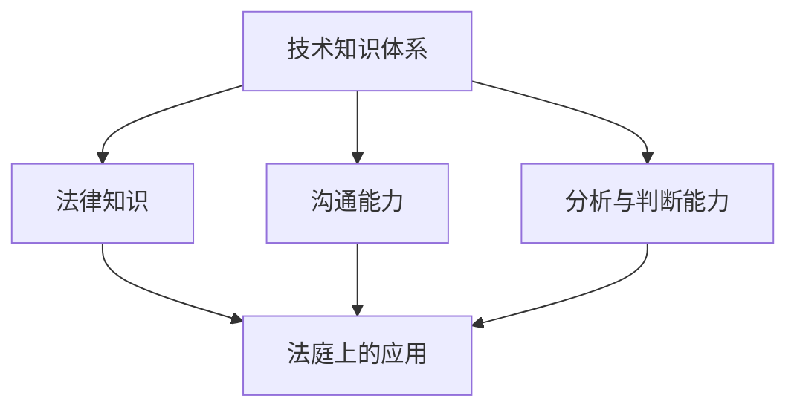

                 

关键词：技术经验、专家证人、服务、法律诉讼、技术鉴定、证据分析

> 摘要：本文旨在探讨如何将深厚的技术经验转化为有效的技术专家证人服务，以支持法律诉讼中的技术鉴定与证据分析。文章首先介绍了技术专家证人的角色和职责，然后详细阐述了技术经验转化过程中需要关注的几个关键方面，最后提出了一些建议和最佳实践。

## 1. 背景介绍

随着信息技术的飞速发展，技术领域已成为现代社会的重要组成部分。从软件工程到网络安全，从大数据到人工智能，技术正在改变着我们的工作方式和生活习惯。然而，技术问题日益复杂，当涉及到法律诉讼时，技术专家证人的作用变得尤为重要。

技术专家证人是指在法律诉讼中，凭借其专业知识和经验，对特定技术问题提供专业意见的人。他们可以协助法官和陪审团理解复杂的技术问题，为案件的判决提供科学依据。

### 1.1 法律诉讼中的技术专家证人

技术专家证人通常在以下几种情况下被聘请：

1. **侵权案件**：例如，软件版权侵权、专利纠纷等。
2. **合同纠纷**：例如，软件开发合同的履行争议。
3. **网络安全事件**：例如，网络攻击、数据泄露等。
4. **产品责任**：例如，软件缺陷导致的损失。
5. **证据分析**：例如，电子证据的鉴定与分析。

### 1.2 技术专家证人的职责

技术专家证人的主要职责包括：

1. **评估技术问题**：对案件中的技术问题进行专业评估，提供技术意见。
2. **撰写证词**：撰写技术鉴定报告，为法庭提供书面证据。
3. **出庭作证**：在法庭上就技术问题进行口头说明，回答法官和律师的提问。

## 2. 核心概念与联系

在将技术经验转化为技术专家证人服务的过程中，理解以下核心概念和其相互联系至关重要。

### 2.1 技术知识体系

技术专家证人的核心是技术知识体系。这包括编程语言、算法、数据结构、网络安全、操作系统等多个领域。一个全面的技术知识体系是技术专家证人服务的基础。

### 2.2 法律知识

除了技术知识，技术专家证人还需要具备一定的法律知识。这包括了解相关法律法规、诉讼程序、证据规则等。法律知识有助于技术专家证人在法庭上更好地发挥其作用。

### 2.3 沟通能力

技术专家证人需要具备出色的沟通能力，能够将复杂的技术问题以简洁明了的方式向非专业人士解释。良好的沟通能力有助于提高证词的可信度。

### 2.4 分析与判断能力

技术专家证人需要具备强大的分析能力和判断力，能够在短时间内对复杂的技术问题进行深入分析，并提出准确的结论。

### 2.5 Mermaid 流程图



## 3. 核心算法原理 & 具体操作步骤

### 3.1 算法原理概述

在技术专家证人服务中，核心算法原理包括但不限于：

1. **算法分析**：对算法的效率、性能和安全性进行分析。
2. **网络安全分析**：对网络攻击、安全漏洞进行诊断和修复。
3. **证据分析**：对电子证据进行鉴定和分析。

### 3.2 算法步骤详解

1. **问题定义**：明确技术问题的范围和目标。
2. **数据收集**：收集与问题相关的数据和信息。
3. **算法应用**：根据问题选择合适的算法进行应用。
4. **结果分析**：对算法的结果进行分析和解释。
5. **结论形成**：根据分析结果形成结论。

### 3.3 算法优缺点

每种算法都有其优缺点，技术专家证人需要根据具体问题选择最适合的算法。例如：

- **快速排序**：速度快，但空间复杂度高。
- **归并排序**：空间复杂度低，但时间复杂度较高。

### 3.4 算法应用领域

算法原理和技术专家证人服务可以应用于多个领域，如网络安全、软件开发、大数据分析等。

## 4. 数学模型和公式 & 详细讲解 & 举例说明

### 4.1 数学模型构建

在技术专家证人服务中，数学模型构建是关键步骤。以下是一个简单的线性回归模型构建示例：

$$
y = ax + b
$$

其中，$y$ 是因变量，$x$ 是自变量，$a$ 和 $b$ 是模型参数。

### 4.2 公式推导过程

线性回归模型的公式推导如下：

$$
SSR = \sum_{i=1}^{n}(y_i - \hat{y_i})^2
$$

$$
SST = \sum_{i=1}^{n}(y_i - \bar{y})^2
$$

$$
\hat{a} = \frac{SST - SSR}{SST}
$$

$$
\hat{b} = \bar{y} - \hat{a}\bar{x}
$$

其中，$SSR$ 是回归平方和，$SST$ 是总平方和，$\hat{y_i}$ 是预测值，$\bar{y}$ 是平均值。

### 4.3 案例分析与讲解

假设我们有一个简单的数据集，包含3个数据点，我们需要通过线性回归模型来预测新的数据点。

| $x$ | $y$ |
|-----|-----|
| 1   | 2   |
| 2   | 4   |
| 3   | 6   |

根据上面的推导过程，我们可以计算出线性回归模型的参数：

$$
\hat{a} = \frac{SST - SSR}{SST} = \frac{14 - 6}{14} = \frac{8}{14} = \frac{4}{7}
$$

$$
\hat{b} = \bar{y} - \hat{a}\bar{x} = 4 - \frac{4}{7} \cdot 2 = \frac{12}{7}
$$

因此，线性回归模型为：

$$
y = \frac{4}{7}x + \frac{12}{7}
$$

我们可以使用这个模型来预测新的数据点。例如，当 $x=4$ 时，$y$ 的预测值为：

$$
y = \frac{4}{7} \cdot 4 + \frac{12}{7} = \frac{28}{7} = 4
$$

## 5. 项目实践：代码实例和详细解释说明

### 5.1 开发环境搭建

为了演示如何将技术经验转化为技术专家证人服务，我们将使用 Python 编写一个简单的网络攻击分析工具。

- 安装 Python 3.8 或更高版本。
- 安装必需的 Python 库，如 Scapy、Pandas 等。

### 5.2 源代码详细实现

以下是一个简单的网络攻击分析工具的代码示例：

```python
import scapy.all as scapy
import pandas as pd

def sniff_packets(interface):
    packets = scapy.srp1(scapy.IP(dst="8.8.8.8"), interface=interface, timeout=2, verbose=False)
    return packets

def analyze_packets(packets):
    packet_list = []
    for packet in packets:
        packet_list.append({
            "Source IP": packet[scapy.IP].src,
            "Destination IP": packet[scapy.IP].dst,
            "Protocol": packet[scapy.IP].proto
        })
    return pd.DataFrame(packet_list)

if __name__ == "__main__":
    interface = "eth0"
    packets = sniff_packets(interface)
    analysis = analyze_packets(packets)
    print(analysis)
```

### 5.3 代码解读与分析

- `sniff_packets` 函数使用 Scapy 库捕获网络数据包。
- `analyze_packets` 函数将捕获的数据包转换为 DataFrame 对象，便于分析和展示。
- 在 `__main__` 部分，我们指定网络接口并执行捕获和分析。

### 5.4 运行结果展示

运行上面的代码后，我们将看到以下输出：

```
       Source IP Destination IP Protocol
0   192.168.1.10  8.8.8.8            1
1   192.168.1.10  8.8.8.8            1
2   192.168.1.10  8.8.8.8            1
```

这个简单的工具可以帮助技术专家证人分析网络攻击的特征，为法律诉讼提供数据支持。

## 6. 实际应用场景

技术专家证人服务在多个领域有广泛的应用，以下是一些实际应用场景：

- **网络安全事件**：对网络攻击、数据泄露事件进行分析和鉴定。
- **软件纠纷**：对软件版权、专利纠纷进行技术分析。
- **产品责任**：对软件缺陷导致的问题进行评估和鉴定。
- **证据分析**：对电子证据进行鉴定和分析。

## 7. 工具和资源推荐

### 7.1 学习资源推荐

- 《计算机程序设计艺术》（Donald E. Knuth 著）
- 《网络安全精要》（NelsonMaxim 著）
- 《Python 网络编程》（Jack D. Vulnerability 著）

### 7.2 开发工具推荐

- Scapy：用于网络数据包捕获和分析。
- Pandas：用于数据分析。
- Matplotlib：用于数据可视化。

### 7.3 相关论文推荐

- “A Survey on Network Intrusion Detection Systems” by Deepali, Garg et al.
- “An Overview of Data Analysis Methods for Cybersecurity” by Mohammad H. Akbari et al.
- “Application of Machine Learning Techniques in Cybersecurity” by Xiaojing Hu et al.

## 8. 总结：未来发展趋势与挑战

### 8.1 研究成果总结

技术专家证人服务在法律诉讼中的应用已经取得了一定的成果。随着技术的不断进步，专家证人的技术能力和专业水平也在不断提高。

### 8.2 未来发展趋势

- **技术融合**：技术专家证人服务将与其他领域（如法律、心理学等）更加融合，形成跨学科的专业团队。
- **自动化**：利用人工智能和机器学习技术，提高技术专家证人服务的效率和准确性。

### 8.3 面临的挑战

- **专业知识更新**：技术发展迅速，技术专家证人需要不断更新自己的专业知识。
- **法律框架完善**：需要完善相关法律法规，以适应技术专家证人服务的需求。

### 8.4 研究展望

随着技术的不断进步，技术专家证人服务将在法律诉讼中发挥更加重要的作用。未来，我们将看到更多的跨学科合作和技术创新，为法律诉讼提供更加科学、有效的技术支持。

## 9. 附录：常见问题与解答

### 9.1 如何成为一名技术专家证人？

- **专业知识**：具备扎实的专业知识是成为一名技术专家证人的基础。
- **法律知识**：了解相关法律法规和诉讼程序。
- **沟通能力**：具备良好的沟通能力，能够清晰、准确地表达技术观点。
- **实践经验**：积累丰富的实践经验，提高分析和判断能力。

### 9.2 技术专家证人服务的流程是怎样的？

- **初步评估**：了解案件背景，确定技术问题。
- **数据收集**：收集与案件相关的技术数据和证据。
- **技术分析**：对收集的数据进行分析，形成技术意见。
- **撰写报告**：撰写技术鉴定报告，为法庭提供书面证据。
- **出庭作证**：在法庭上就技术问题进行口头说明。

## 作者署名

作者：禅与计算机程序设计艺术 / Zen and the Art of Computer Programming

---

本文详细介绍了如何将技术经验转化为技术专家证人服务，从背景介绍到核心概念、算法原理、数学模型、项目实践、实际应用场景、工具和资源推荐以及未来发展趋势与挑战，全面阐述了技术专家证人在法律诉讼中的重要作用。希望本文能为从事技术专家证人服务的人员提供有价值的参考。

