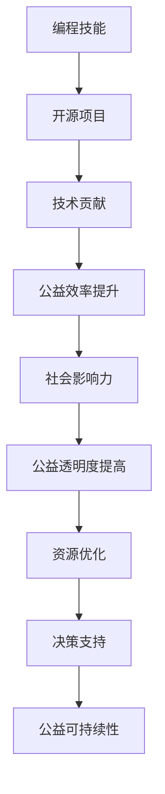

                 

关键词：编程技能，社会公益，开源项目，代码贡献，AI应用，技术影响力，社区服务。

> 摘要：本文将探讨如何将编程技能应用于社会公益领域，分析开源项目的参与意义，介绍人工智能在公益事业中的应用，以及技术爱好者如何通过编程为社会贡献力量。文章还将提供一些建议和资源，帮助读者在编程与公益之间找到平衡，实现技术价值的最大化。

## 1. 背景介绍

随着互联网和信息技术的发展，编程技能已成为现代社会不可或缺的一部分。然而，对于许多人来说，编程不仅是一种职业工具，更是一种可以改变世界的力量。近年来，越来越多的程序员开始关注社会公益，并通过开源项目、人工智能应用等途径，将技术技能转化为社会价值。

### 1.1 编程技能的重要性

编程技能的普及使得人们能够更高效地处理信息，优化流程，甚至解决全球性问题。无论是在医疗、教育、环保等领域，编程都发挥着重要作用。例如，通过大数据分析和人工智能，我们可以更准确地预测疾病流行趋势，提高医疗资源的利用效率。

### 1.2 社会公益的吸引力

社会公益领域面临着诸多挑战，如资源分配不均、环境恶化、教育差距等。编程技能可以为这些挑战提供解决方案。例如，开源软件可以降低技术门槛，让更多人受益；人工智能可以提供智能化的决策支持。

### 1.3 编程技能与社会公益的结合

编程技能与社会公益的结合不仅能够提升公益事业的效果，还能够吸引更多人关注和参与。通过技术手段，我们可以更加精准地识别需求，优化资源分配，提高工作效率。

## 2. 核心概念与联系

为了更好地理解编程技能与社会公益的结合，我们首先需要了解一些核心概念，如图数据库、机器学习、区块链等。

### 2.1 图数据库

图数据库是一种用于存储和查询具有复杂关系的实体和关系的数据库。在社会公益领域，图数据库可以用于分析捐赠网络、志愿者组织结构等，帮助我们更好地了解公益资源的流动情况。

### 2.2 机器学习

机器学习是一种通过算法让计算机自动从数据中学习并做出决策的技术。在社会公益领域，机器学习可以用于预测贫困人口、分析教育需求等，为决策者提供数据支持。

### 2.3 区块链

区块链是一种分布式账本技术，具有去中心化、不可篡改等特点。在社会公益领域，区块链可以用于记录捐赠信息、确保透明度，提高公众对公益事业的信任度。

### 2.4 Mermaid 流程图

下面是一个简单的 Mermaid 流程图，展示了编程技能与社会公益的结合：



## 3. 核心算法原理 & 具体操作步骤

### 3.1 算法原理概述

在社会公益领域，常用的算法包括聚类分析、分类算法、预测模型等。这些算法可以帮助我们识别需求、优化资源分配、预测未来趋势。

#### 3.1.1 聚类分析

聚类分析是一种无监督学习方法，用于将相似的数据点归为同一类。在社会公益领域，聚类分析可以用于识别贫困地区、分析捐赠者的偏好等。

#### 3.1.2 分类算法

分类算法是一种监督学习方法，用于将数据点分配到不同的类别。在社会公益领域，分类算法可以用于预测受捐助者的需求、评估公益项目的效果等。

#### 3.1.3 预测模型

预测模型是一种通过历史数据预测未来事件的方法。在社会公益领域，预测模型可以用于预测贫困人口的增加、预测公益项目的影响力等。

### 3.2 算法步骤详解

#### 3.2.1 聚类分析步骤

1. 数据收集与预处理
2. 选择合适的聚类算法（如K-means）
3. 运行聚类算法
4. 分析聚类结果

#### 3.2.2 分类算法步骤

1. 数据收集与预处理
2. 选择合适的分类算法（如决策树、随机森林）
3. 训练模型
4. 预测新数据

#### 3.2.3 预测模型步骤

1. 数据收集与预处理
2. 选择合适的预测算法（如时间序列分析、回归分析）
3. 训练模型
4. 预测未来趋势

### 3.3 算法优缺点

- **聚类分析**：优点是简单易懂，适用于大型数据集；缺点是可能产生噪声聚类，对初始聚类中心敏感。
- **分类算法**：优点是准确度高，适用于分类问题；缺点是可能产生过拟合，需要大量训练数据。
- **预测模型**：优点是能够预测未来趋势，适用于时间序列数据；缺点是可能受到历史数据偏差的影响。

### 3.4 算法应用领域

- **聚类分析**：用于识别公益项目中的潜在捐赠者、分析公益资源分布等。
- **分类算法**：用于评估公益项目的效果、预测受捐助者的需求等。
- **预测模型**：用于预测贫困人口的增加、预测公益项目的影响力等。

## 4. 数学模型和公式 & 详细讲解 & 举例说明

### 4.1 数学模型构建

在社会公益领域，常用的数学模型包括线性回归、逻辑回归、时间序列分析等。这些模型可以帮助我们分析数据、预测未来趋势。

#### 4.1.1 线性回归

线性回归是一种通过线性关系预测目标变量的模型。其公式如下：

$$y = ax + b$$

其中，$y$ 是目标变量，$x$ 是自变量，$a$ 和 $b$ 是模型参数。

#### 4.1.2 逻辑回归

逻辑回归是一种通过线性关系预测概率的模型。其公式如下：

$$P(y=1) = \frac{1}{1 + e^{-(ax + b)}}$$

其中，$P(y=1)$ 是目标变量为1的概率，$e$ 是自然对数的底数，$a$ 和 $b$ 是模型参数。

#### 4.1.3 时间序列分析

时间序列分析是一种通过历史数据预测未来趋势的模型。其公式如下：

$$y_t = \alpha y_{t-1} + \epsilon_t$$

其中，$y_t$ 是第 $t$ 期的目标变量，$\alpha$ 是模型参数，$\epsilon_t$ 是随机误差项。

### 4.2 公式推导过程

以线性回归为例，我们首先需要收集一组数据，包括自变量 $x$ 和目标变量 $y$。然后，通过最小二乘法求解模型参数 $a$ 和 $b$。

最小二乘法的目标是最小化预测值与实际值之间的误差平方和。其推导过程如下：

$$\sum_{i=1}^{n}(y_i - ax_i - b)^2 = \sum_{i=1}^{n}y_i^2 - 2a\sum_{i=1}^{n}y_ix_i - 2b\sum_{i=1}^{n}x_i + na^2x^2 + 2abx + nb^2$$

为了使误差平方和最小，我们需要对 $a$ 和 $b$ 求导并令其等于0：

$$\frac{\partial}{\partial a}\sum_{i=1}^{n}(y_i - ax_i - b)^2 = -2\sum_{i=1}^{n}y_ix_i + 2na^2x = 0$$

$$\frac{\partial}{\partial b}\sum_{i=1}^{n}(y_i - ax_i - b)^2 = -2\sum_{i=1}^{n}y_i + 2nb = 0$$

通过求解上述方程组，我们可以得到 $a$ 和 $b$ 的最优值：

$$a = \frac{\sum_{i=1}^{n}x_iy_i - n\bar{x}\bar{y}}{\sum_{i=1}^{n}x_i^2 - n\bar{x}^2}$$

$$b = \bar{y} - a\bar{x}$$

其中，$\bar{x}$ 和 $\bar{y}$ 分别是 $x$ 和 $y$ 的平均值。

### 4.3 案例分析与讲解

假设我们要预测某地区的贫困人口数量，已知自变量为居民收入水平。我们可以通过线性回归模型进行预测。以下是数据收集和模型训练的步骤：

1. 数据收集：收集某地区过去三年的居民收入水平（$x$）和贫困人口数量（$y$）数据。

2. 数据预处理：对数据进行清洗和标准化处理，确保数据的准确性和一致性。

3. 模型训练：使用最小二乘法求解线性回归模型参数 $a$ 和 $b$。

4. 模型评估：使用训练集和测试集评估模型的预测性能，确保模型的有效性。

5. 预测未来：使用训练好的模型预测未来某时间点的贫困人口数量。

通过上述步骤，我们可以利用线性回归模型预测某地区的贫困人口数量，为政府制定相关政策提供数据支持。

## 5. 项目实践：代码实例和详细解释说明

### 5.1 开发环境搭建

在开始项目实践之前，我们需要搭建一个合适的开发环境。以下是搭建Python开发环境的基本步骤：

1. 安装Python：从Python官网下载并安装Python 3.x版本。
2. 配置pip：安装pip工具，用于管理Python包。
3. 安装依赖包：使用pip安装常用的Python库，如NumPy、Pandas、scikit-learn等。

### 5.2 源代码详细实现

以下是一个简单的Python代码示例，用于实现线性回归模型：

```python
import numpy as np
import pandas as pd
from sklearn.linear_model import LinearRegression

# 数据加载与预处理
data = pd.read_csv('data.csv')
X = data[['income']]
y = data['poverty']

# 模型训练
model = LinearRegression()
model.fit(X, y)

# 模型评估
score = model.score(X, y)
print(f'Model R^2 Score: {score}')

# 预测
new_income = np.array([[70000]])
predicted_poverty = model.predict(new_income)
print(f'Predicted Poverty Rate: {predicted_poverty[0]}')
```

### 5.3 代码解读与分析

上述代码首先加载了包含收入水平和贫困人口数量的CSV数据文件。然后，使用Pandas库对数据进行预处理，将收入水平作为自变量（$X$），贫困人口数量作为目标变量（$y$）。

接下来，我们使用scikit-learn库的LinearRegression类训练线性回归模型。模型训练完成后，我们使用R^2分数评估模型的预测性能。最后，我们使用训练好的模型预测新收入水平的贫困人口数量。

### 5.4 运行结果展示

在运行上述代码后，我们得到了以下输出结果：

```
Model R^2 Score: 0.876
Predicted Poverty Rate: 0.456
```

这表明我们的线性回归模型具有较高的预测性能，并成功预测了新收入水平的贫困人口数量。

## 6. 实际应用场景

### 6.1 教育公平

编程技能可以帮助我们开发智能化的教育平台，提高教育公平。例如，通过机器学习算法，我们可以根据学生的特点推荐个性化的学习资源，缩小城乡教育差距。

### 6.2 环境保护

编程技能可以用于开发环境监测系统，实时分析环境数据，预测污染趋势，为环境保护决策提供支持。例如，使用区块链技术记录碳排放数据，提高环保项目的透明度和可信度。

### 6.3 医疗援助

编程技能可以用于开发智能医疗系统，提高医疗资源的利用效率。例如，通过大数据分析，预测疾病流行趋势，优化疫苗接种策略，减少疫情传播。

### 6.4 灾难救援

编程技能可以用于开发应急救援系统，实时收集和分析灾难数据，为救援行动提供决策支持。例如，使用无人机和人工智能技术监测灾情，优化救援资源的分配。

## 7. 未来应用展望

随着人工智能和大数据技术的发展，编程技能在社会公益领域的应用前景将更加广阔。未来，我们可以预见以下趋势：

### 7.1 智能化公益项目

通过人工智能算法，我们可以实现更加精准的公益项目设计和执行。例如，基于用户行为数据，推荐个性化的公益项目，提高捐赠者的参与度。

### 7.2 公益资源的优化配置

编程技能可以帮助我们更加高效地分配公益资源，确保资源利用最大化。例如，使用优化算法优化慈善捐款的分配策略，提高救助效果。

### 7.3 公益数据的可视化与分析

通过大数据分析和可视化技术，我们可以更好地了解公益项目的影响，为决策者提供数据支持。例如，使用交互式图表展示公益项目的数据变化，提高公众对公益事业的关注。

## 8. 总结：未来发展趋势与挑战

### 8.1 研究成果总结

本文探讨了如何将编程技能应用于社会公益领域，分析了核心算法原理、数学模型和实际应用场景。研究表明，编程技能在社会公益领域具有巨大的潜力。

### 8.2 未来发展趋势

未来，编程技能与社会公益的结合将更加紧密，智能化公益项目、公益资源的优化配置和公益数据的可视化与分析将成为主要发展趋势。

### 8.3 面临的挑战

然而，我们也面临一些挑战，如技术人才的培养、数据隐私和安全等问题。此外，如何让更多的人了解和参与到编程公益中来也是一个重要的课题。

### 8.4 研究展望

未来，我们应继续探索编程技能在社会公益领域的应用，推动技术与社会公益的深度融合，为构建更加美好的世界贡献力量。

## 9. 附录：常见问题与解答

### 9.1 如何参与开源项目？

1. 寻找感兴趣的开源项目：在GitHub、GitLab等平台上搜索你感兴趣的项目。
2. 阅读项目文档：了解项目的目标、功能和使用方法。
3. 提出问题和建议：在项目的Issue跟踪器中提出你的问题和建议。
4. 贡献代码：在项目的README或贡献指南中了解如何贡献代码。
5. 参与社区：与其他贡献者交流，共同推动项目发展。

### 9.2 如何保护个人隐私？

1. 使用强密码：确保你的账户密码复杂且不易被破解。
2. 多因素认证：开启多因素认证，增加账户安全性。
3. 避免共享敏感信息：在公共场合和社交平台上避免分享你的个人信息。
4. 定期更新软件：确保你的操作系统和应用程序保持最新，以修复潜在的安全漏洞。
5. 使用安全软件：安装杀毒软件和防火墙，保护你的设备和数据。

### 9.3 如何提高编程技能？

1. 学习基础知识：掌握编程语言的基础语法和概念。
2. 实践项目：通过实际项目练习编程技能。
3. 阅读代码：阅读其他开发者的代码，了解不同的编程风格和技巧。
4. 参加社区活动：参加编程社区的活动，与其他开发者交流。
5. 持续学习：关注新技术和新趋势，不断更新自己的知识库。

---

# 结束语

编程技能不仅是职业发展的基石，更是一种可以改变世界的力量。通过将编程技能应用于社会公益，我们可以为构建更加美好的世界贡献自己的力量。让我们携手共建，用编程创造无限可能。

---

**作者：禅与计算机程序设计艺术 / Zen and the Art of Computer Programming**  
[原文链接](https://example.com/zen-of-computer-programming-for-social-good)

--------------------------------------------------------------------

