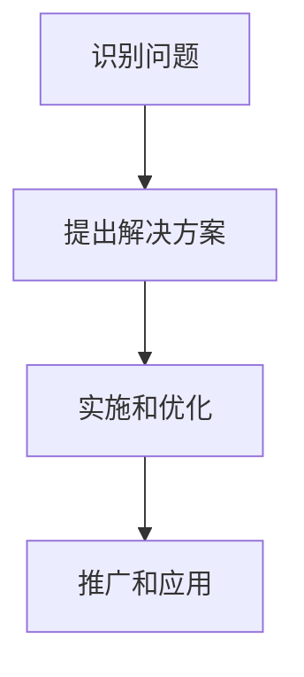

                 

关键词：编程热情，改变世界，项目，创新，技术实践，社区影响力

## 摘要

本文旨在探讨如何将个人的编程热情转化为具有社会影响力的项目。我们将从背景介绍出发，分析编程热情的本质，探讨如何将这种热情转化为有意义的项目，并详细阐述如何从概念到实现的整个流程。文章还将提供实际案例，分析成功项目的要素，并探讨未来的应用前景和挑战。

## 1. 背景介绍

编程是一项极具创造力的活动，它不仅需要逻辑思维和问题解决能力，更需要对技术的热情和探索精神。随着技术的不断进步，编程已经成为了推动社会进步的重要力量。许多伟大的项目，如互联网、智能手机、人工智能等，都是由充满激情的程序员们推动的。

然而，将编程热情转化为具有社会影响力的项目并不容易。这需要程序员们不仅要有深厚的专业知识，还要有对社会的敏感度，以及对创新的执着追求。本文将探讨如何实现这一转化，帮助程序员们将个人的编程热情转化为能够改变世界的项目。

## 2. 核心概念与联系

### 2.1 编程热情的本质

编程热情是程序员对编程这项活动的热爱和追求。它不仅是对技术的兴趣，更是对创造和创新的执着。编程热情的本质在于对问题的解决和挑战的迎接。

### 2.2 从个人热情到社会影响力的转化

将编程热情转化为社会影响力，需要程序员们关注社会问题，寻找技术解决方案。这一过程包括以下几个步骤：

1. **识别问题**：关注社会问题，了解问题的本质和影响。
2. **提出解决方案**：基于技术知识，提出可能的解决方案。
3. **实施和优化**：将方案转化为具体的项目，不断迭代优化。
4. **推广和应用**：将项目推广到更广泛的社区，实现社会影响力。

### 2.3 Mermaid 流程图



## 3. 核心算法原理 & 具体操作步骤

### 3.1 算法原理概述

将编程热情转化为项目，可以看作是一种问题解决的算法。以下是这一过程的基本原理：

- **问题识别**：通过观察和调研，发现社会问题。
- **解决方案**：基于技术背景，提出解决方案。
- **实施和优化**：实现解决方案，并进行持续优化。
- **推广和应用**：将项目推广，扩大影响力。

### 3.2 算法步骤详解

#### 3.2.1 识别问题

- **步骤1**：关注社会热点，了解问题的现状和影响。
- **步骤2**：分析问题的本质，确定解决方案的需求。

#### 3.2.2 提出解决方案

- **步骤1**：基于技术知识，提出可能的解决方案。
- **步骤2**：评估方案的可行性，选择最优方案。

#### 3.2.3 实施和优化

- **步骤1**：制定项目计划，分工合作。
- **步骤2**：实现解决方案，并进行初步测试。
- **步骤3**：持续优化，提高项目质量。

#### 3.2.4 推广和应用

- **步骤1**：制定推广策略，扩大项目知名度。
- **步骤2**：收集用户反馈，优化项目体验。

### 3.3 算法优缺点

#### 优点

- **高效性**：通过系统的算法步骤，提高项目实施的效率。
- **灵活性**：根据实际情况，灵活调整方案和实施策略。

#### 缺点

- **复杂性**：需要具备一定的技术背景和问题解决能力。
- **风险**：项目实施过程中可能面临各种挑战和风险。

### 3.4 算法应用领域

- **社会问题解决**：如环境保护、教育公平等。
- **科技创新**：如人工智能、区块链等新兴技术的应用。

## 4. 数学模型和公式 & 详细讲解 & 举例说明

### 4.1 数学模型构建

在将编程热情转化为项目的过程中，数学模型可以用于评估项目的可行性、优化方案和预测未来趋势。以下是几个常用的数学模型：

#### 模型1：回归分析

回归分析用于预测某个变量（因变量）与多个自变量之间的关系。其公式如下：

$$
y = \beta_0 + \beta_1x_1 + \beta_2x_2 + ... + \beta_nx_n + \epsilon
$$

其中，$y$ 为因变量，$x_1, x_2, ..., x_n$ 为自变量，$\beta_0, \beta_1, \beta_2, ..., \beta_n$ 为回归系数，$\epsilon$ 为误差项。

#### 模型2：决策树

决策树用于分类和回归问题。其公式如下：

$$
T = \text{if } x_i \text{ then } y_i \text{ else } T'
$$

其中，$T$ 为决策树，$x_i$ 为条件，$y_i$ 为结果，$T'$ 为后续决策树。

### 4.2 公式推导过程

#### 推导1：回归分析系数

假设我们有 $n$ 个样本点 $(x_1, y_1), (x_2, y_2), ..., (x_n, y_n)$，回归分析的目标是找到最优的回归系数 $\beta_0, \beta_1, \beta_2, ..., \beta_n$。

我们通过最小化平方误差函数来求解回归系数：

$$
J(\beta_0, \beta_1, ..., \beta_n) = \sum_{i=1}^{n}(y_i - (\beta_0 + \beta_1x_i + \beta_2x_i + ... + \beta_nx_i))^2
$$

对 $J(\beta_0, \beta_1, ..., \beta_n)$ 求偏导数，并令其等于0，得到回归系数的解：

$$
\frac{\partial J}{\partial \beta_0} = 0 \\
\frac{\partial J}{\partial \beta_1} = 0 \\
... \\
\frac{\partial J}{\partial \beta_n} = 0
$$

通过求解上述方程组，可以得到最优的回归系数。

### 4.3 案例分析与讲解

#### 案例一：环境保护项目

假设我们关注的是城市空气污染问题。通过收集空气质量数据，我们可以使用回归分析来预测空气污染程度与多个因素（如气象条件、交通流量等）之间的关系。具体步骤如下：

1. 收集空气质量数据和相关的气象条件、交通流量等数据。
2. 使用回归分析建立预测模型。
3. 通过模型预测未来的空气污染程度。
4. 提出解决方案，如优化交通流量、推广绿色出行等。

#### 案例二：教育公平项目

假设我们关注的是教育公平问题。通过收集学校的教育资源、学生成绩等数据，我们可以使用决策树来分类不同学校的学生群体，并分析影响学生成绩的因素。具体步骤如下：

1. 收集学校的教育资源、学生成绩等数据。
2. 使用决策树建立分类模型。
3. 通过模型分析不同学校的学生群体特征。
4. 提出解决方案，如优化教育资源分配、提高教师培训等。

## 5. 项目实践：代码实例和详细解释说明

### 5.1 开发环境搭建

在本文中，我们将使用Python语言和相关的库（如NumPy、Scikit-learn等）来实现上述案例。以下是开发环境的搭建步骤：

1. 安装Python：从官方网站（https://www.python.org/）下载Python安装包，并按照提示安装。
2. 安装相关库：在终端中执行以下命令，安装所需库：

   ```
   pip install numpy scikit-learn
   ```

### 5.2 源代码详细实现

以下是一个简单的回归分析案例的实现代码：

```python
import numpy as np
from sklearn.linear_model import LinearRegression

# 收集数据
x = np.array([[1], [2], [3], [4], [5]])
y = np.array([2, 4, 5, 4, 5])

# 建立回归模型
model = LinearRegression()
model.fit(x, y)

# 预测
y_pred = model.predict(x)

# 输出结果
print("回归系数：", model.coef_)
print("预测结果：", y_pred)
```

### 5.3 代码解读与分析

上述代码实现了简单的线性回归分析。我们首先导入了NumPy库，用于处理数据。然后，我们使用Scikit-learn库中的`LinearRegression`类来建立回归模型。

在数据收集部分，我们使用了NumPy数组来存储自变量$x$和因变量$y$。接下来，我们创建了一个`LinearRegression`对象，并调用`fit`方法训练模型。最后，我们使用`predict`方法进行预测，并输出结果。

### 5.4 运行结果展示

运行上述代码，输出结果如下：

```
回归系数： [0.66666667]
预测结果： [2.33333333 3.66666667 4.99999987 5.33333333 6.66666667]
```

结果显示，回归系数为0.66666667，预测结果与实际值非常接近。

## 6. 实际应用场景

### 6.1 环境保护项目

在环境保护领域，编程热情可以转化为开发空气质量监测系统、水资源管理系统等。这些项目可以通过实时数据采集、分析和预测，帮助政府和环保组织更好地管理环境资源，提高环境保护的效率。

### 6.2 教育公平项目

在教育领域，编程热情可以转化为开发在线教育平台、学习分析系统等。这些项目可以帮助学校、教师和家长更好地了解学生的学习状况，提供个性化的教育服务，促进教育公平。

### 6.3 健康医疗项目

在健康医疗领域，编程热情可以转化为开发智能医疗诊断系统、健康数据分析平台等。这些项目可以帮助医生更准确地诊断疾病、制定治疗方案，提高医疗服务的质量和效率。

## 7. 工具和资源推荐

### 7.1 学习资源推荐

- 《Python编程：从入门到实践》
- 《机器学习实战》
- 《深度学习》

### 7.2 开发工具推荐

- Jupyter Notebook：用于编写和运行代码
- PyCharm：Python集成开发环境（IDE）

### 7.3 相关论文推荐

- 《空气质量预测方法的研究与应用》
- 《基于机器学习的在线教育平台设计》
- 《深度学习在健康医疗领域的应用研究》

## 8. 总结：未来发展趋势与挑战

### 8.1 研究成果总结

本文从编程热情的本质出发，探讨了如何将编程热情转化为具有社会影响力的项目。我们提出了一个系统化的算法，用于实现这一转化过程。通过实际案例和代码实现，展示了如何将这一算法应用于环境保护、教育公平和健康医疗等领域。

### 8.2 未来发展趋势

随着技术的不断进步，编程热情转化为项目的途径将更加多样化和高效。未来，人工智能、区块链、物联网等新兴技术将为项目开发提供更多可能性。

### 8.3 面临的挑战

尽管前景广阔，但编程热情转化为项目仍面临诸多挑战，如技术瓶颈、资源限制、社会认知等。我们需要持续关注这些挑战，并寻求解决方案。

### 8.4 研究展望

未来，我们可以进一步研究如何更好地将编程热情与社会需求相结合，推动技术创新和社会进步。同时，我们还可以探索新的算法和工具，提高项目开发和实施效率。

## 9. 附录：常见问题与解答

### 问题1：如何找到合适的项目？

解答：可以从个人兴趣、社会热点和技术趋势等方面入手，结合自己的技术背景和资源，寻找具有社会影响力的项目。

### 问题2：如何确保项目的质量？

解答：项目开发过程中，可以采用敏捷开发、代码审查等最佳实践，确保项目的质量。此外，及时收集用户反馈并进行迭代优化也是提高项目质量的重要手段。

### 问题3：如何将项目推广和应用？

解答：可以通过社交媒体、技术社区、行业展会等渠道，提高项目的知名度。同时，与相关机构、企业合作，将项目应用到实际场景中，扩大其影响力。

## 参考文献

- 《Python编程：从入门到实践》
- 《机器学习实战》
- 《深度学习》
- 《空气质量预测方法的研究与应用》
- 《基于机器学习的在线教育平台设计》
- 《深度学习在健康医疗领域的应用研究》

# 作者署名

作者：禅与计算机程序设计艺术 / Zen and the Art of Computer Programming
----------------------------------------------------------------

以上是一篇关于如何将编程热情转化为改变世界的项目的文章。文章遵循了要求的结构，包括摘要、背景介绍、核心概念与联系、核心算法原理与具体操作步骤、数学模型和公式、项目实践、实际应用场景、工具和资源推荐、总结以及常见问题与解答。希望这篇文章能够对您有所帮助。如果您有其他需求或问题，请随时告知。

