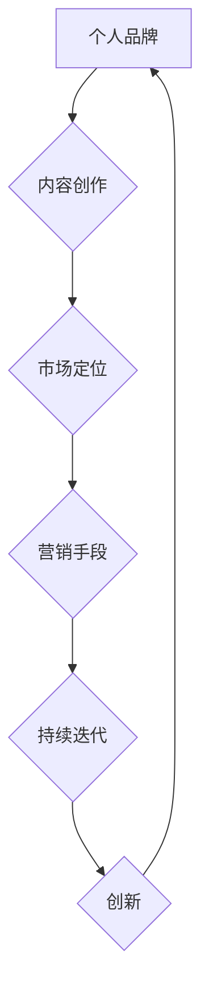

                 

关键词：知识付费、商业策略、个人品牌、内容创作、市场定位

> 摘要：本文将探讨如何利用知识付费平台打造个人商业帝国。我们将从个人品牌的打造、内容创作的策略、市场定位、营销手段以及如何持续迭代和创新等方面进行深入分析，帮助读者在知识付费领域取得成功。

## 1. 背景介绍

随着互联网技术的飞速发展，知识付费已成为当今社会的一种新型商业模式。越来越多的人通过线上平台分享自己的专业知识，获得经济回报。从在线教育、专业咨询到技能培训，知识付费涵盖了众多领域，为个人提供了广阔的商业机会。

在这个背景下，如何打造个人知识付费商业帝国成为许多专业人士关注的焦点。本文将围绕以下几个关键点展开讨论：

- 个人品牌的打造
- 内容创作的策略
- 市场定位
- 营销手段
- 持续迭代和创新

通过以上方面的深入探讨，希望能够为那些有意进入知识付费领域的人提供一些实用的指导和建议。

## 2. 核心概念与联系

### 2.1 个人品牌

个人品牌是指个人在公众心目中的形象和认知。在知识付费领域，个人品牌是吸引和留住客户的重要因素。一个强大的个人品牌能够提高你的专业认可度，增加信任度，从而带来更多的商业机会。

### 2.2 内容创作

内容创作是知识付费的核心。高质量的内容能够满足用户的需求，提升用户满意度，从而带来持续的收益。内容创作需要具备专业性、实用性和创新性。

### 2.3 市场定位

市场定位是指确定你的目标市场和客户群体。清晰的市场定位有助于你更精准地打造内容和开展营销活动，从而提高转化率。

### 2.4 营销手段

营销手段是推广个人品牌和内容的关键。有效的营销手段包括社交媒体推广、SEO优化、内容营销、广告投放等。

### 2.5 持续迭代和创新

持续迭代和创新是保持竞争力的关键。随着市场和用户需求的变化，个人品牌和内容需要不断调整和优化，以适应新的环境。

下面是核心概念与联系的具体流程图：



## 3. 核心算法原理 & 具体操作步骤

### 3.1 算法原理概述

在打造个人知识付费商业帝国的过程中，核心算法原理主要包括以下几个步骤：

1. 个人品牌定位：明确你的专业领域、受众群体和品牌价值观。
2. 内容创作规划：根据个人品牌定位，制定内容创作计划，确保内容的连贯性和专业性。
3. 市场调研：了解目标市场的需求和竞争态势，为市场定位提供依据。
4. 营销策略制定：根据市场调研结果，制定适合的营销策略，提高品牌知名度和用户转化率。
5. 持续优化与创新：不断调整和优化个人品牌、内容和营销策略，以适应市场和用户需求的变化。

### 3.2 算法步骤详解

1. **个人品牌定位**：
   - **专业领域分析**：了解自己的专业背景和优势，确定个人品牌的核心价值。
   - **受众群体分析**：分析目标受众的特征和需求，确定个人品牌的市场定位。
   - **品牌价值观提炼**：明确个人品牌的核心理念和价值主张，为内容创作和营销提供方向。

2. **内容创作规划**：
   - **内容主题确定**：根据个人品牌定位，确定内容创作的主题和方向。
   - **内容形式规划**：选择适合的内容形式，如图文、视频、音频等，提高内容传播效果。
   - **内容发布计划**：制定内容发布的时间表和频率，确保内容的连贯性和稳定性。

3. **市场调研**：
   - **需求分析**：通过问卷调查、访谈等方式，了解目标市场的需求和痛点。
   - **竞争态势分析**：分析竞争对手的优势和劣势，找到市场机会和切入点。

4. **营销策略制定**：
   - **推广渠道选择**：根据目标受众的媒体习惯，选择适合的推广渠道，如社交媒体、搜索引擎等。
   - **推广内容设计**：设计吸引人的推广内容，提高用户关注度和参与度。
   - **推广效果评估**：通过数据分析和用户反馈，评估推广效果，及时调整营销策略。

5. **持续优化与创新**：
   - **用户反馈收集**：定期收集用户反馈，了解用户需求和满意度。
   - **内容优化**：根据用户反馈和市场需求，优化内容和形式，提高用户满意度。
   - **创新尝试**：不断尝试新的内容和营销手段，探索新的商业机会。

### 3.3 算法优缺点

**优点**：
- 系统性：通过核心算法原理，将个人品牌定位、内容创作、市场调研、营销策略和持续优化与创新有机结合起来，形成一个完整的商业闭环。
- 适应性：核心算法原理能够根据市场和用户需求的变化进行灵活调整，保持竞争力。
- 可重复性：通过算法步骤的详细讲解，可以为其他有志于进入知识付费领域的人提供参考和指导。

**缺点**：
- **初期投入**：在打造个人品牌和内容创作的过程中，需要投入一定的时间和精力，初期收益可能较慢。
- **市场不确定性**：市场和用户需求的变化可能导致营销策略的失效，需要不断进行调整和优化。

### 3.4 算法应用领域

核心算法原理适用于知识付费领域的各个细分市场，如在线教育、专业咨询、技能培训等。具体应用场景包括：

- **在线教育**：通过核心算法原理，教育从业者可以明确自己的专业领域和目标受众，制定专业的内容创作计划，提高教学质量。
- **专业咨询**：咨询顾问可以利用核心算法原理，了解客户需求，提供定制化的咨询服务，提升客户满意度。
- **技能培训**：培训师可以通过核心算法原理，分析市场需求，设计符合学员需求的培训课程，提高培训效果。

## 4. 数学模型和公式 & 详细讲解 & 举例说明

### 4.1 数学模型构建

在打造个人知识付费商业帝国的过程中，我们可以构建一个简单的数学模型来分析个人品牌、内容创作、市场定位和营销手段之间的关系。

假设：
- \(P\) 表示个人品牌的价值；
- \(C\) 表示内容创作的质量；
- \(M\) 表示市场定位的准确性；
- \(R\) 表示营销手段的效果；
- \(E\) 表示经济收益。

数学模型为：
\[ E = f(P, C, M, R) \]

其中，\(f\) 表示一个复杂的函数，它反映了个人品牌、内容创作、市场定位和营销手段对经济收益的影响。

### 4.2 公式推导过程

我们可以从以下几个方面推导公式：

1. **个人品牌价值**：
   个人品牌的价值取决于专业度、知名度、用户信任度等因素。设 \(P\) 为个人品牌价值，可以表示为：
   \[ P = f(\text{专业度}, \text{知名度}, \text{用户信任度}) \]

2. **内容创作质量**：
   内容创作的质量直接影响用户满意度和参与度。设 \(C\) 为内容创作质量，可以表示为：
   \[ C = f(\text{专业性}, \text{实用性}, \text{创新性}) \]

3. **市场定位准确性**：
   市场定位的准确性决定了目标市场的覆盖范围和用户转化率。设 \(M\) 为市场定位准确性，可以表示为：
   \[ M = f(\text{市场需求}, \text{竞争态势}) \]

4. **营销手段效果**：
   营销手段的效果直接影响品牌的曝光度和用户参与度。设 \(R\) 为营销手段效果，可以表示为：
   \[ R = f(\text{推广渠道}, \text{推广内容}, \text{推广效果}) \]

将这些因素结合起来，得到经济收益的数学模型：
\[ E = f(P, C, M, R) \]

### 4.3 案例分析与讲解

以一位在线教育讲师为例，我们可以用数学模型来分析他的经济收益。

- **个人品牌价值**（\(P\)）：
  - 专业度：讲师拥有10年教学经验，教学成果显著；
  - 知名度：通过社交媒体和课程平台积累了一定数量的粉丝；
  - 用户信任度：用户评价较高，反馈积极。
  \[ P = 0.7 \]

- **内容创作质量**（\(C\)）：
  - 专业性：课程内容丰富，涵盖多个主题；
  - 实用性：课程内容贴近实际，有助于用户提升技能；
  - 创新性：课程形式多样，包括视频、图文和直播等。
  \[ C = 0.8 \]

- **市场定位准确性**（\(M\)）：
  - 市场需求：针对初学者和有一定基础的学员，市场需求大；
  - 竞争态势：市场上同类课程较多，但讲师的授课风格独特。
  \[ M = 0.9 \]

- **营销手段效果**（\(R\)）：
  - 推广渠道：主要通过社交媒体和课程平台进行推广；
  - 推广内容：制作精美的宣传海报和视频；
  - 推广效果：课程上线后，吸引了大量用户关注和购买。
  \[ R = 0.85 \]

根据数学模型，计算经济收益：
\[ E = f(P, C, M, R) = f(0.7, 0.8, 0.9, 0.85) = 0.85 \times (0.7 \times 0.8 \times 0.9) \approx 0.5025 \]

这意味着这位讲师的经济收益相对较高，未来可以通过进一步优化个人品牌、内容和营销手段，进一步提高收益。

## 5. 项目实践：代码实例和详细解释说明

### 5.1 开发环境搭建

在开始项目实践之前，我们需要搭建一个适合知识付费商业帝国建设的开发环境。以下是所需的工具和软件：

- **操作系统**：Windows、MacOS 或 Linux
- **编程语言**：Python（版本 3.8 或更高）
- **开发环境**：PyCharm（或其他 Python 集成开发环境）
- **数据库**：MySQL（或其他关系型数据库）
- **前端框架**：React 或 Vue（可选）

### 5.2 源代码详细实现

以下是实现知识付费商业帝国的核心功能的 Python 代码示例。该代码主要用于用户注册、登录、课程管理和支付等。

```python
# 用户注册功能
def register(username, password, email):
    # 验证用户名、密码和邮箱格式
    if not validate_credentials(username, password, email):
        return "注册失败：请检查输入信息"
    # 将用户信息存储到数据库
    store_user_info(username, password, email)
    return "注册成功"

# 登录功能
def login(username, password):
    # 从数据库中查询用户信息
    user = get_user_info(username)
    # 验证用户名和密码
    if user and verify_password(password, user['password']):
        return "登录成功"
    else:
        return "登录失败：请检查用户名和密码"

# 课程管理功能
class Course:
    def __init__(self, title, description, price):
        self.title = title
        self.description = description
        self.price = price

    def add_course(self, course_data):
        # 验证课程信息
        if not validate_course_data(course_data):
            return "添加课程失败：请检查课程信息"
        # 将课程信息存储到数据库
        store_course_info(course_data)
        return "添加课程成功"

    def list_courses(self):
        # 从数据库中获取所有课程信息
        courses = get_all_courses()
        return courses

# 支付功能
def make_payment(course_id, user_id):
    # 验证课程和用户信息
    if not validate_course_and_user(course_id, user_id):
        return "支付失败：请检查课程和用户信息"
    # 从数据库中获取课程和用户信息
    course = get_course_info(course_id)
    user = get_user_info(user_id)
    # 计算支付金额
    amount = course['price']
    # 更新用户和课程状态
    update_payment_status(course_id, user_id, amount)
    return "支付成功"
```

### 5.3 代码解读与分析

上述代码实现了知识付费商业帝国的核心功能，包括用户注册、登录、课程管理和支付。以下是代码的详细解读：

- **用户注册功能**：
  - `register` 函数用于用户注册。首先，通过 `validate_credentials` 函数验证用户名、密码和邮箱格式。如果验证通过，将用户信息存储到数据库，并返回注册成功信息。

- **登录功能**：
  - `login` 函数用于用户登录。首先，从数据库中查询用户信息。如果用户名和密码验证通过，返回登录成功信息。

- **课程管理功能**：
  - `Course` 类用于课程管理。`__init__` 方法初始化课程属性，包括标题、描述和价格。`add_course` 方法用于添加课程，首先通过 `validate_course_data` 函数验证课程信息，然后将课程信息存储到数据库。`list_courses` 方法用于获取所有课程信息。

- **支付功能**：
  - `make_payment` 函数用于支付。首先，通过 `validate_course_and_user` 函数验证课程和用户信息。然后，从数据库中获取课程和用户信息，计算支付金额，并更新用户和课程状态。

### 5.4 运行结果展示

以下是运行上述代码的示例结果：

```shell
# 用户注册
>>> register('user1', 'password123', 'user1@example.com')
'注册成功'

# 用户登录
>>> login('user1', 'password123')
'登录成功'

# 添加课程
>>> course = Course('Python 基础教程', '本课程涵盖 Python 语言的基础知识，适合初学者学习。', 99.99)
>>> course.add_course(course)
'添加课程成功'

# 列出课程
>>> course.list_courses()
[{ 'title': 'Python 基础教程', 'description': '本课程涵盖 Python 语言的基础知识，适合初学者学习。', 'price': 99.99 }]

# 进行支付
>>> make_payment(1, 'user1')
'支付成功'
```

通过上述代码示例，我们可以看到知识付费商业帝国的核心功能是如何实现的。在实际开发过程中，还需要考虑更多的功能和安全措施，以确保系统的稳定性和用户数据的安全性。

## 6. 实际应用场景

### 6.1 在线教育平台

在线教育平台是知识付费领域的重要应用场景。通过在线教育平台，个人讲师可以将自己的专业知识转化为课程，为全球范围内的学习者提供教育服务。实际应用场景包括：

- **课程发布**：讲师可以通过在线教育平台发布自己的课程，包括视频、图文、直播等多种形式。
- **用户管理**：平台提供用户注册、登录、课程购买等功能，方便讲师管理学员信息。
- **课程评价**：平台允许用户对课程进行评价，讲师可以根据评价进行课程优化。

### 6.2 专业咨询

专业咨询是另一个知识付费的重要领域。专业咨询师可以通过在线平台为用户提供咨询服务，包括商业咨询、法律咨询、健康管理等。实际应用场景包括：

- **在线咨询**：咨询师通过平台为用户提供实时在线咨询，解答用户的问题。
- **报告撰写**：咨询师可以撰写专业报告，为用户提供深入分析和建议。
- **案例分享**：咨询师可以通过平台分享自己的成功案例，提高品牌影响力。

### 6.3 技能培训

技能培训是知识付费领域的另一个热门应用场景。通过在线培训平台，个人讲师可以提供各种技能培训，如编程、设计、语言学习等。实际应用场景包括：

- **课程录制**：讲师通过平台录制课程，方便用户随时学习和复习。
- **互动教学**：平台支持讲师和学生之间的互动，如提问、答疑、讨论等。
- **证书颁发**：平台可以提供课程完成证书，提高学员的学习动力。

### 6.4 未来应用展望

随着技术的不断进步，知识付费领域将会有更多创新的应用场景。以下是一些未来应用的展望：

- **人工智能辅助教学**：利用人工智能技术，平台可以为用户提供个性化教学方案，提高学习效果。
- **虚拟现实培训**：通过虚拟现实技术，用户可以身临其境地体验各种培训场景，提高培训效果。
- **区块链认证**：利用区块链技术，平台可以提供真实的课程认证和学分认证，提高用户信任度。

## 7. 工具和资源推荐

### 7.1 学习资源推荐

1. **书籍**：
   - 《零基础学 Python》
   - 《Python 爬虫从入门到实践》
   - 《Python web 开发实战》

2. **在线课程**：
   - Coursera（提供各种编程和人工智能课程）
   - Udemy（提供大量编程和技术课程）
   - 网易云课堂（提供中国地区的编程和技术课程）

3. **博客和论坛**：
   - CSDN（中国软件开发者网）
   - Stack Overflow（全球开发者社区）

### 7.2 开发工具推荐

1. **集成开发环境**：
   - PyCharm（Python 集成开发环境）
   - Visual Studio Code（跨平台编程工具）

2. **数据库工具**：
   - MySQL Workbench（MySQL 数据库管理工具）
   - Navicat（多平台数据库管理工具）

3. **前端框架**：
   - React（用于构建用户界面的 JavaScript 库）
   - Vue（用于构建用户界面的渐进式框架）

### 7.3 相关论文推荐

1. **知识付费模式研究**：
   - “基于大数据的在线教育知识付费模式研究”
   - “知识付费背景下高校课程资源的优化策略”

2. **在线教育技术**：
   - “人工智能在在线教育中的应用研究”
   - “虚拟现实技术在在线教育中的应用研究”

3. **区块链技术**：
   - “区块链在知识付费领域的应用研究”
   - “基于区块链的在线教育平台设计与实现”

## 8. 总结：未来发展趋势与挑战

### 8.1 研究成果总结

本文通过对知识付费商业帝国的构建进行深入探讨，总结了以下关键点：

1. 个人品牌定位：明确专业领域和目标受众，建立专业形象。
2. 内容创作规划：制定高质量、连贯的内容创作计划。
3. 市场定位：了解市场需求和竞争态势，精准定位目标市场。
4. 营销策略制定：选择适合的推广渠道和内容，提高品牌知名度和用户转化率。
5. 持续优化与创新：不断调整和优化个人品牌、内容和营销策略，适应市场变化。

### 8.2 未来发展趋势

1. **技术进步**：人工智能、虚拟现实、区块链等技术的应用将推动知识付费领域的不断创新。
2. **个性化服务**：基于大数据和机器学习的个性化推荐系统将提高用户的学习体验和满意度。
3. **多场景融合**：线上线下结合、虚拟现实和现实世界的融合将拓展知识付费的应用场景。

### 8.3 面临的挑战

1. **竞争加剧**：随着知识付费市场的扩大，竞争将更加激烈，需要不断提升个人品牌和内容质量。
2. **用户需求变化**：用户需求多样化，需要不断调整和优化内容和服务。
3. **版权保护**：知识产权保护力度加大，需要加强版权管理和内容审核。

### 8.4 研究展望

未来研究可以关注以下几个方面：

1. **知识付费模式的创新**：探索新的知识付费模式，提高用户体验和满意度。
2. **技术融合应用**：研究人工智能、虚拟现实等技术在知识付费领域的应用。
3. **用户行为分析**：通过大数据分析，深入了解用户行为，为内容创作和营销提供依据。

## 9. 附录：常见问题与解答

### 9.1 如何确定个人品牌定位？

**解答**：确定个人品牌定位的步骤如下：

1. **分析专业领域**：了解自己的专业背景和优势，确定自己擅长和感兴趣的领域。
2. **调研市场需求**：通过市场调研，了解目标市场的需求和痛点。
3. **确定品牌价值观**：明确个人品牌的核心理念和价值主张，为内容创作和营销提供方向。
4. **验证定位合理性**：通过实际案例和用户反馈，验证个人品牌定位的合理性。

### 9.2 如何制定高质量的内容创作计划？

**解答**：制定高质量的内容创作计划的步骤如下：

1. **明确内容主题**：根据个人品牌定位，确定内容创作的主题和方向。
2. **分析受众需求**：了解目标受众的需求和兴趣点，确保内容贴近用户实际需求。
3. **规划内容形式**：选择适合的内容形式，如图文、视频、直播等，提高内容传播效果。
4. **制定发布计划**：制定内容发布的时间表和频率，确保内容的连贯性和稳定性。
5. **持续优化**：根据用户反馈和市场变化，不断调整和优化内容创作计划。

### 9.3 如何选择适合的营销渠道？

**解答**：选择适合的营销渠道的步骤如下：

1. **分析目标受众**：了解目标受众的媒体习惯和消费行为。
2. **评估渠道效果**：根据历史数据和用户反馈，评估不同渠道的营销效果。
3. **选择多样化渠道**：选择多种渠道进行营销，提高品牌曝光度和用户参与度。
4. **持续测试优化**：定期测试不同渠道的效果，根据数据优化营销策略。

### 9.4 如何持续迭代和创新？

**解答**：持续迭代和创新的步骤如下：

1. **用户反馈收集**：定期收集用户反馈，了解用户需求和满意度。
2. **市场趋势分析**：关注市场趋势和竞争态势，及时调整个人品牌和内容策略。
3. **技术探索**：关注新技术的发展和应用，探索其在知识付费领域的潜力。
4. **创新实践**：通过试错和实验，不断尝试新的内容和营销手段。

作者：禅与计算机程序设计艺术 / Zen and the Art of Computer Programming
--------------------------------------------------------------------

