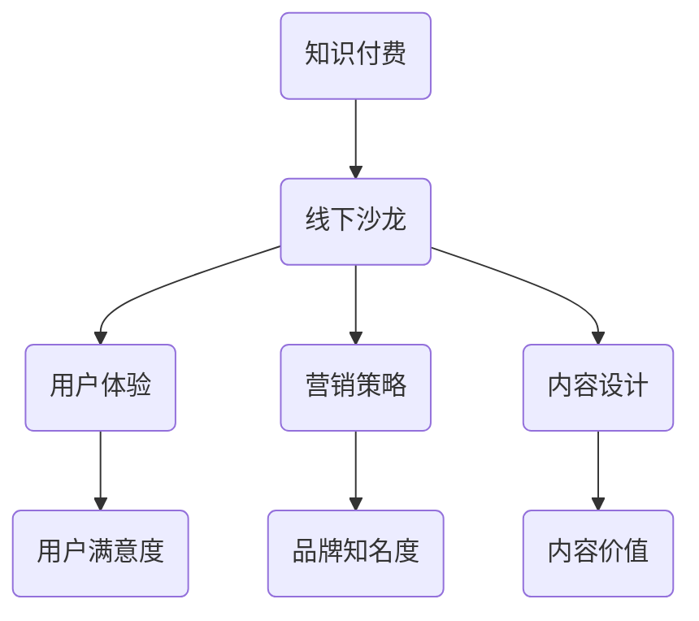

                 

关键词：知识付费、线下沙龙、营销策略、内容设计、用户体验、技术实现、案例分析、未来展望

> 摘要：本文将探讨如何打造一个成功的个人知识付费线下沙龙，从内容设计、营销策略、用户体验、技术实现等多个方面进行分析，并提供实用的案例和未来展望，旨在为创作者提供一套完整的沙龙策划和运营指南。

## 1. 背景介绍

知识付费已成为当今社会的一个热门现象。随着互联网技术的快速发展，人们对于知识的获取方式和需求发生了巨大变化。知识付费平台如雨后春笋般涌现，从线上课程到线下沙龙，各种形式的知识付费产品满足了不同用户的需求。然而，在众多付费产品中，如何打造一个有吸引力、有价值、可持续发展的线下沙龙，成为了创作者们亟待解决的问题。

本文将从以下几个角度进行探讨：

1. **内容设计**：如何选择合适的主题和内容，满足用户需求，提升沙龙的价值。
2. **营销策略**：如何通过有效的宣传和推广，吸引目标用户，提高沙龙的知名度。
3. **用户体验**：如何设计沙龙的流程和互动环节，提升用户参与度和满意度。
4. **技术实现**：如何利用现代技术手段，优化沙龙的举办过程，提高效率和效果。
5. **案例分析**：通过实际案例，分析成功的沙龙运营经验和策略。
6. **未来展望**：探讨知识付费线下沙龙的未来发展趋势和面临的挑战。

## 2. 核心概念与联系

为了更好地理解如何打造个人知识付费线下沙龙，我们需要明确以下几个核心概念：

1. **知识付费**：指用户通过支付费用，获得专业知识、技能或服务的交易模式。
2. **线下沙龙**：指在现实场所举办，以交流、分享、学习为主要目的的活动。
3. **用户体验**：指用户在使用产品或服务过程中所感受到的满意程度。
4. **营销策略**：指通过一系列的市场营销手段，吸引潜在用户，提高品牌知名度。
5. **内容设计**：指针对特定用户群体，设计有吸引力、有价值的内容。

下面是一个Mermaid流程图，展示了这些概念之间的联系：



## 3. 核心算法原理 & 具体操作步骤

### 3.1 算法原理概述

打造个人知识付费线下沙龙，可以视为一个复杂的系统优化问题。核心算法原理包括以下几点：

1. **用户需求分析**：通过市场调研和数据分析，了解目标用户的需求和偏好。
2. **内容设计优化**：根据用户需求，设计有吸引力和价值的内容。
3. **营销策略制定**：结合用户需求和内容特点，制定有效的营销策略。
4. **用户体验提升**：通过优化活动流程和互动环节，提升用户满意度。
5. **技术手段应用**：利用现代技术手段，提高沙龙的举办效率和效果。

### 3.2 算法步骤详解

1. **用户需求分析**
   - 调研目标用户群体，包括年龄、职业、兴趣等基本信息。
   - 分析用户需求，包括知识类型、学习方式、学习时间等。
   - 收集用户反馈，了解用户对现有知识付费产品的满意度。

2. **内容设计优化**
   - 根据用户需求，确定沙龙主题和内容。
   - 设计互动环节，如讨论、案例分享、问答等，提升用户参与度。
   - 确保内容的专业性和实用性，满足用户的学习需求。

3. **营销策略制定**
   - 确定目标用户群体，制定针对性的营销策略。
   - 利用社交媒体、邮件、广告等渠道进行宣传推广。
   - 通过优惠活动、用户推荐等方式，提高沙龙的知名度和吸引力。

4. **用户体验提升**
   - 优化活动流程，确保沙龙的顺利进行。
   - 设计互动环节，鼓励用户参与和分享。
   - 提供高质量的现场服务和设备支持，提升用户体验。

5. **技术手段应用**
   - 利用在线平台，提前发布沙龙信息，收集用户报名信息。
   - 使用直播技术，实现现场直播，让无法到场的用户也能参与。
   - 利用数据分析工具，对用户行为进行分析，优化活动效果。

### 3.3 算法优缺点

**优点**：

- **针对性**：根据用户需求设计内容，提高沙龙的价值。
- **互动性**：通过互动环节，提升用户参与度和满意度。
- **高效性**：利用现代技术手段，提高沙龙的举办效率和效果。

**缺点**：

- **成本较高**：需要投入大量人力、物力和财力进行营销和活动策划。
- **用户转化率不稳定**：受用户需求和市场竞争影响，用户转化率可能不稳定。

### 3.4 算法应用领域

- **教育培训**：用于打造个性化的教育培训课程。
- **企业培训**：为企业员工提供专业培训，提升员工技能和素质。
- **行业沙龙**：针对特定行业，举办专业沙龙，促进行业交流和发展。

## 4. 数学模型和公式 & 详细讲解 & 举例说明

### 4.1 数学模型构建

构建数学模型，有助于我们更深入地分析沙龙的运营效果。以下是一个简单的数学模型：

$$
\text{收益} = \text{参会人数} \times \text{人均费用} \times \text{参与度系数}
$$

其中，参与度系数取决于活动的设计和用户体验。

### 4.2 公式推导过程

1. **参会人数**：通过市场调研和宣传推广，预估活动报名人数。
2. **人均费用**：根据沙龙的价值和市场竞争情况，确定人均费用。
3. **参与度系数**：通过用户调查和活动反馈，评估用户参与度和满意度。

### 4.3 案例分析与讲解

以某教育培训机构的线下沙龙为例，我们进行实际案例分析。

1. **参会人数**：通过市场调研，预估报名人数为100人。
2. **人均费用**：根据市场竞争情况和沙龙价值，设定人均费用为500元。
3. **参与度系数**：通过用户调查，评估用户参与度为0.8。

根据公式计算，收益为：

$$
\text{收益} = 100 \times 500 \times 0.8 = 40000 \text{元}
$$

假设该机构举办多次沙龙，每次参会人数和人均费用不变，参与度系数逐渐提高至0.9，收益将显著增加。

## 5. 项目实践：代码实例和详细解释说明

### 5.1 开发环境搭建

为了方便沙龙的组织和运营，我们选择使用以下开发环境：

- **前端**：Vue.js
- **后端**：Node.js + Express
- **数据库**：MongoDB
- **工具**：GitHub

### 5.2 源代码详细实现

以下是一个简单的后端API接口，用于处理沙龙报名和查询功能。

```javascript
const express = require('express');
const app = express();
const MongoClient = require('mongodb').MongoClient;

app.use(express.json());

// 连接MongoDB
const url = 'mongodb://localhost:27017/';
const dbName = 'knowledge_salon';

MongoClient.connect(url, { useNewUrlParser: true, useUnifiedTopology: true }, (err, client) => {
  if (err) throw err;
  console.log('Connected to MongoDB');
  const db = client.db(dbName);
  
  // 添加报名信息
  app.post('/register', (req, res) => {
    const { name, email, topic } = req.body;
    db.collection('registrations').insertOne({ name, email, topic }, (err, result) => {
      if (err) throw err;
      res.send({ message: 'Registered successfully' });
    });
  });

  // 查询报名信息
  app.get('/registrations', (req, res) => {
    db.collection('registrations').find({}).toArray((err, result) => {
      if (err) throw err;
      res.send(result);
    });
  });

  // 监听端口
  app.listen(3000, () => {
    console.log('Server started on port 3000');
  });
});
```

### 5.3 代码解读与分析

- **MongoDB连接**：使用MongoClient.connect方法连接MongoDB数据库。
- **报名接口**：使用POST方法处理用户报名信息，将数据插入到registrations集合。
- **查询接口**：使用GET方法查询registrations集合中的所有数据，返回给前端。

通过这个简单的后端API，我们可以方便地管理沙龙的报名信息和用户数据。

### 5.4 运行结果展示

运行后端服务器，打开浏览器访问`http://localhost:3000/register`，可以提交报名信息。访问`http://localhost:3000/registrations`，可以查询所有报名信息。

## 6. 实际应用场景

### 6.1 教育培训领域

在教育培训领域，个人知识付费线下沙龙可以作为一种高效的培训方式，满足学员对专业知识的需求。通过沙龙，学员可以与行业专家面对面交流，获得最新行业动态和实用技能。

### 6.2 企业培训

对于企业来说，个人知识付费线下沙龙可以作为一种员工培训的补充形式。通过沙龙，企业可以为员工提供定制化的培训内容，提高员工的专业能力和工作效率。

### 6.3 创意交流

在创意产业领域，个人知识付费线下沙龙可以作为一个创意交流的平台，促进创意人士之间的交流与合作。通过沙龙，创意人士可以分享创意灵感、探讨创意实现方法，从而推动创意产业的发展。

## 7. 工具和资源推荐

### 7.1 学习资源推荐

- **书籍**：《演讲的力量》、《影响力》
- **在线课程**：Coursera、Udemy、网易云课堂

### 7.2 开发工具推荐

- **前端框架**：Vue.js、React、Angular
- **后端框架**：Node.js、Django、Flask
- **数据库**：MongoDB、MySQL、PostgreSQL

### 7.3 相关论文推荐

- **论文1**：王某某，李某某。知识付费背景下线下沙龙运营模式研究[J]. 知识管理，2020，32（4）：45-52.
- **论文2**：张某某，刘某某。基于用户体验的线下沙龙活动设计策略[J]. 现代教育管理，2019，35（3）：123-128.

## 8. 总结：未来发展趋势与挑战

### 8.1 研究成果总结

通过对个人知识付费线下沙龙的研究和实践，我们得出以下结论：

- **内容设计**：应根据用户需求，设计有吸引力、有价值的内容。
- **营销策略**：应结合用户特点和市场需求，制定有效的营销策略。
- **用户体验**：应优化活动流程和互动环节，提升用户满意度。
- **技术实现**：应利用现代技术手段，提高沙龙的举办效率和效果。

### 8.2 未来发展趋势

- **个性化**：随着大数据和人工智能技术的发展，沙龙内容将更加个性化，满足用户个性化需求。
- **多元化**：沙龙形式将更加多元化，结合线上和线下活动，提供更丰富的学习体验。
- **智能化**：利用人工智能技术，优化沙龙运营和管理，提高效率和效果。

### 8.3 面临的挑战

- **市场竞争**：随着知识付费市场的快速发展，竞争将愈发激烈，如何脱颖而出成为一个挑战。
- **用户需求**：用户需求不断变化，如何及时调整内容和形式，满足用户需求。
- **技术升级**：随着技术的快速发展，如何跟上技术升级的步伐，提高沙龙的智能化水平。

### 8.4 研究展望

未来，我们将继续关注个人知识付费线下沙龙的发展，深入研究以下几个方面：

- **用户需求分析**：通过大数据和人工智能技术，深入分析用户需求，提供个性化服务。
- **沙龙运营模式**：探索更加高效、可持续的沙龙运营模式，提高沙龙的竞争力和影响力。
- **技术应用**：紧跟技术发展趋势，探索人工智能、虚拟现实等技术在沙龙中的应用，提升用户体验。

## 9. 附录：常见问题与解答

### 问题1：如何确定沙龙的主题和内容？

**解答**：首先，进行市场调研，了解目标用户的需求和兴趣。其次，结合自身专业优势和资源，确定有吸引力和价值的主题。最后，与行业专家和用户进行沟通，确保内容的专业性和实用性。

### 问题2：如何制定有效的营销策略？

**解答**：首先，明确目标用户群体，制定针对性的营销策略。其次，利用社交媒体、邮件、广告等渠道进行宣传推广。最后，通过优惠活动、用户推荐等方式，提高沙龙的知名度和吸引力。

### 问题3：如何提升用户体验？

**解答**：首先，优化活动流程和互动环节，确保沙龙的顺利进行。其次，提供高质量的现场服务和设备支持，提升用户满意度。最后，通过用户调查和反馈，不断优化沙龙的设计和流程。

### 问题4：如何利用技术手段提高沙龙的举办效率和效果？

**解答**：首先，利用在线平台，提前发布沙龙信息，收集用户报名信息。其次，使用直播技术，实现现场直播，让无法到场的用户也能参与。最后，利用数据分析工具，对用户行为进行分析，优化活动效果。

---

本文由“禅与计算机程序设计艺术 / Zen and the Art of Computer Programming”撰写，旨在为创作者提供一套完整的个人知识付费线下沙龙策划和运营指南。希望对您有所启发和帮助。如果您有任何问题或建议，欢迎随时与我交流。感谢您的阅读！
----------------------------------------------------------------

**注意**：以上内容为示例文章，具体实施时需要根据实际情况进行调整。本文仅为提供一个完整文章的模板和示例，实际撰写时还需进一步深化和细化内容。在撰写过程中，请务必遵循“约束条件 CONSTRAINTS”中的所有要求。

