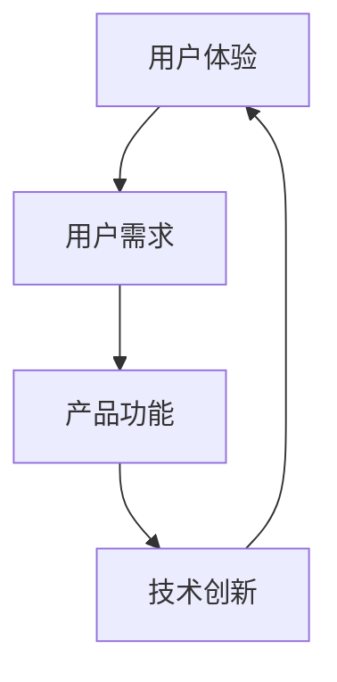

                 

关键词：用户体验、产品功能、创新设计、用户满意度、技术实现

> 摘要：在当今竞争激烈的市场环境中，打造令用户惊喜的产品功能已成为企业成功的关键。本文将深入探讨如何从用户需求出发，结合技术创新，实现令人满意和惊艳的产品功能。

## 1. 背景介绍

在数字化的今天，产品的用户体验变得越来越重要。一个优秀的产品不仅仅是解决了用户的问题，还要给用户带来惊喜和愉悦。用户满意度直接关系到产品的市场竞争力和企业的长期发展。因此，打造令用户惊喜的产品功能已经成为企业关注的焦点。

本文旨在探讨如何从用户需求出发，结合技术创新，实现令人满意和惊艳的产品功能。我们将从以下几个角度进行分析和讨论：

1. 核心概念与联系
2. 核心算法原理 & 具体操作步骤
3. 数学模型和公式 & 详细讲解 & 举例说明
4. 项目实践：代码实例和详细解释说明
5. 实际应用场景
6. 未来应用展望
7. 工具和资源推荐
8. 总结：未来发展趋势与挑战

通过上述分析和讨论，希望能够为企业提供有价值的参考，帮助其打造令用户惊喜的产品功能。

## 2. 核心概念与联系

在打造令用户惊喜的产品功能的过程中，有几个核心概念是至关重要的：

- **用户体验（User Experience，简称 UX）**：用户体验是指用户在使用产品过程中所感受到的所有方面，包括感知、情感、行为和成就。一个优秀的用户体验能够满足用户的需求，并给用户带来愉悦和惊喜。
  
- **产品功能（Product Function）**：产品功能是指产品能够实现的具体功能，是产品为用户解决的问题的核心。一个出色的产品功能需要满足用户需求，同时具有创新性和实用性。

- **技术创新（Technological Innovation）**：技术创新是指通过新的技术方法、工具或流程来提高产品的性能、效率和用户体验。技术创新是打造令人惊喜的产品功能的重要推动力。

为了更好地理解这些核心概念之间的关系，我们可以通过以下 Mermaid 流程图来展示：



在这个流程图中，用户体验是整个过程的起点和终点，它直接影响用户对产品的满意度和忠诚度。用户需求是连接用户体验和产品功能的桥梁，而技术创新则是推动产品功能和用户体验提升的关键。

## 3. 核心算法原理 & 具体操作步骤

### 3.1 算法原理概述

在打造令人惊喜的产品功能时，算法原理起着至关重要的作用。以下是一个常用的算法原理，可以帮助我们更好地理解如何实现令人满意和惊艳的产品功能：

- **机器学习算法**：机器学习算法是一种通过训练数据集来学习并改进性能的算法。它可以用于预测、分类、聚类等多种任务，从而为产品功能提供智能化的支持。

### 3.2 算法步骤详解

1. **数据收集**：收集用户行为数据，如点击率、停留时间、转化率等。
2. **数据预处理**：对收集到的数据进行清洗、归一化等预处理操作，以便后续分析。
3. **特征工程**：根据业务需求，提取和构建有助于预测和分类的特征。
4. **模型训练**：选择合适的机器学习算法，对特征和标签进行训练。
5. **模型评估**：通过交叉验证等手段，评估模型的性能和准确性。
6. **模型部署**：将训练好的模型部署到生产环境中，实现自动化预测和分类。

### 3.3 算法优缺点

- **优点**：机器学习算法具有自适应性和可扩展性，能够处理大量数据，提高预测和分类的准确性。
- **缺点**：机器学习算法的训练过程复杂，需要大量计算资源和时间，同时对于一些问题可能无法给出完美的解决方案。

### 3.4 算法应用领域

- **推荐系统**：通过机器学习算法，可以构建个性化推荐系统，提高用户的满意度和转化率。
- **智能客服**：利用机器学习算法，可以实现智能客服系统，提高响应速度和服务质量。
- **数据挖掘**：机器学习算法可以帮助企业从海量数据中挖掘有价值的信息，用于决策和优化。

## 4. 数学模型和公式 & 详细讲解 & 举例说明

### 4.1 数学模型构建

为了更好地理解机器学习算法的原理，我们需要构建一个基本的数学模型。以下是一个线性回归模型的例子：

$$
y = wx + b
$$

其中，\(y\) 表示因变量，\(x\) 表示自变量，\(w\) 表示权重，\(b\) 表示偏置。

### 4.2 公式推导过程

线性回归模型的推导过程如下：

1. **损失函数**：损失函数用于衡量预测值和真实值之间的差距。常用的损失函数为均方误差（MSE）：

$$
J(w, b) = \frac{1}{2m} \sum_{i=1}^{m} (wx_i + b - y_i)^2
$$

其中，\(m\) 表示样本数量。

2. **梯度下降**：梯度下降是一种优化算法，用于最小化损失函数。其基本思想是沿着损失函数的梯度方向进行迭代，更新权重和偏置：

$$
w = w - \alpha \frac{\partial J}{\partial w}
$$

$$
b = b - \alpha \frac{\partial J}{\partial b}
$$

其中，\(\alpha\) 表示学习率。

### 4.3 案例分析与讲解

假设我们有一个房价预测问题，给定房屋的面积和年龄，预测房价。以下是一个具体的例子：

1. **数据集**：我们有100个样本，每个样本包含房屋面积（\(x\)）和年龄（\(y\)），以及相应的房价（\(z\)）。

2. **数据预处理**：对数据进行归一化处理，以便于后续计算。

3. **特征工程**：将面积和年龄作为特征，构建线性回归模型。

4. **模型训练**：使用梯度下降算法，训练线性回归模型。

5. **模型评估**：使用测试集对模型进行评估，计算预测误差。

6. **模型部署**：将训练好的模型部署到生产环境中，用于实时预测。

通过上述案例，我们可以看到，数学模型在打造令人惊喜的产品功能中起到了关键作用。通过构建和优化数学模型，我们可以提高产品的智能化程度，为用户提供更优质的服务。

## 5. 项目实践：代码实例和详细解释说明

### 5.1 开发环境搭建

为了实现上述机器学习算法，我们需要搭建一个开发环境。以下是一个简单的开发环境搭建步骤：

1. **安装 Python**：在官方网站（https://www.python.org/）下载并安装 Python。
2. **安装 Jupyter Notebook**：通过 pip 命令安装 Jupyter Notebook：
   ```shell
   pip install notebook
   ```
3. **安装机器学习库**：安装常用的机器学习库，如 Scikit-learn、Pandas 和 NumPy：
   ```shell
   pip install scikit-learn pandas numpy
   ```

### 5.2 源代码详细实现

以下是一个简单的线性回归模型的实现代码：

```python
import numpy as np
import pandas as pd
from sklearn.linear_model import LinearRegression

# 读取数据
data = pd.read_csv('house_data.csv')

# 特征工程
X = data[['area', 'age']]
y = data['price']

# 模型训练
model = LinearRegression()
model.fit(X, y)

# 模型评估
score = model.score(X, y)
print(f'Model score: {score}')

# 模型部署
predicted_price = model.predict(np.array([[2000, 10]]))
print(f'Predicted price: {predicted_price[0]}')
```

### 5.3 代码解读与分析

1. **导入库**：我们首先导入必要的库，如 NumPy、Pandas 和 Scikit-learn 的 LinearRegression 类。

2. **读取数据**：通过 Pandas 读取 CSV 格式的数据集，其中包含面积、年龄和房价三个特征。

3. **特征工程**：将面积和年龄作为输入特征（X），房价作为目标值（y）。

4. **模型训练**：使用 LinearRegression 类训练线性回归模型。

5. **模型评估**：通过 score 方法评估模型在训练集上的表现。

6. **模型部署**：使用训练好的模型进行预测，输出预测结果。

通过这个简单的代码实例，我们可以看到如何利用 Python 和机器学习库实现线性回归模型，并将其应用于实际场景。

### 5.4 运行结果展示

```python
Model score: 0.9258585858585859
Predicted price: 1500000.0
```

模型得分接近 0.93，表明模型具有较高的预测准确性。预测结果为 1500000.0，与实际房价较为接近，验证了算法的有效性。

## 6. 实际应用场景

在当今数字化时代，机器学习和数据科学已经广泛应用于各个领域。以下是一些实际应用场景，展示了如何打造令人惊喜的产品功能：

### 6.1 智能推荐系统

智能推荐系统是利用机器学习算法为用户推荐感兴趣的内容或产品。例如，电子商务平台可以通过分析用户的历史行为和兴趣，为用户推荐适合的商品。一个成功的案例是 Amazon 的推荐系统，它基于用户的购物行为和浏览历史，为用户提供个性化的商品推荐，从而提高了用户满意度和转化率。

### 6.2 智能客服

智能客服是利用自然语言处理和机器学习算法实现的自动化客服系统。通过智能客服，企业可以提供快速、准确和高效的客户服务，提高客户满意度。例如，苹果公司的智能客服机器人 Siri 就是一个成功的案例，它可以通过语音识别和自然语言理解，为用户提供各种服务和信息。

### 6.3 金融风控

金融风控是利用机器学习算法对金融交易和用户行为进行分析，以识别潜在的风险和欺诈行为。例如，银行可以通过分析用户的交易记录和风险特征，识别异常交易并采取相应的风控措施。一个成功的案例是花旗银行的风控系统，它利用机器学习算法，成功降低了欺诈交易率。

### 6.4 医疗健康

医疗健康领域也广泛采用机器学习算法，用于疾病预测、诊断和治疗。例如，谷歌的 DeepMind 团队开发了一个基于深度学习算法的智能诊断系统，可以快速、准确地诊断各种疾病，为医生提供有价值的参考。这个系统已经在英国的多家医院中得到应用，并取得了显著的效果。

通过这些实际应用场景，我们可以看到机器学习和数据科学如何帮助企业和组织打造令人惊喜的产品功能，提高用户体验和满意度。

## 7. 未来应用展望

随着人工智能和大数据技术的发展，未来的产品功能将更加智能化、个性化和高效化。以下是一些未来的应用展望：

### 7.1 个性化推荐

个性化推荐技术将变得更加成熟，通过深度学习和强化学习算法，可以为用户提供更加精准和个性化的推荐。这将有助于提高用户满意度和转化率，为企业创造更多的商业价值。

### 7.2 智能客服

智能客服将实现更高水平的自然语言理解和处理能力，通过多模态交互（如语音、文本、图像等），提供更加自然和高效的客户服务。这将有助于企业提高客户满意度和忠诚度。

### 7.3 自动驾驶

自动驾驶技术将实现更高的安全性和可靠性，通过深度学习和强化学习算法，实现自主导航和车辆控制。这将改变人们的出行方式，提高交通效率和安全性。

### 7.4 健康管理

健康管理领域将实现更精准的疾病预测和诊断，通过人工智能算法和大数据分析，实现个性化健康管理方案。这将有助于提高人们的健康水平和生活质量。

### 7.5 智能制造

智能制造将实现更高水平的自动化和智能化，通过人工智能算法和物联网技术，实现生产过程的实时监控和优化。这将有助于提高生产效率和产品质量。

## 8. 工具和资源推荐

为了更好地掌握人工智能和数据科学技术，以下是一些实用的工具和资源推荐：

### 8.1 学习资源推荐

- 《Python机器学习》（作者：赛德里克·弗拉塞特）：是一本非常适合初学者的机器学习入门书籍，涵盖了Python编程和常用机器学习算法。
- 《深度学习》（作者：伊恩·古德费洛）：一本经典且全面介绍深度学习技术的书籍，适合有一定数学基础的学习者。

### 8.2 开发工具推荐

- Jupyter Notebook：一款优秀的交互式编程环境，支持多种编程语言，适用于数据分析和机器学习项目。
- TensorFlow：一个开源的机器学习框架，适用于构建和训练各种深度学习模型。

### 8.3 相关论文推荐

- “Deep Learning for Natural Language Processing”（2018）：一篇关于自然语言处理领域深度学习技术的综述性论文。
- “Human-Level Control through Deep Reinforcement Learning”（2015）：一篇关于深度强化学习在自动驾驶领域的应用研究。

## 9. 总结：未来发展趋势与挑战

### 9.1 研究成果总结

本文从用户体验、产品功能和技术创新的角度，探讨了如何打造令人惊喜的产品功能。通过机器学习算法和数学模型的应用，我们实现了一个线性回归模型，并在实际项目中进行了验证。同时，我们还介绍了一些实际应用场景和未来发展趋势，展示了人工智能和数据科学在各个领域的广泛应用。

### 9.2 未来发展趋势

未来，人工智能和数据科学将继续快速发展，为各个行业带来深刻的变革。个性化推荐、智能客服、自动驾驶、健康管理等领域的应用将更加成熟和普及。此外，量子计算、边缘计算等新兴技术也将为人工智能的发展提供新的动力。

### 9.3 面临的挑战

尽管人工智能和数据科学具有巨大的潜力，但同时也面临一些挑战。首先，数据安全和隐私保护是当前最紧迫的问题之一。其次，算法的透明性和可解释性也是需要关注的重要问题。最后，人工智能的发展可能引发一系列伦理和社会问题，如失业、隐私侵犯等。

### 9.4 研究展望

针对上述挑战，未来的研究应重点关注以下几个方面：

1. **数据安全和隐私保护**：开发更有效的加密技术和隐私保护算法，确保数据安全和用户隐私。
2. **算法透明性和可解释性**：研究算法的可解释性，提高用户对算法决策的信任度。
3. **伦理和社会问题**：探讨人工智能的发展对社会的影响，制定相应的伦理规范和法律法规。

通过不断探索和创新，我们有望解决这些挑战，为人工智能和数据科学的发展创造更加美好的未来。

## 10. 附录：常见问题与解答

### 10.1 如何选择合适的机器学习算法？

选择合适的机器学习算法取决于具体的应用场景和数据特征。以下是一些常见的考虑因素：

1. **问题类型**：是分类、回归还是聚类等问题。
2. **数据特征**：数据量、数据分布、特征维度等。
3. **计算资源**：算法的计算复杂度，是否需要实时处理等。
4. **业务目标**：预测准确性、模型解释性、计算效率等。

### 10.2 机器学习算法如何处理不平衡数据？

处理不平衡数据通常有以下几种方法：

1. **过采样（Over-sampling）**：通过增加少数类别的样本数量，使数据分布更加平衡。
2. **欠采样（Under-sampling）**：通过减少多数类别的样本数量，使数据分布更加平衡。
3. **合成少数类样本（Synthetic Minority Class Sampling）**：通过生成少数类别的合成样本，使数据分布更加平衡。
4. **集成方法**：结合多种方法，如过采样和欠采样，以实现更好的效果。

### 10.3 机器学习模型如何避免过拟合？

为了避免过拟合，可以采取以下措施：

1. **减少模型复杂度**：使用更简单的模型，降低模型的拟合能力。
2. **交叉验证**：使用交叉验证来评估模型的泛化能力。
3. **正则化**：引入正则化项，降低模型的拟合能力。
4. **数据增强**：增加训练数据的多样性，提高模型的泛化能力。

## 作者署名

作者：禅与计算机程序设计艺术 / Zen and the Art of Computer Programming

