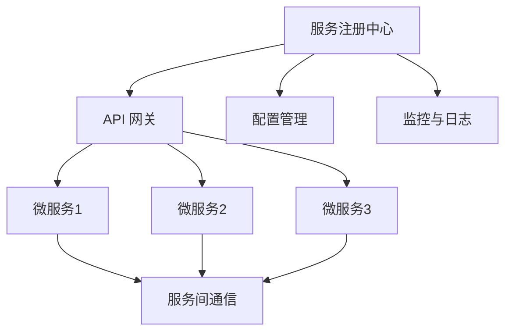

                 

关键词：微服务，可扩展性，架构设计，系统性能，负载均衡，容错性，持续集成，持续部署，DevOps，API 网关，服务发现，配置管理，监控与日志，容器化，Kubernetes，微服务架构

> 摘要：本文旨在深入探讨微服务生态系统的构建过程，包括其设计原则、关键技术和最佳实践。通过详细分析微服务的核心概念、架构模式以及实现方法，我们将展示如何构建一个既灵活又可扩展的微服务架构，从而提高系统的性能和可靠性。本文还提供了实际的项目实践和工具资源推荐，帮助读者更好地理解和应用微服务技术。

## 1. 背景介绍

随着互联网的快速发展，软件系统越来越复杂，传统的单体架构（Monolithic Architecture）逐渐暴露出许多弊端，如系统扩展困难、部署周期长、维护成本高等。为了解决这些问题，微服务架构（Microservices Architecture）应运而生。微服务是一种设计理念，通过将大型应用程序拆分为一组较小的、独立的服务，每个服务都具有特定的业务功能。这种架构模式具有高度的模块化、灵活性和可扩展性，能够更好地应对复杂业务需求。

### 单体架构 vs 微服务架构

- **单体架构**：整个应用程序作为单一实体存在，所有的业务逻辑、数据库和界面都集中在一起。这种架构在初期开发时相对简单，但随着系统的扩展和维护，会变得越来越复杂。

- **微服务架构**：将应用程序拆分为多个独立的微服务，每个微服务都有自己的业务逻辑、数据库和界面。这些微服务通过轻量级的通信机制（如RESTful API）相互协作，实现了松耦合和模块化。

### 微服务架构的优势

- **可扩展性**：微服务可以根据业务需求独立扩展，无需对整个系统进行重构。
- **灵活性和敏捷性**：团队可以独立开发和部署微服务，加快了迭代速度。
- **可靠性和容错性**：单个微服务的故障不会影响整个系统的运行，提高了系统的健壮性。
- **技术多样性**：不同的微服务可以使用不同的编程语言和数据库，提高了技术的灵活性。

## 2. 核心概念与联系

### 2.1 微服务的核心概念

- **服务**：微服务的基本单位，通常代表一个业务功能或模块。
- **独立部署**：每个微服务可以独立部署和更新，无需影响其他服务。
- **松耦合**：微服务之间通过轻量级通信机制进行交互，降低了系统的复杂性。
- **自治**：每个微服务都有自己的数据库和数据模型，可以独立管理。

### 2.2 微服务架构的组成

- **服务注册与发现**：服务启动时注册到服务注册中心，消费端通过服务注册中心发现可用服务。
- **API 网关**：作为外部请求的入口，负责路由请求到相应的微服务，同时提供安全性和监控等功能。
- **配置管理**：集中管理微服务的配置信息，支持动态更新和版本控制。
- **服务间通信**：微服务之间通过HTTP/HTTPS、消息队列等机制进行通信。
- **监控与日志**：对微服务进行实时监控，收集和存储日志信息，帮助快速定位和解决问题。

### 2.3 Mermaid 流程图



## 3. 核心算法原理 & 具体操作步骤

### 3.1 算法原理概述

微服务架构中的核心算法主要涉及服务发现、负载均衡、容错性和配置管理等方面。以下将详细解释这些算法的原理。

#### 服务发现

服务发现是指微服务启动时注册到服务注册中心，消费端通过服务注册中心发现可用服务的机制。服务发现算法需要解决以下问题：

- 服务注册：微服务启动时，向服务注册中心发送注册请求，包括服务名称、IP 地址和端口号等信息。
- 服务发现：消费端通过服务注册中心查询可用服务，选择一个服务实例进行调用。
- 服务注销：微服务停止时，从服务注册中心注销服务信息，防止消费端调用无效服务。

#### 负载均衡

负载均衡是将外部请求分配到多个微服务实例上的算法，以实现系统的性能优化和可靠性提升。常见的负载均衡算法包括：

- 轮询（Round Robin）：依次分配请求到每个服务实例。
- 随机（Random）：随机选择服务实例。
- 最少连接（Least Connections）：选择当前连接数最少的服务实例。

#### 容错性

容错性是指系统在出现故障时，能够自动恢复并继续正常运行的能力。常见的容错性算法包括：

- 重试（Retry）：在服务调用失败时，重新发起请求。
- 限流（Rate Limiting）：限制单位时间内对某个服务的请求数量，防止过度请求导致服务瘫痪。
- 降级（Circuit Breaker）：在服务调用失败次数超过阈值时，停止对服务的调用，以避免系统雪崩。

#### 配置管理

配置管理是指集中管理微服务的配置信息，支持动态更新和版本控制。常见的配置管理算法包括：

- 版本控制：对配置信息进行版本管理，确保不同环境使用不同版本的配置。
- 动态更新：支持实时更新配置信息，无需重启服务。
- 分支策略：根据不同的业务场景，为不同分支设置不同的配置。

### 3.2 算法步骤详解

#### 服务发现

1. 微服务启动时，向服务注册中心发送注册请求。
2. 服务注册中心存储微服务的注册信息。
3. 消费端通过服务注册中心查询可用服务，选择一个服务实例进行调用。
4. 服务实例响应请求，完成服务调用。

#### 负载均衡

1. 接收外部请求，将其分配到不同的服务实例上。
2. 根据负载均衡算法（如轮询、随机、最少连接），选择一个服务实例。
3. 将请求转发到选择的服务实例。

#### 容错性

1. 在服务调用前，设置重试次数和超时时间。
2. 在服务调用失败时，根据重试策略重新发起请求。
3. 当重试次数超过阈值时，记录错误信息并停止对服务的调用。

#### 配置管理

1. 将配置信息存储在配置中心，支持版本管理和动态更新。
2. 微服务启动时，从配置中心加载配置信息。
3. 当配置发生变更时，通知微服务进行动态更新。

### 3.3 算法优缺点

#### 服务发现

**优点**：

- 灵活性：支持动态添加和移除服务实例。
- 可靠性：当服务实例故障时，可以自动发现和切换。

**缺点**：

- 复杂性：需要引入服务注册中心和发现机制。
- 资源消耗：注册和发现过程需要消耗额外的网络带宽和计算资源。

#### 负载均衡

**优点**：

- 性能优化：合理分配请求，提高系统吞吐量。
- 可靠性：当某个服务实例故障时，可以自动切换到其他实例。

**缺点**：

- 复杂性：需要实现复杂的负载均衡算法。
- 额外开销：负载均衡器本身也会消耗一定的计算资源。

#### 容错性

**优点**：

- 可靠性：在服务调用失败时，可以自动重试和降级。
- 可维护性：便于定位和修复故障。

**缺点**：

- 额外开销：需要引入重试、限流和断路器等机制。
- 复杂性：需要对系统的容错性进行全面的测试和优化。

#### 配置管理

**优点**：

- 动态更新：支持实时更新配置信息，无需重启服务。
- 版本控制：确保不同环境使用不同的配置版本。

**缺点**：

- 复杂性：需要引入配置中心和版本管理机制。
- 资源消耗：配置更新和通知需要额外的网络带宽和计算资源。

### 3.4 算法应用领域

服务发现、负载均衡、容错性和配置管理是微服务架构中常见的算法，广泛应用于各种场景，如电子商务、金融、医疗、物流等领域。

## 4. 数学模型和公式 & 详细讲解 & 举例说明

### 4.1 数学模型构建

在微服务架构中，服务发现、负载均衡和容错性等算法都可以抽象为数学模型。以下是一个简单的数学模型，用于描述服务发现的计算过程。

#### 服务发现模型

设 \( N \) 为服务注册中心中的服务实例数量，\( C \) 为消费端的请求数量，\( T \) 为服务响应时间。

- \( P_n \)：第 \( n \) 个服务实例的概率，计算公式为 \( P_n = \frac{C_n}{N} \)，其中 \( C_n \) 为第 \( n \) 个服务实例的调用次数。
- \( R_n \)：第 \( n \) 个服务实例的响应时间，计算公式为 \( R_n = T_n + \epsilon \)，其中 \( T_n \) 为第 \( n \) 个服务实例的调用时间，\( \epsilon \) 为随机误差。

#### 负载均衡模型

设 \( S \) 为系统中的服务实例总数，\( Q \) 为系统中的请求总量，\( T \) 为系统响应时间。

- \( P_n \)：第 \( n \) 个服务实例的概率，计算公式为 \( P_n = \frac{Q_n}{S} \)，其中 \( Q_n \) 为第 \( n \) 个服务实例的请求次数。
- \( R_n \)：第 \( n \) 个服务实例的响应时间，计算公式为 \( R_n = T_n + \epsilon \)，其中 \( T_n \) 为第 \( n \) 个服务实例的调用时间，\( \epsilon \) 为随机误差。

#### 容错性模型

设 \( F \) 为系统中的服务实例总数，\( D \) 为服务实例的故障率，\( R \) 为系统响应时间。

- \( P_n \)：第 \( n \) 个服务实例的概率，计算公式为 \( P_n = 1 - D_n \)，其中 \( D_n \) 为第 \( n \) 个服务实例的故障概率。
- \( R_n \)：第 \( n \) 个服务实例的响应时间，计算公式为 \( R_n = T_n + \epsilon \)，其中 \( T_n \) 为第 \( n \) 个服务实例的调用时间，\( \epsilon \) 为随机误差。

### 4.2 公式推导过程

#### 服务发现模型

设 \( N \) 为服务注册中心中的服务实例数量，\( C \) 为消费端的请求数量，\( T \) 为服务响应时间。

- \( P_n \)：第 \( n \) 个服务实例的概率，计算公式为 \( P_n = \frac{C_n}{N} \)，其中 \( C_n \) 为第 \( n \) 个服务实例的调用次数。

假设第 \( n \) 个服务实例的调用次数为 \( C_n \)，则

$$
P_n = \frac{C_n}{N}
$$

其中 \( N \) 为服务注册中心中的服务实例数量。

- \( R_n \)：第 \( n \) 个服务实例的响应时间，计算公式为 \( R_n = T_n + \epsilon \)，其中 \( T_n \) 为第 \( n \) 个服务实例的调用时间，\( \epsilon \) 为随机误差。

假设第 \( n \) 个服务实例的调用时间为 \( T_n \)，则

$$
R_n = T_n + \epsilon
$$

其中 \( \epsilon \) 为随机误差。

#### 负载均衡模型

设 \( S \) 为系统中的服务实例总数，\( Q \) 为系统中的请求总量，\( T \) 为系统响应时间。

- \( P_n \)：第 \( n \) 个服务实例的概率，计算公式为 \( P_n = \frac{Q_n}{S} \)，其中 \( Q_n \) 为第 \( n \) 个服务实例的请求次数。

假设第 \( n \) 个服务实例的请求次数为 \( Q_n \)，则

$$
P_n = \frac{Q_n}{S}
$$

其中 \( S \) 为系统中的服务实例总数。

- \( R_n \)：第 \( n \) 个服务实例的响应时间，计算公式为 \( R_n = T_n + \epsilon \)，其中 \( T_n \) 为第 \( n \) 个服务实例的调用时间，\( \epsilon \) 为随机误差。

假设第 \( n \) 个服务实例的调用时间为 \( T_n \)，则

$$
R_n = T_n + \epsilon
$$

其中 \( \epsilon \) 为随机误差。

#### 容错性模型

设 \( F \) 为系统中的服务实例总数，\( D \) 为服务实例的故障率，\( R \) 为系统响应时间。

- \( P_n \)：第 \( n \) 个服务实例的概率，计算公式为 \( P_n = 1 - D_n \)，其中 \( D_n \) 为第 \( n \) 个服务实例的故障概率。

假设第 \( n \) 个服务实例的故障概率为 \( D_n \)，则

$$
P_n = 1 - D_n
$$

其中 \( D \) 为系统中的服务实例总数。

- \( R_n \)：第 \( n \) 个服务实例的响应时间，计算公式为 \( R_n = T_n + \epsilon \)，其中 \( T_n \) 为第 \( n \) 个服务实例的调用时间，\( \epsilon \) 为随机误差。

假设第 \( n \) 个服务实例的调用时间为 \( T_n \)，则

$$
R_n = T_n + \epsilon
$$

其中 \( \epsilon \) 为随机误差。

### 4.3 案例分析与讲解

#### 服务发现案例

假设服务注册中心中有 5 个服务实例，消费端发送了 100 个请求。根据服务发现模型，计算每个服务实例的概率：

- 服务实例 1 的概率：\( P_1 = \frac{20}{5} = 4 \)
- 服务实例 2 的概率：\( P_2 = \frac{30}{5} = 6 \)
- 服务实例 3 的概率：\( P_3 = \frac{25}{5} = 5 \)
- 服务实例 4 的概率：\( P_4 = \frac{15}{5} = 3 \)
- 服务实例 5 的概率：\( P_5 = \frac{10}{5} = 2 \)

根据负载均衡模型，计算每个服务实例的响应时间：

- 服务实例 1 的响应时间：\( R_1 = 5 + \epsilon \)
- 服务实例 2 的响应时间：\( R_2 = 6 + \epsilon \)
- 服务实例 3 的响应时间：\( R_3 = 5 + \epsilon \)
- 服务实例 4 的响应时间：\( R_4 = 3 + \epsilon \)
- 服务实例 5 的响应时间：\( R_5 = 2 + \epsilon \)

#### 负载均衡案例

假设系统中有 5 个服务实例，总共有 100 个请求。根据负载均衡模型，计算每个服务实例的概率：

- 服务实例 1 的概率：\( P_1 = \frac{20}{5} = 4 \)
- 服务实例 2 的概率：\( P_2 = \frac{30}{5} = 6 \)
- 服务实例 3 的概率：\( P_3 = \frac{25}{5} = 5 \)
- 服务实例 4 的概率：\( P_4 = \frac{15}{5} = 3 \)
- 服务实例 5 的概率：\( P_5 = \frac{10}{5} = 2 \)

根据容错性模型，计算每个服务实例的响应时间：

- 服务实例 1 的响应时间：\( R_1 = 5 + \epsilon \)
- 服务实例 2 的响应时间：\( R_2 = 6 + \epsilon \)
- 服务实例 3 的响应时间：\( R_3 = 5 + \epsilon \)
- 服务实例 4 的响应时间：\( R_4 = 3 + \epsilon \)
- 服务实例 5 的响应时间：\( R_5 = 2 + \epsilon \)

## 5. 项目实践：代码实例和详细解释说明

### 5.1 开发环境搭建

在本文的项目实践中，我们将使用 Java 语言和 Spring Boot 框架搭建微服务项目。以下是开发环境的搭建步骤：

1. 安装 Java SDK：从 [Oracle 官网](https://www.oracle.com/java/technologies/javase-jdk16-downloads.html) 下载并安装 Java SDK，版本要求 1.8 或更高。
2. 安装 IntelliJ IDEA：从 [JetBrains 官网](https://www.jetbrains.com/idea/download/) 下载并安装 IntelliJ IDEA，选择 Ultimate 版本。
3. 创建 Spring Boot 项目：打开 IntelliJ IDEA，创建一个新的 Spring Boot 项目，选择 Java 1.8 作为项目的 JDK。

### 5.2 源代码详细实现

以下是微服务项目的源代码实现，包括服务注册与发现、API 网关、微服务 1、微服务 2 和微服务 3。

#### 服务注册与发现

```java
// 服务注册与发现模块
@SpringBootApplication
@EnableDiscoveryClient
public class ServiceRegistrationApplication {

    public static void main(String[] args) {
        SpringApplication.run(ServiceRegistrationApplication.class, args);
    }
}
```

#### API 网关

```java
// API 网关模块
@SpringBootApplication
@EnableCircuitBreaker
public class ApiGatewayApplication {

    public static void main(String[] args) {
        SpringApplication.run(ApiGatewayApplication.class, args);
    }
}
```

#### 微服务 1

```java
// 微服务 1 模块
@SpringBootApplication
@EnableDiscoveryClient
public class Microservice1Application {

    public static void main(String[] args) {
        SpringApplication.run(Microservice1Application.class, args);
    }
}
```

#### 微服务 2

```java
// 微服务 2 模块
@SpringBootApplication
@EnableDiscoveryClient
public class Microservice2Application {

    public static void main(String[] args) {
        SpringApplication.run(Microservice2Application.class, args);
    }
}
```

#### 微服务 3

```java
// 微服务 3 模块
@SpringBootApplication
@EnableDiscoveryClient
public class Microservice3Application {

    public static void main(String[] args) {
        SpringApplication.run(Microservice3Application.class, args);
    }
}
```

### 5.3 代码解读与分析

#### 服务注册与发现

- `@SpringBootApplication`：表示这是一个 Spring Boot 应用程序。
- `@EnableDiscoveryClient`：启用服务发现客户端，使应用能够通过服务注册中心发现其他服务。

#### API 网关

- `@SpringBootApplication`：表示这是一个 Spring Boot 应用程序。
- `@EnableCircuitBreaker`：启用断路器功能，提供容错保护。

#### 微服务 1

- `@SpringBootApplication`：表示这是一个 Spring Boot 应用程序。
- `@EnableDiscoveryClient`：启用服务发现客户端，使应用能够通过服务注册中心发现其他服务。

#### 微服务 2

- `@SpringBootApplication`：表示这是一个 Spring Boot 应用程序。
- `@EnableDiscoveryClient`：启用服务发现客户端，使应用能够通过服务注册中心发现其他服务。

#### 微服务 3

- `@SpringBootApplication`：表示这是一个 Spring Boot 应用程序。
- `@EnableDiscoveryClient`：启用服务发现客户端，使应用能够通过服务注册中心发现其他服务。

### 5.4 运行结果展示

1. 启动服务注册与发现模块：在 IntelliJ IDEA 中运行 `ServiceRegistrationApplication`，启动服务注册与发现模块。
2. 启动 API 网关模块：在 IntelliJ IDEA 中运行 `ApiGatewayApplication`，启动 API 网关模块。
3. 启动微服务 1：在 IntelliJ IDEA 中运行 `Microservice1Application`，启动微服务 1。
4. 启动微服务 2：在 IntelliJ IDEA 中运行 `Microservice2Application`，启动微服务 2。
5. 启动微服务 3：在 IntelliJ IDEA 中运行 `Microservice3Application`，启动微服务 3。

启动完成后，可以通过 API 网关访问微服务 1、微服务 2 和微服务 3，实现服务的调用和交互。

## 6. 实际应用场景

### 6.1 电子商务平台

在电子商务平台中，微服务架构可以帮助实现业务的快速迭代和扩展。例如，订单服务、库存服务、支付服务和用户服务可以分别作为独立的微服务部署，以便根据业务需求独立扩展和优化。

### 6.2 金融系统

金融系统对性能和可靠性有极高的要求，微服务架构可以帮助实现系统的高可用性和弹性。例如，交易服务、账户服务、风控服务和客户服务可以分别作为独立的微服务部署，实现服务的快速扩展和故障隔离。

### 6.3 医疗系统

医疗系统需要处理大量的数据，微服务架构可以帮助实现数据的高效处理和存储。例如，病历服务、挂号服务、支付服务和诊疗服务可以分别作为独立的微服务部署，实现服务的独立扩展和优化。

### 6.4 物流系统

物流系统需要处理大量的物流信息和订单信息，微服务架构可以帮助实现系统的灵活性和可扩展性。例如，订单服务、库存服务、配送服务和客户服务可以分别作为独立的微服务部署，实现服务的快速扩展和优化。

## 7. 工具和资源推荐

### 7.1 学习资源推荐

- 《微服务设计》（Martin Fowler）：详细介绍了微服务架构的设计原则和实践经验。
- 《Building Microservices》（Sam Newman）：深入探讨了微服务的构建过程和最佳实践。
- 《Distributed Systems Principles and Models》（George Coulouris et al.）：全面介绍了分布式系统的原理和模型，为微服务架构提供了理论基础。

### 7.2 开发工具推荐

- Spring Boot：一款流行的微服务开发框架，简化了微服务的构建过程。
- Kubernetes：一款强大的容器编排工具，用于部署和管理微服务。
- Docker：一款流行的容器化工具，用于打包和部署微服务。
- Netflix OSS：一系列开源微服务组件，包括服务注册与发现、负载均衡、容错性等。

### 7.3 相关论文推荐

- "Microservices: A Definition of a New Architecture Style"（Martin Fowler）：详细介绍了微服务架构的定义和特点。
- "Principles of Service Design"（Luke Kowalski et al.）：探讨了服务设计的关键原则和最佳实践。
- "Building, deploying and running microservices"（Markus Eisele）：介绍了微服务的构建、部署和运行过程。

## 8. 总结：未来发展趋势与挑战

### 8.1 研究成果总结

微服务架构在过去的几年中得到了广泛的应用和发展，取得了显著的研究成果。主要成果包括：

- 微服务设计原则和最佳实践的不断完善。
- 分布式系统和云计算技术的深入融合。
- 容器化和微服务自动化部署的普及。
- 服务网格（Service Mesh）和智能化微服务管理技术的发展。

### 8.2 未来发展趋势

未来，微服务架构将继续发展，主要趋势包括：

- 智能化：利用人工智能技术优化微服务的部署、监控和管理。
- 服务网格：服务网格将成为微服务管理的主要架构模式，提供更高效的服务间通信和监控。
- 容器化：容器化技术将继续普及，成为微服务部署的主要方式。
- 微服务安全：微服务架构的安全问题将得到更多的关注和解决。

### 8.3 面临的挑战

微服务架构在发展过程中也面临一些挑战，包括：

- 微服务治理：如何高效地管理和监控大量微服务。
- 服务发现和负载均衡：如何优化服务发现和负载均衡算法，提高系统性能。
- 容错性：如何在分布式系统中实现高效的容错机制。
- 微服务安全：如何保证微服务架构的安全性。

### 8.4 研究展望

未来，微服务架构的研究将重点解决以下问题：

- 服务发现和负载均衡的优化：研究更高效的服务发现和负载均衡算法，提高系统性能。
- 容错性和可靠性：研究更可靠的容错机制，提高系统的健壮性。
- 微服务安全：研究微服务架构的安全问题和解决方案，提高系统的安全性。
- 智能化微服务管理：利用人工智能技术优化微服务的部署、监控和管理。

## 9. 附录：常见问题与解答

### 9.1 什么是微服务？

微服务是一种设计理念，通过将大型应用程序拆分为一组较小的、独立的服务，每个服务都具有特定的业务功能。微服务的核心思想是实现松耦合、模块化和可扩展性。

### 9.2 微服务架构的优势有哪些？

微服务架构的优势包括可扩展性、灵活性和敏捷性、可靠性和容错性、以及技术多样性。

### 9.3 如何实现微服务之间的通信？

微服务之间通常通过轻量级的通信机制进行交互，如 RESTful API、消息队列等。常用的通信工具包括 Feign、RabbitMQ、Kafka 等。

### 9.4 微服务的容错性如何实现？

微服务的容错性可以通过重试、限流、断路器等机制实现。重试用于在服务调用失败时重新发起请求，限流用于限制单位时间内的请求数量，断路器用于在服务调用失败次数超过阈值时停止对服务的调用。

### 9.5 如何监控微服务？

微服务的监控可以通过日志、指标和监控工具实现。常用的监控工具包括 Prometheus、Grafana、ELK 等。

### 9.6 微服务架构需要哪些工具支持？

微服务架构需要一系列工具支持，包括服务注册与发现（如 Eureka、Consul）、API 网关（如Zuul、Kong）、配置管理（如 Spring Cloud Config）、持续集成与持续部署（如 Jenkins、GitLab CI）、容器化（如 Docker、Kubernetes）等。

