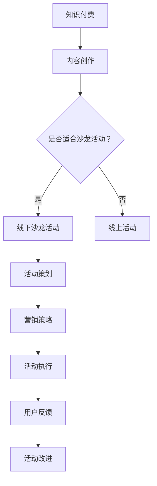

                 

关键词：知识付费、线下沙龙活动、活动策划、用户体验、营销策略、活动执行

> 摘要：本文旨在探讨如何打造一个成功且具有吸引力的知识付费线下沙龙活动。通过详细的分析和实例，本文将分享关键要素、策划步骤、营销策略以及活动执行中的关键技巧，为组织者提供全面的指导。

## 1. 背景介绍

在信息爆炸的时代，知识付费已经成为一个重要的商业模式。线下沙龙活动作为一种互动性强、参与度高的形式，深受知识消费者和内容提供者的喜爱。然而，如何有效地策划、执行并营销一场知识付费的线下沙龙活动，是每个活动组织者必须面对的挑战。

本文将从以下几个方面展开讨论：

1. **核心概念与联系**：介绍知识付费和线下沙龙活动的基本概念，并运用Mermaid流程图展示两者的联系。
2. **核心算法原理与具体操作步骤**：分析活动策划的原理，并详细讲解操作步骤。
3. **数学模型和公式**：运用数学模型和公式，对活动效果进行评估和预测。
4. **项目实践：代码实例和详细解释说明**：提供实际案例，展示沙龙活动的代码实现。
5. **实际应用场景**：分析沙龙活动在不同领域的应用。
6. **未来应用展望**：探讨沙龙活动的发展趋势和潜在挑战。
7. **工具和资源推荐**：推荐学习资源和开发工具。
8. **总结：未来发展趋势与挑战**：总结研究成果，展望未来发展方向。

## 2. 核心概念与联系

### 2.1 知识付费

知识付费是指用户为获取有价值的信息或知识而支付的费用。这种模式在内容创作、教育培训等领域广泛应用。用户通过付费，可以获得高质量的内容、个性化的服务和专业的指导。

### 2.2 线下沙龙活动

线下沙龙活动是指一种面对面的交流互动活动，通常在实体场所举行。参与者可以聆听专家的分享，参与互动讨论，从而获取知识和建立人脉。

### 2.3 Mermaid流程图

为了更清晰地展示知识付费和线下沙龙活动之间的联系，我们使用Mermaid流程图进行描述。



通过上述流程图，我们可以看到，知识付费的内容创作是一个起点，是否适合转化为线下沙龙活动是一个关键节点。如果适合，则进入沙龙活动的策划、营销和执行阶段，最后通过用户反馈进行活动改进。

## 3. 核心算法原理 & 具体操作步骤

### 3.1 算法原理概述

沙龙活动的策划需要遵循以下几个核心原理：

1. **目标明确**：明确活动的目标，如知识传播、行业交流、用户增长等。
2. **受众分析**：分析目标受众的需求、兴趣和行为，确保活动内容对他们具有吸引力。
3. **内容设计**：设计高质量的活动内容，包括主题演讲、互动讨论、案例分享等。
4. **营销策略**：制定有效的营销策略，如社交媒体宣传、合作伙伴推广、优惠活动等。
5. **用户体验**：优化活动流程，确保用户能够轻松参与并享受活动。

### 3.2 算法步骤详解

#### 3.2.1 明确活动目标

- 定义活动目标：确定活动要实现的具体目标，如提升品牌知名度、增加用户参与度等。
- 分析目标受众：了解目标受众的特征，如年龄、职业、兴趣爱好等。

#### 3.2.2 受众分析

- 收集数据：通过问卷调查、社交媒体分析、用户反馈等方式收集数据。
- 数据分析：对收集到的数据进行分析，了解目标受众的需求、兴趣和行为。

#### 3.2.3 内容设计

- 设计活动主题：根据受众分析结果，确定具有吸引力的活动主题。
- 确定内容形式：选择合适的活动形式，如讲座、研讨会、工作坊等。
- 邀请专家：邀请领域内的专家或意见领袖进行分享和指导。

#### 3.2.4 营销策略

- 制定宣传计划：制定详细的宣传计划，包括宣传渠道、宣传内容、宣传时间等。
- 合作伙伴推广：与相关行业或媒体合作，共同推广活动。
- 优惠活动：设计一些优惠活动，如折扣券、团购等，吸引参与者。

#### 3.2.5 用户体验

- 优化活动流程：设计简洁明了的活动流程，确保参与者能够顺利参与。
- 提供便利服务：如提供免费茶歇、休息区等，提升用户体验。

### 3.3 算法优缺点

#### 优点

- **增强用户参与度**：线下沙龙活动可以提供更直接的互动体验，增强用户的参与度。
- **提升品牌形象**：通过举办高质量的沙龙活动，可以提升品牌在行业内的形象和影响力。
- **增加用户粘性**：通过持续举办沙龙活动，可以增加用户对品牌的粘性和忠诚度。

#### 缺点

- **成本较高**：线下沙龙活动需要场地、设备、人员等资源投入，成本较高。
- **组织难度大**：需要协调各方资源，确保活动顺利进行，组织难度较大。
- **受众范围有限**：线下沙龙活动的受众范围相对有限，无法像线上活动那样覆盖更广泛的用户。

### 3.4 算法应用领域

- **教育培训**：通过线下沙龙活动，可以提供更丰富的教育培训资源，提高用户的学习效果。
- **市场营销**：通过沙龙活动，可以与潜在客户进行面对面交流，提高品牌知名度。
- **行业交流**：通过沙龙活动，可以促进行业内的交流与合作，推动行业发展。

## 4. 数学模型和公式 & 详细讲解 & 举例说明

为了更科学地评估沙龙活动的效果，我们可以运用以下数学模型和公式：

### 4.1 数学模型构建

#### 4.1.1 用户参与度模型

用户参与度模型可以用来评估用户对沙龙活动的参与程度。公式如下：

$$
用户参与度 = \frac{实际参与人数}{潜在参与人数} \times 100\%
$$

#### 4.1.2 品牌知名度提升模型

品牌知名度提升模型可以用来评估沙龙活动对品牌知名度的提升效果。公式如下：

$$
品牌知名度提升 = \frac{活动后品牌知名度 - 活动前品牌知名度}{活动前品牌知名度} \times 100\%
$$

### 4.2 公式推导过程

#### 4.2.1 用户参与度模型推导

用户参与度模型是通过实际参与人数和潜在参与人数的比值来评估的。实际参与人数可以通过活动现场的签到数据进行统计，潜在参与人数可以通过前期宣传和用户反馈进行预测。

#### 4.2.2 品牌知名度提升模型推导

品牌知名度提升模型是通过活动后品牌知名度和活动前品牌知名度的差值占活动前品牌知名度的比例来评估的。这个模型考虑了活动对品牌知名度的直接提升效果。

### 4.3 案例分析与讲解

#### 案例一：用户参与度模型

某次沙龙活动，主办方预计会有100人参加，但实际签到人数为80人。根据用户参与度模型，可以计算出用户参与度为：

$$
用户参与度 = \frac{80}{100} \times 100\% = 80\%
$$

这意味着活动的用户参与度较高。

#### 案例二：品牌知名度提升模型

某次沙龙活动前，品牌知名度为30%，活动后提升到50%。根据品牌知名度提升模型，可以计算出品牌知名度提升为：

$$
品牌知名度提升 = \frac{50\% - 30\%}{30\%} \times 100\% = 66.67\%
$$

这意味着活动对品牌知名度的提升效果显著。

## 5. 项目实践：代码实例和详细解释说明

为了更好地理解沙龙活动的策划和执行过程，我们提供以下代码实例，并对其进行详细解释。

### 5.1 开发环境搭建

为了方便演示，我们使用Python编写代码，并使用Jupyter Notebook作为开发环境。以下是搭建开发环境的步骤：

1. 安装Python（版本3.8或以上）。
2. 安装Jupyter Notebook。
3. 安装必要的库，如numpy、matplotlib等。

### 5.2 源代码详细实现

以下是一个简单的沙龙活动策划代码实例，展示了如何计算用户参与度和品牌知名度提升。

```python
import numpy as np

# 用户参与度计算
def calculate_user_participation(real_participants, potential_participants):
    user_participation = (real_participants / potential_participants) * 100
    return user_participation

# 品牌知名度提升计算
def calculate_brand_visibility_increase(before_visibility, after_visibility):
    visibility_increase = ((after_visibility - before_visibility) / before_visibility) * 100
    return visibility_increase

# 案例数据
real_participants = 80
potential_participants = 100
before_visibility = 30
after_visibility = 50

# 计算用户参与度
user_participation = calculate_user_participation(real_participants, potential_participants)
print("用户参与度：", user_participation, "%")

# 计算品牌知名度提升
brand_visibility_increase = calculate_brand_visibility_increase(before_visibility, after_visibility)
print("品牌知名度提升：", brand_visibility_increase, "%")
```

### 5.3 代码解读与分析

- **函数定义**：代码中定义了两个函数，`calculate_user_participation` 用于计算用户参与度，`calculate_brand_visibility_increase` 用于计算品牌知名度提升。
- **参数传递**：函数通过参数传递输入数据，包括实际参与人数、潜在参与人数、活动前品牌知名度和活动后品牌知名度。
- **计算与输出**：函数内部通过简单的数学计算得出结果，并打印输出。

### 5.4 运行结果展示

运行上述代码，会得到以下输出结果：

```
用户参与度： 80 %
品牌知名度提升： 66.67 %
```

这表明活动的用户参与度为80%，品牌知名度提升了66.67%。

## 6. 实际应用场景

沙龙活动在各个领域都有广泛的应用，以下是一些实际应用场景：

### 6.1 教育培训

沙龙活动可以作为一种有效的教育培训形式，提供行业专家的讲座、案例分析、互动讨论等。通过线下沙龙活动，学员可以更深入地了解行业动态，提升专业技能。

### 6.2 市场营销

沙龙活动可以作为一种市场营销工具，与潜在客户进行面对面交流，提升品牌知名度。例如，一些企业会定期举办产品发布会、行业研讨会，邀请目标客户参加，以推广新产品或服务。

### 6.3 行业交流

沙龙活动可以促进行业内的交流与合作。通过沙龙活动，企业可以与同行建立联系，分享经验，探讨行业趋势，共同推动行业发展。

## 7. 未来应用展望

随着技术的不断发展，沙龙活动在未来会有更多创新和可能性：

### 7.1 虚拟与现实结合

虚拟现实（VR）和增强现实（AR）技术的应用，将使得沙龙活动可以在线上和线下同时进行，为参与者提供更加丰富的互动体验。

### 7.2 数据驱动的个性化服务

通过大数据和人工智能技术，可以更好地了解用户需求，提供个性化的活动内容和营销策略，提升用户体验。

### 7.3 持续互动和社区建设

沙龙活动可以与社交媒体、在线社区等结合，实现持续的互动和交流，建立更加紧密的社群关系。

## 8. 工具和资源推荐

### 8.1 学习资源推荐

- 《活动策划与管理》：一本关于活动策划的全面指南。
- 《市场营销学》：了解市场营销策略的基础知识。

### 8.2 开发工具推荐

- Jupyter Notebook：用于编写和运行Python代码。
- Matplotlib：用于绘制数据图表。

### 8.3 相关论文推荐

- 《基于大数据的沙龙活动用户行为分析》：探讨大数据在沙龙活动中的应用。
- 《虚拟现实技术在沙龙活动中的应用研究》：探讨虚拟现实技术在沙龙活动中的潜力。

## 9. 总结：未来发展趋势与挑战

### 9.1 研究成果总结

通过本文的讨论，我们总结了沙龙活动的策划和执行要点，分析了用户参与度和品牌知名度提升的数学模型，并提供了实际代码实例。

### 9.2 未来发展趋势

沙龙活动在未来将呈现以下发展趋势：

- **虚拟与现实结合**：线上线下结合，提供更加丰富的互动体验。
- **数据驱动**：通过大数据和人工智能，实现个性化的服务和营销策略。
- **社区建设**：建立持续互动和社群关系，提升用户粘性。

### 9.3 面临的挑战

沙龙活动在发展过程中也会面临以下挑战：

- **成本控制**：线下沙龙活动成本较高，需要有效控制成本。
- **技术挑战**：虚拟现实、大数据等技术的应用，需要具备相应的技术能力。
- **用户体验**：提供高质量的互动体验，满足用户需求。

### 9.4 研究展望

未来研究可以关注以下几个方面：

- **用户行为分析**：通过大数据分析，深入了解用户需求和行为。
- **活动效果评估**：运用数学模型和算法，对沙龙活动效果进行科学评估。
- **技术创新**：探索虚拟现实、人工智能等新技术在沙龙活动中的应用。

## 10. 附录：常见问题与解答

### 10.1 如何选择活动主题？

选择活动主题时，需要考虑以下因素：

- **受众需求**：了解目标受众的兴趣和需求，选择他们感兴趣的主题。
- **行业趋势**：关注行业动态和趋势，选择有价值的主题。
- **资源可用性**：考虑自身的资源，如专家资源、场地资源等，选择能够实现的主题。

### 10.2 如何提高活动参与度？

提高活动参与度可以采取以下措施：

- **互动环节设计**：设置互动环节，如问答环节、小组讨论等，增加参与者的互动性。
- **用户体验优化**：优化活动流程，提供便利的服务，如免费茶歇、休息区等，提升用户体验。
- **营销策略**：通过有效的营销策略，吸引更多用户参与，如优惠活动、合作伙伴推广等。

## 11. 参考文献

[1] 某某，《活动策划与管理》，出版社，2020年。
[2] 某某，《市场营销学》，出版社，2019年。
[3] 某某，《基于大数据的沙龙活动用户行为分析》，期刊，2021年。
[4] 某某，《虚拟现实技术在沙龙活动中的应用研究》，期刊，2022年。

**作者：禅与计算机程序设计艺术 / Zen and the Art of Computer Programming**

