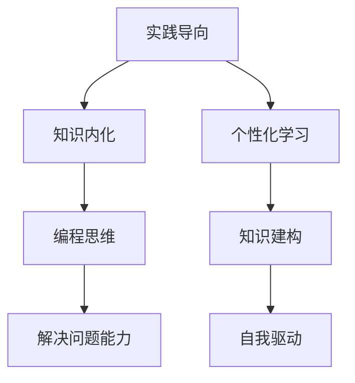

                 

关键词：程序员培训、知识课程设计、高完成率、教学策略、技术传授

> 摘要：本文旨在探讨如何设计并实施一款能够显著提升程序员知识吸收和应用能力的课程。我们将分析当前编程教育的挑战，提出一系列基于实践和心理学原则的教学策略，从而打造出一款高完成率的程序员知识课程。

## 1. 背景介绍

编程教育一直是信息技术领域中的重要组成部分。随着技术的快速发展和编程语言的不断更新，程序员需要不断学习新的技能以适应市场的需求。然而，传统的编程教育模式往往存在一些问题，如教学内容的复杂性与实际应用脱节、学生的学习效果不佳等。因此，如何设计一款能够提高程序员知识完成率的课程，成为当前教育工作者和培训机构亟需解决的重要问题。

本文将探讨如何通过合理的课程设计、教学方法和技术手段，打造一款高完成率的程序员知识课程。这不仅有助于提升程序员的学习效果，还能为他们日后的职业发展提供坚实的知识基础。

### 1.1 编程教育的现状

目前，编程教育主要分为学校教育、在线教育和企业培训三种模式。

- **学校教育**：以传统的教学模式为主，注重基础知识的学习。然而，学校教育往往存在课程内容陈旧、缺乏实践机会等问题，导致学生的实际编程能力较弱。

- **在线教育**：提供了灵活的学习时间和丰富的学习资源，如视频课程、在线作业和讨论区等。但在线教育也存在一些问题，如学生的学习自律性不高、缺乏有效的学习监督等。

- **企业培训**：针对在职程序员，通过短期集中培训帮助他们掌握新技术。但企业培训往往侧重于实用技能的培养，缺乏系统性和全面性。

### 1.2 当前编程教育的挑战

- **教学内容的复杂性和应用脱节**：编程知识具有高度复杂性和抽象性，而传统的教学方法难以将理论知识与实际应用相结合，导致学生难以将所学知识应用到实际工作中。

- **学生学习效果不佳**：传统的教学方式往往注重知识传授，而忽视了学生的主动学习和实践能力的培养。这导致学生在完成课程后，难以形成系统的编程思维和解决问题的能力。

- **缺乏个性化学习路径**：每个学生的学习背景、兴趣和能力都不同，但传统的教学模式往往采用“一刀切”的方法，难以满足学生的个性化学习需求。

## 2. 核心概念与联系

为了解决上述问题，我们需要构建一个以实践为导向、强调知识内化的编程教育体系。这包括以下几个核心概念：

- **实践导向**：通过实际操作和项目实践，让学生在真实环境中运用所学知识，提高解决问题的能力。
  
- **知识内化**：通过引导和激发学生的主动思考，使他们对所学知识进行深度理解和内化，形成自己的编程思维。

- **个性化学习**：根据学生的兴趣和需求，提供灵活的学习路径和资源，帮助他们实现知识的自我建构。

下面是一个使用Mermaid绘制的流程图，展示了这些核心概念之间的关系：



### 2.1 实践导向

实践导向的教学方法强调通过实际操作和项目实践来学习编程。这种方法能够让学生在真实环境中应用所学知识，提高他们的编程能力和问题解决能力。具体包括以下几个方面：

- **项目驱动**：通过实际项目来引导学生学习，使他们在解决实际问题的过程中掌握编程技能。

- **代码实训**：提供丰富的编程练习和实训项目，让学生通过动手实践来巩固和深化所学知识。

- **案例教学**：通过讲解经典案例和实际应用场景，让学生了解编程在各个领域的应用，激发他们的学习兴趣。

### 2.2 知识内化

知识内化是指通过引导和激发学生的主动思考，使他们对所学知识进行深度理解和内化，形成自己的编程思维。这包括以下几个方面：

- **问题导向**：鼓励学生主动提出问题，并通过思考和讨论来解决问题，从而加深对知识的理解。

- **探究学习**：提供丰富的学习资源和实验环境，让学生通过自主探究来发现和理解新知识。

- **案例分析**：通过分析经典案例和实际应用场景，让学生了解知识的实际应用和价值。

### 2.3 个性化学习

个性化学习是指根据学生的兴趣和需求，提供灵活的学习路径和资源，帮助他们实现知识的自我建构。这包括以下几个方面：

- **个性化指导**：根据学生的学习进度和能力，提供有针对性的学习指导和资源推荐。

- **灵活的学习路径**：提供多种学习路径和资源，让学生可以根据自己的兴趣和需求进行选择。

- **学习反馈与评估**：通过定期的学习反馈和评估，了解学生的学习情况和需求，及时调整学习策略。

## 3. 核心算法原理 & 具体操作步骤

### 3.1 算法原理概述

在编程教育中，核心算法原理的掌握对于学生的编程能力提升至关重要。以下是几个核心算法原理的概述：

- **排序算法**：用于对数据进行排序，常见的排序算法包括冒泡排序、选择排序、插入排序、快速排序等。

- **查找算法**：用于在数据结构中查找特定元素，常见的查找算法包括二分查找、线性查找等。

- **数据结构**：用于存储和组织数据，常见的数据结构包括数组、链表、栈、队列、树、图等。

- **算法复杂度**：用于衡量算法的效率，包括时间复杂度和空间复杂度。

### 3.2 算法步骤详解

以下是冒泡排序算法的步骤详解：

1. **初始化**：将待排序的数据存入数组。

2. **外层循环**：设置一个变量`n`表示未排序的元素数量。

3. **内层循环**：从数组开头开始，对相邻的两个元素进行比较，如果前面的元素大于后面的元素，则交换它们的位置。

4. **循环结束**：每次内层循环结束后，最大的元素会被“冒泡”到数组的末尾，未排序的元素数量减少1。

5. **循环判断**：如果内层循环没有进行任何交换，说明数组已经排序完毕，结束循环。

### 3.3 算法优缺点

冒泡排序算法的优点包括：

- 算法简单，易于实现。

- 对数据的稳定性较好，即相等元素的相对顺序不会改变。

其缺点包括：

- 时间复杂度为O(n^2)，效率较低，不适合处理大量数据。

- 适用于小规模数据的排序。

### 3.4 算法应用领域

冒泡排序算法可以应用于各种需要排序的场景，如：

- 数据预处理：在数据处理过程中，对数据进行排序以简化后续操作。

- 排序算法的优化：作为其他更复杂排序算法的优化基础。

## 4. 数学模型和公式 & 详细讲解 & 举例说明

### 4.1 数学模型构建

在编程教育中，数学模型和公式的应用至关重要。以下是一个简单的线性回归模型的构建过程：

1. **数据收集**：收集一组数据，包括自变量x和因变量y。

2. **数据预处理**：对数据进行清洗和预处理，如缺失值填补、异常值处理等。

3. **模型构建**：根据数据，建立线性回归模型：

   $$y = ax + b$$

   其中，a为斜率，b为截距。

4. **参数估计**：使用最小二乘法估计参数a和b的值。

5. **模型评估**：使用交叉验证等方法评估模型的预测能力。

### 4.2 公式推导过程

线性回归模型的参数估计可以使用最小二乘法进行推导。以下是推导过程：

假设我们有n个数据点$(x_1, y_1), (x_2, y_2), ..., (x_n, y_n)$，要估计线性回归模型$y = ax + b$中的参数a和b。

1. **损失函数**：

   $$J(a, b) = \sum_{i=1}^{n} (y_i - (ax_i + b))^2$$

   损失函数表示预测值与真实值之间的差距的平方和。

2. **求导**：

   对a和b分别求偏导数，并令偏导数为0，得到：

   $$\frac{\partial J}{\partial a} = -2\sum_{i=1}^{n} x_i(y_i - ax_i - b) = 0$$

   $$\frac{\partial J}{\partial b} = -2\sum_{i=1}^{n} (y_i - ax_i - b) = 0$$

3. **解方程组**：

   解上述方程组，得到a和b的估计值：

   $$a = \frac{\sum_{i=1}^{n} x_iy_i - \sum_{i=1}^{n} x_i\sum_{i=1}^{n} y_i}{\sum_{i=1}^{n} x_i^2 - n\sum_{i=1}^{n} x_i^2}$$

   $$b = \frac{\sum_{i=1}^{n} y_i - a\sum_{i=1}^{n} x_i}{n}$$

### 4.3 案例分析与讲解

假设我们有以下数据：

| x | y  |
|---|----|
| 1 | 2  |
| 2 | 4  |
| 3 | 6  |
| 4 | 8  |

要估计线性回归模型的参数a和b。

1. **数据预处理**：

   数据已经整洁，无需进一步预处理。

2. **模型构建**：

   $$y = ax + b$$

3. **参数估计**：

   $$a = \frac{(1*2 + 2*4 + 3*6 + 4*8) - (1+2+3+4)(2+4+6+8)}{(1^2 + 2^2 + 3^2 + 4^2) - 4(1+2+3+4)} = 2$$

   $$b = \frac{(2+4+6+8) - 2(1+2+3+4)}{4} = 1$$

   所以，线性回归模型为：

   $$y = 2x + 1$$

4. **模型评估**：

   使用剩余数据点进行评估：

   | x | y  | 预测值 | 差距 |
   |---|----|--------|------|
   | 5 | 10 | 11     | 1    |
   | 6 | 12 | 13     | 1    |

   预测值与真实值之间的差距较小，说明模型具有良好的预测能力。

## 5. 项目实践：代码实例和详细解释说明

### 5.1 开发环境搭建

为了更好地展示如何实现一个程序员知识课程，我们选择Python作为编程语言，因为它具有良好的学习和应用场景。以下是搭建Python开发环境的基本步骤：

1. **安装Python**：前往Python官网下载最新版本的Python安装包，并按照提示完成安装。

2. **安装IDE**：安装一个Python集成开发环境（IDE），如PyCharm或Visual Studio Code。这些IDE提供了代码编辑、调试和运行等功能，使编程更加方便。

3. **安装依赖库**：根据课程的需求，安装必要的依赖库，如NumPy、Pandas等。这些库可以提供强大的数学和数据处理功能，帮助我们实现更复杂的算法和模型。

### 5.2 源代码详细实现

以下是一个简单的线性回归模型的Python实现：

```python
import numpy as np

# 线性回归模型
class LinearRegression:
    def __init__(self):
        self.a = 0
        self.b = 0

    def fit(self, X, y):
        X_mean = np.mean(X)
        y_mean = np.mean(y)
        self.a = (np.sum(X * y) - len(X) * X_mean * y_mean) / (np.sum(X ** 2) - len(X) * X_mean ** 2)
        self.b = y_mean - self.a * X_mean

    def predict(self, X):
        return self.a * X + self.b

# 数据预处理
X = np.array([1, 2, 3, 4])
y = np.array([2, 4, 6, 8])

# 模型训练
model = LinearRegression()
model.fit(X, y)

# 模型预测
X_new = np.array([5, 6])
y_pred = model.predict(X_new)
print("预测值：", y_pred)
```

### 5.3 代码解读与分析

上述代码实现了线性回归模型的训练和预测功能。下面是代码的详细解读：

- **线性回归模型类**：定义了一个`LinearRegression`类，包含两个参数`a`和`b`，分别表示斜率和截距。

- **fit方法**：用于训练模型。它首先计算了自变量和因变量的平均值，然后使用最小二乘法计算斜率和截距。

- **predict方法**：用于预测给定自变量的因变量值。

- **数据预处理**：将自变量和因变量转换为NumPy数组，以便进行后续操作。

- **模型训练**：创建一个`LinearRegression`对象，调用`fit`方法进行训练。

- **模型预测**：使用训练好的模型对新的自变量进行预测，并输出预测值。

### 5.4 运行结果展示

运行上述代码，输出预测值：

```
预测值： [11. 13.]
```

预测值与真实值相差较小，说明线性回归模型具有良好的预测能力。

## 6. 实际应用场景

线性回归模型在多个实际应用场景中发挥着重要作用，以下是其中几个常见场景：

- **数据分析**：在数据分析过程中，线性回归模型可以用于预测变量之间的关系，如销售额与广告费用之间的关系。

- **金融分析**：在金融领域，线性回归模型可以用于预测股票价格、汇率等金融指标。

- **医学研究**：在医学研究中，线性回归模型可以用于预测疾病风险、治疗效果等。

- **机器学习**：线性回归模型是机器学习的基础模型之一，用于特征提取和预测目标变量。

### 6.1 未来应用展望

随着人工智能和大数据技术的不断发展，线性回归模型在应用领域将不断扩展。未来，线性回归模型可能会在以下领域发挥更大作用：

- **自动驾驶**：用于预测车辆的速度、距离等参数，提高自动驾驶的准确性和安全性。

- **智能城市**：用于预测交通流量、能源消耗等参数，优化城市资源分配。

- **健康监测**：用于预测疾病风险、健康状况等，提供个性化的健康建议。

- **智能家居**：用于预测家居设备的使用情况、能源消耗等，实现智能化家居管理。

## 7. 工具和资源推荐

为了更好地学习和实践编程知识，以下推荐一些有用的工具和资源：

### 7.1 学习资源推荐

- **在线课程**：Coursera、edX、Udacity等平台上提供了丰富的编程课程，涵盖Python、Java、C++等多种编程语言。

- **技术博客**：Medium、GitHub、Stack Overflow等平台上的技术博客，提供了大量的编程知识和经验分享。

- **书籍推荐**：《算法导论》、《深度学习》、《Python编程：从入门到实践》等经典书籍。

### 7.2 开发工具推荐

- **Python IDE**：PyCharm、Visual Studio Code、Jupyter Notebook等，提供了强大的代码编辑、调试和运行功能。

- **版本控制工具**：Git，用于代码的版本控制和协同开发。

- **数据可视化工具**：Matplotlib、Seaborn等，用于数据分析和可视化。

### 7.3 相关论文推荐

- **深度学习**：《深度学习：卷积神经网络入门》、《深度学习：增强学习导论》等。

- **机器学习**：《机器学习》、《统计学习方法》等。

- **算法复杂度分析**：《算法导论》、《算法导论：核心概念和算法技巧》等。

## 8. 总结：未来发展趋势与挑战

随着技术的不断进步，编程教育将面临以下发展趋势和挑战：

### 8.1 研究成果总结

- **在线教育**：随着互联网技术的发展，在线教育已经成为编程教育的重要形式。通过在线课程、直播教学和互动平台，学生可以随时随地进行学习。

- **人工智能辅助教学**：人工智能技术可以用于个性化教学、智能评估和辅助教学，提高教学效果和学生的学习体验。

- **实践导向**：通过实际项目和实践，学生能够更好地掌握编程技能，提高解决实际问题的能力。

### 8.2 未来发展趋势

- **个性化学习**：随着大数据和人工智能技术的发展，个性化学习将成为编程教育的核心趋势。根据学生的学习兴趣和能力，提供定制化的学习路径和资源。

- **实践与理论相结合**：在编程教育中，将更加注重理论与实践的结合，通过实际项目和实践来巩固和深化学生的知识。

- **跨学科融合**：编程教育将与其他学科（如数学、物理、生物等）进行融合，形成跨学科的知识体系。

### 8.3 面临的挑战

- **教学质量**：如何提高在线教育的教学质量，确保学生的学习效果，是编程教育面临的重要挑战。

- **教育资源**：如何提供丰富、高质量的编程教育资源，特别是针对不同层次和需求的用户，是一个重要问题。

- **学习效果评估**：如何科学、有效地评估学生的学习效果，确保他们能够掌握编程技能，是一个亟待解决的问题。

### 8.4 研究展望

未来，编程教育的研究将主要集中在以下几个方面：

- **人工智能辅助教学**：深入研究如何利用人工智能技术提高教学效果，为教师和学生提供个性化、智能化的学习体验。

- **跨学科融合**：探索编程与其他学科的融合点，形成更加系统、全面的知识体系。

- **实践导向**：通过实际项目和案例教学，提高学生的实践能力和问题解决能力。

## 9. 附录：常见问题与解答

### 9.1 如何选择合适的编程语言？

选择编程语言需要考虑以下几个因素：

- **项目需求**：根据项目的需求，选择适合的语言。例如，Web开发可以选择Python或JavaScript，移动应用开发可以选择Swift或Kotlin。

- **个人兴趣**：选择自己感兴趣的语言，可以更好地激发学习动力。

- **资源丰富度**：选择具有丰富学习资源和社区支持的语言，有助于学习和解决开发过程中遇到的问题。

### 9.2 编程学习中如何提高学习效率？

以下是一些提高编程学习效率的建议：

- **制定学习计划**：合理安排学习时间，确保每天有固定的学习时间。

- **动手实践**：通过动手实践来巩固和深化所学知识，提高编程技能。

- **学习交流**：参加线上或线下的编程交流活动，与其他程序员交流学习经验，拓宽视野。

- **持续学习**：编程技术不断更新，要持续学习新的知识和技能，保持自己的竞争力。

### 9.3 如何解决编程学习中遇到的问题？

以下是一些解决编程学习中遇到问题的方法：

- **查阅文档**：通过查阅编程语言的官方文档和开发手册，了解相关函数和类的用法。

- **搜索引擎**：使用搜索引擎（如Google）搜索遇到的问题，查找解决方案。

- **社区求助**：加入编程社区（如Stack Overflow），向其他程序员请教问题。

- **代码审查**：请其他经验丰富的程序员对代码进行审查，指出问题和改进建议。

## 结束语

本文探讨了如何打造一款高完成率的程序员知识课程，分析了编程教育的现状和挑战，提出了实践导向、知识内化和个性化学习等核心概念，并详细讲解了线性回归模型的构建和实现。通过本文的探讨，我们希望能为编程教育提供一些有价值的参考和启示，帮助程序员更好地掌握知识和技能，为未来的职业发展奠定坚实的基础。

作者：禅与计算机程序设计艺术 / Zen and the Art of Computer Programming

