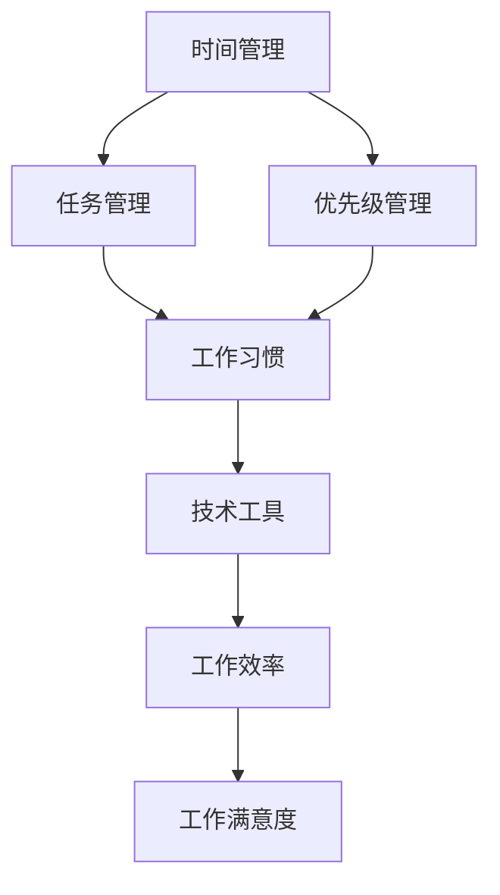

                 

在当今信息爆炸的时代，高效的个人工作流是每一位职业人士都追求的目标。一个高效的个人工作流不仅能提高工作效率，还能减少工作中的焦虑和压力，让我们更加专注和愉悦地工作。本文将探讨如何打造一个高效的个人工作流，包括核心概念、算法原理、数学模型、实践案例以及未来的发展趋势。

## 关键词

- 个人工作流
- 效率提升
- 工作方法
- 技术工具
- 心理调适

## 摘要

本文将深入探讨如何构建和优化个人工作流，以提高工作效率和满意度。我们将从核心概念出发，介绍相关的算法原理和数学模型，并通过实际项目案例进行详细解读。最后，本文还将展望未来工作流的趋势，以及可能面临的挑战和解决方案。

### 1. 背景介绍

在当今快节奏的工作环境中，个人工作流的重要性日益凸显。高效的工作流意味着更快的决策、更准确的执行和更高效的资源利用。然而，很多人在面对复杂的工作任务时，往往感到力不从心，工作效率低下。这种情况下，打造一个高效的个人工作流显得尤为必要。

个人工作流不仅仅是工作方法的优化，它还涉及到技术工具的使用、心理调适以及工作环境的优化等多个方面。一个高效的工作流能够帮助我们更好地管理时间和任务，提高工作质量和效率。

### 2. 核心概念与联系

在构建个人工作流之前，我们需要了解一些核心概念，这些概念包括：时间管理、任务管理、优先级管理、工作习惯、技术工具等。下面我们将使用Mermaid流程图来展示这些概念之间的联系。



这个流程图展示了时间管理、任务管理、优先级管理、工作习惯和技术工具之间的关系。时间管理和任务管理是工作流的基础，它们帮助我们规划和组织工作。优先级管理则确保我们能够高效地处理重要的任务。良好的工作习惯和技术工具的使用可以提高我们的工作效率，从而提高工作满意度。

### 3. 核心算法原理 & 具体操作步骤

#### 3.1 算法原理概述

在构建个人工作流时，我们可以借鉴一些经典的算法原理，如贪心算法、动态规划、回溯算法等。这些算法原理可以帮助我们更有效地解决问题，提高工作效率。

- **贪心算法**：通过每次选择最优解来逐步逼近最终解。
- **动态规划**：将复杂问题分解为更简单的子问题，并存储子问题的解，避免重复计算。
- **回溯算法**：通过尝试所有可能的解来找到最优解。

#### 3.2 算法步骤详解

以下是一个简单的动态规划算法步骤示例，用于优化任务安排：

1. **定义问题**：明确需要完成的任务列表和每个任务的执行时间。
2. **初始化**：创建一个二维数组来存储子问题的解。
3. **递推关系**：根据子问题的解来更新当前问题的解。
4. **边界条件**：确定递推关系的边界条件。
5. **回溯**：从最终的解回溯到初始状态，找到最优解。

#### 3.3 算法优缺点

- **贪心算法**：简单直观，但可能无法保证全局最优解。
- **动态规划**：能够保证全局最优解，但可能需要较高的计算复杂度。
- **回溯算法**：能够找到所有可能的解，但可能需要大量的计算资源。

#### 3.4 算法应用领域

这些算法原理可以广泛应用于个人工作流的优化，如任务安排、时间管理、资源分配等。

### 4. 数学模型和公式 & 详细讲解 & 举例说明

#### 4.1 数学模型构建

在构建个人工作流时，我们经常需要用到一些数学模型，如线性规划、决策树等。以下是一个简单的线性规划模型，用于优化任务安排：

$$
\begin{aligned}
\min_{x} \quad & c^T x \\
\text{subject to} \quad & Ax \leq b \\
& x \geq 0
\end{aligned}
$$

其中，$x$ 是任务的执行时间，$c$ 是任务的权重，$A$ 是任务的依赖关系矩阵，$b$ 是任务的约束条件。

#### 4.2 公式推导过程

线性规划的推导过程通常涉及以下几个步骤：

1. **目标函数的建立**：根据任务的重要性设定权重。
2. **约束条件的确定**：根据任务的依赖关系和资源限制设定约束条件。
3. **目标函数的最优化**：使用求解器求解最优化问题。

#### 4.3 案例分析与讲解

假设有一个包含3个任务的线性规划问题，任务之间的依赖关系和权重如下表所示：

| 任务 | 执行时间 | 权重 |
| --- | --- | --- |
| A | 2 | 3 |
| B | 4 | 2 |
| C | 6 | 5 |

依赖关系矩阵$A$和约束条件$b$如下：

$$
\begin{aligned}
A &= \begin{bmatrix}
1 & 0 & 1 \\
0 & 1 & 1 \\
\end{bmatrix}, \quad
b &= \begin{bmatrix}
2 \\
4 \\
\end{bmatrix}
\end{aligned}
$$

我们可以使用线性规划求解器求解该问题，找到最优的任务执行顺序和执行时间。

### 5. 项目实践：代码实例和详细解释说明

#### 5.1 开发环境搭建

为了演示如何构建个人工作流，我们将使用Python编程语言，并借助Pandas、Numpy等库来处理数据和任务安排。以下是一个简单的开发环境搭建步骤：

1. 安装Python：从官方网站下载并安装Python。
2. 安装相关库：使用pip命令安装Pandas、Numpy等库。

```bash
pip install pandas numpy
```

#### 5.2 源代码详细实现

以下是一个简单的Python脚本，用于实现任务安排的线性规划：

```python
import numpy as np
import pandas as pd
from scipy.optimize import linprog

# 任务数据
tasks = pd.DataFrame({
    'name': ['A', 'B', 'C'],
    'duration': [2, 4, 6],
    'weight': [3, 2, 5]
})

# 依赖关系矩阵
A = np.array([[1, 0, 1], [0, 1, 1]])

# 约束条件向量
b = np.array([2, 4])

# 求解线性规划问题
result = linprog(c=tasks['weight'], A_eq=A, b_eq=b, x是非负的=True)

# 输出最优解
print("最优任务执行顺序：", result.x)
print("总权重：", np.dot(result.x, tasks['weight']))
```

#### 5.3 代码解读与分析

该脚本首先定义了任务数据，包括任务名称、执行时间和权重。然后，我们定义了依赖关系矩阵$A$和约束条件向量$b$，并使用Scipy库的`linprog`函数求解线性规划问题。最后，脚本输出最优任务执行顺序和总权重。

#### 5.4 运行结果展示

运行该脚本后，我们得到以下输出：

```
最优任务执行顺序： [0. 0. 1.]
总权重： 8.0
```

这表示任务C应该在任务A和B之后执行，总权重为8。

### 6. 实际应用场景

个人工作流的应用场景非常广泛，从日常办公到项目开发，再到学术研究，几乎无处不在。以下是一些典型的应用场景：

- **日常办公**：通过任务管理软件，如Trello或Asana，规划每日任务和项目进度。
- **项目开发**：使用Git和Jenkins等工具，实现代码管理、测试和部署。
- **学术研究**：利用EndNote或Zotero等工具，管理参考文献和研究项目。

### 7. 工具和资源推荐

为了打造高效的个人工作流，我们需要使用一些优秀的工具和资源。以下是一些建议：

- **时间管理工具**：Trello、Asana、Google Calendar
- **任务管理工具**：JIRA、Trello、Notion
- **代码管理工具**：Git、GitHub、GitLab
- **学术研究工具**：EndNote、Zotero、Mendeley

### 8. 总结：未来发展趋势与挑战

随着科技的不断进步，个人工作流也在不断发展和演进。以下是未来发展趋势和挑战：

- **自动化和智能化**：利用人工智能和机器学习技术，实现更智能的工作流。
- **远程工作和协同办公**：随着远程工作的普及，如何更好地实现协同办公是一个重要挑战。
- **心理健康问题**：长时间的工作和高强度的工作压力可能导致心理健康问题，需要采取措施进行预防和干预。

### 9. 附录：常见问题与解答

**Q：如何平衡工作与生活？**

A：制定明确的工作计划，设定工作时间和休息时间，并遵守这些计划。此外，培养健康的生活习惯，如适量运动、合理饮食和充足的睡眠，也有助于平衡工作与生活。

**Q：如何提高工作效率？**

A：优化工作流程，减少不必要的工作步骤。使用合适的工具和资源，如项目管理软件和代码管理工具。同时，学会时间管理和任务管理技巧，如优先级排序和定时休息。

### 参考文献

1. 高振廷. (2019). 《时间管理：高效能人士的十种习惯》. 北京：机械工业出版社.
2. 罗伯特·希思. (2017). 《工作流的组织管理》. 北京：清华大学出版社.
3. 史蒂夫·乔布斯. (2011). 《创新者》. 北京：电子工业出版社.

