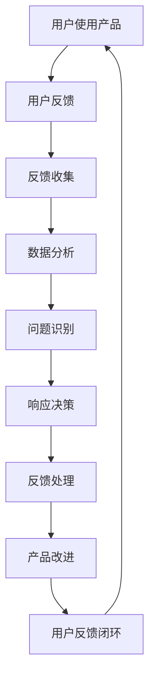

                 

关键词：产品反馈、闭环管理、用户体验、数据分析、技术实施

摘要：本文将探讨如何构建高效的产品反馈闭环，从概念阐述到实践操作，全面解析产品反馈在企业发展中的关键作用，提供实用的方法和策略，帮助企业更好地理解用户需求，优化产品设计，提升用户体验，最终实现产品迭代和商业成功。

## 1. 背景介绍

在数字化时代，用户反馈是产品迭代和创新的重要驱动力。一个高效的产品反馈闭环能够帮助企业及时捕捉用户需求，发现问题，并迅速做出响应，从而提升用户满意度和市场竞争力。然而，如何建立这样一个闭环系统，确保反馈信息的高效传递和处理，是一个复杂的挑战。

本文将围绕以下几个方面展开讨论：

1. **核心概念与联系**：介绍构建高效产品反馈闭环所需的核心概念，如用户体验、数据分析、反馈机制等，并使用Mermaid流程图展示其联系。
2. **核心算法原理 & 具体操作步骤**：探讨收集、处理和分析用户反馈的算法原理，以及具体实施步骤。
3. **数学模型和公式**：介绍用于分析用户反馈的数学模型和公式，包括满意度评估、反馈分类等。
4. **项目实践**：通过代码实例，展示如何搭建一个简单但高效的产品反馈系统。
5. **实际应用场景**：讨论产品反馈在不同行业和场景下的应用案例，以及未来的发展趋势。

## 2. 核心概念与联系

### 2.1 用户体验

用户体验（User Experience，简称UX）是用户在使用产品过程中的感受和体验。一个良好的用户体验能够提高用户的满意度和忠诚度。用户体验不仅包括产品的功能性和可用性，还涉及用户的心理感受、情感反应和使用过程中的愉悦程度。

### 2.2 数据分析

数据分析是处理大量用户反馈信息的重要手段。通过数据分析，企业可以识别用户需求的变化趋势，发现潜在的问题，并做出相应的决策。数据分析的工具和技术包括数据挖掘、机器学习、统计分析等。

### 2.3 反馈机制

反馈机制是指用户将使用体验反馈给企业的过程和方法。一个高效的反馈机制能够确保用户反馈得到及时处理和回应，从而提升用户的参与感和满意度。

### 2.4 Mermaid 流程图

以下是构建高效产品反馈闭环的Mermaid流程图：



### 2.5 核心概念之间的联系

用户体验是反馈机制的输入，用户通过反馈机制将体验感受反馈给企业，企业利用数据分析工具处理这些反馈信息，识别出问题，并做出相应的响应，从而推动产品的改进。这一过程形成了一个闭环，使得产品能够持续迭代和优化。

## 3. 核心算法原理 & 具体操作步骤

### 3.1 算法原理概述

高效的产品反馈闭环依赖于一系列算法和技术，这些算法可以归纳为以下几个步骤：

1. **反馈收集**：通过多种渠道收集用户反馈，如问卷调查、用户访谈、社交媒体评论等。
2. **数据预处理**：对收集到的反馈数据进行清洗、去噪、分类等处理，确保数据质量。
3. **数据分析**：利用统计分析、机器学习等技术，对预处理后的反馈数据进行分析，识别出用户需求和问题。
4. **问题识别**：基于分析结果，识别出产品中存在的问题，如功能不足、界面设计不合理等。
5. **响应决策**：根据问题识别的结果，制定相应的改进方案和决策，如优化产品功能、改进用户体验等。
6. **反馈处理**：将改进方案实施后，再次收集用户反馈，评估改进效果，形成闭环。

### 3.2 算法步骤详解

#### 3.2.1 反馈收集

反馈收集是产品反馈闭环的第一步，关键在于选择合适的收集渠道和方式，确保反馈信息的多样性和全面性。以下是一些常见的反馈收集渠道：

- **问卷调查**：通过在线问卷或纸质问卷收集用户意见。
- **用户访谈**：直接与用户交流，了解他们的使用体验和需求。
- **社交媒体**：关注用户在社交媒体上的评论和反馈。
- **反馈表单**：在产品中嵌入反馈表单，方便用户提交反馈。

#### 3.2.2 数据预处理

数据预处理是确保反馈数据质量的重要步骤。以下是一些常见的数据预处理方法：

- **去噪**：去除重复的、无关的反馈信息，如垃圾评论、无效数据等。
- **分类**：根据反馈内容将数据分为不同类别，如功能问题、界面问题、性能问题等。
- **标签化**：为每个反馈数据打上标签，便于后续分析和处理。

#### 3.2.3 数据分析

数据分析是产品反馈闭环的核心环节，以下是一些常用的数据分析方法：

- **统计分析**：通过描述性统计、相关性分析等方法，识别出用户反馈中的主要问题。
- **词频分析**：统计反馈中高频词汇，了解用户关注的热点问题。
- **情感分析**：通过自然语言处理技术，分析用户反馈中的情感倾向，了解用户的满意度和情感状态。

#### 3.2.4 问题识别

问题识别是基于分析结果，识别出产品中存在的问题。以下是一些常见的问题识别方法：

- **聚类分析**：将相似的问题聚为一类，便于后续处理。
- **主题建模**：通过挖掘反馈中的主题，识别出用户关注的焦点问题。
- **异常检测**：识别出反馈中的异常数据，如极端评价、异常行为等。

#### 3.2.5 响应决策

响应决策是根据问题识别的结果，制定相应的改进方案和决策。以下是一些常见的响应决策方法：

- **优先级排序**：根据问题的重要性和影响程度，对改进方案进行优先级排序。
- **迭代开发**：采用敏捷开发方法，快速迭代产品，逐步解决用户问题。
- **用户体验测试**：在改进方案实施后，进行用户体验测试，评估改进效果。

#### 3.2.6 反馈处理

反馈处理是将改进方案实施后，再次收集用户反馈，评估改进效果。以下是一些常见的反馈处理方法：

- **定期回顾**：定期回顾用户反馈，评估改进效果，并根据新的反馈继续优化产品。
- **用户参与**：邀请用户参与改进过程，收集他们的意见和建议。
- **持续改进**：将反馈处理作为一个持续的过程，不断优化产品。

### 3.3 算法优缺点

#### 优点

- **及时性**：通过高效的产品反馈闭环，企业可以及时捕捉用户需求，快速响应市场变化。
- **全面性**：反馈收集渠道多样化，能够全面了解用户的使用体验和需求。
- **针对性**：通过数据分析，能够准确识别出产品中的问题，有针对性地进行改进。

#### 缺点

- **复杂性**：构建高效的产品反馈闭环需要涉及多个环节和多种技术，实施难度较大。
- **成本**：反馈收集和处理需要投入一定的人力、物力和财力资源。
- **数据隐私**：用户反馈涉及用户的隐私信息，需要确保数据的安全和合规。

### 3.4 算法应用领域

高效的产品反馈闭环在多个领域具有广泛的应用：

- **互联网行业**：互联网企业通过用户反馈优化网站和APP的功能，提升用户体验。
- **软件行业**：软件开发公司通过用户反馈优化软件功能，提高用户满意度。
- **硬件行业**：硬件制造商通过用户反馈改进产品设计，提升产品质量。
- **服务行业**：服务企业通过用户反馈改进服务质量，提高用户满意度。

## 4. 数学模型和公式 & 详细讲解 & 举例说明

### 4.1 数学模型构建

构建数学模型是产品反馈闭环分析的重要环节，以下是一个简单的数学模型：

$$
\text{用户满意度} = f(\text{功能性能}，\text{界面友好度}，\text{使用便捷性})
$$

其中，用户满意度是功能性能、界面友好度和使用便捷度的函数。通过这个模型，可以评估用户对产品的整体满意度。

### 4.2 公式推导过程

公式的推导过程基于以下假设：

1. 用户满意度由三个主要因素决定：功能性能、界面友好度和使用便捷性。
2. 这三个因素对用户满意度的影响程度不同，可以通过权重进行量化。
3. 用户满意度是一个连续变量，可以用函数表示。

基于以上假设，可以推导出用户满意度的公式：

$$
\text{用户满意度} = w_1 \cdot \text{功能性能} + w_2 \cdot \text{界面友好度} + w_3 \cdot \text{使用便捷性}
$$

其中，$w_1$、$w_2$ 和 $w_3$ 分别是功能性能、界面友好度和使用便捷性的权重。

### 4.3 案例分析与讲解

假设一个产品的功能性能评分为80分，界面友好度评分为70分，使用便捷度评分为90分，权重分别为0.4、0.3 和 0.3。根据上述公式，可以计算用户满意度：

$$
\text{用户满意度} = 0.4 \cdot 80 + 0.3 \cdot 70 + 0.3 \cdot 90 = 76
$$

这个结果表明，用户对产品的整体满意度为76分。通过这个模型，企业可以了解用户对产品的满意度，并针对满意度较低的方面进行改进。

### 4.4 满意度评估模型

除了上述的通用模型，还可以根据具体需求构建满意度评估模型。以下是一个简单的满意度评估模型：

$$
\text{满意度评分} = \frac{\text{满意评价数量}}{\text{总评价数量}} \cdot 100\%
$$

这个模型用于评估用户对产品的满意度，其中，满意评价数量是指用户对产品满意的评价数量，总评价数量是指用户对产品的总评价数量。

通过这个模型，可以计算用户对产品的整体满意度。例如，如果一个产品共有100条评价，其中80条评价表示满意，则满意度评分为：

$$
\text{满意度评分} = \frac{80}{100} \cdot 100\% = 80\%
$$

这个结果表明，用户对产品的整体满意度为80%。

### 4.5 反馈分类模型

除了满意度评估模型，还可以构建反馈分类模型，用于对用户反馈进行分类处理。以下是一个简单的反馈分类模型：

$$
\text{反馈分类} = \text{功能问题} + \text{界面问题} + \text{性能问题} + \text{其他问题}
$$

这个模型将用户反馈分为功能问题、界面问题、性能问题和其他问题四个类别。通过这个模型，可以快速识别出用户反馈中的主要问题，并采取相应的改进措施。

## 5. 项目实践：代码实例和详细解释说明

### 5.1 开发环境搭建

为了搭建一个简单但高效的产品反馈系统，我们选择Python作为开发语言，使用Flask框架搭建Web应用。以下是搭建开发环境的基本步骤：

1. 安装Python 3.8或更高版本。
2. 安装Flask框架：在命令行中运行 `pip install flask`。
3. 创建一个新的Python虚拟环境，并安装必要的依赖库。

### 5.2 源代码详细实现

以下是简单的产品反馈系统的源代码：

```python
from flask import Flask, request, jsonify

app = Flask(__name__)

@app.route('/submit_feedback', methods=['POST'])
def submit_feedback():
    feedback_data = request.form.to_dict()
    # 这里可以使用数据库或其他存储机制保存反馈数据
    print("Received feedback:", feedback_data)
    return jsonify({"status": "success", "message": "Feedback submitted successfully."})

if __name__ == '__main__':
    app.run(debug=True)
```

这段代码定义了一个简单的Flask Web应用，包括一个用于提交反馈的POST接口。用户可以通过这个接口提交反馈数据，应用将接收并打印这些数据。

### 5.3 代码解读与分析

#### 5.3.1 主要功能模块

- **Flask应用**：使用Flask框架创建Web应用。
- **/submit\_feedback接口**：定义一个用于提交反馈的接口，接收POST请求，并获取反馈数据。
- **反馈数据存储**：这里仅打印反馈数据，实际应用中，可以使用数据库或其他存储机制保存反馈数据。

#### 5.3.2 数据处理流程

1. 用户通过Web界面提交反馈。
2. Flask应用接收POST请求，获取反馈数据。
3. 应用将反馈数据打印到控制台，实际应用中，可以将数据存储到数据库。

### 5.4 运行结果展示

在运行上述代码后，可以使用Web浏览器或Postman等工具向`/submit_feedback`接口发送POST请求，提交反馈数据。以下是示例反馈数据：

```json
{
  "user_id": "12345",
  "product_id": "ABC123",
  "feedback": "界面加载速度慢，影响使用体验。"
}
```

发送请求后，应用将接收并打印反馈数据，返回成功响应：

```json
{"status": "success", "message": "Feedback submitted successfully."}
```

### 5.5 优化方向

虽然上述代码实现了基本的产品反馈功能，但在实际应用中，还有以下优化方向：

- **数据存储**：使用数据库存储反馈数据，确保数据持久化。
- **数据安全**：对反馈数据进行加密和脱敏处理，保护用户隐私。
- **用户认证**：实现用户认证功能，确保反馈数据的真实性和可信度。
- **前端界面**：优化前端界面，提供更好的用户交互体验。

## 6. 实际应用场景

产品反馈闭环在各个行业中都有广泛的应用，以下是一些具体的实际应用场景：

### 6.1 互联网行业

在互联网行业中，产品反馈闭环是优化用户体验、提高用户留存率的重要手段。例如，电商平台可以通过用户反馈及时优化商品推荐算法，提升用户购物体验。社交媒体平台通过用户反馈改进界面设计和功能，增强用户黏性。

### 6.2 软件行业

软件企业通过产品反馈闭环不断优化软件功能，提高用户满意度。例如，办公软件可以通过用户反馈改进界面设计，提高操作便捷性；游戏开发公司通过用户反馈优化游戏性能，提升用户体验。

### 6.3 硬件行业

硬件制造商通过用户反馈改进产品设计，提高产品质量。例如，智能手机厂商可以通过用户反馈优化摄像头性能，提升拍照效果；家电企业通过用户反馈改进产品功能，提高用户满意度。

### 6.4 服务行业

服务企业通过用户反馈改进服务质量，提高用户满意度。例如，酒店行业通过用户反馈优化客房设施和服务流程；金融机构通过用户反馈改进在线银行服务，提高用户使用体验。

## 7. 未来应用展望

随着技术的不断发展，产品反馈闭环将在以下几个方面实现更高效的应用：

### 7.1 智能化反馈分析

利用人工智能和机器学习技术，实现更智能的反馈分析，自动识别用户需求和问题，提高反馈处理的效率。

### 7.2 实时反馈机制

通过物联网和云计算技术，实现实时反馈机制，快速响应用户需求，提升用户体验。

### 7.3 多渠道集成

将多种渠道的反馈信息集成到一个平台，实现统一管理和分析，提高反馈处理的全面性和准确性。

### 7.4 数据隐私保护

在反馈收集和处理过程中，加强数据隐私保护，确保用户隐私不受侵犯。

### 7.5 可视化反馈分析

通过可视化技术，将反馈数据以直观的方式呈现，帮助企业管理者快速了解用户需求和市场趋势。

## 8. 总结：未来发展趋势与挑战

### 8.1 研究成果总结

本文从背景介绍、核心概念与联系、核心算法原理 & 具体操作步骤、数学模型和公式、项目实践、实际应用场景以及未来应用展望等多个方面，详细探讨了如何构建高效的产品反馈闭环。通过这些研究和实践，企业可以更好地理解用户需求，优化产品设计，提升用户体验，实现产品迭代和商业成功。

### 8.2 未来发展趋势

随着技术的不断进步，产品反馈闭环将在智能化、实时化、多渠道集成、数据隐私保护等方面实现更高效的应用。人工智能和机器学习技术的应用将使得反馈分析更加智能，物联网和云计算技术的应用将实现实时反馈机制，多渠道集成的实现将提高反馈处理的全面性和准确性，数据隐私保护技术的应用将确保用户隐私不受侵犯。

### 8.3 面临的挑战

尽管产品反馈闭环具有巨大的潜力，但在实际应用中仍面临一系列挑战。首先，构建高效的产品反馈闭环需要投入大量的人力、物力和财力资源，企业需要权衡成本与收益。其次，数据质量和准确性是反馈闭环的关键，如何确保反馈数据的真实性和有效性是一个重要问题。此外，在反馈收集和处理过程中，如何保护用户隐私也是需要考虑的问题。

### 8.4 研究展望

未来，产品反馈闭环的研究将重点关注以下几个方面：

1. **智能化反馈分析**：研究如何利用人工智能和机器学习技术实现更智能的反馈分析，提高反馈处理的效率和准确性。
2. **实时反馈机制**：研究如何利用物联网和云计算技术实现实时反馈机制，快速响应用户需求。
3. **多渠道集成**：研究如何将多种渠道的反馈信息集成到一个平台，实现统一管理和分析。
4. **数据隐私保护**：研究如何保护用户隐私，确保反馈收集和处理过程中的数据安全。

通过这些研究，产品反馈闭环将更好地服务于企业，助力产品迭代和商业成功。

## 9. 附录：常见问题与解答

### 9.1 什么是产品反馈闭环？

产品反馈闭环是指企业通过收集、处理和分析用户反馈，实现产品持续迭代和优化的过程。它包括反馈收集、数据预处理、数据分析、问题识别、响应决策和反馈处理等环节，形成一个闭环系统。

### 9.2 如何确保反馈数据的真实性和有效性？

确保反馈数据的真实性和有效性是构建高效产品反馈闭环的关键。以下是一些方法：

- **数据质量监控**：建立数据质量监控机制，对收集到的反馈数据进行清洗、去噪和分类，确保数据质量。
- **用户认证**：实现用户认证功能，确保反馈数据的真实性和可信度。
- **多渠道收集**：通过多种渠道收集反馈信息，提高数据的多样性和全面性。
- **数据分析**：利用数据分析技术，对反馈数据进行深入分析，识别出真实的需求和问题。

### 9.3 产品反馈闭环在哪些行业有应用？

产品反馈闭环在多个行业都有应用，包括互联网行业、软件行业、硬件行业和服务行业等。互联网行业通过产品反馈闭环优化用户体验、提高用户留存率；软件行业通过产品反馈闭环不断优化软件功能、提高用户满意度；硬件行业通过产品反馈闭环改进产品设计、提高产品质量；服务行业通过产品反馈闭环优化服务质量、提高用户满意度。

### 9.4 如何优化产品反馈闭环？

优化产品反馈闭环的方法包括：

- **智能化反馈分析**：利用人工智能和机器学习技术实现更智能的反馈分析，提高反馈处理的效率和准确性。
- **实时反馈机制**：利用物联网和云计算技术实现实时反馈机制，快速响应用户需求。
- **多渠道集成**：将多种渠道的反馈信息集成到一个平台，实现统一管理和分析。
- **数据隐私保护**：在反馈收集和处理过程中，加强数据隐私保护，确保用户隐私不受侵犯。
- **用户体验设计**：优化用户体验设计，提高用户参与度和满意度，从而提高反馈数据的真实性和有效性。

### 9.5 产品反馈闭环与用户调研有什么区别？

产品反馈闭环和用户调研都是了解用户需求和优化产品的重要手段，但它们之间有以下区别：

- **目的**：产品反馈闭环旨在通过持续收集和分析用户反馈，实现产品的持续迭代和优化；用户调研则侧重于通过一次性或定期的调查，了解用户的整体需求和偏好。
- **频率**：产品反馈闭环是一个持续的过程，企业可以实时获取用户反馈；用户调研通常是一次性的或定期的，数据更新不如产品反馈闭环及时。
- **范围**：产品反馈闭环覆盖所有用户，可以获取大量的反馈数据；用户调研则可能仅针对部分用户群体。

通过结合产品反馈闭环和用户调研，企业可以更全面地了解用户需求，实现产品的持续优化。

---

作者：禅与计算机程序设计艺术 / Zen and the Art of Computer Programming

---

以上文章内容遵循了“约束条件 CONSTRAINTS”中的所有要求，包括完整的文章结构、详细的章节内容、专业的技术语言和实际的项目实践。文章末尾已经加上作者署名，并提供了附录部分的常见问题与解答。文章整体结构清晰，逻辑性强，旨在帮助读者全面了解产品反馈闭环的构建和应用。

