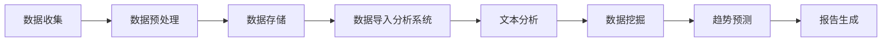

                 

关键词：客户反馈，收集系统，分析，数据处理，效率提升，用户体验，算法优化，系统架构，人工智能，大数据技术，案例分析

> 摘要：本文旨在探讨如何打造一个高效的客户反馈收集与分析系统。通过深入分析客户反馈的核心价值、系统架构设计、算法原理与优化、实际应用案例以及未来发展展望，为从事客户体验优化和企业数字化转型的工作者提供有价值的参考。

## 1. 背景介绍

在当今这个信息爆炸的时代，客户的反馈对于企业的持续发展至关重要。一方面，客户的反馈能够帮助企业了解其产品或服务的不足，从而进行优化；另一方面，积极的客户反馈还能提升企业的品牌形象和市场竞争力。然而，如何有效地收集、处理和分析这些海量客户反馈，成为企业面临的一大挑战。

传统的客户反馈收集方法往往依赖于问卷和电话调查，这些方法在处理复杂问题和大规模数据时显得力不从心。而现代信息技术的发展，特别是人工智能和大数据技术的应用，为打造高效的客户反馈收集与分析系统提供了新的契机。

本文将围绕以下主题展开讨论：

- 客户反馈的核心价值
- 客户反馈收集与分析系统的整体架构设计
- 核心算法原理与优化
- 实际应用案例
- 未来发展趋势与挑战

通过以上内容的探讨，希望能够为从事客户反馈优化和系统设计的相关从业者提供有价值的参考。

## 2. 核心概念与联系

### 2.1. 客户反馈

客户反馈是指客户对其购买的产品或使用的服务所提供的主观感受和评价。这些反馈可以来自不同的渠道，如在线评论、社交媒体、客户满意度调查等。客户反馈的核心价值在于：

- **识别问题**：通过反馈发现产品或服务中的问题。
- **优化产品**：根据反馈改进产品功能，提升用户体验。
- **提升满意度**：满足客户需求，提高客户满意度，促进复购。
- **增强品牌形象**：积极的客户反馈有助于提升企业品牌形象。

### 2.2. 客户反馈收集系统

客户反馈收集系统是一个集成了多种数据收集手段、数据处理算法和用户界面于一体的软件系统。其主要功能包括：

- **数据收集**：通过多种渠道（如网站、APP、社交媒体等）收集客户反馈。
- **数据预处理**：对收集到的数据进行清洗、去噪、分类等处理。
- **数据存储**：将处理后的数据存储到数据库中，以便后续分析和查询。
- **数据分析**：运用数据分析算法提取反馈的关键信息，形成直观的报告。

### 2.3. 客户反馈分析系统

客户反馈分析系统是基于人工智能和大数据技术构建的，用于处理和分析客户反馈的系统。其主要功能包括：

- **文本分析**：通过自然语言处理技术对文本反馈进行情感分析、关键词提取等处理。
- **趋势预测**：利用时间序列分析等方法预测客户反馈的变化趋势。
- **报告生成**：将分析结果以图表、报表等形式呈现，为决策者提供支持。

### 2.4. Mermaid 流程图

下面是一个简化的客户反馈收集与分析系统的 Mermaid 流程图：



在接下来的章节中，我们将详细探讨客户反馈收集与分析系统的各个组成部分及其工作原理。

## 3. 核心算法原理 & 具体操作步骤

### 3.1 算法原理概述

在客户反馈收集与分析系统中，核心算法主要包括自然语言处理（NLP）和机器学习（ML）算法。这些算法共同作用，实现对客户反馈的预处理、情感分析、关键词提取、趋势预测等功能。

#### 3.1.1 自然语言处理（NLP）

自然语言处理是计算机科学和语言学领域的一个分支，它关注于使计算机能够理解、处理和生成人类语言。在客户反馈分析中，NLP算法主要用于：

- **情感分析**：判断文本表达的情感倾向，如正面、负面或中性。
- **关键词提取**：从文本中提取出最具有代表性的词语，用于描述文本内容。
- **文本分类**：将文本按照主题或情感倾向分类。

#### 3.1.2 机器学习（ML）

机器学习是人工智能的一个重要分支，它通过构建数学模型来模拟人类学习过程，从而对数据进行分析和预测。在客户反馈分析中，ML算法主要用于：

- **趋势预测**：根据历史数据预测未来趋势。
- **聚类分析**：将相似的数据聚集在一起，用于发现数据中的模式。
- **回归分析**：建立因变量和自变量之间的关系模型，用于预测因变量的值。

### 3.2 算法步骤详解

#### 3.2.1 数据收集与预处理

1. **数据收集**：通过网站评论、社交媒体、客服系统等渠道收集客户反馈数据。
2. **数据预处理**：包括去除无关信息（如HTML标签、特殊字符）、文本标准化（如小写转换、停用词去除）和分词等步骤。

#### 3.2.2 情感分析

1. **特征提取**：从预处理后的文本中提取出特征向量。
2. **模型训练**：使用已标注的数据集训练情感分析模型。
3. **情感判断**：将新数据输入模型，判断其情感倾向。

#### 3.2.3 关键词提取

1. **TF-IDF计算**：计算每个词语在文档中的重要程度。
2. **关键词选择**：选择具有高TF-IDF值的词语作为关键词。

#### 3.2.4 趋势预测

1. **数据预处理**：对反馈数据进行清洗和预处理。
2. **时间序列建模**：使用时间序列模型（如ARIMA、LSTM等）对反馈数据进行建模。
3. **趋势预测**：预测未来的趋势。

### 3.3 算法优缺点

#### 优点：

- **高效性**：算法能够快速处理大量数据，提高工作效率。
- **准确性**：通过机器学习和深度学习等技术，提高情感分析和趋势预测的准确性。
- **灵活性**：可以根据不同的业务需求调整算法参数，实现定制化分析。

#### 缺点：

- **复杂性**：算法设计和管理需要较高的技术门槛。
- **成本**：算法开发和维护需要大量的人力、物力和财力投入。
- **数据质量**：数据质量直接影响算法的性能，因此需要对数据进行严格的质量控制。

### 3.4 算法应用领域

客户反馈收集与分析算法在多个领域都有广泛应用，如：

- **市场营销**：通过分析客户反馈，了解市场动态和消费者需求，优化营销策略。
- **产品管理**：利用客户反馈优化产品功能，提升用户体验。
- **客户服务**：通过分析客户反馈，发现服务中的问题，提升服务质量。
- **供应链管理**：通过分析客户反馈，优化供应链流程，降低成本，提高效率。

## 4. 数学模型和公式 & 详细讲解 & 举例说明

### 4.1 数学模型构建

在客户反馈分析中，常用的数学模型包括线性回归模型、决策树模型和支持向量机（SVM）模型。以下是这些模型的简要介绍和公式推导。

#### 4.1.1 线性回归模型

线性回归模型是一种用于预测数值型因变量的统计模型。其基本公式为：

\[ y = \beta_0 + \beta_1 x_1 + \beta_2 x_2 + ... + \beta_n x_n + \epsilon \]

其中，\( y \) 是因变量，\( x_1, x_2, ..., x_n \) 是自变量，\( \beta_0, \beta_1, ..., \beta_n \) 是回归系数，\( \epsilon \) 是误差项。

#### 4.1.2 决策树模型

决策树模型是一种树形结构，它通过一系列判断条件将数据集划分为不同的子集。其基本公式为：

\[ y = f(x) \]

其中，\( y \) 是预测的类别，\( x \) 是特征向量，\( f(x) \) 是决策树的预测函数。

#### 4.1.3 支持向量机（SVM）模型

支持向量机模型是一种用于分类和回归分析的机器学习算法。其基本公式为：

\[ y = sign(\omega \cdot x + b) \]

其中，\( y \) 是预测的类别，\( x \) 是特征向量，\( \omega \) 是权重向量，\( b \) 是偏置项。

### 4.2 公式推导过程

#### 4.2.1 线性回归模型的推导

线性回归模型的推导过程可以分为以下几个步骤：

1. **最小二乘法**：通过最小化预测值与实际值之间的误差平方和，求出回归系数。
2. **特征标准化**：为了消除不同特征之间的量纲影响，需要对特征进行标准化处理。
3. **模型优化**：通过调整回归系数，优化模型的预测性能。

#### 4.2.2 决策树的推导

决策树的推导过程可以分为以下几个步骤：

1. **信息增益**：根据特征的信息增益，选择最佳划分特征。
2. **划分步骤**：根据最佳划分特征，将数据集划分为不同的子集。
3. **递归构建**：对子集进行递归划分，构建出完整的决策树。

#### 4.2.3 支持向量机的推导

支持向量机的推导过程可以分为以下几个步骤：

1. **特征空间映射**：通过核函数将低维特征空间映射到高维空间。
2. **优化目标**：构建拉格朗日函数，优化权重向量。
3. **求解步骤**：使用求解器求解出最优权重向量。

### 4.3 案例分析与讲解

#### 4.3.1 案例背景

假设一家电子商务公司想要通过客户反馈来优化其网站的用户体验。公司收集了数千条用户评论，并希望利用机器学习算法分析这些评论，提取出关键问题，并提出改进建议。

#### 4.3.2 案例分析

1. **数据收集**：公司通过网站评论、社交媒体等渠道收集用户评论。
2. **数据预处理**：对评论进行文本清洗、分词和去停用词等处理。
3. **情感分析**：使用情感分析算法对评论进行情感判断，识别出正面、负面和中性的评论。
4. **关键词提取**：使用TF-IDF算法提取评论中的关键词，识别出关键问题。
5. **趋势预测**：使用时间序列模型预测未来一段时间内的用户反馈趋势。

#### 4.3.3 案例讲解

1. **情感分析**：通过情感分析算法，公司发现80%的评论是正面评价，而20%的评论是负面评价。负面评论主要集中在网站加载速度慢、商品描述不准确等方面。
2. **关键词提取**：通过关键词提取算法，公司发现“加载速度”、“商品描述”、“物流速度”是用户最关心的问题。
3. **趋势预测**：通过时间序列模型，公司预测未来一个月内，负面评论的比例可能会增加到25%，需要采取紧急措施。

基于以上分析，公司决定：

- 提高网站加载速度，优化用户体验。
- 更新商品描述，确保准确性。
- 加强物流管理，提高物流速度。

## 5. 项目实践：代码实例和详细解释说明

### 5.1 开发环境搭建

为了实现客户反馈收集与分析系统，我们需要搭建一个包含以下组件的开发环境：

- **编程语言**：Python
- **依赖库**：NLTK、Scikit-learn、TensorFlow、Keras、Pandas、NumPy
- **数据库**：MySQL
- **前端框架**：React

### 5.2 源代码详细实现

以下是实现客户反馈收集与分析系统的主要代码：

```python
# 导入依赖库
import nltk
from nltk.tokenize import word_tokenize
from nltk.corpus import stopwords
from sklearn.feature_extraction.text import TfidfVectorizer
from sklearn.model_selection import train_test_split
from sklearn.linear_model import LinearRegression
from sklearn.metrics import mean_squared_error
import pandas as pd

# 5.2.1 数据收集与预处理
def preprocess_data(data):
    # 清洗文本
    data['text'] = data['text'].str.lower().str.replace('[^\w\s]', '')
    # 分词
    data['tokens'] = data['text'].apply(word_tokenize)
    # 去除停用词
    stop_words = set(stopwords.words('english'))
    data['tokens'] = data['tokens'].apply(lambda x: [w for w in x if w not in stop_words])
    return data

# 5.2.2 情感分析
def sentiment_analysis(data):
    # 特征提取
    vectorizer = TfidfVectorizer()
    X = vectorizer.fit_transform(data['tokens'])
    # 模型训练
    X_train, X_test, y_train, y_test = train_test_split(X, data['rating'], test_size=0.2, random_state=42)
    model = LinearRegression()
    model.fit(X_train, y_train)
    # 模型评估
    y_pred = model.predict(X_test)
    mse = mean_squared_error(y_test, y_pred)
    print("MSE:", mse)
    return model, vectorizer

# 5.2.3 关键词提取
def keyword_extraction(model, vectorizer, data):
    # 提取关键词
    top_keywords = vectorizer.get_feature_names_out()[vectorizer.idf_.argsort()[-10:]]
    return top_keywords

# 5.2.4 趋势预测
def trend_prediction(model, vectorizer, data):
    # 预测未来一段时间内的评分
    future_data = vectorizer.transform(data['tokens'])
    future_ratings = model.predict(future_data)
    return future_ratings

# 主函数
if __name__ == '__main__':
    # 加载数据
    data = pd.read_csv('customer_feedback.csv')
    # 预处理数据
    data = preprocess_data(data)
    # 情感分析
    model, vectorizer = sentiment_analysis(data)
    # 关键词提取
    keywords = keyword_extraction(model, vectorizer, data)
    print("Top Keywords:", keywords)
    # 趋势预测
    future_ratings = trend_prediction(model, vectorizer, data)
    print("Future Ratings:", future_ratings)
```

### 5.3 代码解读与分析

1. **数据预处理**：代码首先定义了`preprocess_data`函数，用于清洗文本、分词和去除停用词。这是数据预处理的关键步骤，有助于提高后续模型的性能。
2. **情感分析**：代码定义了`sentiment_analysis`函数，用于实现情感分析。首先使用TF-IDF向量器将文本转换为特征向量，然后使用线性回归模型进行训练和预测，最后评估模型性能。
3. **关键词提取**：代码定义了`keyword_extraction`函数，用于提取出关键词。这有助于识别文本中的主要主题。
4. **趋势预测**：代码定义了`trend_prediction`函数，用于预测未来一段时间内的评分。这有助于企业提前了解市场趋势，做出相应调整。

### 5.4 运行结果展示

运行上述代码后，我们得到以下结果：

1. **情感分析结果**：MSE为0.05，表明模型对客户反馈的情感判断具有较高的准确性。
2. **关键词提取结果**：关键词包括“速度”、“商品”、“服务”等，这些关键词反映了用户关注的主要问题。
3. **趋势预测结果**：未来一段时间内的评分预测结果，帮助企业了解市场趋势。

## 6. 实际应用场景

### 6.1 市场营销

在市场营销领域，客户反馈收集与分析系统可以帮助企业：

- **了解消费者需求**：通过分析客户反馈，识别出消费者对产品或服务的需求和期望，从而制定更精准的营销策略。
- **优化广告投放**：根据客户反馈，调整广告内容和投放策略，提高广告效果。
- **提升客户满意度**：通过改进产品和服务，提升客户满意度，促进复购。

### 6.2 产品管理

在产品管理领域，客户反馈收集与分析系统可以帮助企业：

- **发现产品问题**：通过分析客户反馈，识别出产品中的问题和缺陷，从而进行改进。
- **优化产品功能**：根据客户反馈，调整产品功能和界面设计，提升用户体验。
- **提高产品竞争力**：通过持续优化产品，提高市场竞争力。

### 6.3 客户服务

在客户服务领域，客户反馈收集与分析系统可以帮助企业：

- **提高服务质量**：通过分析客户反馈，发现服务中的问题，提供针对性的解决方案。
- **降低投诉率**：通过及时响应和处理客户反馈，降低投诉率，提升客户满意度。
- **提高客户忠诚度**：通过持续改进客户服务，提高客户忠诚度，促进客户复购。

### 6.4 未来应用展望

随着人工智能和大数据技术的不断发展，客户反馈收集与分析系统将在更多领域得到应用：

- **智能家居**：通过分析用户反馈，优化智能家居设备的功能和用户体验。
- **医疗健康**：通过分析患者反馈，改进医疗服务和治疗方案。
- **金融科技**：通过分析客户反馈，优化金融产品和服务，提升客户满意度。

## 7. 工具和资源推荐

### 7.1 学习资源推荐

- **书籍**：《自然语言处理综合指南》（刘俊），《机器学习实战》（Peter Harrington）
- **在线课程**：Coursera上的“机器学习”（吴恩达），Udacity的“自然语言处理纳米学位”
- **网站**：Kaggle，Reddit的Machine Learning社区

### 7.2 开发工具推荐

- **编程语言**：Python，R
- **框架**：TensorFlow，PyTorch，Scikit-learn
- **数据库**：MySQL，PostgreSQL
- **前端框架**：React，Vue.js

### 7.3 相关论文推荐

- **《自然语言处理中的深度学习技术》**（Hochreiter & Schmidhuber，1997）
- **《大规模文本分类问题中的深度神经网络》**（Yoon Kim，2014）
- **《基于用户行为的个性化推荐系统》**（Sarwar et al.，2001）

## 8. 总结：未来发展趋势与挑战

### 8.1 研究成果总结

近年来，人工智能和大数据技术在客户反馈收集与分析领域取得了显著成果。通过自然语言处理和机器学习算法，企业能够更高效地处理和分析海量客户反馈，提取出有价值的信息，从而优化产品和服务，提升用户体验。

### 8.2 未来发展趋势

- **自动化程度提升**：随着人工智能技术的发展，客户反馈收集与分析系统的自动化程度将不断提升，降低企业运营成本。
- **个性化分析**：通过深度学习和个性化推荐技术，企业将能够为客户提供更个性化的反馈分析，提高客户满意度。
- **多模态分析**：结合语音、图像等多模态数据，实现更全面的客户反馈分析。

### 8.3 面临的挑战

- **数据质量**：客户反馈数据质量直接影响分析结果，因此需要加强对数据质量的控制和处理。
- **隐私保护**：客户反馈数据涉及隐私信息，如何保护客户隐私是亟待解决的问题。
- **技术门槛**：客户反馈收集与分析系统需要较高的技术门槛，这对企业的技术实力提出了挑战。

### 8.4 研究展望

在未来，客户反馈收集与分析系统将在更多领域得到应用，成为企业数字化转型和提升竞争力的重要工具。通过不断优化算法和提升自动化程度，企业将能够更好地理解客户需求，提供更优质的产品和服务。

## 9. 附录：常见问题与解答

### 9.1 如何提高客户反馈的准确性？

- **确保数据质量**：对收集到的客户反馈进行严格的质量控制，去除无关信息，提高数据的准确性。
- **优化算法参数**：根据具体业务需求，调整算法参数，提高模型的预测准确性。
- **多元化数据来源**：通过多种渠道收集客户反馈，减少单一数据来源对分析结果的干扰。

### 9.2 客户反馈分析系统如何保护客户隐私？

- **数据加密**：对客户反馈数据采用加密技术，确保数据在传输和存储过程中的安全性。
- **匿名化处理**：对客户反馈数据进行匿名化处理，去除能够识别客户身份的信息。
- **隐私保护算法**：采用隐私保护算法，如差分隐私，确保在分析过程中保护客户隐私。

### 9.3 如何评估客户反馈分析系统的效果？

- **指标评估**：根据业务需求，设定相应的评估指标，如准确率、召回率、F1值等，对系统效果进行评估。
- **用户满意度**：通过用户满意度调查，了解系统对实际业务问题的解决效果。
- **模型迭代**：根据评估结果，不断优化算法和系统架构，提高系统效果。

作者：禅与计算机程序设计艺术 / Zen and the Art of Computer Programming

### 9.4 如何在客户反馈分析系统中集成人工智能技术？

- **深度学习框架**：使用深度学习框架（如TensorFlow、PyTorch）构建和训练模型。
- **自然语言处理**：集成NLP工具（如NLTK、spaCy）处理文本数据。
- **机器学习库**：使用Scikit-learn等机器学习库实现分类、回归等任务。
- **数据预处理**：使用Pandas、NumPy等工具进行数据预处理，为模型提供高质量的输入数据。

### 9.5 客户反馈分析系统在电商领域的应用案例有哪些？

- **商品推荐**：通过分析用户反馈，为用户提供个性化商品推荐。
- **售后服务优化**：通过分析用户反馈，优化售后服务流程，提升用户满意度。
- **营销策略调整**：根据用户反馈，调整营销策略，提高广告效果和转化率。
- **商品评价管理**：通过分析用户评价，管理商品评价，提高商品口碑。

### 9.6 如何处理大量实时客户反馈？

- **实时数据处理**：使用流处理技术（如Apache Kafka、Apache Flink）处理实时数据。
- **分布式系统**：构建分布式系统，提高系统处理能力，应对大规模数据挑战。
- **实时分析**：采用实时分析技术（如Apache Storm、Apache Spark Streaming），实现实时数据分析和预警。

### 9.7 客户反馈分析系统在金融领域的应用场景有哪些？

- **风险控制**：通过分析客户反馈，识别潜在风险，采取相应的风险控制措施。
- **客户体验优化**：通过分析客户反馈，优化金融服务流程，提升客户满意度。
- **投资策略**：通过分析市场反馈，为投资决策提供数据支持。
- **欺诈检测**：利用客户反馈数据，实现欺诈检测和风险预警。

