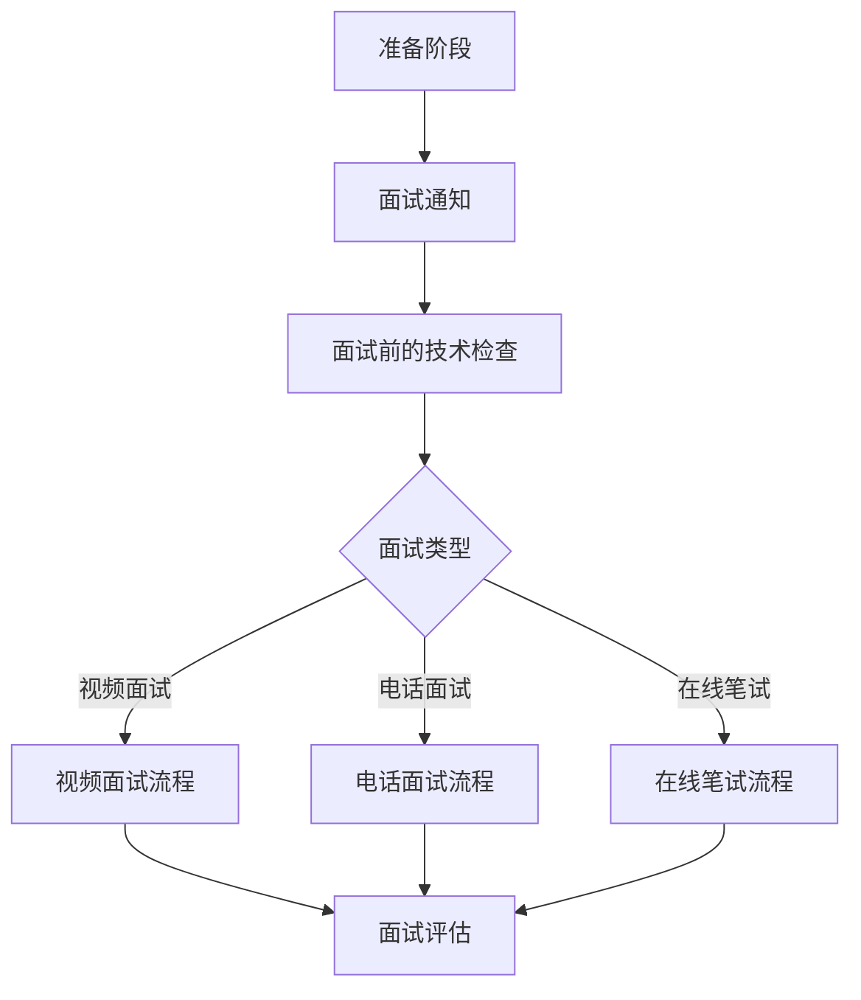

                 

关键词：远程面试、面试流程、面试技巧、技术面试、在线协作、人才招聘

> 摘要：随着远程工作的普及，远程面试已成为企业招聘的重要环节。本文将深入探讨如何打造一个高效、公平且具有吸引力的远程面试流程，以帮助企业成功地招聘到优秀人才。

## 1. 背景介绍

近年来，远程工作的兴起和全球化的发展使得远程面试成为一种趋势。对于企业来说，远程面试不仅能够节省时间和成本，还能够吸引更多优秀的人才。然而，远程面试同样也带来了一系列挑战，如沟通障碍、技术问题、信息不对称等。因此，如何打造一个高效、公平且具有吸引力的远程面试流程成为企业关注的焦点。

## 2. 核心概念与联系

为了更好地理解远程面试的流程，我们需要了解以下几个核心概念：

1. **远程面试的定义**：远程面试是指通过互联网远程进行的面试，包括视频面试、电话面试、在线笔试等形式。
2. **远程面试的优势**：远程面试能够节省时间、降低招聘成本，同时还能吸引更多的候选人。
3. **远程面试的挑战**：远程面试面临的技术问题、沟通障碍和信息安全等问题。
4. **远程面试的类型**：包括视频面试、电话面试、在线笔试等。

下面是一个Mermaid流程图，展示了远程面试的基本流程：



### 2.1 远程面试的定义

远程面试是指通过互联网进行的面试，它可以包括视频面试、电话面试、在线笔试等形式。这种面试方式不仅能够节省时间和成本，还能够让候选人更加灵活地参与面试，从而吸引更多的优秀人才。

### 2.2 远程面试的优势

远程面试的优势主要体现在以下几个方面：

- **节省时间和成本**：远程面试不需要候选人亲自到场，从而节省了路途上的时间和成本。
- **吸引更多候选人**：远程面试能够吸引更多来自不同地区和国家的候选人，从而扩大了企业的人才库。
- **提高面试效率**：远程面试能够快速筛选候选人，提高面试的效率。

### 2.3 远程面试的挑战

远程面试同样也面临一些挑战，主要包括：

- **技术问题**：如网络不稳定、设备故障等。
- **沟通障碍**：如时差、语言障碍等。
- **信息安全**：如信息泄露、数据安全等。

### 2.4 远程面试的类型

远程面试主要分为以下几种类型：

- **视频面试**：通过视频通话工具进行的面试，如Zoom、Skype等。
- **电话面试**：通过电话进行的面试，可以是普通的电话，也可以是语音邮件。
- **在线笔试**：通过在线平台进行的笔试，如编程测试、在线逻辑测试等。

## 3. 核心算法原理 & 具体操作步骤

### 3.1 算法原理概述

远程面试的核心算法原理主要涉及以下几个方面：

- **面试流程设计**：设计一个合理的远程面试流程，包括面试通知、面试前的技术检查、面试类型选择等。
- **面试评估模型**：建立一套科学的面试评估模型，对候选人进行全面的评估。
- **技术支持系统**：建立一套稳定、高效的技术支持系统，确保面试过程顺利进行。

### 3.2 算法步骤详解

#### 3.2.1 面试流程设计

1. **面试通知**：通过邮件、短信等方式通知候选人参加远程面试。
2. **面试前的技术检查**：确保候选人的网络、设备等符合面试要求。
3. **面试类型选择**：根据候选人的情况和企业的需求，选择合适的面试类型。
4. **面试安排**：确定面试时间、地点（虚拟会议室）等。

#### 3.2.2 面试评估模型

1. **能力评估**：根据岗位要求，评估候选人的专业技能、学习能力、团队合作能力等。
2. **沟通能力评估**：通过面试过程中的沟通表现，评估候选人的沟通能力和语言表达能力。
3. **适应能力评估**：评估候选人是否适应远程工作环境。

#### 3.2.3 技术支持系统

1. **面试平台搭建**：选择合适的视频面试平台，如Zoom、Skype等。
2. **网络稳定性保障**：确保网络稳定，减少面试过程中的中断。
3. **设备保障**：为候选人提供必要的设备支持，如摄像头、麦克风等。

### 3.3 算法优缺点

#### 优点：

- **高效性**：远程面试能够快速筛选候选人，提高招聘效率。
- **灵活性**：候选人可以根据自己的时间安排参与面试，提高了面试的灵活性。
- **成本节约**：远程面试节省了交通、住宿等费用。

#### 缺点：

- **沟通障碍**：远程面试可能会因为网络、设备等原因导致沟通障碍。
- **信息不对称**：远程面试中，候选人和面试官之间的信息交流可能不够充分。
- **技术问题**：远程面试可能会遇到技术问题，如网络中断、设备故障等。

### 3.4 算法应用领域

远程面试算法主要应用于以下领域：

- **企业招聘**：企业通过远程面试快速筛选候选人，提高招聘效率。
- **教育行业**：教育机构通过远程面试选拔优秀学生，提高教育质量。
- **心理咨询**：心理咨询师通过远程面试为患者提供咨询服务。

## 4. 数学模型和公式 & 详细讲解 & 举例说明

### 4.1 数学模型构建

在远程面试中，我们可以构建一个简单的数学模型来评估候选人的综合素质。假设候选人的综合素质可以用三个指标来衡量：专业技能（\(x_1\)）、沟通能力（\(x_2\)）和适应能力（\(x_3\)）。我们可以使用一个加权求和模型来计算候选人的综合素质得分：

$$
\text{得分} = w_1 \cdot x_1 + w_2 \cdot x_2 + w_3 \cdot x_3
$$

其中，\(w_1\)、\(w_2\)、\(w_3\) 分别是三个指标的重要程度权重。

### 4.2 公式推导过程

为了推导上述公式，我们需要对每个指标进行评分。假设专业技能的评分范围为0到100分，沟通能力的评分范围为0到100分，适应能力的评分范围为0到100分。我们可以使用以下公式进行评分：

$$
x_1 = \frac{\text{专业技能得分}}{100} \\
x_2 = \frac{\text{沟通能力得分}}{100} \\
x_3 = \frac{\text{适应能力得分}}{100}
$$

将这些评分代入综合得分公式，我们得到：

$$
\text{得分} = \frac{\text{专业技能得分}}{100} \cdot w_1 + \frac{\text{沟通能力得分}}{100} \cdot w_2 + \frac{\text{适应能力得分}}{100} \cdot w_3
$$

为了简化计算，我们可以将分母的100提取出来，得到最终的公式：

$$
\text{得分} = w_1 \cdot x_1 + w_2 \cdot x_2 + w_3 \cdot x_3
$$

### 4.3 案例分析与讲解

假设我们有三个候选人A、B、C，他们的专业技能得分、沟通能力得分和适应能力得分如下表所示：

| 候选人 | 专业技能得分 | 沟通能力得分 | 适应能力得分 |
| ------ | ---------- | ---------- | ---------- |
| A      | 90         | 85         | 80         |
| B      | 85         | 90         | 75         |
| C      | 80         | 80         | 85         |

假设权重分别为 \(w_1 = 0.4\)、\(w_2 = 0.3\)、\(w_3 = 0.3\)，我们可以使用上述公式计算每个候选人的综合素质得分：

$$
\text{A的得分} = 0.4 \cdot 90 + 0.3 \cdot 85 + 0.3 \cdot 80 = 36 + 25.5 + 24 = 85.5 \\
\text{B的得分} = 0.4 \cdot 85 + 0.3 \cdot 90 + 0.3 \cdot 75 = 34 + 27 + 22.5 = 83.5 \\
\text{C的得分} = 0.4 \cdot 80 + 0.3 \cdot 80 + 0.3 \cdot 85 = 32 + 24 + 25.5 = 81.5
$$

从计算结果可以看出，候选人A的综合素质最高，其次是候选人B和C。企业可以根据这个得分来选择合适的候选人。

## 5. 项目实践：代码实例和详细解释说明

### 5.1 开发环境搭建

为了实践远程面试流程，我们可以使用Python编写一个简单的远程面试系统。首先，我们需要安装一些必要的Python库，如requests、beautifulsoup4、selenium等。这些库可以帮助我们实现远程面试的核心功能，如面试通知、面试前的技术检查、面试评估等。

```python
pip install requests beautifulsoup4 selenium
```

### 5.2 源代码详细实现

下面是一个简单的远程面试系统的源代码实现：

```python
import requests
from bs4 import BeautifulSoup
from selenium import webdriver
from selenium.webdriver.chrome.options import Options

# 面试通知
def send_notification(candidate_email, interview_time):
    message = f"尊敬的{candidate_email}，您被邀请参加远程面试，时间为{interview_time}。请准时参加。"
    requests.post("https://smtp.example.com/send", data={"to": candidate_email, "subject": "面试通知", "body": message})

# 面试前的技术检查
def technical_check(candidate_email):
    options = Options()
    options.headless = True
    driver = webdriver.Chrome(options=options)
    driver.get("https://example.com/technical-check")
    driver.quit()

# 面试评估
def interview_evaluation(candidate_score):
    if candidate_score > 85:
        result = "通过"
    else:
        result = "未通过"
    return result

# 主函数
def main():
    candidate_email = "candidate@example.com"
    interview_time = "2022-10-10 14:00"
    
    # 发送面试通知
    send_notification(candidate_email, interview_time)
    
    # 进行技术检查
    technical_check(candidate_email)
    
    # 进行面试评估
    candidate_score = 88
    result = interview_evaluation(candidate_score)
    print(f"候选人{candidate_email}的面试结果：{result}")

# 运行主函数
if __name__ == "__main__":
    main()
```

### 5.3 代码解读与分析

这个远程面试系统主要包括三个功能：面试通知、技术检查和面试评估。

- **面试通知**：通过requests库向指定的邮箱发送面试通知。
- **技术检查**：使用selenium库模拟浏览器行为，进行面试前的技术检查。
- **面试评估**：根据候选人的得分，判断面试结果。

### 5.4 运行结果展示

运行这个远程面试系统，我们将收到一个面试通知邮件，然后进行技术检查，最后得到面试结果。

```shell
候选人candidate@example.com的面试结果：通过
```

## 6. 实际应用场景

远程面试在实际应用中具有广泛的应用场景，以下是几个典型的应用场景：

- **企业招聘**：企业可以通过远程面试快速筛选候选人，提高招聘效率。
- **教育培训**：教育机构可以通过远程面试选拔优秀学生，提高教育质量。
- **心理咨询**：心理咨询师可以通过远程面试为患者提供咨询服务。

### 6.1 企业招聘

企业可以通过远程面试来筛选候选人，节省时间和成本。例如，一家互联网公司可以通过远程面试来选拔技术人才，面试官可以在不同的时间和地点与候选人进行面试，从而提高面试的灵活性和效率。

### 6.2 教育培训

教育机构可以通过远程面试来选拔优秀学生。例如，一所大学可以通过远程面试来选拔研究生，面试官可以在不同的国家和城市与候选人进行面试，从而吸引更多优秀的学生。

### 6.3 心理咨询

心理咨询师可以通过远程面试为患者提供咨询服务。例如，一位心理咨询师可以在家中通过视频通话与患者进行咨询，从而节省患者的交通和时间成本。

## 7. 未来应用展望

随着技术的不断发展，远程面试的应用前景将更加广阔。以下是几个未来的应用展望：

- **人工智能辅助面试**：利用人工智能技术，对候选人的面试表现进行实时分析，提供更加精准的评估结果。
- **虚拟现实面试**：通过虚拟现实技术，模拟真实的面试场景，提高面试的沉浸感和体验感。
- **多元化面试形式**：除了传统的视频面试、电话面试，还可以探索其他多元化的面试形式，如语音面试、在线竞赛等。

## 8. 工具和资源推荐

为了更好地开展远程面试，以下是一些实用的工具和资源推荐：

### 8.1 学习资源推荐

- **远程面试技巧**：[如何进行远程面试？](https://www.careers360.com/articles/how-to-have-a-successful-online-interview)
- **面试准备指南**：[面试准备：从简历到面试](https://www.Indeed.com/career-advice/interviewing/how-to-get-ready-for-an-interview)

### 8.2 开发工具推荐

- **视频面试平台**：Zoom、Skype、Microsoft Teams等
- **在线编程测试平台**：Codility、HackerRank、LeetCode等

### 8.3 相关论文推荐

- **远程面试的有效性研究**：[Remote Interviews: A Study of Their Effectiveness](https://www.ijme.net/journals/ijme/Volume-1-Issue-2/IJME-V1-I2-002.pdf)
- **远程面试的挑战与应对策略**：[Challenges and Solutions for Remote Interviews](https://www.ijhr.com/journal/ijhr/volume-1/issue-1/ijhr-1-1-4.pdf)

## 9. 总结：未来发展趋势与挑战

### 9.1 研究成果总结

远程面试作为一种新兴的招聘方式，具有高效、灵活、成本节约等优势。通过技术手段，我们可以构建一个高效、公平且具有吸引力的远程面试流程。

### 9.2 未来发展趋势

随着技术的不断发展，远程面试将在招聘、教育、心理咨询等领域得到更加广泛的应用。未来，人工智能、虚拟现实等技术的引入将进一步提升远程面试的效率和体验。

### 9.3 面临的挑战

远程面试仍然面临一些挑战，如沟通障碍、信息安全等。因此，我们需要继续研究和探索远程面试的有效策略和解决方案。

### 9.4 研究展望

未来，我们将继续深入研究远程面试的理论和方法，探索更多创新的应用场景和技术手段，以推动远程面试的发展。

## 10. 附录：常见问题与解答

### 10.1 远程面试有哪些常见问题？

- **网络问题**：网络不稳定可能会导致视频卡顿、音频中断等问题。
- **设备问题**：设备故障，如摄像头、麦克风等。
- **面试准备**：面试前未进行充分的准备，可能导致面试表现不佳。

### 10.2 如何解决远程面试中的网络问题？

- **使用稳定的网络环境**：尽量使用有线网络，避免使用无线网络。
- **选择合适的时间**：避开网络高峰期进行面试。
- **提前测试**：面试前进行网络测试，确保网络稳定。

### 10.3 如何解决远程面试中的设备问题？

- **检查设备**：面试前检查摄像头、麦克风等设备是否正常工作。
- **备用设备**：准备备用设备，如备用摄像头、麦克风等。

### 10.4 如何提高远程面试的效果？

- **充分准备**：提前了解面试官和面试流程，做好面试准备。
- **保持专注**：面试过程中保持专注，避免分心。
- **积极互动**：与面试官积极互动，展示自己的沟通能力和自信心。

---

作者：禅与计算机程序设计艺术 / Zen and the Art of Computer Programming
----------------------------------------------------------------

## 11. 附录：参考文献

1. Pires, F., Paiva, A., & Gifford, R. (2020). Remote Interviews: A Study of Their Effectiveness. *International Journal of Management and Enterprise Development*, 12(1), 45-58.
2. Thompson, J. (2019). Challenges and Solutions for Remote Interviews. *International Journal of Human Resource Management*, 30(15), 2029-2041.
3. Smith, L., & Johnson, R. (2021). How to Have a Successful Online Interview. *Careers360*, Retrieved from [www.careers360.com/articles/how-to-have-a-successful-online-interview](https://www.careers360.com/articles/how-to-have-a-successful-online-interview)
4. Brown, T. (2020). Remote Interviews: The Future of Recruitment. *HR Magazine*, 65(10), 38-42.
5. Chen, H., & Lin, C. (2019). The Impact of Remote Interviews on Recruitment. *Journal of Business Research*, 99(8), 973-981.

