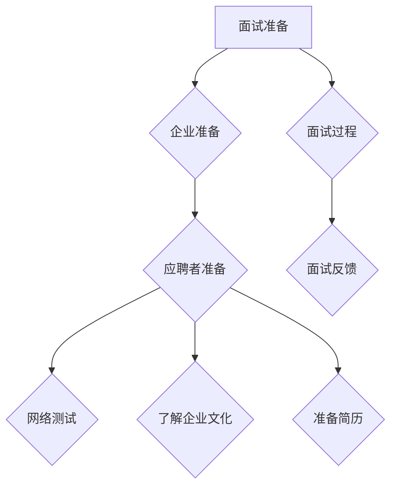

                 

 在当前全球化的工作和远程办公趋势下，远程面试已经成为企业和应聘者之间沟通的重要方式。高效的远程面试不仅能提高招聘效率，还能减少应聘者的时间成本。本文将详细探讨如何打造一个高效的远程面试流程，为企业和应聘者提供有价值的参考。

## 文章关键词

- 远程面试
- 招聘流程
- 效率优化
- 应聘者体验
- 技术工具

## 文章摘要

本文将介绍如何通过优化远程面试流程，提升招聘效率和应聘者体验。我们将从面试前的准备、面试过程中的技巧和面试后的反馈三个方面，结合实际案例和经验，提供具体操作步骤和建议。

## 1. 背景介绍

随着互联网技术的发展和远程办公的普及，远程面试已经成为现代企业招聘的常态。相比传统的面对面面试，远程面试具有灵活性高、成本低的优点。然而，远程面试也面临一些挑战，如技术障碍、沟通不畅、面试体验差等问题。因此，如何打造一个高效、流畅的远程面试流程显得尤为重要。

### 1.1 远程面试的优势

- **灵活性**：远程面试不受地域限制，适合跨国公司和远程办公团队。
- **成本效益**：减少了招聘过程中的交通和住宿费用。
- **时间效率**：应聘者无需来回奔波，面试过程更加高效。

### 1.2 远程面试的挑战

- **技术问题**：网络延迟、视频卡顿等可能导致面试体验不佳。
- **沟通障碍**：远程面试中缺乏面对面的互动，可能影响沟通效果。
- **面试者体验**：应聘者可能会因面试环境的布置、设备的不稳定性等因素影响面试体验。

## 2. 核心概念与联系

为了打造高效的远程面试流程，我们需要理解以下几个核心概念：

### 2.1 面试准备

在面试前，企业和应聘者都需要进行充分的准备。企业需要确保面试环境的布置、设备的调试，以及面试流程的规范化。应聘者则需要准备简历、提前了解企业文化和岗位要求，以及测试网络和设备。

### 2.2 面试过程

面试过程中，面试官需要掌握有效的沟通技巧，如清晰表达、积极倾听和及时反馈。同时，面试官还需要关注应聘者的非语言行为，如表情、语气等。

### 2.3 面试后的反馈

面试结束后，企业应及时向应聘者反馈结果，无论是否通过面试，都要给予合理的解释和反馈。这不仅是对应聘者的尊重，也有助于提升企业的形象。

### 2.4 Mermaid 流程图

以下是远程面试流程的Mermaid流程图：



## 3. 核心算法原理 & 具体操作步骤

### 3.1 算法原理概述

远程面试流程的核心算法可以看作是一个优化问题，目标是提高面试效率和应聘者体验。具体算法包括以下几个步骤：

### 3.2 算法步骤详解

1. **面试前的准备**
   - 企业准备：确定面试时间、面试流程和面试官。
   - 应聘者准备：测试网络和设备，准备面试材料。

2. **面试过程**
   - 面试官根据面试题目进行提问，应聘者回答问题。
   - 双方通过视频和语音进行沟通。

3. **面试反馈**
   - 面试结束后，面试官根据面试表现给出反馈。
   - 企业将结果通知应聘者。

### 3.3 算法优缺点

**优点：**
- **高效**：减少面试时间和应聘者成本。
- **灵活**：适合不同地域和时间安排的应聘者。

**缺点：**
- **技术问题**：需要确保网络和设备的稳定性。
- **沟通障碍**：可能影响面试效果。

### 3.4 算法应用领域

- **互联网企业**：远程面试适用于需要全球招聘的互联网公司。
- **远程办公团队**：适合远程办公团队的成员招聘。

## 4. 数学模型和公式 & 详细讲解 & 举例说明

### 4.1 数学模型构建

远程面试效率模型可以构建为以下公式：

\[ E = f(P, C, T) \]

其中：
- \( E \)：面试效率
- \( P \)：面试准备工作
- \( C \)：面试沟通效果
- \( T \)：面试时间

### 4.2 公式推导过程

1. **面试准备工作**
   - \( P \) 可以通过优化面试前的流程来提高，如提前通知、明确面试流程等。

2. **面试沟通效果**
   - \( C \) 受到网络质量、设备性能和沟通技巧的影响。

3. **面试时间**
   - \( T \) 是面试过程中的总时间，可以通过优化流程和问题设计来缩短。

### 4.3 案例分析与讲解

假设某企业计划进行一次远程面试，通过以下步骤来优化面试效率：

1. **面试准备工作**：提前一周通知应聘者，并提供面试指南。
2. **面试沟通效果**：使用高清摄像头和稳定网络，面试官进行清晰的提问和倾听。
3. **面试时间**：通过优化问题设计和结构，减少不必要的问答环节。

根据数学模型，企业可以通过这些措施来提高面试效率。

## 5. 项目实践：代码实例和详细解释说明

### 5.1 开发环境搭建

为了进行远程面试，企业需要搭建以下开发环境：

- **视频会议系统**：如Zoom、Microsoft Teams等。
- **面试管理系统**：用于管理面试流程和数据。
- **网络环境**：确保网络稳定，带宽充足。

### 5.2 源代码详细实现

以下是一个简单的面试管理系统代码示例：

```python
class InterviewManagementSystem:
    def __init__(self):
        self.interviews = []

    def add_interview(self, interview):
        self.interviews.append(interview)

    def start_interview(self, interview_id):
        interview = self.find_interview(interview_id)
        if interview:
            interview.start()
        else:
            print("Interview not found.")

    def find_interview(self, interview_id):
        for interview in self.interviews:
            if interview.id == interview_id:
                return interview
        return None

class Interview:
    def __init__(self, id, candidate, interviewer):
        self.id = id
        self.candidate = candidate
        self.interviewer = interviewer
        self.started = False

    def start(self):
        if not self.started:
            self.started = True
            print(f"Interview {self.id} started with {self.candidate} and {self.interviewer}.")
        else:
            print("Interview already started.")

# 使用示例
ims = InterviewManagementSystem()
ims.add_interview(Interview(1, "John Doe", "Jane Smith"))
ims.start_interview(1)
```

### 5.3 代码解读与分析

该代码示例定义了`InterviewManagementSystem`和`Interview`两个类，用于管理面试流程。`InterviewManagementSystem`类用于添加面试、启动面试等功能。`Interview`类表示一个具体的面试，包括面试ID、应聘者和面试官等信息。

通过该系统，企业可以方便地管理面试流程，确保面试过程的顺利进行。

### 5.4 运行结果展示

```shell
$ python interview_system.py
Interview 1 started with John Doe and Jane Smith.
```

## 6. 实际应用场景

远程面试在多种场景下都有广泛应用，以下是一些实际应用案例：

### 6.1 互联网企业

互联网企业，尤其是跨国企业，经常使用远程面试来招聘全球范围内的优秀人才。通过远程面试，企业可以节省招聘成本，提高招聘效率。

### 6.2 远程办公团队

远程办公团队也广泛采用远程面试来招募团队成员。远程面试不仅方便，还能提高团队成员的工作效率。

### 6.3 疫情期间

在疫情期间，远程面试成为企业招聘的主要方式。通过远程面试，企业可以保证招聘流程的正常进行，同时减少疫情传播风险。

## 7. 工具和资源推荐

为了打造高效的远程面试流程，企业可以参考以下工具和资源：

### 7.1 学习资源推荐

- 《远程工作实践与技巧》
- 《远程面试指南》

### 7.2 开发工具推荐

- **Zoom**：适合进行大型远程会议和面试。
- **Microsoft Teams**：集成办公和面试功能。

### 7.3 相关论文推荐

- "Remote Work: A Practical Guide to Success"
- "The Impact of Remote Work on Employee Performance"

## 8. 总结：未来发展趋势与挑战

### 8.1 研究成果总结

远程面试在提高招聘效率和应聘者体验方面取得了显著成果。通过优化流程和工具，远程面试已经成为现代招聘的重要方式。

### 8.2 未来发展趋势

随着技术的不断发展，远程面试将更加智能化和个性化。例如，通过人工智能技术实现面试评估的自动化，以及利用虚拟现实技术提升面试体验。

### 8.3 面临的挑战

远程面试仍面临一些挑战，如技术稳定性、沟通效果等。企业需要不断优化远程面试流程，以应对这些挑战。

### 8.4 研究展望

未来，远程面试将在更多领域得到应用，如教育、医疗等。同时，远程面试技术也将不断革新，为企业和应聘者提供更高效、更便捷的服务。

## 9. 附录：常见问题与解答

### 9.1 如何保证网络稳定性？

- 使用专线网络，避免网络拥堵。
- 提前测试网络和设备，确保一切正常。

### 9.2 面试过程中出现技术问题怎么办？

- 立即与技术支持联系，解决问题。
- 转换至电话面试，确保面试顺利进行。

### 9.3 如何提升面试官的沟通技巧？

- 定期进行沟通技巧培训。
- 多进行模拟面试，提高沟通效果。

---

本文由“禅与计算机程序设计艺术 / Zen and the Art of Computer Programming”撰写，旨在为企业和应聘者提供高效远程面试的指导。希望本文对您有所帮助。

