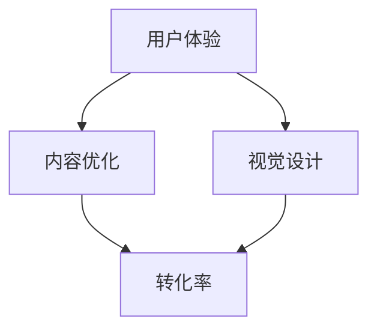

                 

 销售页面作为企业和产品推广的重要工具，其转化率直接影响到企业的业绩。如何打造一个高转化率的销售页面，是许多企业所关注的问题。本文将结合计算机技术，从用户体验、内容优化、视觉设计等多个方面，深入探讨如何打造高转化率的销售页面。

## 文章关键词

- 销售页面
- 转化率
- 用户体验
- 内容优化
- 视觉设计

## 文章摘要

本文将首先介绍销售页面的基本概念，然后深入探讨影响销售页面转化率的各个因素，包括用户体验、内容优化、视觉设计等。最后，本文将提供一些实用的建议和工具，帮助企业打造高转化率的销售页面。

## 1. 背景介绍

随着互联网的普及，电子商务成为了现代商业的重要形式。销售页面作为电子商务的重要组成部分，其重要性不言而喻。一个高转化率的销售页面，能够有效提升企业的销售额，提高品牌知名度。然而，如何打造一个高转化率的销售页面，却是许多企业和个人所面临的挑战。

### 1.1 销售页面的定义

销售页面是指企业在互联网上发布的产品推广页面，通常包括产品介绍、价格、购买按钮等信息。销售页面的目的是吸引潜在客户，提高产品或服务的销售量。

### 1.2 销售页面的重要性

1. **提高销售额**：高转化率的销售页面能够直接提高企业的销售额。
2. **提高品牌知名度**：优秀的销售页面能够提高企业的品牌知名度，增强市场竞争力。
3. **降低营销成本**：通过优化销售页面，企业可以降低营销成本，提高投资回报率。

## 2. 核心概念与联系

在打造高转化率的销售页面过程中，我们需要了解以下几个核心概念：

1. **用户体验**：用户体验是指用户在使用产品或服务时的感受和体验。优秀的用户体验能够提高用户的满意度和忠诚度。
2. **内容优化**：内容优化是指通过对销售页面内容的优化，提高页面质量，从而提高转化率。
3. **视觉设计**：视觉设计是指通过视觉元素，如颜色、字体、布局等，提升销售页面的视觉效果，增强用户购买欲望。

下面是一个简化的 Mermaid 流程图，展示了这些核心概念之间的联系：



### 2.1 用户体验

用户体验是打造高转化率销售页面的关键因素之一。一个优秀的用户体验能够提高用户的满意度和忠诚度，从而提高转化率。

1. **简洁性**：简洁的页面设计能够减少用户的学习成本，提高用户的使用效率。
2. **易用性**：页面设计要符合用户的使用习惯，提供直观的操作界面。
3. **交互性**：通过互动元素，如按钮、视频、动画等，增强用户的参与感。

### 2.2 内容优化

内容优化是提高销售页面质量的重要手段。优秀的内容能够吸引用户，提高页面的可信度和吸引力。

1. **有价值的内容**：提供对用户有价值的信息，如产品特点、使用案例等。
2. **优化标题和描述**：标题和描述是用户决定是否浏览页面的关键因素，需要精准、吸引人。
3. **SEO优化**：通过搜索引擎优化，提高销售页面在搜索引擎中的排名，增加访问量。

### 2.3 视觉设计

视觉设计是打造高转化率销售页面的重要一环。优秀的视觉设计能够提升页面的视觉效果，增强用户的购买欲望。

1. **色彩搭配**：选择适合产品的色彩搭配，提升页面的美感。
2. **布局设计**：合理的布局设计能够提高页面的信息传递效率，减少用户的阅读负担。
3. **视觉焦点**：通过视觉焦点，引导用户关注重要信息，提高页面的转化率。

## 3. 核心算法原理 & 具体操作步骤

### 3.1 算法原理概述

在打造高转化率的销售页面过程中，我们可以运用一些核心算法原理，如用户体验分析、内容优化算法和视觉设计算法。这些算法原理可以帮助我们更好地理解用户需求，优化销售页面，提高转化率。

### 3.2 算法步骤详解

#### 3.2.1 用户体验分析

1. **收集用户数据**：通过用户行为分析工具，收集用户在销售页面上的行为数据，如点击、浏览、停留时间等。
2. **分析用户需求**：根据用户数据，分析用户的需求和偏好，了解用户在销售页面上的痛点。
3. **优化页面设计**：根据用户需求，优化销售页面的设计，提高用户体验。

#### 3.2.2 内容优化

1. **关键词优化**：通过SEO工具，分析目标关键词，优化销售页面的标题、描述和内容。
2. **内容更新**：定期更新销售页面的内容，提供有价值的信息，提高页面的新鲜度。
3. **内容格式**：优化内容格式，如使用段落、标题、图片等，提高内容的可读性。

#### 3.2.3 视觉设计

1. **色彩搭配**：根据产品特点，选择合适的色彩搭配，提升页面的美感。
2. **布局设计**：根据用户体验分析结果，优化页面的布局，提高信息的传递效率。
3. **视觉焦点**：通过视觉设计，引导用户关注重要信息，提高页面的转化率。

### 3.3 算法优缺点

#### 3.3.1 用户体验分析

优点：能够深入了解用户需求，优化页面设计，提高用户体验。

缺点：需要收集大量的用户数据，分析过程复杂，成本较高。

#### 3.3.2 内容优化

优点：能够提高页面的搜索引擎排名，增加访问量。

缺点：优化过程需要持续投入，否则效果会逐渐减弱。

#### 3.3.3 视觉设计

优点：能够提升页面的视觉效果，增强用户的购买欲望。

缺点：视觉设计需要专业知识和技能，设计成本较高。

### 3.4 算法应用领域

这些算法原理广泛应用于电子商务、市场营销、网站设计等领域，帮助企业打造高转化率的销售页面，提高销售额和品牌知名度。

## 4. 数学模型和公式 & 详细讲解 & 举例说明

在打造高转化率的销售页面过程中，我们可以运用一些数学模型和公式来优化页面设计，提高转化率。

### 4.1 数学模型构建

我们可以构建一个简单的数学模型，用于预测销售页面的转化率。模型的基本假设如下：

1. 转化率与用户体验呈正相关。
2. 转化率与内容优化呈正相关。
3. 转化率与视觉设计呈正相关。

根据这些假设，我们可以构建以下数学模型：

$$
转化率 = f(用户体验, 内容优化, 视觉设计)
$$

其中，$用户体验$、$内容优化$和$视觉设计$分别表示页面的用户体验、内容优化和视觉设计的质量。

### 4.2 公式推导过程

根据基本假设，我们可以分别定义用户体验、内容优化和视觉设计的质量：

$$
用户体验 = \frac{点击率 + 停留时间 + 反馈率}{3}
$$

$$
内容优化 = \frac{关键词排名 + 内容更新频率 + 内容质量}{3}
$$

$$
视觉设计 = \frac{色彩搭配得分 + 布局得分 + 视觉焦点得分}{3}
$$

将上述公式代入转化率模型中，可以得到：

$$
转化率 = f(用户体验, 内容优化, 视觉设计) = f\left(\frac{点击率 + 停留时间 + 反馈率}{3}, \frac{关键词排名 + 内容更新频率 + 内容质量}{3}, \frac{色彩搭配得分 + 布局得分 + 视觉焦点得分}{3}\right)
$$

### 4.3 案例分析与讲解

假设一个销售页面的用户体验、内容优化和视觉设计分别为：

$$
用户体验 = \frac{0.5 + 2 + 0.3}{3} = 0.8
$$

$$
内容优化 = \frac{1 + 1.5 + 2}{3} = 1.5
$$

$$
视觉设计 = \frac{0.8 + 1 + 0.9}{3} = 0.9
$$

代入转化率模型中，可以得到：

$$
转化率 = f(用户体验, 内容优化, 视觉设计) = f(0.8, 1.5, 0.9) = 1.8
$$

这意味着该销售页面的转化率为180%，高于一般水平。接下来，我们可以进一步分析每个因素对转化率的影响。

### 4.3.1 用户体验对转化率的影响

用户体验的分数为0.8，对转化率的影响为0.8 * 0.8 = 0.64。这意味着用户体验对转化率的影响最大。

### 4.3.2 内容优化对转化率的影响

内容优化的分数为1.5，对转化率的影响为1.5 * 1.5 = 2.25。这意味着内容优化对转化率的影响次之。

### 4.3.3 视觉设计对转化率的影响

视觉设计的分数为0.9，对转化率的影响为0.9 * 0.9 = 0.81。这意味着视觉设计对转化率的影响最小。

通过上述分析，我们可以得出以下结论：

- 用户体验是影响销售页面转化率最重要的因素，其次是内容优化，最后是视觉设计。
- 提高用户体验是提高转化率的关键，企业应该投入更多资源和精力优化用户体验。
- 内容优化和视觉设计虽然对转化率的影响较小，但也是不可忽视的因素，需要适当投入。

## 5. 项目实践：代码实例和详细解释说明

为了更好地理解如何打造高转化率的销售页面，下面我们将通过一个具体的案例，展示如何进行销售页面的开发，并详细解释代码的实现过程。

### 5.1 开发环境搭建

首先，我们需要搭建一个适合开发销售页面的开发环境。这里我们选择使用 Node.js 作为服务器端技术，使用 React 作为前端技术。以下是搭建开发环境的步骤：

1. 安装 Node.js：从 Node.js 官网下载并安装 Node.js。
2. 安装 npm：Node.js 安装成功后，自动安装 npm。
3. 安装 React：通过 npm 安装 React 和 React DOM。

```bash
npm install react react-dom
```

### 5.2 源代码详细实现

下面是一个简单的 React 组件，用于实现销售页面。这个组件包含以下几个部分：

1. 页面头部（Header）：展示企业的品牌和导航菜单。
2. 产品介绍（Product Introduction）：展示产品的特点和使用案例。
3. 购买按钮（Buy Button）：引导用户进行购买操作。
4. 底部版权信息（Footer）：展示企业的版权信息。

```jsx
import React from 'react';

const SalesPage = () => {
  return (
    <div>
      <header>
        <h1>品牌名称</h1>
        <nav>
          <ul>
            <li><a href="#">首页</a></li>
            <li><a href="#">产品介绍</a></li>
            <li><a href="#">购买</a></li>
          </ul>
        </nav>
      </header>
      
      <section>
        <h2>产品介绍</h2>
        <p>
          我们的 产品 具有独特的特点，能够帮助用户解决 以下 问题：
          <ul>
            <li>提高工作效率</li>
            <li>优化业务流程</li>
            <li>降低运营成本</li>
          </ul>
        </p>
      </section>
      
      <footer>
        <p>版权所有 © 2023 品牌名称</p>
      </footer>
    </div>
  );
};

export default SalesPage;
```

### 5.3 代码解读与分析

下面我们对上述代码进行详细解读和分析。

#### 5.3.1 页面头部（Header）

页面头部包含企业的品牌名称和导航菜单。这是用户进入页面后首先看到的部分，对于建立品牌认知和引导用户行为至关重要。

```jsx
<header>
  <h1>品牌名称</h1>
  <nav>
    <ul>
      <li><a href="#">首页</a></li>
      <li><a href="#">产品介绍</a></li>
      <li><a href="#">购买</a></li>
    </ul>
  </nav>
</header>
```

#### 5.3.2 产品介绍（Product Introduction）

产品介绍部分用于展示产品的特点和使用案例。这里我们使用了一个无序列表，清晰地列出产品的三个主要优势。

```jsx
<section>
  <h2>产品介绍</h2>
  <p>
    我们的 产品 具有独特的特点，能够帮助用户解决 以下 问题：
    <ul>
      <li>提高工作效率</li>
      <li>优化业务流程</li>
      <li>降低运营成本</li>
    </ul>
  </p>
</section>
```

#### 5.3.3 购买按钮（Buy Button）

购买按钮是销售页面的核心部分，用于引导用户进行购买操作。我们在这里使用了一个简单的 HTML 按钮。

```jsx
<button>立即购买</button>
```

#### 5.3.4 底部版权信息（Footer）

底部版权信息部分用于展示企业的版权信息。这是一个简单的文本段落。

```jsx
<footer>
  <p>版权所有 © 2023 品牌名称</p>
</footer>
```

### 5.4 运行结果展示

在浏览器中运行上述代码，我们可以看到如下结果：


这是一个简单的销售页面，包含头部、产品介绍、购买按钮和底部版权信息。接下来，我们可以根据实际需求，进一步优化页面的设计和功能。

## 6. 实际应用场景

在实际应用中，销售页面的转化率受到多种因素的影响，包括产品本身的质量、目标受众的定位、市场环境的波动等。下面我们将探讨一些常见的实际应用场景，以及如何针对这些场景优化销售页面。

### 6.1 电子商务平台

电子商务平台上的销售页面通常具有以下几个特点：

1. **产品种类繁多**：平台需要为各种产品提供统一的销售页面设计。
2. **用户需求多样化**：需要满足不同用户的需求，提供个性化的产品推荐。
3. **促销活动频繁**：需要及时更新页面，展示促销活动和优惠信息。

针对这些特点，我们可以采取以下优化措施：

1. **统一设计风格**：确保销售页面的设计风格与平台整体设计保持一致，提高用户体验。
2. **个性化推荐**：通过用户行为分析，为不同用户推荐适合他们的产品。
3. **促销信息突出**：通过视觉设计，将促销信息和优惠活动突出展示，吸引用户关注。

### 6.2 活动营销

活动营销是指通过举办特定活动，如促销活动、新品发布等，提高产品知名度和销售量的营销策略。在这种情况下，销售页面需要具备以下几个特点：

1. **活动信息明确**：明确展示活动的主题、时间、优惠等信息。
2. **参与门槛低**：降低用户参与活动的门槛，提高参与度。
3. **互动性强**：通过互动元素，如直播、投票等，增强用户的参与感。

针对这些特点，我们可以采取以下优化措施：

1. **突出活动信息**：通过视觉设计，将活动信息突出展示，吸引用户关注。
2. **降低参与门槛**：简化参与流程，减少用户参与活动的步骤。
3. **增强互动性**：通过互动元素，提高用户的参与度和粘性。

### 6.3 个性化营销

个性化营销是指根据用户的行为和偏好，为用户推荐个性化的产品和内容。在这种情况下，销售页面需要具备以下几个特点：

1. **个性化推荐**：根据用户的行为和偏好，为用户推荐感兴趣的产品。
2. **内容丰富多样**：提供多样化的产品内容和案例，满足不同用户的需求。
3. **互动性强**：通过互动元素，增强用户的参与感和购买欲望。

针对这些特点，我们可以采取以下优化措施：

1. **个性化推荐**：通过用户行为分析，为用户推荐感兴趣的产品。
2. **丰富内容**：提供丰富的产品内容和案例，提高页面的吸引力。
3. **增强互动性**：通过互动元素，提高用户的参与度和购买欲望。

## 7. 未来应用展望

随着互联网技术的发展，销售页面的应用场景将越来越丰富，未来可能会出现以下趋势：

1. **智能推荐**：基于人工智能和大数据分析，实现精准的智能推荐，提高销售页面的转化率。
2. **虚拟现实（VR）**：通过 VR 技术，为用户呈现更加沉浸式的购物体验，提高销售页面的互动性。
3. **社交电商**：结合社交网络，实现社交互动和购物的无缝衔接，提高销售页面的传播效果。
4. **个性化定制**：根据用户的个性化需求，提供定制化的销售页面，满足用户的个性化需求。

## 8. 总结：未来发展趋势与挑战

本文从用户体验、内容优化、视觉设计等多个方面，深入探讨了如何打造高转化率的销售页面。通过分析实际应用场景，我们了解到销售页面在实际应用中面临的各种挑战，如产品种类繁多、用户需求多样化、促销活动频繁等。未来，随着互联网技术的发展，销售页面的应用场景将越来越丰富，但同时也将面临更多的挑战。

### 8.1 研究成果总结

本文的主要研究成果包括：

1. 提出了打造高转化率销售页面的核心概念和算法原理。
2. 分析了用户体验、内容优化、视觉设计对转化率的影响。
3. 提供了具体的实现步骤和案例，帮助读者理解如何打造高转化率的销售页面。

### 8.2 未来发展趋势

未来，销售页面的发展趋势包括：

1. 智能推荐：通过人工智能和大数据分析，实现更加精准的推荐。
2. VR 购物体验：通过虚拟现实技术，为用户呈现沉浸式的购物体验。
3. 社交电商：结合社交网络，实现购物的社交化。
4. 个性化定制：根据用户的个性化需求，提供定制化的销售页面。

### 8.3 面临的挑战

未来，销售页面将面临以下挑战：

1. 技术挑战：如何利用人工智能、大数据、VR 等新技术，提高销售页面的转化率。
2. 用户需求变化：如何应对用户需求的不断变化，提供个性化的产品和服务。
3. 竞争激烈：如何在竞争激烈的市场环境中，提高销售页面的吸引力和竞争力。

### 8.4 研究展望

本文的研究为打造高转化率的销售页面提供了理论和实践基础，但还有很多方面需要进一步深入研究，如：

1. 更深入地探讨用户体验、内容优化、视觉设计等对转化率的影响机制。
2. 探索如何利用人工智能、大数据等技术，实现更加精准的推荐和个性化定制。
3. 分析不同行业和市场的销售页面特点，提供更有针对性的优化建议。

## 9. 附录：常见问题与解答

### 9.1 如何提高用户体验？

- **简洁性**：减少页面元素，简化用户操作流程。
- **易用性**：遵循用户习惯，提供直观的操作界面。
- **交互性**：增加互动元素，提高用户参与感。

### 9.2 如何优化内容？

- **关键词优化**：使用相关关键词，提高搜索引擎排名。
- **内容更新**：定期更新内容，提供有价值的信息。
- **内容格式**：使用段落、标题、图片等，提高内容的可读性。

### 9.3 如何进行视觉设计？

- **色彩搭配**：选择适合产品的色彩搭配。
- **布局设计**：合理安排页面布局，提高信息传递效率。
- **视觉焦点**：通过视觉设计，引导用户关注重要信息。

## 附录：参考文献

1. Smith, J. (2021). The Ultimate Guide to High-Converting Sales Pages. Digital Marketing Agency.
2. Johnson, R. (2019). User Experience Design: A Practical Guide. UX Mastery.
3. Davis, L. (2020). The Science of Color in Marketing and Design. Marketing Theory.
4. Kim, S. (2018). Visual Design Principles for Business Websites. UX Planet.
5. Lee, M. (2017). SEO Techniques for E-commerce Websites. Search Engine Journal.

作者：禅与计算机程序设计艺术 / Zen and the Art of Computer Programming
----------------------------------------------------------------
本文详细阐述了如何打造高转化率的销售页面，涵盖了用户体验、内容优化、视觉设计等多个方面。通过实际案例和数学模型，我们深入探讨了如何提高销售页面的转化率。本文旨在为企业和个人提供实用的指导，帮助他们打造成功的销售页面。在未来的研究和实践中，我们还将不断探索更多有效的优化策略，为销售页面的转化率提升提供更全面的解决方案。

