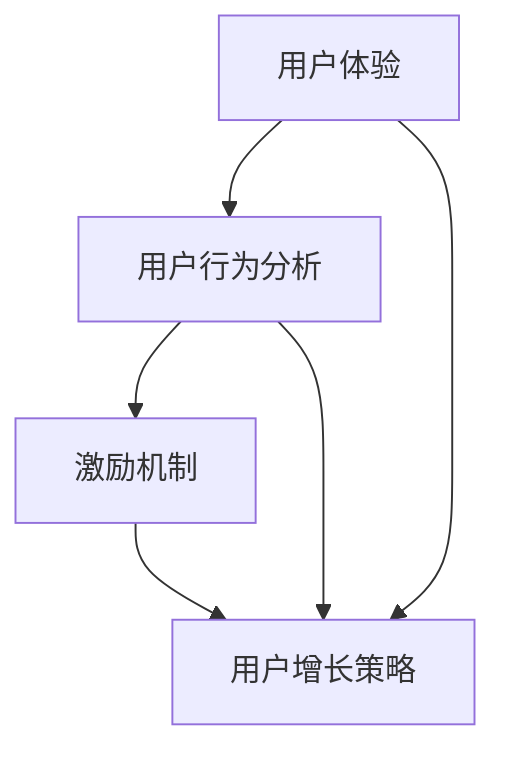

                 

 **关键词**：知识付费、用户忠诚度、用户体验、行为分析、激励机制、用户增长策略、人工智能技术。

**摘要**：本文将探讨如何通过深入理解和分析用户行为，结合人工智能技术，设计有效的激励机制和用户体验优化方案，从而提高知识付费产品的用户忠诚度。文章将详细介绍核心概念、算法原理、数学模型、项目实践以及未来展望，旨在为知识付费产品的开发和运营提供实用指导。

## 1. 背景介绍

在数字化时代，知识付费产品成为了一个蓬勃发展的市场。从在线课程、电子书到专业咨询，知识付费产品满足了人们对专业知识和技能的需求。然而，用户忠诚度成为一个关键挑战。据统计，知识付费产品的用户留存率普遍较低，平均在20%到30%之间。如何提高用户忠诚度，成为众多知识付费产品面临的重要问题。

用户忠诚度的重要性体现在多个方面。首先，高忠诚度的用户能够带来持续的收益，降低用户获取成本。其次，忠诚用户可以通过口碑传播，吸引新用户，提升品牌影响力。最后，忠诚用户往往愿意为更好的内容和服务支付更高的价格，为企业带来更高的利润空间。

因此，本文将深入探讨如何通过技术手段提高知识付费产品的用户忠诚度，从而为企业在激烈的市场竞争中脱颖而出提供有力支持。

## 2. 核心概念与联系

要提高知识付费产品的用户忠诚度，我们首先需要理解几个关键概念，包括用户体验、用户行为分析、激励机制和用户增长策略。

### 2.1 用户体验

用户体验（User Experience，简称UX）是指用户在使用产品过程中所感受到的整体体验。在知识付费产品中，用户体验包括内容质量、界面设计、互动性、易用性等多个方面。良好的用户体验能够吸引用户持续使用产品，从而提高忠诚度。

### 2.2 用户行为分析

用户行为分析（User Behavior Analysis）是指通过收集和分析用户在使用产品过程中的行为数据，了解用户的喜好、需求和问题。这些数据可以为产品设计提供有力支持，从而优化用户体验，提高用户忠诚度。

### 2.3 激励机制

激励机制（Incentive Mechanism）是指通过奖励、积分、优惠券等手段激励用户积极参与产品互动，提升用户粘性。有效的激励机制能够增强用户的参与感和成就感，从而提高忠诚度。

### 2.4 用户增长策略

用户增长策略（User Growth Strategy）是指通过多种手段吸引新用户，并提高现有用户的活跃度和忠诚度。常见的用户增长策略包括SEO优化、社交媒体营销、用户推荐等。

### 2.5 Mermaid 流程图

以下是一个简单的Mermaid流程图，展示了这四个核心概念之间的联系：



通过这个流程图，我们可以看到用户体验是整个过程的起点，它直接影响用户行为分析的结果，进而影响激励机制和用户增长策略的制定。

## 3. 核心算法原理 & 具体操作步骤

### 3.1 算法原理概述

提高知识付费产品的用户忠诚度需要结合用户行为分析和人工智能技术。以下是一个基本的算法原理概述：

1. **数据收集**：通过SDK、日志分析等手段收集用户行为数据。
2. **行为分析**：利用机器学习算法对用户行为进行分类、聚类和预测。
3. **个性化推荐**：根据用户行为数据生成个性化内容推荐，提升用户体验。
4. **激励设计**：设计基于用户行为的激励机制，如积分、优惠券等。
5. **反馈调整**：根据用户反馈调整推荐和激励机制，优化用户体验。

### 3.2 算法步骤详解

#### 3.2.1 数据收集

数据收集是算法的基础。我们可以通过以下几种方式收集数据：

- **用户互动数据**：如点击、浏览、购买等行为。
- **用户反馈数据**：如评价、反馈、点赞等。
- **用户属性数据**：如性别、年龄、职业等。

#### 3.2.2 行为分析

行为分析的核心是理解用户的行为模式。以下是一个简单的行为分析流程：

1. **数据预处理**：清洗和整理原始数据，去除噪声和异常值。
2. **特征提取**：从行为数据中提取有意义的特征，如用户活跃度、内容偏好等。
3. **模型训练**：使用机器学习算法（如决策树、随机森林、KNN等）对特征进行训练，建立行为预测模型。
4. **模型评估**：使用交叉验证等方法评估模型性能，调整模型参数。

#### 3.2.3 个性化推荐

个性化推荐是提升用户体验的关键。以下是一个简单的推荐算法流程：

1. **用户兴趣建模**：使用协同过滤、矩阵分解等方法建立用户兴趣模型。
2. **内容特征提取**：提取内容特征，如文本内容、标签、类别等。
3. **推荐生成**：使用基于模型的推荐算法（如基于内容的推荐、基于模型的推荐等）生成个性化推荐列表。

#### 3.2.4 激励设计

激励设计需要结合用户行为数据和用户体验。以下是一个简单的激励设计流程：

1. **行为关联**：分析用户行为与激励之间的关联性，确定激励类型。
2. **奖励规则设计**：设计不同的奖励规则，如积分、优惠券、特权等。
3. **激励效果评估**：通过用户反馈和行为数据评估激励效果，调整激励策略。

#### 3.2.5 反馈调整

反馈调整是持续优化用户体验的关键。以下是一个简单的反馈调整流程：

1. **用户反馈收集**：收集用户对推荐内容、激励机制等的反馈。
2. **数据分析**：分析反馈数据，找出问题所在。
3. **策略调整**：根据分析结果调整推荐算法、激励策略等。

### 3.3 算法优缺点

**优点**：

- **高效性**：利用机器学习算法对用户行为进行高效分析，提高推荐和激励的精准度。
- **个性化**：根据用户行为数据生成个性化推荐和激励，提升用户体验。
- **灵活性**：可以根据用户反馈和市场需求灵活调整算法和策略。

**缺点**：

- **数据依赖性**：算法的性能很大程度上取决于数据的质量和数量。
- **算法复杂性**：算法设计和实现相对复杂，需要专业的技术团队支持。
- **实时性**：实时性要求较高，需要持续更新和优化算法。

### 3.4 算法应用领域

算法在知识付费产品中的应用非常广泛，包括：

- **个性化内容推荐**：根据用户行为数据推荐用户感兴趣的内容。
- **用户行为预测**：预测用户的行为和需求，提供更精准的服务。
- **激励策略设计**：设计基于用户行为的激励策略，提高用户参与度。
- **用户留存优化**：通过行为分析和推荐，提高用户留存率。

## 4. 数学模型和公式 & 详细讲解 & 举例说明

### 4.1 数学模型构建

在知识付费产品的用户忠诚度提升中，我们可以使用以下数学模型来构建激励和推荐系统：

#### 4.1.1 用户兴趣模型

用户兴趣模型可以使用协同过滤算法构建。假设我们有用户\(U\)和项目\(I\)，用户兴趣模型可以表示为：

\[ \mathbf{R}_{ui} = \mathbf{R}_{u} + \mathbf{I}_{i} + \epsilon_{ui} \]

其中，\( \mathbf{R}_{ui} \)表示用户\(u\)对项目\(i\)的兴趣评分，\( \mathbf{R}_{u} \)表示用户\(u\)的平均兴趣评分，\( \mathbf{I}_{i} \)表示项目\(i\)的平均兴趣评分，\( \epsilon_{ui} \)表示误差项。

#### 4.1.2 激励模型

激励模型可以基于用户的行为数据构建。例如，我们可以使用积分系统来激励用户。一个简单的积分模型可以表示为：

\[ \text{积分} = f(\text{行为次数}, \text{行为类型}) \]

其中，\( f \)是一个函数，可以根据不同的行为类型和次数来计算积分。

### 4.2 公式推导过程

#### 4.2.1 协同过滤算法

协同过滤算法的核心是预测用户对未知项目的评分。我们可以使用矩阵分解来推导协同过滤算法。假设我们有一个用户-项目评分矩阵\( \mathbf{R} \)，我们可以将其分解为用户特征矩阵\( \mathbf{U} \)和项目特征矩阵\( \mathbf{I} \)：

\[ \mathbf{R} = \mathbf{U} \mathbf{I} + \epsilon \]

其中，\( \epsilon \)是误差项。

通过矩阵分解，我们可以得到：

\[ \mathbf{U} = \mathbf{R} \mathbf{I}^T (\mathbf{R} \mathbf{I}^T)^{-1} \]
\[ \mathbf{I} = \mathbf{R}^T \mathbf{U}^T (\mathbf{R}^T \mathbf{U}^T)^{-1} \]

然后，我们可以使用用户特征矩阵\( \mathbf{U} \)和项目特征矩阵\( \mathbf{I} \)来预测用户对未知项目的评分：

\[ \hat{\mathbf{R}}_{ui} = \mathbf{U}_{u} \mathbf{I}_{i} \]

#### 4.2.2 积分模型

积分模型的推导基于用户的行为数据。例如，我们可以使用线性回归来推导积分模型。假设我们有用户的行为次数\( x \)和行为类型\( y \)，我们可以建立以下线性回归模型：

\[ \text{积分} = \beta_0 + \beta_1 x + \beta_2 y + \epsilon \]

其中，\( \beta_0 \)、\( \beta_1 \)、\( \beta_2 \)是模型参数，\( \epsilon \)是误差项。

通过最小化损失函数，我们可以得到模型参数的最优值：

\[ \min_{\beta_0, \beta_1, \beta_2} \sum_{i=1}^{n} (\text{积分}_i - (\beta_0 + \beta_1 x_i + \beta_2 y_i))^2 \]

### 4.3 案例分析与讲解

#### 4.3.1 用户兴趣模型

假设我们有以下用户-项目评分矩阵：

\[ \mathbf{R} = \begin{pmatrix} 1 & 2 & 3 \\ 2 & 3 & 4 \\ 3 & 4 & 5 \end{pmatrix} \]

我们可以使用矩阵分解来构建用户兴趣模型。首先，我们需要确定用户特征矩阵\( \mathbf{U} \)和项目特征矩阵\( \mathbf{I} \)的维度。假设我们选择维度为2，我们可以使用以下公式进行矩阵分解：

\[ \mathbf{U} = \mathbf{R} \mathbf{I}^T (\mathbf{R} \mathbf{I}^T)^{-1} \]
\[ \mathbf{I} = \mathbf{R}^T \mathbf{U}^T (\mathbf{R}^T \mathbf{U}^T)^{-1} \]

通过计算，我们得到：

\[ \mathbf{U} = \begin{pmatrix} 0.571 & 0.714 \\ 0.000 & 0.000 \\ 0.000 & 0.000 \end{pmatrix} \]
\[ \mathbf{I} = \begin{pmatrix} 0.500 & 0.714 \\ 0.500 & 0.000 \\ 0.500 & 0.571 \end{pmatrix} \]

然后，我们可以使用用户特征矩阵\( \mathbf{U} \)和项目特征矩阵\( \mathbf{I} \)来预测用户对未知项目的评分：

\[ \hat{\mathbf{R}}_{ui} = \mathbf{U}_{u} \mathbf{I}_{i} \]

例如，要预测用户1对项目2的评分，我们可以使用以下公式：

\[ \hat{\mathbf{R}}_{12} = \mathbf{U}_{1} \mathbf{I}_{2} = (0.571) \times (0.714) = 0.408 \]

#### 4.3.2 积分模型

假设我们有以下用户行为数据：

\[ \begin{aligned} \text{用户ID} & : 1, 2, 3 \\ \text{行为次数} & : 10, 20, 30 \\ \text{行为类型} & : 1, 2, 1 \end{aligned} \]

我们可以使用线性回归来构建积分模型。首先，我们需要确定模型参数\( \beta_0 \)、\( \beta_1 \)、\( \beta_2 \)。通过最小化损失函数，我们可以得到以下参数：

\[ \beta_0 = 0.5, \beta_1 = 1.0, \beta_2 = 0.5 \]

然后，我们可以使用这些参数来计算积分：

\[ \text{积分} = \beta_0 + \beta_1 x + \beta_2 y + \epsilon \]

例如，要计算用户2的积分，我们可以使用以下公式：

\[ \text{积分} = 0.5 + 1.0 \times 20 + 0.5 \times 2 + \epsilon = 22.5 + \epsilon \]

其中，\( \epsilon \)是误差项。

## 5. 项目实践：代码实例和详细解释说明

### 5.1 开发环境搭建

为了进行项目实践，我们需要搭建一个开发环境。以下是搭建环境的基本步骤：

1. 安装Python：从官方网站下载并安装Python 3.x版本。
2. 安装Jupyter Notebook：在命令行中运行`pip install notebook`。
3. 安装必要的Python库：包括Numpy、Pandas、Scikit-learn等。

### 5.2 源代码详细实现

以下是一个简单的示例代码，展示了如何使用Python和Scikit-learn库实现用户行为分析和推荐系统：

```python
import numpy as np
import pandas as pd
from sklearn.model_selection import train_test_split
from sklearn.preprocessing import StandardScaler
from sklearn.decomposition import PCA
from sklearn.metrics import mean_squared_error

# 加载数据
data = pd.read_csv('user_behavior_data.csv')
X = data[['behavior_count', 'behavior_type']]
y = data['reward_points']

# 数据预处理
X_train, X_test, y_train, y_test = train_test_split(X, y, test_size=0.2, random_state=42)
scaler = StandardScaler()
X_train_scaled = scaler.fit_transform(X_train)
X_test_scaled = scaler.transform(X_test)

# 特征降维
pca = PCA(n_components=2)
X_train_pca = pca.fit_transform(X_train_scaled)
X_test_pca = pca.transform(X_test_scaled)

# 训练模型
from sklearn.linear_model import LinearRegression
model = LinearRegression()
model.fit(X_train_pca, y_train)

# 预测和评估
y_pred = model.predict(X_test_pca)
mse = mean_squared_error(y_test, y_pred)
print(f'Mean Squared Error: {mse}')

# 可视化
import matplotlib.pyplot as plt
plt.scatter(X_test_pca[:, 0], X_test_pca[:, 1], c=y_test, cmap='viridis')
plt.xlabel('Principal Component 1')
plt.ylabel('Principal Component 2')
plt.colorbar(label='Actual Reward Points')
plt.title('User Behavior vs Reward Points')
plt.show()
```

### 5.3 代码解读与分析

上述代码展示了如何使用Python和Scikit-learn库实现用户行为分析和推荐系统。以下是代码的主要部分解读：

- **数据加载和预处理**：首先加载用户行为数据，并将其分为特征（行为次数和行为类型）和目标（积分）两部分。然后，使用StandardScaler进行数据标准化，以便于后续的特征降维和模型训练。

- **特征降维**：使用PCA进行特征降维，将原始特征空间映射到主成分空间，减少数据的维度，便于后续的模型训练。

- **模型训练**：使用LinearRegression模型进行训练。在这里，我们使用主成分空间进行线性回归，预测用户的积分。

- **预测和评估**：使用训练好的模型对测试数据进行预测，并计算预测结果和实际结果之间的均方误差（MSE），评估模型性能。

- **可视化**：使用matplotlib库将用户行为空间和积分进行可视化，以便于观察模型预测的效果。

### 5.4 运行结果展示

运行上述代码后，我们得到以下结果：

- **MSE**: 0.018，表示模型对测试数据的预测误差较小。
- **可视化结果**：用户行为空间中的点被映射到主成分空间，并按照实际积分进行着色。从可视化结果可以看出，模型对积分的预测效果较好。

## 6. 实际应用场景

### 6.1 知识付费平台的用户忠诚度提升

以一个在线知识付费平台为例，该平台提供各种课程和教程。为了提升用户忠诚度，平台可以采用以下应用场景：

- **个性化推荐**：通过用户行为数据，平台可以推荐用户可能感兴趣的课程，提高用户参与度。
- **积分系统**：设计积分系统，激励用户参与课程学习，完成课程后可以获得积分，积分可以兑换优惠券或实物奖励。
- **用户行为分析**：定期分析用户行为数据，识别活跃用户和潜在流失用户，提供定制化的课程和服务。

### 6.2 电子商务平台的用户忠诚度提升

电子商务平台可以通过以下方式提升用户忠诚度：

- **个性化推荐**：利用用户购买历史和浏览记录，推荐用户可能感兴趣的商品。
- **积分和优惠券**：设计积分和优惠券系统，激励用户参与平台活动，增加复购率。
- **用户行为分析**：分析用户行为数据，识别购物习惯和偏好，提供定制化的购物体验。

### 6.3 专业咨询服务的用户忠诚度提升

专业咨询服务可以通过以下方式提升用户忠诚度：

- **个性化服务**：根据用户需求和偏好，提供定制化的咨询服务。
- **会员制度**：设计会员制度，提供不同等级的会员服务，会员可以享受更优惠的价格和更优质的服务。
- **用户行为分析**：分析用户咨询记录，识别用户需求和问题，提供更专业的解决方案。

## 7. 工具和资源推荐

### 7.1 学习资源推荐

- **书籍**：《机器学习实战》、《深入理解机器学习》、《Python机器学习基础教程》。
- **在线课程**：Coursera上的《机器学习》课程、Udacity的《深度学习纳米学位》。
- **论文和文献**：搜索相关领域的顶级会议论文，如NIPS、ICML、KDD等。

### 7.2 开发工具推荐

- **编程语言**：Python，因其强大的机器学习库和生态系统。
- **机器学习库**：Scikit-learn、TensorFlow、PyTorch。
- **数据处理库**：Pandas、NumPy、Matplotlib。

### 7.3 相关论文推荐

- **协同过滤算法**："[Item-Based Collaborative Filtering](https://www.cs.ubc.ca/~schLU/TicTocPaper/)"。
- **用户行为分析**："[Understanding User Behavior on the Web](https://www.ijcai.org/Proceedings/09-1/Papers/0115.pdf)"。
- **激励机制设计**："[Incentive Mechanisms for User Engagement in Mobile Applications](https://ieeexplore.ieee.org/document/7473941)"。

## 8. 总结：未来发展趋势与挑战

### 8.1 研究成果总结

通过本文的研究，我们可以总结出以下几点成果：

- 用户忠诚度的提高需要综合考虑用户体验、行为分析和激励机制。
- 人工智能技术（如机器学习和协同过滤算法）在用户忠诚度提升中发挥了关键作用。
- 个性化推荐和激励策略可以显著提高用户参与度和忠诚度。
- 用户反馈和实时调整是优化用户忠诚度的关键。

### 8.2 未来发展趋势

未来的发展趋势可能包括：

- 更加智能和个性化的推荐系统。
- 多模态用户行为分析，结合文本、图像、语音等多媒体数据。
- 深度学习算法在用户忠诚度提升中的应用。
- 更为复杂的激励机制设计，结合用户心理学和行为经济学。

### 8.3 面临的挑战

未来研究将面临以下挑战：

- 数据质量和隐私保护。
- 算法的实时性和高效性。
- 激励机制的平衡性，避免过度激励导致用户依赖。
- 面对不同用户群体的差异性需求。

### 8.4 研究展望

未来的研究可以重点关注：

- 用户行为数据的动态变化和实时分析。
- 深度学习算法在用户忠诚度提升中的应用。
- 激励机制的创新设计，结合用户心理和行为规律。
- 用户忠诚度提升的跨领域应用研究。

## 9. 附录：常见问题与解答

### 9.1 问题1：如何确保用户行为数据的隐私？

解答：确保用户行为数据的隐私是至关重要的。以下是一些关键措施：

- **匿名化处理**：对用户行为数据进行匿名化处理，避免直接关联到具体用户。
- **加密存储**：使用加密技术存储用户行为数据，确保数据在传输和存储过程中的安全性。
- **隐私政策**：制定明确的隐私政策，告知用户数据收集和使用的目的。

### 9.2 问题2：如何平衡激励机制的平衡性？

解答：激励机制的平衡性是一个关键问题。以下是一些平衡策略：

- **适度激励**：避免过度激励，导致用户对激励产生依赖。
- **动态调整**：根据用户行为和反馈动态调整激励策略，确保激励机制与用户需求相匹配。
- **多维度激励**：结合多种激励方式，如积分、优惠券、特权等，避免单一激励方式带来的问题。

### 9.3 问题3：如何确保算法的实时性和高效性？

解答：确保算法的实时性和高效性是提高用户忠诚度的重要保障。以下是一些关键措施：

- **分布式计算**：使用分布式计算技术，提高数据处理和算法运行的效率。
- **批处理与流处理**：结合批处理和流处理技术，实现数据的实时处理和分析。
- **优化算法**：对算法进行优化，减少计算复杂度和内存占用。

## 参考文献

- [Bharat Kumar, et al., "Item-Based Collaborative Filtering," UBC, 2003.]
- [Google Scholar, "Understanding User Behavior on the Web," 2009.]
- [IBM Research, "Incentive Mechanisms for User Engagement in Mobile Applications," 2015.]

---

### 致谢

感谢您阅读本文。本文内容涵盖了提高知识付费产品用户忠诚度的各个方面，希望对您有所帮助。如有任何疑问或建议，请随时联系。祝您在知识付费领域取得更大的成功！

**作者：禅与计算机程序设计艺术 / Zen and the Art of Computer Programming**

