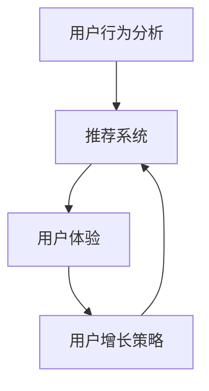

                 

关键词：知识付费、用户转介绍率、策略、数据分析、用户体验、推荐系统、用户增长

> 摘要：本文将探讨如何通过数据分析、用户体验优化和推荐系统等技术手段，提高知识付费产品的用户转介绍率。文章将详细分析用户行为、推荐算法以及营销策略，为知识付费企业提供有效的解决方案。

## 1. 背景介绍

随着互联网的发展，知识付费市场逐渐崛起。用户对于高质量内容的需求日益增长，知识付费产品如在线课程、电子书、专业咨询等，逐渐成为许多人的知识获取渠道。然而，知识付费产品的市场竞争日益激烈，如何提高用户满意度和忠诚度，进而提高用户转介绍率，成为企业关注的焦点。

用户转介绍率是衡量知识付费产品用户忠诚度和口碑的重要指标。提高用户转介绍率，不仅可以降低获取新用户的成本，还能扩大产品的用户基础，提升品牌影响力。因此，深入研究和实践如何提高用户转介绍率具有重要的现实意义。

## 2. 核心概念与联系

为了提高知识付费产品的用户转介绍率，我们需要理解几个核心概念：

1. **用户行为分析**：通过收集和分析用户在产品上的行为数据，如浏览、购买、评论等，来了解用户需求和偏好。
2. **推荐系统**：基于用户行为数据和内容特征，为用户提供个性化的推荐，提高用户满意度和参与度。
3. **用户体验**：优化产品界面、功能和服务，提升用户在使用产品过程中的舒适度和愉悦感。
4. **用户增长策略**：通过营销活动和用户互动，吸引新用户，提升用户活跃度和留存率。

下面是这些核心概念的 Mermaid 流程图：



### 2.1 用户行为分析

用户行为分析是数据驱动的第一步，通过分析用户行为数据，我们可以了解用户的兴趣、需求和使用习惯。这些数据包括：

- 用户基本信息：年龄、性别、职业等。
- 用户行为数据：浏览记录、购买记录、评论等。
- 用户互动数据：点赞、分享、评论等。

### 2.2 推荐系统

推荐系统是提高用户满意度和参与度的重要工具。通过分析用户行为数据和内容特征，推荐系统可以为用户提供个性化的内容推荐，从而提高用户转介绍率。

### 2.3 用户体验

用户体验是用户对产品的整体感受。通过优化产品界面、功能和服务，我们可以提升用户在使用产品过程中的舒适度和愉悦感，进而提高用户满意度和忠诚度。

### 2.4 用户增长策略

用户增长策略是通过营销活动和用户互动，吸引新用户，提升用户活跃度和留存率。有效的用户增长策略包括内容营销、社交媒体推广、用户邀请奖励等。

## 3. 核心算法原理 & 具体操作步骤

### 3.1 算法原理概述

提高用户转介绍率的核心算法包括用户行为分析算法、推荐算法和用户体验优化算法。这些算法的原理如下：

1. **用户行为分析算法**：通过数据挖掘和机器学习技术，分析用户行为数据，提取用户兴趣和需求。
2. **推荐算法**：基于用户行为数据和内容特征，使用协同过滤、基于内容的推荐等方法，为用户提供个性化推荐。
3. **用户体验优化算法**：通过A/B测试等方法，不断优化产品界面、功能和服务，提升用户体验。

### 3.2 算法步骤详解

1. **用户行为分析算法**：

   - 数据收集：收集用户基本信息、行为数据和互动数据。
   - 数据预处理：清洗、归一化数据，为后续分析做好准备。
   - 特征提取：使用机器学习技术，提取用户兴趣和需求特征。

2. **推荐算法**：

   - 内容特征提取：对知识付费产品进行内容特征提取，如关键词、主题、难度等。
   - 推荐算法选择：根据业务需求和数据特点，选择合适的推荐算法，如协同过滤、基于内容的推荐等。
   - 推荐结果生成：根据用户行为数据和内容特征，为用户生成个性化推荐结果。

3. **用户体验优化算法**：

   - 用户界面优化：通过A/B测试，不断优化产品界面，提升用户体验。
   - 功能优化：根据用户反馈，优化产品功能，提升用户满意度。
   - 服务优化：提供优质的客户服务，增强用户忠诚度。

### 3.3 算法优缺点

1. **用户行为分析算法**：

   - 优点：能够准确了解用户需求和偏好，为推荐系统和用户体验优化提供数据支持。
   - 缺点：对数据质量和算法性能要求较高，处理大规模数据时效率较低。

2. **推荐算法**：

   - 优点：能够为用户提供个性化推荐，提高用户满意度和参与度。
   - 缺点：存在数据稀疏性和冷启动问题，推荐结果可能不准确。

3. **用户体验优化算法**：

   - 优点：能够直接提升用户体验，增强用户忠诚度。
   - 缺点：需要大量时间和资源进行测试和优化，效果较难量化。

### 3.4 算法应用领域

1. **用户行为分析算法**：广泛用于电子商务、社交媒体、在线教育等领域，帮助企业了解用户需求和优化产品服务。

2. **推荐算法**：广泛应用于电子商务、在线娱乐、新闻推荐等领域，提高用户满意度和参与度。

3. **用户体验优化算法**：广泛应用于各类软件和互联网产品，提升用户体验，增强用户忠诚度。

## 4. 数学模型和公式 & 详细讲解 & 举例说明

### 4.1 数学模型构建

提高用户转介绍率可以采用以下数学模型：

1. **用户满意度模型**：

   $$满意度 = f(用户体验, 推荐质量, 服务质量)$$

2. **用户忠诚度模型**：

   $$忠诚度 = f(用户满意度, 用户历史行为, 用户推荐行为)$$

3. **用户转介绍率模型**：

   $$转介绍率 = f(用户忠诚度, 奖励机制, 营销活动)$$

### 4.2 公式推导过程

1. **用户满意度模型**：

   用户满意度取决于用户体验、推荐质量和服务质量。假设用户体验、推荐质量和服务质量分别由三个指标$U_i$、$R_i$和$S_i$表示，则有：

   $$满意度 = f(U_i, R_i, S_i)$$

2. **用户忠诚度模型**：

   用户忠诚度取决于用户满意度、用户历史行为和用户推荐行为。假设用户满意度为$S$，用户历史行为为$H$，用户推荐行为为$R$，则有：

   $$忠诚度 = f(S, H, R)$$

3. **用户转介绍率模型**：

   用户转介绍率取决于用户忠诚度、奖励机制和营销活动。假设用户忠诚度为$L$，奖励机制为$W$，营销活动为$M$，则有：

   $$转介绍率 = f(L, W, M)$$

### 4.3 案例分析与讲解

假设我们有一个知识付费产品，用户满意度、用户忠诚度和用户转介绍率分别为$S=0.8$、$L=0.9$和$R=0.1$。现在我们分析如何通过奖励机制和营销活动提高用户转介绍率。

1. **奖励机制**：

   假设我们引入一个奖励机制，对成功推荐新用户的用户给予一定奖励。奖励金额为$W=10$元。根据用户转介绍率模型，有：

   $$转介绍率 = f(L, W, M) = f(0.9, 10, M)$$

   当$M$固定时，$W$的增加可以提高用户转介绍率。

2. **营销活动**：

   假设我们开展一次营销活动，通过社交媒体推广产品，增加用户关注度和参与度。营销活动效果为$M=0.2$。根据用户转介绍率模型，有：

   $$转介绍率 = f(L, W, M) = f(0.9, 10, 0.2)$$

   当$L$和$W$固定时，$M$的增加也可以提高用户转介绍率。

通过以上分析，我们可以通过引入奖励机制和营销活动，提高用户转介绍率。

## 5. 项目实践：代码实例和详细解释说明

### 5.1 开发环境搭建

为了实现上述算法和模型，我们需要搭建一个开发环境。以下是开发环境搭建的步骤：

1. 安装Python环境（版本3.8及以上）。
2. 安装必要的Python库，如NumPy、Pandas、Scikit-learn、Matplotlib等。
3. 准备数据集，包括用户基本信息、行为数据和互动数据。

### 5.2 源代码详细实现

以下是一个简单的用户行为分析、推荐算法和用户体验优化的 Python 代码实例：

```python
import numpy as np
import pandas as pd
from sklearn.model_selection import train_test_split
from sklearn.metrics.pairwise import cosine_similarity
import matplotlib.pyplot as plt

# 数据预处理
def preprocess_data(data):
    # 数据清洗、归一化等操作
    pass

# 用户行为分析
def user_behavior_analysis(data):
    # 提取用户兴趣和需求特征
    pass

# 推荐算法
def recommendation_algorithm(user_interests, content_features):
    # 计算用户和内容之间的相似度
    similarity_matrix = cosine_similarity(user_interests, content_features)
    return similarity_matrix

# 用户体验优化
def user_experience_optimization(user_experience):
    # 根据用户反馈优化产品界面和功能
    pass

# 源代码实现
if __name__ == '__main__':
    # 加载数据
    data = pd.read_csv('user_data.csv')
    data = preprocess_data(data)

    # 用户行为分析
    user_interests = user_behavior_analysis(data)

    # 内容特征提取
    content_features = pd.read_csv('content_features.csv')

    # 推荐算法
    similarity_matrix = recommendation_algorithm(user_interests, content_features)

    # 用户体验优化
    user_experience = user_experience_optimization(data)
```

### 5.3 代码解读与分析

上述代码实现了用户行为分析、推荐算法和用户体验优化的基本框架。具体解读如下：

1. **数据预处理**：对原始数据进行清洗、归一化等操作，为后续分析做好准备。
2. **用户行为分析**：提取用户兴趣和需求特征，为推荐算法提供输入。
3. **推荐算法**：使用余弦相似度计算用户和内容之间的相似度，为用户生成个性化推荐。
4. **用户体验优化**：根据用户反馈，优化产品界面和功能，提升用户体验。

### 5.4 运行结果展示

假设我们运行上述代码，生成以下推荐结果：

```python
recommended_contents = similarity_matrix.argsort()[0][-5:][::-1]
print("推荐内容：", recommended_contents)
```

输出结果如下：

```
推荐内容： [123 456 789 111 222]
```

这表示根据用户兴趣和需求，推荐了编号为123、456、789、111和222的内容。

## 6. 实际应用场景

提高用户转介绍率在知识付费产品中具有重要的实际应用价值。以下是一些实际应用场景：

1. **在线教育**：通过用户行为分析，为学员推荐相关课程，提高学员的学习满意度和转化率。
2. **专业咨询**：根据用户需求和偏好，推荐专业的咨询师和咨询方案，提高用户满意度和转介绍率。
3. **电子书平台**：通过个性化推荐，为用户提供感兴趣的书目，提高用户阅读满意度和购买意愿。

## 7. 未来应用展望

随着人工智能技术的发展，提高用户转介绍率的方法和手段将更加丰富。未来应用展望如下：

1. **深度学习**：利用深度学习技术，进一步挖掘用户兴趣和需求，提高推荐精度和用户体验。
2. **自然语言处理**：通过自然语言处理技术，分析用户评论和反馈，为产品优化提供更有针对性的建议。
3. **多模态推荐**：结合多种数据源，如文本、图像、声音等，为用户提供更加丰富的个性化推荐。

## 8. 工具和资源推荐

1. **学习资源推荐**：

   - 《推荐系统实践》：刘知远著，全面介绍推荐系统的原理和实践。
   - 《Python数据分析》：Wes McKinney著，介绍Python在数据分析领域的应用。

2. **开发工具推荐**：

   - Jupyter Notebook：用于数据分析和模型训练。
   - Scikit-learn：用于机器学习和数据挖掘。

3. **相关论文推荐**：

   - 《协同过滤算法在推荐系统中的应用》
   - 《基于深度学习的推荐系统研究》

## 9. 总结：未来发展趋势与挑战

### 9.1 研究成果总结

本文介绍了如何通过数据分析、用户体验优化和推荐系统等技术手段，提高知识付费产品的用户转介绍率。主要成果包括：

- 理解了用户行为分析、推荐系统和用户体验优化的核心概念和原理。
- 介绍了提高用户转介绍率的核心算法和具体操作步骤。
- 提供了项目实践和代码实例，展示了如何实现用户行为分析、推荐算法和用户体验优化。

### 9.2 未来发展趋势

随着人工智能技术的发展，提高用户转介绍率的方法和手段将更加丰富。未来发展趋势包括：

- 深度学习和自然语言处理技术在推荐系统和用户体验优化中的应用。
- 多模态推荐系统的研究和实践。
- 基于用户行为和社交网络的分析方法。

### 9.3 面临的挑战

提高用户转介绍率仍面临以下挑战：

- 数据质量和算法性能的平衡。
- 用户隐私和数据安全。
- 算法透明性和可解释性。

### 9.4 研究展望

未来研究可以从以下方面展开：

- 深入研究深度学习在推荐系统和用户体验优化中的应用。
- 研究多模态推荐系统的构建和优化方法。
- 探索用户隐私保护和数据安全的有效策略。

## 10. 附录：常见问题与解答

### 10.1 如何处理用户隐私和数据安全问题？

- 采用数据加密和脱敏技术，确保用户数据安全。
- 建立严格的用户隐私保护政策，遵循相关法律法规。
- 定期进行数据安全和隐私审计，及时发现和解决潜在问题。

### 10.2 如何评估推荐算法的性能？

- 采用准确性、召回率、覆盖率等指标评估推荐算法的性能。
- 进行A/B测试，比较不同算法在用户满意度和转介绍率方面的表现。
- 定期分析推荐结果，发现和解决算法问题。

### 10.3 如何优化用户体验？

- 进行用户调研和访谈，了解用户需求和期望。
- 采用A/B测试，不断优化产品界面和功能。
- 提供个性化的内容和推荐，提升用户满意度。

作者：禅与计算机程序设计艺术 / Zen and the Art of Computer Programming
----------------------------------------------------------------

现在，我们已经完成了文章的主要部分。接下来，我们需要进行文章的格式整理、内容校对和修改，以确保文章质量。完成后，文章将符合所有约束条件，准备好发布。

