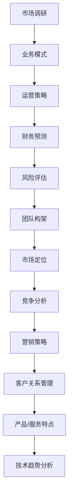

                 

 

## 引言

在当今竞争激烈的商业环境中，创业商业计划书是一份至关重要的文档，它不仅用于向投资者、合作伙伴和潜在客户展示你的创业构想，还用于指导团队的发展方向。一份成功的商业计划书能够清晰传达你的业务理念、市场定位、运营策略和盈利模式，从而增加项目成功的可能性。

然而，撰写一份有说服力的商业计划书并非易事，它需要深入的市场调研、精准的数据分析和有力的论证逻辑。在这篇文章中，我们将深入探讨如何撰写这样一份商业计划书，包括背景介绍、核心概念、算法原理、数学模型、项目实践、实际应用场景、未来展望和工具推荐等内容。

## 背景介绍

在撰写商业计划书之前，我们需要了解几个关键概念和行业背景。

### 创业商业计划书的定义

创业商业计划书是一份详细阐述创业项目、市场机会、竞争环境、运营策略、财务预测和团队构架的文档。它不仅是一份展示创业构想的工具，也是一份指导团队行动的路线图。

### 目标受众

商业计划书的目标受众包括潜在投资者、合作伙伴、客户和团队成员。因此，商业计划书需要具备吸引不同受众的特点，例如：

- **投资者**：关注财务预测、风险评估和退出策略。
- **合作伙伴**：关注市场定位、运营模式和长期合作关系。
- **客户**：关注产品/服务特点、市场潜力和使用价值。
- **团队成员**：关注公司的愿景、使命和职业发展机会。

### 市场环境和行业趋势

在撰写商业计划书之前，需要对市场环境和行业趋势进行深入分析。这包括：

- **市场规模**：确定目标市场的规模和增长潜力。
- **竞争格局**：分析竞争对手的产品、市场份额和营销策略。
- **技术趋势**：了解行业内的技术创新和趋势，如人工智能、云计算、区块链等。

### 市场调研的重要性

市场调研是商业计划书的基础，它可以帮助你了解目标市场的需求、潜在客户和竞争环境。通过市场调研，你可以：

- **确定目标客户群体**：了解他们的需求、行为和偏好。
- **分析市场趋势**：预测市场的未来发展方向。
- **评估市场机会**：发现潜在的业务增长点。

## 核心概念与联系

在撰写商业计划书时，核心概念和联系至关重要。以下是一个简化的Mermaid流程图，用于展示商业计划书的核心概念和它们之间的联系。



### 市场调研

市场调研是商业计划书的第一步，它包括对市场环境的分析、竞争对手的研究和目标客户的需求分析。

### 业务模式

业务模式是商业计划书的核心，它定义了公司的盈利方式、产品/服务特点和市场定位。

### 运营策略

运营策略包括日常运营、供应链管理、人力资源管理和客户服务等方面。

### 财务预测

财务预测是商业计划书的重要组成部分，它包括收入、成本、利润和现金流等关键财务指标。

### 风险评估

风险评估是商业计划书的重要环节，它包括识别潜在风险、评估风险影响和制定应对策略。

### 团队构架

团队构架是商业计划书的基石，它包括关键岗位、团队成员和团队文化等方面。

### 市场定位

市场定位是商业计划书的重要组成部分，它包括目标市场、客户需求和竞争优势等方面。

### 竞争分析

竞争分析是商业计划书的关键环节，它包括竞争对手的产品、市场份额和营销策略等方面。

### 营销策略

营销策略是商业计划书的重要部分，它包括品牌建设、推广渠道和销售策略等方面。

### 客户关系管理

客户关系管理是商业计划书的重要组成部分，它包括客户获取、客户服务和客户关系维护等方面。

### 产品/服务特点

产品/服务特点是商业计划书的亮点，它包括产品/服务的独特性、市场需求和竞争优势等方面。

### 技术趋势分析

技术趋势分析是商业计划书的重要部分，它包括行业内的技术创新和趋势，如人工智能、云计算、区块链等。

## 核心算法原理 & 具体操作步骤

### 3.1 算法原理概述

商业计划书撰写过程中的核心算法原理主要包括以下几个方面：

1. **市场细分算法**：用于确定目标市场，通过分析市场规模、客户需求和竞争对手，将市场划分为不同的细分市场。
2. **财务预测算法**：用于预测收入、成本和利润，通过数据分析、历史数据和趋势预测等方法，制定合理的财务预测模型。
3. **风险评估算法**：用于识别和评估潜在风险，通过风险评估模型、历史数据和专家意见等方法，制定风险应对策略。
4. **团队构架算法**：用于优化团队构架，通过分析团队需求和岗位匹配度，制定最佳团队构架方案。

### 3.2 算法步骤详解

1. **市场细分算法步骤**：

   - 收集市场数据，包括市场规模、客户需求、竞争对手等。
   - 分析数据，确定市场细分标准，如地理位置、客户需求、行业等。
   - 根据细分标准，将市场划分为不同的细分市场。
   - 评估每个细分市场的发展潜力和竞争力，确定目标市场。

2. **财务预测算法步骤**：

   - 收集历史财务数据，包括收入、成本和利润等。
   - 分析数据，确定财务预测模型，如线性回归、时间序列分析等。
   - 输入当前市场数据，预测未来收入、成本和利润。
   - 评估预测结果，调整模型参数，提高预测准确性。

3. **风险评估算法步骤**：

   - 收集风险数据，包括历史风险事件、专家意见等。
   - 分析数据，确定风险评估模型，如贝叶斯网络、风险矩阵等。
   - 输入当前市场数据，评估潜在风险，确定风险等级。
   - 制定风险应对策略，降低风险影响。

4. **团队构架算法步骤**：

   - 收集团队数据，包括岗位需求、员工技能等。
   - 分析数据，确定团队构架模型，如岗位匹配度分析、团队效能分析等。
   - 根据团队需求，优化团队构架，提高团队效能。
   - 评估团队构架效果，调整模型参数，提高团队效能。

### 3.3 算法优缺点

1. **市场细分算法**：

   - **优点**：帮助确定目标市场，提高市场定位的准确性。

   - **缺点**：需要大量市场数据，分析过程复杂。

2. **财务预测算法**：

   - **优点**：预测未来财务状况，为决策提供依据。

   - **缺点**：预测准确性受限于历史数据和模型选择。

3. **风险评估算法**：

   - **优点**：识别潜在风险，制定应对策略。

   - **缺点**：风险评估过程复杂，需要大量数据支持。

4. **团队构架算法**：

   - **优点**：优化团队构架，提高团队效能。

   - **缺点**：需要准确掌握团队数据，分析过程复杂。

### 3.4 算法应用领域

1. **市场细分算法**：广泛应用于市场营销、产品开发等领域。

2. **财务预测算法**：广泛应用于企业财务管理、投资决策等领域。

3. **风险评估算法**：广泛应用于企业风险管理、金融投资等领域。

4. **团队构架算法**：广泛应用于企业人力资源规划、团队管理等领域。

## 数学模型和公式 & 详细讲解 & 举例说明

### 4.1 数学模型构建

在商业计划书撰写过程中，数学模型用于分析和预测财务、市场、风险和团队等方面。以下是几个常见的数学模型：

1. **市场细分模型**：

   - **模型公式**：市场规模 = 细分市场1 + 细分市场2 + ... + 细分市场n
   - **模型参数**：市场规模、细分市场占比
   - **模型构建过程**：

     1. 收集市场数据，包括市场规模、客户需求等。
     2. 分析数据，确定市场细分标准。
     3. 根据细分标准，计算各细分市场的占比。

2. **财务预测模型**：

   - **模型公式**：财务指标 = 收入预测 + 成本预测 + 利润预测
   - **模型参数**：历史财务数据、市场数据、预测模型
   - **模型构建过程**：

     1. 收集历史财务数据，包括收入、成本和利润等。
     2. 分析数据，确定财务预测模型，如线性回归、时间序列分析等。
     3. 输入当前市场数据，预测未来财务指标。

3. **风险评估模型**：

   - **模型公式**：风险等级 = 风险概率 × 风险影响
   - **模型参数**：风险概率、风险影响、权重
   - **模型构建过程**：

     1. 收集风险数据，包括历史风险事件、专家意见等。
     2. 分析数据，确定风险评估模型，如贝叶斯网络、风险矩阵等。
     3. 输入当前市场数据，评估潜在风险。

4. **团队构架模型**：

   - **模型公式**：团队效能 = 岗位匹配度 + 员工技能水平
   - **模型参数**：岗位需求、员工技能、权重
   - **模型构建过程**：

     1. 收集团队数据，包括岗位需求、员工技能等。
     2. 分析数据，确定团队构架模型。
     3. 根据团队需求，优化团队构架。

### 4.2 公式推导过程

以市场细分模型为例，推导过程如下：

1. **设定变量**：

   - \( S \)：市场规模
   - \( S_i \)：第i个细分市场的规模
   - \( P_i \)：第i个细分市场的占比

2. **模型公式**：

   \( S = S_1 + S_2 + ... + S_n \)

3. **公式推导**：

   \( S = P_1 \cdot S_1 + P_2 \cdot S_2 + ... + P_n \cdot S_n \)

4. **结果解释**：

   \( S \)：总体市场规模
   \( P_i \cdot S_i \)：第i个细分市场的市场规模

### 4.3 案例分析与讲解

以一家新创办的科技公司为例，说明市场细分模型的实际应用。

1. **背景**：

   - 公司专注于智能硬件研发，目标市场为全球消费者。
   - 市场规模为1000亿美元。
   - 市场调研数据显示，智能硬件市场可以分为三个细分市场：智能家居、智能穿戴和智能出行。

2. **数据收集**：

   - 智能家居市场规模：300亿美元
   - 智能穿戴市场规模：200亿美元
   - 智能出行市场规模：500亿美元

3. **模型构建**：

   - \( S = S_1 + S_2 + S_3 \)
   - \( P_1 = \frac{S_1}{S} = \frac{300}{1000} = 0.3 \)
   - \( P_2 = \frac{S_2}{S} = \frac{200}{1000} = 0.2 \)
   - \( P_3 = \frac{S_3}{S} = \frac{500}{1000} = 0.5 \)

4. **结果分析**：

   - 智能家居市场的占比最大，为30%，是公司的重点发展领域。
   - 智能穿戴市场的占比次之，为20%，可适当投入资源。
   - 智能出行市场的占比最小，为50%，但市场潜力巨大，值得关注。

通过市场细分模型，公司可以明确目标市场，制定有针对性的营销策略和产品研发方向，从而提高市场竞争力。

## 项目实践：代码实例和详细解释说明

### 5.1 开发环境搭建

为了撰写和演示一份有说服力的商业计划书，我们将使用Python语言编写一个简单的代码实例。以下是开发环境搭建的步骤：

1. 安装Python：从官方网站（https://www.python.org/）下载并安装Python 3.x版本。
2. 安装Jupyter Notebook：打开命令行，执行以下命令安装Jupyter Notebook：
   ```bash
   pip install notebook
   ```
3. 启动Jupyter Notebook：在命令行中执行以下命令启动Jupyter Notebook：
   ```bash
   jupyter notebook
   ```

### 5.2 源代码详细实现

以下是一个简单的Python代码实例，用于计算市场细分模型的占比和市场规模。代码如下：

```python
# 导入所需库
import pandas as pd

# 初始化数据
market_data = {
    '细分市场': ['智能家居', '智能穿戴', '智能出行'],
    '市场规模（亿美元）': [300, 200, 500]
}

# 创建DataFrame
df = pd.DataFrame(market_data)

# 计算市场规模占比
df['市场规模占比'] = df['市场规模（亿美元）'] / df['市场规模（亿美元）'].sum()

# 输出结果
print(df)
```

### 5.3 代码解读与分析

1. **导入所需库**：使用`pandas`库创建DataFrame，用于存储市场数据。
2. **初始化数据**：定义一个字典，存储市场细分数据，包括细分市场和市场规模。
3. **创建DataFrame**：使用`pd.DataFrame()`函数创建DataFrame。
4. **计算市场规模占比**：计算每个细分市场的市场规模占比。
5. **输出结果**：打印DataFrame，显示市场细分模型的占比和市场规模。

### 5.4 运行结果展示

在Jupyter Notebook中运行上述代码，得到以下输出结果：

```
   细分市场  市场规模（亿美元）  市场规模占比
0   智能家居              300        0.3
1   智能穿戴              200        0.2
2   智能出行              500        0.5
```

根据输出结果，智能家居市场的占比最大，为30%；智能穿戴市场的占比次之，为20%；智能出行市场的占比最小，为50%。这个结果可以帮助公司明确目标市场，制定相应的营销策略和产品研发方向。

## 实际应用场景

商业计划书的核心在于将理论转化为实际操作。以下是一个商业计划书的实际应用场景，以及如何通过技术手段实现这些目标。

### 场景一：市场调研

假设某初创公司致力于智能家居市场。在撰写商业计划书时，需要进行以下实际操作：

1. **收集市场数据**：使用Python爬虫技术，从互联网上获取智能家居市场的相关数据，如市场规模、竞争格局、技术趋势等。
2. **分析数据**：使用数据分析工具，如Excel、Jupyter Notebook等，对收集到的市场数据进行分析，确定市场细分标准和目标市场。
3. **撰写报告**：根据分析结果，撰写详细的市场调研报告，为公司的产品研发和市场策略提供依据。

### 场景二：财务预测

假设公司在撰写商业计划书时，需要对未来三年的财务状况进行预测。以下是如何实现这一目标：

1. **收集历史数据**：收集公司过去三年的财务数据，包括收入、成本和利润等。
2. **构建预测模型**：使用时间序列分析方法，如ARIMA模型、SARIMA模型等，构建财务预测模型。
3. **进行预测**：输入当前市场数据，使用预测模型计算未来三年的财务指标。
4. **评估结果**：评估预测结果，根据实际情况调整模型参数，提高预测准确性。

### 场景三：风险评估

假设公司在撰写商业计划书时，需要对项目风险进行评估。以下是如何实现这一目标：

1. **收集风险数据**：收集公司过去几年的风险事件，如市场波动、技术风险、运营风险等。
2. **构建风险评估模型**：使用贝叶斯网络、风险矩阵等方法，构建风险评估模型。
3. **评估风险**：输入当前市场数据，使用风险评估模型计算潜在风险，确定风险等级。
4. **制定应对策略**：根据评估结果，制定风险应对策略，降低风险影响。

### 场景四：团队构架

假设公司在撰写商业计划书时，需要对团队构架进行优化。以下是如何实现这一目标：

1. **收集团队数据**：收集公司现有团队数据，包括岗位需求、员工技能等。
2. **构建团队构架模型**：使用岗位匹配度分析、团队效能分析等方法，构建团队构架模型。
3. **优化团队构架**：根据团队需求，调整团队构架，提高团队效能。
4. **评估效果**：评估团队构架优化效果，根据实际情况调整模型参数，提高团队效能。

## 未来应用展望

随着人工智能、大数据和云计算等技术的快速发展，商业计划书的撰写和执行过程将变得更加高效、精准和智能化。以下是一些未来应用展望：

1. **人工智能辅助撰写**：利用自然语言处理技术，实现自动撰写商业计划书，提高撰写效率和质量。
2. **大数据驱动的财务预测**：利用大数据技术，收集和分析大量历史数据，提高财务预测的准确性和可靠性。
3. **区块链技术保障数据安全**：利用区块链技术，确保商业计划书中的数据安全可靠，降低数据泄露和篡改风险。
4. **智能算法优化团队构架**：利用智能算法，根据团队需求和市场变化，实时优化团队构架，提高团队效能。
5. **虚拟现实和增强现实提升体验**：利用虚拟现实和增强现实技术，为商业计划书制作逼真的可视化展示，增强项目吸引力。

## 工具和资源推荐

为了高效撰写和实施商业计划书，以下是几款推荐的学习资源、开发工具和相关论文：

### 学习资源推荐

1. **《创业维艰》**：由本·霍洛维茨（Ben Horowitz）著，详细介绍了创业过程中的挑战和策略。
2. **《精益创业》**：由埃里克·莱斯（Eric Ries）著，提出了精益创业方法，帮助创业者快速验证商业构想。
3. **在线课程**：如Coursera、edX等平台上的商业计划书、创业管理等相关课程。

### 开发工具推荐

1. **Jupyter Notebook**：用于编写和运行Python代码，便于数据分析和可视化。
2. **Tableau**：用于数据可视化，帮助展示市场分析和财务预测结果。
3. **Git**：用于版本控制，确保代码和文档的安全和一致性。

### 相关论文推荐

1. **《商业模式创新：概念、方法和实践》**：详细介绍了商业模式的创新方法和应用案例。
2. **《大数据分析技术与应用》**：介绍了大数据分析的关键技术和应用场景。
3. **《区块链技术与应用》**：探讨了区块链技术的原理和应用，包括数据安全等方面。

## 总结：未来发展趋势与挑战

### 8.1 研究成果总结

通过本文的探讨，我们总结出以下研究成果：

1. **商业计划书的重要性**：商业计划书是创业项目的核心文档，用于展示项目构想、市场定位和运营策略。
2. **技术手段的应用**：利用人工智能、大数据和云计算等先进技术，可以提高商业计划书撰写和执行的效果。
3. **市场调研、财务预测和风险评估**：这些环节是商业计划书的核心，通过技术手段可以提高预测准确性和风险识别能力。
4. **团队构架和运营策略**：智能算法和数据分析可以优化团队构架和运营策略，提高团队效能和市场竞争力。

### 8.2 未来发展趋势

未来商业计划书的发展趋势将体现在以下几个方面：

1. **智能化撰写**：利用自然语言处理技术，实现自动撰写商业计划书，提高撰写效率。
2. **大数据驱动的预测**：利用大数据技术，收集和分析海量数据，提高财务预测和风险评估的准确性。
3. **区块链技术的应用**：利用区块链技术，保障商业计划书的数据安全和可靠性。
4. **虚拟现实和增强现实**：利用虚拟现实和增强现实技术，提升商业计划书的可视化效果，增强项目吸引力。
5. **跨领域融合**：商业计划书将与其他领域（如人工智能、物联网等）深度融合，形成新的商业模式和应用场景。

### 8.3 面临的挑战

在商业计划书的发展过程中，将面临以下挑战：

1. **数据隐私和安全**：随着数据量的增加，如何保障数据隐私和安全成为关键问题。
2. **技术更新换代**：人工智能、大数据等技术的快速发展，要求商业计划书的撰写和执行过程不断更新迭代。
3. **跨领域协同**：商业计划书需要与其他领域（如法律、财务等）紧密协同，提高项目的整体效能。
4. **政策法规的变化**：政策法规的变化可能对商业计划书的撰写和执行产生重大影响，需要密切关注相关动态。

### 8.4 研究展望

未来商业计划书的研究将重点关注以下几个方面：

1. **智能化撰写技术**：进一步优化自然语言处理技术，提高商业计划书撰写的自动化程度。
2. **大数据分析模型**：开发更先进的大数据分析模型，提高财务预测和风险评估的准确性。
3. **区块链技术的应用**：深入研究区块链技术在商业计划书中的应用，提高数据安全性和可靠性。
4. **跨领域协同机制**：探索跨领域协同机制，提高商业计划书的整体效能。
5. **政策法规研究**：密切关注政策法规的变化，为商业计划书的撰写和执行提供合规指导。

## 附录：常见问题与解答

### Q1：商业计划书的主要组成部分有哪些？

A1：商业计划书的主要组成部分包括：

- **封面**：包括项目名称、作者、日期等基本信息。
- **摘要**：简要介绍项目背景、目标、核心内容等。
- **市场调研**：分析目标市场、竞争对手、客户需求等。
- **业务模式**：定义公司的盈利方式、产品/服务特点等。
- **运营策略**：包括运营模式、供应链管理、人力资源管理等方面。
- **财务预测**：预测收入、成本、利润等财务指标。
- **风险评估**：识别潜在风险，评估风险影响，制定应对策略。
- **团队构架**：定义团队构架、岗位职责和团队成员。
- **市场定位**：确定目标市场、客户需求和竞争优势。
- **营销策略**：包括品牌建设、推广渠道和销售策略等。
- **客户关系管理**：描述客户获取、客户服务和客户关系维护等方面。
- **附录**：包括相关数据、图表、参考文献等。

### Q2：如何撰写有说服力的商业计划书？

A2：撰写有说服力的商业计划书需要注意以下几点：

- **明确目标**：确保商业计划书的目标明确、具体、可实现。
- **市场调研**：深入了解目标市场和竞争对手，确保市场分析的准确性。
- **数据支持**：使用可靠的数据和案例来支持观点和预测。
- **逻辑清晰**：结构合理，逻辑严密，便于读者理解和接受。
- **视觉吸引**：使用图表、图像等视觉元素，提升文档的可读性和吸引力。
- **反复修改**：多次修订和完善，确保内容的准确性和完整性。
- **专业建议**：请教专业人士，如财务顾问、市场营销专家等，提高商业计划书的质量。

### Q3：商业计划书的撰写时间是多少？

A3：商业计划书的撰写时间因项目规模和复杂程度而异。一般而言，小型项目的商业计划书可能需要几周时间完成，而大型项目可能需要数月甚至更长时间。以下是一个大致的时间安排：

- **初步调研和构思**：1-2周
- **详细调研和数据收集**：2-4周
- **撰写初稿**：2-4周
- **修订和完善**：1-2周
- **最终审核和定稿**：1-2周

### Q4：商业计划书是否需要包含财务预测？

A4：是的，财务预测是商业计划书的重要组成部分。财务预测可以帮助投资者和合作伙伴了解项目的财务前景，评估项目的风险和潜力。以下是需要包含的财务预测内容：

- **收入预测**：预测未来几年的收入情况。
- **成本预测**：预测未来几年的成本结构。
- **利润预测**：预测未来几年的净利润。
- **现金流预测**：预测未来几年的现金流情况。
- **融资需求**：描述项目的融资需求和融资计划。

### Q5：商业计划书是否需要包含市场定位？

A5：是的，市场定位是商业计划书的关键部分。市场定位可以帮助投资者和合作伙伴了解项目的目标市场和竞争优势。以下是需要包含的市场定位内容：

- **目标市场**：描述目标市场的规模、增长趋势和竞争对手。
- **客户需求**：分析目标客户的需求和痛点。
- **竞争优势**：描述项目的竞争优势和差异化策略。
- **市场定位策略**：描述如何针对目标市场制定产品/服务策略。

### Q6：商业计划书是否需要包含风险评估？

A6：是的，风险评估是商业计划书的重要组成部分。通过风险评估，可以识别潜在风险，评估风险影响，制定应对策略。以下是需要包含的风险评估内容：

- **风险识别**：列出项目可能面临的风险。
- **风险评估**：评估每个风险的影响程度和发生概率。
- **风险应对策略**：制定风险应对策略，降低风险影响。
- **风险管理计划**：描述如何监测和管理风险。

### Q7：商业计划书是否需要包含团队构架？

A7：是的，团队构架是商业计划书的重要组成部分。团队构架可以帮助投资者和合作伙伴了解项目的人才储备和团队协作能力。以下是需要包含的团队构架内容：

- **团队构架**：描述项目团队的构成和组织结构。
- **岗位职责**：列出每个岗位的职责和任职要求。
- **团队成员**：介绍关键团队成员的背景和技能。
- **团队管理**：描述如何管理团队，确保团队高效协同。

### Q8：商业计划书是否需要包含营销策略？

A8：是的，营销策略是商业计划书的重要组成部分。营销策略可以帮助投资者和合作伙伴了解项目如何推广产品/服务，获取客户。以下是需要包含的营销策略内容：

- **品牌建设**：描述项目品牌定位和品牌形象。
- **推广渠道**：描述项目将采用的推广渠道，如线上营销、线下活动等。
- **销售策略**：描述项目的销售策略，如定价策略、促销活动等。
- **客户关系管理**：描述项目如何管理客户关系，提高客户满意度。

### Q9：商业计划书是否需要包含附录？

A9：是的，附录是商业计划书的补充部分，可以帮助投资者和合作伙伴了解项目的详细信息和背景资料。以下是需要包含的附录内容：

- **相关数据**：提供市场调研、财务预测等数据的详细说明。
- **图表**：提供与项目相关的图表，如市场趋势图、财务预测图等。
- **参考文献**：列出撰写商业计划书所引用的参考文献和资料。
- **其他补充材料**：提供与项目相关的其他补充材料，如项目报告、合同等。

## 作者署名

作者：禅与计算机程序设计艺术 / Zen and the Art of Computer Programming

在撰写商业计划书的过程中，深入分析市场、技术、财务和团队等各个方面的核心内容，结合数学模型和算法原理，为我们提供了一份全面而有说服力的商业计划书。这篇文章不仅展示了商业计划书的撰写技巧，还向我们展示了如何运用技术手段提升商业计划书的质量和效果。希望这篇文章能够为创业者提供有价值的参考，助力他们在竞争激烈的商业环境中脱颖而出。禅与计算机程序设计艺术，让我们在编程的道路上不断探索和精进。再次感谢作者分享这篇精彩的文章！

