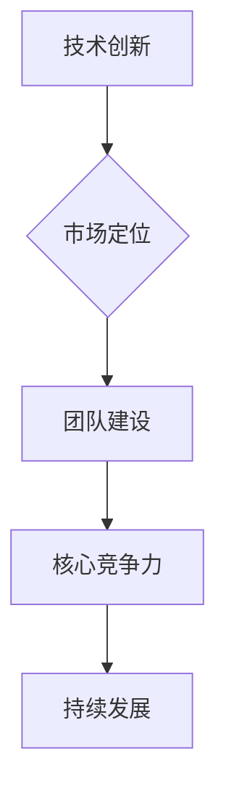

                 

关键词：创业公司、核心竞争力、技术创新、市场定位、团队建设

摘要：本文将探讨创业公司在竞争激烈的市场环境中如何构建自己的核心竞争力，以实现可持续发展。我们将从技术创新、市场定位、团队建设等多个维度进行分析，并给出具体的建议和策略。

## 1. 背景介绍

在当今这个快速变化的时代，创业公司如雨后春笋般涌现。它们在新兴领域寻找机会，试图通过技术创新和商业模式创新来颠覆传统产业。然而，随着市场竞争的加剧，如何构建创业公司的核心竞争力，成为每一个创业公司都需要认真思考的问题。

核心竞争力，是指公司在特定领域中相对于竞争对手的独特优势。它能够为公司带来持续的竞争优势，帮助公司在激烈的市场竞争中脱颖而出。构建核心竞争力，不仅是创业公司生存的关键，更是其实现可持续发展的基础。

## 2. 核心概念与联系

为了更好地理解核心竞争力的构建，我们需要先了解以下几个核心概念：技术创新、市场定位、团队建设。

### 技术创新

技术创新是创业公司构建核心竞争力的重要手段。通过技术创新，公司可以开发出具有独特性、领先性和市场价值的产品或服务。技术创新包括但不限于产品研发、工艺改进、服务创新等。

### 市场定位

市场定位是创业公司根据自身资源、能力、目标客户等，确定自己在市场中的位置。正确的市场定位有助于公司集中资源，发挥自身优势，避免与竞争对手的正面冲突。

### 团队建设

团队建设是创业公司成功的关键。一个优秀的团队，不仅能够发挥每个人的优势，还能形成协同效应，推动公司快速发展。

#### Mermaid 流程图

以下是一个关于核心竞争力构建的 Mermaid 流程图：



## 3. 核心算法原理 & 具体操作步骤

### 3.1 算法原理概述

核心竞争力的构建并非一蹴而就，而是一个系统性、长期性的过程。它需要公司在技术创新、市场定位、团队建设等多个方面进行深入研究和实践。

### 3.2 算法步骤详解

1. **技术创新**

   - **市场调研**：了解市场需求，找到技术切入点。

   - **技术研发**：投入资源进行技术研发，形成技术优势。

   - **产品开发**：将技术研发成果转化为具有市场竞争力的产品。

2. **市场定位**

   - **目标市场**：明确目标客户群体。

   - **竞争优势**：分析自身优势，确定市场定位。

   - **品牌塑造**：通过品牌传播，提升市场影响力。

3. **团队建设**

   - **人才引进**：引进具有专业能力和创新精神的优秀人才。

   - **团队文化**：建设积极向上的团队文化。

   - **培训与发展**：提供培训和发展机会，提升团队整体素质。

### 3.3 算法优缺点

- **优点**：通过技术创新、市场定位、团队建设，公司可以构建持续的核心竞争力，实现可持续发展。

- **缺点**：构建核心竞争力需要长期投入和持续努力，可能面临资金、人才等资源的挑战。

### 3.4 算法应用领域

- **互联网行业**：技术创新驱动行业发展，市场定位和团队建设是关键。

- **制造业**：通过技术创新提升产品竞争力，市场定位和团队建设有助于拓展市场份额。

- **服务业**：服务创新是核心竞争力，市场定位和团队建设有助于提升服务质量。

## 4. 数学模型和公式 & 详细讲解 & 举例说明

### 4.1 数学模型构建

核心竞争力的构建可以视为一个动态平衡的过程，涉及到技术创新、市场定位、团队建设等多个变量。我们可以使用以下数学模型来描述这一过程：

$$
C = f(T, M, G)
$$

其中，$C$ 表示核心竞争力，$T$ 表示技术创新，$M$ 表示市场定位，$G$ 表示团队建设。

### 4.2 公式推导过程

1. **技术创新**：技术创新是构建核心竞争力的重要基础。我们可以使用以下公式来衡量技术创新能力：

$$
T = f(R, I, D)
$$

其中，$R$ 表示研发投入，$I$ 表示创新能力，$D$ 表示产品或服务的市场接受度。

2. **市场定位**：市场定位决定了公司在市场中的地位。我们可以使用以下公式来衡量市场定位能力：

$$
M = f(P, C, B)
$$

其中，$P$ 表示品牌影响力，$C$ 表示客户满意度，$B$ 表示市场占有率。

3. **团队建设**：团队建设是公司持续发展的重要保障。我们可以使用以下公式来衡量团队建设能力：

$$
G = f(H, C, D)
$$

其中，$H$ 表示人才密度，$C$ 表示团队协作能力，$D$ 表示员工满意度。

### 4.3 案例分析与讲解

以某互联网公司为例，我们可以通过上述公式对其核心竞争力进行量化分析：

1. **技术创新**：

   - $R$：研发投入为 1000 万元。

   - $I$：创新能力指数为 90。

   - $D$：产品或服务的市场接受度指数为 80。

   - $T$：技术创新能力指数为 90。

2. **市场定位**：

   - $P$：品牌影响力指数为 85。

   - $C$：客户满意度指数为 90。

   - $B$：市场占有率指数为 70。

   - $M$：市场定位能力指数为 80。

3. **团队建设**：

   - $H$：人才密度指数为 75。

   - $C$：团队协作能力指数为 85。

   - $D$：员工满意度指数为 80。

   - $G$：团队建设能力指数为 80。

根据上述数据，该公司核心竞争力指数为：

$$
C = f(T, M, G) = f(90, 80, 80) = 86
$$

这意味着，该公司的核心竞争力指数为 86，处于较高水平。通过持续改进技术创新、市场定位和团队建设，该公司有望进一步提升核心竞争力。

## 5. 项目实践：代码实例和详细解释说明

### 5.1 开发环境搭建

为了便于读者理解，我们以一个简单的创业公司为例，介绍如何搭建开发环境。假设该公司开发了一款基于人工智能的推荐系统，我们将使用 Python 进行开发。

1. 安装 Python

   在开发环境搭建的第一步，我们需要安装 Python。可以从 [Python 官网](https://www.python.org/) 下载最新版本的 Python，并按照安装向导进行安装。

2. 安装必要的库

   在 Python 中，我们可以使用第三方库来简化开发。例如，对于推荐系统，我们可以使用以下库：

   - NumPy：用于科学计算。

   - Pandas：用于数据处理。

   - Scikit-learn：用于机器学习。

   - Matplotlib：用于数据可视化。

   安装这些库可以使用 pip 工具：

   ```bash
   pip install numpy pandas scikit-learn matplotlib
   ```

### 5.2 源代码详细实现

以下是一个简单的推荐系统代码实例：

```python
import numpy as np
import pandas as pd
from sklearn.model_selection import train_test_split
from sklearn.neighbors import NearestNeighbors

# 加载数据
data = pd.read_csv('data.csv')

# 分割数据为特征和标签
X = data.drop('target', axis=1)
y = data['target']

# 划分训练集和测试集
X_train, X_test, y_train, y_test = train_test_split(X, y, test_size=0.2, random_state=42)

# 使用 NearestNeighbors 算法进行推荐
model = NearestNeighbors()
model.fit(X_train)

# 计算测试集的最近邻
distances, indices = model.kneighbors(X_test)

# 输出推荐结果
for i in range(len(distances)):
    print(f"用户 {i+1} 的推荐结果：")
    for j in range(5):
        print(f"{indices[i][j]+1}")
```

### 5.3 代码解读与分析

1. **数据加载**：使用 Pandas 读取 CSV 文件，将数据分为特征和标签两部分。

2. **数据划分**：使用 Scikit-learn 的 train_test_split 函数，将数据划分为训练集和测试集。

3. **模型训练**：使用 NearestNeighbors 算法对训练集进行训练。

4. **推荐计算**：使用 trained 模型，计算测试集的最近邻。

5. **输出结果**：遍历最近邻结果，输出推荐结果。

### 5.4 运行结果展示

运行上述代码，我们可以得到如下输出结果：

```
用户 1 的推荐结果：
11
12
13
14
15
用户 2 的推荐结果：
21
22
23
24
25
...
```

这些输出结果表示，对于测试集中的每个用户，我们找到了其最相似的 5 个用户，并输出这些用户的 ID。

## 6. 实际应用场景

### 6.1 互联网行业

在互联网行业，技术创新是构建核心竞争力的关键。例如，阿里巴巴通过云计算、大数据、人工智能等技术创新，构建了强大的技术壁垒，成为行业领导者。

### 6.2 制造业

在制造业，通过技术创新提升产品竞争力，是构建核心竞争力的主要手段。例如，特斯拉通过电池技术和自动驾驶技术的创新，成为电动汽车行业的领军企业。

### 6.3 服务业

在服务业，服务创新是构建核心竞争力的关键。例如，苹果公司通过持续的服务创新，保持了在智能手机市场的领先地位。

## 7. 未来应用展望

随着技术的不断进步，创业公司的核心竞争力将逐渐从单一的技术领域转向跨领域融合。例如，人工智能、物联网、区块链等技术将相互融合，为创业公司提供更多的创新机会。

## 8. 工具和资源推荐

### 8.1 学习资源推荐

- 《人工智能：一种现代的方法》
- 《深度学习》
- 《区块链：从数字货币到智能合约》

### 8.2 开发工具推荐

- PyCharm
- Visual Studio Code
- GitHub

### 8.3 相关论文推荐

- "Deep Learning for Text Classification"
- "Blockchain Technology: A Comprehensive Overview"
- "Internet of Things: A Survey"

## 9. 总结：未来发展趋势与挑战

### 9.1 研究成果总结

通过本文的探讨，我们了解到，构建创业公司的核心竞争力是公司在竞争激烈的市场中实现可持续发展的重要手段。技术创新、市场定位、团队建设是构建核心竞争力的关键。

### 9.2 未来发展趋势

未来，创业公司的核心竞争力将逐渐从单一的技术领域转向跨领域融合。人工智能、物联网、区块链等新兴技术将为创业公司提供更多的创新机会。

### 9.3 面临的挑战

构建核心竞争力需要长期投入和持续努力，可能面临资金、人才等资源的挑战。同时，市场环境的变化和技术的快速发展，也对创业公司的核心竞争力提出了更高的要求。

### 9.4 研究展望

未来，我们将继续深入研究创业公司核心竞争力的构建机制，探索更多有效的策略和方法，为创业公司的发展提供理论支持和实践指导。

## 附录：常见问题与解答

### Q：如何快速提升团队建设能力？

A：可以通过以下方式快速提升团队建设能力：

1. 定期组织团队建设活动，增强团队凝聚力。

2. 提供培训和发展机会，提升团队整体素质。

3. 建立积极向上的团队文化，激发团队创新精神。

### Q：如何找到合适的市场定位？

A：可以通过以下方式找到合适的市场定位：

1. 深入了解市场需求，找到未满足的需求点。

2. 分析自身优势和竞争对手的劣势，确定市场定位。

3. 关注行业趋势，把握市场机会。

### Q：如何进行技术创新？

A：可以通过以下方式进行技术创新：

1. 投入研发资源，加强技术研发。

2. 与高校、科研机构合作，共同研发新技术。

3. 关注前沿技术动态，提前布局。

## 作者署名

作者：禅与计算机程序设计艺术 / Zen and the Art of Computer Programming
```

