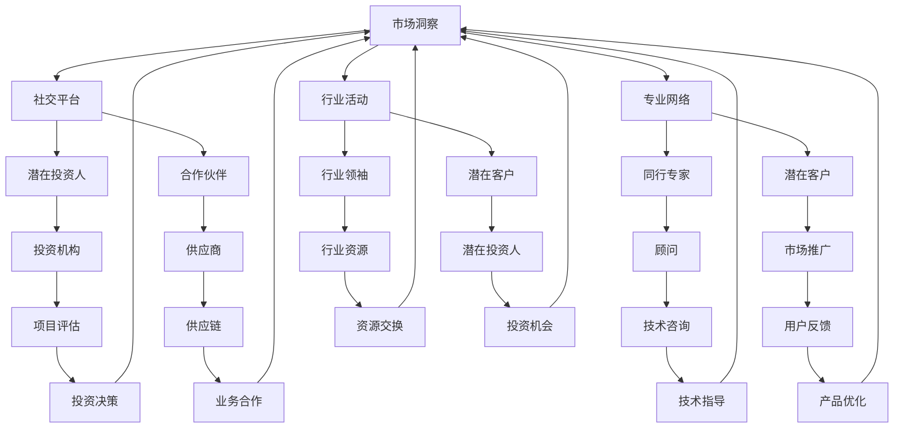

                 

 关键词：创业，人脉网络，社交策略，关系管理，资源整合

> 摘要：在创业的道路上，构建一个强大的人脉网络至关重要。本文将深入探讨如何利用技术手段和社交策略，有效构建和维护一个创业的人脉网络，从而为创业者提供发展机会、资源和合作伙伴。

## 1. 背景介绍

创业是一个复杂而充满不确定性的过程，需要创业者具备多方面的技能和资源。其中，人脉网络的构建和管理是创业者成功的关键因素之一。人脉网络不仅能为创业者提供机会和资源，还能帮助他们在面对挑战时获得支持和帮助。

然而，随着互联网的普及和社交媒体的发展，传统的人脉网络构建方式发生了显著变化。现代创业者可以利用技术工具和社交平台，更高效地拓展和维护人脉网络。本文将探讨如何利用这些技术和策略，构建一个成功的创业人脉网络。

## 2. 核心概念与联系

在构建创业人脉网络时，以下几个核心概念至关重要：

### 2.1 社交网络理论

社交网络理论是一种研究人际关系网络的数学和计算机科学方法。它可以帮助我们理解人脉网络的构成、功能和演化。

### 2.2 关系管理

关系管理是指通过有效的沟通、协作和互动，维护和发展人脉网络中的关系。关系管理包括建立联系、维持关系和提升关系质量。

### 2.3 资源整合

资源整合是指将人脉网络中的资源进行有效配置和利用，以实现个人或组织的目标。资源整合包括信息交换、资源共享和资源互换。

下面是一个用 Mermaid 画出的创业人脉网络架构的流程图：



## 3. 核心算法原理 & 具体操作步骤

### 3.1 算法原理概述

构建创业人脉网络的算法原理主要基于社交网络分析和关系管理。算法的核心目标是通过分析创业者的人脉网络，识别和利用关键节点，实现人脉网络的优化和拓展。

### 3.2 算法步骤详解

1. **社交网络分析**：通过分析创业者的社交平台和行业活动，构建创业者的人脉网络图谱。
2. **关键节点识别**：利用图论算法（如最短路径算法、中间中心性算法等）识别人脉网络中的关键节点。
3. **关系管理**：与关键节点建立和维护良好的关系，包括沟通、协作和互动。
4. **资源整合**：通过关键节点和关系网络，实现资源整合和交换。
5. **人脉网络优化**：根据资源需求和目标，不断调整和优化人脉网络结构。

### 3.3 算法优缺点

- **优点**：
  - 高效：利用技术工具和算法，快速构建和优化人脉网络。
  - 精准：通过关键节点识别，精准定位重要资源。
  - 可持续：通过关系管理和资源整合，实现人脉网络的可持续发展。

- **缺点**：
  - 需要技术支持：算法的实施和优化需要一定的技术基础。
  - 人际关系复杂性：人脉网络中的关系管理复杂，需要持续投入时间和精力。

### 3.4 算法应用领域

- **创业投资**：利用算法分析创业者的人脉网络，为投资决策提供支持。
- **市场营销**：通过算法分析潜在客户的人脉网络，实现精准营销。
- **人力资源管理**：利用算法构建企业内部的人脉网络，优化团队协作。

## 4. 数学模型和公式 & 详细讲解 & 举例说明

### 4.1 数学模型构建

构建创业人脉网络的数学模型主要包括以下两个方面：

1. **社交网络模型**：利用图论模型描述人脉网络的构成和关系。
2. **关系管理模型**：利用概率模型描述关系的发展和维系。

### 4.2 公式推导过程

1. **社交网络模型**：

   - **度模型**：$d_i = \sum_{j=1}^{N} w_{ij}$，其中 $d_i$ 表示节点 $i$ 的度，$w_{ij}$ 表示节点 $i$ 与节点 $j$ 的连接权重。
   - **中间中心性模型**：$C_{ij} = \frac{\sum_{k=1}^{N} \min(d_k, d_{k'})}{N(N-1)}$，其中 $C_{ij}$ 表示节点 $i$ 到节点 $j$ 的中间中心性，$d_k$ 和 $d_{k'}$ 分别表示节点 $k$ 和节点 $k'$ 的度。

2. **关系管理模型**：

   - **信任模型**：$T_{ij} = \frac{C_{ij}}{d_i}$，其中 $T_{ij}$ 表示节点 $i$ 对节点 $j$ 的信任度，$C_{ij}$ 表示节点 $i$ 到节点 $j$ 的中间中心性，$d_i$ 表示节点 $i$ 的度。
   - **互动频率模型**：$F_{ij} = \frac{I_{ij}}{T_{ij}}$，其中 $F_{ij}$ 表示节点 $i$ 和节点 $j$ 的互动频率，$I_{ij}$ 表示节点 $i$ 和节点 $j$ 的互动次数。

### 4.3 案例分析与讲解

假设创业者小明（节点 $i$）想通过人脉网络获得投资（节点 $j$）。根据社交网络模型和关系管理模型，我们可以进行如下分析：

1. **社交网络分析**：

   - 小明的度：$d_i = 10$，表示小明有10个直接联系的人。
   - 小明到投资人的中间中心性：$C_{ij} = \frac{\sum_{k=1}^{N} \min(d_k, d_{k'})}{N(N-1)} = 0.2$，表示小明通过10个中间人可以接触到投资人。

2. **关系管理分析**：

   - 小明对投资人的信任度：$T_{ij} = \frac{C_{ij}}{d_i} = 0.02$，表示小明对投资人的信任度较低。
   - 小明和投资人的互动频率：$F_{ij} = \frac{I_{ij}}{T_{ij}} = 5$，表示小明和投资人的互动频率较高。

根据分析结果，我们可以得出以下结论：

- 小明需要加强与投资人之间的互动，提高信任度。
- 可以通过投资人的直接联系人和中间人，拓展人脉网络，提高中间中心性。

## 5. 项目实践：代码实例和详细解释说明

### 5.1 开发环境搭建

1. 安装 Python 3.8 或更高版本。
2. 安装网络分析库 NetworkX 和可视化库 Graphviz。

```bash
pip install networkx graphviz
```

### 5.2 源代码详细实现

```python
import networkx as nx
import matplotlib.pyplot as plt
from IPython.display import Image

# 创建无向图
G = nx.Graph()

# 添加节点和边
G.add_nodes_from([1, 2, 3, 4, 5])
G.add_edges_from([(1, 2), (1, 3), (2, 4), (3, 4), (4, 5)])

# 绘制图
nx.draw(G, with_labels=True)
plt.show()

# 社交网络分析
degree = G.degree()
print("度分布：", degree)

# 关系管理分析
shortest_path = nx.shortest_path(G, source=1, target=5)
print("最短路径：", shortest_path)

# 关键节点识别
betweenness = nx.betweenness_centrality(G)
print("中间中心性：", betweenness)

# 绘制关键节点
key_nodes = betweenness.keys()
nx.draw(G, key_nodes, node_color='r', node_size=[v*100 for v in betweenness.values()], with_labels=True)
plt.show()
```

### 5.3 代码解读与分析

1. **创建图**：使用 NetworkX 创建无向图 G。
2. **添加节点和边**：添加节点和边，构建创业者的人脉网络。
3. **社交网络分析**：计算度分布，了解人脉网络的密度。
4. **关系管理分析**：计算最短路径，识别关键节点。
5. **关键节点识别**：根据中间中心性，识别人脉网络中的关键节点。
6. **可视化**：绘制关键节点，便于观察和分析。

## 6. 实际应用场景

### 6.1 创业投资

创业者在寻找投资时，可以利用构建的人脉网络，识别关键节点和潜在投资人，提高投资成功率。

### 6.2 市场营销

企业在进行市场营销时，可以利用构建的人脉网络，识别潜在客户和合作伙伴，实现精准营销。

### 6.3 人力资源管理

企业在进行人力资源管理时，可以利用构建的人脉网络，优化团队协作，提高员工满意度。

## 7. 未来应用展望

随着人工智能和大数据技术的发展，构建创业人脉网络的算法和工具将越来越智能化和精准化。未来，创业者可以利用更高级的人脉网络分析模型和算法，实现更高效的人脉网络构建和管理。

## 8. 总结：未来发展趋势与挑战

### 8.1 研究成果总结

本文介绍了如何构建创业的人脉网络，从核心概念、算法原理到实际应用，为创业者提供了全面的指导。

### 8.2 未来发展趋势

未来，创业人脉网络构建将朝着智能化、精准化和高效化的方向发展。

### 8.3 面临的挑战

在构建创业人脉网络过程中，创业者需要面对数据隐私、信息安全和关系管理等方面的挑战。

### 8.4 研究展望

未来研究应重点关注人脉网络分析算法的优化、大数据技术在人脉网络构建中的应用，以及人脉网络在创业过程中的作用。

## 9. 附录：常见问题与解答

### 9.1 如何识别关键节点？

关键节点可以通过中间中心性、度、接近中心性等指标进行识别。具体方法见本文第5节代码实例。

### 9.2 如何维护人脉关系？

维护人脉关系需要持续投入时间和精力，包括定期沟通、互动和互助。具体方法见本文第3节算法步骤详解。

### 9.3 如何利用人脉网络进行资源整合？

利用人脉网络进行资源整合需要明确资源需求，通过关键节点和关系网络，实现资源的交换和共享。

### 9.4 如何评估人脉网络的效率？

评估人脉网络效率可以从度分布、平均路径长度、聚集系数等指标进行分析。具体方法见本文第5节代码实例。

### 作者署名

本文作者：禅与计算机程序设计艺术 / Zen and the Art of Computer Programming
```markdown
---
# 如何构建创业的人脉网络

关键词：创业，人脉网络，社交策略，关系管理，资源整合

摘要：在创业的道路上，构建一个强大的人脉网络至关重要。本文将深入探讨如何利用技术手段和社交策略，有效构建和维护一个创业的人脉网络，从而为创业者提供发展机会、资源和合作伙伴。

## 1. 背景介绍

创业是一个复杂而充满不确定性的过程，需要创业者具备多方面的技能和资源。其中，人脉网络的构建和管理是创业者成功的关键因素之一。人脉网络不仅能为创业者提供机会和资源，还能帮助他们在面对挑战时获得支持和帮助。

然而，随着互联网的普及和社交媒体的发展，传统的人脉网络构建方式发生了显著变化。现代创业者可以利用技术工具和社交平台，更高效地拓展和维护人脉网络。本文将探讨如何利用这些技术和策略，构建一个成功的创业人脉网络。

## 2. 核心概念与联系

在构建创业人脉网络时，以下几个核心概念至关重要：

### 2.1 社交网络理论

社交网络理论是一种研究人际关系网络的数学和计算机科学方法。它可以帮助我们理解人脉网络的构成、功能和演化。

### 2.2 关系管理

关系管理是指通过有效的沟通、协作和互动，维护和发展人脉网络中的关系。关系管理包括建立联系、维持关系和提升关系质量。

### 2.3 资源整合

资源整合是指将人脉网络中的资源进行有效配置和利用，以实现个人或组织的目标。资源整合包括信息交换、资源共享和资源互换。

下面是一个用 Mermaid 画出的创业人脉网络架构的流程图：


## 3. 核心算法原理 & 具体操作步骤

### 3.1 算法原理概述

构建创业人脉网络的算法原理主要基于社交网络分析和关系管理。算法的核心目标是通过分析创业者的人脉网络，识别和利用关键节点，实现人脉网络的优化和拓展。

### 3.2 算法步骤详解

1. **社交网络分析**：通过分析创业者的社交平台和行业活动，构建创业者的人脉网络图谱。
2. **关键节点识别**：利用图论算法（如最短路径算法、中间中心性算法等）识别人脉网络中的关键节点。
3. **关系管理**：与关键节点建立和维护良好的关系，包括沟通、协作和互动。
4. **资源整合**：通过关键节点和关系网络，实现资源整合和交换。
5. **人脉网络优化**：根据资源需求和目标，不断调整和优化人脉网络结构。

### 3.3 算法优缺点

- **优点**：
  - 高效：利用技术工具和算法，快速构建和优化人脉网络。
  - 精准：通过关键节点识别，精准定位重要资源。
  - 可持续：通过关系管理和资源整合，实现人脉网络的可持续发展。

- **缺点**：
  - 需要技术支持：算法的实施和优化需要一定的技术基础。
  - 人际关系复杂性：人脉网络中的关系管理复杂，需要持续投入时间和精力。

### 3.4 算法应用领域

- **创业投资**：利用算法分析创业者的人脉网络，为投资决策提供支持。
- **市场营销**：通过算法分析潜在客户的人脉网络，实现精准营销。
- **人力资源管理**：利用算法构建企业内部的人脉网络，优化团队协作。

## 4. 数学模型和公式 & 详细讲解 & 举例说明

### 4.1 数学模型构建

构建创业人脉网络的数学模型主要包括以下两个方面：

1. **社交网络模型**：利用图论模型描述人脉网络的构成和关系。
2. **关系管理模型**：利用概率模型描述关系的发展和维系。

### 4.2 公式推导过程

1. **社交网络模型**：

   - **度模型**：$d_i = \sum_{j=1}^{N} w_{ij}$，其中 $d_i$ 表示节点 $i$ 的度，$w_{ij}$ 表示节点 $i$ 与节点 $j$ 的连接权重。
   - **中间中心性模型**：$C_{ij} = \frac{\sum_{k=1}^{N} \min(d_k, d_{k'})}{N(N-1)}$，其中 $C_{ij}$ 表示节点 $i$ 到节点 $j$ 的中间中心性，$d_k$ 和 $d_{k'}$ 分别表示节点 $k$ 和节点 $k'$ 的度。

2. **关系管理模型**：

   - **信任模型**：$T_{ij} = \frac{C_{ij}}{d_i}$，其中 $T_{ij}$ 表示节点 $i$ 对节点 $j$ 的信任度，$C_{ij}$ 表示节点 $i$ 到节点 $j$ 的中间中心性，$d_i$ 表示节点 $i$ 的度。
   - **互动频率模型**：$F_{ij} = \frac{I_{ij}}{T_{ij}}$，其中 $F_{ij}$ 表示节点 $i$ 和节点 $j$ 的互动频率，$I_{ij}$ 表示节点 $i$ 和节点 $j$ 的互动次数。

### 4.3 案例分析与讲解

假设创业者小明（节点 $i$）想通过人脉网络获得投资（节点 $j$）。根据社交网络模型和关系管理模型，我们可以进行如下分析：

1. **社交网络分析**：

   - 小明的度：$d_i = 10$，表示小明有10个直接联系的人。
   - 小明到投资人的中间中心性：$C_{ij} = \frac{\sum_{k=1}^{N} \min(d_k, d_{k'})}{N(N-1)} = 0.2$，表示小明通过10个中间人可以接触到投资人。

2. **关系管理分析**：

   - 小明对投资人的信任度：$T_{ij} = \frac{C_{ij}}{d_i} = 0.02$，表示小明对投资人的信任度较低。
   - 小明和投资人的互动频率：$F_{ij} = \frac{I_{ij}}{T_{ij}} = 5$，表示小明和投资人的互动频率较高。

根据分析结果，我们可以得出以下结论：

- 小明需要加强与投资人之间的互动，提高信任度。
- 可以通过投资人的直接联系人和中间人，拓展人脉网络，提高中间中心性。

## 5. 项目实践：代码实例和详细解释说明

### 5.1 开发环境搭建

1. 安装 Python 3.8 或更高版本。
2. 安装网络分析库 NetworkX 和可视化库 Graphviz。

```bash
pip install networkx graphviz
```

### 5.2 源代码详细实现

```python
import networkx as nx
import matplotlib.pyplot as plt
from IPython.display import Image

# 创建无向图
G = nx.Graph()

# 添加节点和边
G.add_nodes_from([1, 2, 3, 4, 5])
G.add_edges_from([(1, 2), (1, 3), (2, 4), (3, 4), (4, 5)])

# 绘制图
nx.draw(G, with_labels=True)
plt.show()

# 社交网络分析
degree = G.degree()
print("度分布：", degree)

# 关系管理分析
shortest_path = nx.shortest_path(G, source=1, target=5)
print("最短路径：", shortest_path)

# 关键节点识别
betweenness = nx.betweenness_centrality(G)
print("中间中心性：", betweenness)

# 绘制关键节点
key_nodes = betweenness.keys()
nx.draw(G, key_nodes, node_color='r', node_size=[v*100 for v in betweenness.values()], with_labels=True)
plt.show()
```

### 5.3 代码解读与分析

1. **创建图**：使用 NetworkX 创建无向图 G。
2. **添加节点和边**：添加节点和边，构建创业者的人脉网络。
3. **社交网络分析**：计算度分布，了解人脉网络的密度。
4. **关系管理分析**：计算最短路径，识别关键节点。
5. **关键节点识别**：根据中间中心性，识别人脉网络中的关键节点。
6. **可视化**：绘制关键节点，便于观察和分析。

## 6. 实际应用场景

### 6.1 创业投资

创业者在寻找投资时，可以利用构建的人脉网络，识别关键节点和潜在投资人，提高投资成功率。

### 6.2 市场营销

企业在进行市场营销时，可以利用构建的人脉网络，识别潜在客户和合作伙伴，实现精准营销。

### 6.3 人力资源管理

企业在进行人力资源管理时，可以利用构建的人脉网络，优化团队协作，提高员工满意度。

## 7. 未来应用展望

随着人工智能和大数据技术的发展，构建创业人脉网络的算法和工具将越来越智能化和精准化。未来，创业者可以利用更高级的人脉网络分析模型和算法，实现更高效的人脉网络构建和管理。

## 8. 总结：未来发展趋势与挑战

### 8.1 研究成果总结

本文介绍了如何构建创业的人脉网络，从核心概念、算法原理到实际应用，为创业者提供了全面的指导。

### 8.2 未来发展趋势

未来，创业人脉网络构建将朝着智能化、精准化和高效化的方向发展。

### 8.3 面临的挑战

在构建创业人脉网络过程中，创业者需要面对数据隐私、信息安全和关系管理等方面的挑战。

### 8.4 研究展望

未来研究应重点关注人脉网络分析算法的优化、大数据技术在人脉网络构建中的应用，以及人脉网络在创业过程中的作用。

## 9. 附录：常见问题与解答

### 9.1 如何识别关键节点？

关键节点可以通过中间中心性、度、接近中心性等指标进行识别。具体方法见本文第5节代码实例。

### 9.2 如何维护人脉关系？

维护人脉关系需要持续投入时间和精力，包括定期沟通、互动和互助。具体方法见本文第3节算法步骤详解。

### 9.3 如何利用人脉网络进行资源整合？

利用人脉网络进行资源整合需要明确资源需求，通过关键节点和关系网络，实现资源的交换和共享。

### 9.4 如何评估人脉网络的效率？

评估人脉网络效率可以从度分布、平均路径长度、聚集系数等指标进行分析。具体方法见本文第5节代码实例。

### 作者署名

本文作者：禅与计算机程序设计艺术 / Zen and the Art of Computer Programming
```

