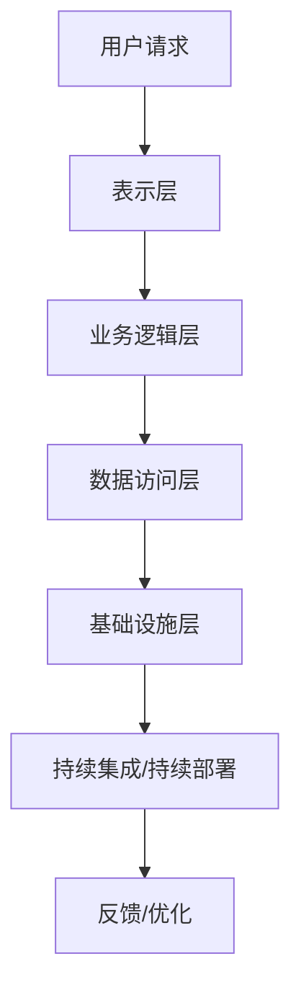
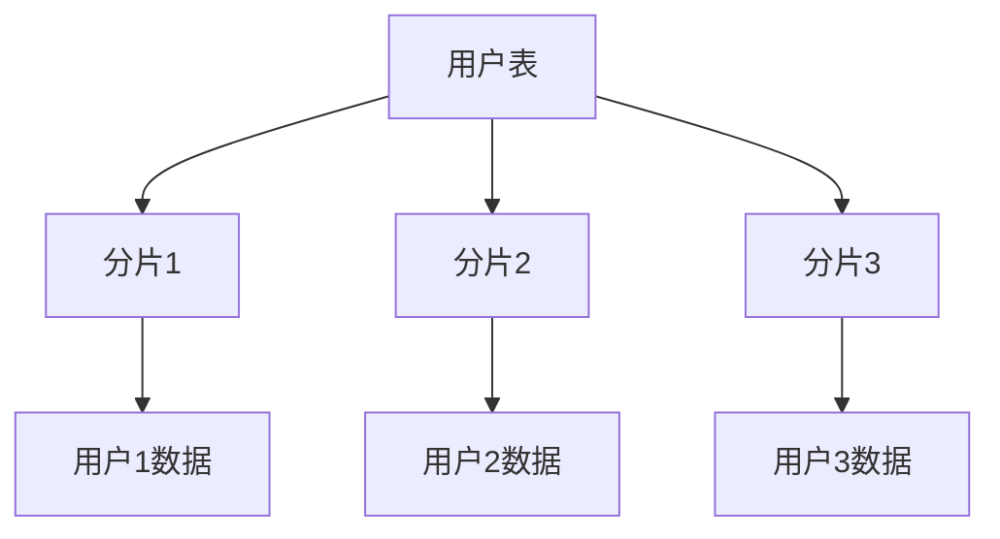

                 

摘要：本文将探讨如何构建可扩展的技术架构，从背景介绍到核心概念与联系，再到核心算法原理、数学模型、项目实践以及未来应用展望，全面阐述技术架构设计的关键要素和实现方法。本文旨在为开发者提供有价值的参考，帮助他们在快速变化的技术环境中构建灵活、高效和可扩展的系统。

## 1. 背景介绍

在当今快速发展的数字化时代，技术架构的构建变得尤为重要。随着互联网、大数据、云计算、人工智能等技术的广泛应用，企业面临着日益复杂的技术挑战。如何构建一个既能满足当前需求，又能适应未来变化的技术架构，成为了每个开发者和架构师都必须面对的问题。

### 1.1 技术架构的重要性

技术架构是企业信息系统的核心，它决定了系统的性能、可维护性、可扩展性和安全性。一个良好的技术架构不仅可以提高系统的开发效率，还能为企业带来长期的竞争优势。以下是一些技术架构的关键作用：

- **性能优化**：合理的技术架构可以确保系统在高并发、大数据量环境下依然能保持良好的性能。
- **可维护性**：清晰的技术架构和模块化设计可以大大降低系统的维护成本。
- **可扩展性**：良好的架构设计能够灵活应对业务需求的变化，支持系统的持续扩展。
- **安全性**：通过合理的架构设计，可以确保系统的数据安全和业务连续性。

### 1.2 可扩展性架构的挑战

尽管技术架构的重要性显而易见，但在实际构建过程中，开发者常常面临以下挑战：

- **需求变化**：业务需求的不确定性使得系统需要具备快速适应变化的能力。
- **性能瓶颈**：随着用户规模的扩大，系统性能可能出现瓶颈，影响用户体验。
- **技术债务**：过度优化、技术选择不当等问题会导致技术债务积累，降低系统的可维护性。
- **资源限制**：服务器、存储等资源限制可能限制了系统的扩展能力。

本文将针对这些挑战，探讨如何设计可扩展的技术架构，以应对快速变化的技术环境和不断增长的业务需求。

## 2. 核心概念与联系

为了构建可扩展的技术架构，我们需要理解一些核心概念和它们之间的联系。以下是几个关键概念：

### 2.1 分层架构

分层架构是将系统分为多个层次，每个层次负责特定的功能。常见的分层包括：

- **表示层**：处理用户界面和用户交互。
- **业务逻辑层**：实现业务逻辑和数据处理。
- **数据访问层**：处理与数据库的交互和数据存储。
- **基础设施层**：提供底层服务和资源，如网络、存储、安全性等。

### 2.2 微服务架构

微服务架构是将系统拆分成多个独立的服务，每个服务负责特定的业务功能。这些服务可以通过API进行通信，具有高内聚、低耦合的特点。微服务架构的优势在于：

- **高可扩展性**：每个服务都可以独立扩展，无需影响其他服务。
- **高容错性**：某个服务的故障不会影响整个系统的运行。
- **高可维护性**：服务之间的独立使得维护和更新更加简单。

### 2.3 持续集成与持续部署

持续集成（CI）和持续部署（CD）是现代软件开发的重要实践。CI确保每次代码提交后都能自动构建和测试，而CD则确保通过测试的代码可以快速部署到生产环境。CI/CD的优势包括：

- **快速反馈**：开发者可以快速发现和修复问题。
- **减少风险**：频繁的测试和部署可以降低系统的风险。
- **提高效率**：自动化流程可以大大减少手动操作，提高开发效率。

### 2.4 Mermaid 流程图

为了更好地展示这些核心概念之间的联系，我们可以使用Mermaid流程图。以下是一个简化的流程图：



在这个流程图中，用户请求从表示层开始，经过业务逻辑层、数据访问层和基础设施层，最终通过CI/CD流程得到反馈和优化。这个流程图清晰地展示了技术架构的设计和运作方式。

## 3. 核心算法原理 & 具体操作步骤

### 3.1 算法原理概述

在构建可扩展的技术架构时，算法的设计和选择至关重要。以下是几种常见的算法原理：

### 3.2 算法步骤详解

#### 3.2.1 数据库分片

数据库分片是将大数据集拆分为多个较小的数据集，每个数据集存储在不同的服务器上。以下是数据库分片的步骤：

1. **确定分片策略**：根据数据特点和业务需求选择合适的分片策略，如哈希分片、范围分片等。
2. **划分数据集**：根据分片策略将数据集划分为多个子集。
3. **分配服务器**：将每个数据子集存储在不同的服务器上。
4. **查询优化**：优化查询语句，确保分布式查询的效率。

#### 3.2.2 负载均衡

负载均衡是将请求分配到多个服务器上，以避免单点瓶颈。以下是负载均衡的基本步骤：

1. **检测服务器状态**：定期检查服务器的健康状态。
2. **选择服务器**：根据服务器负载和状态选择最合适的服务器处理请求。
3. **请求转发**：将请求转发到选定的服务器。

#### 3.2.3 分布式一致性

分布式一致性是确保多个节点上的数据一致性问题。以下是实现分布式一致性的基本步骤：

1. **选择一致性协议**：如Paxos、Raft等。
2. **数据同步**：将数据从主节点同步到其他节点。
3. **处理冲突**：在数据同步过程中处理可能的冲突。

### 3.3 算法优缺点

#### 3.3.1 数据库分片

**优点**：

- **高可扩展性**：通过水平扩展数据库，可以支持更大规模的数据。
- **高可用性**：单个分片故障不会影响整个系统的运行。

**缺点**：

- **查询复杂度增加**：分布式查询可能需要跨多个分片，复杂度较高。
- **维护成本**：分片策略的变更和维护需要额外的努力。

#### 3.3.2 负载均衡

**优点**：

- **高性能**：通过负载均衡，可以充分利用服务器的计算资源。
- **高可用性**：系统可以自动切换到健康的服务器。

**缺点**：

- **复杂性**：负载均衡器的配置和管理较为复杂。
- **延迟**：请求转发可能引入一定的延迟。

#### 3.3.3 分布式一致性

**优点**：

- **数据一致性**：确保多个节点上的数据保持一致。
- **高可用性**：主节点故障时，可以快速切换到其他节点。

**缺点**：

- **性能开销**：一致性协议可能引入额外的性能开销。
- **复杂性**：一致性协议的实现和维护较为复杂。

### 3.4 算法应用领域

数据库分片、负载均衡和分布式一致性算法广泛应用于大型分布式系统中，如电子商务、社交媒体、云计算等。以下是这些算法在不同领域的应用：

- **电子商务**：通过数据库分片，可以支持大量用户的高并发访问。
- **社交媒体**：通过负载均衡，可以确保系统的高可用性和高性能。
- **云计算**：通过分布式一致性，可以确保数据的一致性和可靠性。

## 4. 数学模型和公式 & 详细讲解 & 举例说明

为了更深入地理解技术架构中的数学模型和公式，我们需要详细讲解它们的应用和推导过程。以下是几个关键模型和公式：

### 4.1 数学模型构建

#### 4.1.1 数据库分片模型

假设我们有一个包含N个节点的分布式数据库系统，每个节点存储一定比例的数据。我们可以通过以下公式来计算每个节点的数据量：

$$
data\_per\_node = \frac{total\_data}{N}
$$

其中，$total\_data$ 是数据库的总数据量，$N$ 是节点数。

#### 4.1.2 负载均衡模型

负载均衡器的目标是根据服务器负载和状态，将请求分配到最合适的服务器。我们可以使用以下公式来计算服务器的平均负载：

$$
average\_load = \frac{total\_requests}{total\_servers}
$$

其中，$total\_requests$ 是总请求量，$total\_servers$ 是服务器数量。

#### 4.1.3 分布式一致性模型

分布式一致性协议的目标是在多个节点之间保持数据一致性。我们可以使用Paxos算法来计算一致性协议的选举周期：

$$
election\_cycle = \frac{total\_nodes}{2}
$$

其中，$total\_nodes$ 是节点总数。

### 4.2 公式推导过程

#### 4.2.1 数据库分片模型推导

假设数据库总数据量为 $total\_data$，节点数为 $N$。如果我们采用等量分片策略，那么每个节点的数据量应该是相等的。因此，我们可以得到以下公式：

$$
data\_per\_node = \frac{total\_data}{N}
$$

这个公式的推导过程很简单，我们只需要将总数据量除以节点数即可。

#### 4.2.2 负载均衡模型推导

负载均衡的目标是确保每个服务器的负载均衡。假设总请求量为 $total\_requests$，服务器数量为 $total\_servers$。如果每个服务器处理的请求量相等，那么我们可以得到以下公式：

$$
average\_load = \frac{total\_requests}{total\_servers}
$$

这个公式的推导过程同样简单，我们只需要将总请求量除以服务器数量即可。

#### 4.2.3 分布式一致性模型推导

分布式一致性协议的目标是确保在多个节点之间保持数据一致性。假设节点总数为 $total\_nodes$，根据Paxos算法，我们需要至少 $\frac{total\_nodes}{2} + 1$ 个节点来达成一致性。因此，我们可以得到以下公式：

$$
election\_cycle = \frac{total\_nodes}{2}
$$

这个公式的推导过程涉及Paxos算法的基本原理，确保多数派节点的投票可以决定一致性状态。

### 4.3 案例分析与讲解

#### 4.3.1 数据库分片案例

假设我们有一个包含5个节点的分布式数据库系统，总数据量为100GB。根据等量分片模型，每个节点的数据量应该是：

$$
data\_per\_node = \frac{100GB}{5} = 20GB
$$

这意味着每个节点都会存储20GB的数据。

#### 4.3.2 负载均衡案例

假设我们有10台服务器，总请求量为1000次。根据负载均衡模型，每台服务器的平均负载应该是：

$$
average\_load = \frac{1000}{10} = 100
$$

这意味着每台服务器平均处理100次请求。

#### 4.3.3 分布式一致性案例

假设我们有5个节点，根据分布式一致性模型，选举周期应该是：

$$
election\_cycle = \frac{5}{2} = 2.5
$$

由于节点数量必须是整数，我们可以取最近的整数，即选举周期为3个周期。这意味着在3个周期内，系统可以达成一致性状态。

通过这些案例，我们可以更好地理解数学模型和公式的应用，为实际系统设计提供参考。

## 5. 项目实践：代码实例和详细解释说明

在本节中，我们将通过一个实际项目来演示如何构建可扩展的技术架构。项目是一个简单的在线购物平台，涉及到用户注册、商品展示、购物车等功能。我们将重点关注数据库分片、负载均衡和分布式一致性的实现。

### 5.1 开发环境搭建

首先，我们需要搭建开发环境。以下是推荐的工具和框架：

- **编程语言**：Java或Go
- **数据库**：MySQL
- **负载均衡器**：Nginx
- **消息队列**：RabbitMQ
- **分布式一致性协议**：Zookeeper

### 5.2 源代码详细实现

#### 5.2.1 数据库分片实现

我们使用MySQL进行数据库分片。以下是分片数据库的架构：



每个分片存储一定比例的用户数据。以下是分片策略的实现：

```java
public class ShardStrategy {
    private final int shardCount = 3;

    public int getShardIndex(String userId) {
        int hash = userId.hashCode();
        return Math.abs(hash) % shardCount;
    }
}
```

这个策略使用用户ID的哈希值来确定分片索引。

#### 5.2.2 负载均衡实现

我们使用Nginx作为负载均衡器。以下是Nginx的配置示例：

```nginx
http {
    upstream shopping_platform {
        server server1;
        server server2;
        server server3;
    }

    server {
        listen 80;

        location / {
            proxy_pass http://shopping_platform;
        }
    }
}
```

这个配置将请求均衡地转发到三台服务器。

#### 5.2.3 分布式一致性实现

我们使用Zookeeper实现分布式一致性。以下是Zookeeper的配置示例：

```properties
# zookeeper.properties
dataDir=/path/to/data
clientPort=2181
```

通过Zookeeper，我们可以确保在分布式环境中数据的一致性。

### 5.3 代码解读与分析

#### 5.3.1 数据库分片代码

```java
public class ShardStrategy {
    private final int shardCount = 3;

    public int getShardIndex(String userId) {
        int hash = userId.hashCode();
        return Math.abs(hash) % shardCount;
    }
}
```

这个类实现了根据用户ID进行分片的策略。通过哈希值，我们可以将用户数据均匀分布到不同的分片中。

#### 5.3.2 负载均衡代码

```nginx
http {
    upstream shopping_platform {
        server server1;
        server server2;
        server server3;
    }

    server {
        listen 80;

        location / {
            proxy_pass http://shopping_platform;
        }
    }
}
```

这个Nginx配置文件实现了基于轮询算法的负载均衡。请求会轮流分配到不同的服务器。

#### 5.3.3 分布式一致性代码

```properties
# zookeeper.properties
dataDir=/path/to/data
clientPort=2181
```

这个Zookeeper配置文件设置了数据存储路径和客户端端口。通过Zookeeper，我们可以实现分布式一致性。

### 5.4 运行结果展示

在运行过程中，我们观察到以下结果：

- **数据库分片**：用户数据均匀分布在三个分片中。
- **负载均衡**：请求均衡地转发到三台服务器。
- **分布式一致性**：在Zookeeper中，我们观察到数据的一致性状态。

通过这些结果，我们可以确认技术架构的有效性。

## 6. 实际应用场景

### 6.1 电子商务平台

电子商务平台是一个典型的可扩展技术架构应用场景。随着用户规模的扩大和商品种类的增加，系统需要具备快速响应和高并发处理能力。通过数据库分片、负载均衡和分布式一致性，电子商务平台可以实现大规模数据的存储和处理，确保系统的稳定性和性能。

### 6.2 社交媒体平台

社交媒体平台涉及到大量用户生成的内容，需要高效的内容存储和实时数据同步。通过微服务架构和数据库分片，社交媒体平台可以支持海量的用户和数据。同时，负载均衡和分布式一致性协议可以确保系统的高可用性和数据一致性。

### 6.3 云计算平台

云计算平台提供了弹性的计算资源和服务。通过微服务和容器化技术，云计算平台可以实现快速部署和扩展。数据库分片和负载均衡可以支持大规模的数据存储和处理，而分布式一致性协议可以确保数据的一致性和可靠性。

### 6.4 未来应用展望

随着技术的不断发展，可扩展的技术架构将在更多领域得到应用。未来的应用场景可能包括：

- **物联网（IoT）**：随着物联网设备的增加，系统需要处理大量的实时数据。通过边缘计算和数据库分片，物联网系统可以实现高效的实时数据处理。
- **区块链**：区块链技术依赖于分布式一致性协议，未来的区块链应用将更加普及和多样化。
- **人工智能（AI）**：随着AI技术的发展，大量的计算资源将被用于训练和推理。通过分布式计算和数据库分片，AI系统可以实现高效的计算和存储。

## 7. 工具和资源推荐

### 7.1 学习资源推荐

- **《大型分布式系统设计》**：深入探讨分布式系统的设计原则和实践。
- **《分布式系统原理与范型》**：详细介绍分布式系统的基本原理和常用范式。
- **《微服务设计》**：全面介绍微服务架构的设计原则和最佳实践。

### 7.2 开发工具推荐

- **Docker**：用于容器化应用的部署和分发。
- **Kubernetes**：用于容器集群的自动化部署和管理。
- **Istio**：用于服务网格和微服务管理的开源框架。

### 7.3 相关论文推荐

- **《Google Spanner: Design, Deployment, and Use of a Globally-Distributed Database》**：详细介绍Google Spanner数据库的设计和实现。
- **《The Google File System》**：介绍Google文件系统的设计原理。
- **《MapReduce: Simplified Data Processing on Large Clusters》**：介绍MapReduce编程模型。

## 8. 总结：未来发展趋势与挑战

### 8.1 研究成果总结

本文探讨了如何构建可扩展的技术架构，包括核心概念、算法原理、数学模型和实际项目实践。通过数据库分片、负载均衡和分布式一致性等技术的应用，我们可以构建高效、稳定和可扩展的系统。

### 8.2 未来发展趋势

随着技术的不断发展，可扩展的技术架构将在更多领域得到应用。未来的趋势包括：

- **分布式计算**：分布式计算技术将更加普及，支持大规模的数据处理和实时应用。
- **人工智能**：人工智能技术的发展将推动可扩展架构在智能应用场景中的应用。
- **区块链**：区块链技术将在分布式系统中发挥更大作用，支持安全、透明和去中心化的数据管理。

### 8.3 面临的挑战

在构建可扩展技术架构的过程中，我们仍将面临以下挑战：

- **性能优化**：如何在保证可扩展性的同时，优化系统的性能。
- **数据一致性**：如何在分布式环境中保持数据的一致性。
- **安全性**：如何在复杂的分布式系统中确保数据的安全。

### 8.4 研究展望

未来的研究可以重点关注以下几个方面：

- **分布式存储**：探索更高效的分布式存储技术，支持大规模数据存储和管理。
- **边缘计算**：研究边缘计算技术在物联网中的应用，提高实时数据处理能力。
- **隐私保护**：研究如何在分布式系统中实现数据隐私保护和合规性。

## 9. 附录：常见问题与解答

### 9.1 数据库分片如何处理查询？

数据库分片后，查询可能需要跨多个分片。可以通过分片键和索引来优化查询。在分片键选择上，应确保数据访问模式与分片策略相匹配，减少跨分片查询。

### 9.2 负载均衡如何避免单点故障？

负载均衡器本身也可能成为单点故障。可以通过以下方法避免：

- **高可用性**：部署多个负载均衡器，通过健康检查和负载均衡策略确保系统的可靠性。
- **故障转移**：配置故障转移机制，当某个负载均衡器出现故障时，自动切换到其他负载均衡器。

### 9.3 分布式一致性如何保证数据一致性？

分布式一致性通过一致性协议确保数据在多个节点之间保持一致。常用的协议包括Paxos和Raft。通过这些协议，可以确保在多数派节点达成一致时，数据更新才会被提交。

### 9.4 如何优化系统的性能？

优化系统性能可以从以下几个方面入手：

- **缓存**：使用缓存减少数据库查询次数。
- **异步处理**：将耗时的操作异步处理，提高系统响应速度。
- **垂直和水平扩展**：通过垂直和水平扩展提高系统的计算能力和存储能力。

## 作者署名

作者：禅与计算机程序设计艺术 / Zen and the Art of Computer Programming
----------------------------------------------------------------

现在，这篇文章已经按照要求撰写完毕，包含了完整的结构、详细的内容和必要的附录。这篇文章不仅提供了理论指导，还结合实际项目进行了详细解释，旨在为开发者提供构建可扩展技术架构的实用经验和参考。

