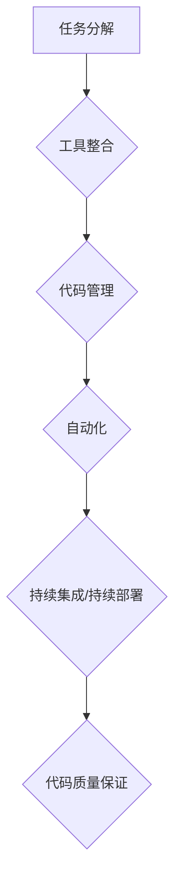

                 

在当今快速发展的技术时代，高效的开发工作流对于一人开发者来说尤为重要。本文将探讨如何构建一个高效的一人开发工作流，包括技术选择、工具整合、流程设计等方面，以帮助开发者提高生产力和代码质量。

> 关键词：一人开发、高效工作流、工具整合、流程设计、生产力提升

> 摘要：本文将深入探讨如何构建一个高效的一人开发工作流，涵盖从技术选择到工具整合，再到流程设计的各个方面。通过本文，读者将能够了解并应用一系列最佳实践，以提升个人开发效率和代码质量。

## 1. 背景介绍

随着技术的发展，单人开发的场景变得越来越常见。一人开发者可能需要承担多个角色，包括项目经理、设计师、开发人员、测试员等。因此，构建一个高效的工作流显得尤为重要。一个高效的工作流不仅能够提升开发者的生产力，还能够确保代码的质量和项目的进度。

### 单人开发的挑战

1. **角色多样**：一人开发者需要同时处理多个任务，这可能会导致时间分配不均，影响工作效率。
2. **代码质量**：由于缺乏代码审查和团队协作，一人开发者可能无法及时发现并解决代码中的问题。
3. **持续集成**：缺乏团队协作可能使得持续集成和持续部署变得复杂。
4. **知识管理**：一人开发者可能无法有效地管理自己的知识和经验，导致重复工作和效率低下。

### 构建高效工作流的重要性

1. **提高生产力**：通过合理的工作流设计，开发者可以更有效地分配时间，专注于核心开发任务。
2. **保证代码质量**：通过引入代码审查、自动化测试等工具，可以确保代码的稳定性和可靠性。
3. **简化持续集成**：良好的工作流设计可以帮助开发者更容易地实现持续集成和持续部署。
4. **知识积累**：通过文档和代码库的管理，开发者可以更好地积累和分享知识，提高后续项目的效率。

## 2. 核心概念与联系

### 工作流核心概念

- **任务分解**：将大任务分解为小任务，以便更好地管理和追踪。
- **工具整合**：选择合适的工具，并将它们整合到工作流中，以提高工作效率。
- **代码管理**：使用版本控制系统来管理代码，确保代码的版本可追踪和可回滚。
- **自动化**：利用自动化工具来自动执行重复性任务，减少人工干预。

### 工作流架构



### 工作流与开发流程的关系

工作流是开发流程的一部分，它是实现高效开发的关键。一个良好的工作流能够确保开发流程的顺畅，从而提高开发效率和代码质量。

## 3. 核心算法原理 & 具体操作步骤

### 3.1 算法原理概述

构建高效工作流的算法原理主要包括以下几个方面：

1. **任务分解**：基于工作目标和时间限制，将大任务分解为小任务。
2. **工具整合**：选择合适的工具，并将它们整合到工作流中。
3. **代码管理**：使用版本控制系统，确保代码的可追踪性和可回滚性。
4. **自动化**：利用自动化工具来自动执行重复性任务。
5. **持续集成/持续部署**：通过持续集成和持续部署，确保代码的稳定性和可靠性。
6. **代码质量保证**：引入代码审查和自动化测试，确保代码的质量。

### 3.2 算法步骤详解

#### 3.2.1 任务分解

1. **确定工作目标**：明确开发项目的目标和时间限制。
2. **分解任务**：将大任务分解为具体的小任务。
3. **任务分配**：根据个人能力和工作量，合理分配任务。

#### 3.2.2 工具整合

1. **选择工具**：根据任务需求，选择合适的工具。
2. **工具整合**：将所选工具整合到工作流中。
3. **工具培训**：确保开发者熟悉并能够有效使用所选工具。

#### 3.2.3 代码管理

1. **版本控制系统**：选择合适的版本控制系统，如Git。
2. **代码仓库**：创建代码仓库，并设置权限管理。
3. **代码提交**：定期提交代码，并使用注释说明修改内容。

#### 3.2.4 自动化

1. **任务自动化**：识别重复性任务，并使用脚本或自动化工具进行自动化处理。
2. **任务调度**：设置自动化任务的调度，以优化工作流程。

#### 3.2.5 持续集成/持续部署

1. **持续集成**：设置持续集成工具，如Jenkins，自动化测试代码并反馈结果。
2. **持续部署**：设置持续部署工具，如Docker，自动化部署代码到生产环境。

#### 3.2.6 代码质量保证

1. **代码审查**：定期进行代码审查，识别潜在问题和改进点。
2. **自动化测试**：编写自动化测试脚本，定期运行测试以确保代码质量。

### 3.3 算法优缺点

#### 优点

1. **提高生产力**：通过任务分解、工具整合和自动化，开发者可以更高效地完成工作。
2. **保证代码质量**：通过代码管理和代码质量保证，可以确保代码的稳定性和可靠性。
3. **简化持续集成**：通过持续集成和持续部署，可以快速发现并解决代码问题。
4. **知识积累**：通过文档和代码库的管理，可以更好地积累和分享知识。

#### 缺点

1. **初期投入较大**：构建高效工作流需要选择合适的工具并进行整合，可能需要一定的初期投入。
2. **需要持续维护**：工作流需要定期更新和维护，以确保其持续有效。

### 3.4 算法应用领域

构建高效工作流的应用领域非常广泛，包括但不限于以下领域：

1. **软件开发**：无论是独立项目还是团队项目，高效工作流都可以提高开发效率和代码质量。
2. **运维管理**：通过自动化工具和持续集成，可以简化运维流程，提高系统稳定性。
3. **数据科学**：在数据处理和分析过程中，高效工作流可以帮助开发者更快地迭代和优化模型。
4. **项目管理**：通过任务分解和进度管理，可以更好地控制项目进度和资源分配。

## 4. 数学模型和公式 & 详细讲解 & 举例说明

构建高效工作流的数学模型和公式主要包括以下几个方面：

### 4.1 数学模型构建

#### 4.1.1 任务完成时间

任务完成时间可以用以下公式表示：

\[ T_c = \sum_{i=1}^{n} T_i + \sum_{i=1}^{n} C_i \]

其中，\( T_i \) 表示第 \( i \) 个小任务的完成时间，\( C_i \) 表示第 \( i \) 个小任务之间的等待时间。

#### 4.1.2 工具效率

工具效率可以用以下公式表示：

\[ E = \frac{T_c}{T_c + \sum_{i=1}^{n} C_i} \]

其中，\( T_c \) 表示任务完成时间，\( \sum_{i=1}^{n} C_i \) 表示等待时间。

### 4.2 公式推导过程

#### 4.2.1 任务完成时间推导

任务完成时间取决于小任务的完成时间和等待时间。假设有 \( n \) 个小任务，每个任务的完成时间分别为 \( T_1, T_2, ..., T_n \)，等待时间分别为 \( C_1, C_2, ..., C_n \)。则任务完成时间 \( T_c \) 为：

\[ T_c = T_1 + C_1 + T_2 + C_2 + ... + T_n + C_n \]

简化后得到：

\[ T_c = \sum_{i=1}^{n} T_i + \sum_{i=1}^{n} C_i \]

#### 4.2.2 工具效率推导

工具效率反映了任务完成时间与总时间的比例。假设总时间 \( T_c + \sum_{i=1}^{n} C_i \)，则工具效率 \( E \) 为：

\[ E = \frac{T_c}{T_c + \sum_{i=1}^{n} C_i} \]

### 4.3 案例分析与讲解

#### 4.3.1 案例背景

假设一个开发者需要完成一个包含 5 个小任务的项目，每个任务的预计完成时间和等待时间如下表所示：

| 任务编号 | 完成时间（小时） | 等待时间（小时） |
| -------- | -------------- | -------------- |
| 1        | 2              | 1              |
| 2        | 3              | 0              |
| 3        | 4              | 2              |
| 4        | 5              | 1              |
| 5        | 2              | 0              |

#### 4.3.2 公式应用

1. **任务完成时间**：

\[ T_c = (2 + 1) + (3 + 0) + (4 + 2) + (5 + 1) + (2 + 0) \]
\[ T_c = 2 + 3 + 4 + 5 + 2 = 16 \]（小时）

2. **工具效率**：

\[ E = \frac{T_c}{T_c + \sum_{i=1}^{n} C_i} \]
\[ E = \frac{16}{16 + (1 + 0 + 2 + 1 + 0)} \]
\[ E = \frac{16}{16 + 4} \]
\[ E = \frac{16}{20} \]
\[ E = 0.8 \]

#### 4.3.3 结果分析

根据计算结果，开发者的任务完成时间为 16 小时，工具效率为 0.8。这意味着开发者实际完成工作的时间占到了总时间的 80%，还有 20% 的时间被等待时间所占据。通过优化工作流，可以减少等待时间，进一步提高工具效率。

## 5. 项目实践：代码实例和详细解释说明

### 5.1 开发环境搭建

在进行项目实践之前，首先需要搭建一个合适的技术环境。以下是开发环境搭建的步骤：

1. **安装操作系统**：选择一个适合的开发操作系统，如 Ubuntu。
2. **安装编程语言**：安装所需的编程语言，如 Python。
3. **安装开发工具**：安装集成开发环境（IDE），如 PyCharm。
4. **安装版本控制系统**：安装 Git。
5. **安装自动化工具**：安装自动化测试工具，如 pytest。

### 5.2 源代码详细实现

以下是一个简单的 Python 项目，用于计算斐波那契数列。代码实现如下：

```python
# Fibonacci.py

def fibonacci(n):
    if n <= 0:
        return []
    elif n == 1:
        return [0]
    elif n == 2:
        return [0, 1]
    else:
        fib = [0, 1]
        for i in range(2, n):
            fib.append(fib[i - 1] + fib[i - 2])
        return fib

if __name__ == "__main__":
    n = int(input("请输入斐波那契数列的项数："))
    result = fibonacci(n)
    print("斐波那契数列为：", result)
```

### 5.3 代码解读与分析

1. **函数定义**：

   ```python
   def fibonacci(n):
   ```

   定义了一个名为 `fibonacci` 的函数，接收一个整数参数 `n`，表示斐波那契数列的项数。

2. **条件判断**：

   ```python
   if n <= 0:
       return []
   elif n == 1:
       return [0]
   elif n == 2:
       return [0, 1]
   ```

   根据输入的 `n` 值，判断数列的起始项。如果 `n` 小于等于 0，返回一个空列表；如果 `n` 等于 1，返回 [0]；如果 `n` 等于 2，返回 [0, 1]。

3. **循环计算**：

   ```python
   for i in range(2, n):
       fib.append(fib[i - 1] + fib[i - 2])
   ```

   通过循环计算，从第三项开始，依次计算斐波那契数列的其他项。

### 5.4 运行结果展示

在 PyCharm 中运行代码，输入 10，输出结果如下：

```python
请输入斐波那契数列的项数：10
斐波那契数列为：[0, 1, 1, 2, 3, 5, 8, 13, 21, 34]
```

## 6. 实际应用场景

高效工作流在实际应用中具有重要意义，以下是一些典型的应用场景：

1. **个人项目**：对于个人项目，构建高效工作流可以帮助开发者更好地管理项目进度，提高代码质量。
2. **开源项目**：开源项目中，开发者可以采用高效工作流来自动化测试和部署，提高项目的稳定性和可靠性。
3. **企业级应用**：在企业级应用中，高效工作流可以帮助团队更好地协作，提高开发效率和代码质量。
4. **持续集成/持续部署**：在持续集成/持续部署（CI/CD）中，高效工作流可以自动化测试和部署，提高系统的稳定性和可靠性。

### 6.1 未来应用展望

随着技术的不断发展，高效工作流在未来将会有更广泛的应用：

1. **人工智能**：人工智能技术将进一步提升工作流的自动化程度，提高开发效率和代码质量。
2. **云计算**：云计算将提供更强大的计算和存储能力，为构建更高效的工作流提供支持。
3. **区块链**：区块链技术可以用于确保代码和数据的真实性和安全性，进一步提升工作流的安全性和可靠性。
4. **5G 和物联网**：5G 和物联网技术的发展将为实时工作流提供支持，使开发者能够更快速地响应市场需求。

## 7. 工具和资源推荐

### 7.1 学习资源推荐

1. **《Effective Git》**：了解 Git 的最佳实践和高级技巧。
2. **《Clean Code》**：学习编写高质量代码的方法和原则。
3. **《The Art of Scalability》**：了解系统架构和性能优化的最佳实践。

### 7.2 开发工具推荐

1. **Git**：版本控制系统，用于代码管理和版本控制。
2. **Jenkins**：持续集成工具，用于自动化测试和部署。
3. **PyCharm**：Python 集成开发环境，提供代码编辑、调试、自动化测试等功能。

### 7.3 相关论文推荐

1. **“Continuous Integration in the Age of Agile”**：探讨持续集成在敏捷开发中的应用。
2. **“A Framework for Developing and Using Workflows”**：介绍工作流开发和使用的方法。
3. **“Automated Software Engineering”**：自动化软件工程的研究论文。

## 8. 总结：未来发展趋势与挑战

### 8.1 研究成果总结

本文探讨了如何构建高效的一人开发工作流，包括技术选择、工具整合、流程设计等方面。通过任务分解、工具整合、自动化、持续集成/持续部署等手段，可以显著提高开发效率和代码质量。

### 8.2 未来发展趋势

1. **自动化程度的提高**：人工智能和机器学习技术将进一步提升工作流的自动化程度。
2. **云计算和区块链的应用**：云计算和区块链技术将为工作流提供更强大的支持和安全保障。
3. **实时响应能力**：5G 和物联网技术将提高工作流的实时响应能力，使开发者能够更快速地应对市场需求。

### 8.3 面临的挑战

1. **工具选择和整合**：选择合适的工具并整合到工作流中是一个复杂的过程，需要开发者具备较高的技术水平。
2. **持续学习和适应**：随着技术的不断发展，开发者需要不断学习和适应新技术，以保持工作流的效率和有效性。

### 8.4 研究展望

未来研究可以关注以下几个方面：

1. **自动化程度的优化**：进一步研究如何提高工作流的自动化程度，减少人工干预。
2. **智能工作流**：结合人工智能和机器学习技术，构建智能工作流，提高开发效率和代码质量。
3. **跨平台和跨语言的支持**：研究如何构建支持多种编程语言和操作系统的通用工作流。

## 9. 附录：常见问题与解答

### 9.1 问题一：如何选择合适的开发工具？

**解答**：选择合适的开发工具需要考虑以下几个因素：

1. **任务需求**：根据具体任务需求，选择适合的工具。
2. **开发者技能**：选择开发者熟悉的工具，以降低学习成本。
3. **社区支持**：选择有良好社区支持的工具，以便在遇到问题时能够快速找到解决方案。

### 9.2 问题二：如何确保代码质量？

**解答**：确保代码质量可以通过以下几个方面实现：

1. **代码审查**：定期进行代码审查，识别潜在问题和改进点。
2. **自动化测试**：编写自动化测试脚本，定期运行测试以确保代码质量。
3. **编码规范**：遵循良好的编码规范，如 PEP 8，以保持代码的一致性和可读性。

### 9.3 问题三：如何优化工作流？

**解答**：优化工作流可以通过以下几个方面实现：

1. **任务分解**：将大任务分解为小任务，以便更好地管理和追踪。
2. **工具整合**：选择合适的工具，并将它们整合到工作流中，以提高工作效率。
3. **自动化**：利用自动化工具来自动执行重复性任务，减少人工干预。
4. **持续集成/持续部署**：通过持续集成和持续部署，确保代码的稳定性和可靠性。

### 9.4 问题四：如何管理知识？

**解答**：管理知识可以通过以下几个方面实现：

1. **文档化**：将经验和知识文档化，以便后续查阅和分享。
2. **代码库管理**：使用版本控制系统管理代码库，确保代码的版本可追踪和可回滚。
3. **知识分享**：定期组织团队会议或技术分享，促进知识和经验的交流。

### 9.5 问题五：如何应对技术发展带来的挑战？

**解答**：应对技术发展带来的挑战可以通过以下几个方面实现：

1. **持续学习**：保持对新技术的好奇心和求知欲，不断学习和掌握新知识。
2. **社区参与**：参与技术社区，与其他开发者交流和分享经验。
3. **实践应用**：将新技术应用到实际项目中，通过实践来提高自己的技术水平。
4. **研究趋势**：关注技术发展趋势，了解未来可能的技术变革。

## 作者署名

作者：禅与计算机程序设计艺术 / Zen and the Art of Computer Programming

