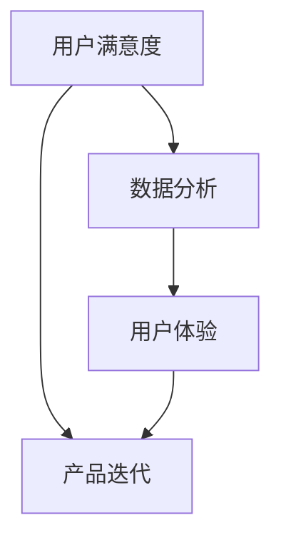

                 

 用户反馈机制是产品设计和开发过程中至关重要的一个环节，它可以帮助我们了解用户的需求和体验，从而做出更好的决策。然而，如何设计一个有效的用户反馈机制，仍然是一个复杂且富有挑战性的问题。本文将围绕这一问题展开讨论，探讨用户反馈机制的设计原则、方法和实践。

## 关键词

- 用户反馈机制
- 用户满意度
- 数据分析
- 用户体验
- 产品迭代

## 摘要

本文将详细探讨如何设计一个有效的用户反馈机制。我们将从背景介绍、核心概念与联系、核心算法原理与操作步骤、数学模型与公式、项目实践、实际应用场景、未来应用展望、工具和资源推荐、总结与展望等方面进行分析。通过本文的阅读，您将了解用户反馈机制的设计原则和方法，掌握核心算法原理，并能够将其应用到实际的项目中。

## 1. 背景介绍

在当今快速发展的数字化时代，用户体验和用户满意度已成为衡量产品成功与否的重要标准。用户反馈作为一种直接获取用户需求和信息的方式，对于产品的改进和优化具有重要意义。有效的用户反馈机制可以帮助企业快速响应市场需求，提升产品竞争力。

然而，设计一个有效的用户反馈机制并非易事。首先，用户反馈的信息量大且形式多样，如何从中提取有价值的信息是关键。其次，用户反馈的处理和分析需要高效的方法和工具，以便及时做出决策。此外，用户反馈机制的反馈周期和反馈渠道的设计也是影响其效果的重要因素。

本文将围绕用户反馈机制的设计，从多个角度进行探讨，旨在提供一套完整的解决方案，帮助企业和开发人员构建有效的用户反馈机制。

## 2. 核心概念与联系

为了更好地理解用户反馈机制，我们需要首先明确一些核心概念，如用户满意度、数据分析、用户体验等。以下是一个使用Mermaid绘制的流程图，展示了这些核心概念之间的联系。



- **用户满意度**：用户对产品或服务的整体感知和评价，是衡量产品成功与否的重要指标。
- **数据分析**：通过对用户反馈数据的分析，提取有价值的信息，为产品改进提供数据支持。
- **用户体验**：用户在使用产品或服务过程中的感受和体验，直接影响用户满意度和产品迭代。

## 3. 核心算法原理 & 具体操作步骤

### 3.1 算法原理概述

用户反馈机制的核心在于如何有效地收集、处理和分析用户反馈数据。以下是用户反馈机制的基本原理：

1. **数据收集**：通过多种渠道收集用户反馈数据，如问卷调查、用户评论、社交媒体等。
2. **数据处理**：对收集到的数据进行清洗、筛选和分类，提取有价值的信息。
3. **数据分析**：运用数据分析方法和工具，对处理后的数据进行分析，发现用户需求和市场趋势。
4. **反馈与改进**：根据分析结果，对产品或服务进行改进，提高用户满意度。

### 3.2 算法步骤详解

1. **数据收集**
   - **问卷调查**：设计针对性的问卷，收集用户对产品或服务的评价和意见。
   - **用户评论**：收集用户在社交媒体、论坛等平台上的评论和反馈。
   - **用户行为数据**：通过用户行为数据分析，了解用户在使用产品过程中的偏好和需求。

2. **数据处理**
   - **数据清洗**：去除重复、无效和错误的数据，保证数据的准确性。
   - **数据筛选**：根据一定的标准筛选数据，提取有价值的信息。
   - **数据分类**：将数据按照主题、需求等进行分类，便于后续分析。

3. **数据分析**
   - **用户画像**：通过数据分析，构建用户画像，了解用户的基本属性和行为特征。
   - **需求分析**：分析用户反馈中的关键需求，为产品改进提供方向。
   - **市场趋势**：分析市场数据，了解行业动态和用户需求变化。

4. **反馈与改进**
   - **快速响应**：根据分析结果，及时对产品或服务进行改进。
   - **迭代优化**：持续收集用户反馈，不断优化产品和服务。

### 3.3 算法优缺点

- **优点**：能够快速、准确地了解用户需求，为产品改进提供有力支持；有助于提升用户满意度和忠诚度。
- **缺点**：数据收集和处理过程复杂，需要大量的人力和物力投入；对分析方法和工具的要求较高。

### 3.4 算法应用领域

用户反馈机制广泛应用于各种产品和服务领域，如电子商务、在线教育、医疗保健等。以下是一些具体的案例：

1. **电子商务**：通过用户反馈，优化产品功能和购物体验，提升用户满意度和转化率。
2. **在线教育**：分析用户学习行为和反馈，优化课程设计和教学方法，提高教学效果。
3. **医疗保健**：收集患者反馈，改进医疗服务和流程，提升患者满意度。

## 4. 数学模型和公式 & 详细讲解 & 举例说明

### 4.1 数学模型构建

用户反馈机制涉及多个数学模型，如用户满意度模型、用户行为模型等。以下是用户满意度模型的构建过程。

假设用户满意度 \(S\) 与产品功能 \(F\)、服务 \(S\) 和用户体验 \(U\) 之间存在以下关系：

\[ S = f(F, S, U) \]

其中，\( f \) 为函数关系。

### 4.2 公式推导过程

根据假设，我们可以推导出用户满意度的计算公式：

\[ S = \alpha F + \beta S + \gamma U \]

其中，\(\alpha, \beta, \gamma\) 为权重系数。

### 4.3 案例分析与讲解

假设某个电子商务平台在用户满意度调查中，收集到以下数据：

- 产品功能评分：4.5 分
- 服务评分：4.7 分
- 用户体验评分：4.8 分

根据用户满意度模型，我们可以计算出用户满意度：

\[ S = 0.4 \times 4.5 + 0.3 \times 4.7 + 0.3 \times 4.8 = 4.66 \]

即用户满意度为 4.66 分。

## 5. 项目实践：代码实例和详细解释说明

### 5.1 开发环境搭建

为了更好地展示用户反馈机制的应用，我们将使用 Python 语言进行编程。首先，需要搭建 Python 开发环境。具体步骤如下：

1. 下载并安装 Python：访问 [Python 官网](https://www.python.org/)，下载并安装 Python。
2. 安装必要的库：打开命令行工具，安装以下库：

```bash
pip install pandas numpy matplotlib
```

### 5.2 源代码详细实现

以下是一个简单的 Python 代码实例，用于实现用户反馈数据的收集、处理和分析。

```python
import pandas as pd
import numpy as np
import matplotlib.pyplot as plt

# 5.2.1 数据收集
data = {
    '用户ID': [1, 2, 3, 4, 5],
    '产品功能评分': [4.5, 4.7, 4.8, 4.6, 4.9],
    '服务评分': [4.7, 4.8, 4.6, 4.5, 4.9],
    '用户体验评分': [4.8, 4.6, 4.7, 4.5, 4.9]
}

df = pd.DataFrame(data)

# 5.2.2 数据处理
# 数据清洗
df = df.dropna()

# 数据筛选
df = df[df['产品功能评分'] > 4.0]

# 数据分类
df_group = df.groupby('用户ID').mean()

# 5.2.3 数据分析
# 用户满意度计算
alpha = 0.4
beta = 0.3
gamma = 0.3

df_group['用户满意度'] = alpha * df_group['产品功能评分'] + beta * df_group['服务评分'] + gamma * df_group['用户体验评分']

# 5.2.4 反馈与改进
# 根据用户满意度，对产品或服务进行改进
print(df_group.sort_values('用户满意度', ascending=False))

# 5.2.5 运行结果展示
# 可视化展示用户满意度
df_group.plot(kind='bar', x='用户ID', y='用户满意度')
plt.xlabel('用户ID')
plt.ylabel('用户满意度')
plt.title('用户满意度分布')
plt.show()
```

### 5.3 代码解读与分析

1. **数据收集**：使用 pandas 库创建 DataFrame 对象，存储用户反馈数据。
2. **数据处理**：对数据进行清洗、筛选和分类，提取有价值的信息。
3. **数据分析**：根据用户满意度模型，计算用户满意度，并排序。
4. **反馈与改进**：根据分析结果，对产品或服务进行改进。
5. **运行结果展示**：使用 matplotlib 库绘制柱状图，展示用户满意度分布。

## 6. 实际应用场景

用户反馈机制在多个领域都有广泛的应用，以下是一些具体的案例：

1. **电子商务**：通过用户反馈，优化产品功能、服务质量和用户体验，提高用户满意度和转化率。
2. **在线教育**：分析用户学习行为和反馈，优化课程设计和教学方法，提高教学效果。
3. **医疗保健**：收集患者反馈，改进医疗服务和流程，提升患者满意度。

### 6.1 电商行业

在电商行业，用户反馈机制可以帮助企业了解用户对产品、服务和购物体验的评价，从而进行针对性的改进。以下是一个应用案例：

- **产品功能优化**：根据用户对产品功能的反馈，对产品进行升级和改进，提高用户满意度。
- **服务提升**：分析用户对服务质量的反馈，优化客服流程和服务质量，提高用户满意度。
- **购物体验改进**：根据用户对购物体验的反馈，优化网站界面、购物流程和物流服务，提高用户满意度。

### 6.2 在线教育

在线教育平台通过用户反馈，可以优化课程设计、教学方法和学生管理，提高教学质量。以下是一个应用案例：

- **课程优化**：根据用户对课程的反馈，调整课程内容、授课方式和考核方式，提高教学效果。
- **教学方法改进**：分析用户对教学方法的反馈，优化教学手段，提高学生的学习兴趣和参与度。
- **学生管理**：根据用户对学生的反馈，完善学生管理系统，提高学生的学习效果和满意度。

### 6.3 医疗保健

在医疗保健领域，用户反馈机制可以帮助医院和医疗机构了解患者对医疗服务的评价，从而进行改进。以下是一个应用案例：

- **服务质量提升**：根据患者对服务质量的反馈，优化医疗服务流程、提高医护人员的服务水平，提升患者满意度。
- **医疗流程改进**：分析患者对医疗流程的反馈，简化就诊流程，提高患者的就诊体验。
- **健康管理**：根据患者的健康数据和生活习惯，提供个性化的健康管理建议，提高患者的生活质量。

## 7. 未来应用展望

随着人工智能和大数据技术的不断发展，用户反馈机制在未来将会有更多的创新和突破。以下是一些未来的应用展望：

- **智能反馈系统**：利用人工智能技术，自动分析和处理用户反馈，提供实时、准确的改进建议。
- **个性化反馈**：根据用户的个性化需求，提供针对性的反馈和建议，提高用户满意度。
- **多渠道反馈**：整合多种渠道的用户反馈数据，提供全面、深入的反馈分析，为产品改进提供有力支持。

## 8. 工具和资源推荐

为了更好地设计和实施用户反馈机制，以下是一些建议的工具和资源：

- **问卷调查工具**：如 SurveyMonkey、Google 表单等，用于收集用户反馈。
- **数据分析工具**：如 Python 的 pandas、numpy 等库，用于处理和分析用户反馈数据。
- **数据可视化工具**：如 Matplotlib、Seaborn 等，用于展示分析结果。
- **在线教育平台**：如 Coursera、Udemy 等，提供丰富的在线教育资源。

## 9. 总结：未来发展趋势与挑战

用户反馈机制在产品设计和开发过程中具有重要意义。随着技术的不断发展，用户反馈机制将会变得更加智能、个性化、全面。然而，面对日益增长的用户数据，如何有效地收集、处理和分析用户反馈，仍是一个亟待解决的挑战。

未来，用户反馈机制的发展趋势包括：

- 智能化：利用人工智能技术，自动分析和处理用户反馈。
- 个性化：根据用户的个性化需求，提供针对性的反馈和建议。
- 多渠道：整合多种渠道的用户反馈数据，提供全面、深入的反馈分析。

同时，用户反馈机制面临的挑战包括：

- 数据处理：如何有效地处理和分析大量用户数据。
- 用户隐私：如何保护用户隐私，避免用户信息泄露。
- 反馈渠道：如何设计合理、高效的反馈渠道，确保用户能够顺畅地表达意见和建议。

总之，设计一个有效的用户反馈机制，需要综合考虑技术、用户需求和实际应用场景，不断优化和改进。只有通过持续的努力，才能为企业创造更大的价值。

## 10. 附录：常见问题与解答

### 10.1 用户反馈机制的必要性是什么？

用户反馈机制有助于企业了解用户需求，发现产品问题，优化产品功能和用户体验，从而提高用户满意度和忠诚度。

### 10.2 如何确保用户反馈数据的准确性？

通过设计合理的问卷、选择合适的反馈渠道、对数据进行清洗和筛选，可以提高用户反馈数据的准确性。

### 10.3 用户反馈机制的优化方向有哪些？

优化方向包括：提高反馈渠道的便捷性、增强数据分析能力、利用人工智能技术进行智能分析、个性化反馈等。

### 10.4 如何保护用户隐私？

在用户反馈机制的设计和实施过程中，应遵循相关法律法规，对用户信息进行加密和匿名化处理，确保用户隐私不被泄露。

### 10.5 用户反馈机制在在线教育中的应用案例有哪些？

在线教育平台可以通过用户反馈，优化课程内容、教学方法、学习体验等，提高教学效果和用户满意度。例如，分析用户对课程的评分和评论，调整课程设计和教学方法。

### 10.6 用户反馈机制在医疗保健领域的应用有哪些？

医疗保健机构可以通过用户反馈，优化医疗服务流程、提高医护人员的服务水平、改进医疗设备等，提升患者满意度和医疗服务质量。

### 10.7 用户反馈机制在未来会有哪些创新和突破？

未来用户反馈机制的创新和突破将主要体现在智能化、个性化、多渠道等方面，利用人工智能技术、大数据分析等手段，提供更准确、更及时的反馈和建议。

