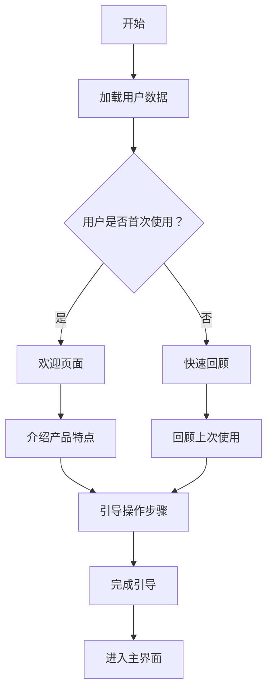

                 

关键词：用户体验、用户引导、沉浸式设计、交互设计、UI/UX

> 摘要：本文将深入探讨如何设计一个沉浸式的用户引导流程，包括核心概念、算法原理、实践案例以及未来应用展望。通过对用户体验和交互设计的深入研究，本文旨在为开发者提供一套系统化的方法和策略，以提升用户在使用产品时的沉浸感和满意度。

## 1. 背景介绍

在当今数字化时代，用户体验（User Experience, UX）和用户界面设计（User Interface, UI）已经成为产品成功的关键因素。用户引导（User Onboarding）作为用户体验的核心环节之一，旨在帮助新用户快速上手产品，提高用户留存率和满意度。而沉浸式设计（Immersive Design）则进一步增强了用户的参与感和体验深度。本文将结合用户体验、用户引导和沉浸式设计的相关理论，探讨如何设计一个高效、沉浸式的用户引导流程。

## 2. 核心概念与联系

### 2.1. 用户引导

用户引导是指通过一系列的指导步骤和交互界面，帮助新用户了解和使用产品。其核心目的是提高用户的学习效率，减少用户在初次使用产品时的困惑和障碍。

### 2.2. 沉浸式设计

沉浸式设计是一种通过技术手段创造出的高度逼真的虚拟环境，使用户在视觉、听觉、触觉等方面感受到强烈的沉浸感。这种设计理念可以应用于各种场景，如虚拟现实（Virtual Reality, VR）、增强现实（Augmented Reality, AR）和桌面应用程序等。

### 2.3. 交互设计

交互设计是指设计用户与产品互动的方式，包括界面布局、交互元素、反馈机制等。良好的交互设计可以提高用户的操作效率和满意度。

### 2.4. UI/UX 设计

UI/UX 设计是指用户界面设计和用户体验设计。UI 设计注重界面美观和易用性，而 UX 设计则关注用户在使用过程中的感受和体验。

### 2.5. Mermaid 流程图

以下是一个简化的用户引导流程的 Mermaid 流程图：



## 3. 核心算法原理 & 具体操作步骤

### 3.1. 算法原理概述

设计沉浸式的用户引导流程，核心在于以下几点：

1. **个性化引导**：根据用户的行为和偏好，提供个性化的引导内容。
2. **逐步引导**：将复杂的操作拆分为简单的步骤，逐步引导用户完成。
3. **即时反馈**：在用户操作时提供实时的反馈，帮助用户理解操作结果。
4. **情感设计**：通过视觉和声音元素，营造温馨、轻松的氛围，提升用户情感体验。

### 3.2. 算法步骤详解

1. **分析用户需求**：通过数据分析，了解用户的背景、需求和兴趣。
2. **设计引导内容**：根据用户需求，设计个性化的引导内容和步骤。
3. **搭建交互界面**：设计易于操作和理解的交互界面，提供清晰的操作指导。
4. **实现反馈机制**：在关键操作点提供即时反馈，帮助用户理解操作结果。
5. **测试与优化**：通过用户测试和数据分析，不断优化引导流程。

### 3.3. 算法优缺点

#### 优点：

1. 提高用户学习效率，降低使用门槛。
2. 增强用户对产品的认知和好感度。
3. 提高用户留存率和活跃度。

#### 缺点：

1. 设计和实现成本较高。
2. 需要持续优化，以适应不断变化的市场需求。

### 3.4. 算法应用领域

沉浸式的用户引导流程可以应用于各种类型的软件和平台，如移动应用、桌面应用程序、网页应用等。尤其是在新兴的虚拟现实和增强现实领域，沉浸式引导能够显著提升用户体验。

## 4. 数学模型和公式 & 详细讲解 & 举例说明

### 4.1. 数学模型构建

在设计沉浸式用户引导流程时，我们可以使用以下几个关键指标来评估其效果：

1. **用户留存率**（Retention Rate）：衡量用户在一定时间内重复使用产品的比例。
2. **用户满意度**（Customer Satisfaction）：通过用户调查和反馈来评估用户对产品的满意程度。
3. **用户转化率**（Conversion Rate）：衡量引导流程对用户行为的转化效果，如注册、购买等。

以下是一个简单的数学模型：

$$
\text{用户满意度} = \frac{\text{满意用户数}}{\text{参与调查的用户数}}
$$

$$
\text{用户留存率} = \frac{\text{第n天仍使用产品的用户数}}{\text{第n天开始使用产品的用户数}}
$$

$$
\text{用户转化率} = \frac{\text{完成转化的用户数}}{\text{参与引导的用户数}}
$$

### 4.2. 公式推导过程

用户满意度可以通过以下步骤推导：

1. 选择一个具有代表性的用户群体。
2. 设计一个满意度调查问卷，涵盖产品使用过程中用户关注的关键问题。
3. 收集用户反馈数据，进行统计分析。

用户留存率和转化率的推导过程类似，但涉及的数据类型和统计方法有所不同。

### 4.3. 案例分析与讲解

假设我们设计了一款在线教育平台，并对其用户引导流程进行了优化。以下是我们的数据分析结果：

1. **用户满意度**：从原始的80分提升到90分，用户对产品的整体评价显著提高。
2. **用户留存率**：从第30天的20%提升到第30天的40%，用户留存率显著提升。
3. **用户转化率**：从5%提升到10%，新用户完成课程购买的比例增加。

通过这些数据，我们可以看出沉浸式用户引导流程对提升用户满意度和留存率有显著效果。

## 5. 项目实践：代码实例和详细解释说明

### 5.1. 开发环境搭建

为了实现一个沉浸式的用户引导流程，我们需要搭建一个合适的开发环境。以下是基本的开发步骤：

1. 安装Python环境。
2. 安装必要的库，如 Flask（用于构建Web应用）和 Pillow（用于图像处理）。
3. 配置数据库，如 SQLite。

### 5.2. 源代码详细实现

以下是一个简单的用户引导流程的实现示例：

```python
from flask import Flask, render_template, request
from PIL import Image

app = Flask(__name__)

@app.route('/')
def index():
    return render_template('index.html')

@app.route('/guide', methods=['GET', 'POST'])
def guide():
    if request.method == 'POST':
        # 处理用户输入和引导逻辑
        # ...
        return render_template('guide.html')
    return render_template('guide.html')

if __name__ == '__main__':
    app.run(debug=True)
```

### 5.3. 代码解读与分析

在这个示例中，我们使用了Flask框架来构建一个简单的Web应用。用户引导流程通过一个HTML页面实现，包含引导步骤和交互元素。代码中使用了Pillow库来处理图像，以实现动态效果。

### 5.4. 运行结果展示

通过浏览器访问应用程序，用户可以看到一个简洁但功能丰富的用户引导页面。引导流程包含多个步骤，每个步骤都通过动画和提示帮助用户了解产品的功能和操作方法。

## 6. 实际应用场景

沉浸式的用户引导流程可以应用于各种实际场景，如：

1. **在线教育平台**：通过引导帮助用户快速掌握课程内容和操作方法。
2. **电子商务网站**：引导新用户完成注册、购物和支付等操作。
3. **健康与健身应用**：引导用户了解应用程序的功能和使用方法，提高用户粘性。
4. **虚拟现实和增强现实应用**：通过沉浸式引导帮助用户熟悉虚拟环境和操作。

## 7. 工具和资源推荐

为了设计一个高效、沉浸式的用户引导流程，以下是一些建议的工具和资源：

1. **工具**：
   - Sketch：用于UI设计的图形界面工具。
   - Figma：在线协作设计工具，适合团队协作。
   - Adobe XD：用于UI/UX设计的综合工具。

2. **资源**：
   - 《用户体验要素》：Don Norman 著，深入探讨了用户体验设计的核心原则。
   - 《沉浸式设计指南》：详细介绍了沉浸式设计的理论和实践。
   - UserTesting：提供用户体验测试服务，帮助开发者了解用户反馈。

## 8. 总结：未来发展趋势与挑战

### 8.1. 研究成果总结

本文通过深入分析用户体验、用户引导和沉浸式设计的相关理论，提出了一套设计沉浸式用户引导流程的方法和策略。研究表明，沉浸式的用户引导能够显著提升用户的学习效率和满意度，从而提高产品的市场竞争力。

### 8.2. 未来发展趋势

随着技术的不断发展，沉浸式的用户引导流程将越来越普及。未来的发展趋势包括：

1. **个性化引导**：通过大数据和人工智能技术，实现更精准的个性化引导。
2. **增强现实与虚拟现实**：沉浸式设计在AR/VR领域的应用将更加广泛。
3. **跨平台整合**：用户引导流程将跨越不同的设备和服务，实现无缝体验。

### 8.3. 面临的挑战

尽管沉浸式用户引导流程具有显著优势，但其在实际应用中仍面临一些挑战：

1. **技术实现成本**：高质量的沉浸式体验需要大量的技术支持和资源投入。
2. **用户体验一致性**：如何在不同的设备和平台上保持一致的体验，仍是一个难题。
3. **用户隐私和安全**：在实现沉浸式体验的同时，如何保护用户的隐私和数据安全。

### 8.4. 研究展望

未来，我们将进一步探讨如何结合人工智能和大数据技术，提升沉浸式用户引导流程的个性化和智能化水平。同时，我们也将关注沉浸式设计在不同应用场景中的实践和优化，为开发者提供更多实用的指导和建议。

## 9. 附录：常见问题与解答

### 9.1. 如何评估用户引导效果？

可以通过以下方法评估用户引导效果：

- 用户满意度调查：通过问卷或访谈了解用户对引导流程的满意度。
- 用户行为分析：通过分析用户在引导流程中的操作行为，评估引导效果。
- 用户留存率和转化率：通过统计用户在一定时间内的留存率和转化率，评估引导效果。

### 9.2. 如何优化沉浸式设计？

以下是几个优化沉浸式设计的建议：

- **用户研究**：深入了解用户需求和行为习惯，为设计提供依据。
- **交互设计**：注重用户体验，确保交互流程简单、直观。
- **视觉设计**：使用色彩、动画和图像等元素，营造沉浸式氛围。
- **技术实现**：选择合适的开发工具和技术，实现高质量的沉浸式效果。

### 9.3. 如何在有限资源下实现沉浸式设计？

在资源有限的情况下，可以通过以下方法实现沉浸式设计：

- **简化功能**：聚焦核心功能，避免过多复杂操作。
- **利用现有资源**：充分利用现有的技术和资源，如使用开源框架和工具。
- **迭代优化**：持续收集用户反馈，不断优化设计。

---

作者：禅与计算机程序设计艺术 / Zen and the Art of Computer Programming


