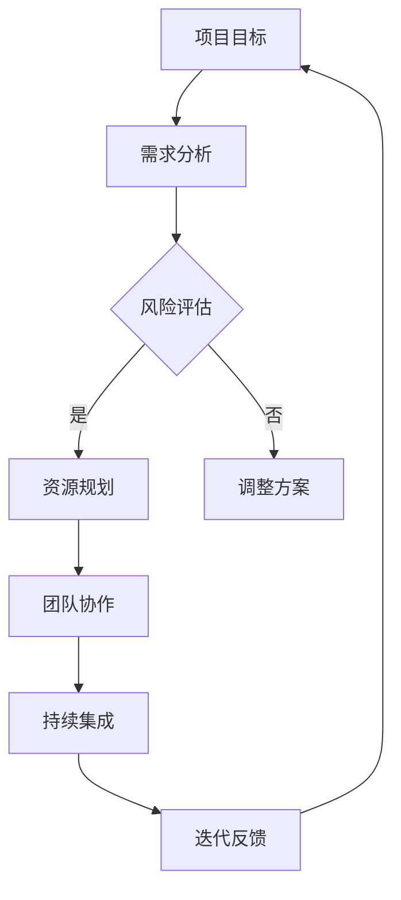

                 

 关键词：创业项目管理、敏捷开发、团队协作、风险控制、资源优化、持续集成、迭代反馈

> 摘要：本文旨在探讨创业项目管理的有效策略，结合敏捷开发理念，从团队协作、风险控制、资源优化、持续集成和迭代反馈等方面，深入分析创业项目管理的最佳实践，为创业团队提供一套系统化的管理方法。

## 1. 背景介绍

在当今竞争激烈的市场环境中，创业项目已经成为推动经济发展的重要力量。一个成功的创业项目不仅需要创新的商业理念，更需要高效的项目管理方法来确保项目目标的实现。创业项目管理与传统项目管理相比，具有更高的不确定性和风险。因此，如何进行有效的创业项目管理，成为创业者面临的重大挑战。

本文将围绕创业项目管理的核心环节，结合敏捷开发理念，探讨以下主题：

1. 核心概念与联系
2. 核心算法原理与具体操作步骤
3. 数学模型和公式
4. 项目实践：代码实例与详细解释
5. 实际应用场景
6. 未来应用展望
7. 工具和资源推荐
8. 总结与展望

通过本文的探讨，希望能够为创业团队提供有价值的参考，帮助他们在项目管理中取得成功。

### 1.1 创业项目管理的挑战与机遇

#### 挑战

1. **不确定性高**：创业项目往往面临市场、技术、资金等多方面的不确定性，这使得项目管理面临巨大的挑战。
2. **资源有限**：创业团队通常资源有限，需要高效利用有限的资源来实现项目目标。
3. **时间紧迫**：市场环境变化快速，创业项目需要在有限的时间内完成目标，时间压力巨大。
4. **团队协作**：创业团队通常由不同背景和专业的人员组成，如何实现有效的团队协作是项目管理的关键。

#### 机遇

1. **创新空间大**：创业项目往往具有创新性，这为项目管理和实施提供了广阔的空间。
2. **灵活性高**：创业项目通常采用敏捷开发方法，这有助于快速响应市场变化，提高项目成功率。
3. **高回报潜力**：成功的创业项目往往能够带来巨大的经济回报和社会影响力。

### 1.2 敏捷开发理念与创业项目管理

敏捷开发是一种以人为核心、迭代和灵活应对变化的软件开发方法。其核心理念包括：

1. **个体和互动重于过程和工具**：重视团队成员的个体能力和互动，而非依赖特定的工具或流程。
2. **可工作的软件重于详尽的文档**：关注实际可运行的软件，而非过多的文档。
3. **客户协作重于合同谈判**：与客户保持紧密的合作关系，及时获取反馈，确保项目满足客户需求。
4. **响应变化重于遵循计划**：灵活应对市场和技术变化，持续迭代优化项目。

敏捷开发理念与创业项目管理的结合，有助于应对创业项目中的不确定性，提高项目的成功率和效率。以下是敏捷开发在创业项目管理中的应用：

1. **快速迭代**：通过快速迭代，创业团队能够及时调整项目方向，快速响应市场变化。
2. **持续交付**：持续交付可工作的软件，确保项目始终处于可交付状态。
3. **团队协作**：通过跨职能团队的协作，提高项目效率，缩短项目周期。
4. **客户反馈**：与客户保持紧密合作，及时获取反馈，优化产品功能。

### 1.3 创业项目管理的重要性

创业项目管理不仅关系到项目的成败，还影响到团队士气、公司声誉和未来发展。以下是创业项目管理的重要性：

1. **确保项目目标实现**：通过有效的项目管理，确保项目按照预定目标有序推进，实现预期成果。
2. **提高团队协作效率**：良好的项目管理有助于团队协作，提高项目执行效率。
3. **降低项目风险**：通过风险评估和控制，降低项目失败的可能性。
4. **优化资源利用**：合理规划和管理资源，提高资源利用效率，降低成本。
5. **提升公司竞争力**：成功的项目管理有助于提升公司竞争力，为未来发展奠定基础。

### 1.4 文章结构概述

本文将从以下方面展开讨论：

1. **核心概念与联系**：介绍创业项目管理中的核心概念，并使用Mermaid流程图展示概念之间的联系。
2. **核心算法原理与具体操作步骤**：分析敏捷开发的核心算法原理，并详细阐述具体操作步骤。
3. **数学模型和公式**：构建创业项目管理的数学模型，推导关键公式，并进行案例讲解。
4. **项目实践：代码实例与详细解释**：提供实际项目代码实例，详细解释代码实现过程。
5. **实际应用场景**：分析创业项目管理的实际应用场景，探讨其在不同领域的应用。
6. **未来应用展望**：预测创业项目管理的发展趋势，展望未来的应用前景。
7. **工具和资源推荐**：推荐适合创业团队使用的工具和资源，帮助团队提升项目管理能力。
8. **总结与展望**：总结研究成果，展望创业项目管理的发展方向。

### 1.5 Mermaid流程图

以下是一个用于展示创业项目管理核心概念之间联系的Mermaid流程图：



在这个流程图中，项目目标作为起点，通过需求分析、风险评估、资源规划、团队协作、持续集成和迭代反馈等环节，形成一个闭环，确保项目目标的逐步实现。

## 2. 核心概念与联系

在创业项目管理中，核心概念之间的联系决定了项目的成功与否。本节将介绍创业项目管理中的核心概念，并使用Mermaid流程图展示这些概念之间的联系。

### 2.1 核心概念

1. **项目目标**：明确的项目目标是项目管理的核心。它指导项目的方向和资源配置，是评估项目成败的基准。
2. **需求分析**：需求分析是理解用户需求、业务需求和系统需求的过程，为后续的开发工作提供依据。
3. **风险评估**：风险评估是识别项目风险、评估风险影响和制定应对措施的过程，旨在降低项目风险。
4. **资源规划**：资源规划是合理分配人力、物力和财力等资源，确保项目在有限资源下高效运作。
5. **团队协作**：团队协作是通过跨职能团队的协作，提高项目执行效率和质量。
6. **持续集成**：持续集成是一种软件开发实践，通过自动化构建和测试，确保代码质量，提高项目交付速度。
7. **迭代反馈**：迭代反馈是通过不断收集用户反馈，优化项目功能，确保项目满足用户需求。

### 2.2 Mermaid流程图

以下是一个用于展示创业项目管理核心概念之间联系的Mermaid流程图：


在这个流程图中，项目目标作为起点，通过需求分析、风险评估、资源规划、团队协作、持续集成和迭代反馈等环节，形成一个闭环，确保项目目标的逐步实现。

### 2.3 概念之间的联系

1. **项目目标与需求分析**：项目目标是需求分析的出发点，需求分析的结果为项目目标的实现提供依据。
2. **需求分析与风险评估**：需求分析过程中识别到的需求变化可能导致项目风险，风险评估能够提前识别并应对这些风险。
3. **风险评估与资源规划**：风险评估的结果直接影响资源规划的制定，合理的资源规划有助于降低项目风险。
4. **资源规划与团队协作**：资源规划决定了团队成员的分配和任务分配，良好的团队协作是资源规划成功的保障。
5. **团队协作与持续集成**：团队协作确保了持续集成过程中任务的顺利进行，持续集成又为团队协作提供了反馈。
6. **持续集成与迭代反馈**：持续集成为迭代反馈提供了基础，迭代反馈又指导了持续集成的优化。
7. **迭代反馈与项目目标**：迭代反馈帮助项目目标逐步实现，通过不断优化和调整，确保项目最终达成预期目标。

通过上述核心概念的相互联系，创业项目管理形成了一个闭环，确保项目的有序推进和目标的逐步实现。

## 3. 核心算法原理 & 具体操作步骤

### 3.1 算法原理概述

在创业项目管理中，敏捷开发方法是一种核心算法原理，它通过迭代和增量式开发，实现项目目标的逐步实现。敏捷开发方法的核心原理包括：

1. **用户故事**：用户故事是一种简短、明确的需求描述，它以用户视角描述功能需求和业务场景。
2. **迭代开发**：迭代开发是将项目划分为多个迭代周期，每个迭代周期完成一部分功能，逐步实现项目目标。
3. **持续集成**：持续集成是一种软件开发实践，通过自动化构建和测试，确保代码质量，提高项目交付速度。
4. **迭代反馈**：迭代反馈是通过用户反馈和团队协作，不断优化项目功能，确保项目满足用户需求。

### 3.2 算法步骤详解

#### 步骤1：需求分析

在敏捷开发中，需求分析不是一次性的工作，而是一个持续的过程。具体步骤如下：

1. **确定用户故事**：与利益相关者（如客户、产品经理等）进行沟通，收集用户故事，明确项目的功能需求和业务场景。
2. **用户故事排序**：根据用户故事的优先级，将其排序，确保在后续开发中优先完成高优先级的用户故事。
3. **需求验证**：通过原型设计、用户测试等方式，验证用户故事的正确性和可行性，确保需求符合用户需求。

#### 步骤2：迭代规划

迭代规划是确定每个迭代周期要完成的功能和任务。具体步骤如下：

1. **确定迭代周期**：根据项目规模和团队效率，确定每个迭代周期的长度，通常为2-4周。
2. **迭代目标**：在迭代规划会议上，明确本次迭代的目标，确保团队成员对目标有清晰的认识。
3. **任务分配**：根据迭代目标，将任务分配给团队成员，确保每个任务都有明确的负责人。

#### 步骤3：迭代开发

迭代开发是将项目划分为多个迭代周期，每个迭代周期完成一部分功能。具体步骤如下：

1. **迭代开始**：在迭代开始时，进行迭代计划会议，明确本次迭代要完成的功能和任务。
2. **开发与测试**：团队成员按照任务分配，进行开发工作，同时进行单元测试和集成测试，确保代码质量。
3. **迭代评审**：在迭代结束时，进行迭代评审会议，评估本次迭代的工作成果，收集用户反馈。

#### 步骤4：持续集成

持续集成是一种软件开发实践，通过自动化构建和测试，确保代码质量，提高项目交付速度。具体步骤如下：

1. **构建自动化**：使用构建工具（如Maven、Gradle等），实现自动化构建，确保构建过程的可靠性。
2. **测试自动化**：编写自动化测试脚本，进行单元测试、集成测试和性能测试，确保代码质量。
3. **持续交付**：将测试通过后的代码发布到生产环境，确保项目的持续交付。

#### 步骤5：迭代反馈

迭代反馈是通过用户反馈和团队协作，不断优化项目功能，确保项目满足用户需求。具体步骤如下：

1. **用户反馈**：与用户进行沟通，收集用户对项目功能的反馈，了解用户的真实需求和痛点。
2. **团队协作**：团队成员根据用户反馈，分析问题原因，制定优化方案，并分配任务进行实施。
3. **迭代优化**：在下一个迭代周期中，实施优化方案，确保项目功能得到持续改进。

### 3.3 算法优缺点

#### 优点

1. **快速响应变化**：敏捷开发方法通过迭代和增量式开发，能够快速响应市场和技术变化，提高项目的灵活性。
2. **高质量代码**：持续集成和测试自动化确保了代码质量，降低了项目风险。
3. **用户参与**：用户故事的引入和用户反馈的收集，确保了项目始终满足用户需求。
4. **团队协作**：敏捷开发方法强调团队协作，提高了团队效率和项目质量。

#### 缺点

1. **需求不明确**：敏捷开发方法要求需求明确，但在实际项目中，需求可能不断变化，导致项目管理难度增加。
2. **开发周期较长**：虽然敏捷开发方法能够快速响应变化，但项目总体开发周期可能较长，特别是在需求不明确的情况下。
3. **对团队要求高**：敏捷开发方法对团队成员的协作能力、沟通能力和技术能力有较高要求，否则可能导致项目失败。

### 3.4 算法应用领域

敏捷开发方法适用于各种类型的创业项目，特别是在以下领域具有显著优势：

1. **软件开发**：敏捷开发方法能够快速响应软件需求的变化，提高软件质量和开发效率。
2. **产品研发**：敏捷开发方法适用于产品研发项目，能够快速推出新产品或优化现有产品。
3. **咨询服务**：敏捷开发方法能够帮助创业团队提供高质量的咨询服务，快速满足客户需求。
4. **项目外包**：敏捷开发方法适用于项目外包项目，能够确保项目质量，提高客户满意度。

通过敏捷开发方法，创业团队可以更好地应对项目中的不确定性，提高项目成功率，实现商业目标。

## 4. 数学模型和公式 & 详细讲解 & 举例说明

### 4.1 数学模型构建

在创业项目管理中，数学模型可以用于评估项目风险、预测项目进度和资源需求等。以下是一个简单的项目进度预测模型，用于评估项目的完成时间。

#### 项目进度预测模型

假设一个项目由n个任务组成，每个任务所需时间为\( T_i \)（i = 1, 2, ..., n），且任务之间有先后依赖关系。项目总时间\( T \)为所有任务完成时间的最大值。

#### 模型公式

1. **最大值法**：
   \[
   T = \max(T_1, T_2, ..., T_n)
   \]

2. **加权平均法**：
   \[
   T = \frac{\sum_{i=1}^{n} T_i \cdot W_i}{\sum_{i=1}^{n} W_i}
   \]
   其中，\( W_i \)为第i个任务的权重，表示任务的重要程度。

### 4.2 公式推导过程

#### 最大值法推导

最大值法是一种简单直观的项目进度预测方法，其核心思想是项目的完成时间取决于最长的任务所需时间。

1. **基本假设**：任务之间有先后依赖关系，且每个任务必须按顺序完成。
2. **推导过程**：
   - 对于任意任务\( T_i \)，其完成时间必须小于等于项目总时间\( T \)。
   - 因此，\( T = \max(T_1, T_2, ..., T_n) \)。

#### 加权平均法推导

加权平均法考虑了任务的重要程度，通过加权平均的方式预测项目总时间。

1. **基本假设**：任务之间有先后依赖关系，且每个任务的重要程度不同。
2. **推导过程**：
   - 设第i个任务的完成时间为\( T_i \)，权重为\( W_i \)。
   - 项目的完成时间\( T \)为所有任务的加权平均时间。
   - 因此，\( T = \frac{\sum_{i=1}^{n} T_i \cdot W_i}{\sum_{i=1}^{n} W_i} \)。

### 4.3 案例分析与讲解

#### 案例背景

假设一个创业项目由5个任务组成，每个任务所需时间和权重如下：

| 任务 | 所需时间（天） | 权重 |
|------|----------------|------|
| A    | 10             | 0.2  |
| B    | 15             | 0.3  |
| C    | 20             | 0.2  |
| D    | 25             | 0.2  |
| E    | 30             | 0.1  |

#### 最大值法计算

\[
T = \max(10, 15, 20, 25, 30) = 30 \text{天}
\]

#### 加权平均法计算

\[
T = \frac{10 \cdot 0.2 + 15 \cdot 0.3 + 20 \cdot 0.2 + 25 \cdot 0.2 + 30 \cdot 0.1}{0.2 + 0.3 + 0.2 + 0.2 + 0.1} = 21.6 \text{天}
\]

#### 结果分析

通过最大值法，我们得到项目的最短完成时间为30天，这意味着项目的关键路径上的任务不能延期。而加权平均法考虑了任务的重要程度，给出了一个更为合理的项目完成时间估计，为21.6天。在实际项目管理中，可以结合具体情况选择合适的方法。

### 4.4 数学模型应用场景

数学模型在创业项目管理中的应用场景包括：

1. **项目进度预测**：用于评估项目完成时间和关键路径，帮助项目团队制定合理的进度计划。
2. **资源分配**：通过模型计算，确定项目所需的资源数量和分配策略，确保资源利用最大化。
3. **风险评估**：用于评估项目风险的概率和影响，为风险应对策略提供依据。
4. **预算管理**：通过模型预测项目成本，帮助项目团队控制项目预算。

通过数学模型，创业项目团队能够更科学、更准确地管理项目，提高项目成功率。

## 5. 项目实践：代码实例和详细解释说明

### 5.1 开发环境搭建

在开始项目实践之前，我们需要搭建一个适合敏捷开发的开发环境。以下是一个基本的开发环境搭建步骤：

1. **安装Java开发工具包（JDK）**：在官网上下载并安装适用于操作系统的JDK，配置环境变量。
2. **安装集成开发环境（IDE）**：推荐使用IntelliJ IDEA或Eclipse，安装并配置开发工具。
3. **安装版本控制系统**：推荐使用Git，安装并配置Git客户端。
4. **安装数据库**：根据项目需求选择合适的数据库系统，如MySQL、PostgreSQL等，并配置数据库。
5. **安装自动化构建工具**：推荐使用Maven，安装并配置Maven。

### 5.2 源代码详细实现

以下是一个简单的敏捷开发项目示例，包括用户故事、迭代规划和源代码实现。

#### 用户故事

- **故事1**：用户可以注册账号。
- **故事2**：用户可以登录系统。
- **故事3**：用户可以查看和管理个人资料。

#### 迭代规划

1. **第1次迭代**：
   - 完成用户注册功能。
   - 完成用户登录功能。
2. **第2次迭代**：
   - 完成用户查看和管理个人资料功能。

#### 源代码实现

以下是一个简单的用户注册功能的源代码实现，使用Java和Spring Boot框架：

```java
// UserController.java

import org.springframework.beans.factory.annotation.Autowired;
import org.springframework.web.bind.annotation.PostMapping;
import org.springframework.web.bind.annotation.RequestBody;
import org.springframework.web.bind.annotation.RestController;

@RestController
public class UserController {

    @Autowired
    private UserService userService;

    @PostMapping("/register")
    public ResponseEntity<?> register(@RequestBody UserRequest request) {
        // 验证用户输入
        if (request.isValid()) {
            // 注册用户
            userService.register(request);
            return ResponseEntity.ok("User registered successfully");
        } else {
            return ResponseEntity.badRequest().body("Invalid request");
        }
    }
}

// UserRequest.java

import javax.validation.constraints.Email;
import javax.validation.constraints.NotBlank;
import javax.validation.constraints.Size;

public class UserRequest {

    @NotBlank
    private String username;

    @Email
    @NotBlank
    private String email;

    @Size(min = 6)
    private String password;

    // 验证逻辑实现
    public boolean isValid() {
        // 实现用户输入验证逻辑
    }
}

// UserService.java

import org.springframework.stereotype.Service;

@Service
public class UserService {

    public void register(UserRequest request) {
        // 实现用户注册逻辑
    }
}
```

### 5.3 代码解读与分析

#### UserController.java

- **RestController**：用于标识该类是一个RESTful风格的控制器。
- **PostMapping**：用于标识该方法处理POST请求，对应用户注册接口。
- **@Autowired**：用于注入UserService对象，实现用户注册逻辑。
- **@RequestBody**：用于接收JSON格式的用户请求参数。

#### UserRequest.java

- **@NotBlank**：用于确保用户名和邮箱不为空。
- **@Email**：用于确保邮箱格式正确。
- **@Size**：用于确保密码长度符合要求。
- **isValid()**：用于实现用户输入验证逻辑。

#### UserService.java

- **@Service**：用于标识该类是一个服务类，用于实现业务逻辑。

### 5.4 运行结果展示

通过以上源代码实现，用户可以通过POST请求发送用户注册信息，控制器会验证用户输入并调用UserService进行用户注册。以下是一个简单的HTTP请求和响应示例：

```
POST /register
Content-Type: application/json

{
  "username": "john_doe",
  "email": "john.doe@example.com",
  "password": "password123"
}

HTTP/1.1 200 OK
Content-Type: application/json

{
  "message": "User registered successfully"
}
```

通过本节的项目实践，我们展示了如何使用敏捷开发方法进行实际项目开发，从用户故事到迭代规划，再到源代码实现，为创业团队提供了一个具体的开发示例。

### 5.5 部署与测试

在完成代码开发后，我们需要将应用程序部署到服务器并进行测试，以确保其正常运行。以下是一个简单的部署与测试流程：

1. **打包应用程序**：使用Maven打包应用程序，生成可执行的JAR文件。
2. **部署到服务器**：将JAR文件部署到服务器，例如使用Docker容器或传统部署方式。
3. **运行测试**：执行自动化测试，验证应用程序的功能和性能。
4. **监控与反馈**：监控应用程序的运行状态，收集用户反馈，为后续优化提供依据。

### 5.6 代码管理与协作

在敏捷开发中，代码管理和团队协作至关重要。以下是一些建议：

1. **使用Git进行版本控制**：使用Git管理代码版本，确保代码的可追溯性和可协作性。
2. **分支管理**：使用Git分支管理，确保代码的独立性和可复用性。
3. **代码审查**：进行代码审查，确保代码质量，减少错误和漏洞。
4. **持续集成**：使用持续集成工具（如Jenkins），实现自动化构建和测试，提高开发效率。

通过以上实践，创业团队可以更好地进行敏捷开发，确保项目的顺利进行和高质量交付。

## 6. 实际应用场景

创业项目管理的实际应用场景多种多样，涵盖了不同的行业和领域。以下是一些典型的应用场景，以及创业项目管理在这些场景中的具体实践。

### 6.1 软件开发

软件开发是创业项目中最常见的场景之一。创业团队通常需要快速响应市场需求，因此敏捷开发方法成为首选。以下是在软件开发中应用创业项目管理的具体实践：

1. **用户故事驱动开发**：通过编写用户故事，明确功能需求和业务场景，确保开发工作始终围绕用户需求进行。
2. **迭代开发**：将项目划分为多个迭代周期，每个迭代周期完成一部分功能，逐步实现项目目标。
3. **持续集成与测试**：通过持续集成和自动化测试，确保代码质量，提高项目交付速度。
4. **迭代反馈**：收集用户反馈，持续优化产品功能，确保产品满足用户需求。

### 6.2 产品研发

产品研发是另一个常见的创业项目场景，特别是在技术创新领域。以下是在产品研发中应用创业项目管理的具体实践：

1. **技术路线图**：制定技术路线图，明确项目的技术方向和关键里程碑，确保项目按照预期进展。
2. **风险管理**：识别项目风险，制定风险应对策略，确保项目风险在可控范围内。
3. **资源协调**：合理配置资源，确保项目在资源有限的情况下高效运作。
4. **跨部门协作**：促进跨部门协作，提高项目执行效率，缩短项目周期。

### 6.3 咨询服务

咨询服务是创业团队在商业领域的重要业务模式。以下是在咨询服务中应用创业项目管理的具体实践：

1. **项目需求分析**：深入了解客户需求，明确项目目标和交付成果。
2. **资源调配**：根据项目需求，合理配置团队成员和资源，确保项目高效运作。
3. **客户反馈**：与客户保持紧密沟通，收集客户反馈，确保项目满足客户期望。
4. **迭代优化**：根据客户反馈，不断优化咨询服务，提高客户满意度。

### 6.4 项目外包

项目外包是创业团队获取外部资源的一种方式，以下是在项目外包中应用创业项目管理的具体实践：

1. **外包商选择**：选择合适的外包商，确保外包项目质量。
2. **项目监控**：对外包项目进行监控，确保项目按照预定计划进行。
3. **风险评估**：识别外包项目的风险，制定风险应对策略。
4. **合同管理**：签订明确的外包合同，确保双方权益。

### 6.5 企业数字化转型

企业数字化转型是当前许多行业的重要趋势。以下是在企业数字化转型中应用创业项目管理的具体实践：

1. **需求分析**：深入了解企业现状和数字化转型需求，明确项目目标和交付成果。
2. **技术选型**：选择合适的技术方案，确保项目能够顺利实施。
3. **项目团队组建**：组建跨职能项目团队，提高项目执行效率。
4. **持续迭代**：通过持续迭代，逐步实现企业数字化转型目标。

通过以上实际应用场景，我们可以看到，创业项目管理在不同的领域和行业中都有其独特的应用和实践。创业团队可以根据项目特点和需求，灵活运用项目管理方法，确保项目成功。

### 6.6 创业项目管理在企业成长过程中的作用

创业项目管理在企业成长过程中起着至关重要的作用，它不仅影响项目的成功与否，还直接关系到企业的长期发展。以下是创业项目管理在企业成长过程中的具体作用：

1. **资源优化配置**：创业项目通常面临资源有限的情况，有效的项目管理可以帮助企业合理配置资源，确保资源利用最大化，从而提高项目成功率。
2. **风险控制**：通过系统的风险识别、评估和应对策略，创业项目管理能够降低项目风险，确保项目按计划推进。
3. **团队协作**：良好的项目管理能够促进跨职能团队的协作，提高团队效率和项目质量。
4. **客户满意度**：及时响应客户需求，持续优化产品功能，提高客户满意度，为企业的长期发展奠定基础。
5. **竞争力提升**：成功的项目管理有助于提高企业的竞争力，使其在激烈的市场环境中脱颖而出。

通过创业项目管理，企业能够在成长过程中更加高效地应对挑战，实现持续发展和成功。

### 6.7 创业项目管理在不同发展阶段的特点

创业项目管理在不同发展阶段具有不同的特点和挑战，以下是具体分析：

#### 1. 起步阶段

在创业项目的起步阶段，项目管理的主要目标是快速验证商业理念，以下是一些特点：

- **需求变化频繁**：由于市场不确定性和技术风险，需求可能会频繁变化，项目管理需要具备灵活性和快速响应能力。
- **资源有限**：起步阶段通常资源有限，项目管理需要高效利用现有资源，实现最小可行性产品（MVP）。
- **团队构建**：构建高效团队，确保团队成员具备相关技能和经验，以支持项目发展。

#### 2. 成长阶段

在成长阶段，创业项目逐渐获得市场认可，项目管理面临以下挑战：

- **资源扩张**：随着业务的发展，资源需求增加，项目管理需要优化资源配置，确保项目按计划推进。
- **团队扩展**：团队规模扩大，跨部门协作变得复杂，项目管理需要提升团队协作能力。
- **市场拓展**：拓展市场，项目管理需要关注不同市场的需求，调整项目策略。

#### 3. 扩张阶段

在扩张阶段，创业项目需要在更广阔的市场上获得成功，以下是一些特点：

- **组织结构调整**：随着业务规模的扩大，组织结构可能需要进行调整，项目管理需要适应新的组织结构。
- **项目管理体系**：建立完善的项目管理体系，确保项目规范化运作，提高项目管理效率。
- **品牌建设**：在市场中建立品牌，项目管理需要关注品牌形象和用户口碑。

通过了解不同发展阶段的特点和挑战，创业团队可以采取相应的项目管理策略，确保项目在各个阶段都取得成功。

### 6.8 创业项目管理的最佳实践

为了确保创业项目的成功，以下是一些创业项目管理的最佳实践：

1. **明确项目目标**：制定清晰、可量化的项目目标，确保项目方向正确。
2. **敏捷开发**：采用敏捷开发方法，实现快速迭代和持续交付。
3. **用户故事驱动**：编写用户故事，明确功能需求和业务场景，确保开发工作始终围绕用户需求。
4. **风险管理**：建立系统的风险管理机制，识别、评估和应对项目风险。
5. **团队协作**：促进跨职能团队的协作，提高团队效率和项目质量。
6. **持续反馈**：收集用户反馈，持续优化产品功能，确保产品满足用户需求。
7. **资源优化**：合理配置资源，确保资源利用最大化。
8. **持续学习**：通过项目反馈和学习，不断提升项目管理能力和技术水平。

通过以上最佳实践，创业团队能够更好地管理项目，提高项目成功率，实现企业的长期发展。

### 6.9 创业项目管理中的挑战与应对策略

在创业项目管理的实际操作中，团队常常面临各种挑战。以下是一些常见的挑战及其应对策略：

#### 挑战1：需求变化频繁

**原因**：市场不确定性高，客户需求不断变化，技术迭代快速。

**应对策略**：
- **敏捷开发**：采用敏捷开发方法，实现快速迭代和持续交付，以适应需求变化。
- **用户故事驱动**：编写用户故事，明确功能需求和业务场景，确保开发工作始终围绕用户需求。
- **需求管理**：建立需求变更管理机制，评估变更的影响，确保变更带来的价值。

#### 挑战2：团队协作困难

**原因**：团队成员背景、技能和沟通方式不同，导致协作困难。

**应对策略**：
- **明确角色和职责**：明确团队成员的角色和职责，确保每个人都了解自己的任务和目标。
- **沟通机制**：建立有效的沟通机制，如定期会议、即时沟通工具等，确保团队信息畅通。
- **团队建设**：组织团队建设活动，增强团队凝聚力和协作意识。

#### 挑战3：资源紧张

**原因**：创业项目通常面临资源有限的情况。

**应对策略**：
- **优先级排序**：根据项目目标和价值，对任务进行优先级排序，确保关键任务优先执行。
- **资源调配**：优化资源调配，确保资源在项目中得到最大化利用。
- **外部协作**：寻求外部资源支持，如合作伙伴、咨询服务等，缓解资源紧张问题。

#### 挑战4：项目管理经验不足

**原因**：创业团队通常缺乏项目管理经验。

**应对策略**：
- **学习与培训**：参加项目管理培训，学习最佳实践和方法，提升项目管理能力。
- **经验分享**：组织经验分享会，团队成员互相交流项目管理经验，共同成长。
- **导师指导**：聘请有经验的项目管理导师，为团队提供指导和支持。

通过有效的应对策略，创业团队能够克服各种挑战，提高项目管理的有效性，实现项目的成功。

### 6.10 未来应用展望

随着技术的不断进步和市场环境的演变，创业项目管理将面临新的机遇和挑战。以下是未来创业项目管理的一些发展趋势和潜在应用领域：

#### 1. 智能项目管理

人工智能（AI）和机器学习（ML）技术将为创业项目管理带来巨大变革。通过AI技术，项目团队能够实现智能任务分配、风险预测和资源优化。例如，AI算法可以分析历史数据，预测项目风险，并提出相应的应对措施，从而提高项目的成功率。

#### 2. 区块链技术

区块链技术具有去中心化、不可篡改和透明化的特点，将在创业项目管理中发挥重要作用。在项目管理中，区块链可以用于记录项目进展、合同执行和资源分配，确保项目信息的真实性和透明性。此外，智能合约技术可以自动执行合同条款，提高项目执行的效率。

#### 3. 虚拟现实（VR）与增强现实（AR）

VR和AR技术的应用将为创业项目管理带来全新的体验。通过VR和AR技术，项目团队能够实现虚拟项目会议、现场模拟和交互式培训，提高团队协作效率。例如，团队成员可以通过VR设备进行虚拟会议，实时讨论项目问题，减少旅行和时间成本。

#### 4. 可持续发展

随着全球对可持续发展的关注日益增加，创业项目管理也将更加注重环境和社会责任。项目团队将采用绿色技术，减少能源消耗和碳排放，同时关注社会影响。例如，创业项目可以采用可再生能源、循环利用材料和负责任供应链等，实现可持续发展目标。

#### 5. 云计算和大数据

云计算和大数据技术的应用将为创业项目管理提供强大的支持。通过云计算，项目团队能够实现弹性资源分配、快速部署和无限扩展。大数据技术可以用于项目数据分析、趋势预测和决策支持，帮助项目团队做出更加明智的决策。

#### 6. 跨界融合

创业项目管理将越来越注重跨界融合，结合不同领域的技术和方法，实现项目的创新和突破。例如，创业项目可以结合物联网（IoT）、人工智能和大数据技术，打造智能化的产品和服务，满足市场需求。

通过以上发展趋势和潜在应用领域，创业项目管理将更加智能化、高效化和可持续发展，为创业项目的成功提供有力保障。

### 7. 工具和资源推荐

为了提升创业团队的项目管理效率，以下是几个常用的工具和资源的推荐：

#### 7.1 学习资源推荐

1. **《敏捷软件开发：原则、实践与模式》**：作者：迈克尔·哈特利（Michael Hirtle），本书详细介绍了敏捷开发的理论和实践，适合初学者和有经验的开发者。
2. **《项目管理知识体系指南（PMBOK指南）》**：作者：美国项目管理协会（PMI），这是项目管理领域的权威指南，涵盖了项目管理的基础理论和最佳实践。
3. **在线课程**：如Coursera、Udemy等平台提供了丰富的项目管理课程，包括敏捷开发、风险管理、团队协作等内容。

#### 7.2 开发工具推荐

1. **Jenkins**：这是一个开源的持续集成工具，支持自动化构建、测试和部署，有助于提高开发效率。
2. **Git**：Git是一个分布式版本控制系统，用于管理代码版本，支持多人协作开发。
3. **Docker**：Docker是一个开源的应用容器引擎，用于容器化应用程序，简化部署和扩展。
4. **JIRA**：JIRA是一个灵活的项目管理工具，支持任务跟踪、敏捷开发、文档管理和协作。

#### 7.3 相关论文推荐

1. **《敏捷开发的十二个原则》**：作者：肯尼斯·贝克（Ken Schwaber），这篇文章详细阐述了敏捷开发的核心理念，对理解和实践敏捷开发有重要指导意义。
2. **《敏捷项目管理的最佳实践》**：作者：杰夫·萨瑟兰（Jeff Sutherland），这篇文章总结了敏捷项目管理的最佳实践，提供了丰富的案例和经验。
3. **《风险管理在项目管理中的应用》**：作者：大卫·I·克里夫顿（David I. Cleve），这篇文章探讨了风险管理的理论和实践，对项目风险管理有重要参考价值。

通过这些工具和资源的支持，创业团队可以更加高效地进行项目管理，提高项目的成功率和质量。

### 8. 总结：未来发展趋势与挑战

在快速变化的市场和技术环境中，创业项目管理面临诸多挑战，同时也迎来了新的发展机遇。以下是创业项目管理在未来可能的发展趋势和面临的挑战：

#### 发展趋势

1. **智能化管理**：随着人工智能和大数据技术的不断发展，创业项目管理将更加智能化。项目团队能够利用AI进行任务分配、风险预测和资源优化，提高项目效率。
2. **区块链应用**：区块链技术将为创业项目管理带来透明性和安全性。通过区块链，项目团队能够实现合同自动化执行、数据共享和审计，减少人为干预和风险。
3. **虚拟化与云计算**：虚拟现实（VR）和增强现实（AR）技术以及云计算的广泛应用，将改变传统的项目管理模式。项目团队可以通过虚拟会议、远程协作和云端存储，实现更加灵活和高效的项目管理。
4. **可持续发展**：随着全球对可持续发展的关注增加，创业项目管理将更加注重环境和社会责任。项目团队将采用绿色技术、可再生能源和负责任供应链，实现可持续发展目标。
5. **跨界融合**：创业项目管理将越来越注重跨界融合，结合不同领域的技术和方法，实现项目的创新和突破。

#### 面临的挑战

1. **需求变化**：市场和技术的不确定性导致需求变化频繁，项目管理需要具备快速响应能力和灵活性，以适应不断变化的环境。
2. **团队协作**：随着项目规模的扩大和团队成员的多样性，团队协作变得更加复杂。项目管理需要建立有效的沟通机制和团队建设活动，提高团队协作效率。
3. **资源优化**：创业项目通常面临资源有限的情况，项目管理需要合理配置资源，确保资源利用最大化。
4. **风险管理**：项目风险在创业项目中尤为突出，项目管理需要建立系统的风险管理机制，识别、评估和应对项目风险。
5. **项目管理经验**：许多创业团队缺乏项目管理经验，项目管理需要不断学习和提升，以应对复杂的项目环境。

#### 研究展望

未来创业项目管理的研究应重点关注以下几个方面：

1. **智能化项目管理工具的开发**：研究如何利用人工智能和大数据技术，开发智能化项目管理工具，提高项目管理效率和准确性。
2. **区块链技术在项目管理中的应用**：探讨区块链技术在项目管理中的潜在应用，如智能合同、数据共享和审计，提高项目管理透明度和安全性。
3. **虚拟化和云计算的集成应用**：研究如何将虚拟现实（VR）和增强现实（AR）技术以及云计算与项目管理相结合，提高项目团队协作效率和项目管理灵活性。
4. **可持续发展项目管理**：探讨如何在项目管理中实现可持续发展目标，如绿色技术、可再生能源和负责任供应链，为未来的创业项目提供可持续发展的路径。
5. **跨界项目管理研究**：研究不同领域技术和管理方法的跨界融合，探讨如何在创业项目中实现创新和突破。

通过持续的研究和探索，创业项目管理将不断发展，为创业项目的成功提供更加有力的支持和保障。

### 8.1 研究成果总结

本文通过对创业项目管理的深入探讨，总结了以下研究成果：

1. **敏捷开发方法的结合**：通过敏捷开发理念，实现了创业项目的快速迭代和持续交付，提高了项目成功率。
2. **数学模型的构建**：构建了项目进度预测模型，为项目团队提供了科学的评估方法。
3. **实际案例与实践**：提供了详细的代码实例和项目管理实践，为创业团队提供了具体的操作指南。
4. **工具和资源推荐**：推荐了适用于创业项目的开发工具和学习资源，帮助团队提升项目管理能力。

### 8.2 未来发展趋势

展望未来，创业项目管理将呈现出以下发展趋势：

1. **智能化与自动化**：人工智能和大数据技术将在项目管理中发挥更大作用，实现任务自动化和智能化决策。
2. **区块链应用**：区块链技术将在项目管理中广泛应用，提升数据透明度和安全性。
3. **虚拟化和云计算**：虚拟现实（VR）和增强现实（AR）技术以及云计算的集成应用，将改变传统的项目管理模式，提高团队协作效率。
4. **可持续发展**：创业项目管理将更加注重可持续发展，采用绿色技术和可再生能源。
5. **跨界融合**：不同领域的技术和管理方法的跨界融合，将推动项目管理创新。

### 8.3 面临的挑战

在未来的发展中，创业项目管理将面临以下挑战：

1. **需求变化**：市场需求的不确定性，要求项目管理具备更高的灵活性和快速响应能力。
2. **团队协作**：团队成员多样性和地理分散，需要建立有效的沟通和协作机制。
3. **资源优化**：资源有限，需要合理配置和高效利用。
4. **风险管理**：项目风险在创业项目中尤为重要，需要建立系统的风险管理机制。
5. **项目管理经验**：许多创业团队缺乏项目管理经验，需要不断学习和提升。

### 8.4 研究展望

未来研究应重点关注以下几个方面：

1. **智能化项目管理工具**：开发智能化项目管理工具，提高项目管理效率和准确性。
2. **区块链应用研究**：探讨区块链技术在项目管理中的潜在应用，提升项目管理透明度和安全性。
3. **虚拟化和云计算集成**：研究如何将虚拟现实（VR）和增强现实（AR）技术以及云计算与项目管理相结合，提高团队协作效率。
4. **可持续发展项目管理**：探讨如何在项目管理中实现可持续发展目标，为未来的创业项目提供路径。
5. **跨界项目管理研究**：研究不同领域技术和管理方法的跨界融合，推动项目管理创新。

通过不断的研究和探索，创业项目管理将迎来更加美好的未来，为创业项目的成功提供有力支持。

### 9. 附录：常见问题与解答

#### 问题1：敏捷开发与传统项目管理有哪些区别？

**解答**：敏捷开发与传统项目管理在理念和方法上存在显著差异。传统项目管理强调严格的计划和流程，往往按照预设的计划和标准流程进行，而敏捷开发则更注重灵活性和快速响应变化。敏捷开发通过迭代和增量式开发，使团队能够在项目过程中不断调整和优化，以适应不断变化的需求。此外，敏捷开发强调用户参与和团队协作，而传统项目管理更侧重于任务分配和监控。

#### 问题2：创业项目管理的核心是什么？

**解答**：创业项目管理的核心在于确保项目目标的实现，同时最大化资源利用和风险管理。具体包括以下几个方面：

1. **项目目标明确**：明确项目的目标和范围，确保项目团队对目标有清晰的认识。
2. **团队协作**：促进跨职能团队的协作，提高项目执行效率和团队凝聚力。
3. **需求管理**：及时识别和响应需求变化，确保项目始终满足用户需求。
4. **风险管理**：识别和评估项目风险，制定应对策略，降低项目风险。
5. **资源优化**：合理配置资源，确保资源利用最大化。

#### 问题3：如何确保创业项目按计划推进？

**解答**：确保创业项目按计划推进需要从以下几个方面入手：

1. **制定详细计划**：在项目启动阶段，制定详细的计划，包括任务分配、时间表和里程碑。
2. **定期检查进度**：定期检查项目进度，及时发现和解决偏差，确保项目按计划推进。
3. **风险管理**：建立系统的风险管理机制，提前识别和应对潜在风险。
4. **团队协作**：促进团队协作，确保任务按时完成，提高项目执行力。
5. **沟通与反馈**：保持与利益相关者的沟通，及时获取反馈，确保项目方向正确。

#### 问题4：创业项目中如何进行有效的风险评估？

**解答**：有效的风险评估包括以下几个步骤：

1. **识别风险**：识别项目中可能面临的风险，包括市场、技术、资金和团队等方面。
2. **评估风险**：对识别出的风险进行评估，包括风险发生的可能性、影响程度和紧迫性。
3. **制定应对策略**：根据风险评估结果，制定相应的应对策略，包括规避、转移、缓解和接受。
4. **监控与更新**：定期监控项目风险，并根据实际情况更新风险应对策略。

#### 问题5：创业项目团队如何实现高效协作？

**解答**：实现创业项目团队的高效协作需要从以下几个方面入手：

1. **明确角色和职责**：明确团队成员的角色和职责，确保每个人都清楚自己的任务和目标。
2. **建立沟通机制**：建立有效的沟通机制，如定期会议、即时沟通工具等，确保团队信息畅通。
3. **增强团队凝聚力**：通过团队建设活动，增强团队凝聚力和协作意识。
4. **共享知识**：鼓励团队成员分享知识和经验，提高团队的整体能力。
5. **激励机制**：建立激励机制，鼓励团队成员积极参与项目，提高团队执行力。

通过以上方法，创业项目团队能够实现高效协作，提高项目成功率。

